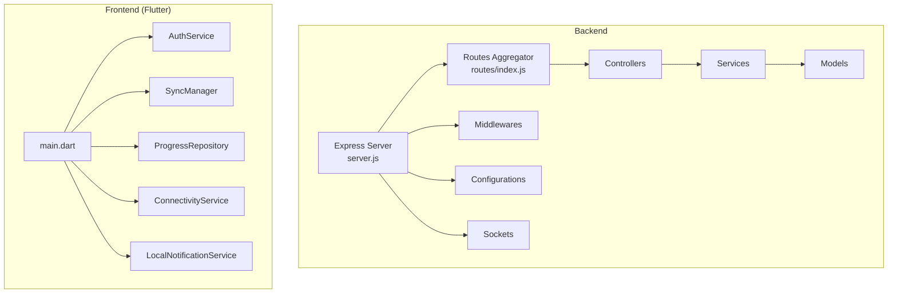
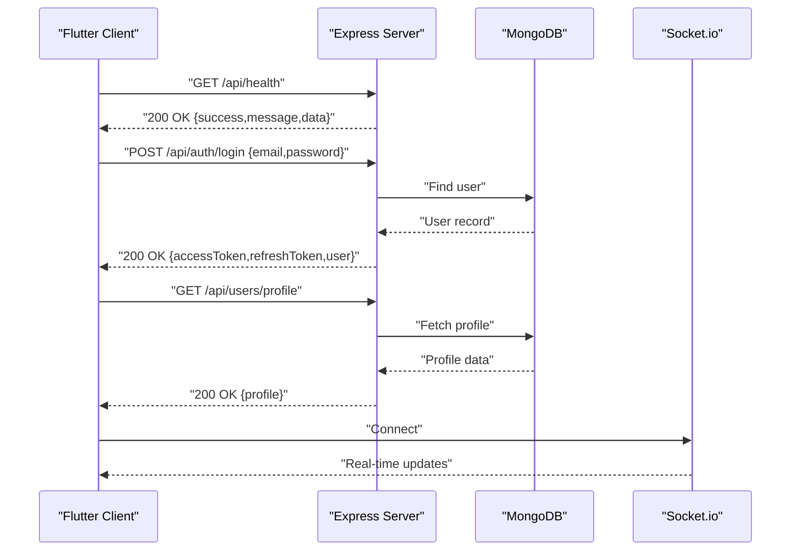
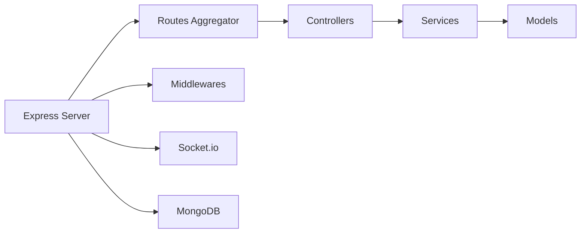

# API Reference

<cite>
**Referenced Files in This Document**
- [server.js](file://backend/server.js)
- [index.js](file://backend/src/routes/index.js)
- [authRoutes.js](file://backend/src/routes/authRoutes.js)
- [userRoutes.js](file://backend/src/routes/userRoutes.js)
- [lessonRoutes.js](file://backend/src/routes/lessonRoutes.js)
- [progressRoutes.js](file://backend/src/routes/progressRoutes.js)
- [gameProgressRoutes.js](file://backend/src/routes/gameProgressRoutes.js)
- [authController.js](file://backend/src/controllers/authController.js)
- [userController.js](file://backend/src/controllers/userController.js)
- [lessonController.js](file://backend/src/controllers/lessonController.js)
- [progressController.js](file://backend/src/controllers/progressController.js)
- [gameProgressController.js](file://backend/src/controllers/gameProgressController.js)
- [authService.js](file://backend/src/services/authService.js)
- [userService.js](file://backend/src/services/userService.js)
- [lessonService.js](file://backend/src/services/lessonService.js)
- [progressService.js](file://backend/src/services/progressService.js)
- [gameService.js](file://backend/src/services/gameService.js)
- [database.js](file://backend/src/config/database.js)
- [passport.js](file://backend/src/config/passport.js)
- [response.js](file://backend/src/utils/response.js)
- [token.js](file://backend/src/utils/token.js)
- [errorHandler.js](file://backend/src/middlewares/errorHandler.js)
- [rateLimiter.js](file://backend/src/middlewares/rateLimiter.js)
- [auth.js](file://backend/src/middlewares/auth.js)
- [role.js](file://backend/src/middlewares/role.js)
- [validate.js](file://backend/src/middlewares/validate.js)
- [index.js](file://backend/src/sockets/index.js)
- [writingHandler.js](file://backend/src/sockets/writingHandler.js)
- [main.dart](file://lib/main.dart)
- [AuthService.dart](file://lib/services/auth_service.dart)
- [SyncManager.dart](file://lib/services/sync_manager.dart)
- [ProgressRepository.dart](file://lib/repositories/progress_repository.dart)
- [ConnectivityService.dart](file://lib/services/connectivity_service.dart)
- [LocalNotificationService.dart](file://lib/services/local_notification_service.dart)
</cite>

## Table of Contents
1. [Introduction](#introduction)
2. [Project Structure](#project-structure)
3. [Core Components](#core-components)
4. [Architecture Overview](#architecture-overview)
5. [Detailed Component Analysis](#detailed-component-analysis)
6. [Dependency Analysis](#dependency-analysis)
7. [Performance Considerations](#performance-considerations)
8. [Troubleshooting Guide](#troubleshooting-guide)
9. [Conclusion](#conclusion)
10. [Appendices](#appendices)

## Introduction
This document provides comprehensive API documentation for the backend REST endpoints and frontend services of the KhmerKid application. It covers authentication, user management, lessons, progress tracking, gaming features, and real-time communication via WebSocket. For each endpoint, you will find HTTP methods, URLs, authentication requirements, request/response schemas, and error handling. Frontend service method signatures and usage patterns are also documented to help integrate the client-side effectively.

## Project Structure
The backend is an Express.js server with modular routing, controllers, services, and middleware. The frontend is a Flutter application that initializes local resources, connects to the backend, and manages user progress and notifications.

**Diagram sources**
- [server.js:12-160](file://backend/server.js#L12-L160)
- [index.js:1-50](file://backend/src/routes/index.js#L1-L50)
- [main.dart:19-77](file://lib/main.dart#L19-L77)

**Section sources**
- [server.js:12-160](file://backend/server.js#L12-L160)
- [index.js:1-50](file://backend/src/routes/index.js#L1-L50)
- [main.dart:19-77](file://lib/main.dart#L19-L77)

## Core Components
- REST API base URL: `/api`
- Health check endpoint: `GET /api/health`
- Authentication middleware: JWT-based protected routes
- Rate limiting: General and per-route limits
- Error handling: Centralized error response format
- Real-time communication: Socket.io for interactive features

Key backend endpoints:
- Authentication: Register, Login, Logout, Refresh Token, Google OAuth
- Users: Profile, Inventory, Rank
- Lessons: List, Retrieve by ID, Filter by Type, Admin CRUD
- Progress: Get, Sync, Complete, Unlock
- Gaming Progress: Status, Update, Totals
- Other: Games, Missions, Badges, Achievements, Ranks, Uploads, Admin, Library, Tests, Game Play Sessions, Notifications

**Section sources**
- [server.js:95-106](file://backend/server.js#L95-L106)
- [authRoutes.js:1-38](file://backend/src/routes/authRoutes.js#L1-L38)
- [userRoutes.js:1-31](file://backend/src/routes/userRoutes.js#L1-L31)
- [lessonRoutes.js:1-34](file://backend/src/routes/lessonRoutes.js#L1-L34)
- [progressRoutes.js:1-25](file://backend/src/routes/progressRoutes.js#L1-L25)
- [gameProgressRoutes.js:1-13](file://backend/src/routes/gameProgressRoutes.js#L1-L13)
- [index.js:1-50](file://backend/src/routes/index.js#L1-L50)

## Architecture Overview
The backend initializes Express, connects to MongoDB, mounts routes, applies middlewares, and starts Socket.io. The frontend initializes local databases and services, detects the server, auto-logins, and schedules daily reminders.

**Diagram sources**
- [server.js:95-106](file://backend/server.js#L95-L106)
- [authController.js:24-32](file://backend/src/controllers/authController.js#L24-L32)
- [userController.js:12-20](file://backend/src/controllers/userController.js#L12-L20)
- [index.js](file://backend/src/sockets/index.js)

**Section sources**
- [server.js:38-90](file://backend/server.js#L38-L90)
- [main.dart:35-59](file://lib/main.dart#L35-L59)

## Detailed Component Analysis

### Authentication API
Endpoints:
- POST `/api/auth/register`
- POST `/api/auth/login`
- POST `/api/auth/logout`
- POST `/api/auth/refresh-token`
- GET `/api/auth/google`
- GET `/api/auth/google/callback`
- POST `/api/auth/google/mobile-signin`

Authentication flow:
- Clients authenticate with email/password or Google OAuth.
- Successful login returns access and refresh tokens.
- Logout invalidates the session server-side.
- Refresh token endpoint renews access tokens.

Request/response schemas:
- Register/Login/Refresh: `{ email, password }` or `{ idToken }` → `{ accessToken, refreshToken, user }`
- Logout: No body → `{ message }`
- Google OAuth: Redirects to client with tokens.

Security:
- Rate-limited endpoints.
- Protected routes require a valid access token.
- Google mobile sign-in accepts OpenID Connect idToken.

Common errors:
- 400: Validation failures.
- 401: Unauthorized (invalid/expired token).
- 403: Forbidden (missing/invalid permissions).
- 429: Too Many Requests.

curl examples:
- Login: `curl -X POST https://your-domain.com/api/auth/login -H "Content-Type: application/json" -d '{"email":"user@example.com","password":"pass"}'`
- Mobile Google Sign-In: `curl -X POST https://your-domain.com/api/auth/google/mobile-signin -H "Content-Type: application/json" -d '{"idToken":"OPENID_ID_TOKEN"}'`

SDK usage patterns:
- Store tokens securely (access/refresh).
- Attach Authorization header with bearer token for protected routes.
- Use refresh token endpoint when access token expires.

**Section sources**
- [authRoutes.js:14-37](file://backend/src/routes/authRoutes.js#L14-L37)
- [authController.js:14-90](file://backend/src/controllers/authController.js#L14-L90)
- [authService.js](file://backend/src/services/authService.js)
- [token.js](file://backend/src/utils/token.js)
- [auth.js](file://backend/src/middlewares/auth.js)
- [rateLimiter.js](file://backend/src/middlewares/rateLimiter.js)

### User Management API
Endpoints:
- GET `/api/users/profile`
- PUT `/api/users/profile`
- PUT `/api/users/inventory`
- GET `/api/users/rank`

Usage:
- Profile: Retrieve and update user profile fields.
- Inventory: Modify user inventory items.
- Rank: Fetch user ranking information.

Request/response schemas:
- Profile update: `{ firstName, lastName, avatar, preferences }` → `{ user }`
- Inventory update: `{ items: [...] }` → `{ user }`
- Rank: No body → `{ rank }`

Common errors:
- 400: Validation failures.
- 401: Unauthorized.
- 404: Not found.

curl examples:
- Get profile: `curl -H "Authorization: Bearer $TOKEN" https://your-domain.com/api/users/profile`
- Update profile: `curl -X PUT -H "Authorization: Bearer $TOKEN" -H "Content-Type: application/json" -d '{"firstName":"John"}' https://your-domain.com/api/users/profile`

**Section sources**
- [userRoutes.js:11-30](file://backend/src/routes/userRoutes.js#L11-L30)
- [userController.js:12-50](file://backend/src/controllers/userController.js#L12-L50)
- [userService.js](file://backend/src/services/userService.js)

### Lesson Content API
Endpoints:
- GET `/api/lessons`
- GET `/api/lessons/:id`
- GET `/api/lessons/type/:type`
- POST `/api/lessons` (admin)
- PUT `/api/lessons/:id` (admin)
- DELETE `/api/lessons/:id` (admin)

Usage:
- Retrieve lessons with optional filters and pagination.
- Admins can create, update, and delete lessons.

Request/response schemas:
- List: Query params `{ page, limit, type, search }` → `{ data, pagination }`
- By ID: Path param `:id` → `{ lesson }`
- By type: Path param `:type` → `{ data, pagination }`
- Create/Update/Delete: Admin-only with lesson payload.

Common errors:
- 400: Validation failures.
- 401: Unauthorized.
- 403: Forbidden (requires admin role).
- 404: Not found.

curl examples:
- List lessons: `curl "https://your-domain.com/api/lessons?page=1&limit=10&type=vowel"`
- Get lesson: `curl https://your-domain.com/api/lessons/LESSON_ID`
- Create lesson (admin): `curl -X POST -H "Authorization: Bearer $ADMIN_TOKEN" -H "Content-Type: application/json" -d '{}' https://your-domain.com/api/lessons`

**Section sources**
- [lessonRoutes.js:14-33](file://backend/src/routes/lessonRoutes.js#L14-L33)
- [lessonController.js:12-83](file://backend/src/controllers/lessonController.js#L12-L83)
- [lessonService.js](file://backend/src/services/lessonService.js)
- [role.js](file://backend/src/middlewares/role.js)

### Progress Tracking API
Endpoints:
- GET `/api/progress/get`
- POST `/api/progress/sync`
- POST `/api/progress/complete`
- POST `/api/progress/unlock`

Usage:
- Get current progress for the authenticated user.
- Sync progress bidirectionally.
- Mark a lesson complete with stars, type, order, and XP.
- Unlock a lesson.

Request/response schemas:
- Get: No body → `{ progress }`
- Sync: `{ remoteChanges }` → `{ mergedProgress }`
- Complete: `{ lessonId, stars, lessonType, lessonOrder, xp }` → `{ result }`
- Unlock: `{ lessonId }` → `{ result }`

Common errors:
- 400: Missing required fields.
- 401: Unauthorized.
- 404: Not found.

curl examples:
- Get progress: `curl -H "Authorization: Bearer $TOKEN" https://your-domain.com/api/progress/get`
- Complete lesson: `curl -X POST -H "Authorization: Bearer $TOKEN" -H "Content-Type: application/json" -d '{"lessonId":"ID","stars":2,"xp":50}' https://your-domain.com/api/progress/complete`

**Section sources**
- [progressRoutes.js:12-24](file://backend/src/routes/progressRoutes.js#L12-L24)
- [progressController.js:13-76](file://backend/src/controllers/progressController.js#L13-L76)
- [progressService.js](file://backend/src/services/progressService.js)

### Gaming Progress API
Endpoints:
- GET `/api/game-progress/status`
- PUT `/api/game-progress/update`
- GET `/api/game-progress/totals`

Usage:
- Status: Retrieve unlock/completion status for games associated with a character in a lesson.
- Update: Save scores, durations, and unlock subsequent characters after completing Game 4.
- Totals: Summarize accumulated XP and Stars.

Request/response schemas:
- Status: Query `{ userId, lessonId, characterId }` → `{ lessonId, characterId, unlocked, games:{...} }`
- Update: Body `{ userId, lessonId, characterId, gameNum, score, duration, extraData }` → `{ data }`
- Totals: Query `{ userId }` → `{ totalXP, totalStars, totalScore }`

Rules:
- Games must be completed sequentially (Game 2 requires Game 1 completion, etc.).
- After Game 4 completion, the next character in the lesson is unlocked.

Common errors:
- 400: Missing fields or invalid game number.
- 401: Unauthorized.
- 403: Locked game or character.

curl examples:
- Get status: `curl "https://your-domain.com/api/game-progress/status?userId=ID&lessonId=LESSON&characterId=CHAR"`
- Update progress: `curl -X PUT -H "Authorization: Bearer $TOKEN" -H "Content-Type: application/json" -d '{"userId":"ID","lessonId":"LESSON","characterId":"CHAR","gameNum":4,"score":95,"duration":120,"extraData":{"spokenText":"expected","expectedText":"expected","confidence":0.95}}' https://your-domain.com/api/game-progress/update`
- Get totals: `curl "https://your-domain.com/api/game-progress/totals?userId=ID"`

**Section sources**
- [gameProgressRoutes.js:1-13](file://backend/src/routes/gameProgressRoutes.js#L1-L13)
- [gameProgressController.js:73-286](file://backend/src/controllers/gameProgressController.js#L73-L286)

### Additional Features API
- Games, Missions, Badges, Achievements, Ranks, Uploads, Admin, Library, Tests, Game Play Sessions, Notifications are mounted under `/api/games`, `/api/missions`, `/api/badges`, `/api/achievements`, `/api/rank`, `/api/upload`, `/api/admin`, `/api/library`, `/api/tests`, `/api/game-play-sessions`, `/api/notifications`.

These endpoints follow similar patterns: protected routes for authenticated users, admin-protected routes for administrative actions, and consistent JSON response envelopes.

**Section sources**
- [index.js:18-47](file://backend/src/routes/index.js#L18-L47)

### WebSocket API
Real-time communication:
- Socket.io is initialized on the server and made available to routes/controllers.
- Interactive writing practice uses a dedicated writing handler module.

Typical usage:
- Client connects to the Socket.io server.
- Server emits updates (e.g., peer activity, progress changes).
- Client listens and updates UI accordingly.

Integration examples:
- Initialize Socket.io client pointing to the backend server URL.
- Join rooms or listen to event channels relevant to the user’s progress.
- Handle disconnects and reconnections gracefully.

**Section sources**
- [server.js:25-49](file://backend/server.js#L25-L49)
- [index.js](file://backend/src/sockets/index.js)
- [writingHandler.js](file://backend/src/sockets/writingHandler.js)

### Frontend Services (Flutter)
Initialization and services:
- Application bootstrapping performs parallel initialization of local database, connectivity, language, and notifications.
- Auto-detection of active server and automatic login.
- Daily reminder scheduling based on progress.

Key services and repositories:
- AuthService: Handles server detection, auto-login, and token management.
- SyncManager: Manages bidirectional synchronization of progress.
- ProgressRepository: Interacts with local storage and orchestrates daily study checks.
- ConnectivityService: Monitors network availability.
- LocalNotificationService: Schedules and manages daily reminders.

Usage patterns:
- On startup, detect server, attempt auto-login, and schedule reminders if applicable.
- Use SyncManager to reconcile local and remote progress periodically.
- Respect orientation and localization settings during runtime.

**Section sources**
- [main.dart:24-77](file://lib/main.dart#L24-L77)
- [AuthService.dart](file://lib/services/auth_service.dart)
- [SyncManager.dart](file://lib/services/sync_manager.dart)
- [ProgressRepository.dart](file://lib/repositories/progress_repository.dart)
- [ConnectivityService.dart](file://lib/services/connectivity_service.dart)
- [LocalNotificationService.dart](file://lib/services/local_notification_service.dart)

## Dependency Analysis
Backend dependencies and relationships:
- Express server depends on route aggregators, controllers, services, and middlewares.
- Controllers depend on services, which operate on models and external integrations.
- Middlewares enforce authentication, authorization, validation, and rate limiting.
- Socket.io integrates with the HTTP server for real-time features.

**Diagram sources**
- [server.js:29-121](file://backend/server.js#L29-L121)
- [index.js:9-49](file://backend/src/routes/index.js#L9-L49)

**Section sources**
- [server.js:29-121](file://backend/server.js#L29-L121)
- [index.js:9-49](file://backend/src/routes/index.js#L9-L49)

## Performance Considerations
- Use pagination for listing endpoints to avoid large payloads.
- Apply rate limiting to protect sensitive endpoints (login, registration).
- Prefer incremental progress updates to reduce write contention.
- Cache frequently accessed static assets (images/audio) via CDN.
- Monitor Socket.io connections and handle idle clients to conserve resources.

## Troubleshooting Guide
Common issues and resolutions:
- Authentication failures: Verify token validity and expiration; use refresh token endpoint when needed.
- CORS errors: Ensure client URL is whitelisted and credentials are enabled.
- Database connection errors: Confirm MongoDB URI and retry logic; check logs for transient failures.
- Rate limit exceeded: Implement exponential backoff and reduce request frequency.
- Socket.io disconnections: Reconnect logic and room rejoining on reconnect.

Error handling:
- Centralized error response format ensures consistent error reporting across endpoints.
- Validation middleware returns structured validation errors.

**Section sources**
- [errorHandler.js](file://backend/src/middlewares/errorHandler.js)
- [rateLimiter.js](file://backend/src/middlewares/rateLimiter.js)
- [database.js:16-40](file://backend/src/config/database.js#L16-L40)

## Conclusion
The KhmerKid API provides a robust foundation for authentication, user management, lesson delivery, progress tracking, and gamified learning experiences, complemented by real-time capabilities and a well-initialized Flutter frontend. Adhering to the documented endpoints, schemas, and integration patterns will streamline development and ensure reliable operation across environments.

## Appendices

### Backend Startup and Configuration
- Environment variables: NODE_ENV, CLIENT_URL, MONGO_URI, PORT.
- Security: Helmet, CORS, rate limiting, Morgan logging.
- Passport integration: Local and Google OAuth strategies.
- Socket.io initialization and cron jobs.

**Section sources**
- [server.js:13-139](file://backend/server.js#L13-L139)
- [passport.js](file://backend/src/config/passport.js)
- [database.js:16-66](file://backend/src/config/database.js#L16-L66)