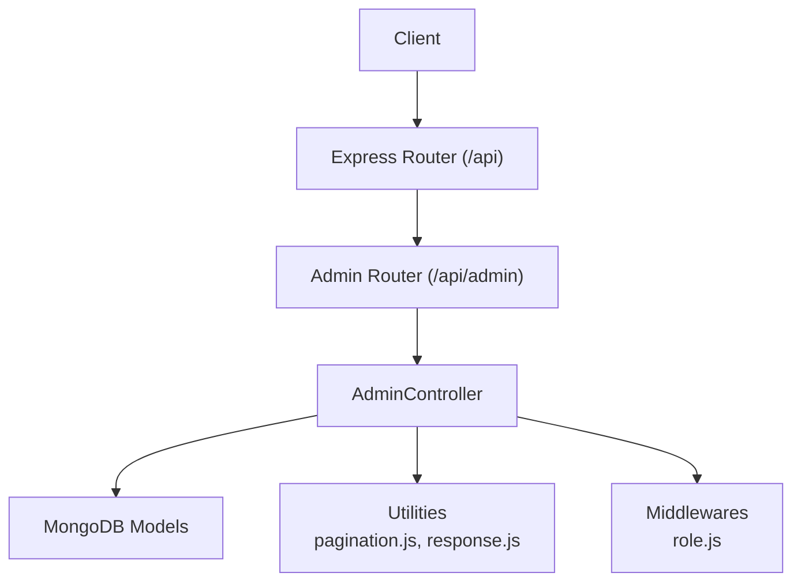
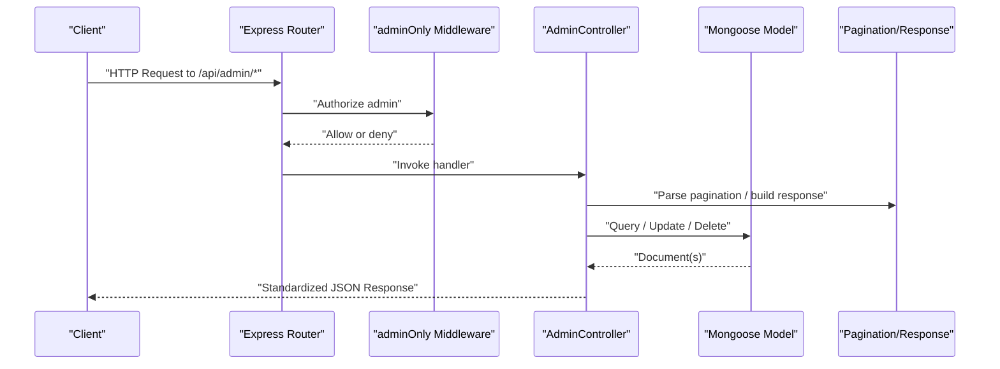
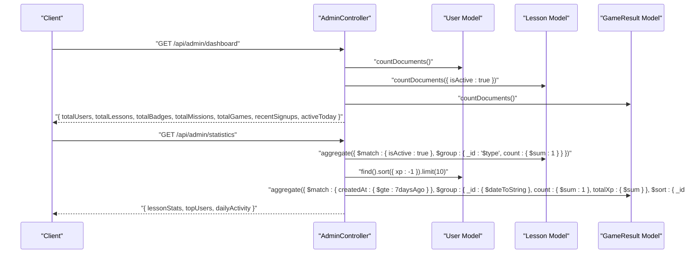
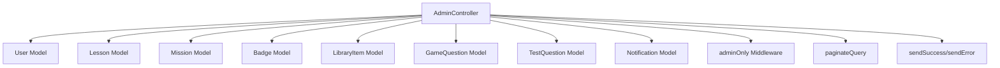

# Administrative APIs

<cite>
**Referenced Files in This Document**
- [adminController.js](file://backend/src/controllers/adminController.js)
- [index.js](file://backend/src/routes/index.js)
- [role.js](file://backend/src/middlewares/role.js)
- [index.js](file://backend/src/constants/index.js)
- [pagination.js](file://backend/src/utils/pagination.js)
- [response.js](file://backend/src/utils/response.js)
- [User.js](file://backend/src/models/User.js)
- [Lesson.js](file://backend/src/models/Lesson.js)
- [Mission.js](file://backend/src/models/Mission.js)
- [Badge.js](file://backend/src/models/Badge.js)
- [LibraryItem.js](file://backend/src/models/LibraryItem.js)
- [GameQuestion.js](file://backend/src/models/GameQuestion.js)
- [TestQuestion.js](file://backend/src/models/TestQuestion.js)
- [Notification.js](file://backend/src/models/Notification.js)
</cite>

## Table of Contents
1. [Introduction](#introduction)
2. [Project Structure](#project-structure)
3. [Core Components](#core-components)
4. [Architecture Overview](#architecture-overview)
5. [Detailed Component Analysis](#detailed-component-analysis)
6. [Dependency Analysis](#dependency-analysis)
7. [Performance Considerations](#performance-considerations)
8. [Troubleshooting Guide](#troubleshooting-guide)
9. [Conclusion](#conclusion)

## Introduction
This document provides comprehensive API documentation for administrative and content management endpoints. It covers admin dashboard operations, user administration, content moderation, achievement and badge management, system analytics, notifications, and bulk operations. Administrative permissions, audit trails, and content governance features are specified alongside endpoint definitions.

## Project Structure
Administrative endpoints are exposed under the /api/admin base path and mounted via the central route aggregator. Controllers encapsulate business logic, while middlewares enforce role-based access control. Data models define schemas for users, lessons, missions, badges, library items, game questions, test questions, and notifications. Pagination and standardized response utilities ensure consistent behavior across endpoints.

**Diagram sources**
- [index.js:28-47](file://backend/src/routes/index.js#L28-L47)
- [adminController.js:24-703](file://backend/src/controllers/adminController.js#L24-L703)
- [role.js:17-39](file://backend/src/middlewares/role.js#L17-L39)
- [pagination.js:49-67](file://backend/src/utils/pagination.js#L49-L67)
- [response.js:17-28](file://backend/src/utils/response.js#L17-L28)

**Section sources**
- [index.js:28-47](file://backend/src/routes/index.js#L28-L47)

## Core Components
- AdminController: Implements dashboard statistics, user management, content moderation (lessons, missions, badges, library items), question management (game and test), notifications, and analytics.
- Role-based Access Control: Enforces admin-only access for administrative endpoints.
- Pagination Utility: Provides reusable pagination for list endpoints.
- Standardized Responses: Ensures consistent success/error response formats.

**Section sources**
- [adminController.js:24-703](file://backend/src/controllers/adminController.js#L24-L703)
- [role.js:17-39](file://backend/src/middlewares/role.js#L17-L39)
- [pagination.js:49-67](file://backend/src/utils/pagination.js#L49-L67)
- [response.js:17-28](file://backend/src/utils/response.js#L17-L28)

## Architecture Overview
Administrative endpoints follow a layered architecture:
- Routes mount under /api/admin and delegate to AdminController.
- AdminController orchestrates data retrieval, filtering, aggregation, and persistence.
- Models define domain entities and indexes for efficient queries.
- Middlewares enforce authentication and authorization.
- Utilities standardize pagination and responses.

**Diagram sources**
- [index.js:28-47](file://backend/src/routes/index.js#L28-L47)
- [role.js:17-39](file://backend/src/middlewares/role.js#L17-L39)
- [adminController.js:29-61](file://backend/src/controllers/adminController.js#L29-L61)
- [pagination.js:49-67](file://backend/src/utils/pagination.js#L49-L67)
- [response.js:17-28](file://backend/src/utils/response.js#L17-L28)

## Detailed Component Analysis

### Authentication and Authorization
- Admin-only enforcement: All administrative endpoints are protected by adminOnly middleware, which checks the presence of req.user and verifies role equals admin.
- Unauthorized and forbidden responses: Standardized error responses are returned for missing tokens or insufficient privileges.

**Section sources**
- [role.js:17-39](file://backend/src/middlewares/role.js#L17-L39)
- [index.js:13-16](file://backend/src/constants/index.js#L13-L16)

### Dashboard and Analytics
Endpoints:
- GET /api/admin/dashboard: Returns totals for users, lessons, badges, missions, games, recent signups (last 7 days), and active users today.
- GET /api/admin/statistics: Returns lesson distribution by type, top users by XP, and daily activity (last 7 days) aggregated by date.

Processing logic:
- Dashboard aggregates counts using countDocuments across multiple collections.
- Statistics uses MongoDB aggregation to compute lesson counts, top performers, and daily metrics.

**Diagram sources**
- [adminController.js:29-101](file://backend/src/controllers/adminController.js#L29-L101)
- [User.js:14-243](file://backend/src/models/User.js#L14-L243)
- [Lesson.js:13-155](file://backend/src/models/Lesson.js#L13-L155)
- [GameQuestion.js:9-52](file://backend/src/models/GameQuestion.js#L9-L52)

**Section sources**
- [adminController.js:29-101](file://backend/src/controllers/adminController.js#L29-L101)

### User Administration
Endpoints:
- GET /api/admin/users: Lists users with optional filters (search by name/email, role), pagination, sorting, and population of related fields.
- PUT /api/admin/users/:id/role: Updates a user’s role (user or admin) with protection against self-modification.
- DELETE /api/admin/users/:id: Deletes a user with protection against self-deletion.

Permissions and safeguards:
- adminOnly middleware ensures only admins can modify roles or delete users.
- Self-protection prevents an admin from changing their own role or deleting themselves.

Response format:
- Standardized success/error responses with pagination metadata.

**Section sources**
- [adminController.js:107-180](file://backend/src/controllers/adminController.js#L107-L180)
- [User.js:14-243](file://backend/src/models/User.js#L14-L243)
- [role.js:17-39](file://backend/src/middlewares/role.js#L17-L39)
- [pagination.js:49-67](file://backend/src/utils/pagination.js#L49-L67)
- [response.js:17-28](file://backend/src/utils/response.js#L17-L28)

### Content Moderation: Lessons
Endpoints:
- GET /api/admin/lessons: Lists lessons with filters (type, difficulty, search by title), pagination, and sorting.
- POST /api/admin/lessons: Creates a new lesson.
- PUT /api/admin/lessons/:id: Updates an existing lesson.
- DELETE /api/admin/lessons/:id: Deletes a lesson.

Governance features:
- Search by title supports case-insensitive matching.
- Sorting by type and order maintains curriculum structure.
- isActive flag governs visibility.

**Section sources**
- [adminController.js:186-242](file://backend/src/controllers/adminController.js#L186-L242)
- [Lesson.js:13-155](file://backend/src/models/Lesson.js#L13-L155)
- [pagination.js:49-67](file://backend/src/utils/pagination.js#L49-L67)

### Content Moderation: Missions
Endpoints:
- GET /api/admin/missions: Lists missions with filters (type, search by title), pagination, and ordering.
- POST /api/admin/missions: Creates a new mission.
- PUT /api/admin/missions/:id: Updates an existing mission.
- DELETE /api/admin/missions/:id: Deletes a mission.

Governance features:
- Mission types (daily/weekly) and actions (complete_lesson, play_game, etc.) are validated against constants.
- isActive flag controls availability.

**Section sources**
- [adminController.js:248-302](file://backend/src/controllers/adminController.js#L248-L302)
- [Mission.js:12-69](file://backend/src/models/Mission.js#L12-L69)
- [index.js:75-91](file://backend/src/constants/index.js#L75-L91)

### Achievement and Badge Management
Endpoints:
- GET /api/admin/badges: Lists badges with filters (type, search by name), pagination, and ordering.
- POST /api/admin/badges: Creates a new badge.
- PUT /api/admin/badges/:id: Updates an existing badge.
- DELETE /api/admin/badges/:id: Deletes a badge.

Models and governance:
- Badge model defines type, requirement, rewards, order, and isActive flag.
- Achievement model tracks user progress toward unlocking badges.

**Section sources**
- [adminController.js:308-362](file://backend/src/controllers/adminController.js#L308-L362)
- [Badge.js:10-70](file://backend/src/models/Badge.js#L10-L70)
- [Achievement.js:11-48](file://backend/src/models/Achievement.js#L11-L48)

### Library Item Management
Endpoints:
- GET /api/admin/library: Lists library items with filters (type, search by title), pagination, and sorting.
- POST /api/admin/library: Creates a new library item.
- PUT /api/admin/library/:id: Updates an existing item.
- DELETE /api/admin/library/:id: Deletes an item.

Governance features:
- Type enumeration restricts values to predefined categories.
- isActive flag governs visibility.

**Section sources**
- [adminController.js:368-422](file://backend/src/controllers/adminController.js#L368-L422)
- [LibraryItem.js:9-63](file://backend/src/models/LibraryItem.js#L9-L63)

### Question Management: Game Questions
Endpoints:
- GET /api/admin/game-questions: Lists game questions with filters (gameKey, search by title), pagination, and sorting.
- POST /api/admin/game-questions: Creates a new game question.
- PUT /api/admin/game-questions/:id: Updates an existing question.
- DELETE /api/admin/game-questions/:id: Deletes a question.

Governance features:
- gameKey indexing enables efficient filtering by game.
- isActive flag controls question availability.

**Section sources**
- [adminController.js:428-482](file://backend/src/controllers/adminController.js#L428-L482)
- [GameQuestion.js:9-52](file://backend/src/models/GameQuestion.js#L9-L52)

### Question Management: Test Questions
Endpoints:
- GET /api/admin/test-questions: Lists test questions with filters (testRange, search by question), pagination, and sorting.
- POST /api/admin/test-questions: Creates a new test question.
- PUT /api/admin/test-questions/:id: Updates an existing question.
- DELETE /api/admin/test-questions/:id: Deletes a question.

Governance features:
- testRange indexing supports range-based queries.
- isActive flag governs question visibility.

**Section sources**
- [adminController.js:488-542](file://backend/src/controllers/adminController.js#L488-L542)
- [TestQuestion.js:9-51](file://backend/src/models/TestQuestion.js#L9-L51)

### Notifications Management
Endpoints:
- GET /api/admin/notifications: Lists notifications with de-duplication by title/message/type, optional search and type filters, pagination, and grouped metadata (recipient count, target).
- POST /api/admin/notifications: Creates notifications either for all users (target=all) or a specific user (target=specific). Emits real-time notifications via socket events.
- DELETE /api/admin/notifications/:id: Deletes notifications grouped by title/message/type to handle bulk deletions for “send to all” scenarios.

Real-time delivery:
- Broadcasts to all users or emits to a specific user using socket events.

**Section sources**
- [adminController.js:548-699](file://backend/src/controllers/adminController.js#L548-L699)
- [Notification.js:10-54](file://backend/src/models/Notification.js#L10-L54)
- [index.js:212-222](file://backend/src/constants/index.js#L212-L222)

### Bulk Operations and Governance
- Bulk deletion of notifications: Deletion by ID cascades to remove all grouped notifications with identical title/message/type.
- Search and filtering: Multiple endpoints support case-insensitive search and targeted filtering to facilitate moderation and governance.
- Audit-friendly fields: All models include timestamps, enabling audit trails for creation/modification.

**Section sources**
- [adminController.js:682-699](file://backend/src/controllers/adminController.js#L682-L699)
- [User.js:171-176](file://backend/src/models/User.js#L171-L176)
- [Lesson.js:137-142](file://backend/src/models/Lesson.js#L137-L142)
- [Mission.js:59-62](file://backend/src/models/Mission.js#L59-L62)
- [Badge.js:59-62](file://backend/src/models/Badge.js#L59-L62)
- [LibraryItem.js:52-55](file://backend/src/models/LibraryItem.js#L52-L55)
- [GameQuestion.js:44-47](file://backend/src/models/GameQuestion.js#L44-L47)
- [TestQuestion.js:43-46](file://backend/src/models/TestQuestion.js#L43-L46)
- [Notification.js:44-47](file://backend/src/models/Notification.js#L44-L47)

## Dependency Analysis
Administrative endpoints depend on:
- Controllers for orchestration and business logic.
- Models for data access and schema validation.
- Middlewares for authorization.
- Utilities for pagination and standardized responses.

**Diagram sources**
- [adminController.js:24-703](file://backend/src/controllers/adminController.js#L24-L703)
- [User.js:14-243](file://backend/src/models/User.js#L14-L243)
- [Lesson.js:13-155](file://backend/src/models/Lesson.js#L13-L155)
- [Mission.js:12-69](file://backend/src/models/Mission.js#L12-L69)
- [Badge.js:10-70](file://backend/src/models/Badge.js#L10-L70)
- [LibraryItem.js:9-63](file://backend/src/models/LibraryItem.js#L9-L63)
- [GameQuestion.js:9-52](file://backend/src/models/GameQuestion.js#L9-L52)
- [TestQuestion.js:9-51](file://backend/src/models/TestQuestion.js#L9-L51)
- [Notification.js:10-54](file://backend/src/models/Notification.js#L10-L54)
- [role.js:17-39](file://backend/src/middlewares/role.js#L17-L39)
- [pagination.js:49-67](file://backend/src/utils/pagination.js#L49-L67)
- [response.js:17-28](file://backend/src/utils/response.js#L17-L28)

**Section sources**
- [adminController.js:24-703](file://backend/src/controllers/adminController.js#L24-L703)

## Performance Considerations
- Efficient aggregations: Dashboard and statistics endpoints use aggregation pipelines to minimize round trips and compute metrics server-side.
- Index usage: Models define indexes on frequently queried fields (e.g., isActive, type, order, timestamps) to optimize reads.
- Pagination limits: Utilities cap page sizes and enforce minimum/maximum bounds to prevent heavy queries.
- Population control: Selective field projection and controlled population reduce payload sizes for list endpoints.

[No sources needed since this section provides general guidance]

## Troubleshooting Guide
Common issues and resolutions:
- Unauthorized access: Ensure requests include a valid admin token; otherwise, 401 Unauthorized or 403 Forbidden responses are returned.
- Role validation failures: Confirm the target user ID is not the requester’s own and that the role value is one of the allowed values.
- Resource not found: Many endpoints return 404 Not Found when records are missing; verify IDs and filters.
- Rate limiting and validation: Standardized error responses indicate validation errors or rate limit violations.

**Section sources**
- [role.js:17-39](file://backend/src/middlewares/role.js#L17-L39)
- [response.js:47-58](file://backend/src/utils/response.js#L47-L58)
- [adminController.js:140-180](file://backend/src/controllers/adminController.js#L140-L180)

## Conclusion
The administrative API suite provides a robust foundation for managing users, content, badges, missions, library items, and notifications. Admin-only access control, standardized responses, pagination, and governance features enable secure, scalable, and auditable operations. Dashboard and analytics endpoints offer insights into platform health and engagement trends.