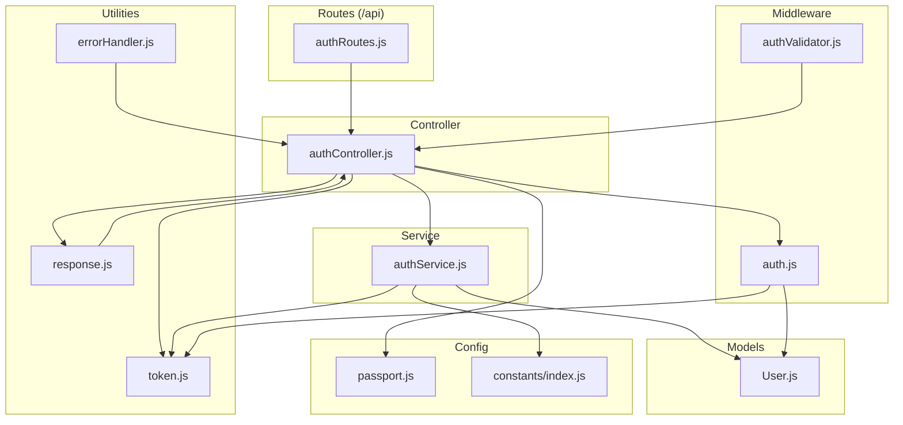
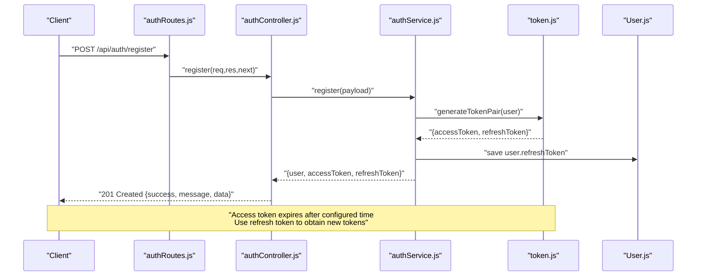
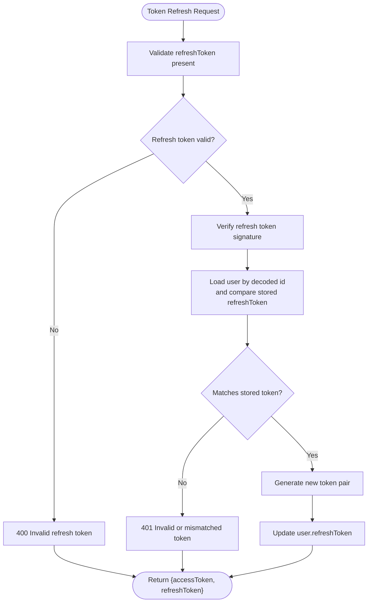
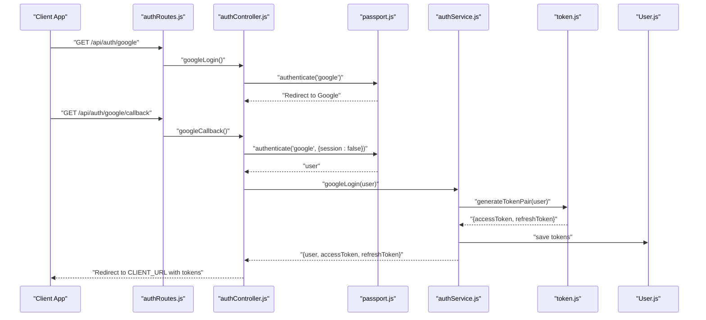
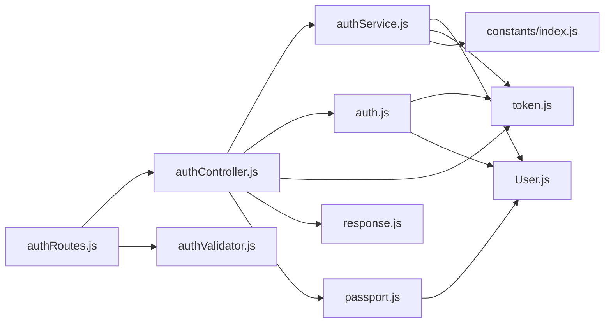

# Authentication APIs

<cite>
**Referenced Files in This Document**
- [authController.js](file://backend/src/controllers/authController.js)
- [authRoutes.js](file://backend/src/routes/authRoutes.js)
- [authService.js](file://backend/src/services/authService.js)
- [auth.js](file://backend/src/middlewares/auth.js)
- [token.js](file://backend/src/utils/token.js)
- [authValidator.js](file://backend/src/validators/authValidator.js)
- [User.js](file://backend/src/models/User.js)
- [index.js](file://backend/src/constants/index.js)
- [passport.js](file://backend/src/config/passport.js)
- [errorHandler.js](file://backend/src/middlewares/errorHandler.js)
- [response.js](file://backend/src/utils/response.js)
- [index.js](file://backend/src/routes/index.js)
</cite>

## Table of Contents
1. [Introduction](#introduction)
2. [Project Structure](#project-structure)
3. [Core Components](#core-components)
4. [Architecture Overview](#architecture-overview)
5. [Detailed Component Analysis](#detailed-component-analysis)
6. [Dependency Analysis](#dependency-analysis)
7. [Performance Considerations](#performance-considerations)
8. [Troubleshooting Guide](#troubleshooting-guide)
9. [Conclusion](#conclusion)
10. [Appendices](#appendices)

## Introduction
This document provides comprehensive API documentation for the authentication endpoints in the backend service. It covers user registration, login, logout, refresh token, and Google OAuth integration. For each endpoint, you will find HTTP methods, URL patterns, request/response schemas, authentication requirements, validation rules, and error handling. It also explains JWT token management, refresh token handling, session management, and security measures. Finally, it includes curl examples, authentication flow diagrams, and integration guidelines for client applications.

## Project Structure
The authentication system is organized around a controller, routes, service, validators, middleware, token utilities, and models. Routes are mounted under the /api/auth base path and include public endpoints (register, login, refresh-token) and Google OAuth endpoints (web and mobile). Protected endpoints (logout) require a valid access token.

**Diagram sources**
- [authRoutes.js:1-38](file://backend/src/routes/authRoutes.js#L1-L38)
- [authController.js:1-94](file://backend/src/controllers/authController.js#L1-L94)
- [authService.js:1-250](file://backend/src/services/authService.js#L1-L250)
- [auth.js:1-78](file://backend/src/middlewares/auth.js#L1-L78)
- [authValidator.js:1-44](file://backend/src/validators/authValidator.js#L1-L44)
- [token.js:1-98](file://backend/src/utils/token.js#L1-L98)
- [response.js:1-82](file://backend/src/utils/response.js#L1-L82)
- [errorHandler.js:1-98](file://backend/src/middlewares/errorHandler.js#L1-L98)
- [User.js:1-243](file://backend/src/models/User.js#L1-L243)
- [passport.js:1-83](file://backend/src/config/passport.js#L1-L83)
- [index.js:1-242](file://backend/src/constants/index.js#L1-L242)

**Section sources**
- [authRoutes.js:1-38](file://backend/src/routes/authRoutes.js#L1-L38)
- [index.js:1-50](file://backend/src/routes/index.js#L1-L50)

## Core Components
- Controller: Exposes endpoints for register, login, logout, refresh-token, Google OAuth web and mobile flows.
- Service: Implements business logic for registration, login, logout, refresh token, Google login, and mobile Google sign-in.
- Middleware: Provides authentication and optional authentication guards.
- Validators: Enforce request validation for register, login, and refresh-token requests.
- Token Utilities: Generate and verify JWT access and refresh tokens; extract tokens from headers or cookies.
- Passport: Configures Google OAuth 2.0 strategy and user serialization/deserialization.
- Models: Defines the User schema, including auth provider, Google ID, email verification, refresh token, and password reset fields.
- Constants: Centralizes roles, auth providers, messages, and XP configurations used across auth flows.
- Response and Error Handler: Standardize API responses and handle application-specific errors.

**Section sources**
- [authController.js:13-94](file://backend/src/controllers/authController.js#L13-L94)
- [authService.js:16-249](file://backend/src/services/authService.js#L16-L249)
- [auth.js:15-77](file://backend/src/middlewares/auth.js#L15-L77)
- [authValidator.js:9-44](file://backend/src/validators/authValidator.js#L9-L44)
- [token.js:17-97](file://backend/src/utils/token.js#L17-L97)
- [passport.js:14-83](file://backend/src/config/passport.js#L14-L83)
- [User.js:14-243](file://backend/src/models/User.js#L14-L243)
- [index.js:167-207](file://backend/src/constants/index.js#L167-L207)
- [response.js:17-81](file://backend/src/utils/response.js#L17-L81)
- [errorHandler.js:13-97](file://backend/src/middlewares/errorHandler.js#L13-L97)

## Architecture Overview
The authentication architecture follows a layered pattern:
- Routes define endpoints and apply rate limiting and validation.
- Controller delegates to the service and handles responses.
- Service interacts with the User model and token utilities.
- Middleware verifies JWT access tokens and attaches user context.
- Passport manages Google OAuth strategies and user linking.

**Diagram sources**
- [authRoutes.js:24-26](file://backend/src/routes/authRoutes.js#L24-L26)
- [authController.js:14-22](file://backend/src/controllers/authController.js#L14-L22)
- [authService.js:20-46](file://backend/src/services/authService.js#L20-L46)
- [token.js:39-50](file://backend/src/utils/token.js#L39-L50)
- [User.js:64-67](file://backend/src/models/User.js#L64-L67)

## Detailed Component Analysis

### Endpoint Definitions

#### POST /api/auth/register
- Purpose: Register a new user with name, email, and password.
- Authentication: Not required.
- Request Schema:
  - name: string (required, 2–50 characters)
  - email: string (required, valid email)
  - password: string (required, minimum 6 characters)
- Response Schema:
  - success: boolean
  - message: string
  - data.user: object (excluding sensitive fields)
  - data.accessToken: string
  - data.refreshToken: string
- Validation: Enforced by express-validator rules.
- Security:
  - Password hashed via bcrypt before save.
  - authProvider set to local.
  - refreshToken stored in DB for refresh flow.
- Error Handling:
  - Duplicate email triggers a 400 error.
  - Validation failures trigger 400 errors.
  - Other errors propagate as 500.

curl example:
- curl -X POST https://yourdomain/api/auth/register -H "Content-Type: application/json" -d '{"name":"John Doe","email":"john@example.com","password":"passw0rd"}'

**Section sources**
- [authRoutes.js:25](file://backend/src/routes/authRoutes.js#L25)
- [authController.js:14-22](file://backend/src/controllers/authController.js#L14-L22)
- [authService.js:20-46](file://backend/src/services/authService.js#L20-L46)
- [authValidator.js:9-22](file://backend/src/validators/authValidator.js#L9-L22)
- [User.js:33-37](file://backend/src/models/User.js#L33-L37)
- [index.js:167-174](file://backend/src/constants/index.js#L167-L174)

#### POST /api/auth/login
- Purpose: Authenticate user with email/password and issue tokens.
- Authentication: Not required.
- Request Schema:
  - email: string (required, valid email)
  - password: string (required)
- Response Schema:
  - success: boolean
  - message: string
  - data.user: object (excluding sensitive fields)
  - data.accessToken: string
  - data.refreshToken: string
- Validation: Enforced by express-validator rules.
- Behavior:
  - Rejects accounts that use Google login (no local password).
  - Updates streak, XP, lastLoginDate, and lastActiveDate.
  - Stores refresh token in DB.
- Error Handling:
  - Invalid credentials: 401.
  - Provider mismatch: 400.
  - Other errors: 500.

curl example:
- curl -X POST https://yourdomain/api/auth/login -H "Content-Type: application/json" -d '{"email":"john@example.com","password":"passw0rd"}'

**Section sources**
- [authRoutes.js:26](file://backend/src/routes/authRoutes.js#L26)
- [authController.js:24-32](file://backend/src/controllers/authController.js#L24-L32)
- [authService.js:51-95](file://backend/src/services/authService.js#L51-L95)
- [authValidator.js:24-32](file://backend/src/validators/authValidator.js#L24-L32)
- [index.js:167-178](file://backend/src/constants/index.js#L167-L178)

#### POST /api/auth/logout
- Purpose: Invalidate current refresh token for the logged-in user.
- Authentication: Required (access token).
- Request Schema: None.
- Response Schema:
  - success: boolean
  - message: string
- Behavior:
  - Clears user.refreshToken in DB.
- Error Handling:
  - Missing/invalid token: 401.
  - Other errors: 500.

curl example:
- curl -X POST https://yourdomain/api/auth/logout -H "Authorization: Bearer ACCESS_TOKEN"

**Section sources**
- [authRoutes.js:35](file://backend/src/routes/authRoutes.js#L35)
- [authController.js:34-42](file://backend/src/controllers/authController.js#L34-L42)
- [authService.js:100-104](file://backend/src/services/authService.js#L100-L104)
- [auth.js:18-50](file://backend/src/middlewares/auth.js#L18-L50)

#### POST /api/auth/refresh-token
- Purpose: Issue a new access token using a valid refresh token.
- Authentication: Not required.
- Request Schema:
  - refreshToken: string (required)
- Response Schema:
  - success: boolean
  - message: string
  - data.accessToken: string
  - data.refreshToken: string
- Validation: Enforced by express-validator rules.
- Behavior:
  - Verifies refresh token against refresh secret.
  - Matches refresh token with stored value in DB.
  - Issues new token pair and updates refresh token in DB.
- Error Handling:
  - Missing/invalid/expired refresh token: 401.
  - Token mismatch: 401.
  - Other errors: 500.

curl example:
- curl -X POST https://yourdomain/api/auth/refresh-token -H "Content-Type: application/json" -d '{"refreshToken":"REFRESH_JWT"}'

**Section sources**
- [authRoutes.js:27](file://backend/src/routes/authRoutes.js#L27)
- [authController.js:44-53](file://backend/src/controllers/authController.js#L44-L53)
- [authService.js:109-132](file://backend/src/services/authService.js#L109-L132)
- [authValidator.js:34-37](file://backend/src/validators/authValidator.js#L34-L37)
- [token.js:66-68](file://backend/src/utils/token.js#L66-L68)
- [User.js:64-67](file://backend/src/models/User.js#L64-L67)
- [index.js:167-178](file://backend/src/constants/index.js#L167-L178)

#### GET /api/auth/google
- Purpose: Initiate Google OAuth login via browser.
- Authentication: Not required.
- Behavior:
  - Uses Passport Google strategy with scopes profile and email.
  - Redirects to Google for consent.
- Notes:
  - Configure GOOGLE_CLIENT_ID, GOOGLE_CLIENT_SECRET, GOOGLE_CALLBACK_URL in environment.

curl example:
- curl -L -i https://yourdomain/api/auth/google

**Section sources**
- [authRoutes.js:30](file://backend/src/routes/authRoutes.js#L30)
- [authController.js:55-60](file://backend/src/controllers/authController.js#L55-L60)
- [passport.js:14-21](file://backend/src/config/passport.js#L14-L21)

#### GET /api/auth/google/callback
- Purpose: Handle Google OAuth callback and issue tokens.
- Authentication: Not required.
- Behavior:
  - Passport authenticates the user.
  - Calls service to update streak/XP and issue tokens.
  - Redirects to CLIENT_URL with accessToken and refreshToken query params.
- Error Handling:
  - Authentication failure: redirects to login with error param.
  - Other errors: propagated to global error handler.

curl example:
- Browser visits: https://yourdomain/api/auth/google/callback

**Section sources**
- [authRoutes.js:31](file://backend/src/routes/authRoutes.js#L31)
- [authController.js:62-79](file://backend/src/controllers/authController.js#L62-L79)
- [authService.js:137-162](file://backend/src/services/authService.js#L137-L162)
- [passport.js:22-65](file://backend/src/config/passport.js#L22-L65)

#### POST /api/auth/google/mobile-signin
- Purpose: Authenticate via Google native idToken (mobile).
- Authentication: Not required.
- Request Schema:
  - idToken: string (required)
- Response Schema:
  - success: boolean
  - message: string
  - data.user: object (excluding sensitive fields)
  - data.accessToken: string
  - data.refreshToken: string
- Behavior:
  - Decodes idToken (supports real Google tokens and mock tokens).
  - Ensures email presence.
  - Finds or creates user, links Google account if needed.
  - Updates streak/XP and issues tokens.
- Error Handling:
  - Missing idToken: 400.
  - Invalid/unsupported idToken: 400.
  - Missing email in token: 400.
  - Other errors: 500.

curl example:
- curl -X POST https://yourdomain/api/auth/google/mobile-signin -H "Content-Type: application/json" -d '{"idToken":"GOOGLE_ID_TOKEN"}'

**Section sources**
- [authRoutes.js:32](file://backend/src/routes/authRoutes.js#L32)
- [authController.js:81-90](file://backend/src/controllers/authController.js#L81-L90)
- [authService.js:167-246](file://backend/src/services/authService.js#L167-L246)
- [index.js:167-178](file://backend/src/constants/index.js#L167-L178)

### JWT and Token Management
- Access Token:
  - Payload includes user id, email, and role.
  - Expires in configured time window.
  - Extracted from Authorization header (Bearer) or accessToken cookie.
- Refresh Token:
  - Long-lived token used to obtain new access tokens.
  - Stored in DB per user; validated against stored value.
- Token Pair Generation:
  - Both tokens generated together during register/login and Google flows.
- Session Management:
  - No server-side session storage; authentication relies on signed JWTs.
  - Optional cookie support for accessToken simplifies client handling.

**Diagram sources**
- [authService.js:109-132](file://backend/src/services/authService.js#L109-L132)
- [token.js:66-68](file://backend/src/utils/token.js#L66-L68)
- [token.js:39-50](file://backend/src/utils/token.js#L39-L50)
- [User.js:64-67](file://backend/src/models/User.js#L64-L67)

**Section sources**
- [token.js:17-97](file://backend/src/utils/token.js#L17-L97)
- [auth.js:75-88](file://backend/src/middlewares/auth.js#L75-L88)
- [authService.js:36-40](file://backend/src/services/authService.js#L36-L40)
- [authService.js:86-89](file://backend/src/services/authService.js#L86-L89)
- [authService.js:125-129](file://backend/src/services/authService.js#L125-L129)

### Google OAuth Integration
- Web OAuth:
  - Initiates with GET /api/auth/google.
  - Callback handled at GET /api/auth/google/callback.
  - Issues tokens and redirects to client with query params.
- Mobile OAuth:
  - Accepts idToken via POST /api/auth/google/mobile-signin.
  - Decodes idToken and provisions user if needed.
- Passport Strategy:
  - Creates or links user based on googleId or email.
  - Sets authProvider to google and marks email verified.

**Diagram sources**
- [authRoutes.js:30-31](file://backend/src/routes/authRoutes.js#L30-L31)
- [authController.js:55-79](file://backend/src/controllers/authController.js#L55-L79)
- [passport.js:14-65](file://backend/src/config/passport.js#L14-L65)
- [authService.js:137-162](file://backend/src/services/authService.js#L137-L162)
- [token.js:39-50](file://backend/src/utils/token.js#L39-L50)
- [User.js:64-67](file://backend/src/models/User.js#L64-L67)

**Section sources**
- [authController.js:55-79](file://backend/src/controllers/authController.js#L55-L79)
- [authService.js:137-162](file://backend/src/services/authService.js#L137-L162)
- [passport.js:14-83](file://backend/src/config/passport.js#L14-L83)

### Validation Rules
- Register:
  - name: required, trimmed, length 2–50
  - email: required, valid email, normalized
  - password: required, minimum 6 characters
- Login:
  - email: required, valid email, normalized
  - password: required
- Refresh Token:
  - refreshToken: required

**Section sources**
- [authValidator.js:9-37](file://backend/src/validators/authValidator.js#L9-L37)

### Error Handling
- AppError:
  - Custom error class with status code and operational flag.
- Global Error Handler:
  - Handles cast errors, duplicate keys, validation errors, JWT errors, and expired JWT.
  - Returns standardized JSON response with success=false and message.
- Response Helpers:
  - sendSuccess/sendCreated/sendError/sendPaginated for consistent API responses.

**Section sources**
- [errorHandler.js:13-97](file://backend/src/middlewares/errorHandler.js#L13-L97)
- [response.js:17-81](file://backend/src/utils/response.js#L17-L81)
- [auth.js:42-49](file://backend/src/middlewares/auth.js#L42-L49)

## Dependency Analysis
The authentication module exhibits low coupling and high cohesion:
- Routes depend on controller and validators.
- Controller depends on service, middleware, token utilities, and response helpers.
- Service depends on model, token utilities, constants, and error utilities.
- Middleware depends on token utilities and model.
- Passport integrates with strategy and model.

**Diagram sources**
- [authRoutes.js:14-37](file://backend/src/routes/authRoutes.js#L14-L37)
- [authController.js:7-11](file://backend/src/controllers/authController.js#L7-L11)
- [authService.js:10-14](file://backend/src/services/authService.js#L10-L14)
- [auth.js:10-13](file://backend/src/middlewares/auth.js#L10-L13)
- [token.js:10-11](file://backend/src/utils/token.js#L10-L11)
- [User.js:10-12](file://backend/src/models/User.js#L10-L12)
- [passport.js:10-12](file://backend/src/config/passport.js#L10-L12)
- [index.js:13-16](file://backend/src/constants/index.js#L13-L16)

**Section sources**
- [authRoutes.js:14-37](file://backend/src/routes/authRoutes.js#L14-L37)
- [authController.js:7-11](file://backend/src/controllers/authController.js#L7-L11)
- [authService.js:10-14](file://backend/src/services/authService.js#L10-L14)
- [auth.js:10-13](file://backend/src/middlewares/auth.js#L10-L13)
- [token.js:10-11](file://backend/src/utils/token.js#L10-L11)
- [User.js:10-12](file://backend/src/models/User.js#L10-L12)
- [passport.js:10-12](file://backend/src/config/passport.js#L10-L12)
- [index.js:13-16](file://backend/src/constants/index.js#L13-L16)

## Performance Considerations
- Token Lifetimes:
  - Access tokens are short-lived; rely on refresh tokens to minimize re-authentication overhead.
- Rate Limiting:
  - All auth routes are rate-limited at the route level to prevent abuse.
- Validation:
  - Early validation reduces unnecessary downstream work.
- Database Indexes:
  - Consider adding indexes on email and googleId for improved lookup performance.
- Payload Size:
  - Keep token payloads minimal to reduce network overhead.

[No sources needed since this section provides general guidance]

## Troubleshooting Guide
Common issues and resolutions:
- Unauthorized Access:
  - Ensure Authorization header includes Bearer ACCESS_TOKEN or accessToken cookie is present.
  - Verify token is not expired; use refresh token if needed.
- Invalid Credentials:
  - Confirm email and password match; note that Google-linked accounts require Google login.
- Refresh Token Errors:
  - Ensure refreshToken is present and valid; confirm it matches the stored value in DB.
- Google OAuth Failures:
  - Verify GOOGLE_CLIENT_ID, GOOGLE_CLIENT_SECRET, GOOGLE_CALLBACK_URL, and CLIENT_URL are configured.
  - For mobile, ensure idToken is provided and decodable.

**Section sources**
- [auth.js:18-50](file://backend/src/middlewares/auth.js#L18-L50)
- [authService.js:55-68](file://backend/src/services/authService.js#L55-L68)
- [authService.js:114-122](file://backend/src/services/authService.js#L114-L122)
- [passport.js:17-20](file://backend/src/config/passport.js#L17-L20)
- [authController.js:73](file://backend/src/controllers/authController.js#L73)

## Conclusion
The authentication system provides secure, standardized endpoints for registration, login, logout, token refresh, and Google OAuth integration. It leverages JWT for stateless authentication, stores refresh tokens securely, and offers robust validation and error handling. Clients should manage access tokens and refresh tokens according to the documented flows and integrate with the provided endpoints.

[No sources needed since this section summarizes without analyzing specific files]

## Appendices

### API Reference Summary
- POST /api/auth/register
  - Body: name, email, password
  - Responses: 201 with tokens; 400 on validation/duplicate; 500 on error
- POST /api/auth/login
  - Body: email, password
  - Responses: 200 with tokens; 401 on invalid credentials; 500 on error
- POST /api/auth/logout
  - Headers: Authorization: Bearer ACCESS_TOKEN
  - Responses: 200; 401 on missing/invalid token; 500 on error
- POST /api/auth/refresh-token
  - Body: refreshToken
  - Responses: 200 with new tokens; 400/401 on invalid token; 500 on error
- GET /api/auth/google
  - Redirects to Google OAuth consent
- GET /api/auth/google/callback
  - Redirects to CLIENT_URL with tokens
- POST /api/auth/google/mobile-signin
  - Body: idToken
  - Responses: 200 with tokens; 400 on invalid token; 500 on error

**Section sources**
- [authRoutes.js:6-35](file://backend/src/routes/authRoutes.js#L6-L35)
- [authController.js:14-90](file://backend/src/controllers/authController.js#L14-L90)
- [authService.js:20-246](file://backend/src/services/authService.js#L20-L246)

### Integration Guidelines
- Frontend/Web:
  - Store accessToken in memory and refreshToken in a httpOnly cookie or secure storage.
  - On 401 Unauthorized, attempt refresh-token; if still failing, prompt user to re-login.
  - For Google OAuth, use web flow for browsers and mobile flow for native apps.
- Mobile:
  - Use POST /api/auth/google/mobile-signin with idToken.
  - Persist both tokens and rotate refresh tokens on successful refresh.
- Security Best Practices:
  - Never expose refresh tokens to frontend scripts.
  - Validate all inputs server-side.
  - Use HTTPS in production.
  - Monitor rate-limit hits and adjust thresholds as needed.

[No sources needed since this section provides general guidance]