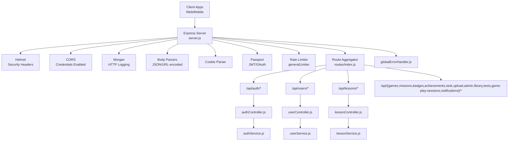
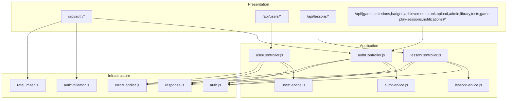
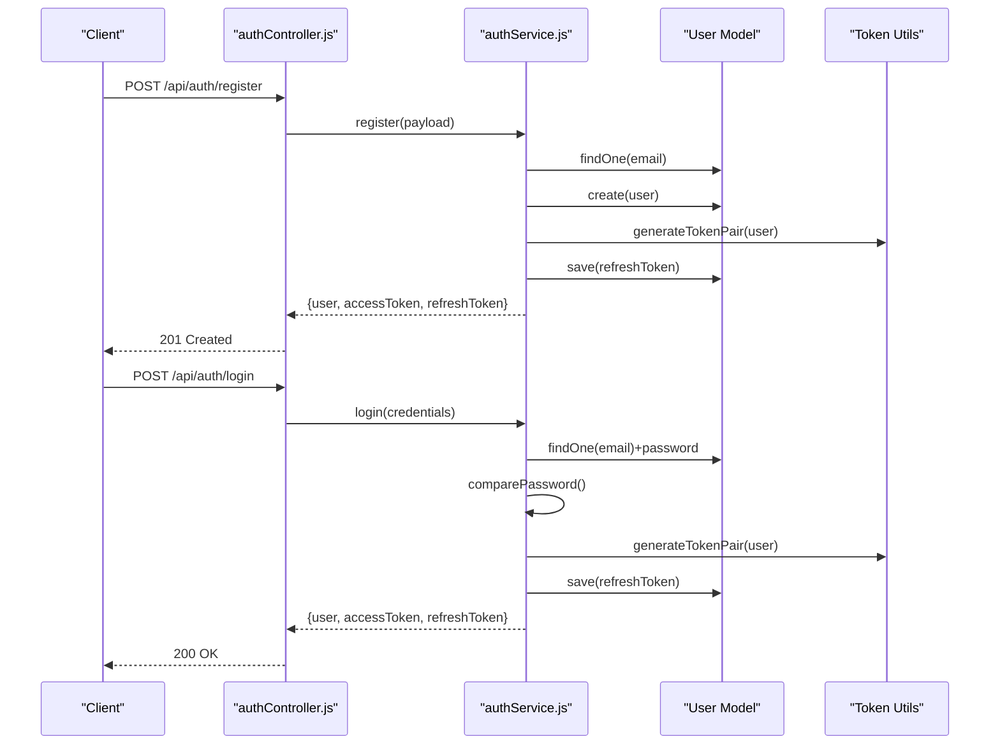

# Backend REST API

<cite>
**Referenced Files in This Document**
- [server.js](file://backend/server.js)
- [routes/index.js](file://backend/src/routes/index.js)
- [authRoutes.js](file://backend/src/route/authRoutes.js)
- [userRoutes.js](file://backend/src/route/userRoutes.js)
- [lessonRoutes.js](file://backend/src/route/lessonRoutes.js)
- [authController.js](file://backend/src/controller/authController.js)
- [userController.js](file://backend/src/controller/userController.js)
- [lessonController.js](file://backend/src/controller/lessonController.js)
- [authService.js](file://backend/src/service/authService.js)
- [userService.js](file://backend/src/service/userService.js)
- [lessonService.js](file://backend/src/service/lessonService.js)
- [auth.js](file://backend/src/middlewares/auth.js)
- [rateLimiter.js](file://backend/src/middlewares/rateLimiter.js)
- [authValidator.js](file://backend/src/validators/authValidator.js)
- [response.js](file://backend/src/utils/response.js)
- [errorHandler.js](file://backend/src/middlewares/errorHandler.js)
- [package.json](file://backend/package.json)
</cite>

## Table of Contents
1. [Introduction](#introduction)
2. [Project Structure](#project-structure)
3. [Core Components](#core-components)
4. [Architecture Overview](#architecture-overview)
5. [Detailed Component Analysis](#detailed-component-analysis)
6. [Dependency Analysis](#dependency-analysis)
7. [Performance Considerations](#performance-considerations)
8. [Troubleshooting Guide](#troubleshooting-guide)
9. [Conclusion](#conclusion)
10. [Appendices](#appendices)

## Introduction
This document provides comprehensive REST API documentation for the Node.js backend server of the KhmerKid application. It covers all HTTP endpoints grouped by functional areas: authentication APIs, user management endpoints, lesson content APIs, progress tracking services, gaming features, achievement systems, and administrative functions. For each endpoint, you will find HTTP methods, URL patterns, request/response schemas, authentication and authorization requirements, error codes, validation rules, examples, curl commands, and integration guidelines. Additional topics include middleware usage, rate limiting, and security measures.

## Project Structure
The backend is an Express.js server with modular routing, controllers, services, and middlewares. Routes are mounted under the /api base path and grouped by domain area. Controllers delegate to services, which encapsulate business logic and interact with MongoDB via Mongoose models. Global middlewares enforce security, logging, CORS, rate limiting, and error handling.

**Diagram sources**
- [server.js:1-160](file://backend/server.js#L1-L160)
- [routes/index.js:1-50](file://backend/src/routes/index.js#L1-L50)

**Section sources**
- [server.js:1-160](file://backend/server.js#L1-L160)
- [routes/index.js:1-50](file://backend/src/routes/index.js#L1-L50)

## Core Components
- Express server with security headers, CORS, logging, body parsing, cookies, rate limiting, Passport, and global error handling.
- Route aggregator mounting all domain-specific routes under /api.
- Authentication middleware verifying JWT and attaching user context.
- Rate limiters for general, auth, and upload endpoints.
- Centralized response utilities and error handling.

Key behaviors:
- Health check endpoint at /api/health.
- All routes prefixed with /api.
- Global rate limiting applied to /api/.
- Passport initialized with JWT and Google OAuth strategies.

**Section sources**
- [server.js:55-121](file://backend/server.js#L55-L121)
- [routes/index.js:25-47](file://backend/src/routes/index.js#L25-L47)
- [auth.js:15-50](file://backend/src/middlewares/auth.js#L15-L50)
- [rateLimiter.js:15-28](file://backend/src/middlewares/rateLimiter.js#L15-L28)

## Architecture Overview
The API follows a layered architecture:
- Presentation Layer: Routes and Controllers
- Application Layer: Services
- Domain Layer: Models and Utilities
- Infrastructure: Middlewares (auth, rate limiter, error handler), validators, response utilities

**Diagram sources**
- [authRoutes.js:1-38](file://backend/src/route/authRoutes.js#L1-L38)
- [userRoutes.js:1-31](file://backend/src/route/userRoutes.js#L1-L31)
- [lessonRoutes.js:1-34](file://backend/src/route/lessonRoutes.js#L1-L34)
- [authController.js:1-94](file://backend/src/controller/authController.js#L1-L94)
- [userController.js:1-54](file://backend/src/controller/userController.js#L1-L54)
- [lessonController.js:1-87](file://backend/src/controller/lessonController.js#L1-L87)
- [authService.js:1-250](file://backend/src/service/authService.js#L1-L250)
- [userService.js:1-221](file://backend/src/service/userService.js#L1-L221)
- [lessonService.js:1-130](file://backend/src/service/lessonService.js#L1-L130)
- [auth.js:15-50](file://backend/src/middlewares/auth.js#L15-L50)
- [rateLimiter.js:15-28](file://backend/src/middlewares/rateLimiter.js#L15-L28)
- [authValidator.js:1-44](file://backend/src/validators/authValidator.js#L1-L44)
- [response.js](file://backend/src/utils/response.js)
- [errorHandler.js](file://backend/src/middlewares/errorHandler.js)

## Detailed Component Analysis

### Authentication APIs
Functional area: User registration, login, logout, token refresh, and Google OAuth.

Endpoints:
- POST /api/auth/register
  - Auth: None
  - Rate limit: Auth limiter
  - Request body: name, email, password
  - Response: user object, accessToken, refreshToken
  - Validation: Name length, valid email, password minimum length
  - Example curl:
    - curl -X POST "$BASE/api/auth/register" -H "Content-Type: application/json" -d '{"name":"John","email":"john@example.com","password":"pass123"}'
  - Notes: Returns 201 on success; errors include duplicate email, invalid credentials, validation failures.

- POST /api/auth/login
  - Auth: None
  - Rate limit: Auth limiter
  - Request body: email, password
  - Response: user object, accessToken, refreshToken
  - Validation: Valid email, non-empty password
  - Example curl:
    - curl -X POST "$BASE/api/auth/login" -H "Content-Type: application/json" -d '{"email":"john@example.com","password":"pass123"}'

- POST /api/auth/logout
  - Auth: Required (JWT)
  - Request body: none
  - Response: success message
  - Example curl:
    - curl -X POST "$BASE/api/auth/logout" -H "Authorization: Bearer $ACCESS_TOKEN"

- POST /api/auth/refresh-token
  - Auth: None
  - Request body: refreshToken
  - Response: new accessToken and refreshToken
  - Validation: refreshToken required
  - Example curl:
    - curl -X POST "$BASE/api/auth/refresh-token" -H "Content-Type: application/json" -d '{"refreshToken":"$REFRESH_TOKEN"}'

- GET /api/auth/google
  - Auth: None
  - Description: Initiates Google OAuth login flow

- GET /api/auth/google/callback
  - Auth: None
  - Description: Handles Google OAuth callback and redirects with tokens

- POST /api/auth/google/mobile-signin
  - Auth: None
  - Request body: idToken
  - Response: user object, accessToken, refreshToken
  - Example curl:
    - curl -X POST "$BASE/api/auth/google/mobile-signin" -H "Content-Type: application/json" -d '{"idToken":"$ID_TOKEN"}'

Security and middleware:
- JWT verification middleware attaches user to request for protected routes.
- Rate limiting configured for auth endpoints.
- Passport Google OAuth strategy integrated.

**Section sources**
- [authRoutes.js:1-38](file://backend/src/route/authRoutes.js#L1-L38)
- [authController.js:14-90](file://backend/src/controller/authController.js#L14-L90)
- [authService.js:16-246](file://backend/src/service/authService.js#L16-L246)
- [auth.js:15-50](file://backend/src/middlewares/auth.js#L15-L50)
- [rateLimiter.js:34-43](file://backend/src/middlewares/rateLimiter.js#L34-L43)
- [authValidator.js:9-37](file://backend/src/validators/authValidator.js#L9-L37)
- [response.js](file://backend/src/utils/response.js)
- [errorHandler.js](file://backend/src/middlewares/errorHandler.js)

### User Management Endpoints
Functional area: Profile retrieval and updates, inventory management, ranking.

Endpoints:
- GET /api/users/profile
  - Auth: Required (JWT)
  - Response: user profile with level info
  - Example curl:
    - curl -X GET "$BASE/api/users/profile" -H "Authorization: Bearer $ACCESS_TOKEN"

- PUT /api/users/profile
  - Auth: Required (JWT)
  - Request body: name, avatar (partial updates allowed)
  - Response: updated user
  - Validation: Allowed fields enforced
  - Example curl:
    - curl -X PUT "$BASE/api/users/profile" -H "Authorization: Bearer $ACCESS_TOKEN" -H "Content-Type: application/json" -d '{"name":"Jane"}'

- PUT /api/users/inventory
  - Auth: Required (JWT)
  - Request body: inventory object
  - Response: updated user
  - Example curl:
    - curl -X PUT "$BASE/api/users/inventory" -H "Authorization: Bearer $ACCESS_TOKEN" -H "Content-Type: application/json" -d '{"items":["item1"],"currency":100}'

- GET /api/users/rank
  - Auth: Required (JWT)
  - Response: rank, xp, level, name, avatar
  - Example curl:
    - curl -X GET "$BASE/api/users/rank" -H "Authorization: Bearer $ACCESS_TOKEN"

Gaming reward accumulation endpoints:
- POST /api/users/accumulate-stars
  - Auth: Required (JWT)
  - Description: Accumulates stars for gameplay sessions

- POST /api/users/accumulate-xp
  - Auth: Required (JWT)
  - Description: Accumulates XP for gameplay sessions

Notes:
- Profile syncs completed lessons from Progress collection to ensure consistency.
- Level calculation computed and returned with profile.

**Section sources**
- [userRoutes.js:18-30](file://backend/src/route/userRoutes.js#L18-L30)
- [userController.js:12-50](file://backend/src/controller/userController.js#L12-L50)
- [userService.js:19-217](file://backend/src/service/userService.js#L19-L217)
- [response.js](file://backend/src/utils/response.js)
- [errorHandler.js](file://backend/src/middlewares/errorHandler.js)

### Lesson Content APIs
Functional area: Retrieve lessons, filter by type/difficulty, manage lessons (admin).

Endpoints:
- GET /api/lessons
  - Auth: Required (JWT)
  - Query params: type, difficulty, category, page, limit
  - Response: paginated lessons
  - Example curl:
    - curl -X GET "$BASE/api/lessons?page=1&limit=10&type=vocabulary"

- GET /api/lessons/type/:type
  - Auth: Required (JWT)
  - Path param: type
  - Query params: difficulty, page, limit
  - Response: paginated lessons by type
  - Example curl:
    - curl -X GET "$BASE/api/lessons/type/vocabulary?difficulty=beginner&page=1&limit=20"

- GET /api/lessons/:id
  - Auth: Required (JWT)
  - Path param: id
  - Response: lesson
  - Example curl:
    - curl -X GET "$BASE/api/lessons/5f948b1b1c9d440000d2c75e"

Admin endpoints:
- POST /api/lessons
  - Auth: Required (JWT), Role: admin
  - Request body: lesson data
  - Response: created lesson
  - Example curl:
    - curl -X POST "$BASE/api/lessons" -H "Authorization: Bearer $ADMIN_ACCESS_TOKEN" -H "Content-Type: application/json" -d '{...lesson JSON...}'

- PUT /api/lessons/:id
  - Auth: Required (JWT), Role: admin
  - Path param: id
  - Request body: lesson data
  - Response: updated lesson
  - Example curl:
    - curl -X PUT "$BASE/api/lessons/5f948b1b1c9d440000d2c75e" -H "Authorization: Bearer $ADMIN_ACCESS_TOKEN" -H "Content-Type: application/json" -d '{...updated lesson JSON...}'

- DELETE /api/lessons/:id
  - Auth: Required (JWT), Role: admin
  - Path param: id
  - Response: deactivated lesson (soft delete)
  - Example curl:
    - curl -X DELETE "$BASE/api/lessons/5f948b1b1c9d440000d2c75e" -H "Authorization: Bearer $ADMIN_ACCESS_TOKEN"

Validation and error handling:
- ObjectId validation for IDs.
- Soft delete sets isActive to false.
- Pagination and sorting supported.

**Section sources**
- [lessonRoutes.js:21-31](file://backend/src/route/lessonRoutes.js#L21-L31)
- [lessonController.js:12-83](file://backend/src/controller/lessonController.js#L12-L83)
- [lessonService.js:18-126](file://backend/src/service/lessonService.js#L18-L126)
- [errorHandler.js](file://backend/src/middlewares/errorHandler.js)

### Progress Tracking Services
Functional area: XP and level progression, skill progress updates, lesson completion tracking.

Key capabilities:
- Add XP and emit real-time socket events for XP and level updates.
- Add stars to user.
- Update skill progress using weighted averages.
- Mark lessons as completed and maintain counts.

Integration notes:
- Socket.io instance injected into service methods for real-time notifications.
- Level calculation derived from XP.

**Section sources**
- [userService.js:106-182](file://backend/src/service/userService.js#L106-L182)
- [response.js](file://backend/src/utils/response.js)

### Gaming Features
Functional area: Star and XP accumulation endpoints exposed under user routes.

Endpoints:
- POST /api/users/accumulate-stars
  - Auth: Required (JWT)
  - Description: Increment user stars based on gameplay results

- POST /api/users/accumulate-xp
  - Auth: Required (JWT)
  - Description: Increment user XP based on gameplay results

Usage pattern:
- Clients call these endpoints after completing game play sessions to reflect rewards.

**Section sources**
- [userRoutes.js:26-28](file://backend/src/route/userRoutes.js#L26-L28)
- [userService.js:143-152](file://backend/src/service/userService.js#L143-L152)

### Achievement Systems
Functional area: Achievements and badges are part of user profile population and can be managed via admin endpoints.

Notes:
- User profile includes populated badges and achievements.
- Admin can manage lessons and related content; achievements/badges are seeded separately.

**Section sources**
- [userService.js:40-43](file://backend/src/service/userService.js#L40-L43)
- [lessonRoutes.js:28-31](file://backend/src/route/lessonRoutes.js#L28-L31)

### Administrative Functions
Functional area: Manage lessons (CRUD), manage content, and seed data.

Endpoints:
- POST /api/lessons (Admin)
- PUT /api/lessons/:id (Admin)
- DELETE /api/lessons/:id (Admin)

Authorization:
- Requires JWT and role admin.

**Section sources**
- [lessonRoutes.js:28-31](file://backend/src/route/lessonRoutes.js#L28-L31)

### Additional API Areas (Overview)
The route aggregator mounts the following domains under /api:
- /games, /missions, /badges, /achievements, /rank, /upload, /admin, /library, /tests, /game-play-sessions, /notifications

These areas are covered by their respective route files and controllers/services. For detailed endpoint definitions, refer to the route files listed below.

**Section sources**
- [routes/index.js:18-47](file://backend/src/routes/index.js#L18-L47)

## Dependency Analysis
Key dependencies and integrations:
- Express server with Helmet, CORS, Morgan, body parsers, cookie parser, Passport.
- MongoDB connection and Mongoose models.
- Socket.io for real-time events.
- Rate limiting via express-rate-limit.
- Validation via express-validator.
- Error handling via centralized error middleware.
- Environment variables for client URL, ports, and rate limit overrides.

```mermaid
graph TB
Pkg["package.json<br/>dependencies"] --> Express["express"]
Pkg --> HelmetDep["helmet"]
Pkg --> CorsDep["cors"]
Pkg --> MorganDep["morgan"]
Pkg --> CookieParserDep["cookie-parser"]
Pkg --> PassportDep["passport"]
Pkg --> RateLimitDep["express-rate-limit"]
Pkg --> Validator["express-validator"]
Pkg --> Mongo["mongoose"]
Pkg --> SocketIO["socket.io"]
Pkg --> JWT["jsonwebtoken"]
Pkg --> Bcrypt["bcryptjs"]
Pkg --> Cloudinary["cloudinary"]
Pkg --> Multer["multer"]
Pkg --> NodeCron["node-cron"]
Server["server.js"] --> Express
Server --> HelmetDep
Server --> CorsDep
Server --> MorganDep
Server --> CookieParserDep
Server --> PassportDep
Server --> RateLimitDep
Server --> Mongo
Server --> SocketIO
Server --> NodeCron
```

**Diagram sources**
- [package.json:24-46](file://backend/package.json#L24-L46)
- [server.js:15-26](file://backend/server.js#L15-L26)

**Section sources**
- [package.json:24-46](file://backend/package.json#L24-L46)
- [server.js:15-26](file://backend/server.js#L15-L26)

## Performance Considerations
- Rate limiting:
  - General API limiter: configurable window and max requests; relaxed in development.
  - Auth limiter: stricter limits for login attempts.
  - Upload limiter: controlled frequency for uploads.
- Body size: increased JSON/URL-encoded payload limits.
- Pagination: lesson queries support pagination and sorting to reduce payload sizes.
- Real-time updates: socket events emitted only on level/XP changes to minimize unnecessary traffic.

Recommendations:
- Tune RATE_LIMIT_WINDOW_MS and RATE_LIMIT_MAX via environment variables for production.
- Use pagination parameters consistently for list endpoints.
- Cache frequently accessed static assets via CDN/cloud storage.

**Section sources**
- [rateLimiter.js:19-28](file://backend/src/middlewares/rateLimiter.js#L19-L28)
- [rateLimiter.js:34-43](file://backend/src/middlewares/rateLimiter.js#L34-L43)
- [rateLimiter.js:49-58](file://backend/src/middlewares/rateLimiter.js#L49-L58)
- [server.js:78-79](file://backend/server.js#L78-L79)
- [lessonService.js:26-32](file://backend/src/service/lessonService.js#L26-L32)

## Troubleshooting Guide
Common issues and resolutions:
- 401 Unauthorized:
  - Missing or invalid Authorization header; expired or malformed JWT.
  - Ensure clients store and send access tokens properly and refresh when needed.
- 403 Forbidden:
  - Admin-only endpoints require role admin; verify user role.
- 404 Not Found:
  - Invalid ObjectId for lesson/user; verify IDs.
- 429 Too Many Requests:
  - Exceeded rate limits; slow down requests or adjust environment variables.
- Validation errors:
  - Ensure request bodies match validator rules (email format, password length, required fields).
- CORS errors:
  - Confirm client URL matches server CORS origin and credentials are enabled.

Operational checks:
- Health endpoint: GET /api/health for quick server status.
- Global error handler centralizes error responses.

**Section sources**
- [auth.js:42-49](file://backend/src/middlewares/auth.js#L42-L49)
- [lessonService.js:39-48](file://backend/src/service/lessonService.js#L39-L48)
- [rateLimiter.js:19-28](file://backend/src/middlewares/rateLimiter.js#L19-L28)
- [server.js:95-106](file://backend/server.js#L95-L106)
- [errorHandler.js](file://backend/src/middlewares/errorHandler.js)

## Conclusion
The backend provides a robust, secure, and scalable REST API for the KhmerKid application. It enforces authentication and authorization, applies rate limiting, supports pagination, and integrates real-time features. The modular design ensures maintainability and clear separation of concerns across routes, controllers, services, and middlewares.

## Appendices

### API Workflow Examples

#### Registration and Login Flow

**Diagram sources**
- [authController.js:14-32](file://backend/src/controller/authController.js#L14-L32)
- [authService.js:20-95](file://backend/src/service/authService.js#L20-L95)

### Request/Response Schema Reference

- Authentication
  - Request: POST /api/auth/register
    - name: string (required, 2-50 chars)
    - email: string (required, valid email)
    - password: string (required, min 6 chars)
  - Response: { user, accessToken, refreshToken }

  - Request: POST /api/auth/login
    - email: string (required, valid email)
    - password: string (required)
  - Response: { user, accessToken, refreshToken }

  - Request: POST /api/auth/refresh-token
    - refreshToken: string (required)
  - Response: { accessToken, refreshToken }

  - Request: POST /api/auth/google/mobile-signin
    - idToken: string (required)
  - Response: { user, accessToken, refreshToken }

- User Management
  - GET /api/users/profile
  - Response: { profile with level info }

  - PUT /api/users/profile
    - name: string (optional)
    - avatar: string (optional)
  - Response: { user }

  - PUT /api/users/inventory
    - inventory: object (required)
  - Response: { user }

  - GET /api/users/rank
  - Response: { rank, xp, level, name, avatar }

- Lessons
  - GET /api/lessons
    - Query: type, difficulty, category, page, limit
  - Response: { data, pagination }

  - GET /api/lessons/type/:type
    - Query: difficulty, page, limit
  - Response: { data, pagination }

  - GET /api/lessons/:id
  - Response: { lesson }

  - POST /api/lessons (Admin)
    - Body: lesson data
  - Response: { lesson }

  - PUT /api/lessons/:id (Admin)
    - Body: lesson data
  - Response: { lesson }

  - DELETE /api/lessons/:id (Admin)
  - Response: { lesson (isActive=false) }

### Curl Examples
- Health check
  - curl "$BASE/api/health"
- Register
  - curl -X POST "$BASE/api/auth/register" -H "Content-Type: application/json" -d '{"name":"John","email":"john@example.com","password":"pass123"}'
- Login
  - curl -X POST "$BASE/api/auth/login" -H "Content-Type: application/json" -d '{"email":"john@example.com","password":"pass123"}'
- Get profile
  - curl -X GET "$BASE/api/users/profile" -H "Authorization: Bearer $ACCESS_TOKEN"
- Get lessons
  - curl "$BASE/api/lessons?type=vocabulary&page=1&limit=10"

### Security Measures
- Helmet: Security headers.
- CORS: Credentials enabled, allowed methods and headers configured.
- Passport: JWT strategy and Google OAuth.
- Rate limiting: General, auth, and upload limits.
- Body parsers: Limits set to handle larger payloads.
- Error handling: Centralized error responses.

**Section sources**
- [server.js:59-89](file://backend/server.js#L59-L89)
- [rateLimiter.js:19-58](file://backend/src/middlewares/rateLimiter.js#L19-L58)
- [auth.js:15-50](file://backend/src/middlewares/auth.js#L15-L50)