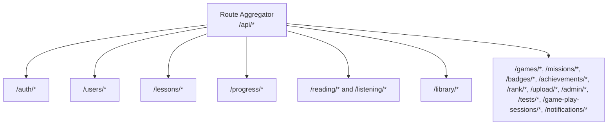
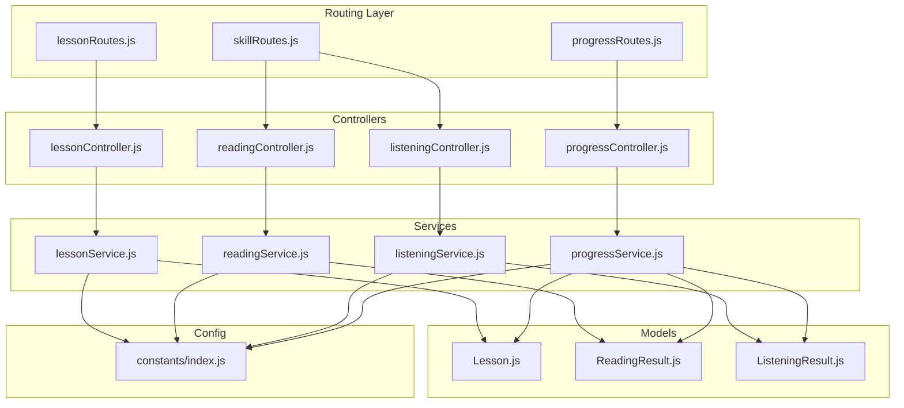
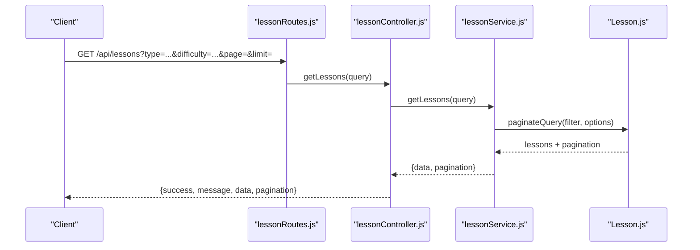
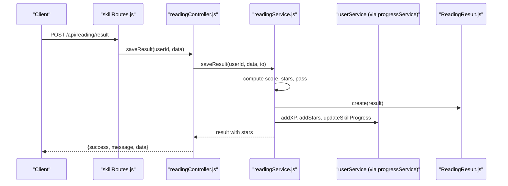
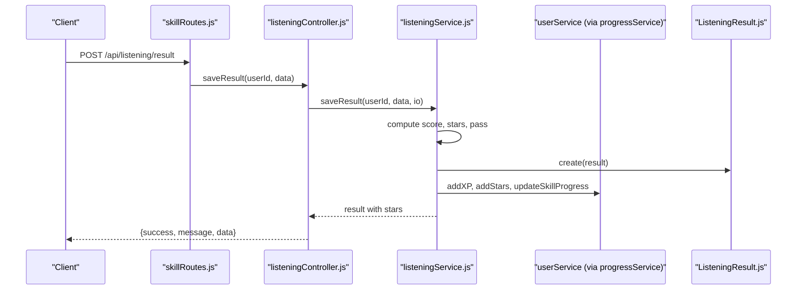
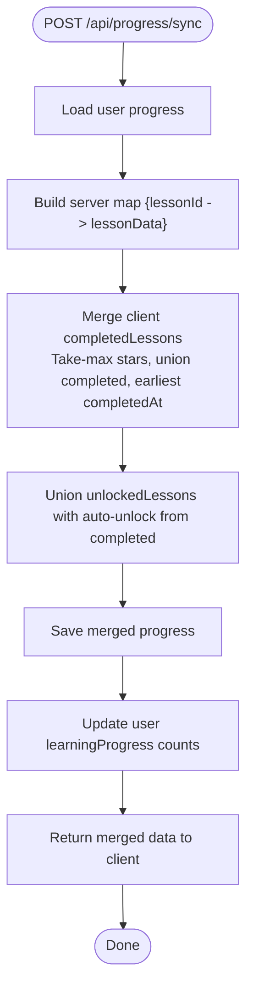
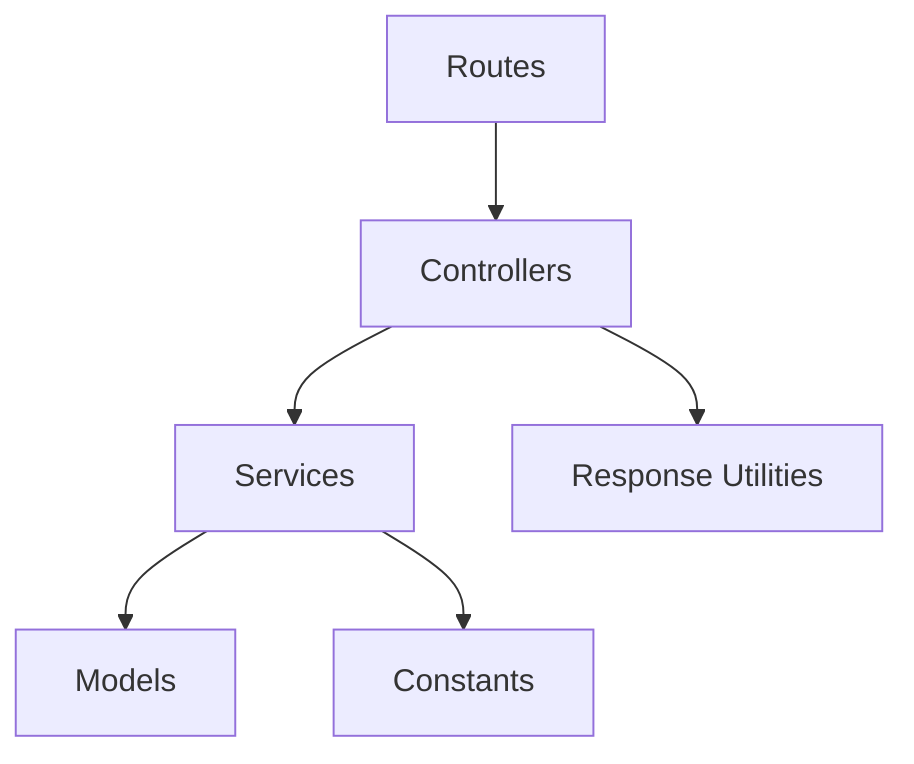
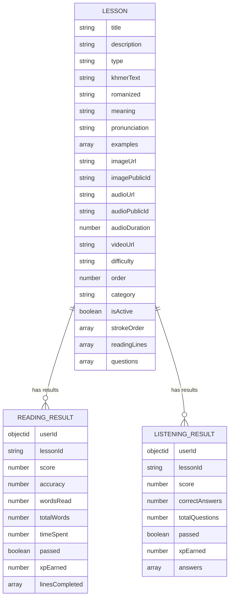

# Content and Learning APIs

<cite>
**Referenced Files in This Document**
- [routes/index.js](file://backend/src/routes/index.js)
- [lessonRoutes.js](file://backend/src/routes/lessonRoutes.js)
- [skillRoutes.js](file://backend/src/routes/skillRoutes.js)
- [progressRoutes.js](file://backend/src/routes/progressRoutes.js)
- [lessonController.js](file://backend/src/controllers/lessonController.js)
- [readingController.js](file://backend/src/controllers/readingController.js)
- [listeningController.js](file://backend/src/controllers/listeningController.js)
- [progressController.js](file://backend/src/controllers/progressController.js)
- [lessonService.js](file://backend/src/services/lessonService.js)
- [readingService.js](file://backend/src/services/readingService.js)
- [listeningService.js](file://backend/src/services/listeningService.js)
- [progressService.js](file://backend/src/services/progressService.js)
- [Lesson.js](file://backend/src/models/Lesson.js)
- [ReadingResult.js](file://backend/src/models/ReadingResult.js)
- [ListeningResult.js](file://backend/src/models/ListeningResult.js)
- [index.js](file://backend/src/constants/index.js)
</cite>

## Table of Contents
1. [Introduction](#introduction)
2. [Project Structure](#project-structure)
3. [Core Components](#core-components)
4. [Architecture Overview](#architecture-overview)
5. [Detailed Component Analysis](#detailed-component-analysis)
6. [Dependency Analysis](#dependency-analysis)
7. [Performance Considerations](#performance-considerations)
8. [Troubleshooting Guide](#troubleshooting-guide)
9. [Conclusion](#conclusion)
10. [Appendices](#appendices)

## Introduction
This document provides comprehensive API documentation for educational content delivery and learning management. It covers lesson retrieval, content categorization, library management, reading comprehension, listening exercises, spelling challenges, vocabulary practice, lesson progress tracking, content filtering, difficulty levels, and gamification mechanics. The APIs are organized under the /api base path and include endpoints for:
- Lesson catalog and filtering
- Skill-specific lessons and results
- Progress retrieval and bidirectional synchronization
- Lesson completion and unlocking
- Library browsing

## Project Structure
The backend exposes REST endpoints via Express routers mounted under /api. Key route groups include:
- Authentication and user management
- Lessons and lesson types
- Reading and Listening skills
- Progress tracking
- Library browsing
- Games, missions, badges, ranks, uploads, admin, tests, game play sessions, and notifications

**Diagram sources**
- [routes/index.js:28-47](file://backend/src/routes/index.js#L28-L47)

**Section sources**
- [routes/index.js:1-50](file://backend/src/routes/index.js#L1-L50)

## Core Components
- Lesson Catalog and Filtering
  - Retrieve lessons with pagination and filters (type, difficulty, category)
  - Fetch lessons by type with optional difficulty
  - Fetch individual lesson by ID
  - Admin endpoints to create, update, and soft-delete lessons
- Skill-Specific APIs
  - Reading: list reading lessons and submit reading results
  - Listening: list listening lessons and submit listening results
- Progress Management
  - Get current progress snapshot
  - Sync progress with bidirectional merge (take-max strategy)
  - Mark lesson as completed with star and XP rewards
  - Unlock lessons
- Library Management
  - Browse library items with type and search filters

**Section sources**
- [lessonController.js:11-86](file://backend/src/controllers/lessonController.js#L11-L86)
- [lessonService.js:14-129](file://backend/src/services/lessonService.js#L14-L129)
- [readingController.js:11-34](file://backend/src/controllers/readingController.js#L11-L34)
- [listeningController.js:7-38](file://backend/src/controllers/listeningController.js#L7-L38)
- [progressController.js:12-79](file://backend/src/controllers/progressController.js#L12-L79)
- [progressService.js:14-303](file://backend/src/services/progressService.js#L14-L303)
- [libraryController.js:11-33](file://backend/src/controllers/libraryController.js#L11-L33)

## Architecture Overview
The system follows a layered architecture:
- Routes define endpoint contracts and attach middleware (authentication, validation, role-based authorization)
- Controllers orchestrate requests and delegate to services
- Services encapsulate business logic and coordinate with models and external systems
- Models represent data structures and indexes for efficient queries
- Constants centralize enums and configuration

**Diagram sources**
- [lessonRoutes.js:14-33](file://backend/src/routes/lessonRoutes.js#L14-L33)
- [skillRoutes.js:7-41](file://backend/src/routes/skillRoutes.js#L7-L41)
- [progressRoutes.js:12-24](file://backend/src/routes/progressRoutes.js#L12-L24)
- [lessonController.js:7-86](file://backend/src/controllers/lessonController.js#L7-L86)
- [readingController.js:7-34](file://backend/src/controllers/readingController.js#L7-L34)
- [listeningController.js:3-38](file://backend/src/controllers/listeningController.js#L3-L38)
- [progressController.js:9-79](file://backend/src/controllers/progressController.js#L9-L79)
- [lessonService.js:9-129](file://backend/src/services/lessonService.js#L9-L129)
- [readingService.js:7-75](file://backend/src/services/readingService.js#L7-L75)
- [listeningService.js:7-87](file://backend/src/services/listeningService.js#L7-L87)
- [progressService.js:10-303](file://backend/src/services/progressService.js#L10-L303)
- [Lesson.js:10-154](file://backend/src/models/Lesson.js#L10-L154)
- [ReadingResult.js:7-66](file://backend/src/models/ReadingResult.js#L7-L66)
- [ListeningResult.js:7-58](file://backend/src/models/ListeningResult.js#L7-L58)
- [index.js:28-150](file://backend/src/constants/index.js#L28-L150)

## Detailed Component Analysis

### Lesson Catalog and Filtering
Endpoints
- GET /api/lessons
  - Filters: type, difficulty, category, page, limit
  - Returns paginated lessons with metadata
- GET /api/lessons/type/:type
  - Filters by type with optional difficulty
  - Returns paginated lessons
- GET /api/lessons/:id
  - Fetches a single lesson by ID
- POST /api/lessons (admin)
  - Creates a new lesson
- PUT /api/lessons/:id (admin)
  - Updates a lesson
- DELETE /api/lessons/:id (admin)
  - Soft-deletes a lesson

Request/Response Schema
- Request query parameters for GET /api/lessons:
  - type: string (enum from constants)
  - difficulty: string (beginner, intermediate, advanced)
  - category: string
  - page: number
  - limit: number
- Response payload:
  - success: boolean
  - message: string
  - data: array of lessons
  - pagination: object with page, limit, total, pages

Validation and Error Handling
- ID validation for GET /api/lessons/:id
- Admin-only access for create/update/delete
- Not found errors when lesson does not exist

**Diagram sources**
- [lessonRoutes.js:24-26](file://backend/src/routes/lessonRoutes.js#L24-L26)
- [lessonController.js:13-25](file://backend/src/controllers/lessonController.js#L13-L25)
- [lessonService.js:18-33](file://backend/src/services/lessonService.js#L18-L33)
- [Lesson.js:13-151](file://backend/src/models/Lesson.js#L13-L151)

**Section sources**
- [lessonRoutes.js:6-31](file://backend/src/routes/lessonRoutes.js#L6-L31)
- [lessonController.js:12-53](file://backend/src/controllers/lessonController.js#L12-L53)
- [lessonService.js:18-68](file://backend/src/services/lessonService.js#L18-L68)
- [Lesson.js:18-135](file://backend/src/models/Lesson.js#L18-L135)
- [index.js:29-115](file://backend/src/constants/index.js#L29-L115)

### Reading Comprehension
Endpoints
- GET /api/reading/lessons
  - Filters: difficulty, type
  - Returns reading lessons with minimal fields
- POST /api/reading/result
  - Submits reading result with computed score, accuracy, stars, and XP

Request/Response Schema
- POST /api/reading/result body:
  - lessonId: string
  - wordsRead: number
  - totalWords: number
  - timeSpent: number
  - linesCompleted: array of line completion records
  - skipGamification: boolean (optional)
- Response:
  - success: boolean
  - message: string
  - data: ReadingResult record with stars

Processing Logic
- Compute accuracy and score
- Determine stars and pass/fail thresholds
- Persist result and update user XP/stars and skill progress
- Optionally mark lesson as completed

**Diagram sources**
- [skillRoutes.js:33-36](file://backend/src/routes/skillRoutes.js#L33-L36)
- [readingController.js:22-31](file://backend/src/controllers/readingController.js#L22-L31)
- [readingService.js:34-72](file://backend/src/services/readingService.js#L34-L72)
- [ReadingResult.js:9-60](file://backend/src/models/ReadingResult.js#L9-L60)

**Section sources**
- [readingController.js:12-31](file://backend/src/controllers/readingController.js#L12-L31)
- [readingService.js:17-72](file://backend/src/services/readingService.js#L17-L72)
- [ReadingResult.js:10-55](file://backend/src/models/ReadingResult.js#L10-L55)
- [index.js:129-150](file://backend/src/constants/index.js#L129-L150)

### Listening Exercises
Endpoints
- GET /api/listening/lessons
  - Filters: difficulty
  - Returns listening lessons with questions
- POST /api/listening/result
  - Submits listening answers and returns computed score and stars

Request/Response Schema
- POST /api/listening/result body:
  - lessonId: string
  - answers: array of selected indices
  - correctAnswers: number
  - totalQuestions: number
  - skipGamification: boolean (optional)
- Response:
  - success: boolean
  - message: string
  - data: ListeningResult record with stars

Processing Logic
- Compute score percentage and stars
- Persist result and update user XP/stars and skill progress
- Optionally mark lesson as completed

**Diagram sources**
- [skillRoutes.js:23-26](file://backend/src/routes/skillRoutes.js#L23-L26)
- [listeningController.js:18-35](file://backend/src/controllers/listeningController.js#L18-L35)
- [listeningService.js:34-71](file://backend/src/services/listeningService.js#L34-L71)
- [ListeningResult.js:9-52](file://backend/src/models/ListeningResult.js#L9-L52)

**Section sources**
- [listeningController.js:8-35](file://backend/src/controllers/listeningController.js#L8-L35)
- [listeningService.js:18-71](file://backend/src/services/listeningService.js#L18-L71)
- [ListeningResult.js:10-47](file://backend/src/models/ListeningResult.js#L10-L47)
- [index.js:129-150](file://backend/src/constants/index.js#L129-L150)

### Progress Tracking and Synchronization
Endpoints
- GET /api/progress/get
  - Retrieves user progress snapshot including completed/unlocked lessons, game results, achievements, and profile metrics
- POST /api/progress/sync
  - Performs bidirectional merge using a take-max strategy for stars and union for unlocked lessons
- POST /api/progress/complete
  - Marks a lesson as completed, auto-unlocks it, and grants XP/stars
- POST /api/progress/unlock
  - Manually unlocks a lesson

Request/Response Schema
- POST /api/progress/sync body:
  - completedLessons: array of lesson records with lessonId, stars, isCompleted, completedAt, lessonType, lessonOrder
  - unlockedLessons: array of lesson IDs
- POST /api/progress/complete body:
  - lessonId: string (required)
  - stars: number
  - lessonType: string
  - lessonOrder: number
  - xp: number

Processing Logic
- Merge completed lessons using take-max for stars and earliest completion time
- Union unlocked lessons and auto-unlock completed lessons
- Update user XP/stars and learning progress counters
- Resolve lesson order/type automatically if missing

**Diagram sources**
- [progressRoutes.js:19-22](file://backend/src/routes/progressRoutes.js#L19-L22)
- [progressController.js:24-31](file://backend/src/controllers/progressController.js#L24-L31)
- [progressService.js:62-155](file://backend/src/services/progressService.js#L62-L155)

**Section sources**
- [progressRoutes.js:6-22](file://backend/src/routes/progressRoutes.js#L6-L22)
- [progressController.js:13-76](file://backend/src/controllers/progressController.js#L13-L76)
- [progressService.js:18-303](file://backend/src/services/progressService.js#L18-L303)

### Library Management
Endpoints
- GET /api/library
  - Filters: type, search (case-insensitive substring match on title)
  - Returns paginated library items sorted by newest first

Request/Response Schema
- Query parameters:
  - type: string
  - search: string
  - page: number
  - limit: number
- Response:
  - success: boolean
  - message: string
  - data: array of library items
  - pagination: object with page, limit, total, pages

**Section sources**
- [libraryController.js:12-31](file://backend/src/controllers/libraryController.js#L12-L31)

### Spelling Challenges and Vocabulary Practice
These lesson types are supported by the shared Lesson model and lesson filtering:
- Spelling: type "spelling", "closed_syllable", "coeng"
- Vocabulary: type "vocabulary"
- Sentence: type "sentence"
- Consonant/Vowel/Number: foundational types for building higher-level skills

Filtering and Retrieval
- Use GET /api/lessons with type and difficulty filters
- Use GET /api/lessons/type/:type for type-specific lists
- Use GET /api/lessons/:id for detailed content

**Section sources**
- [lessonService.js:18-68](file://backend/src/services/lessonService.js#L18-L68)
- [Lesson.js:27-135](file://backend/src/models/Lesson.js#L27-L135)
- [index.js:29-38](file://backend/src/constants/index.js#L29-L38)

## Dependency Analysis
Key dependencies and relationships:
- Routes depend on controllers and middleware (auth, role, validate)
- Controllers depend on services for business logic
- Services depend on models for persistence and on constants for enums/configuration
- Reading and Listening services persist results to dedicated models and coordinate with user services for XP/stars updates

**Diagram sources**
- [lessonRoutes.js:14-33](file://backend/src/routes/lessonRoutes.js#L14-L33)
- [skillRoutes.js:7-41](file://backend/src/routes/skillRoutes.js#L7-L41)
- [progressRoutes.js:12-24](file://backend/src/routes/progressRoutes.js#L12-L24)
- [lessonController.js:7-86](file://backend/src/controllers/lessonController.js#L7-L86)
- [readingController.js:7-34](file://backend/src/controllers/readingController.js#L7-L34)
- [listeningController.js:3-38](file://backend/src/controllers/listeningController.js#L3-L38)
- [progressController.js:9-79](file://backend/src/controllers/progressController.js#L9-L79)
- [lessonService.js:9-129](file://backend/src/services/lessonService.js#L9-L129)
- [readingService.js:7-75](file://backend/src/services/readingService.js#L7-L75)
- [listeningService.js:7-87](file://backend/src/services/listeningService.js#L7-L87)
- [progressService.js:10-303](file://backend/src/services/progressService.js#L10-L303)
- [Lesson.js:10-154](file://backend/src/models/Lesson.js#L10-L154)
- [ReadingResult.js:7-66](file://backend/src/models/ReadingResult.js#L7-L66)
- [ListeningResult.js:7-58](file://backend/src/models/ListeningResult.js#L7-L58)
- [index.js:28-150](file://backend/src/constants/index.js#L28-L150)

**Section sources**
- [lessonRoutes.js:14-33](file://backend/src/routes/lessonRoutes.js#L14-L33)
- [skillRoutes.js:7-41](file://backend/src/routes/skillRoutes.js#L7-L41)
- [progressRoutes.js:12-24](file://backend/src/routes/progressRoutes.js#L12-L24)
- [lessonService.js:9-129](file://backend/src/services/lessonService.js#L9-L129)
- [readingService.js:7-75](file://backend/src/services/readingService.js#L7-L75)
- [listeningService.js:7-87](file://backend/src/services/listeningService.js#L7-L87)
- [progressService.js:10-303](file://backend/src/services/progressService.js#L10-L303)
- [Lesson.js:10-154](file://backend/src/models/Lesson.js#L10-L154)
- [ReadingResult.js:7-66](file://backend/src/models/ReadingResult.js#L7-L66)
- [ListeningResult.js:7-58](file://backend/src/models/ListeningResult.js#L7-L58)
- [index.js:28-150](file://backend/src/constants/index.js#L28-L150)

## Performance Considerations
- Indexes on Lesson model optimize filtering by type/order, difficulty, activity status, and category
- Pagination is enforced for lesson listings to avoid large payloads
- Lean queries for reading/listening lesson retrieval reduce overhead
- Bidirectional sync uses map-based merging for efficient deduplication and conflict resolution

[No sources needed since this section provides general guidance]

## Troubleshooting Guide
Common issues and resolutions:
- Authentication failures: Ensure requests include a valid auth token for protected routes
- Validation errors: Verify request bodies conform to validator schemas (e.g., lesson creation/update, result submissions)
- Not found errors: Occur when accessing invalid lesson IDs or non-existent resources
- Rate limiting: Excessive requests may trigger rate limit responses

**Section sources**
- [lessonRoutes.js:16-19](file://backend/src/routes/lessonRoutes.js#L16-L19)
- [skillRoutes.js:11-18](file://backend/src/routes/skillRoutes.js#L11-L18)
- [progressRoutes.js:14](file://backend/src/routes/progressRoutes.js#L14)
- [lessonService.js:40-48](file://backend/src/services/lessonService.js#L40-L48)
- [index.js:167-207](file://backend/src/constants/index.js#L167-L207)

## Conclusion
The Content and Learning APIs provide a robust foundation for delivering Khmer language education content, enabling flexible lesson discovery, skill-specific assessments, and comprehensive progress tracking. The design emphasizes scalability through pagination, efficient indexing, and a clean separation of concerns across routing, controllers, services, and models.

[No sources needed since this section summarizes without analyzing specific files]

## Appendices

### API Reference Summary
- Lessons
  - GET /api/lessons
  - GET /api/lessons/type/:type
  - GET /api/lessons/:id
  - POST /api/lessons (admin)
  - PUT /api/lessons/:id (admin)
  - DELETE /api/lessons/:id (admin)
- Reading
  - GET /api/reading/lessons
  - POST /api/reading/result
- Listening
  - GET /api/listening/lessons
  - POST /api/listening/result
- Progress
  - GET /api/progress/get
  - POST /api/progress/sync
  - POST /api/progress/complete
  - POST /api/progress/unlock
- Library
  - GET /api/library

**Section sources**
- [lessonRoutes.js:6-31](file://backend/src/routes/lessonRoutes.js#L6-L31)
- [skillRoutes.js:23-36](file://backend/src/routes/skillRoutes.js#L23-L36)
- [progressRoutes.js:6-22](file://backend/src/routes/progressRoutes.js#L6-L22)
- [libraryController.js:12-31](file://backend/src/controllers/libraryController.js#L12-L31)

### Data Models Overview

**Diagram sources**
- [Lesson.js:18-135](file://backend/src/models/Lesson.js#L18-L135)
- [ReadingResult.js:16-55](file://backend/src/models/ReadingResult.js#L16-L55)
- [ListeningResult.js:16-47](file://backend/src/models/ListeningResult.js#L16-L47)