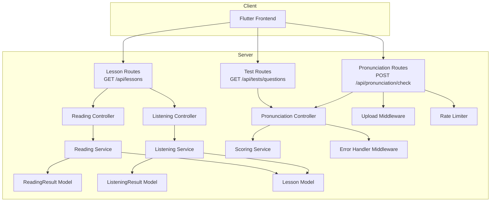
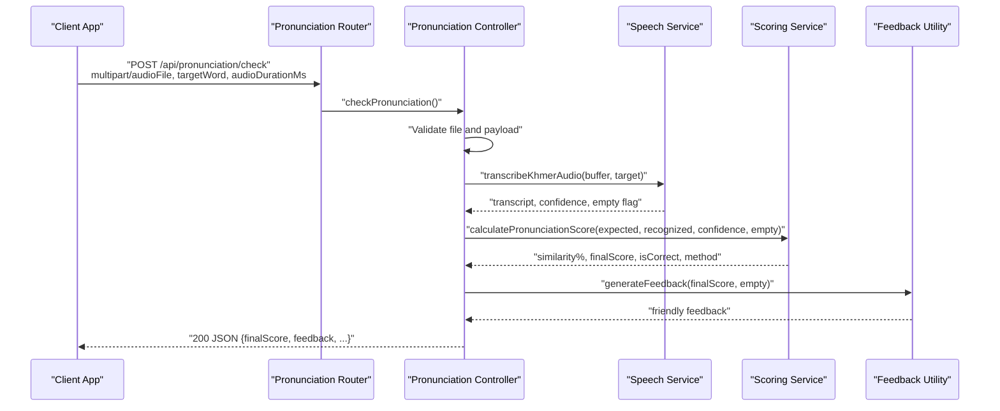
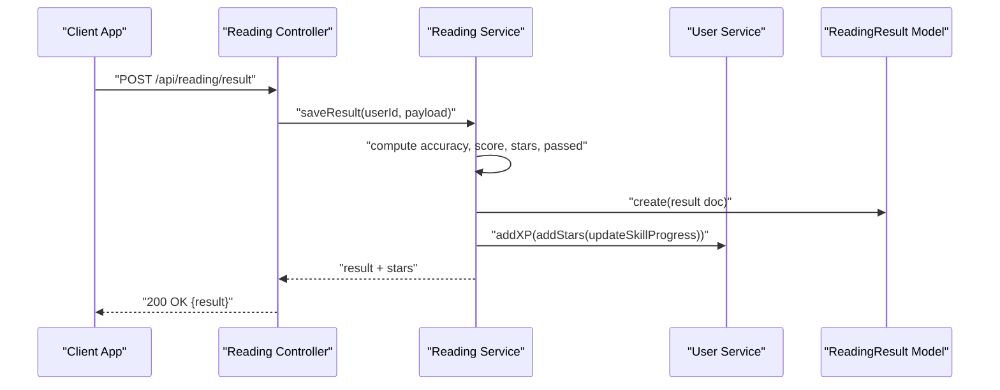
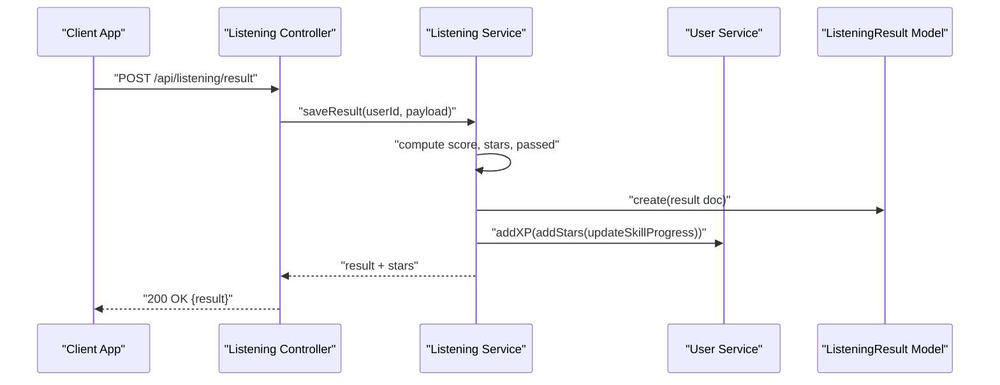
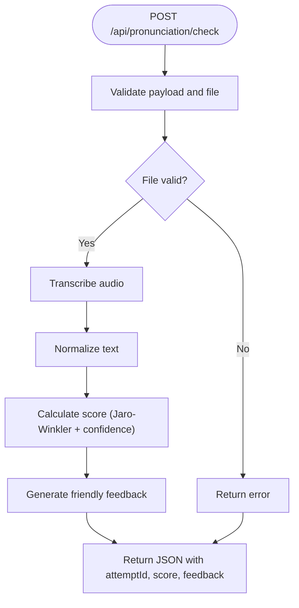
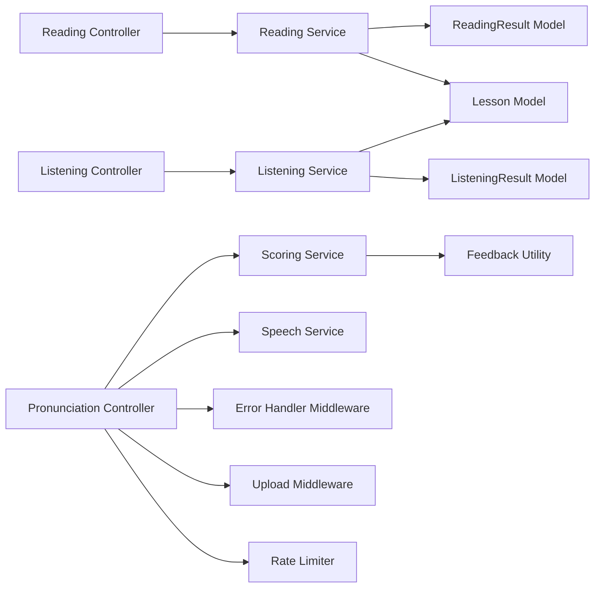

# Exercise and Practice APIs

<cite>
**Referenced Files in This Document**
- [server.js](file://backend/server.js)
- [lessonRoutes.js](file://backend/src/routes/lessonRoutes.js)
- [testRoutes.js](file://backend/src/routes/testRoutes.js)
- [pronunciation.route.js](file://backend/src/routes/pronunciation.route.js)
- [readingController.js](file://backend/src/controllers/readingController.js)
- [listeningController.js](file://backend/src/controllers/listeningController.js)
- [pronunciation.controller.js](file://backend/src/controllers/pronunciation.controller.js)
- [testController.js](file://backend/src/controllers/testController.js)
- [readingService.js](file://backend/src/services/readingService.js)
- [listeningService.js](file://backend/src/services/listeningService.js)
- [scoring.service.js](file://backend/src/services/scoring.service.js)
- [ReadingResult.js](file://backend/src/models/ReadingResult.js)
- [ListeningResult.js](file://backend/src/models/ListeningResult.js)
- [Lesson.js](file://backend/src/models/Lesson.js)
- [errorHandler.middleware.js](file://backend/src/middlewares/errorHandler.middleware.js)
- [upload.middleware.js](file://backend/src/middlewares/upload.middleware.js)
- [rateLimiter.js](file://backend/src/middlewares/rateLimiter.js)
- [response.js](file://backend/src/utils/response.js)
- [helpers.js](file://backend/src/utils/helpers.js)
- [feedback.util.js](file://backend/src/utils/feedback.util.js)
- [khmer.normalizer.js](file://backend/src/utils/khmer.normalizer.js)
- [speech.service.js](file://backend/src/services/speech.service.js)
- [TextToSpeechService.js](file://backend/src/services/TextToSpeechService.js)
- [ttsRoutes.js](file://backend/src/routes/ttsRoutes.js)
- [ttsController.js](file://backend/src/controllers/ttsController.js)
- [progressRoutes.js](file://backend/src/routes/progressRoutes.js)
- [progressController.js](file://backend/src/controllers/progressController.js)
- [progressService.js](file://backend/src/services/progressService.js)
- [progressModel.js](file://backend/src/models/Progress.js)
</cite>

## Table of Contents
1. [Introduction](#introduction)
2. [Project Structure](#project-structure)
3. [Core Components](#core-components)
4. [Architecture Overview](#architecture-overview)
5. [Detailed Component Analysis](#detailed-component-analysis)
6. [Dependency Analysis](#dependency-analysis)
7. [Performance Considerations](#performance-considerations)
8. [Troubleshooting Guide](#troubleshooting-guide)
9. [Conclusion](#conclusion)

## Introduction
This document provides comprehensive API documentation for interactive exercise and practice endpoints focused on reading comprehension, listening comprehension, pronunciation practice, spelling tests, and vocabulary quizzes. It covers endpoint definitions, request/response formats, validation rules, scoring algorithms, instant feedback mechanisms, and performance tracking. Exercise formats supported include multiple choice, typing, and audio-based interactions, with optional visual feedback and progress analytics.

## Project Structure
The backend follows a layered architecture:
- Routes define public endpoints and apply middleware (authentication, validation, rate limiting).
- Controllers orchestrate request handling and coordinate services.
- Services encapsulate business logic for exercise delivery, scoring, and gamification.
- Models represent persisted results and lesson metadata.
- Utilities provide text normalization, feedback generation, and helper functions.
- Middleware handles authentication, error handling, and file uploads.

**Diagram sources**
- [lessonRoutes.js:1-34](file://backend/src/routes/lessonRoutes.js#L1-L34)
- [testRoutes.js:1-15](file://backend/src/routes/testRoutes.js#L1-L15)
- [pronunciation.route.js:1-45](file://backend/src/routes/pronunciation.route.js#L1-L45)
- [readingController.js:1-35](file://backend/src/controllers/readingController.js#L1-L35)
- [listeningController.js:1-39](file://backend/src/controllers/listeningController.js#L1-L39)
- [pronunciation.controller.js:1-137](file://backend/src/controllers/pronunciation.controller.js#L1-L137)
- [readingService.js:1-76](file://backend/src/services/readingService.js#L1-L76)
- [listeningService.js:1-88](file://backend/src/services/listeningService.js#L1-L88)
- [scoring.service.js:1-279](file://backend/src/services/scoring.service.js#L1-L279)
- [ReadingResult.js:1-67](file://backend/src/models/ReadingResult.js#L1-L67)
- [ListeningResult.js:1-59](file://backend/src/models/ListeningResult.js#L1-L59)
- [Lesson.js](file://backend/src/models/Lesson.js)

**Section sources**
- [lessonRoutes.js:1-34](file://backend/src/routes/lessonRoutes.js#L1-L34)
- [testRoutes.js:1-15](file://backend/src/routes/testRoutes.js#L1-L15)
- [pronunciation.route.js:1-45](file://backend/src/routes/pronunciation.route.js#L1-L45)

## Core Components
- Reading Comprehension
  - Endpoint: GET /api/lessons?type=reading
  - Delivery: Returns structured reading lessons with text, audio, and metadata.
  - Submission: POST /api/reading/result with wordsRead, totalWords, timeSpent, linesCompleted.
  - Scoring: Accuracy equals score; pass threshold derived from helpers; XP and star rewards applied.
  - Results stored in ReadingResult model.

- Listening Comprehension
  - Endpoint: GET /api/lessons?type=listening
  - Delivery: Returns lessons with questions array.
  - Submission: POST /api/listening/result with answers array, correctAnswers, totalQuestions.
  - Scoring: Percentage-based; pass threshold; XP and stars; optional lesson completion marking.
  - Results stored in ListeningResult model.

- Pronunciation Practice
  - Endpoint: POST /api/pronunciation/check
  - Upload: multipart/form-data with audioFile and targetWord; optional audioDurationMs.
  - Validation: File size, duration limits, target word presence and Khmer-only characters.
  - Processing: Speech-to-text via Google Cloud Speech-to-Text, normalization, Jaro-Winkler similarity, confidence weighting.
  - Feedback: Friendly feedback generated based on score.
  - Rate limiting: 10 requests per minute per IP.

- Spelling Tests
  - Endpoint: GET /api/tests/questions
  - Delivery: Returns active test questions filtered by testRange if provided.
  - Submission: Not exposed in current routes; designed for admin-managed tests.

- Vocabulary Quizzes
  - Endpoint: GET /api/lessons?type=vocabulary
  - Delivery: Lessons categorized as vocabulary; suitable for multiple-choice or typing formats.
  - Submission: Not exposed in current routes; designed for admin-managed quiz sessions.

- Audio Playback and Text-to-Speech
  - TTS endpoints: GET /api/tts with text and locale parameters.
  - Service: Uses TextToSpeechService with provider-specific logic.
  - Integration: Listening lessons include audioUrl; TTS generates audio for selected texts.

- Progress Analytics
  - Tracking: ReadingResult and ListeningResult models include timestamps, scores, and XP.
  - Skill progress: Per-skill XP and star updates via user service.
  - History: Listening history retrieval via service method.

**Section sources**
- [readingController.js:1-35](file://backend/src/controllers/readingController.js#L1-L35)
- [readingService.js:1-76](file://backend/src/services/readingService.js#L1-L76)
- [ReadingResult.js:1-67](file://backend/src/models/ReadingResult.js#L1-L67)
- [listeningController.js:1-39](file://backend/src/controllers/listeningController.js#L1-L39)
- [listeningService.js:1-88](file://backend/src/services/listeningService.js#L1-L88)
- [ListeningResult.js:1-59](file://backend/src/models/ListeningResult.js#L1-L59)
- [pronunciation.controller.js:1-137](file://backend/src/controllers/pronunciation.controller.js#L1-L137)
- [pronunciation.route.js:1-45](file://backend/src/routes/pronunciation.route.js#L1-L45)
- [scoring.service.js:1-279](file://backend/src/services/scoring.service.js#L1-L279)
- [testController.js:1-29](file://backend/src/controllers/testController.js#L1-L29)
- [testRoutes.js:1-15](file://backend/src/routes/testRoutes.js#L1-L15)
- [lessonRoutes.js:1-34](file://backend/src/routes/lessonRoutes.js#L1-L34)
- [ttsRoutes.js](file://backend/src/routes/ttsRoutes.js)
- [ttsController.js](file://backend/src/controllers/ttsController.js)
- [TextToSpeechService.js](file://backend/src/services/TextToSpeechService.js)
- [progressRoutes.js](file://backend/src/routes/progressRoutes.js)
- [progressController.js](file://backend/src/controllers/progressController.js)
- [progressService.js](file://backend/src/services/progressService.js)
- [progressModel.js](file://backend/src/models/Progress.js)

## Architecture Overview
The system integrates REST endpoints with real-time capabilities and external services:
- Authentication: JWT-based middleware secures routes.
- Validation: Express validator combined with custom validators.
- Rate Limiting: Separate limits for pronunciation checks to protect Google STT costs.
- File Upload: Multer middleware for audio submissions.
- External Integrations: Google Cloud Speech-to-Text for pronunciation scoring.
- Real-time Updates: Socket.IO integration available for live notifications.

**Diagram sources**
- [pronunciation.route.js:1-45](file://backend/src/routes/pronunciation.route.js#L1-L45)
- [pronunciation.controller.js:1-137](file://backend/src/controllers/pronunciation.controller.js#L1-L137)
- [speech.service.js](file://backend/src/services/speech.service.js)
- [scoring.service.js:1-279](file://backend/src/services/scoring.service.js#L1-L279)
- [feedback.util.js](file://backend/src/utils/feedback.util.js)

## Detailed Component Analysis

### Reading Comprehension API
- Endpoint: GET /api/lessons?type=reading
  - Filters: difficulty, type; returns ordered lessons with reading content and audio.
- Endpoint: POST /api/reading/result
  - Payload keys: lessonId, wordsRead, totalWords, timeSpent, linesCompleted, skipGamification.
  - Scoring: accuracy = wordsRead/totalWords; score = accuracy; pass threshold via helpers.
  - Rewards: XP and stars computed; optional lesson completion marking.
  - Persistence: ReadingResult model with indexed composite key.

**Diagram sources**
- [readingController.js:1-35](file://backend/src/controllers/readingController.js#L1-L35)
- [readingService.js:1-76](file://backend/src/services/readingService.js#L1-L76)
- [ReadingResult.js:1-67](file://backend/src/models/ReadingResult.js#L1-L67)
- [helpers.js](file://backend/src/utils/helpers.js)

**Section sources**
- [readingController.js:1-35](file://backend/src/controllers/readingController.js#L1-L35)
- [readingService.js:1-76](file://backend/src/services/readingService.js#L1-L76)
- [ReadingResult.js:1-67](file://backend/src/models/ReadingResult.js#L1-L67)

### Listening Comprehension API
- Endpoint: GET /api/lessons?type=listening
  - Filters: difficulty; ensures lessons have questions populated.
- Endpoint: POST /api/listening/result
  - Payload keys: lessonId, answers (array of questionIndex, selectedAnswer, correctAnswer, isCorrect), correctAnswers, totalQuestions.
  - Scoring: percentage-based; pass threshold; XP and stars; optional lesson completion.
  - Persistence: ListeningResult model with indexed composite key.

**Diagram sources**
- [listeningController.js:1-39](file://backend/src/controllers/listeningController.js#L1-L39)
- [listeningService.js:1-88](file://backend/src/services/listeningService.js#L1-L88)
- [ListeningResult.js:1-59](file://backend/src/models/ListeningResult.js#L1-L59)

**Section sources**
- [listeningController.js:1-39](file://backend/src/controllers/listeningController.js#L1-L39)
- [listeningService.js:1-88](file://backend/src/services/listeningService.js#L1-L88)
- [ListeningResult.js:1-59](file://backend/src/models/ListeningResult.js#L1-L59)

### Pronunciation Practice API
- Endpoint: POST /api/pronunciation/check
  - Upload: audioFile (multipart), targetWord (body), audioDurationMs (optional).
  - Validation rules:
    - File exists and size >= 10KB.
    - Duration between 0.5s and 30s if provided.
    - Target word present, non-empty, Khmer Unicode only.
  - Processing pipeline:
    - Transcription via Google STT.
    - Text normalization.
    - Jaro-Winkler similarity calculation with confidence weighting.
    - Length penalty adjustment.
    - Pass threshold 65%.
  - Response: attemptId, targetWord, recognizedText, similarity%, finalScore, isCorrect, feedback, scoringMethod.

**Diagram sources**
- [pronunciation.controller.js:1-137](file://backend/src/controllers/pronunciation.controller.js#L1-L137)
- [scoring.service.js:1-279](file://backend/src/services/scoring.service.js#L1-L279)
- [speech.service.js](file://backend/src/services/speech.service.js)
- [khmer.normalizer.js](file://backend/src/utils/khmer.normalizer.js)
- [feedback.util.js](file://backend/src/utils/feedback.util.js)

**Section sources**
- [pronunciation.route.js:1-45](file://backend/src/routes/pronunciation.route.js#L1-L45)
- [pronunciation.controller.js:1-137](file://backend/src/controllers/pronunciation.controller.js#L1-L137)
- [scoring.service.js:1-279](file://backend/src/services/scoring.service.js#L1-L279)

### Spelling Tests API
- Endpoint: GET /api/tests/questions
  - Filters: testRange (optional); returns active questions sorted by creation date.
  - Use case: Admin-curated spelling assessments; client-side selection and submission logic to be implemented.

**Section sources**
- [testRoutes.js:1-15](file://backend/src/routes/testRoutes.js#L1-L15)
- [testController.js:1-29](file://backend/src/controllers/testController.js#L1-L29)

### Vocabulary Quizzes API
- Endpoint: GET /api/lessons?type=vocabulary
  - Returns vocabulary-focused lessons; suitable for multiple-choice or typing exercises.
  - Submission endpoints not exposed; designed for admin-managed quiz sessions.

**Section sources**
- [lessonRoutes.js:1-34](file://backend/src/routes/lessonRoutes.js#L1-L34)

### Audio Playback and Text-to-Speech
- TTS Endpoint: GET /api/tts
  - Parameters: text, locale; returns synthesized audio stream.
  - Service: TextToSpeechService orchestrates provider-specific synthesis.
  - Integration: Listening lessons include audioUrl; TTS enables dynamic audio generation.

**Section sources**
- [ttsRoutes.js](file://backend/src/routes/ttsRoutes.js)
- [ttsController.js](file://backend/src/controllers/ttsController.js)
- [TextToSpeechService.js](file://backend/src/services/TextToSpeechService.js)

### Progress Analytics
- Models: ReadingResult and ListeningResult capture timestamps, scores, XP, and pass/fail outcomes.
- Service: Progress tracking via progressService and Progress model.
- Controller: Aggregated analytics and history retrieval endpoints.

**Section sources**
- [progressRoutes.js](file://backend/src/routes/progressRoutes.js)
- [progressController.js](file://backend/src/controllers/progressController.js)
- [progressService.js](file://backend/src/services/progressService.js)
- [progressModel.js](file://backend/src/models/Progress.js)

## Dependency Analysis
Key dependencies and relationships:
- Controllers depend on services for business logic.
- Services persist results via Mongoose models.
- Scoring service implements Jaro-Winkler and confidence weighting.
- Middleware applies authentication, validation, rate limiting, and error handling.
- External integrations include Google Cloud Speech-to-Text and Cloudinary for media.

**Diagram sources**
- [readingController.js:1-35](file://backend/src/controllers/readingController.js#L1-L35)
- [listeningController.js:1-39](file://backend/src/controllers/listeningController.js#L1-L39)
- [pronunciation.controller.js:1-137](file://backend/src/controllers/pronunciation.controller.js#L1-L137)
- [readingService.js:1-76](file://backend/src/services/readingService.js#L1-L76)
- [listeningService.js:1-88](file://backend/src/services/listeningService.js#L1-L88)
- [scoring.service.js:1-279](file://backend/src/services/scoring.service.js#L1-L279)
- [ReadingResult.js:1-67](file://backend/src/models/ReadingResult.js#L1-L67)
- [ListeningResult.js:1-59](file://backend/src/models/ListeningResult.js#L1-L59)
- [Lesson.js](file://backend/src/models/Lesson.js)
- [speech.service.js](file://backend/src/services/speech.service.js)
- [feedback.util.js](file://backend/src/utils/feedback.util.js)
- [errorHandler.middleware.js](file://backend/src/middlewares/errorHandler.middleware.js)
- [upload.middleware.js](file://backend/src/middlewares/upload.middleware.js)
- [rateLimiter.js](file://backend/src/middlewares/rateLimiter.js)

**Section sources**
- [readingService.js:1-76](file://backend/src/services/readingService.js#L1-L76)
- [listeningService.js:1-88](file://backend/src/services/listeningService.js#L1-L88)
- [scoring.service.js:1-279](file://backend/src/services/scoring.service.js#L1-L279)

## Performance Considerations
- Pronunciation rate limiting: 10 requests per minute per IP to control Google STT usage.
- File size thresholds: Minimum 10KB audio to avoid silence detection and reduce false positives.
- Scoring latency: Logging indicates attempt-level latency; warnings emitted for durations exceeding 4 seconds.
- Confidence weighting: Adjusts final score to account for lower-than-expected STT confidence in Khmer.
- Length penalty: Mitigates inflated similarity for very short vs. long strings.

[No sources needed since this section provides general guidance]

## Troubleshooting Guide
Common issues and resolutions:
- Pronunciation errors:
  - Missing audio file or invalid format: ensure multipart field name is audioFile.
  - Silence or too short audio: minimum 10KB and 0.5s duration.
  - Excessive duration: limit to 30 seconds.
  - Target word validation: must be non-empty and contain only Khmer Unicode characters.
- Listening result submission:
  - Ensure answers array includes questionIndex, selectedAnswer, correctAnswer, isCorrect entries.
  - Verify correctAnswers and totalQuestions are integers.
- Reading result submission:
  - Provide wordsRead and totalWords; timeSpent is optional.
  - linesCompleted is optional but recommended for granular progress.
- Error handling:
  - Global error handler middleware standardizes error responses with status codes and error codes.
  - Debug logging in listening controller writes request payloads and results to a log file for diagnostics.

**Section sources**
- [pronunciation.controller.js:1-137](file://backend/src/controllers/pronunciation.controller.js#L1-L137)
- [listeningController.js:1-39](file://backend/src/controllers/listeningController.js#L1-L39)
- [errorHandler.middleware.js](file://backend/src/middlewares/errorHandler.middleware.js)

## Conclusion
The Exercise and Practice APIs provide a robust foundation for delivering interactive learning experiences across reading, listening, pronunciation, spelling, and vocabulary domains. With validated endpoints, standardized scoring, real-time feedback, and integrated progress tracking, the system supports adaptive difficulty and gamified learning outcomes tailored for young learners.