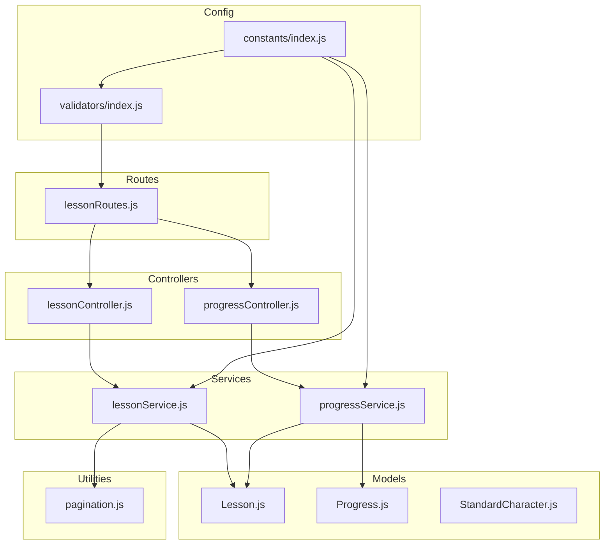
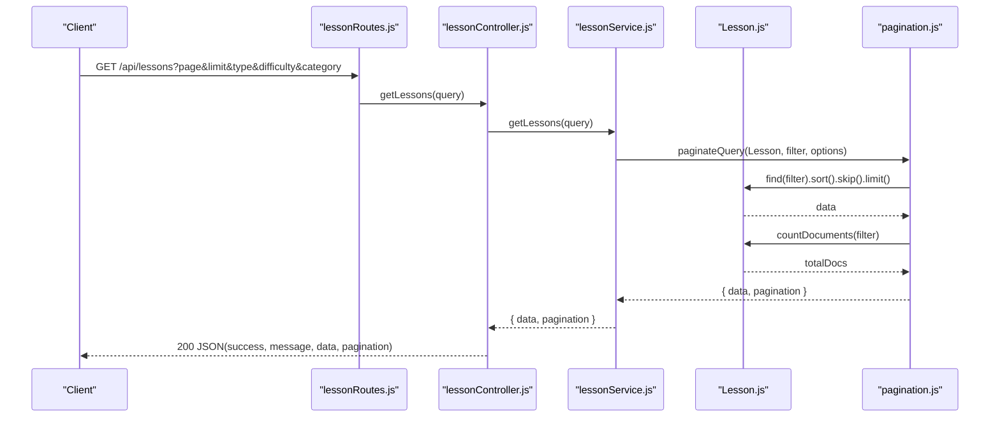
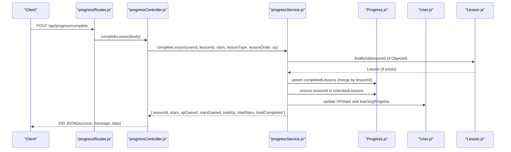
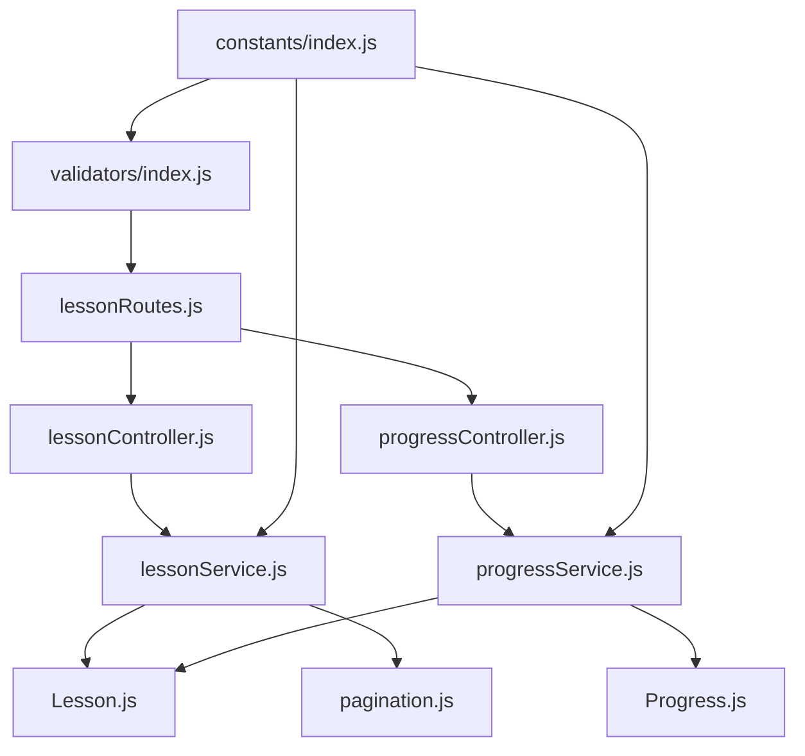

# Lesson Management APIs

<cite>
**Referenced Files in This Document**
- [lessonController.js](file://backend/src/controllers/lessonController.js)
- [lessonRoutes.js](file://backend/src/routes/lessonRoutes.js)
- [lessonService.js](file://backend/src/services/lessonService.js)
- [Lesson.js](file://backend/src/models/Lesson.js)
- [progressController.js](file://backend/src/controllers/progressController.js)
- [progressService.js](file://backend/src/services/progressService.js)
- [Progress.js](file://backend/src/models/Progress.js)
- [index.js](file://backend/src/constants/index.js)
- [index.js](file://backend/src/validators/index.js)
- [pagination.js](file://backend/src/utils/pagination.js)
- [StandardCharacter.js](file://backend/src/models/StandardCharacter.js)
</cite>

## Table of Contents
1. [Introduction](#introduction)
2. [Project Structure](#project-structure)
3. [Core Components](#core-components)
4. [Architecture Overview](#architecture-overview)
5. [Detailed Component Analysis](#detailed-component-analysis)
6. [Dependency Analysis](#dependency-analysis)
7. [Performance Considerations](#performance-considerations)
8. [Troubleshooting Guide](#troubleshooting-guide)
9. [Conclusion](#conclusion)

## Introduction
This document provides comprehensive API documentation for lesson management endpoints in the backend service. It covers lesson retrieval, categorization, filtering, pagination, lesson metadata operations, and progress tracking. It also documents lesson types, difficulty levels, and content sequencing logic. Educational standards mapping is supported via the StandardCharacter model for writing lessons.

## Project Structure
The lesson management functionality is implemented using a layered architecture:
- Routes define the HTTP endpoints and apply middleware for authentication, authorization, and validation.
- Controllers handle request/response handling and delegate business logic to services.
- Services encapsulate CRUD operations, filtering, pagination, and progress synchronization.
- Models define schemas for lessons, progress, and standard characters.
- Utilities provide reusable pagination helpers.
- Constants and validators define lesson types, difficulty levels, and validation rules.

**Diagram sources**
- [lessonRoutes.js:1-34](file://backend/src/routes/lessonRoutes.js#L1-L34)
- [lessonController.js:1-87](file://backend/src/controllers/lessonController.js#L1-L87)
- [lessonService.js:1-130](file://backend/src/services/lessonService.js#L1-L130)
- [Lesson.js:1-155](file://backend/src/models/Lesson.js#L1-L155)
- [progressController.js:1-80](file://backend/src/controllers/progressController.js#L1-L80)
- [progressService.js:1-304](file://backend/src/services/progressService.js#L1-L304)
- [Progress.js:1-112](file://backend/src/models/Progress.js#L1-L112)
- [pagination.js:1-74](file://backend/src/utils/pagination.js#L1-L74)
- [index.js:27-38](file://backend/src/constants/index.js#L27-L38)
- [index.js:109-115](file://backend/src/constants/index.js#L109-L115)
- [index.js:98-108](file://backend/src/validators/index.js#L98-L108)

**Section sources**
- [lessonRoutes.js:1-34](file://backend/src/routes/lessonRoutes.js#L1-L34)
- [lessonController.js:1-87](file://backend/src/controllers/lessonController.js#L1-L87)
- [lessonService.js:1-130](file://backend/src/services/lessonService.js#L1-L130)
- [Lesson.js:1-155](file://backend/src/models/Lesson.js#L1-L155)
- [progressController.js:1-80](file://backend/src/controllers/progressController.js#L1-L80)
- [progressService.js:1-304](file://backend/src/services/progressService.js#L1-L304)
- [Progress.js:1-112](file://backend/src/models/Progress.js#L1-L112)
- [pagination.js:1-74](file://backend/src/utils/pagination.js#L1-L74)
- [index.js:27-38](file://backend/src/constants/index.js#L27-L38)
- [index.js:109-115](file://backend/src/constants/index.js#L109-L115)
- [index.js:98-108](file://backend/src/validators/index.js#L98-L108)

## Core Components
- Lesson Routes: Define public endpoints for retrieving lessons, filtering by type, and admin endpoints for creating, updating, and deleting lessons.
- Lesson Controller: Orchestrates requests and responses for lesson operations.
- Lesson Service: Implements filtering, pagination, and lesson statistics.
- Lesson Model: Defines lesson schema including metadata, content, media, settings, and lesson-specific arrays (stroke order, reading lines, questions).
- Progress Routes and Controller: Provide endpoints for progress retrieval, synchronization, marking lessons complete, and unlocking lessons.
- Progress Service: Manages offline-first progress synchronization with a take-max merge strategy, updates user gamification metrics, and auto-unlocks lessons upon completion.
- Progress Model: Stores completed lessons, unlocked lessons, game results, achievements, and sync metadata.
- Constants and Validators: Define lesson types, difficulty levels, and validation rules for lesson creation and updates.
- Pagination Utility: Provides reusable pagination logic for Mongoose queries.

**Section sources**
- [lessonRoutes.js:6-11](file://backend/src/routes/lessonRoutes.js#L6-L11)
- [lessonController.js:11-84](file://backend/src/controllers/lessonController.js#L11-L84)
- [lessonService.js:14-127](file://backend/src/services/lessonService.js#L14-L127)
- [Lesson.js:13-152](file://backend/src/models/Lesson.js#L13-L152)
- [progressController.js:12-77](file://backend/src/controllers/progressController.js#L12-L77)
- [progressService.js:14-301](file://backend/src/services/progressService.js#L14-L301)
- [Progress.js:12-111](file://backend/src/models/Progress.js#L12-L111)
- [index.js:27-38](file://backend/src/constants/index.js#L27-L38)
- [index.js:109-115](file://backend/src/constants/index.js#L109-L115)
- [index.js:26-45](file://backend/src/validators/index.js#L26-L45)
- [pagination.js:49-67](file://backend/src/utils/pagination.js#L49-L67)

## Architecture Overview
The lesson management API follows a clean architecture with separation of concerns:
- Authentication middleware secures all lesson routes.
- Authorization middleware restricts admin endpoints to administrators.
- Validation middleware ensures request payloads conform to predefined rules.
- Controllers delegate to services for business logic.
- Services query models and utilities for data operations.
- Models enforce schema constraints and indexes for efficient queries.

**Diagram sources**
- [lessonRoutes.js:24-25](file://backend/src/routes/lessonRoutes.js#L24-L25)
- [lessonController.js:13-25](file://backend/src/controllers/lessonController.js#L13-L25)
- [lessonService.js:18-33](file://backend/src/services/lessonService.js#L18-L33)
- [pagination.js:49-67](file://backend/src/utils/pagination.js#L49-L67)
- [Lesson.js:13-152](file://backend/src/models/Lesson.js#L13-L152)

## Detailed Component Analysis

### Lesson Retrieval Endpoints
- GET /api/lessons
  - Purpose: Retrieve paginated lessons with optional filters.
  - Query Parameters:
    - page: Page number (default: 1, min: 1, capped by utility).
    - limit: Items per page (default: 10, max: 50).
    - type: Lesson type filter (must be one of the defined lesson types).
    - difficulty: Difficulty filter (must be one of beginner, intermediate, advanced).
    - category: Category filter.
  - Sorting: Defaults to order ascending, then createdAt descending.
  - Response: { success: boolean, message: string, data: Lesson[], pagination: object }.
  - Pagination Fields: currentPage, totalPages, totalDocs, limit, hasNextPage, hasPrevPage.

- GET /api/lessons/type/:type
  - Purpose: Retrieve lessons filtered by type with pagination.
  - Path Parameter: type (must be a valid lesson type).
  - Query Parameters: page, limit (default limit: 50), difficulty (optional).
  - Sorting: order ascending.
  - Response: Same as above.

- GET /api/lessons/:id
  - Purpose: Retrieve a single lesson by its ID.
  - Path Parameter: id (MongoDB ObjectId).
  - Response: { success: boolean, message: string, data: Lesson }.
  - Error: Returns 404 if not found or invalid ID.

**Section sources**
- [lessonRoutes.js:6-11](file://backend/src/routes/lessonRoutes.js#L6-L11)
- [lessonController.js:13-53](file://backend/src/controllers/lessonController.js#L13-L53)
- [lessonService.js:18-68](file://backend/src/services/lessonService.js#L18-L68)
- [pagination.js:14-40](file://backend/src/utils/pagination.js#L14-L40)
- [index.js:27-38](file://backend/src/constants/index.js#L27-L38)
- [index.js:109-115](file://backend/src/constants/index.js#L109-L115)

### Lesson Metadata Operations
- POST /api/lessons (Admin)
  - Purpose: Create a new lesson.
  - Request Body: Title, type (validated), khmerText, difficulty (optional), and other metadata fields.
  - Response: { success: boolean, message: string, data: Lesson }.
  - Validation: Uses createLessonValidator to ensure required fields and valid enums.

- PUT /api/lessons/:id (Admin)
  - Purpose: Update an existing lesson.
  - Path Parameter: id (MongoDB ObjectId).
  - Request Body: Optional fields (title, type, difficulty, etc.).
  - Response: { success: boolean, message: string, data: Lesson }.
  - Validation: Uses updateLessonValidator.

- DELETE /api/lessons/:id (Admin)
  - Purpose: Soft delete a lesson by setting isActive to false.
  - Response: { success: boolean, message: string }.

**Section sources**
- [lessonRoutes.js:28-31](file://backend/src/routes/lessonRoutes.js#L28-L31)
- [lessonController.js:55-83](file://backend/src/controllers/lessonController.js#L55-L83)
- [lessonService.js:73-109](file://backend/src/services/lessonService.js#L73-L109)
- [index.js:26-45](file://backend/src/validators/index.js#L26-L45)

### Filtering and Pagination
- Filters:
  - isActive: true by default for lesson retrieval.
  - type, difficulty, category: Applied when provided.
- Pagination:
  - Page defaults to 1 and is clamped to a minimum of 1.
  - Limit defaults to 10 and is clamped between 1 and 50.
  - Skip calculated as (page - 1) * limit.
- Sorting:
  - Default sort for GET /api/lessons is order ascending, then createdAt descending.
  - Type-specific endpoint sorts by order ascending.

**Section sources**
- [lessonService.js:18-33](file://backend/src/services/lessonService.js#L18-L33)
- [lessonService.js:56-68](file://backend/src/services/lessonService.js#L56-L68)
- [pagination.js:14-20](file://backend/src/utils/pagination.js#L14-L20)
- [pagination.js:49-67](file://backend/src/utils/pagination.js#L49-L67)

### Lesson Types, Difficulty Levels, and Sequencing
- Lesson Types:
  - consonant, vowel, spelling, closed_syllable, vocabulary, sentence, number, coeng.
- Difficulty Levels:
  - beginner, intermediate, advanced.
- Sequencing:
  - order field determines lesson sequence.
  - Combined index on type and order supports efficient sorting and grouping.

**Section sources**
- [index.js:27-38](file://backend/src/constants/index.js#L27-L38)
- [index.js:109-115](file://backend/src/constants/index.js#L109-L115)
- [Lesson.js:147-150](file://backend/src/models/Lesson.js#L147-L150)

### Progress Tracking and Completion
- GET /api/progress/get
  - Purpose: Retrieve user’s complete progress snapshot.
  - Response: { completedLessons, unlockedLessons, gameResults, achievements, lastSyncAt, profile }.

- POST /api/progress/sync
  - Purpose: Bidirectional sync with take-max strategy.
  - Request Body: Client progress snapshot.
  - Behavior:
    - Merge completed lessons by lessonId: take max stars, union completion flags, keep earliest completedAt.
    - Union unlocked lessons and auto-unlock lessons that are now completed.
    - Save merged progress and update user learning progress counters.
  - Response: Merged progress snapshot with isUnlocked set to true for all lessons.

- POST /api/progress/complete
  - Purpose: Mark a lesson complete and optionally award stars/XP.
  - Request Body: lessonId (required), stars, lessonType, lessonOrder, xp.
  - Resolution Logic:
    - If lessonId is a MongoDB ObjectId, resolve lessonType and lessonOrder from the lesson document.
    - If lessonId contains an underscore suffix, derive lessonOrder and lessonType from parts.
    - If unresolved, fallback to provided values or defaults.
  - Behavior:
    - Update or insert completed lesson with stars and completion flag.
    - Auto-unlock lesson if not already unlocked.
    - Update user XP/stars and learning progress counters.
  - Response: { lessonId, stars, xpGained, starsGained, totalXp, totalStars, totalCompleted }.

- POST /api/progress/unlock
  - Purpose: Unlock a lesson without marking it complete.
  - Request Body: lessonId (required).
  - Response: { lessonId, unlocked: true }.

**Diagram sources**
- [progressController.js:33-57](file://backend/src/controllers/progressController.js#L33-L57)
- [progressService.js:160-285](file://backend/src/services/progressService.js#L160-L285)
- [Progress.js:12-111](file://backend/src/models/Progress.js#L12-L111)
- [Lesson.js:13-152](file://backend/src/models/Lesson.js#L13-L152)

**Section sources**
- [progressController.js:13-77](file://backend/src/controllers/progressController.js#L13-L77)
- [progressService.js:34-155](file://backend/src/services/progressService.js#L34-L155)
- [progressService.js:160-285](file://backend/src/services/progressService.js#L160-L285)
- [Progress.js:12-111](file://backend/src/models/Progress.js#L12-L111)

### Educational Standards Mapping (Writing)
- StandardCharacter Model:
  - Stores canonical stroke data for Khmer characters as normalized points.
  - Supports categories: consonant, vowel, number, diacritical, combined.
  - Includes difficulty tiers and hints for adaptive learning.
  - Provides indexes on type and difficulty for filtering and isActive for soft deletion.
- Usage:
  - Writing lessons can leverage this model to compare student strokes against the golden path during assessment.

**Section sources**
- [StandardCharacter.js:62-196](file://backend/src/models/StandardCharacter.js#L62-L196)

### Content Sequencing Logic
- Order-based Sequencing:
  - Lessons are sequenced by order ascending, ensuring logical progression.
  - Type-specific retrieval sorts by order to maintain coherent learning paths.
- Auto-unlock on Completion:
  - Upon completing a lesson, it is automatically unlocked for subsequent lessons.

**Section sources**
- [lessonService.js:29](file://backend/src/services/lessonService.js#L29)
- [lessonService.js:64](file://backend/src/services/lessonService.js#L64)
- [progressService.js:222-225](file://backend/src/services/progressService.js#L222-L225)

## Dependency Analysis

**Diagram sources**
- [lessonRoutes.js:14-33](file://backend/src/routes/lessonRoutes.js#L14-L33)
- [lessonController.js:7-86](file://backend/src/controllers/lessonController.js#L7-L86)
- [lessonService.js:9-129](file://backend/src/services/lessonService.js#L9-L129)
- [progressController.js:9-79](file://backend/src/controllers/progressController.js#L9-L79)
- [progressService.js:10-303](file://backend/src/services/progressService.js#L10-L303)
- [Lesson.js:10-154](file://backend/src/models/Lesson.js#L10-L154)
- [Progress.js:10-111](file://backend/src/models/Progress.js#L10-L111)
- [pagination.js:9-73](file://backend/src/utils/pagination.js#L9-L73)
- [index.js:26-45](file://backend/src/validators/index.js#L26-L45)
- [index.js:27-38](file://backend/src/constants/index.js#L27-L38)
- [index.js:109-115](file://backend/src/constants/index.js#L109-L115)

**Section sources**
- [lessonRoutes.js:14-33](file://backend/src/routes/lessonRoutes.js#L14-L33)
- [lessonController.js:7-86](file://backend/src/controllers/lessonController.js#L7-L86)
- [lessonService.js:9-129](file://backend/src/services/lessonService.js#L9-L129)
- [progressController.js:9-79](file://backend/src/controllers/progressController.js#L9-L79)
- [progressService.js:10-303](file://backend/src/services/progressService.js#L10-L303)
- [Lesson.js:10-154](file://backend/src/models/Lesson.js#L10-L154)
- [Progress.js:10-111](file://backend/src/models/Progress.js#L10-L111)
- [pagination.js:9-73](file://backend/src/utils/pagination.js#L9-L73)
- [index.js:26-45](file://backend/src/validators/index.js#L26-L45)
- [index.js:27-38](file://backend/src/constants/index.js#L27-L38)
- [index.js:109-115](file://backend/src/constants/index.js#L109-L115)

## Performance Considerations
- Indexes:
  - Lesson: { type: 1, order: 1 }, { difficulty: 1 }, { isActive: 1 }, { category: 1 } improve filtering and sorting.
  - Progress: { userId: 1 } unique index, { completedLessons.lessonId: 1 } for fast lookups.
- Pagination:
  - Utility caps limit to 50 and clamps page to a minimum of 1 to prevent heavy queries.
- Asynchronous Operations:
  - Pagination uses Promise.all for concurrent data and count queries.
- Offline-first Sync:
  - Merge strategy minimizes write conflicts and reduces network overhead.

[No sources needed since this section provides general guidance]

## Troubleshooting Guide
- 404 Not Found:
  - Occurs when retrieving a lesson by ID that does not exist or when performing admin operations on a non-existent lesson.
- Validation Errors:
  - Ensure lesson type and difficulty are valid enums and required fields are present for creation/update.
- Pagination Issues:
  - Verify page and limit values fall within accepted ranges; default values are applied otherwise.
- Progress Sync Conflicts:
  - The take-max strategy merges client and server data; ensure client lesson IDs are consistent to avoid fragmentation.

**Section sources**
- [lessonService.js:40-48](file://backend/src/services/lessonService.js#L40-L48)
- [lessonService.js:87-89](file://backend/src/services/lessonService.js#L87-L89)
- [index.js:26-45](file://backend/src/validators/index.js#L26-L45)
- [pagination.js:14-20](file://backend/src/utils/pagination.js#L14-L20)
- [progressService.js:68-100](file://backend/src/services/progressService.js#L68-L100)

## Conclusion
The lesson management APIs provide robust functionality for retrieving, filtering, and organizing lessons, along with comprehensive progress tracking and synchronization. The design leverages strong typing via constants, validation, and schema enforcement, while supporting offline-first workflows and adaptive sequencing for effective learning outcomes.