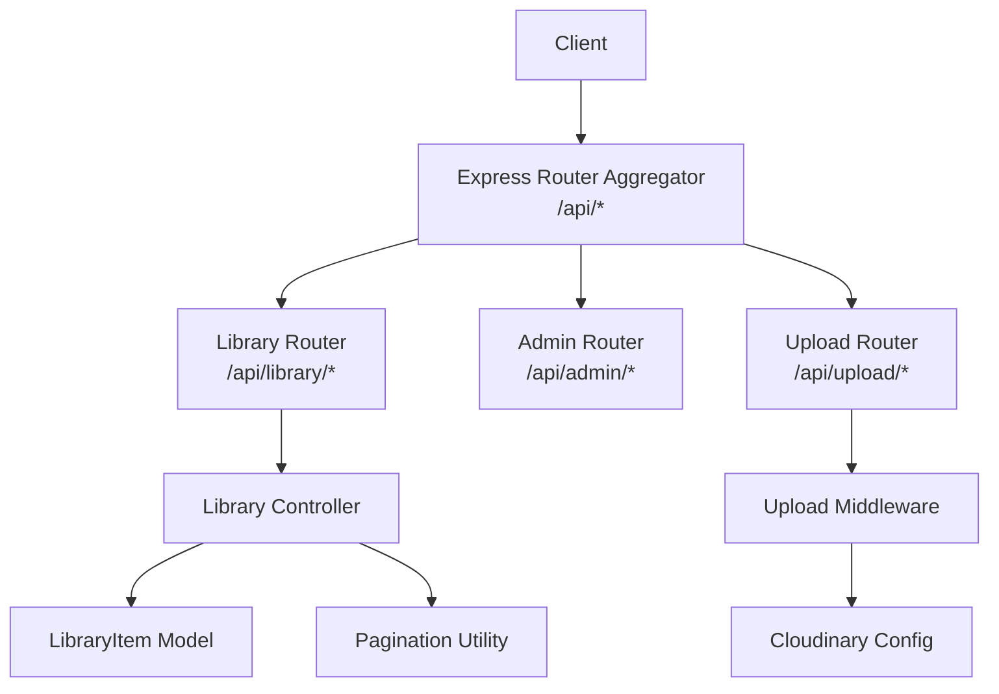
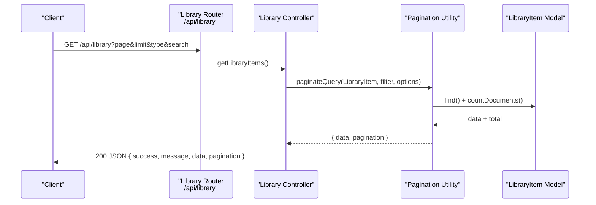
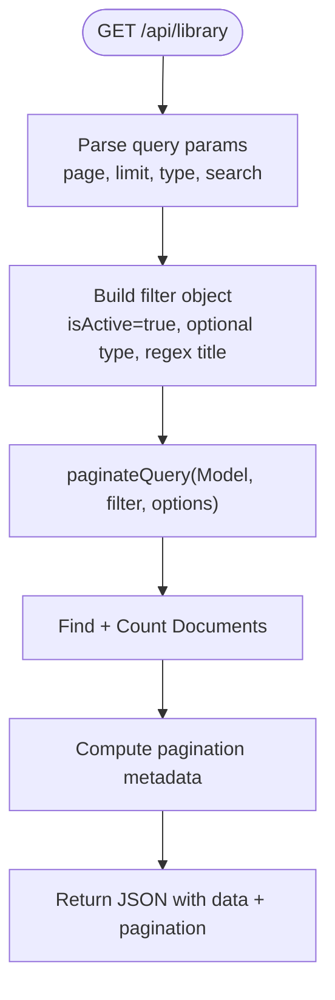
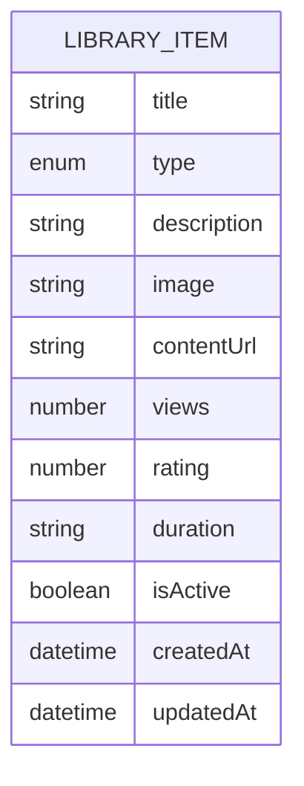
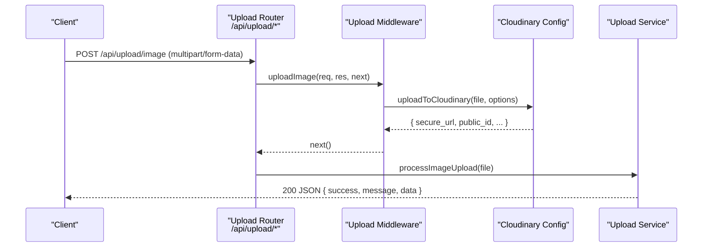
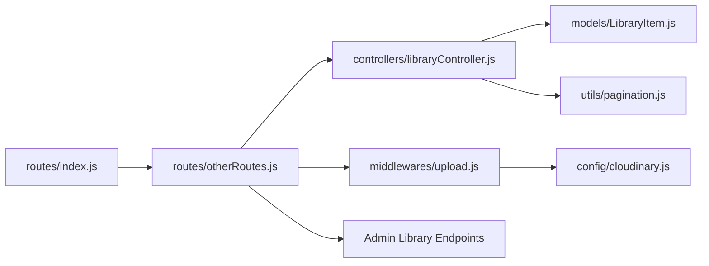

# Library and Content APIs

<cite>
**Referenced Files in This Document**
- [libraryController.js](file://backend/src/controllers/libraryController.js)
- [LibraryItem.js](file://backend/src/models/LibraryItem.js)
- [otherRoutes.js](file://backend/src/routes/otherRoutes.js)
- [index.js](file://backend/src/routes/index.js)
- [pagination.js](file://backend/src/utils/pagination.js)
- [upload.js](file://backend/src/middlewares/upload.js)
- [cloudinary.js](file://backend/src/config/cloudinary.js)
- [index.js](file://backend/src/constants/index.js)
</cite>

## Table of Contents
1. [Introduction](#introduction)
2. [Project Structure](#project-structure)
3. [Core Components](#core-components)
4. [Architecture Overview](#architecture-overview)
5. [Detailed Component Analysis](#detailed-component-analysis)
6. [Dependency Analysis](#dependency-analysis)
7. [Performance Considerations](#performance-considerations)
8. [Troubleshooting Guide](#troubleshooting-guide)
9. [Conclusion](#conclusion)
10. [Appendices](#appendices)

## Introduction
This document describes the Library and Content APIs responsible for retrieving library items, filtering and paginating content, and managing media assets. It covers:
- Library item retrieval with type filtering and search
- Pagination and sorting
- Media asset upload and deletion via Cloudinary
- Content types supported (audio, images, text-like metadata)
- Request/response schemas, filters, and delivery mechanisms

## Project Structure
The Library and Content APIs are organized around:
- Route aggregation mounting under the /api prefix
- Dedicated library routes under /api/library
- Admin-managed library CRUD endpoints under /api/admin/library
- Upload endpoints under /api/upload for images and audio
- Pagination utilities for consistent query handling
- Cloudinary integration for media delivery

**Diagram sources**
- [index.js:28-44](file://backend/src/routes/index.js#L28-L44)
- [otherRoutes.js:37-42](file://backend/src/routes/otherRoutes.js#L37-L42)
- [libraryController.js:12-30](file://backend/src/controllers/libraryController.js#L12-L30)
- [LibraryItem.js:9-55](file://backend/src/models/LibraryItem.js#L9-L55)
- [pagination.js:49-67](file://backend/src/utils/pagination.js#L49-L67)
- [upload.js:69-91](file://backend/src/middlewares/upload.js#L69-L91)
- [cloudinary.js:13-18](file://backend/src/config/cloudinary.js#L13-L18)

**Section sources**
- [index.js:28-44](file://backend/src/routes/index.js#L28-L44)
- [otherRoutes.js:37-42](file://backend/src/routes/otherRoutes.js#L37-L42)

## Core Components
- Library Controller: Provides GET /api/library to fetch library items with optional type and search filters, paginated results, and default descending creation date sorting.
- LibraryItem Model: Defines the schema for library entries including title, type, description, image, contentUrl, views, rating, duration, and activity flag.
- Pagination Utility: Parses page and limit, computes skip, and returns paginated data along with pagination metadata.
- Upload Middleware: Handles image and audio uploads to Cloudinary with configured folders, allowed formats, sizes, and transformations.
- Cloudinary Config: Centralizes Cloudinary credentials and provides upload/delete helpers returning secure URLs and metadata.
- Constants: Defines supported content types, upload limits, and standardized response messages.

Key endpoint summary:
- GET /api/library (authenticated): Returns paginated library items with optional filters and sorting.

**Section sources**
- [libraryController.js:12-30](file://backend/src/controllers/libraryController.js#L12-L30)
- [LibraryItem.js:9-55](file://backend/src/models/LibraryItem.js#L9-L55)
- [pagination.js:49-67](file://backend/src/utils/pagination.js#L49-L67)
- [upload.js:69-91](file://backend/src/middlewares/upload.js#L69-L91)
- [cloudinary.js:13-18](file://backend/src/config/cloudinary.js#L13-L18)
- [index.js:155-162](file://backend/src/constants/index.js#L155-L162)

## Architecture Overview
The Library API follows a layered architecture:
- Routes define endpoints and apply middleware (authentication, role checks, validation).
- Controllers orchestrate data fetching and response formatting.
- Models define data structures and indexes.
- Utilities encapsulate reusable logic (pagination).
- Middleware integrates external services (Cloudinary) for media handling.

**Diagram sources**
- [otherRoutes.js:37-42](file://backend/src/routes/otherRoutes.js#L37-L42)
- [libraryController.js:12-30](file://backend/src/controllers/libraryController.js#L12-L30)
- [pagination.js:49-67](file://backend/src/utils/pagination.js#L49-L67)
- [LibraryItem.js:9-55](file://backend/src/models/LibraryItem.js#L9-L55)

## Detailed Component Analysis

### Library API
- Endpoint: GET /api/library
- Authentication: Required (route-level middleware)
- Query parameters:
  - page: integer ≥ 1 (default 1)
  - limit: integer between 1 and 50 (default 10)
  - type: one of ["Sách", "Audio", "Video"]
  - search: substring match against title (case-insensitive)
- Sorting: Descending by createdAt by default
- Response:
  - success: boolean
  - message: localized success message
  - data: array of library items
  - pagination: { currentPage, totalPages, totalDocs, limit, hasNextPage, hasPrevPage }

**Diagram sources**
- [libraryController.js:12-30](file://backend/src/controllers/libraryController.js#L12-L30)
- [pagination.js:49-67](file://backend/src/utils/pagination.js#L49-L67)

**Section sources**
- [otherRoutes.js:37-42](file://backend/src/routes/otherRoutes.js#L37-L42)
- [libraryController.js:12-30](file://backend/src/controllers/libraryController.js#L12-L30)
- [pagination.js:14-20](file://backend/src/utils/pagination.js#L14-L20)

### LibraryItem Model
Fields:
- title: string, required
- type: enum ["Sách", "Audio", "Video"], required
- description: string, default empty
- image: string, default empty (URL or Cloudinary public ID)
- contentUrl: string, default empty (URL or Cloudinary public ID)
- views: number, default 0
- rating: number, default 5.0, min 0, max 5
- duration: string, default empty
- isActive: boolean, default true
- timestamps: createdAt, updatedAt

Indexes:
- type: 1
- isActive: 1

**Diagram sources**
- [LibraryItem.js:9-55](file://backend/src/models/LibraryItem.js#L9-L55)

**Section sources**
- [LibraryItem.js:9-55](file://backend/src/models/LibraryItem.js#L9-L55)

### Media Asset Management
Endpoints:
- POST /api/upload/image (authenticated): Upload avatar image to Cloudinary
- POST /api/upload/audio (admin-only): Upload audio to Cloudinary
- DELETE /api/upload/:publicId (admin-only): Delete file by publicId; optional type query param selects resource type

Upload constraints:
- Image: up to 5MB, allowed formats jpg, png, webp; transformed to 800x800 with auto quality
- Audio: up to 10MB, allowed formats mp3, wav; treated as video resource type in Cloudinary
- Folders: images under "khmerkid/images", audio under "khmerkid/audio"

Delivery:
- Secure URLs returned after successful upload
- Metadata includes secure_url, public_id, format, dimensions/size, and duration

**Diagram sources**
- [otherRoutes.js:74-80](file://backend/src/routes/otherRoutes.js#L74-L80)
- [upload.js:69-91](file://backend/src/middlewares/upload.js#L69-L91)
- [cloudinary.js:26-46](file://backend/src/config/cloudinary.js#L26-L46)

**Section sources**
- [otherRoutes.js:74-80](file://backend/src/routes/otherRoutes.js#L74-L80)
- [upload.js:19-38](file://backend/src/middlewares/upload.js#L19-L38)
- [cloudinary.js:26-46](file://backend/src/config/cloudinary.js#L26-L46)
- [index.js:155-162](file://backend/src/constants/index.js#L155-L162)

### Admin Library Management
Admin endpoints under /api/admin/library:
- GET /api/admin/library: List library items
- POST /api/admin/library: Create library item
- PUT /api/admin/library/:id: Update library item
- DELETE /api/admin/library/:id: Delete library item

These endpoints enforce admin-only access and parameter validation.

**Section sources**
- [otherRoutes.js:116-121](file://backend/src/routes/otherRoutes.js#L116-L121)

## Dependency Analysis
- Route aggregator mounts library and admin routes under /api
- Library route depends on library controller
- Library controller depends on LibraryItem model and pagination utility
- Upload route depends on upload middleware and Cloudinary config
- Constants centralize upload limits and messages used across components

**Diagram sources**
- [index.js:28-44](file://backend/src/routes/index.js#L28-L44)
- [otherRoutes.js:37-42](file://backend/src/routes/otherRoutes.js#L37-L42)
- [libraryController.js:12-30](file://backend/src/controllers/libraryController.js#L12-L30)
- [LibraryItem.js:9-55](file://backend/src/models/LibraryItem.js#L9-L55)
- [pagination.js:49-67](file://backend/src/utils/pagination.js#L49-L67)
- [upload.js:69-91](file://backend/src/middlewares/upload.js#L69-L91)
- [cloudinary.js:13-18](file://backend/src/config/cloudinary.js#L13-L18)

**Section sources**
- [index.js:28-44](file://backend/src/routes/index.js#L28-L44)
- [otherRoutes.js:37-42](file://backend/src/routes/otherRoutes.js#L37-L42)

## Performance Considerations
- Pagination limits: Max 50 items per page; tune limit based on client needs while avoiding excessive memory usage.
- Indexes: Ensure proper indexing on frequently filtered fields (type, isActive) to speed up queries.
- Sorting: Default sort by createdAt desc is efficient; avoid heavy projections if not needed.
- Media delivery: Cloudinary delivers optimized assets; leverage transformations and caching at CDN level.
- Validation: Early validation reduces unnecessary downstream processing.

## Troubleshooting Guide
Common issues and resolutions:
- Unauthorized access to /api/library: Ensure authentication middleware is applied and valid tokens are provided.
- Invalid file types on upload: Verify MIME types and allowed formats; see upload constraints.
- File too large errors: Respect configured size limits for images (≤5MB) and audio (≤10MB).
- Pagination anomalies: Confirm page≥1 and limit between 1–50; defaults are applied otherwise.
- Search not matching: Search uses case-insensitive substring matching on title; verify input casing and content.

**Section sources**
- [otherRoutes.js:37-42](file://backend/src/routes/otherRoutes.js#L37-L42)
- [upload.js:43-60](file://backend/src/middlewares/upload.js#L43-L60)
- [pagination.js:14-20](file://backend/src/utils/pagination.js#L14-L20)
- [index.js:155-162](file://backend/src/constants/index.js#L155-L162)

## Conclusion
The Library and Content APIs provide a robust foundation for browsing, filtering, and managing library items, alongside secure media upload and deletion workflows powered by Cloudinary. The design emphasizes clear separation of concerns, reusable pagination, and standardized responses, enabling scalable content discovery and asset management.

## Appendices

### API Reference: Library Retrieval
- Method: GET
- Path: /api/library
- Auth: Required
- Query parameters:
  - page: integer ≥ 1
  - limit: integer 1..50
  - type: "Sách" | "Audio" | "Video"
  - search: string (substring match, case-insensitive)
- Response fields:
  - success: boolean
  - message: string
  - data: array of library items
  - pagination: object with currentPage, totalPages, totalDocs, limit, hasNextPage, hasPrevPage

**Section sources**
- [otherRoutes.js:37-42](file://backend/src/routes/otherRoutes.js#L37-L42)
- [libraryController.js:12-30](file://backend/src/controllers/libraryController.js#L12-L30)
- [pagination.js:29-40](file://backend/src/utils/pagination.js#L29-L40)

### Data Model: LibraryItem
- Fields:
  - title: string
  - type: enum ["Sách", "Audio", "Video"]
  - description: string
  - image: string
  - contentUrl: string
  - views: number
  - rating: number (min 0, max 5)
  - duration: string
  - isActive: boolean
  - timestamps: createdAt, updatedAt

**Section sources**
- [LibraryItem.js:9-55](file://backend/src/models/LibraryItem.js#L9-L55)

### Media Upload Endpoints
- POST /api/upload/image
  - Auth: Required
  - Body: multipart/form-data with field "image"
  - Limits: ≤5MB, allowed formats jpg, png, webp
  - Folder: khmerkid/images
- POST /api/upload/audio
  - Auth: Admin only
  - Body: multipart/form-data with field "audio"
  - Limits: ≤10MB, allowed formats mp3, wav
  - Folder: khmerkid/audio
- DELETE /api/upload/:publicId
  - Auth: Admin only
  - Params: publicId (string)
  - Query: type (optional, default "image")

**Section sources**
- [otherRoutes.js:74-80](file://backend/src/routes/otherRoutes.js#L74-L80)
- [upload.js:19-38](file://backend/src/middlewares/upload.js#L19-L38)
- [cloudinary.js:26-46](file://backend/src/config/cloudinary.js#L26-L46)
- [index.js:155-162](file://backend/src/constants/index.js#L155-L162)