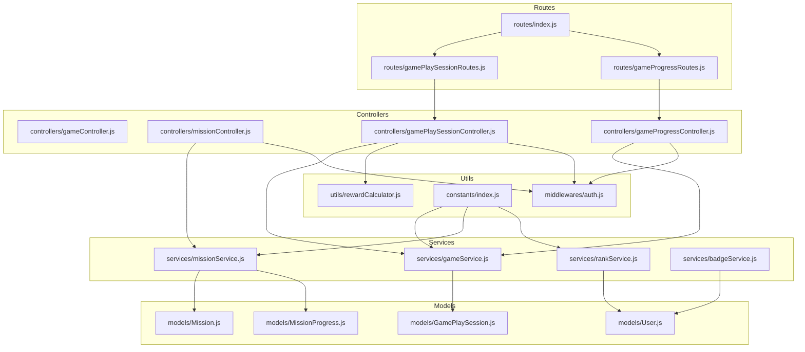
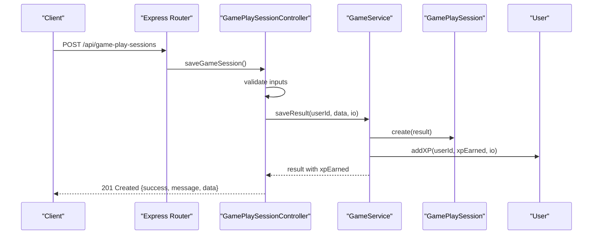
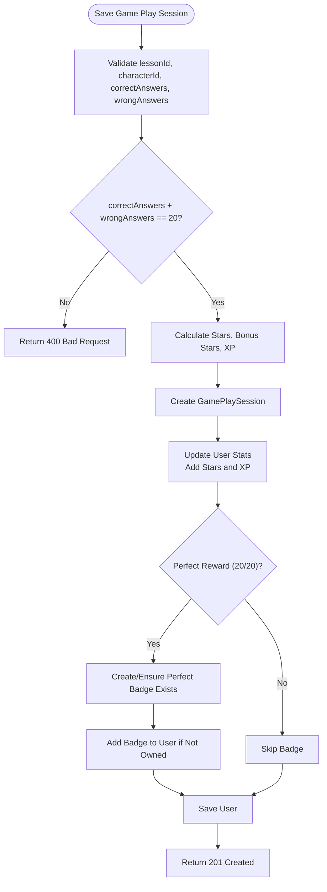
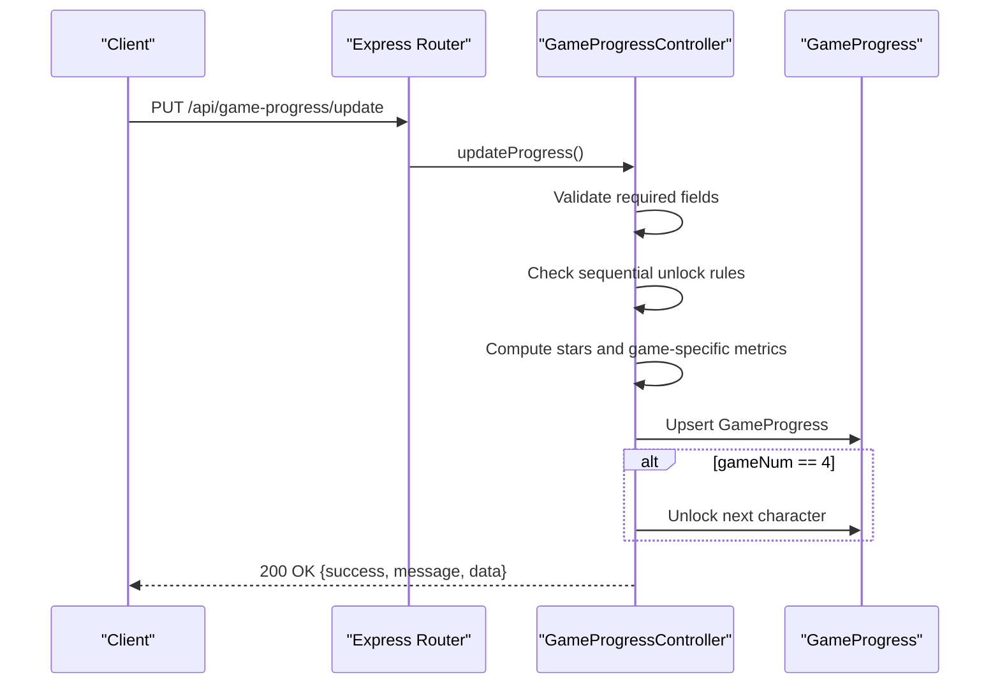
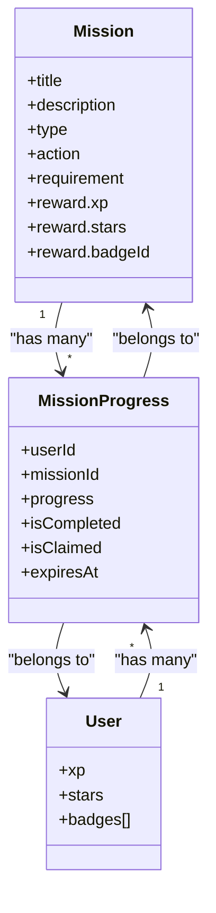
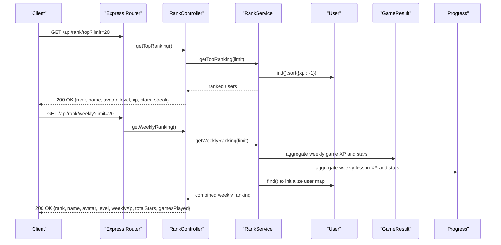
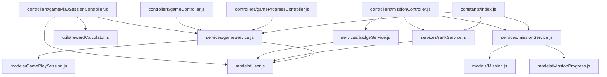

# Gaming and Mission APIs

<cite>
**Referenced Files in This Document**
- [backend/src/controllers/gameController.js](file://backend/src/controllers/gameController.js)
- [backend/src/controllers/missionController.js](file://backend/src/controllers/missionController.js)
- [backend/src/controllers/gamePlaySessionController.js](file://backend/src/controllers/gamePlaySessionController.js)
- [backend/src/controllers/gameProgressController.js](file://backend/src/controllers/gameProgressController.js)
- [backend/src/models/GamePlaySession.js](file://backend/src/models/GamePlaySession.js)
- [backend/src/models/Mission.js](file://backend/src/models/Mission.js)
- [backend/src/models/MissionProgress.js](file://backend/src/models/MissionProgress.js)
- [backend/src/services/gameService.js](file://backend/src/services/gameService.js)
- [backend/src/services/missionService.js](file://backend/src/services/missionService.js)
- [backend/src/services/rankService.js](file://backend/src/services/rankService.js)
- [backend/src/services/badgeService.js](file://backend/src/services/badgeService.js)
- [backend/src/utils/rewardCalculator.js](file://backend/src/utils/rewardCalculator.js)
- [backend/src/constants/index.js](file://backend/src/constants/index.js)
- [backend/src/middlewares/auth.js](file://backend/src/middlewares/auth.js)
- [backend/src/models/User.js](file://backend/src/models/User.js)
- [backend/src/routes/gamePlaySessionRoutes.js](file://backend/src/routes/gamePlaySessionRoutes.js)
- [backend/src/routes/gameProgressRoutes.js](file://backend/src/routes/gameProgressRoutes.js)
- [backend/src/routes/index.js](file://backend/src/routes/index.js)
</cite>

## Table of Contents
1. [Introduction](#introduction)
2. [Project Structure](#project-structure)
3. [Core Components](#core-components)
4. [Architecture Overview](#architecture-overview)
5. [Detailed Component Analysis](#detailed-component-analysis)
6. [Dependency Analysis](#dependency-analysis)
7. [Performance Considerations](#performance-considerations)
8. [Troubleshooting Guide](#troubleshooting-guide)
9. [Conclusion](#conclusion)

## Introduction
This document provides comprehensive API documentation for the gaming and mission system endpoints. It covers game session management, mission creation and completion, challenge implementation, reward distribution, and competitive features such as leaderboards. The documentation also specifies game mechanics, scoring systems, session lifecycle, and real-time gaming coordination.

## Project Structure
The gaming and mission system is implemented in the backend Node.js application. Key components include controllers, services, models, routes, middleware, and constants. The routes are mounted under the /api prefix and protected by authentication middleware.

**Diagram sources**
- [backend/src/routes/index.js:1-50](file://backend/src/routes/index.js#L1-L50)
- [backend/src/routes/gamePlaySessionRoutes.js:1-12](file://backend/src/routes/gamePlaySessionRoutes.js#L1-L12)
- [backend/src/routes/gameProgressRoutes.js:1-13](file://backend/src/routes/gameProgressRoutes.js#L1-L13)
- [backend/src/controllers/gamePlaySessionController.js:1-219](file://backend/src/controllers/gamePlaySessionController.js#L1-L219)
- [backend/src/controllers/gameProgressController.js:1-290](file://backend/src/controllers/gameProgressController.js#L1-L290)
- [backend/src/controllers/missionController.js:1-135](file://backend/src/controllers/missionController.js#L1-L135)
- [backend/src/controllers/gameController.js:1-49](file://backend/src/controllers/gameController.js#L1-L49)
- [backend/src/services/gameService.js:1-89](file://backend/src/services/gameService.js#L1-L89)
- [backend/src/services/missionService.js:1-138](file://backend/src/services/missionService.js#L1-L138)
- [backend/src/services/rankService.js:1-213](file://backend/src/services/rankService.js#L1-L213)
- [backend/src/services/badgeService.js:1-152](file://backend/src/services/badgeService.js#L1-L152)
- [backend/src/models/GamePlaySession.js:1-115](file://backend/src/models/GamePlaySession.js#L1-L115)
- [backend/src/models/Mission.js:1-69](file://backend/src/models/Mission.js#L1-L69)
- [backend/src/models/MissionProgress.js:1-56](file://backend/src/models/MissionProgress.js#L1-L56)
- [backend/src/models/User.js:1-243](file://backend/src/models/User.js#L1-L243)
- [backend/src/utils/rewardCalculator.js:1-114](file://backend/src/utils/rewardCalculator.js#L1-L114)
- [backend/src/constants/index.js:1-242](file://backend/src/constants/index.js#L1-L242)
- [backend/src/middlewares/auth.js:1-78](file://backend/src/middlewares/auth.js#L1-L78)

**Section sources**
- [backend/src/routes/index.js:1-50](file://backend/src/routes/index.js#L1-L50)
- [backend/src/middlewares/auth.js:1-78](file://backend/src/middlewares/auth.js#L1-L78)

## Core Components
- Game Controller: Handles saving game results and fetching game history and questions.
- Mission Controller: Manages missions, claims rewards, and provides badges and achievements endpoints.
- Game Play Session Controller: Saves game play sessions, validates inputs, calculates rewards, and updates user stats.
- Game Progress Controller: Tracks game progress per lesson and character, manages unlocking sequences, and aggregates totals.
- Services: gameService, missionService, rankService, badgeService encapsulate business logic.
- Models: GamePlaySession, Mission, MissionProgress, User define data structures and relationships.
- Utilities: rewardCalculator defines scoring and reward calculations.
- Constants: centralized configuration for game types, mission types, XP configuration, and messages.
- Middleware: authentication middleware protects routes.

**Section sources**
- [backend/src/controllers/gameController.js:1-49](file://backend/src/controllers/gameController.js#L1-L49)
- [backend/src/controllers/missionController.js:1-135](file://backend/src/controllers/missionController.js#L1-L135)
- [backend/src/controllers/gamePlaySessionController.js:1-219](file://backend/src/controllers/gamePlaySessionController.js#L1-L219)
- [backend/src/controllers/gameProgressController.js:1-290](file://backend/src/controllers/gameProgressController.js#L1-L290)
- [backend/src/services/gameService.js:1-89](file://backend/src/services/gameService.js#L1-L89)
- [backend/src/services/missionService.js:1-138](file://backend/src/services/missionService.js#L1-L138)
- [backend/src/services/rankService.js:1-213](file://backend/src/services/rankService.js#L1-L213)
- [backend/src/services/badgeService.js:1-152](file://backend/src/services/badgeService.js#L1-L152)
- [backend/src/models/GamePlaySession.js:1-115](file://backend/src/models/GamePlaySession.js#L1-L115)
- [backend/src/models/Mission.js:1-69](file://backend/src/models/Mission.js#L1-L69)
- [backend/src/models/MissionProgress.js:1-56](file://backend/src/models/MissionProgress.js#L1-L56)
- [backend/src/models/User.js:1-243](file://backend/src/models/User.js#L1-L243)
- [backend/src/utils/rewardCalculator.js:1-114](file://backend/src/utils/rewardCalculator.js#L1-L114)
- [backend/src/constants/index.js:1-242](file://backend/src/constants/index.js#L1-L242)

## Architecture Overview
The system follows a layered architecture:
- Routes define API endpoints and mount controllers.
- Controllers handle request/response and delegate to services.
- Services orchestrate business logic, interact with models, and emit real-time events via socket.io.
- Models define schemas and validations.
- Middleware handles authentication and authorization.
- Utilities provide shared calculations and configurations.

**Diagram sources**
- [backend/src/routes/gamePlaySessionRoutes.js:1-12](file://backend/src/routes/gamePlaySessionRoutes.js#L1-L12)
- [backend/src/controllers/gamePlaySessionController.js:12-135](file://backend/src/controllers/gamePlaySessionController.js#L12-L135)
- [backend/src/services/gameService.js:16-48](file://backend/src/services/gameService.js#L16-L48)
- [backend/src/models/GamePlaySession.js:1-115](file://backend/src/models/GamePlaySession.js#L1-L115)
- [backend/src/models/User.js:1-243](file://backend/src/models/User.js#L1-L243)

## Detailed Component Analysis

### Game Management Endpoints
- Save Game Result
  - Method: POST
  - Path: /api/games/result
  - Description: Saves a game result, calculates stars and XP, updates user stats, and increments total games played.
  - Authentication: Required
  - Request body: gameType, score, level, time, correctAnswers, totalQuestions
  - Response: Created result with xpEarned
  - Validation: Uses helpers to compute stars and XP; updates user XP and stars; increments totalGamesPlayed.
  - Real-time: Emits XP updates via socket.io if provided.

- Get Game History
  - Method: GET
  - Path: /api/games/history
  - Description: Retrieves user's game history with optional filtering by gameType and pagination.
  - Authentication: Required
  - Query parameters: gameType, limit
  - Response: Array of game results sorted by creation date.

- Get Game Questions
  - Method: GET
  - Path: /api/games/questions
  - Description: Fetches active game questions optionally filtered by gameKey.
  - Authentication: Not specified in controller; likely requires authentication based on route mounting.
  - Query parameters: gameKey
  - Response: Array of GameQuestion documents.

**Section sources**
- [backend/src/controllers/gameController.js:13-45](file://backend/src/controllers/gameController.js#L13-L45)
- [backend/src/services/gameService.js:16-64](file://backend/src/services/gameService.js#L16-L64)
- [backend/src/models/GamePlaySession.js:1-115](file://backend/src/models/GamePlaySession.js#L1-L115)

### Game Play Session Endpoints
- Save Game Play Session
  - Method: POST
  - Path: /api/game-play-sessions
  - Description: Validates and saves a game play session with strict constraints (20 total questions, non-negative wrong answers, correctAnswers + wrongAnswers = 20).
  - Authentication: Required
  - Request body: lessonId, characterId, correctAnswers, wrongAnswers
  - Validation: 
    - correctAnswers and wrongAnswers must be integers.
    - wrongAnswers must be >= 0.
    - Sum must equal 20.
  - Reward Calculation: Uses rewardCalculator to compute stars, bonus stars, XP, and checks for perfect reward (20/20).
  - User Updates: Increments user stars and calls userService.addXP to update XP and potentially level up; creates Perfect Badge if applicable.
  - Response: 201 Created with session data.

- Accumulate Stars
  - Method: POST
  - Path: /api/users/accumulate-stars
  - Description: Adds stars to user's total with validation (non-negative integer).
  - Authentication: Required
  - Request body: stars
  - Response: Updated user stars count.

- Accumulate XP
  - Method: POST
  - Path: /api/users/accumulate-xp
  - Description: Adds XP to user's total with validation (non-negative integer) and supports level-up detection.
  - Authentication: Required
  - Request body: xp
  - Response: Updated XP, level, and level-up indicators.

**Diagram sources**
- [backend/src/controllers/gamePlaySessionController.js:12-135](file://backend/src/controllers/gamePlaySessionController.js#L12-L135)
- [backend/src/utils/rewardCalculator.js:13-84](file://backend/src/utils/rewardCalculator.js#L13-L84)
- [backend/src/models/User.js:74-98](file://backend/src/models/User.js#L74-L98)

**Section sources**
- [backend/src/controllers/gamePlaySessionController.js:12-215](file://backend/src/controllers/gamePlaySessionController.js#L12-L215)
- [backend/src/utils/rewardCalculator.js:1-114](file://backend/src/utils/rewardCalculator.js#L1-L114)
- [backend/src/models/User.js:1-243](file://backend/src/models/User.js#L1-L243)

### Game Progress Endpoints
- Get Progress Status
  - Method: GET
  - Path: /api/game-progress/status
  - Description: Returns unlock/completion status for four games associated with a specific lesson and character. Initializes progress if not found.
  - Authentication: Required
  - Query parameters: userId, lessonId, characterId
  - Response: Progress object with unlock/completion flags and scores per game.

- Update Progress
  - Method: PUT
  - Path: /api/game-progress/update
  - Description: Updates progress for a specific game (1-4), validates sequential unlock rules, computes stars, and unlocks the next character upon completing game 4.
  - Authentication: Required
  - Request body: userId, lessonId, characterId, gameNum, score, duration, extraData (including wrongAnswers, attempts, confidence, spokenText, expectedText)
  - Validation: 
    - Sequential unlock: game2 requires game1, game3 requires game2, game4 requires game3.
    - Calculates stars based on score percentage.
    - For game4, computes similarity using Jaro-Winkler distance between spoken and expected text.
  - Side effects: Creates/updates progress records and unlocks the next character.

- Get Totals
  - Method: GET
  - Path: /api/game-progress/totals
  - Description: Aggregates total XP, stars, and scores for a user across all progress records.
  - Authentication: Required
  - Query parameters: userId
  - Response: Object with aggregated totals.

**Diagram sources**
- [backend/src/routes/gameProgressRoutes.js:1-13](file://backend/src/routes/gameProgressRoutes.js#L1-L13)
- [backend/src/controllers/gameProgressController.js:138-250](file://backend/src/controllers/gameProgressController.js#L138-L250)

**Section sources**
- [backend/src/controllers/gameProgressController.js:73-286](file://backend/src/controllers/gameProgressController.js#L73-L286)
- [backend/src/routes/gameProgressRoutes.js:1-13](file://backend/src/routes/gameProgressRoutes.js#L1-L13)

### Mission System Endpoints
- Get Missions
  - Method: GET
  - Path: /api/missions
  - Description: Retrieves all active missions with user progress, completion status, and claim status. Initializes mission progress entries if missing.
  - Authentication: Required
  - Response: Array of missions augmented with progress fields.

- Claim Mission Reward
  - Method: POST
  - Path: /api/missions/claim
  - Description: Claims reward for a completed mission. Marks progress as claimed and updates user XP and stars.
  - Authentication: Required
  - Request body: missionId
  - Validation: Ensures mission exists, progress exists and is completed, and not already claimed.
  - Response: Awarded reward and updated user data.

- Badges and Achievements
  - Get Badges: GET /api/badges
  - Get Achievements: GET /api/achievements
  - Description: Retrieves all active badges and user's unlocked achievements.
  - Authentication: Required

**Diagram sources**
- [backend/src/models/Mission.js:12-62](file://backend/src/models/Mission.js#L12-L62)
- [backend/src/models/MissionProgress.js:11-51](file://backend/src/models/MissionProgress.js#L11-L51)
- [backend/src/models/User.js:103-110](file://backend/src/models/User.js#L103-L110)

**Section sources**
- [backend/src/controllers/missionController.js:15-93](file://backend/src/controllers/missionController.js#L15-L93)
- [backend/src/services/missionService.js:18-121](file://backend/src/services/missionService.js#L18-L121)
- [backend/src/models/Mission.js:1-69](file://backend/src/models/Mission.js#L1-L69)
- [backend/src/models/MissionProgress.js:1-56](file://backend/src/models/MissionProgress.js#L1-L56)
- [backend/src/models/User.js:1-243](file://backend/src/models/User.js#L1-L243)

### Leaderboard and Competitive Features
- Top Global Ranking
  - Method: GET
  - Path: /api/rank/top
  - Description: Returns top-ranked users by XP.
  - Query parameters: limit (default 20)
  - Response: Array of users with rank, name, avatar, level, xp, stars, streak.

- Weekly Ranking
  - Method: GET
  - Path: /api/rank/weekly
  - Description: Computes weekly ranking combining XP from mini-games and completed lessons within the current week.
  - Query parameters: limit (default 20)
  - Response: Array of users with rank, name, avatar, level, weeklyXp, totalStars, gamesPlayed.

- Monthly Ranking
  - Method: GET
  - Path: /api/rank/monthly
  - Description: Computes monthly ranking combining XP from mini-games and completed lessons within the current month.
  - Query parameters: limit (default 20)
  - Response: Array of users with rank, name, avatar, level, monthlyXp, totalStars, gamesPlayed.

**Diagram sources**
- [backend/src/controllers/missionController.js:64-92](file://backend/src/controllers/missionController.js#L64-L92)
- [backend/src/services/rankService.js:16-209](file://backend/src/services/rankService.js#L16-L209)
- [backend/src/models/User.js:1-243](file://backend/src/models/User.js#L1-L243)
- [backend/src/models/GameResult.js](file://backend/src/models/GameResult.js)
- [backend/src/models/Progress.js](file://backend/src/models/Progress.js)

**Section sources**
- [backend/src/controllers/missionController.js:64-92](file://backend/src/controllers/missionController.js#L64-L92)
- [backend/src/services/rankService.js:16-209](file://backend/src/services/rankService.js#L16-L209)

### Achievement and Badge System
- Get All Badges
  - Method: GET
  - Path: /api/badges
  - Description: Retrieves all active badges ordered by priority.
  - Authentication: Required

- Get User Achievements
  - Method: GET
  - Path: /api/achievements
  - Description: Retrieves user's unlocked achievements with associated badge details.
  - Authentication: Required

- Automatic Badge Unlocking
  - Trigger: Called after XP/level/streak updates.
  - Logic: Iterates through active badges and checks eligibility against user stats (level, streak, lessons completed, games played, XP total, stars total, skill levels).
  - Actions: Unlocks eligible badges, awards XP/stars, creates achievement records, and sends notifications via socket events.

**Section sources**
- [backend/src/controllers/missionController.js:41-61](file://backend/src/controllers/missionController.js#L41-L61)
- [backend/src/services/badgeService.js:37-148](file://backend/src/services/badgeService.js#L37-L148)
- [backend/src/models/User.js:74-110](file://backend/src/models/User.js#L74-L110)

### Authentication and Security
- Authentication Middleware
  - Purpose: Verifies JWT tokens from Authorization header or cookies and attaches user to request.
  - Behavior: Returns 401 for missing/expired/invalid tokens; attaches user object for valid tokens.
  - Usage: Applied to game play session routes and most mission endpoints.

**Section sources**
- [backend/src/middlewares/auth.js:18-50](file://backend/src/middlewares/auth.js#L18-L50)
- [backend/src/routes/gamePlaySessionRoutes.js](file://backend/src/routes/gamePlaySessionRoutes.js#L6)
- [backend/src/routes/gameProgressRoutes.js](file://backend/src/routes/gameProgressRoutes.js#L6)

## Dependency Analysis
The following diagram shows key dependencies among controllers, services, models, and utilities:

**Diagram sources**
- [backend/src/controllers/gamePlaySessionController.js:1-219](file://backend/src/controllers/gamePlaySessionController.js#L1-L219)
- [backend/src/controllers/gameController.js:1-49](file://backend/src/controllers/gameController.js#L1-L49)
- [backend/src/controllers/missionController.js:1-135](file://backend/src/controllers/missionController.js#L1-L135)
- [backend/src/controllers/gameProgressController.js:1-290](file://backend/src/controllers/gameProgressController.js#L1-L290)
- [backend/src/services/gameService.js:1-89](file://backend/src/services/gameService.js#L1-L89)
- [backend/src/services/missionService.js:1-138](file://backend/src/services/missionService.js#L1-L138)
- [backend/src/services/badgeService.js:1-152](file://backend/src/services/badgeService.js#L1-L152)
- [backend/src/services/rankService.js:1-213](file://backend/src/services/rankService.js#L1-L213)
- [backend/src/utils/rewardCalculator.js:1-114](file://backend/src/utils/rewardCalculator.js#L1-L114)
- [backend/src/models/GamePlaySession.js:1-115](file://backend/src/models/GamePlaySession.js#L1-L115)
- [backend/src/models/Mission.js:1-69](file://backend/src/models/Mission.js#L1-L69)
- [backend/src/models/MissionProgress.js:1-56](file://backend/src/models/MissionProgress.js#L1-L56)
- [backend/src/models/User.js:1-243](file://backend/src/models/User.js#L1-L243)
- [backend/src/constants/index.js:1-242](file://backend/src/constants/index.js#L1-L242)

**Section sources**
- [backend/src/controllers/gamePlaySessionController.js:1-219](file://backend/src/controllers/gamePlaySessionController.js#L1-L219)
- [backend/src/controllers/missionController.js:1-135](file://backend/src/controllers/missionController.js#L1-L135)
- [backend/src/services/missionService.js:1-138](file://backend/src/services/missionService.js#L1-L138)
- [backend/src/services/badgeService.js:1-152](file://backend/src/services/badgeService.js#L1-L152)
- [backend/src/services/rankService.js:1-213](file://backend/src/services/rankService.js#L1-L213)
- [backend/src/models/Mission.js:1-69](file://backend/src/models/Mission.js#L1-L69)
- [backend/src/models/MissionProgress.js:1-56](file://backend/src/models/MissionProgress.js#L1-L56)
- [backend/src/models/User.js:1-243](file://backend/src/models/User.js#L1-L243)

## Performance Considerations
- Database Indexes: 
  - User indexes on rank, xp, and level to optimize leaderboard queries.
  - MissionProgress compound index on (userId, missionId, expiresAt) and TTL index on expiresAt for automatic cleanup.
  - Mission indexed on (type, isActive) for efficient mission retrieval.
- Aggregation Pipelines: 
  - Game progress totals use aggregation to compute sums efficiently.
  - Leaderboard services combine game results and progress aggregations to avoid multiple round trips.
- Validation Early Exit: 
  - Game play session controller validates inputs early and returns 400 responses to prevent unnecessary computations.
- Real-time Updates: 
  - Socket events are emitted conditionally; ensure io is available to avoid errors.

[No sources needed since this section provides general guidance]

## Troubleshooting Guide
- Authentication Failures
  - Symptoms: 401 Unauthorized responses on protected endpoints.
  - Causes: Missing or invalid JWT token, expired token, user not found.
  - Resolution: Ensure proper token extraction from headers or cookies; refresh token if expired.

- Game Play Session Validation Errors
  - Symptoms: 400 Bad Request for incorrect inputs.
  - Causes: wrongAnswers negative, correctAnswers + wrongAnswers != 20, invalid types.
  - Resolution: Verify correctAnswers and wrongAnswers are integers, sum equals 20, and values are within bounds.

- Mission Claim Issues
  - Symptoms: 404 Not Found or 400 Bad Request when claiming rewards.
  - Causes: Mission not found, progress not completed, or already claimed.
  - Resolution: Confirm mission exists, progress is completed and unclaimed, and within expiration period.

- Leaderboard Data Gaps
  - Symptoms: Empty or partial leaderboard results.
  - Causes: No game results or progress records within the selected period.
  - Resolution: Ensure game results and lesson completions are recorded during the requested period.

**Section sources**
- [backend/src/middlewares/auth.js:18-50](file://backend/src/middlewares/auth.js#L18-L50)
- [backend/src/controllers/gamePlaySessionController.js:18-54](file://backend/src/controllers/gamePlaySessionController.js#L18-L54)
- [backend/src/services/missionService.js:92-121](file://backend/src/services/missionService.js#L92-L121)
- [backend/src/services/rankService.js:33-118](file://backend/src/services/rankService.js#L33-L118)

## Conclusion
The gaming and mission APIs provide a robust foundation for managing game sessions, tracking progress, enforcing sequential unlocks, maintaining missions with daily/weekly cycles, distributing rewards, and supporting competitive features through leaderboards. The modular architecture with clear separation of concerns enables maintainability and extensibility. Proper use of validation, indexing, and aggregation ensures performance and reliability.