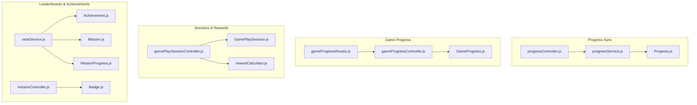
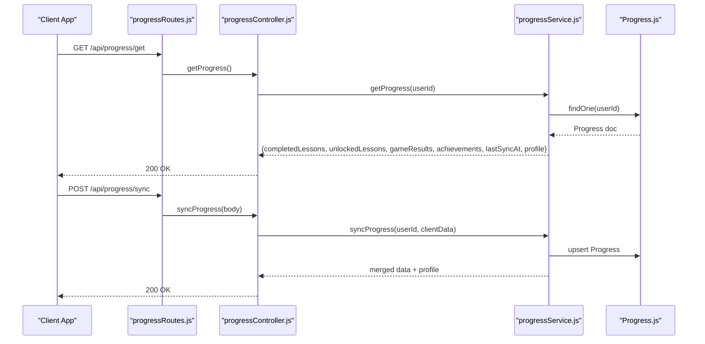
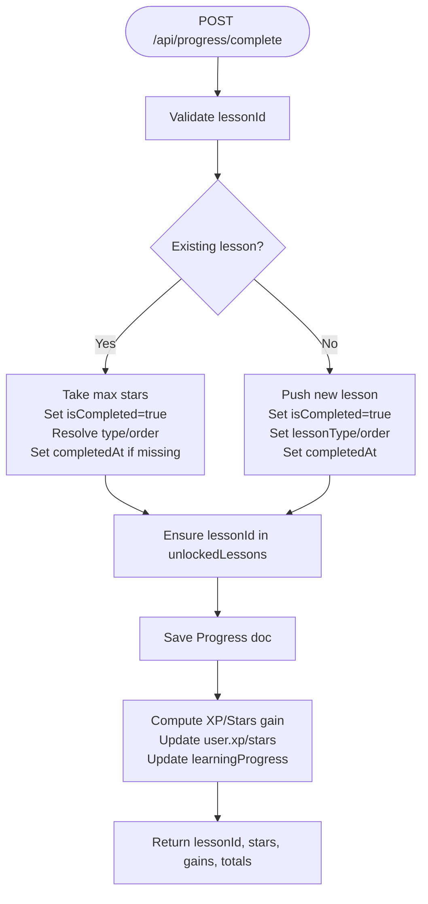
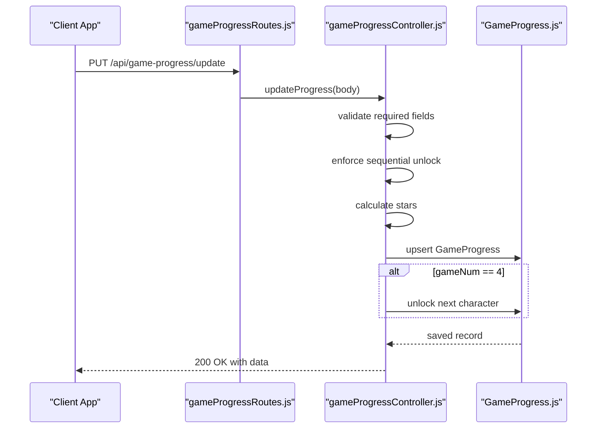
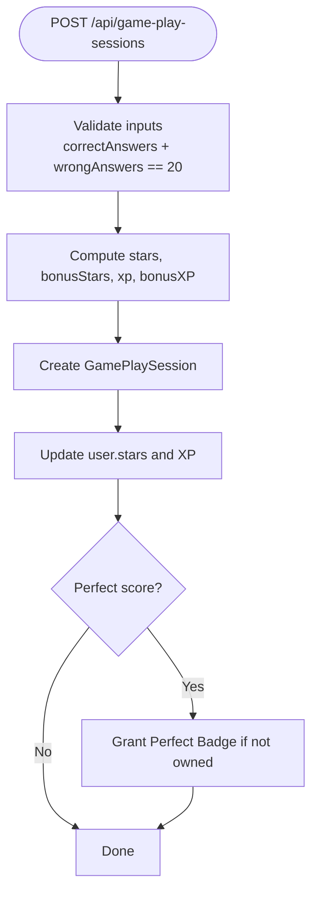
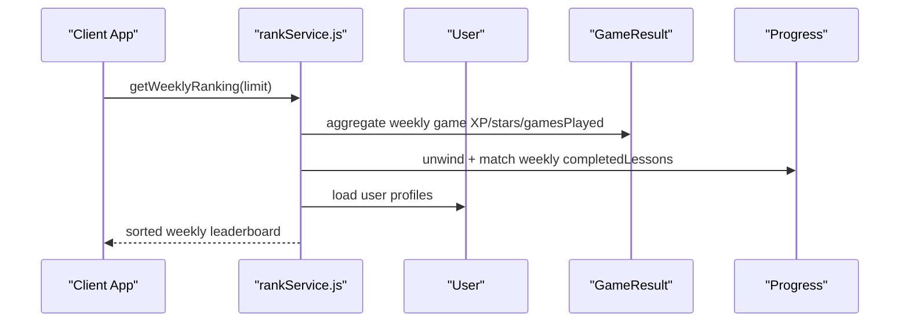
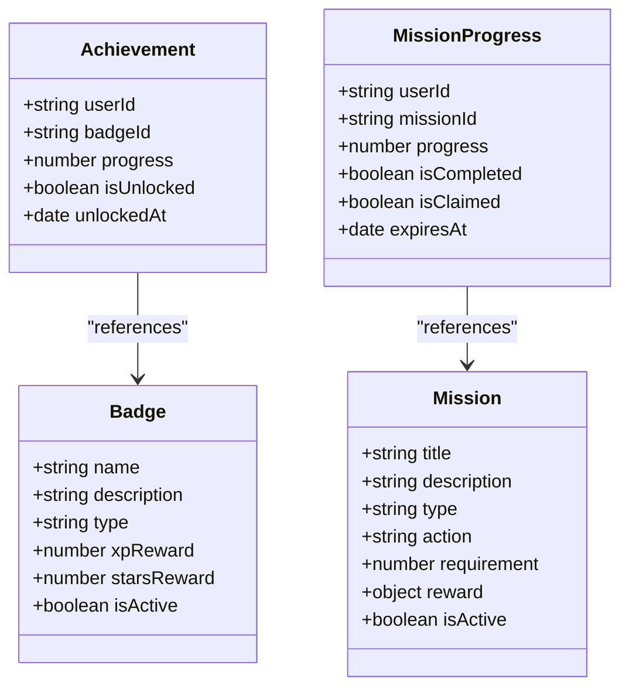
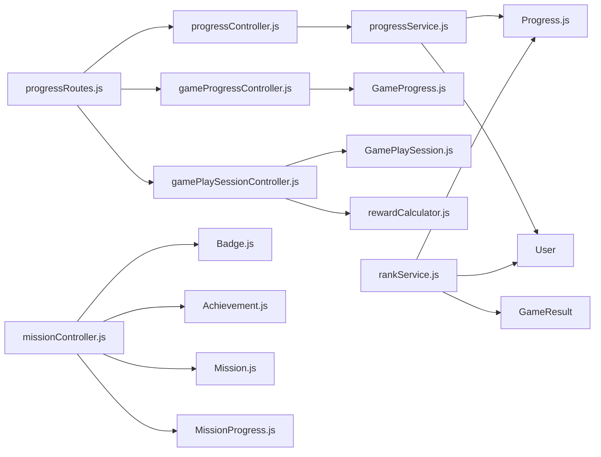

# Progress Tracking APIs

<cite>
**Referenced Files in This Document**
- [progressController.js](file://backend/src/controllers/progressController.js)
- [progressRoutes.js](file://backend/src/routes/progressRoutes.js)
- [progressService.js](file://backend/src/services/progressService.js)
- [Progress.js](file://backend/src/models/Progress.js)
- [gameProgressController.js](file://backend/src/controllers/gameProgressController.js)
- [gameProgressRoutes.js](file://backend/src/routes/gameProgressRoutes.js)
- [GameProgress.js](file://backend/src/models/GameProgress.js)
- [gamePlaySessionController.js](file://backend/src/controllers/gamePlaySessionController.js)
- [GamePlaySession.js](file://backend/src/models/GamePlaySession.js)
- [rewardCalculator.js](file://backend/src/utils/rewardCalculator.js)
- [rankService.js](file://backend/src/services/rankService.js)
- [Achievement.js](file://backend/src/models/Achievement.js)
- [Badge.js](file://backend/src/models/Badge.js)
- [missionController.js](file://backend/src/controllers/missionController.js)
- [Mission.js](file://backend/src/models/Mission.js)
- [MissionProgress.js](file://backend/src/models/MissionProgress.js)
</cite>

## Table of Contents
1. [Introduction](#introduction)
2. [Project Structure](#project-structure)
3. [Core Components](#core-components)
4. [Architecture Overview](#architecture-overview)
5. [Detailed Component Analysis](#detailed-component-analysis)
6. [Dependency Analysis](#dependency-analysis)
7. [Performance Considerations](#performance-considerations)
8. [Troubleshooting Guide](#troubleshooting-guide)
9. [Conclusion](#conclusion)

## Introduction
This document provides comprehensive API documentation for progress tracking and assessment endpoints. It covers user progress retrieval, lesson completion tracking, score calculation, streak maintenance, and performance analytics. It also documents game progress management, session tracking, achievement unlocking, leaderboard updates, and progress synchronization. The focus is on the backend implementation that powers the frontend’s offline-first progress sync, gamified scoring, and social ranking features.

## Project Structure
The progress tracking system spans controllers, services, models, and routes. Key areas:
- Lesson progress and sync: controllers, service, and model for user lesson progress
- Mini-game progress and scoring: controllers, models, and reward calculator
- Session tracking and XP/stars accumulation: session controller and model
- Leaderboards and achievements: rank service, mission/badge models, and related controllers

**Diagram sources**
- [progressController.js:1-80](file://backend/src/controllers/progressController.js#L1-L80)
- [progressService.js:1-304](file://backend/src/services/progressService.js#L1-L304)
- [Progress.js:1-112](file://backend/src/models/Progress.js#L1-L112)
- [gameProgressController.js:1-290](file://backend/src/controllers/gameProgressController.js#L1-L290)
- [GameProgress.js:1-83](file://backend/src/models/GameProgress.js#L1-L83)
- [gameProgressRoutes.js:1-13](file://backend/src/routes/gameProgressRoutes.js#L1-L13)
- [gamePlaySessionController.js:1-219](file://backend/src/controllers/gamePlaySessionController.js#L1-L219)
- [GamePlaySession.js:1-115](file://backend/src/models/GamePlaySession.js#L1-L115)
- [rewardCalculator.js:1-114](file://backend/src/utils/rewardCalculator.js#L1-L114)
- [rankService.js:1-213](file://backend/src/services/rankService.js#L1-L213)
- [missionController.js:1-135](file://backend/src/controllers/missionController.js#L1-L135)
- [Achievement.js:1-48](file://backend/src/models/Achievement.js#L1-L48)
- [Badge.js:1-70](file://backend/src/models/Badge.js#L1-L70)
- [Mission.js:1-69](file://backend/src/models/Mission.js#L1-L69)
- [MissionProgress.js:1-56](file://backend/src/models/MissionProgress.js#L1-L56)

**Section sources**
- [progressController.js:1-80](file://backend/src/controllers/progressController.js#L1-L80)
- [progressRoutes.js:1-25](file://backend/src/routes/progressRoutes.js#L1-L25)
- [progressService.js:1-304](file://backend/src/services/progressService.js#L1-L304)
- [Progress.js:1-112](file://backend/src/models/Progress.js#L1-L112)
- [gameProgressController.js:1-290](file://backend/src/controllers/gameProgressController.js#L1-L290)
- [gameProgressRoutes.js:1-13](file://backend/src/routes/gameProgressRoutes.js#L1-L13)
- [GameProgress.js:1-83](file://backend/src/models/GameProgress.js#L1-L83)
- [gamePlaySessionController.js:1-219](file://backend/src/controllers/gamePlaySessionController.js#L1-L219)
- [GamePlaySession.js:1-115](file://backend/src/models/GamePlaySession.js#L1-L115)
- [rewardCalculator.js:1-114](file://backend/src/utils/rewardCalculator.js#L1-L114)
- [rankService.js:1-213](file://backend/src/services/rankService.js#L1-L213)
- [missionController.js:1-135](file://backend/src/controllers/missionController.js#L1-L135)
- [Achievement.js:1-48](file://backend/src/models/Achievement.js#L1-L48)
- [Badge.js:1-70](file://backend/src/models/Badge.js#L1-L70)
- [Mission.js:1-69](file://backend/src/models/Mission.js#L1-L69)
- [MissionProgress.js:1-56](file://backend/src/models/MissionProgress.js#L1-L56)

## Core Components
- Progress Controller: exposes endpoints to get, sync, complete, and unlock lessons
- Progress Service: orchestrates bidirectional sync with a take-max strategy, lesson auto-unlock, and user gamification updates
- Progress Model: stores completed/unlocked lessons, game results, achievements, and sync metadata
- Game Progress Controller: manages per-character game unlock/completion, scoring, and star calculation
- Game Progress Model: aggregates scores, stars, and XP across four games
- Game Play Session Controller: validates and persists sessions, computes rewards, and updates user XP/stars
- Reward Calculator: defines scoring rules for stars, XP, and perfect rewards
- Rank Service: computes global, weekly, and monthly leaderboards combining game and lesson progress
- Achievement/Badge/Mission Models: support badge unlocks, mission tracking, and reward distribution

**Section sources**
- [progressController.js:12-77](file://backend/src/controllers/progressController.js#L12-L77)
- [progressService.js:14-301](file://backend/src/services/progressService.js#L14-L301)
- [Progress.js:12-112](file://backend/src/models/Progress.js#L12-L112)
- [gameProgressController.js:68-289](file://backend/src/controllers/gameProgressController.js#L68-L289)
- [GameProgress.js:3-83](file://backend/src/models/GameProgress.js#L3-L83)
- [gamePlaySessionController.js:7-216](file://backend/src/controllers/gamePlaySessionController.js#L7-L216)
- [rewardCalculator.js:13-113](file://backend/src/utils/rewardCalculator.js#L13-L113)
- [rankService.js:12-210](file://backend/src/services/rankService.js#L12-L210)
- [Achievement.js:11-48](file://backend/src/models/Achievement.js#L11-L48)
- [Badge.js:10-70](file://backend/src/models/Badge.js#L10-L70)
- [Mission.js:12-69](file://backend/src/models/Mission.js#L12-L69)
- [MissionProgress.js:11-56](file://backend/src/models/MissionProgress.js#L11-L56)

## Architecture Overview
The system integrates three primary flows:
- Lesson progress sync: client sends local progress; server merges with take-max strategy and returns merged data
- Game progress: per-character unlock sequencing and scoring with star calculation and XP aggregation
- Session rewards: validates session correctness, computes stars/XP, grants bonuses, and updates user stats

**Diagram sources**
- [progressRoutes.js:19-22](file://backend/src/routes/progressRoutes.js#L19-L22)
- [progressController.js:13-31](file://backend/src/controllers/progressController.js#L13-L31)
- [progressService.js:35-155](file://backend/src/services/progressService.js#L35-L155)
- [Progress.js:12-112](file://backend/src/models/Progress.js#L12-L112)

## Detailed Component Analysis

### Lesson Progress Endpoints
Endpoints for retrieving and synchronizing lesson progress, completing lessons, and unlocking lessons.

- GET /api/progress/get
  - Purpose: Fetch full progress snapshot including lessons, unlocks, game results, achievements, and user profile metrics
  - Authentication: Required
  - Response: Includes completedLessons, unlockedLessons, gameResults, achievements, lastSyncAt, and profile fields
  - Implementation: Controller delegates to service; service fetches or creates progress and enriches with user badges/achievements

- POST /api/progress/sync
  - Purpose: Bidirectional sync using a take-max merge strategy
  - Authentication: Required
  - Request body: clientData with completedLessons, unlockedLessons arrays
  - Behavior:
    - Merge completed lessons by lessonId: take max stars, union completion flags, keep earliest completion timestamp
    - Merge unlocked lessons via set union; auto-unlock lessons that are marked completed
    - Save merged progress and update user learningProgress counters
  - Response: Returns merged completedLessons (with isUnlocked flag set), merged unlockedLessons, and profile

- POST /api/progress/complete
  - Purpose: Mark a lesson as completed, optionally with stars, lessonType, lessonOrder, and XP
  - Authentication: Required
  - Request body: lessonId (required), stars, lessonType, lessonOrder, xp
  - Behavior:
    - Resolve lessonOrder and lessonType if missing (from DB or lessonId parsing)
    - Update or insert completed lesson with take-max stars and completion timestamp
    - Auto-unlock lesson if not already unlocked
    - Update user XP/stars and learningProgress counters
  - Response: Returns lessonId, stars, xpGained, starsGained, totals

- POST /api/progress/unlock
  - Purpose: Manually unlock a lesson
  - Authentication: Required
  - Request body: lessonId (required)
  - Behavior: Adds lessonId to unlockedLessons if not present
  - Response: Returns lessonId and unlocked flag

**Diagram sources**
- [progressController.js:33-57](file://backend/src/controllers/progressController.js#L33-L57)
- [progressService.js:160-285](file://backend/src/services/progressService.js#L160-L285)

**Section sources**
- [progressRoutes.js:6-9](file://backend/src/routes/progressRoutes.js#L6-L9)
- [progressController.js:13-77](file://backend/src/controllers/progressController.js#L13-L77)
- [progressService.js:35-285](file://backend/src/services/progressService.js#L35-L285)
- [Progress.js:12-112](file://backend/src/models/Progress.js#L12-L112)

### Game Progress Management
Endpoints for per-character game status, updating game results, and aggregating totals.

- GET /api/game-progress/status
  - Purpose: Retrieve unlock/completion status for all four games associated with a character in a lesson
  - Authentication: Required
  - Query params: userId, lessonId, characterId
  - Behavior: Creates default record if none exists; returns unlock/completion flags and scores/stars per game

- PUT /api/game-progress/update
  - Purpose: Persist game results and update progress
  - Authentication: Required
  - Request body: userId, lessonId, characterId, gameNum, score, duration, extraData
  - Behavior:
    - Enforce sequential unlock: game N requires game N-1 to be completed
    - Calculate stars based on score percentage
    - Update corresponding game fields and timestamps
    - On completing game 4, unlock the next character in the lesson
  - Response: Updated progress record

- GET /api/game-progress/totals
  - Purpose: Summarize total XP, Stars, and Score across all characters/lessons for a user
  - Authentication: Required
  - Query params: userId
  - Behavior: Aggregates GameProgress records for the user

**Diagram sources**
- [gameProgressRoutes.js:8-10](file://backend/src/routes/gameProgressRoutes.js#L8-L10)
- [gameProgressController.js:138-250](file://backend/src/controllers/gameProgressController.js#L138-L250)
- [GameProgress.js:66-78](file://backend/src/models/GameProgress.js#L66-L78)

**Section sources**
- [gameProgressRoutes.js:1-13](file://backend/src/routes/gameProgressRoutes.js#L1-L13)
- [gameProgressController.js:73-286](file://backend/src/controllers/gameProgressController.js#L73-L286)
- [GameProgress.js:3-83](file://backend/src/models/GameProgress.js#L3-L83)

### Session Tracking and Scoring
Endpoints to persist game play sessions, compute rewards, and update user XP/stars.

- POST /api/game-play-sessions
  - Purpose: Save a session and compute rewards
  - Authentication: Required
  - Request body: lessonId, characterId, correctAnswers, wrongAnswers
  - Validation: Ensures correctAnswers/wrongAnswers are integers, sum to 20, and meet constraints
  - Computation:
    - Stars: derived from correctAnswers
    - Bonus Stars: configurable via reward calculator
    - XP: base XP plus bonus for perfect score
    - Perfect reward: grants badge if achieved
  - Side effects: updates user.stars and calls userService.addXP to handle leveling

- POST /api/users/accumulate-stars
  - Purpose: Manually add stars to a user
  - Authentication: Required
  - Request body: stars (integer, non-negative)
  - Response: Returns updated totalStars

- POST /api/users/accumulate-xp
  - Purpose: Manually add XP to a user
  - Authentication: Required
  - Request body: xp (integer, non-negative)
  - Response: Returns updated xp, level, and level-up flags

**Diagram sources**
- [gamePlaySessionController.js:12-135](file://backend/src/controllers/gamePlaySessionController.js#L12-L135)
- [GamePlaySession.js:100-110](file://backend/src/models/GamePlaySession.js#L100-L110)
- [rewardCalculator.js:13-84](file://backend/src/utils/rewardCalculator.js#L13-L84)

**Section sources**
- [gamePlaySessionController.js:12-216](file://backend/src/controllers/gamePlaySessionController.js#L12-L216)
- [GamePlaySession.js:3-115](file://backend/src/models/GamePlaySession.js#L3-L115)
- [rewardCalculator.js:13-113](file://backend/src/utils/rewardCalculator.js#L13-L113)

### Leaderboard Updates and Analytics
- GET /api/rank/top
  - Purpose: Top global leaderboard by XP
  - Query param: limit (default 20)
  - Response: Ranked users with name, avatar, level, xp, stars, streak

- GET /api/rank/weekly
  - Purpose: Weekly leaderboard combining XP from mini-games and lesson stars/XP
  - Query param: limit (default 20)
  - Behavior: Aggregates GameResult and Progress.completedLessons for the current week

- GET /api/rank/monthly
  - Purpose: Monthly leaderboard combining XP from mini-games and lesson stars/XP
  - Query param: limit (default 20)
  - Behavior: Aggregates GameResult and Progress.completedLessons for the current month

**Diagram sources**
- [rankService.js:33-118](file://backend/src/services/rankService.js#L33-L118)
- [rankService.js:124-209](file://backend/src/services/rankService.js#L124-L209)

**Section sources**
- [missionController.js:63-92](file://backend/src/controllers/missionController.js#L63-L92)
- [rankService.js:16-210](file://backend/src/services/rankService.js#L16-L210)

### Achievement Unlocking and Missions
- Badges and Achievements
  - Badge model defines badge metadata and rewards
  - Achievement model tracks user-specific badge unlocks and progress
- Missions
  - Mission model defines daily/weekly missions with actions and rewards
  - MissionProgress tracks user progress toward mission completion and expiration

**Diagram sources**
- [Badge.js:10-70](file://backend/src/models/Badge.js#L10-L70)
- [Achievement.js:11-48](file://backend/src/models/Achievement.js#L11-L48)
- [Mission.js:12-69](file://backend/src/models/Mission.js#L12-L69)
- [MissionProgress.js:11-56](file://backend/src/models/MissionProgress.js#L11-L56)

**Section sources**
- [missionController.js:41-93](file://backend/src/controllers/missionController.js#L41-L93)
- [Badge.js:10-70](file://backend/src/models/Badge.js#L10-L70)
- [Achievement.js:11-48](file://backend/src/models/Achievement.js#L11-L48)
- [Mission.js:12-69](file://backend/src/models/Mission.js#L12-L69)
- [MissionProgress.js:11-56](file://backend/src/models/MissionProgress.js#L11-L56)

## Dependency Analysis
- Controllers depend on services for business logic
- Services depend on models for persistence
- Routes apply authentication middleware before invoking controllers
- Game progress depends on reward calculation and GameProgress model
- Leaderboards depend on User, GameResult, and Progress models
- Missions and Achievements form a cohesive gamification subsystem

**Diagram sources**
- [progressRoutes.js:12-24](file://backend/src/routes/progressRoutes.js#L12-L24)
- [progressController.js:9-11](file://backend/src/controllers/progressController.js#L9-L11)
- [progressService.js:10-12](file://backend/src/services/progressService.js#L10-L12)
- [Progress.js:10-112](file://backend/src/models/Progress.js#L10-L112)
- [gameProgressController.js:1-3](file://backend/src/controllers/gameProgressController.js#L1-L3)
- [GameProgress.js:1-83](file://backend/src/models/GameProgress.js#L1-L83)
- [gamePlaySessionController.js:1-6](file://backend/src/controllers/gamePlaySessionController.js#L1-L6)
- [GamePlaySession.js:1-115](file://backend/src/models/GamePlaySession.js#L1-L115)
- [rewardCalculator.js:1-114](file://backend/src/utils/rewardCalculator.js#L1-L114)
- [rankService.js:7-10](file://backend/src/services/rankService.js#L7-L10)
- [missionController.js:7-12](file://backend/src/controllers/missionController.js#L7-L12)

**Section sources**
- [progressRoutes.js:12-24](file://backend/src/routes/progressRoutes.js#L12-L24)
- [progressController.js:9-11](file://backend/src/controllers/progressController.js#L9-L11)
- [progressService.js:10-12](file://backend/src/services/progressService.js#L10-L12)
- [Progress.js:10-112](file://backend/src/models/Progress.js#L10-L112)
- [gameProgressController.js:1-3](file://backend/src/controllers/gameProgressController.js#L1-L3)
- [GameProgress.js:1-83](file://backend/src/models/GameProgress.js#L1-L83)
- [gamePlaySessionController.js:1-6](file://backend/src/controllers/gamePlaySessionController.js#L1-L6)
- [GamePlaySession.js:1-115](file://backend/src/models/GamePlaySession.js#L1-L115)
- [rewardCalculator.js:1-114](file://backend/src/utils/rewardCalculator.js#L1-L114)
- [rankService.js:7-10](file://backend/src/services/rankService.js#L7-L10)
- [missionController.js:7-12](file://backend/src/controllers/missionController.js#L7-L12)

## Performance Considerations
- Indexes: Progress model indexes on userId and completed lesson IDs optimize lookups during sync
- Aggregation: Leaderboard queries use aggregation pipelines with date filters; ensure proper indexing on createdAt and lesson completedAt fields
- Pre-save hooks: GameProgress pre-save recalculates totalScore, totalStars, and XP; keep extraData minimal to reduce computation overhead
- Bidirectional sync: Take-max merge minimizes write conflicts but still iterates over arrays; consider limiting batch sizes for very large progress sets
- Real-time updates: Socket usage is available in session controller for broadcasting level-ups; ensure efficient event emission and client-side caching

## Troubleshooting Guide
- Lesson completion errors
  - Ensure lessonId is provided and valid; service resolves missing lessonType/order if possible
  - If lessonId is a string ID, it must be a valid MongoDB ObjectId or follow the expected pattern
- Sync conflicts
  - Client must send completedLessons and unlockedLessons arrays; server applies take-max and union strategies
  - lastSyncAt is updated on every successful sync
- Game progress lockouts
  - Games must be completed sequentially; attempting game N without completing game N-1 will fail
  - Unlock next character automatically occurs after completing game 4
- Session validation failures
  - correctAnswers and wrongAnswers must be integers and sum to 20
  - Values must be within [0, 20]; otherwise, validation errors are returned
- Leaderboard discrepancies
  - Weekly/monthly calculations rely on start-of-week/month helpers; ensure timezone-aware timestamps
  - Combines game XP and lesson XP/stars; verify lessonType mapping and lesson completion timestamps

**Section sources**
- [progressController.js:38-43](file://backend/src/controllers/progressController.js#L38-L43)
- [progressService.js:167-190](file://backend/src/services/progressService.js#L167-L190)
- [gameProgressController.js:164-172](file://backend/src/controllers/gameProgressController.js#L164-L172)
- [GamePlaySession.js:100-110](file://backend/src/models/GamePlaySession.js#L100-L110)
- [rankService.js:34-75](file://backend/src/services/rankService.js#L34-L75)
- [rankService.js:125-169](file://backend/src/services/rankService.js#L125-L169)

## Conclusion
The progress tracking system provides robust lesson sync, granular game progress management, validated session scoring, and comprehensive analytics through leaderboards. Its modular design separates concerns across controllers, services, and models, enabling maintainability and extensibility. The scoring algorithms and gamification components offer clear reward pathways, while the leaderboard services enable competitive engagement.