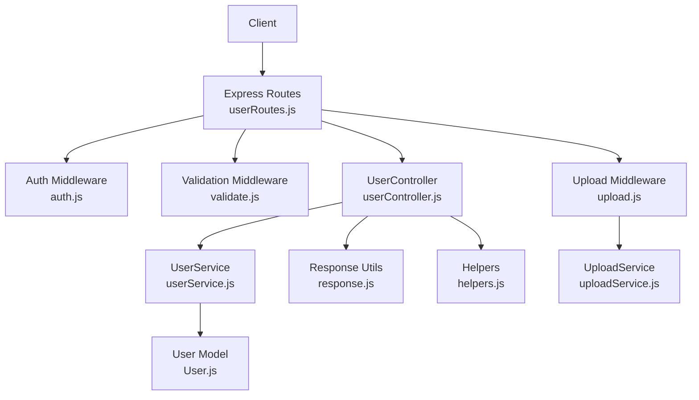
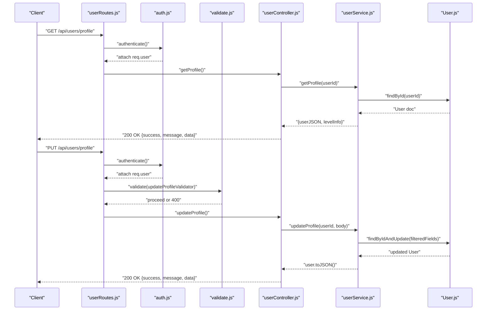
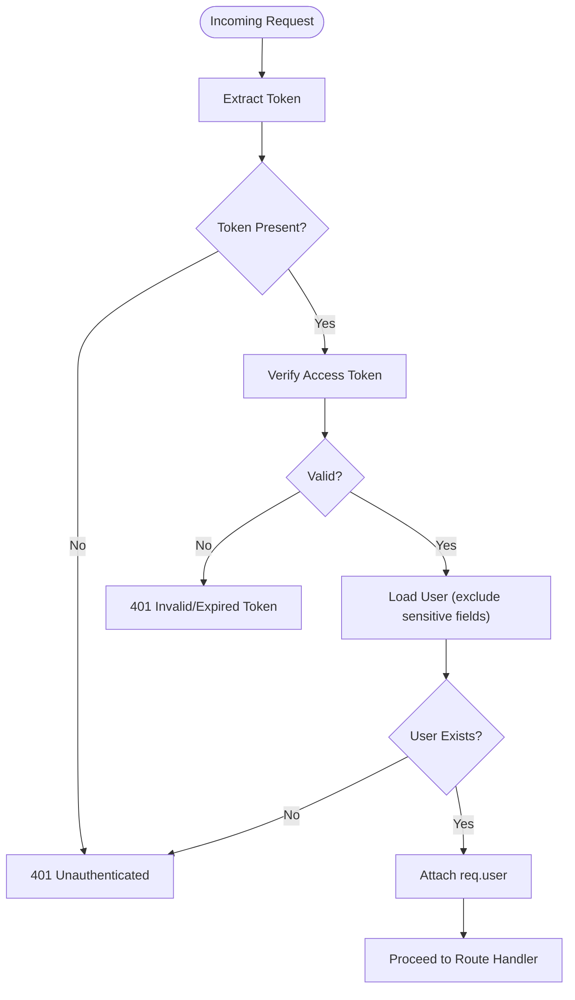
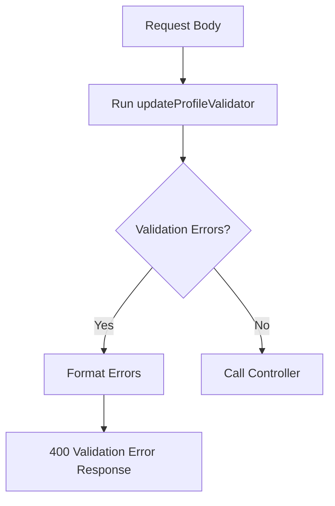
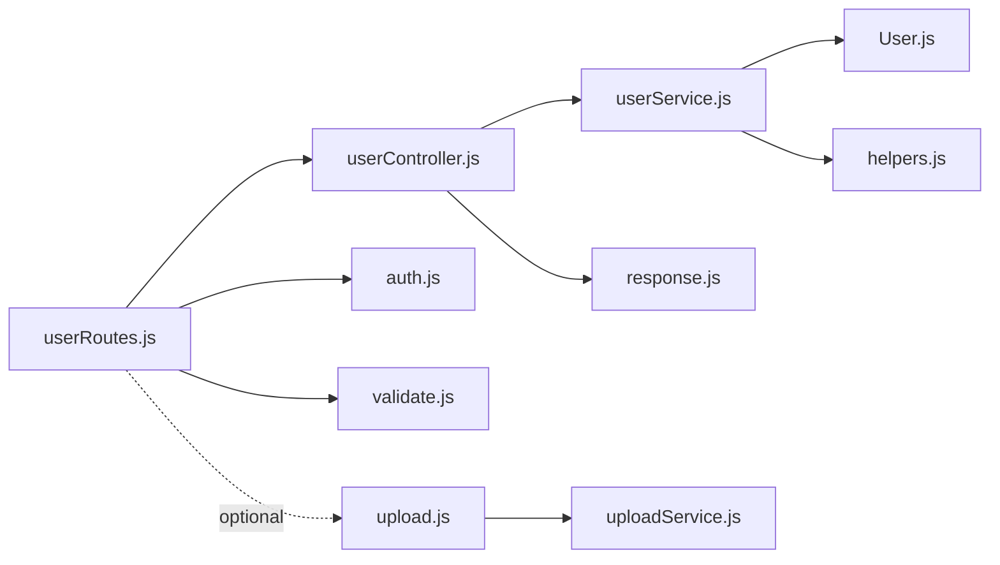

# User Management APIs

<cite>
**Referenced Files in This Document**
- [userController.js](file://backend/src/controllers/userController.js)
- [userRoutes.js](file://backend/src/routes/userRoutes.js)
- [userService.js](file://backend/src/services/userService.js)
- [User.js](file://backend/src/models/User.js)
- [auth.js](file://backend/src/middlewares/auth.js)
- [validate.js](file://backend/src/middlewares/validate.js)
- [index.js](file://backend/src/validators/index.js)
- [index.js](file://backend/src/constants/index.js)
- [response.js](file://backend/src/utils/response.js)
- [helpers.js](file://backend/src/utils/helpers.js)
- [upload.js](file://backend/src/middlewares/upload.js)
- [uploadService.js](file://backend/src/services/uploadService.js)
- [authRoutes.js](file://backend/src/routes/authRoutes.js)
- [authController.js](file://backend/src/controllers/authController.js)
</cite>

## Table of Contents
1. [Introduction](#introduction)
2. [Project Structure](#project-structure)
3. [Core Components](#core-components)
4. [Architecture Overview](#architecture-overview)
5. [Detailed Component Analysis](#detailed-component-analysis)
6. [Dependency Analysis](#dependency-analysis)
7. [Performance Considerations](#performance-considerations)
8. [Troubleshooting Guide](#troubleshooting-guide)
9. [Conclusion](#conclusion)
10. [Appendices](#appendices)

## Introduction
This document provides comprehensive API documentation for user profile management endpoints. It covers profile retrieval, updates, inventory management, ranking, and related user data operations. It also documents the validation rules, authorization requirements, and response schemas used across the system. Where applicable, integration patterns and data privacy considerations are included to guide client-side developers.

## Project Structure
The user management APIs are implemented using a layered architecture:
- Routes define endpoint contracts and apply middleware.
- Controllers orchestrate requests and delegate to services.
- Services encapsulate business logic and interact with models.
- Models define the data schema and transformations.
- Middlewares enforce authentication, validation, and file upload policies.
- Utilities provide standardized responses and helper functions.

**Diagram sources**
- [userRoutes.js:1-31](file://backend/src/routes/userRoutes.js#L1-L31)
- [auth.js:1-78](file://backend/src/middlewares/auth.js#L1-L78)
- [validate.js:1-34](file://backend/src/middlewares/validate.js#L1-L34)
- [userController.js:1-54](file://backend/src/controllers/userController.js#L1-L54)
- [userService.js:1-221](file://backend/src/services/userService.js#L1-L221)
- [User.js:1-243](file://backend/src/models/User.js#L1-L243)
- [response.js:1-82](file://backend/src/utils/response.js#L1-L82)
- [helpers.js:1-247](file://backend/src/utils/helpers.js#L1-L247)
- [upload.js:1-119](file://backend/src/middlewares/upload.js#L1-L119)
- [uploadService.js:1-83](file://backend/src/services/uploadService.js#L1-L83)

**Section sources**
- [userRoutes.js:1-31](file://backend/src/routes/userRoutes.js#L1-L31)
- [userController.js:1-54](file://backend/src/controllers/userController.js#L1-L54)
- [userService.js:1-221](file://backend/src/services/userService.js#L1-L221)
- [User.js:1-243](file://backend/src/models/User.js#L1-L243)
- [auth.js:1-78](file://backend/src/middlewares/auth.js#L1-L78)
- [validate.js:1-34](file://backend/src/middlewares/validate.js#L1-L34)
- [response.js:1-82](file://backend/src/utils/response.js#L1-L82)
- [helpers.js:1-247](file://backend/src/utils/helpers.js#L1-L247)
- [upload.js:1-119](file://backend/src/middlewares/upload.js#L1-L119)
- [uploadService.js:1-83](file://backend/src/services/uploadService.js#L1-L83)

## Core Components
- User Profile Retrieval: Fetches a user’s profile, synchronizes learning progress, and enriches with level metadata.
- Profile Updates: Allows updating allowed profile fields with strict validation.
- Inventory Management: Updates user inventory fields atomically.
- Ranking: Computes and returns user rank based on XP.
- Authentication: Ensures all user endpoints are protected via bearer token verification.
- Validation: Enforces field-level constraints for profile updates.
- Upload: Provides Cloudinary-backed image/audio upload utilities for avatar and media.

**Section sources**
- [userController.js:11-51](file://backend/src/controllers/userController.js#L11-L51)
- [userService.js:15-218](file://backend/src/services/userService.js#L15-L218)
- [userRoutes.js:11-31](file://backend/src/routes/userRoutes.js#L11-L31)
- [auth.js:15-50](file://backend/src/middlewares/auth.js#L15-L50)
- [index.js:13-21](file://backend/src/validators/index.js#L13-L21)
- [upload.js:66-112](file://backend/src/middlewares/upload.js#L66-L112)
- [uploadService.js:14-83](file://backend/src/services/uploadService.js#L14-L83)

## Architecture Overview
The user management flow follows a clean separation of concerns:
- Route handlers apply authentication and validation.
- Controllers call services for business logic.
- Services query or update the User model and related collections.
- Responses are standardized using a shared response utility.

**Diagram sources**
- [userRoutes.js:18-24](file://backend/src/routes/userRoutes.js#L18-L24)
- [auth.js:18-50](file://backend/src/middlewares/auth.js#L18-L50)
- [validate.js:17-31](file://backend/src/middlewares/validate.js#L17-L31)
- [userController.js:12-30](file://backend/src/controllers/userController.js#L12-L30)
- [userService.js:19-82](file://backend/src/services/userService.js#L19-L82)
- [User.js:223-231](file://backend/src/models/User.js#L223-L231)

## Detailed Component Analysis

### Endpoint Catalog
- GET /api/users/profile
  - Purpose: Retrieve authenticated user profile.
  - Auth: Required.
  - Response: User profile enriched with level metadata.
- PUT /api/users/profile
  - Purpose: Update allowed profile fields.
  - Auth: Required.
  - Validation: Name (2–50 chars), Avatar (string).
  - Response: Updated user profile.
- PUT /api/users/inventory
  - Purpose: Replace inventory with provided values.
  - Auth: Required.
  - Response: Updated user profile with inventory.
- GET /api/users/rank
  - Purpose: Compute and return user rank based on XP.
  - Auth: Required.
  - Response: Rank info (rank, xp, level, name, avatar).

**Section sources**
- [userRoutes.js:6-24](file://backend/src/routes/userRoutes.js#L6-L24)
- [userController.js:12-50](file://backend/src/controllers/userController.js#L12-L50)
- [index.js:13-21](file://backend/src/validators/index.js#L13-L21)

### Request and Response Schemas

- GET /api/users/profile
  - Request: None (authenticated via Authorization header).
  - Response:
    - success: boolean
    - message: string
    - data: object
      - Includes all user fields except sensitive ones (e.g., password, tokens).
      - Enriched with levelInfo: { level, currentLevelXp, nextLevelXp, progress }.

- PUT /api/users/profile
  - Request body:
    - name: string (optional), trimmed, length 2–50.
    - avatar: string (optional), must be a string.
  - Response: Same as GET profile.

- PUT /api/users/inventory
  - Request body: Complete inventory object (all fields replaced).
    - hints: number
    - timePowerups: number
    - livesPowerups: number
    - doubleScorePowerups: number
    - hintsLastReg: number (timestamp)
    - timePowerupsLastReg: number (timestamp)
    - livesPowerupsLastReg: number (timestamp)
    - doubleScorePowerupsLastReg: number (timestamp)
  - Response: Updated user profile with inventory.

- GET /api/users/rank
  - Request: None.
  - Response:
    - success: boolean
    - message: string
    - data: object
      - rank: number
      - xp: number
      - level: number
      - name: string
      - avatar: string

**Section sources**
- [userController.js:12-50](file://backend/src/controllers/userController.js#L12-L50)
- [userService.js:19-217](file://backend/src/services/userService.js#L19-L217)
- [User.js:14-176](file://backend/src/models/User.js#L14-L176)
- [helpers.js:42-60](file://backend/src/utils/helpers.js#L42-L60)
- [response.js:17-28](file://backend/src/utils/response.js#L17-L28)

### Authorization and Authentication
- All user endpoints are protected by the authentication middleware.
- The middleware extracts the token from the Authorization header or cookie, verifies it, attaches the user to the request, and enforces user existence.
- Unauthorized or expired tokens return appropriate error responses.

**Diagram sources**
- [auth.js:18-50](file://backend/src/middlewares/auth.js#L18-L50)

**Section sources**
- [auth.js:15-50](file://backend/src/middlewares/auth.js#L15-L50)

### Validation Rules
- Profile update validator enforces:
  - name: optional, trimmed, length 2–50.
  - avatar: optional, must be a string.
- Validation middleware aggregates errors and returns a structured 400 response with field, message, and value.

**Diagram sources**
- [index.js:13-21](file://backend/src/validators/index.js#L13-L21)
- [validate.js:17-31](file://backend/src/middlewares/validate.js#L17-L31)

**Section sources**
- [index.js:13-21](file://backend/src/validators/index.js#L13-L21)
- [validate.js:14-31](file://backend/src/middlewares/validate.js#L14-L31)

### Data Privacy Considerations
- Password and refresh token fields are excluded from user serialization by default.
- Sensitive fields are not returned in API responses.
- Token-based authentication ensures only authorized clients can access protected endpoints.

**Section sources**
- [User.js:223-231](file://backend/src/models/User.js#L223-L231)
- [auth.js](file://backend/src/middlewares/auth.js#L31)

### Avatar Management and Media Upload
While the user profile update endpoint supports avatar URLs, the repository does not expose dedicated endpoints for avatar upload. However, the upload infrastructure is present:
- Upload middleware integrates with Cloudinary for images and audio.
- Supported image types: JPEG, PNG, WebP; max size 5 MB.
- Supported audio types: MP3, WAV; max size 10 MB.
- Upload service provides methods to upload base64 images/audio and delete files by publicId.

Integration pattern:
- Clients can upload media via the existing upload endpoints and set the returned URL in the avatar field during profile update.

**Section sources**
- [upload.js:19-91](file://backend/src/middlewares/upload.js#L19-L91)
- [uploadService.js:14-83](file://backend/src/services/uploadService.js#L14-L83)

### Account Settings and Deletion
- The repository does not expose explicit endpoints for changing passwords or deleting accounts under the user management routes.
- Logout is available via the authentication routes and clears session tokens.
- For password change and account deletion, introduce dedicated endpoints under user routes with strong validation and confirmation mechanisms.

**Section sources**
- [authRoutes.js:34-35](file://backend/src/routes/authRoutes.js#L34-L35)
- [authController.js:34-42](file://backend/src/controllers/authController.js#L34-L42)

### Common User Management Scenarios

- Retrieve Profile
  - Call GET /api/users/profile with a valid Authorization header.
  - Expect a populated profile with level metadata.

- Update Profile
  - Call PUT /api/users/profile with name and/or avatar.
  - Receive updated profile in response.

- Update Inventory
  - Call PUT /api/users/inventory with a complete inventory payload.
  - Receive updated profile with inventory.

- Check Rank
  - Call GET /api/users/rank to compute rank based on XP.

- Avatar Upload (integration)
  - Use the upload middleware/service to upload an image and set the returned URL in the avatar field.

**Section sources**
- [userRoutes.js:21-24](file://backend/src/routes/userRoutes.js#L21-L24)
- [userController.js:12-50](file://backend/src/controllers/userController.js#L12-L50)
- [upload.js:66-91](file://backend/src/middlewares/upload.js#L66-L91)

## Dependency Analysis

**Diagram sources**
- [userRoutes.js:11-31](file://backend/src/routes/userRoutes.js#L11-L31)
- [userController.js:7-8](file://backend/src/controllers/userController.js#L7-L8)
- [userService.js:10-13](file://backend/src/services/userService.js#L10-L13)
- [User.js:10-13](file://backend/src/models/User.js#L10-L13)
- [auth.js:10-13](file://backend/src/middlewares/auth.js#L10-L13)
- [validate.js:10-12](file://backend/src/middlewares/validate.js#L10-L12)
- [response.js:10-12](file://backend/src/utils/response.js#L10-L12)
- [helpers.js:10-11](file://backend/src/utils/helpers.js#L10-L11)
- [upload.js:10-14](file://backend/src/middlewares/upload.js#L10-L14)
- [uploadService.js:10-12](file://backend/src/services/uploadService.js#L10-L12)

**Section sources**
- [userRoutes.js:11-31](file://backend/src/routes/userRoutes.js#L11-L31)
- [userController.js:7-8](file://backend/src/controllers/userController.js#L7-L8)
- [userService.js:10-13](file://backend/src/services/userService.js#L10-L13)
- [User.js:10-13](file://backend/src/models/User.js#L10-L13)
- [auth.js:10-13](file://backend/src/middlewares/auth.js#L10-L13)
- [validate.js:10-12](file://backend/src/middlewares/validate.js#L10-L12)
- [response.js:10-12](file://backend/src/utils/response.js#L10-L12)
- [helpers.js:10-11](file://backend/src/utils/helpers.js#L10-L11)
- [upload.js:10-14](file://backend/src/middlewares/upload.js#L10-L14)
- [uploadService.js:10-12](file://backend/src/services/uploadService.js#L10-L12)

## Performance Considerations
- Populate operations: Profile retrieval populates badges, achievements, and completed lessons. Excessive population can increase query cost; consider limiting or paginating where feasible.
- Index usage: User schema defines indexes on rank, xp, and level to optimize ranking and sorting queries.
- Pre-save hooks: Password hashing occurs only when modified; avoid unnecessary saves to reduce overhead.
- Validation overhead: Keep validation chains minimal and reuse validators across routes.

[No sources needed since this section provides general guidance]

## Troubleshooting Guide
- 401 Unauthorized
  - Cause: Missing or invalid Authorization header/token.
  - Resolution: Ensure a valid bearer token is attached to the request.
- 401 Token Expired/Invalid
  - Cause: Expired or malformed token.
  - Resolution: Refresh token or re-authenticate.
- 400 Validation Error
  - Cause: Fields violate validation rules (e.g., name length, avatar type).
  - Resolution: Correct payload according to validator specs.
- 404 Not Found
  - Cause: User not found during profile retrieval/update.
  - Resolution: Confirm authenticated user ID and data consistency.

**Section sources**
- [auth.js:23-49](file://backend/src/middlewares/auth.js#L23-L49)
- [validate.js:17-31](file://backend/src/middlewares/validate.js#L17-L31)
- [userService.js:45-47](file://backend/src/services/userService.js#L45-L47)

## Conclusion
The user management APIs provide a secure, validated, and extensible foundation for profile operations. By leveraging the existing authentication, validation, and upload infrastructure, teams can integrate avatar management and expand account settings as needed while maintaining consistent response formats and privacy safeguards.

[No sources needed since this section summarizes without analyzing specific files]

## Appendices

### API Definition Summary
- GET /api/users/profile
  - Auth: Required
  - Response: { success, message, data: userProfileWithLevel }
- PUT /api/users/profile
  - Auth: Required
  - Body: { name?, avatar? }
  - Response: { success, message, data: updatedUserProfile }
- PUT /api/users/inventory
  - Auth: Required
  - Body: Complete inventory object
  - Response: { success, message, data: updatedUserProfile }
- GET /api/users/rank
  - Auth: Required
  - Response: { success, message, data: { rank, xp, level, name, avatar } }

**Section sources**
- [userRoutes.js:6-24](file://backend/src/routes/userRoutes.js#L6-L24)
- [userController.js:12-50](file://backend/src/controllers/userController.js#L12-L50)
- [userService.js:203-217](file://backend/src/services/userService.js#L203-L217)