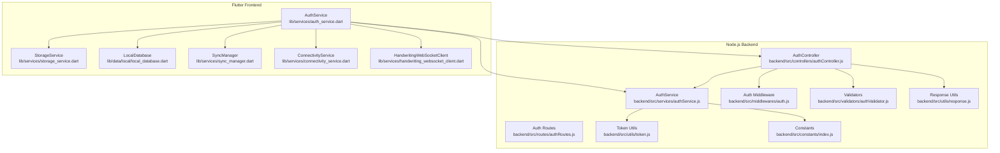
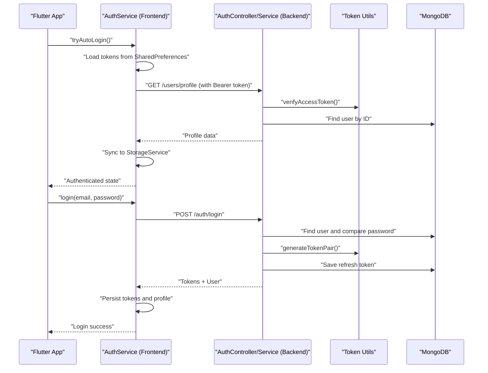

# Authentication Service API

<cite>
**Referenced Files in This Document**
- [auth_service.dart](file://lib/services/auth_service.dart)
- [authController.js](file://backend/src/controllers/authController.js)
- [authService.js](file://backend/src/services/authService.js)
- [authRoutes.js](file://backend/src/routes/authRoutes.js)
- [token.js](file://backend/src/utils/token.js)
- [auth.js](file://backend/src/middlewares/auth.js)
- [authValidator.js](file://backend/src/validators/authValidator.js)
- [response.js](file://backend/src/utils/response.js)
- [index.js](file://backend/src/constants/index.js)
- [local_database.dart](file://lib/data/local/local_database.dart)
- [storage_service.dart](file://lib/services/storage_service.dart)
- [sync_manager.dart](file://lib/services/sync_manager.dart)
- [connectivity_service.dart](file://lib/services/connectivity_service.dart)
- [handwriting_websocket_client.dart](file://lib/services/handwriting_websocket_client.dart)
</cite>

## Table of Contents
1. [Introduction](#introduction)
2. [Project Structure](#project-structure)
3. [Core Components](#core-components)
4. [Architecture Overview](#architecture-overview)
5. [Detailed Component Analysis](#detailed-component-analysis)
6. [Dependency Analysis](#dependency-analysis)
7. [Performance Considerations](#performance-considerations)
8. [Troubleshooting Guide](#troubleshooting-guide)
9. [Conclusion](#conclusion)
10. [Appendices](#appendices)

## Introduction
This document provides comprehensive API documentation for the Authentication Service across both Flutter frontend and Node.js backend. It covers all authentication-related methods, including tryAutoLogin(), register(), login(), googleLogin(), googleMockLogin(), fetchProfile(), updateProfile(), refreshAccessToken(), and logout(). For each method, you will find detailed parameter specifications, return value structures, error handling patterns, and timeout configurations. The document also explains authentication flows, token management strategies, SharedPreferences integration, Google Sign-In integration, mock login functionality for development, offline authentication capabilities, and practical usage examples with error recovery scenarios.

## Project Structure
The authentication system spans two primary layers:
- Flutter Frontend: Provides user-facing authentication flows, token persistence, offline support, and integration with backend APIs.
- Node.js Backend: Implements secure authentication logic, token generation/verification, middleware protection, and Google OAuth/mobile sign-in.



**Diagram sources**
- [auth_service.dart](file://lib/services/auth_service.dart)
- [authController.js](file://backend/src/controllers/authController.js)
- [authService.js](file://backend/src/services/authService.js)
- [authRoutes.js](file://backend/src/routes/authRoutes.js)
- [token.js](file://backend/src/utils/token.js)
- [auth.js](file://backend/src/middlewares/auth.js)
- [authValidator.js](file://backend/src/validators/authValidator.js)
- [response.js](file://backend/src/utils/response.js)
- [index.js](file://backend/src/constants/index.js)
- [storage_service.dart](file://lib/services/storage_service.dart)
- [local_database.dart](file://lib/data/local/local_database.dart)
- [sync_manager.dart](file://lib/services/sync_manager.dart)
- [connectivity_service.dart](file://lib/services/connectivity_service.dart)
- [handwriting_websocket_client.dart](file://lib/services/handwriting_websocket_client.dart)

**Section sources**
- [auth_service.dart](file://lib/services/auth_service.dart)
- [authController.js](file://backend/src/controllers/authController.js)
- [authService.js](file://backend/src/services/authService.js)
- [authRoutes.js](file://backend/src/routes/authRoutes.js)

## Core Components
This section outlines the core authentication components and their responsibilities:
- Flutter AuthService: Orchestrates authentication flows, manages tokens, integrates with SharedPreferences, handles offline scenarios, and coordinates with SyncManager and WebSocket clients.
- Backend AuthController: Exposes REST endpoints for registration, login, logout, token refresh, and Google OAuth/mobile sign-in.
- Backend AuthService: Implements business logic for user creation, credential verification, token generation, Google login handling, and refresh token validation.
- Token Utilities: Generate and verify JWT access and refresh tokens with configurable expiration policies.
- Authentication Middleware: Protects routes by extracting and validating tokens from headers or cookies.
- Validators: Enforce input validation for registration, login, and refresh-token requests.
- Response Utilities: Standardize API responses across success, creation, error, and pagination formats.
- Constants: Centralize messages, roles, providers, XP configurations, and other shared constants.

**Section sources**
- [auth_service.dart](file://lib/services/auth_service.dart)
- [authController.js](file://backend/src/controllers/authController.js)
- [authService.js](file://backend/src/services/authService.js)
- [token.js](file://backend/src/utils/token.js)
- [auth.js](file://backend/src/middlewares/auth.js)
- [authValidator.js](file://backend/src/validators/authValidator.js)
- [response.js](file://backend/src/utils/response.js)
- [index.js](file://backend/src/constants/index.js)

## Architecture Overview
The authentication architecture follows a layered design:
- Frontend Layer: Handles UI interactions, token persistence, offline-first behavior, and real-time updates via WebSocket.
- Backend Layer: Provides secure endpoints, validates credentials, generates tokens, and enforces access control.
- Shared Layer: Uses JWT for stateless authentication, with refresh tokens stored server-side for security.



**Diagram sources**
- [auth_service.dart](file://lib/services/auth_service.dart)
- [authController.js](file://backend/src/controllers/authController.js)
- [authService.js](file://backend/src/services/authService.js)
- [token.js](file://backend/src/utils/token.js)

## Detailed Component Analysis

### tryAutoLogin()
- Purpose: Automatically authenticate the user on app startup using persisted tokens and optionally restore offline profile data.
- Parameters: None (reads from SharedPreferences internally).
- Behavior:
  - Loads accessToken and refreshToken from SharedPreferences.
  - Attempts to fetch the latest profile from the backend if online.
  - If profile fetch fails or device is offline, attempts to refresh tokens and retry profile fetch.
  - Falls back to cached profile stored in SharedPreferences for offline mode.
  - Triggers full sync and connects WebSocket upon successful auto-login.
- Return Value: Boolean indicating whether auto-login succeeded.
- Error Handling:
  - Gracefully handles network failures, token expiration, and offline scenarios.
  - On failure, clears stale tokens and returns false.
- Timeout Configuration:
  - Profile fetch timeout: short duration to prevent UI blocking during weak networks.
  - Server reachability ping timeout: moderate duration to detect offline state.
- Integration Points:
  - SharedPreferences for token and profile persistence.
  - ConnectivityService for online/offline detection.
  - SyncManager for background synchronization.
  - HandwritingWebSocketClient for real-time notifications.

**Section sources**
- [auth_service.dart](file://lib/services/auth_service.dart)

### register()
- Purpose: Register a new user with name, email, and password.
- Endpoint: POST /api/auth/register
- Request Body:
  - name: string (required)
  - email: string (required, validated)
  - password: string (required, minimum length enforced)
- Response:
  - 201 Created on success with tokens and user data.
  - 400 Bad Request on validation or duplicate email.
- Error Handling:
  - Validation errors via express-validator.
  - Duplicate email handled with specific error message.
- Timeout Configuration:
  - HTTP timeout applied to the request.

**Section sources**
- [authController.js](file://backend/src/controllers/authController.js)
- [authService.js](file://backend/src/services/authService.js)
- [authValidator.js](file://backend/src/validators/authValidator.js)
- [authRoutes.js](file://backend/src/routes/authRoutes.js)
- [response.js](file://backend/src/utils/response.js)

### login()
- Purpose: Authenticate a user with email and password.
- Endpoint: POST /api/auth/login
- Request Body:
  - email: string (required, validated)
  - password: string (required)
- Response:
  - 200 OK with accessToken, refreshToken, and user profile.
  - 401 Unauthorized for invalid credentials.
- Error Handling:
  - Checks if user registered via Google and rejects local password login.
  - Updates streak, XP, and login dates on successful login.
- Timeout Configuration:
  - HTTP timeout applied to the request.

**Section sources**
- [authController.js](file://backend/src/controllers/authController.js)
- [authService.js](file://backend/src/services/authService.js)
- [authValidator.js](file://backend/src/validators/authValidator.js)
- [authRoutes.js](file://backend/src/routes/authRoutes.js)
- [index.js](file://backend/src/constants/index.js)

### googleLogin()
- Purpose: Authenticate using native Google Sign-In flow on mobile devices.
- Workflow:
  - Opens Google Sign-In picker.
  - Retrieves idToken from Google.
  - Posts idToken to backend endpoint for verification and user creation/update.
- Endpoint: POST /api/auth/google/mobile-signin
- Request Body:
  - idToken: string (required)
- Response:
  - 200 OK with accessToken, refreshToken, and user profile.
  - 400/401 on token validation or user creation errors.
- Error Handling:
  - Handles developer exceptions and network errors with actionable messages.
  - Supports mock login fallback for local testing.
- Timeout Configuration:
  - HTTP timeout applied to the request.

**Section sources**
- [auth_service.dart](file://lib/services/auth_service.dart)
- [authController.js](file://backend/src/controllers/authController.js)
- [authService.js](file://backend/src/services/authService.js)
- [authRoutes.js](file://backend/src/routes/authRoutes.js)

### googleMockLogin()
- Purpose: Simulate Google login for development/testing without requiring a real Google account.
- Behavior:
  - Generates a mock idToken based on provided email/name.
  - Calls the same backend endpoint as googleLogin().
- Request Parameters:
  - email: string (optional)
  - name: string (optional)
- Response:
  - Same as googleLogin().

**Section sources**
- [auth_service.dart](file://lib/services/auth_service.dart)
- [authController.js](file://backend/src/controllers/authController.js)
- [authService.js](file://backend/src/services/authService.js)

### fetchProfile()
- Purpose: Retrieve the authenticated user's profile and rank from the backend.
- Endpoint: GET /api/users/profile
- Headers:
  - Authorization: Bearer <accessToken>
- Additional Behavior:
  - Fetches dynamic rank from backend and merges into profile.
  - Persists updated profile to SharedPreferences.
  - Synchronizes profile data to StorageService for UI updates.
- Response:
  - 200 OK with user data.
  - 401 Unauthorized if token invalid/expired.
- Timeout Configuration:
  - Configurable timeout; defaults to HTTP timeout.
  - Rank fetch uses a separate shorter timeout.

**Section sources**
- [auth_service.dart](file://lib/services/auth_service.dart)
- [authController.js](file://backend/src/controllers/authController.js)
- [authService.js](file://backend/src/services/authService.js)

### updateProfile()
- Purpose: Update user's name and/or avatar.
- Endpoint: PUT /api/users/profile
- Headers:
  - Authorization: Bearer <accessToken>
- Behavior:
  - If avatar is a local file path, uploads to Cloudinary first.
  - Builds request body with provided fields.
  - Persists updated profile to SharedPreferences and StorageService.
- Response:
  - 200 OK with updated user data.
  - 400/401 on validation or authorization errors.
- Timeout Configuration:
  - HTTP timeout applied to the request.

**Section sources**
- [auth_service.dart](file://lib/services/auth_service.dart)
- [authController.js](file://backend/src/controllers/authController.js)
- [authService.js](file://backend/src/services/authService.js)

### refreshAccessToken()
- Purpose: Renew access token using a valid refresh token.
- Endpoint: POST /api/auth/refresh-token
- Request Body:
  - refreshToken: string (required)
- Response:
  - 200 OK with new accessToken and refreshToken pair.
  - 400/401 on missing or invalid refresh token.
- Error Handling:
  - Validates presence of refresh token.
  - Verifies token against stored refresh token in DB.
  - Updates refresh token on successful renewal.
- Timeout Configuration:
  - HTTP timeout applied to the request.

**Section sources**
- [auth_service.dart](file://lib/services/auth_service.dart)
- [authController.js](file://backend/src/controllers/authController.js)
- [authService.js](file://backend/src/services/authService.js)
- [authRoutes.js](file://backend/src/routes/authRoutes.js)
- [token.js](file://backend/src/utils/token.js)

### logout()
- Purpose: Log out the current user and clean up local state.
- Endpoint: POST /api/auth/logout (server-side reporting)
- Behavior:
  - Reports logout to backend (best-effort).
  - Clears tokens and profile from memory.
  - Signs out from Google SDK if applicable.
  - Disconnects WebSocket.
  - Clears StorageService and LocalDatabase.
- Response:
  - 200 OK on completion (best-effort).
- Timeout Configuration:
  - Short timeout for server-side reporting to avoid UI blocking.

**Section sources**
- [auth_service.dart](file://lib/services/auth_service.dart)
- [authController.js](file://backend/src/controllers/authController.js)
- [authService.js](file://backend/src/services/authService.js)
- [storage_service.dart](file://lib/services/storage_service.dart)
- [local_database.dart](file://lib/data/local/local_database.dart)
- [handwriting_websocket_client.dart](file://lib/services/handwriting_websocket_client.dart)

## Dependency Analysis
This section maps the dependencies among authentication components and highlights coupling and cohesion.

```mermaid
classDiagram
class AuthService_Frontend {
+tryAutoLogin()
+register(name, email, password)
+login(email, password)
+googleLogin()
+googleMockLogin(email, name)
+fetchProfile(timeout)
+updateProfile(name, avatar)
+refreshAccessToken()
+logout()
}
class AuthController_Backend {
+register(req, res, next)
+login(req, res, next)
+logout(req, res, next)
+refreshToken(req, res, next)
+googleLogin(req, res, next)
+googleCallback(req, res, next)
+mobileGoogleLogin(req, res, next)
}
class AuthService_Backend {
+register({name, email, password})
+login({email, password})
+logout(userId)
+refreshToken(refreshToken)
+googleLogin(user)
+mobileGoogleLogin(idToken)
}
class TokenUtils {
+generateTokenPair(user)
+verifyAccessToken(token)
+verifyRefreshToken(token)
+extractToken(req)
}
class AuthMiddleware {
+authenticate(req, res, next)
+optionalAuth(req, res, next)
}
class Validators {
+registerValidator
+loginValidator
+refreshTokenValidator
}
class ResponseUtils {
+sendSuccess(res, message, data, statusCode)
+sendCreated(res, message, data)
+sendError(res, message, statusCode, errors)
}
AuthService_Frontend --> AuthController_Backend : "calls"
AuthController_Backend --> AuthService_Backend : "delegates"
AuthService_Backend --> TokenUtils : "uses"
AuthController_Backend --> AuthMiddleware : "protects routes"
AuthController_Backend --> Validators : "validates input"
AuthController_Backend --> ResponseUtils : "formats response"
```

**Diagram sources**
- [auth_service.dart](file://lib/services/auth_service.dart)
- [authController.js](file://backend/src/controllers/authController.js)
- [authService.js](file://backend/src/services/authService.js)
- [token.js](file://backend/src/utils/token.js)
- [auth.js](file://backend/src/middlewares/auth.js)
- [authValidator.js](file://backend/src/validators/authValidator.js)
- [response.js](file://backend/src/utils/response.js)

**Section sources**
- [auth_service.dart](file://lib/services/auth_service.dart)
- [authController.js](file://backend/src/controllers/authController.js)
- [authService.js](file://backend/src/services/authService.js)
- [token.js](file://backend/src/utils/token.js)
- [auth.js](file://backend/src/middlewares/auth.js)
- [authValidator.js](file://backend/src/validators/authValidator.js)
- [response.js](file://backend/src/utils/response.js)

## Performance Considerations
- Token Lifetimes:
  - Access tokens expire after a short period (configured in token utilities).
  - Refresh tokens expire after a longer period and are stored server-side for security.
- HTTP Timeouts:
  - Global HTTP timeout is applied to most authentication requests to prevent UI blocking.
  - Profile fetch uses a shorter timeout during auto-login to improve perceived performance.
- Offline-First Design:
  - Auto-login attempts to recover from network failures by using cached profiles and refresh tokens.
  - WebSocket reconnection logic includes token refresh to handle expired tokens gracefully.
- Rate Limiting:
  - Authentication routes are protected by rate limiting to mitigate abuse.

[No sources needed since this section provides general guidance]

## Troubleshooting Guide
Common issues and recovery strategies:
- Invalid Credentials:
  - Symptom: Login returns unauthorized.
  - Recovery: Ensure correct email/password; if using Google, avoid local password login.
- Expired or Missing Tokens:
  - Symptom: Profile fetch or protected route returns unauthorized.
  - Recovery: Call refreshAccessToken(); if unsuccessful, prompt user to re-authenticate.
- Network Failures:
  - Symptom: Requests timeout or fail.
  - Recovery: Check connectivity; use offline mode if cached profile is available.
- Google Sign-In Errors:
  - Symptom: Developer exceptions or platform errors.
  - Recovery: Use googleMockLogin() for local testing; adjust client configuration.
- Server Unreachable:
  - Symptom: Auto-login cannot contact server.
  - Recovery: Use manual server URL setting; ensure backend is reachable.

**Section sources**
- [auth_service.dart](file://lib/services/auth_service.dart)
- [authController.js](file://backend/src/controllers/authController.js)
- [authService.js](file://backend/src/services/authService.js)
- [token.js](file://backend/src/utils/token.js)

## Conclusion
The Authentication Service provides a robust, secure, and user-friendly authentication experience across platforms. It leverages JWT-based stateless authentication, refresh tokens for seamless sessions, and offline-first design for resilient operation. The frontend integrates tightly with SharedPreferences, StorageService, and SyncManager to maintain consistent user state, while the backend enforces strict validation, middleware protection, and standardized responses.

[No sources needed since this section summarizes without analyzing specific files]

## Appendices

### API Endpoints Summary
- POST /api/auth/register
  - Body: name, email, password
  - Response: 201 with tokens and user
- POST /api/auth/login
  - Body: email, password
  - Response: 200 with tokens and user
- POST /api/auth/logout
  - Headers: Authorization
  - Response: 200 on completion
- POST /api/auth/refresh-token
  - Body: refreshToken
  - Response: 200 with new tokens
- GET /api/auth/google
  - Description: Initiate Google OAuth
- GET /api/auth/google/callback
  - Description: Handle OAuth callback
- POST /api/auth/google/mobile-signin
  - Body: idToken
  - Response: 200 with tokens and user

**Section sources**
- [authRoutes.js](file://backend/src/routes/authRoutes.js)
- [authController.js](file://backend/src/controllers/authController.js)

### Token Management Strategies
- Access Token:
  - Short-lived JWT used for protected API calls.
  - Extracted from Authorization header or cookies.
- Refresh Token:
  - Long-lived JWT stored server-side in user document.
  - Used to obtain new access tokens securely.
- Storage:
  - Frontend persists tokens in SharedPreferences.
  - Backend verifies tokens against stored refresh tokens.

**Section sources**
- [token.js](file://backend/src/utils/token.js)
- [auth.js](file://backend/src/middlewares/auth.js)
- [authService.js](file://backend/src/services/authService.js)
- [auth_service.dart](file://lib/services/auth_service.dart)

### SharedPreferences Integration
- Keys:
  - accessToken, refreshToken, userProfile
  - Manual/automatic server URL settings
- Behavior:
  - Persist tokens and profile after successful login.
  - Load tokens during auto-login.
  - Clear on logout to protect user data.

**Section sources**
- [auth_service.dart](file://lib/services/auth_service.dart)
- [storage_service.dart](file://lib/services/storage_service.dart)

### Google Sign-In Integration
- Native Mobile Flow:
  - Uses GoogleSignIn to obtain idToken.
  - Posts idToken to backend for verification and user creation/update.
- Web Client ID:
  - Configured for server-side validation on Android.
- Mock Login:
  - Generates mock idToken for development without real Google accounts.

**Section sources**
- [auth_service.dart](file://lib/services/auth_service.dart)
- [authController.js](file://backend/src/controllers/authController.js)
- [authService.js](file://backend/src/services/authService.js)

### Offline Authentication Capabilities
- Auto-login with cached profile:
  - Restores user state when server is unreachable.
- Token refresh attempts:
  - Uses refresh tokens to renew access tokens when possible.
- Background sync:
  - SyncManager queues and retries pending operations when online.

**Section sources**
- [auth_service.dart](file://lib/services/auth_service.dart)
- [sync_manager.dart](file://lib/services/sync_manager.dart)
- [connectivity_service.dart](file://lib/services/connectivity_service.dart)

### Practical Usage Examples
- Typical Login Flow:
  - Call login(email, password).
  - On success, persist tokens and profile; trigger full sync; connect WebSocket.
- Auto-login on App Start:
  - Call tryAutoLogin() to restore session or fall back to offline mode.
- Google Login:
  - Call googleLogin() to authenticate via Google; on success, persist tokens and profile.
- Profile Update:
  - Call updateProfile(name, avatar) to update user details; avatar can be uploaded automatically.
- Logout:
  - Call logout() to clear tokens, profile, and local data; disconnect WebSocket and clear databases.

**Section sources**
- [auth_service.dart](file://lib/services/auth_service.dart)
- [authController.js](file://backend/src/controllers/authController.js)
- [authService.js](file://backend/src/services/authService.js)