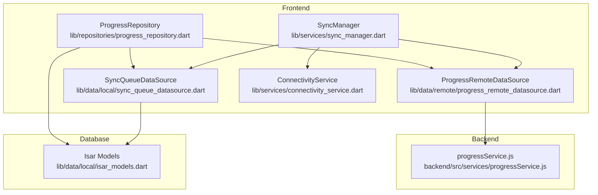
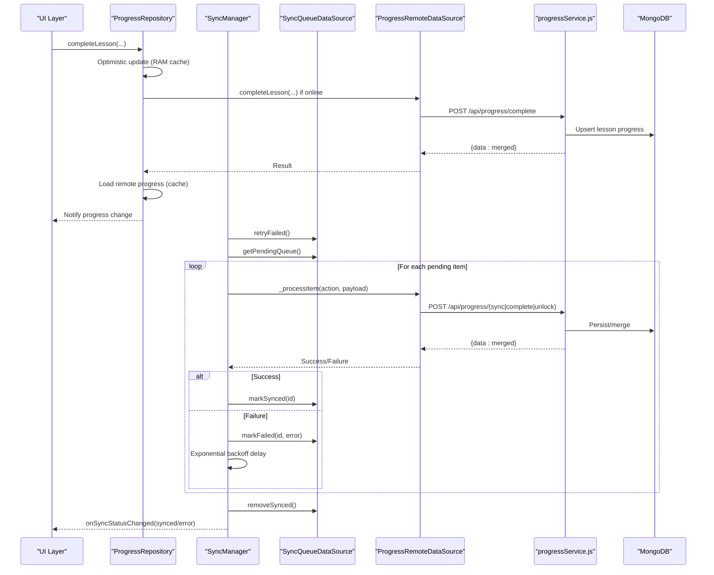
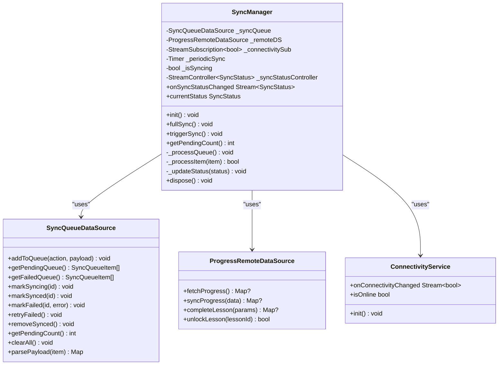
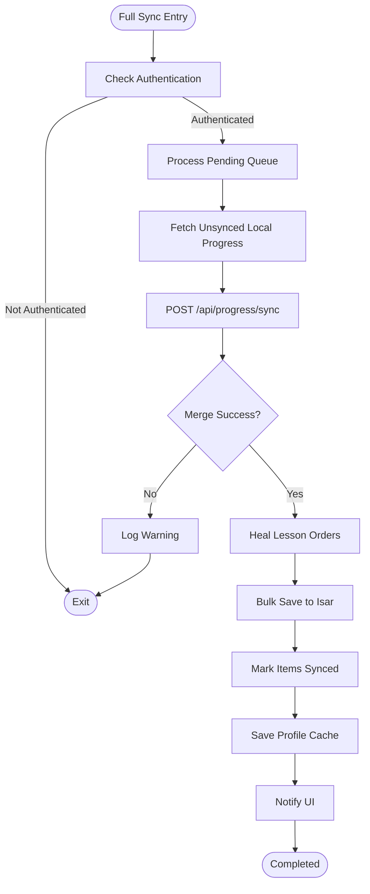
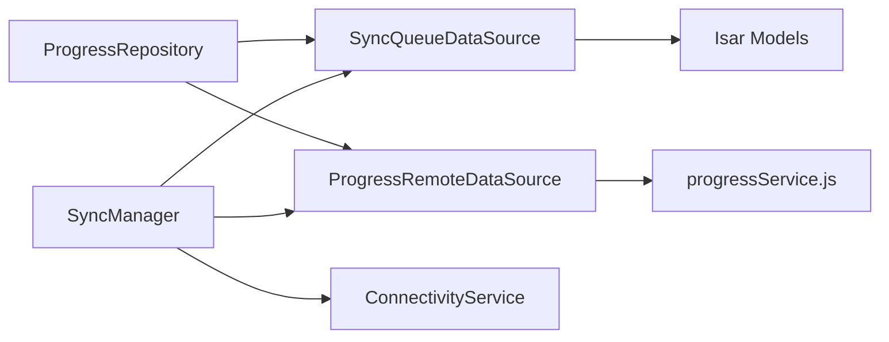

# Data Synchronization API

<cite>
**Referenced Files in This Document**
- [sync_manager.dart](file://lib/services/sync_manager.dart)
- [sync_queue_datasource.dart](file://lib/data/local/sync_queue_datasource.dart)
- [progress_repository.dart](file://lib/repositories/progress_repository.dart)
- [progress_remote_datasource.dart](file://lib/data/remote/progress_remote_datasource.dart)
- [isar_models.dart](file://lib/data/local/isar_models.dart)
- [connectivity_service.dart](file://lib/services/connectivity_service.dart)
- [progressService.js](file://backend/src/services/progressService.js)
</cite>

## Table of Contents
1. [Introduction](#introduction)
2. [Project Structure](#project-structure)
3. [Core Components](#core-components)
4. [Architecture Overview](#architecture-overview)
5. [Detailed Component Analysis](#detailed-component-analysis)
6. [Dependency Analysis](#dependency-analysis)
7. [Performance Considerations](#performance-considerations)
8. [Troubleshooting Guide](#troubleshooting-guide)
9. [Conclusion](#conclusion)

## Introduction
This document provides comprehensive API documentation for the Data Synchronization Service. It covers all sync-related methods, synchronization strategies, conflict resolution mechanisms, offline-first architecture patterns, queue management, retry logic, error handling, status monitoring, progress tracking, and performance optimization techniques. It also explains integration with local database operations and remote API synchronization.

## Project Structure
The synchronization system spans three layers:
- Frontend (Flutter): Services, repositories, and data sources manage offline-first behavior and queue operations.
- Backend (Node.js/MongoDB): Provides REST endpoints for progress synchronization with conflict resolution strategies.
- Database (Isar): Local caching and offline storage for progress and sync queue items.

**Diagram sources**
- [sync_manager.dart:12-246](file://lib/services/sync_manager.dart#L12-L246)
- [progress_repository.dart:17-416](file://lib/repositories/progress_repository.dart#L17-L416)
- [sync_queue_datasource.dart:7-126](file://lib/data/local/sync_queue_datasource.dart#L7-L126)
- [progress_remote_datasource.dart:6-144](file://lib/data/remote/progress_remote_datasource.dart#L6-L144)
- [isar_models.dart:67-137](file://lib/data/local/isar_models.dart#L67-L137)
- [connectivity_service.dart:5-60](file://lib/services/connectivity_service.dart#L5-L60)
- [progressService.js:60-155](file://backend/src/services/progressService.js#L60-L155)

**Section sources**
- [sync_manager.dart:12-246](file://lib/services/sync_manager.dart#L12-L246)
- [progress_repository.dart:17-416](file://lib/repositories/progress_repository.dart#L17-L416)
- [sync_queue_datasource.dart:7-126](file://lib/data/local/sync_queue_datasource.dart#L7-L126)
- [progress_remote_datasource.dart:6-144](file://lib/data/remote/progress_remote_datasource.dart#L6-L144)
- [isar_models.dart:67-137](file://lib/data/local/isar_models.dart#L67-L137)
- [connectivity_service.dart:5-60](file://lib/services/connectivity_service.dart#L5-L60)
- [progressService.js:60-155](file://backend/src/services/progressService.js#L60-L155)

## Core Components
- SyncManager: Central orchestrator for offline-first synchronization, queue processing, periodic sync, and status reporting.
- ProgressRepository: Offline-first repository managing local progress cache, full sync, and conflict resolution.
- SyncQueueDataSource: Local queue persistence for pending and failed sync actions using Isar.
- ProgressRemoteDataSource: HTTP client wrapper for remote progress APIs.
- ConnectivityService: Network connectivity monitoring with broadcast stream.
- Isar Models: Schema for SyncQueueItem and UserProgress collections.

Key responsibilities:
- Offline-first architecture with optimistic UI updates.
- Automatic background sync on connectivity changes and periodic intervals.
- Exponential backoff retry for failed queue items.
- Conflict resolution via take-max strategy and lesson order healing.
- Status monitoring via a broadcast stream.

**Section sources**
- [sync_manager.dart:12-246](file://lib/services/sync_manager.dart#L12-L246)
- [progress_repository.dart:17-416](file://lib/repositories/progress_repository.dart#L17-L416)
- [sync_queue_datasource.dart:7-126](file://lib/data/local/sync_queue_datasource.dart#L7-L126)
- [progress_remote_datasource.dart:6-144](file://lib/data/remote/progress_remote_datasource.dart#L6-L144)
- [isar_models.dart:67-137](file://lib/data/local/isar_models.dart#L67-L137)
- [connectivity_service.dart:5-60](file://lib/services/connectivity_service.dart#L5-L60)

## Architecture Overview
The system follows an offline-first hybrid architecture:
- Local Isar database stores progress and sync queue items.
- SyncManager monitors connectivity and processes the queue.
- ProgressRepository performs full bidirectional sync with the backend.
- Conflict resolution merges client and server data using take-max strategy and lesson order healing.
- Remote APIs expose endpoints for progress retrieval, merging, lesson completion, and unlocking.

**Diagram sources**
- [sync_manager.dart:76-155](file://lib/services/sync_manager.dart#L76-L155)
- [progress_repository.dart:105-161](file://lib/repositories/progress_repository.dart#L105-L161)
- [progress_remote_datasource.dart:71-112](file://lib/data/remote/progress_remote_datasource.dart#L71-L112)
- [progressService.js:60-155](file://backend/src/services/progressService.js#L60-L155)
- [sync_queue_datasource.dart:38-101](file://lib/data/local/sync_queue_datasource.dart#L38-L101)

## Detailed Component Analysis

### SyncManager
Responsibilities:
- Initialize connectivity monitoring and periodic sync.
- Process the entire sync queue with retry and exponential backoff.
- Handle full sync and manual trigger sync.
- Monitor and broadcast sync status.

Key methods:
- init(): Subscribes to connectivity changes, starts periodic sync, and triggers initial queue processing when online.
- fullSync(): Processes pending queue, performs full bidirectional sync via ProgressRepository, refreshes profile, and updates status.
- triggerSync(): Manually processes the queue if online.
- getPendingCount(): Returns total pending plus retryable failed items.
- Internal queue processor: retryFailed(), getPendingQueue(), markSyncing(), markSynced(), markFailed(), removeSynced().
- Item processor: _processItem() dispatches actions to ProgressRemoteDataSource.

Status monitoring:
- Broadcast stream onSyncStatusChanged emits idle, syncing, synced, error, offline.

Retry logic:
- Exponential backoff capped at 30 seconds per item.
- Failed items retried up to a maximum retry threshold.

Conflict resolution:
- Delegated to backend via take-max strategy during bidirectional merge.

Integration points:
- Uses ConnectivityService for online/offline detection.
- Uses ProgressRemoteDataSource for remote operations.
- Uses SyncQueueDataSource for queue persistence.

**Section sources**
- [sync_manager.dart:45-246](file://lib/services/sync_manager.dart#L45-L246)

#### Sync Manager Class Diagram

**Diagram sources**
- [sync_manager.dart:21-246](file://lib/services/sync_manager.dart#L21-L246)
- [sync_queue_datasource.dart:9-126](file://lib/data/local/sync_queue_datasource.dart#L9-L126)
- [progress_remote_datasource.dart:7-144](file://lib/data/remote/progress_remote_datasource.dart#L7-L144)
- [connectivity_service.dart:6-60](file://lib/services/connectivity_service.dart#L6-L60)

### ProgressRepository
Responsibilities:
- Offline-first progress management with RAM cache for optimistic updates.
- Full bidirectional sync with MongoDB via backend.
- Conflict resolution using take-max strategy and lesson order healing.
- Local persistence via Isar and profile caching.

Key methods:
- completeLesson(...): Optimistic UI update, optional online completion, profile refresh, and notification.
- fullSync(): Retrieves unsynced local progress, posts to backend, merges results, heals lesson orders, saves to Isar, marks synced, updates profile cache, and notifies UI.
- loadRemoteProgress(): Loads remote progress and heals lesson order issues.
- Utility getters for completed/unlocked lesson IDs and progress maps.

Conflict resolution:
- Backend merge uses take-max for stars and union for unlocked lessons.
- Frontend heals invalid lesson orders using lesson metadata.

**Section sources**
- [progress_repository.dart:17-416](file://lib/repositories/progress_repository.dart#L17-L416)

#### Full Sync Flow

**Diagram sources**
- [progress_repository.dart:260-346](file://lib/repositories/progress_repository.dart#L260-L346)
- [progressService.js:60-155](file://backend/src/services/progressService.js#L60-L155)

### SyncQueueDataSource
Responsibilities:
- Persist sync actions with status tracking.
- Manage pending, syncing, synced, and failed states.
- Support retry, cleanup, and counting of pending items.

Key operations:
- addToQueue(action, payload): Creates a SyncQueueItem with JSON payload.
- getPendingQueue()/getFailedQueue(): Filtered queries sorted by creation time.
- markSyncing/markSynced/markFailed: Update status and timestamps.
- retryFailed(): Resets failed items to pending for retry.
- removeSynced(): Cleanup successfully synced items.
- getPendingCount(): Sum of pending and retryable failed items.
- clearAll(): Wipe queue (utility).
- parsePayload(): Decode JSON payload safely.

**Section sources**
- [sync_queue_datasource.dart:7-126](file://lib/data/local/sync_queue_datasource.dart#L7-L126)
- [isar_models.dart:108-137](file://lib/data/local/isar_models.dart#L108-L137)

### ProgressRemoteDataSource
Responsibilities:
- HTTP wrappers for remote progress operations.
- Timeout protection for all requests.

Endpoints:
- GET /api/progress/get: Fetch user progress.
- POST /api/progress/sync: Bidirectional merge with take-max strategy.
- POST /api/progress/complete: Complete a lesson.
- POST /api/progress/unlock: Unlock a lesson.

**Section sources**
- [progress_remote_datasource.dart:6-144](file://lib/data/remote/progress_remote_datasource.dart#L6-L144)

### ConnectivityService
Responsibilities:
- Monitor connectivity changes and broadcast online/offline events.
- Provide current online status and initialization routine.

**Section sources**
- [connectivity_service.dart:5-60](file://lib/services/connectivity_service.dart#L5-L60)

## Dependency Analysis
- SyncManager depends on SyncQueueDataSource, ProgressRemoteDataSource, ConnectivityService, and AuthService for profile refresh.
- ProgressRepository depends on ProgressLocalDataSource, ProgressRemoteDataSource, SyncQueueDataSource, and lesson metadata services.
- SyncQueueDataSource depends on Isar models and LocalDatabase.
- ProgressRemoteDataSource depends on AuthService for base URL and tokens.
- Backend progressService.js handles merge logic and lesson order resolution.

**Diagram sources**
- [sync_manager.dart:21-246](file://lib/services/sync_manager.dart#L21-L246)
- [progress_repository.dart:17-416](file://lib/repositories/progress_repository.dart#L17-L416)
- [sync_queue_datasource.dart:9-126](file://lib/data/local/sync_queue_datasource.dart#L9-L126)
- [progress_remote_datasource.dart:7-144](file://lib/data/remote/progress_remote_datasource.dart#L7-L144)
- [isar_models.dart:67-137](file://lib/data/local/isar_models.dart#L67-L137)
- [progressService.js:60-155](file://backend/src/services/progressService.js#L60-L155)

**Section sources**
- [sync_manager.dart:21-246](file://lib/services/sync_manager.dart#L21-L246)
- [progress_repository.dart:17-416](file://lib/repositories/progress_repository.dart#L17-L416)
- [sync_queue_datasource.dart:9-126](file://lib/data/local/sync_queue_datasource.dart#L9-L126)
- [progress_remote_datasource.dart:7-144](file://lib/data/remote/progress_remote_datasource.dart#L7-L144)
- [isar_models.dart:67-137](file://lib/data/local/isar_models.dart#L67-L137)
- [progressService.js:60-155](file://backend/src/services/progressService.js#L60-L155)

## Performance Considerations
- Queue processing:
  - FIFO ordering ensures predictable processing.
  - Exponential backoff prevents thundering herd on network failures.
  - Early exit on connectivity loss reduces wasted retries.
- Conflict resolution:
  - Take-max strategy minimizes merge conflicts and reduces server load.
  - Lesson order healing avoids expensive re-computation by resolving missing metadata.
- Local caching:
  - RAM cache for completed lessons enables immediate UI updates without DB writes.
  - Isar indexing on status and timestamps optimizes queue queries.
- Network timeouts:
  - Short timeouts prevent UI blocking and improve perceived responsiveness.
- Periodic sync:
  - Background sync every 5 minutes keeps data fresh while minimizing battery usage.

[No sources needed since this section provides general guidance]

## Troubleshooting Guide
Common issues and resolutions:
- Offline sync attempts:
  - Symptom: Attempts to sync while offline.
  - Resolution: Queue items are preserved; connectivity changes trigger automatic retry.
- Failed queue items:
  - Symptom: Items remain failed after retries.
  - Resolution: Review error messages stored in queue items; adjust retry thresholds or clear queue as needed.
- Stalled sync:
  - Symptom: Sync remains in progress indefinitely.
  - Resolution: Verify connectivity, check for network timeouts, and ensure periodic timer is active.
- Data inconsistencies:
  - Symptom: Incorrect lesson orders or missing unlocks.
  - Resolution: Rely on backend healing; ensure lesson metadata is available; re-run full sync if necessary.
- Status reporting:
  - Symptom: UI does not reflect sync state.
  - Resolution: Subscribe to onSyncStatusChanged and handle idle/syncing/synced/error/offline states.

**Section sources**
- [sync_manager.dart:76-155](file://lib/services/sync_manager.dart#L76-L155)
- [sync_queue_datasource.dart:38-101](file://lib/data/local/sync_queue_datasource.dart#L38-L101)

## Conclusion
The Data Synchronization Service implements a robust offline-first architecture with reliable queue management, exponential backoff retry, and conflict-free merging via take-max strategy. It integrates seamlessly with local Isar storage and remote backend APIs, providing resilient synchronization across diverse network conditions. Developers can leverage the documented APIs to trigger manual syncs, monitor progress, and optimize performance for production deployments.