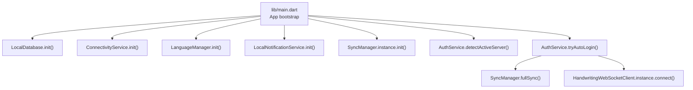
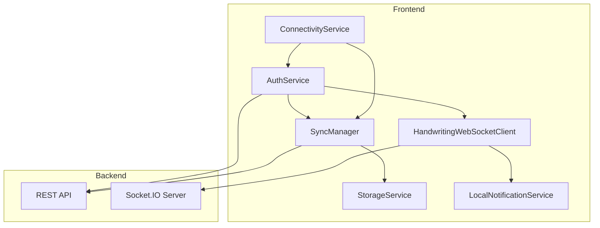
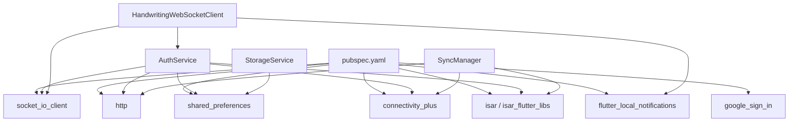

# Frontend Services API

<cite>
**Referenced Files in This Document**
- [main.dart](file://lib/main.dart)
- [auth_service.dart](file://lib/services/auth_service.dart)
- [sync_manager.dart](file://lib/services/sync_manager.dart)
- [storage_service.dart](file://lib/services/storage_service.dart)
- [handwriting_websocket_client.dart](file://lib/services/handwriting_websocket_client.dart)
- [connectivity_service.dart](file://lib/services/connectivity_service.dart)
- [local_notification_service.dart](file://lib/services/local_notification_service.dart)
- [progress_repository.dart](file://lib/repositories/progress_repository.dart)
- [pubspec.yaml](file://pubspec.yaml)
</cite>

## Table of Contents
1. [Introduction](#introduction)
2. [Project Structure](#project-structure)
3. [Core Components](#core-components)
4. [Architecture Overview](#architecture-overview)
5. [Detailed Component Analysis](#detailed-component-analysis)
6. [Dependency Analysis](#dependency-analysis)
7. [Performance Considerations](#performance-considerations)
8. [Troubleshooting Guide](#troubleshooting-guide)
9. [Conclusion](#conclusion)

## Introduction
This document provides comprehensive API documentation for the Flutter frontend services that power the hybrid offline-first learning application. It covers authentication, synchronization, handwriting recognition, WebSocket real-time communication, local notifications, and connectivity management. For each service, you will find method signatures, parameter descriptions, return value specifications, error handling patterns, practical usage examples, initialization requirements, dependency injection patterns, integration workflows, lifecycle management, state handling, and performance considerations.

## Project Structure
The frontend services are organized under the lib/services directory and integrate with repositories, data sources, and models. Initialization in the application entry point ensures that local database, connectivity, language preferences, and local notifications are ready before launching the app. Authentication detection and auto-login are performed early, followed by initializing the synchronization engine and connecting to real-time services.

**Diagram sources**
- [main.dart:21-77](file://lib/main.dart#L21-L77)

**Section sources**
- [main.dart:21-77](file://lib/main.dart#L21-L77)

## Core Components
This section documents the primary service classes and their responsibilities, public APIs, and integration points.

- Authentication Service (AuthService)
  - Purpose: Handles user authentication, token management, profile retrieval, social login, and server discovery.
  - Key methods: detectActiveServer, tryAutoLogin, login, register, googleLogin, googleMockLogin, fetchProfile, updateProfile, fetchBadges, fetchMissions, claimMissionReward, refreshAccessToken, logout.
  - State: Tracks access/refresh tokens, user profile, loading state, and active server URL.
  - Integration: Interacts with ConnectivityService, SyncManager, HandwritingWebSocketClient, and StorageService.

- Sync Manager (SyncManager)
  - Purpose: Centralized offline-first synchronization engine for progress and analytics events.
  - Key methods: init, fullSync, triggerSync, getPendingCount.
  - Status: Enumerated SyncStatus with idle, syncing, synced, error, offline.
  - Integration: Uses SyncQueueDataSource, ProgressRemoteDataSource, and ProgressRepository.

- Storage Service (StorageService)
  - Purpose: Local SharedPreferences-backed storage for user progress, points, settings, and power-ups.
  - Key methods: getters/setters for stars, XP, streak, letter/vowel/reading/number/diacritical/spelling/writing progress, vocab, test history, game scores, shop items, achievements, study time, power-ups regeneration, and caches.
  - Security: Per-user keys to prevent cross-account leakage.

- Handwriting WebSocket Client (HandwritingWebSocketClient)
  - Purpose: Real-time AI stroke analysis and character metadata retrieval via Socket.IO.
  - Key methods: connect, disconnect, analyzeStrokes, analyzeStrokesAsync, getCharacterInfo, clearCache, dispose.
  - Events: stroke_analysis_result, character_info_result, notification:new.
  - Integration: Uses AuthService for authentication and LocalNotificationService for push notifications.

- Connectivity Service (ConnectivityService)
  - Purpose: Network connectivity monitoring and change notifications.
  - Integration: Used by SyncManager and AuthService for online/offline decisions.

- Local Notification Service (LocalNotificationService)
  - Purpose: Schedule and display local notifications for reminders and real-time events.
  - Integration: Receives push notifications via WebSocket and displays them.

**Section sources**
- [auth_service.dart:15-910](file://lib/services/auth_service.dart#L15-L910)
- [sync_manager.dart:12-246](file://lib/services/sync_manager.dart#L12-L246)
- [storage_service.dart:4-558](file://lib/services/storage_service.dart#L4-L558)
- [handwriting_websocket_client.dart:176-524](file://lib/services/handwriting_websocket_client.dart#L176-L524)
- [connectivity_service.dart](file://lib/services/connectivity_service.dart)
- [local_notification_service.dart](file://lib/services/local_notification_service.dart)
- [progress_repository.dart](file://lib/repositories/progress_repository.dart)

## Architecture Overview
The frontend follows a hybrid offline-first architecture with real-time capabilities:
- Offline-first: Local Isar database and SharedPreferences-backed StorageService.
- Synchronization: SyncManager orchestrates queue-based uploads and merges with server-side data.
- Real-time: HandwritingWebSocketClient connects to backend AI analyzer and listens for notifications.
- Authentication: AuthService manages tokens, server discovery, and auto-login.
- Notifications: LocalNotificationService schedules reminders and displays push notifications received via WebSocket.

**Diagram sources**
- [auth_service.dart:15-910](file://lib/services/auth_service.dart#L15-L910)
- [sync_manager.dart:12-246](file://lib/services/sync_manager.dart#L12-L246)
- [handwriting_websocket_client.dart:176-524](file://lib/services/handwriting_websocket_client.dart#L176-L524)
- [connectivity_service.dart](file://lib/services/connectivity_service.dart)
- [local_notification_service.dart](file://lib/services/local_notification_service.dart)

## Detailed Component Analysis

### Authentication Service API
- Initialization and Discovery
  - detectActiveServer(): Asynchronously detects the active backend URL by checking manual override, saved URL, candidate URLs, and scanning the local subnet. Emits logs and updates the active base URL.
  - getManualServerUrl()/setManualServerUrl(ipOrUrl): Manage manual server URL preference with normalization.
  - currentServerUrl/get baseUrl: Provide the current active server URL for API calls.
- Authentication Methods
  - tryAutoLogin(): Attempts to restore session from local storage, validates reachability, refreshes tokens if needed, triggers full sync, and connects to WebSocket.
  - login(email, password): Submits credentials to backend, stores tokens and profile, syncs to StorageService, triggers full sync, and connects to WebSocket.
  - register(name, email, password): Registers a new user and returns success or error message.
  - googleLogin(): Performs native mobile Google sign-in flow, exchanges idToken for backend tokens, and mirrors the login process.
  - googleMockLogin(email?, name?): Simulates Google login for development/testing without SHA-1 or client ID constraints.
  - logout(): Reports logout to backend (best-effort), clears tokens, disconnects WebSocket, clears StorageService and local Isar database, and notifies listeners.
- Profile Management
  - fetchProfile(timeout?): Retrieves user profile and rank, updates local SharedPreferences, and syncs to StorageService.
  - updateProfile(name?, avatar?): Updates profile, optionally uploads avatar to Cloudinary, and refreshes profile.
  - fetchBadges()/fetchMissions(): Loads badges and missions from backend.
  - claimMissionReward(missionId): Claims rewards and refreshes profile.
- Token Management
  - refreshAccessToken(): Refreshes access token using refresh token and updates local storage.
- Utilities
  - getOptimizedImageUrl(url, width): Optimizes Cloudinary image URLs.
  - _ping(url, timeout)/_firstResponding(urls, timeout)/_scanLocalSubnet(): Internal network probing and scanning routines.

Usage example (conceptual):
- Initialize services in main, then call AuthService.detectActiveServer() and AuthService().tryAutoLogin() before building the UI.
- On login, call AuthService().login() and handle returned Map with success flag and message.
- On logout, call AuthService().logout() to clean up tokens and local data.

Error handling patterns:
- HTTP timeouts configured per request to avoid UI blocking.
- Developer errors (e.g., platform exceptions) are detected and returned with flags to guide UI behavior.
- Offline fallback uses cached profile when reachable but token invalid or server unreachable.

Lifecycle and state:
- Maintains internal loading state and exposes isAuthenticated, userProfile, and accessToken getters.
- Emits ChangeNotifier events to update UI components.

**Section sources**
- [auth_service.dart:15-910](file://lib/services/auth_service.dart#L15-L910)

### Sync Manager API
- Initialization
  - init(): Subscribes to connectivity changes, starts periodic sync timer, and triggers initial sync if online.
- Operations
  - fullSync(): Processes pending queue, performs bidirectional sync via ProgressRepository, refreshes profile, and updates status.
  - triggerSync(): Manually triggers queue processing if online.
  - getPendingCount(): Returns number of pending sync items.
- Processing Logic
  - _processQueue(): Iterates pending items, retries failed items, applies exponential backoff, marks items as synced/failed, removes processed items, and refreshes profile on success.
  - _processItem(item): Dispatches actions (complete_lesson, unlock_lesson, sync_progress, analytics_event) to remote data source.
- Status Monitoring
  - onSyncStatusChanged: Stream of SyncStatus updates for UI binding.

Usage example (conceptual):
- Call SyncManager.instance.init() after LocalDatabase and ConnectivityService are ready.
- Trigger manual sync via triggerSync() or rely on automatic periodic sync.
- Subscribe to onSyncStatusChanged to reflect sync state in UI.

Error handling patterns:
- Graceful handling of connectivity loss mid-sync, exponential backoff on failures, and silent removal of unknown actions.

Lifecycle and state:
- Broadcast stream for sync status, guarded by _isSyncing flag to prevent concurrent processing.

**Section sources**
- [sync_manager.dart:12-246](file://lib/services/sync_manager.dart#L12-L246)

### Storage Service API
- User Progress and Stats
  - Stars and XP: getStars(), setStars(val), addStars(amount), spendStars(amount), getXp(), setXp(val), addXp(amount).
  - Streak: getStreak(), setStreak(val), updateStreak().
  - Letter/Vowel/Reading/Number/Diacritical/Spelling/Writing progress: get*/save*Progress(index, stars).
  - Vocabulary: getLearnedVocab(), markVocabLearned(wordKhmer).
  - Test History: getTestHistory(), addTestResult(correct, total, difficulty, stars).
  - Game Scores: getGameScores(), saveGameScore(gameName, score).
  - Achievements: getUnlockedAchievements(), unlockAchievement(id).
- Shop and Settings
  - Purchased Items: getPurchasedItems(), addPurchasedItem(itemKey).
  - Settings: getSoundEnabled()/setSoundEnabled(), getLanguage()/setLanguage(), getTtsSpeed()/setTtsSpeed(), getHapticsEnabled()/setHapticsEnabled(), getOfflineEnabled()/setOfflineEnabled().
- Profile
  - Username: getUsername(), setUsername(name).
  - Avatar: getAvatarIndex()/setAvatarIndex(), getAvatarUrl()/setAvatarUrl().
- Study Time
  - getTotalStudyMinutes(), addStudyMinutes(minutes), getDailyStudyMinutes().
- Power-ups Regeneration
  - Counts: getHintsCount(), getTimePowerupsCount(), getLivesPowerupsCount(), getDoubleScorePowerupsCount().
  - Usage: useHint(), useTimePowerup(), useLivesPowerup(), useDoubleScorePowerup().
  - Cooldowns: getHintsCooldownRemaining(), getTimePowerupsCooldownRemaining(), getLivesPowerupsCooldownRemaining(), getDoubleScoreCooldownRemaining().
- Caches and Clear
  - getCachedLessons(type), saveCachedLessons(type, jsonStr).
  - clearAll(), clearProgress(), clearOnlyLessonProgress().

Usage example (conceptual):
- After completing lessons, call save*Progress() to persist results.
- Before sync, use clearOnlyLessonProgress() to remove local-only keys to avoid conflicts.
- For UI, bind to getters and update via setters.

Security and isolation:
- Per-user keys are generated using the current user’s profile ID to prevent cross-account leakage.

**Section sources**
- [storage_service.dart:4-558](file://lib/services/storage_service.dart#L4-L558)

### Handwriting WebSocket Client API
- Connection Lifecycle
  - connect(): Establishes Socket.IO connection using AuthService token, sets up event handlers, and manages reconnection.
  - disconnect(): Terminates connection and disposes resources.
  - dispose(): Cleans up streams and caches.
- Stroke Analysis
  - analyzeStrokes(strokes, targetCharacter): Sends raw stroke data with timestamps and waits for analysis result with timeout.
  - analyzeStrokesAsync(strokes, targetCharacter): Fire-and-forget emission for asynchronous UI updates.
- Character Information
  - getCharacterInfo(character): Requests metadata (total strokes, difficulty, hint, type) with caching and acknowledgment.
  - clearCache(): Clears metadata cache.
- Events and Streams
  - resultStream: Broadcast stream of StrokeAnalysisResult for UI consumption.
  - notification:new: Receives push notifications and displays via LocalNotificationService.
- Data Models
  - StrokeAnalysisResult: success, similarityScore, shapeScore, directionScore, strokeCountScore, feedback, errorStrokeIndex, errors, stars, passed, xpEarned.
  - CharacterInfo: character, totalStrokes, difficulty, hint, type.

Usage example (conceptual):
- Call connect() after successful authentication.
- On writing completion, call analyzeStrokes() and listen to resultStream for UI feedback.
- Use getCharacterInfo() to pre-fetch character metadata for filtering.

Error handling patterns:
- Automatic token refresh on authentication errors, timeouts for analysis and info requests, and graceful handling of parse errors.

Lifecycle and state:
- Tracks connection state, pending analysis completers, and character info cache.

**Section sources**
- [handwriting_websocket_client.dart:176-524](file://lib/services/handwriting_websocket_client.dart#L176-L524)

### Connectivity Service API
- Purpose: Monitor network connectivity and emit changes.
- Typical usage: Subscribe to onConnectivityChanged stream to drive SyncManager and AuthService decisions.

Integration:
- Used by SyncManager for online/offline behavior and by AuthService for server reachability checks.

**Section sources**
- [connectivity_service.dart](file://lib/services/connectivity_service.dart)

### Local Notification Service API
- Purpose: Initialize and schedule daily reminders, display notifications, and handle notification interactions.
- Integration: Receives push notifications via WebSocket and displays them.

**Section sources**
- [local_notification_service.dart](file://lib/services/local_notification_service.dart)

## Dependency Analysis
External dependencies relevant to services:
- http: REST API calls for authentication and profile management.
- socket_io_client: Real-time communication for handwriting analysis and notifications.
- shared_preferences: Local storage for tokens, profile, and progress.
- connectivity_plus: Network connectivity monitoring.
- isar/isar_flutter_libs: Local database for offline-first architecture.
- google_sign_in: Native Google sign-in flow.
- flutter_secure_storage: Secure token storage (not used directly in services but available).
- flutter_local_notifications: Local notification scheduling and display.

**Diagram sources**
- [pubspec.yaml:15-48](file://pubspec.yaml#L15-L48)
- [auth_service.dart:1-12](file://lib/services/auth_service.dart#L1-L12)
- [sync_manager.dart:1-10](file://lib/services/sync_manager.dart#L1-L10)
- [handwriting_websocket_client.dart:32-38](file://lib/services/handwriting_websocket_client.dart#L32-L38)

**Section sources**
- [pubspec.yaml:15-48](file://pubspec.yaml#L15-L48)

## Performance Considerations
- Network timeouts: HTTP requests use bounded timeouts to prevent UI stalls during slow networks or misconfigured servers.
- Background server discovery: Subnet scanning runs in the background to avoid blocking startup.
- Exponential backoff: SyncManager retries failed sync items with increasing delays to reduce server load.
- Optimistic UI updates: AuthService updates stars/XP locally while awaiting server confirmation to improve perceived responsiveness.
- Image optimization: Cloudinary URL optimization reduces bandwidth for avatar and media assets.
- Streaming notifications: WebSocket result stream avoids polling and enables immediate feedback.
- Local caching: Character info cache minimizes redundant metadata requests.

## Troubleshooting Guide
Common issues and resolutions:
- Server unreachable or wrong IP:
  - Use AuthService.setManualServerUrl() to override and detectActiveServer() to re-scan.
  - Verify network connectivity via ConnectivityService and retry.
- Authentication errors:
  - Call refreshAccessToken() to renew tokens; if unsuccessful, prompt user to log in again.
  - For WebSocket, automatic token refresh is attempted; if still failing, reconnect after successful refresh.
- Sync stuck or failing:
  - Check connectivity; SyncManager will retry with exponential backoff.
  - Inspect pending queue via getPendingCount() and review SyncStatus.
- WebSocket not receiving results:
  - Ensure connect() is called after authentication; verify token validity.
  - Confirm backend Socket.IO endpoint availability and correct token format.
- Local storage conflicts:
  - Use clearOnlyLessonProgress() to reset lesson-specific keys before full sync.
  - Ensure per-user keys are active by verifying current userProfile presence.

**Section sources**
- [auth_service.dart:780-860](file://lib/services/auth_service.dart#L780-L860)
- [sync_manager.dart:76-155](file://lib/services/sync_manager.dart#L76-L155)
- [handwriting_websocket_client.dart:214-354](file://lib/services/handwriting_websocket_client.dart#L214-L354)

## Conclusion
The frontend services form a robust, offline-first ecosystem with strong real-time capabilities. Authentication, synchronization, storage, and real-time feedback are cleanly separated and integrated through well-defined APIs. By following the initialization sequences, error handling patterns, and lifecycle guidelines outlined above, developers can reliably extend and maintain the service layer while ensuring a smooth user experience across diverse network conditions.