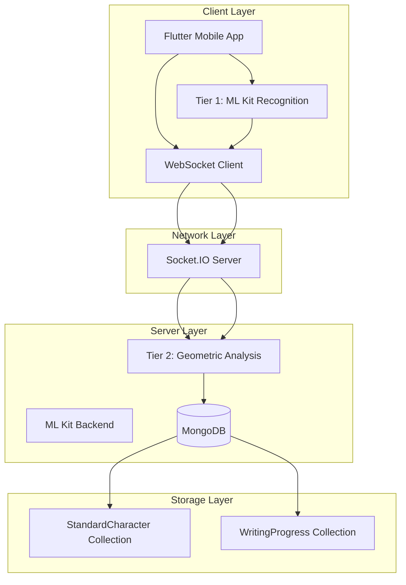
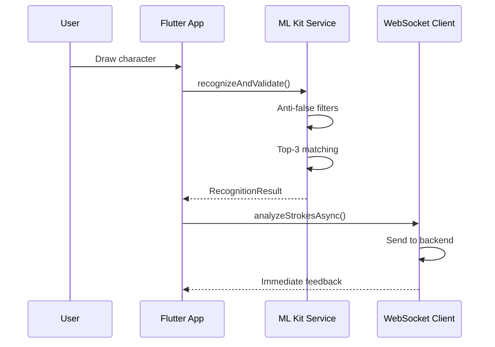
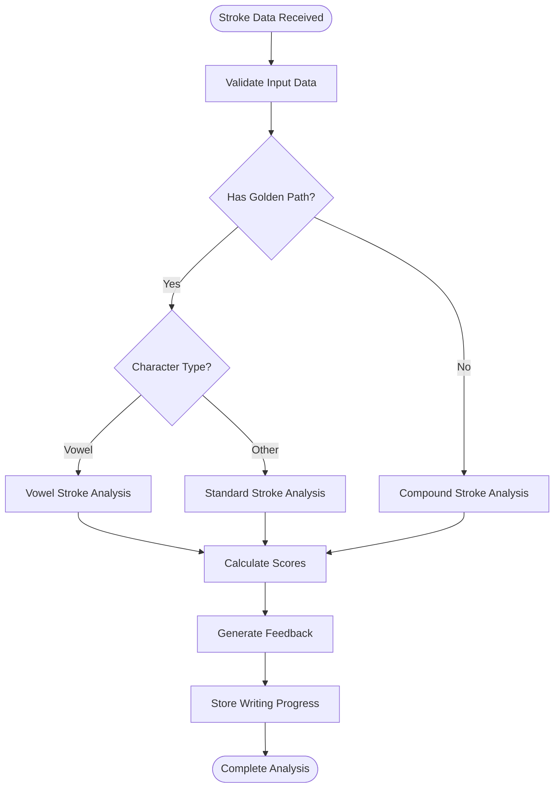
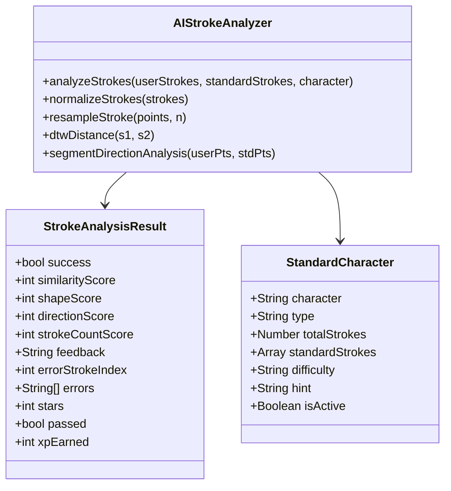
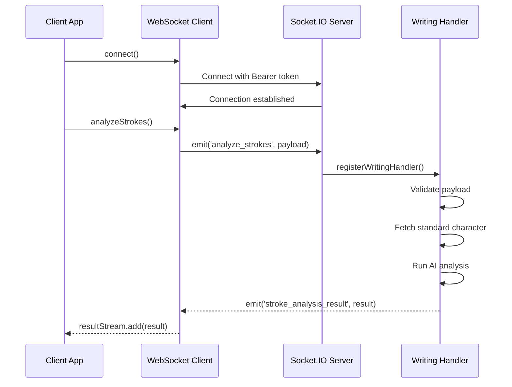
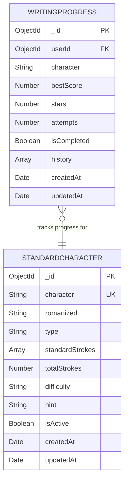

# Handwriting Recognition API

<cite>
**Referenced Files in This Document**
- [khmer_handwriting_service.dart](file://lib/services/khmer_handwriting_service.dart)
- [handwriting_websocket_client.dart](file://lib/services/handwriting_websocket_client.dart)
- [aiStrokeAnalyzer.js](file://backend/src/services/aiStrokeAnalyzer.js)
- [aiCompoundStrokeAnalyzer.js](file://backend/src/services/aiCompoundStrokeAnalyzer.js)
- [aiVowelStrokeAnalyzer.js](file://backend/src/services/aiVowelStrokeAnalyzer.js)
- [writingHandler.js](file://backend/src/sockets/writingHandler.js)
- [writingRoutes.js](file://backend/src/routes/writingRoutes.js)
- [StandardCharacter.js](file://backend/src/models/StandardCharacter.js)
- [WritingProgress.js](file://backend/src/models/WritingProgress.js)
- [index.js](file://backend/src/sockets/index.js)
</cite>

## Table of Contents
1. [Introduction](#introduction)
2. [System Architecture](#system-architecture)
3. [Two-Tier Recognition Pipeline](#two-tier-recognition-pipeline)
4. [ML Kit Integration](#ml-kit-integration)
5. [AI Analysis Services](#ai-analysis-services)
6. [WebSocket Communication](#websocket-communication)
7. [Real-time Feedback and Progress Tracking](#real-time-feedback-and-progress-tracking)
8. [Offline Recognition Capabilities](#offline-recognition-capabilities)
9. [Performance Optimization](#performance-optimization)
10. [API Reference](#api-reference)
11. [Troubleshooting Guide](#troubleshooting-guide)
12. [Conclusion](#conclusion)

## Introduction

The Handwriting Recognition Service provides a comprehensive two-tier recognition system for Khmer script handwriting analysis. This system combines on-device machine learning with cloud-based geometric analysis to deliver accurate character recognition, real-time feedback, and detailed stroke correction guidance for children learning to write.

The service operates through a hybrid approach where immediate feedback is provided by on-device ML Kit recognition, followed by detailed geometric analysis performed asynchronously in the cloud. This dual-layer system ensures both responsiveness and precision in handwriting evaluation.

## System Architecture

The Handwriting Recognition Service follows a distributed architecture with clear separation of concerns between client-side processing and server-side analysis:

**Diagram sources**
- [khmer_handwriting_service.dart:1-514](file://lib/services/khmer_handwriting_service.dart#L1-L514)
- [handwriting_websocket_client.dart:1-524](file://lib/services/handwriting_websocket_client.dart#L1-L524)
- [writingHandler.js:1-366](file://backend/src/sockets/writingHandler.js#L1-L366)

**Section sources**
- [khmer_handwriting_service.dart:1-50](file://lib/services/khmer_handwriting_service.dart#L1-L50)
- [handwriting_websocket_client.dart:1-30](file://lib/services/handwriting_websocket_client.dart#L1-L30)

## Two-Tier Recognition Pipeline

The system implements a sophisticated two-tier recognition pipeline designed to provide both immediate feedback and detailed analysis:

### Tier 1: On-Device ML Kit Recognition

The first tier leverages Google ML Kit's Digital Ink Recognition for instant character identification:

**Diagram sources**
- [khmer_handwriting_service.dart:250-490](file://lib/services/khmer_handwriting_service.dart#L250-L490)
- [handwriting_websocket_client.dart:438-460](file://lib/services/handwriting_websocket_client.dart#L438-L460)

### Tier 2: Cloud-Based Geometric Analysis

The second tier performs detailed stroke analysis using advanced geometric algorithms:

**Diagram sources**
- [writingHandler.js:142-288](file://backend/src/sockets/writingHandler.js#L142-L288)
- [aiStrokeAnalyzer.js:627-752](file://backend/src/services/aiStrokeAnalyzer.js#L627-L752)

**Section sources**
- [khmer_handwriting_service.dart:250-490](file://lib/services/khmer_handwriting_service.dart#L250-L490)
- [writingHandler.js:132-288](file://backend/src/sockets/writingHandler.js#L132-L288)

## ML Kit Integration

The system integrates Google ML Kit Digital Ink Recognition for on-device character recognition:

### Model Management

The service handles automatic model lifecycle management:

- **Automatic Download**: Downloads Khmer language model on first use
- **Cache Verification**: Checks for existing cached models
- **Retry Mechanism**: Implements fail-safe retry logic for model downloads
- **Error Handling**: Graceful degradation when models are unavailable

### Recognition Pipeline

The ML Kit integration follows a multi-stage validation process:

1. **Stroke Count Validation**: Filters out drawings with excessive stroke count deviations
2. **Confidence Thresholding**: Validates recognition confidence scores
3. **Top-3 Matching**: Accepts target character if found in top 3 candidates
4. **Lesson Context Filtering**: Prevents acceptance of characters from different lessons

**Section sources**
- [khmer_handwriting_service.dart:196-249](file://lib/services/khmer_handwriting_service.dart#L196-L249)
- [khmer_handwriting_service.dart:304-490](file://lib/services/khmer_handwriting_service.dart#L304-L490)

## AI Analysis Services

The backend provides three specialized AI analyzers for different character types:

### Standard Stroke Analyzer

Processes individual characters with predefined golden paths:

**Diagram sources**
- [handwriting_websocket_client.dart:44-133](file://lib/services/handwriting_websocket_client.dart#L44-L133)
- [StandardCharacter.js:62-164](file://backend/src/models/StandardCharacter.js#L62-L164)
- [aiStrokeAnalyzer.js:592-752](file://backend/src/services/aiStrokeAnalyzer.js#L592-L752)

### Compound Stroke Analyzer

Handles complex characters composed of multiple components:

- **Component Analysis**: Breaks down compound characters into individual components
- **Stroke Count Validation**: Validates stroke counts against component expectations
- **Geometric Heuristics**: Applies shape, direction, and smoothness analysis
- **Template Matching**: Uses component standard strokes for precise matching

### Vowel Stroke Analyzer

Optimized for Khmer vowel marks with specialized algorithms:

- **Reduced Resampling**: Uses 24-point resampling for vowel precision
- **Path Length Penalty**: Implements specific penalties for vowel length variations
- **Enhanced Direction Analysis**: Improved sensitivity for vowel stroke directions
- **Stroke Count Strictness**: Stricter validation for vowel stroke counts

**Section sources**
- [aiStrokeAnalyzer.js:1-800](file://backend/src/services/aiStrokeAnalyzer.js#L1-L800)
- [aiCompoundStrokeAnalyzer.js:1-695](file://backend/src/services/aiCompoundStrokeAnalyzer.js#L1-L695)
- [aiVowelStrokeAnalyzer.js:1-584](file://backend/src/services/aiVowelStrokeAnalyzer.js#L1-L584)

## WebSocket Communication

The system uses Socket.IO for real-time communication between client and server:

### Connection Management

The WebSocket client handles connection lifecycle and authentication:

- **Token-based Authentication**: Uses JWT tokens for secure connections
- **Automatic Reconnection**: Implements robust reconnection logic
- **Token Refresh**: Handles automatic token renewal
- **Event Broadcasting**: Manages real-time event streams

### Message Protocol

Communication follows a structured protocol:

**Diagram sources**
- [handwriting_websocket_client.dart:214-354](file://lib/services/handwriting_websocket_client.dart#L214-L354)
- [writingHandler.js:142-288](file://backend/src/sockets/writingHandler.js#L142-L288)

### Event Types

The system supports multiple event types:

- **analyze_strokes**: Main recognition request
- **stroke_analysis_result**: Analysis completion notification
- **get_character_info**: Character metadata request
- **character_info_result**: Character metadata response
- **notification:new**: Real-time notifications

**Section sources**
- [handwriting_websocket_client.dart:178-524](file://lib/services/handwriting_websocket_client.dart#L178-L524)
- [writingHandler.js:132-366](file://backend/src/sockets/writingHandler.js#L132-L366)

## Real-time Feedback and Progress Tracking

The system provides comprehensive feedback mechanisms and progress tracking:

### Feedback Generation

The AI analyzers generate detailed, child-friendly feedback:

- **Multi-level Analysis**: Shape, direction, and stroke count scoring
- **Issue Prioritization**: Sorts problems by severity and impact
- **Specific Guidance**: Identifies problematic strokes and provides correction tips
- **Adaptive Language**: Uses Vietnamese language appropriate for children

### Progress Tracking

Writing progress is tracked through MongoDB collections:

**Diagram sources**
- [WritingProgress.js:89-253](file://backend/src/models/WritingProgress.js#L89-L253)
- [StandardCharacter.js:62-197](file://backend/src/models/StandardCharacter.js#L62-L197)

### Gamification Elements

The system incorporates gamification for enhanced learning:

- **Star System**: 0-3 star rating based on performance
- **XP Rewards**: Experience points for successful attempts
- **Completion Tracking**: Mastery indicators for characters
- **Progress Analytics**: Historical performance trends

**Section sources**
- [writingHandler.js:233-268](file://backend/src/sockets/writingHandler.js#L233-L268)
- [WritingProgress.js:194-245](file://backend/src/models/WritingProgress.js#L194-L245)

## Offline Recognition Capabilities

The system provides robust offline functionality:

### On-Device Processing

- **Local ML Kit**: Operates entirely on device without network dependency
- **Immediate Feedback**: Provides instant recognition results
- **Model Caching**: Persists downloaded models for offline use
- **Graceful Degradation**: Continues operation with reduced functionality when offline

### Data Persistence

- **Local Storage**: Maintains user preferences and settings
- **Cache Management**: Efficiently manages character metadata locally
- **Synchronization**: Automatically synchronizes progress when connectivity resumes
- **Conflict Resolution**: Handles concurrent modifications appropriately

**Section sources**
- [khmer_handwriting_service.dart:196-249](file://lib/services/khmer_handwriting_service.dart#L196-L249)
- [handwriting_websocket_client.dart:466-515](file://lib/services/handwriting_websocket_client.dart#L466-L515)

## Performance Optimization

The system implements several optimization strategies:

### Client-Side Optimizations

- **Lazy Loading**: Loads ML Kit models only when needed
- **Efficient Data Structures**: Uses optimized stroke data representation
- **Memory Management**: Proper cleanup of recognizer instances
- **Background Processing**: Performs analysis without blocking UI

### Server-Side Optimizations

- **Database Indexing**: Optimized queries for character lookup
- **Result Caching**: Caches frequently accessed character metadata
- **Asynchronous Processing**: Non-blocking analysis operations
- **Resource Pooling**: Efficient management of AI analyzer instances

### Algorithmic Optimizations

- **Resampling Strategies**: Adaptive point sampling based on character complexity
- **Early Termination**: Stops analysis when sufficient confidence is achieved
- **Parallel Processing**: Concurrent analysis of multiple strokes
- **Approximation Algorithms**: Uses efficient approximations for complex calculations

**Section sources**
- [aiStrokeAnalyzer.js:66-82](file://backend/src/services/aiStrokeAnalyzer.js#L66-L82)
- [aiCompoundStrokeAnalyzer.js:23-30](file://backend/src/services/aiCompoundStrokeAnalyzer.js#L23-L30)
- [aiVowelStrokeAnalyzer.js:19-26](file://backend/src/services/aiVowelStrokeAnalyzer.js#L19-L26)

## API Reference

### WebSocket Events

#### Client to Server

| Event | Description | Payload | Response |
|-------|-------------|---------|----------|
| `analyze_strokes` | Request stroke analysis | `{ targetCharacter: string, userStrokeData: StrokePoint[][] }` | `StrokeAnalysisResult` |
| `get_character_info` | Request character metadata | `{ character: string }` | `CharacterInfo` |

#### Server to Client

| Event | Description | Payload |
|-------|-------------|---------|
| `stroke_analysis_result` | Analysis completion notification | `StrokeAnalysisResult` |
| `character_info_result` | Character metadata response | `CharacterInfo` |
| `notification:new` | Real-time notification | `NotificationPayload` |

### REST API Endpoints

#### Character Data Endpoints

| Endpoint | Method | Description | Authentication |
|----------|--------|-------------|----------------|
| `/api/writing/characters` | GET | List all active standard characters | Optional |
| `/api/writing/characters/:character` | GET | Get character metadata | Optional |
| `/api/writing/characters/:character/strokes` | GET | Get full golden path data | Optional |

#### Progress Tracking Endpoints

| Endpoint | Method | Description | Authentication |
|----------|--------|-------------|----------------|
| `/api/writing/progress` | GET | Get user's writing progress | Required |
| `/api/writing/progress/:character` | GET | Get progress for specific character | Required |

### Data Models

#### StrokePoint

| Field | Type | Description |
|-------|------|-------------|
| `x` | number | X coordinate (pixels) |
| `y` | number | Y coordinate (pixels) |
| `t` | number | Timestamp (milliseconds) |

#### StrokeAnalysisResult

| Field | Type | Description |
|-------|------|-------------|
| `success` | boolean | Analysis completion status |
| `similarityScore` | number | Overall similarity (0-100) |
| `shapeScore` | number | Shape similarity (0-100) |
| `directionScore` | number | Direction accuracy (0-100) |
| `strokeCountScore` | number | Stroke count accuracy (0-100) |
| `feedback` | string | Child-friendly feedback message |
| `errorStrokeIndex` | number | Problematic stroke index (-1 if none) |
| `errors` | string[] | List of detected issues |
| `stars` | number | Star rating (0-3) |
| `passed` | boolean | Pass/fail determination |
| `xpEarned` | number | Experience points earned |

**Section sources**
- [writingRoutes.js:40-244](file://backend/src/routes/writingRoutes.js#L40-L244)
- [handwriting_websocket_client.dart:44-133](file://lib/services/handwriting_websocket_client.dart#L44-L133)

## Troubleshooting Guide

### Common Issues and Solutions

#### ML Kit Model Issues

**Problem**: Model download failures
**Solution**: 
- Verify network connectivity
- Check storage permissions
- Review retry logs for specific error codes
- Ensure sufficient disk space for model caching

#### WebSocket Connection Problems

**Problem**: Connection timeouts or authentication failures
**Solution**:
- Verify JWT token validity and expiration
- Check server availability and CORS configuration
- Review network firewall settings
- Monitor token refresh mechanisms

#### Recognition Accuracy Issues

**Problem**: Low recognition confidence or incorrect results
**Solution**:
- Ensure proper stroke quality and minimum point count
- Verify target character selection matches lesson content
- Check for adequate lighting and stylus pressure
- Consider character complexity and teaching method

#### Performance Issues

**Problem**: Slow analysis or UI blocking
**Solution**:
- Optimize stroke data preprocessing
- Implement proper async processing
- Monitor memory usage and garbage collection
- Consider hardware acceleration options

**Section sources**
- [khmer_handwriting_service.dart:201-249](file://lib/services/khmer_handwriting_service.dart#L201-L249)
- [handwriting_websocket_client.dart:263-297](file://lib/services/handwriting_websocket_client.dart#L263-L297)

## Conclusion

The Handwriting Recognition Service provides a comprehensive solution for Khmer script handwriting education through its innovative two-tier recognition system. By combining on-device ML Kit processing with cloud-based geometric analysis, the system delivers both immediate feedback and detailed correction guidance essential for effective learning.

The modular architecture ensures scalability and maintainability, while the real-time WebSocket communication enables responsive user experiences. The gamification elements and progress tracking systems enhance motivation and provide valuable learning insights.

Key strengths of the system include its robust error handling, performance optimizations, and comprehensive feedback mechanisms. The integration of multiple AI analyzers for different character types demonstrates the system's adaptability to various learning scenarios.

Future enhancements could include expanded language support, additional character types, and advanced machine learning models for improved accuracy and personalized learning experiences.