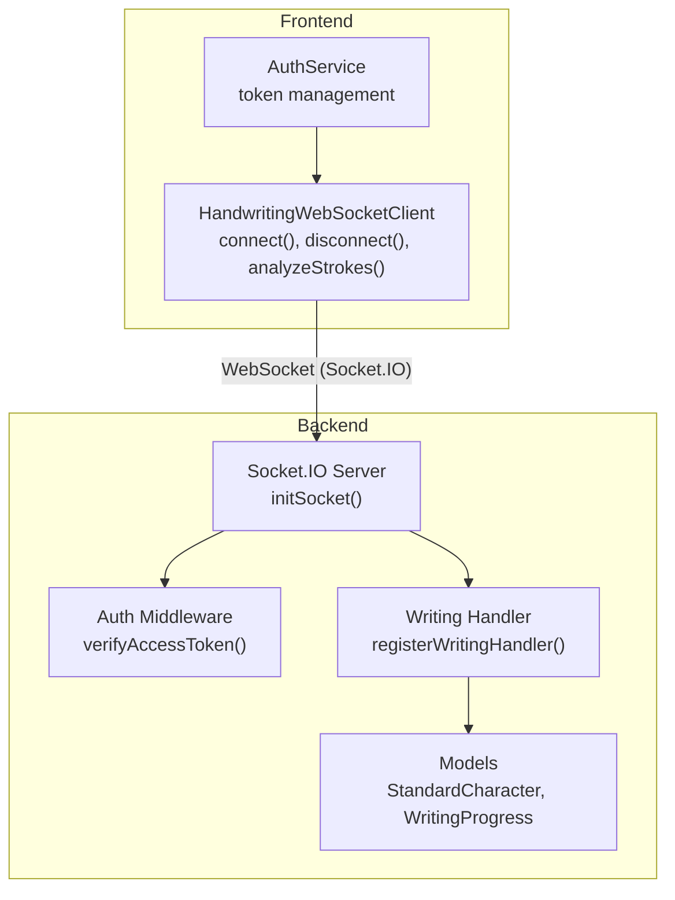
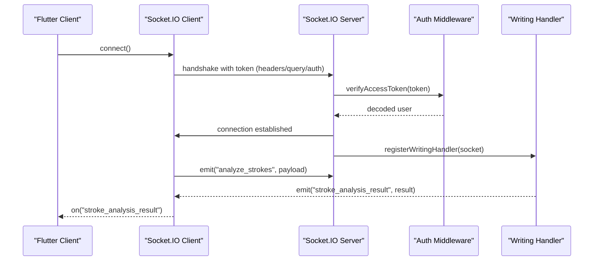
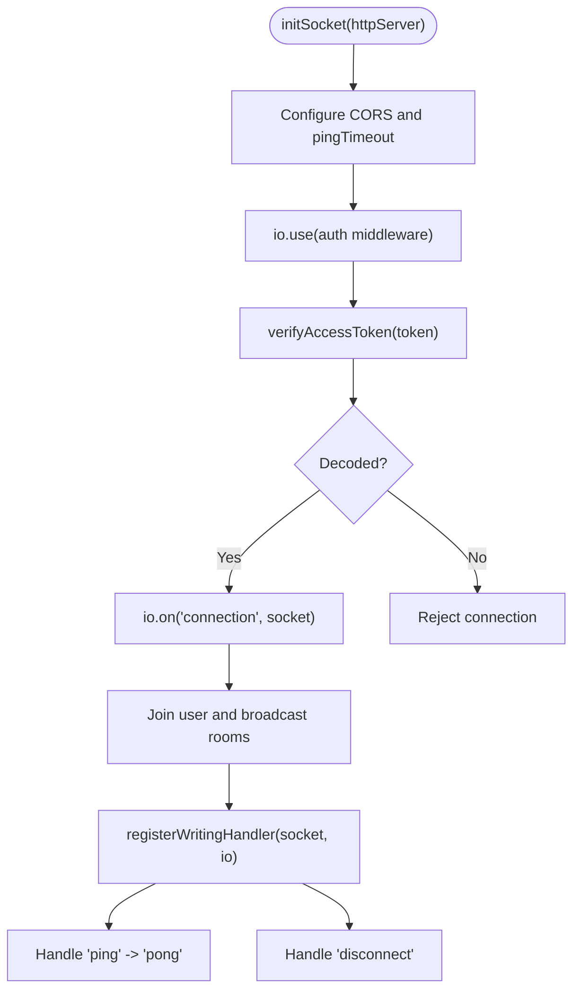
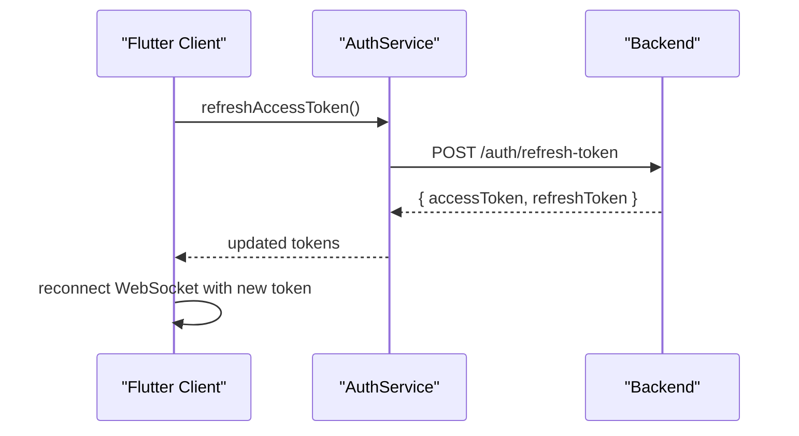
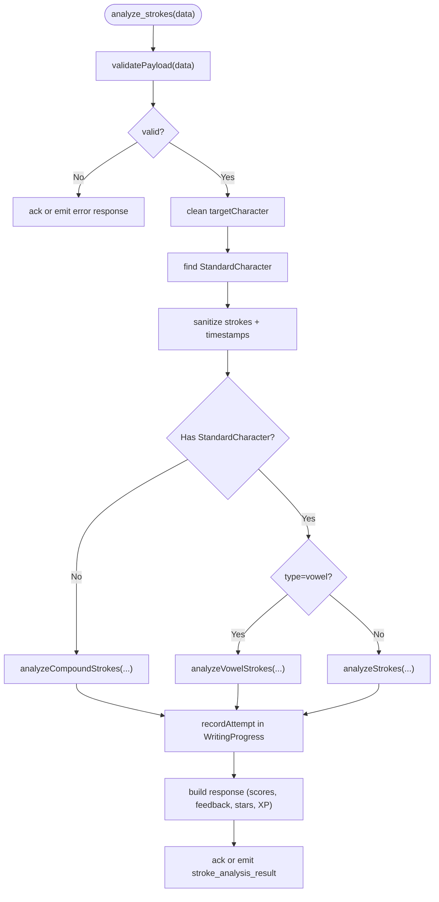
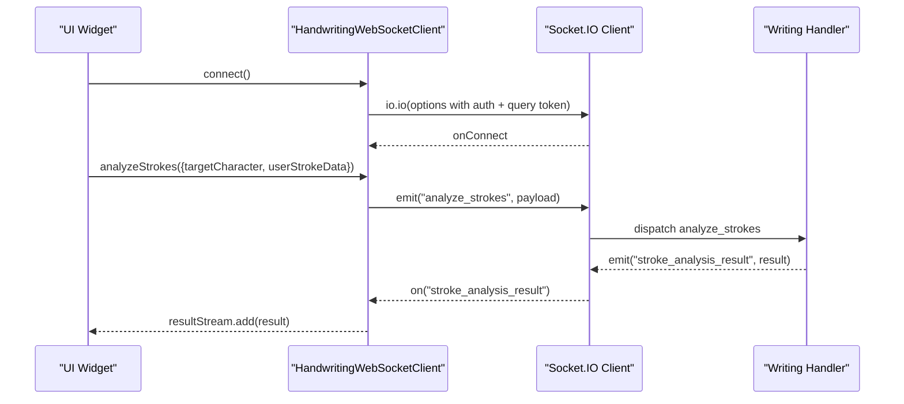
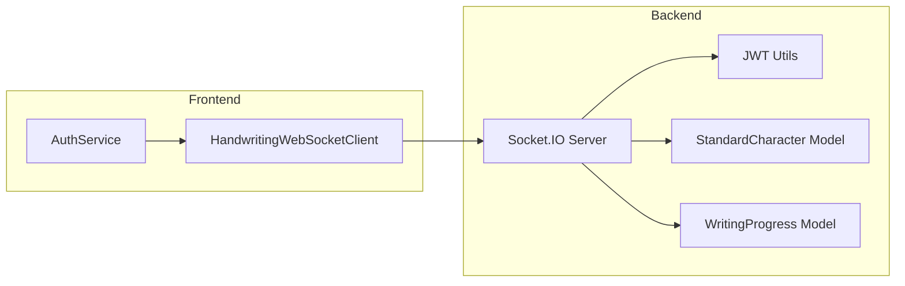

# Real-time Communication API

<cite>
**Referenced Files in This Document**
- [index.js](file://backend/src/sockets/index.js)
- [writingHandler.js](file://backend/src/sockets/writingHandler.js)
- [token.js](file://backend/src/utils/token.js)
- [index.js](file://backend/src/constants/index.js)
- [handwriting_websocket_client.dart](file://lib/services/handwriting_websocket_client.dart)
- [auth_service.dart](file://lib/services/auth_service.dart)
- [WritingProgress.js](file://backend/src/models/WritingProgress.js)
- [StandardCharacter.js](file://backend/src/models/StandardCharacter.js)
</cite>

## Table of Contents
1. [Introduction](#introduction)
2. [Project Structure](#project-structure)
3. [Core Components](#core-components)
4. [Architecture Overview](#architecture-overview)
5. [Detailed Component Analysis](#detailed-component-analysis)
6. [Dependency Analysis](#dependency-analysis)
7. [Performance Considerations](#performance-considerations)
8. [Troubleshooting Guide](#troubleshooting-guide)
9. [Conclusion](#conclusion)

## Introduction
This document provides comprehensive API documentation for the Real-time Communication Service powering handwriting recognition feedback. It covers WebSocket client lifecycle management, message handling, event processing, authentication, and reconnection strategies. It also documents handshake protocols, message serialization formats, event types for handwriting analysis, and real-time progress updates. Practical examples demonstrate establishing connections, handling disconnections, and registering custom event handlers. Performance considerations, error recovery, and reliability strategies for unstable networks are included.

## Project Structure
The real-time communication system spans two layers:
- Backend (Node.js + Socket.IO): Authentication middleware, event routing, and AI-driven stroke analysis.
- Frontend (Flutter): WebSocket client managing connection lifecycle, event listeners, and UI updates.

**Diagram sources**
- [index.js:23-91](file://backend/src/sockets/index.js#L23-L91)
- [writingHandler.js:126-338](file://backend/src/sockets/writingHandler.js#L126-L338)
- [token.js:57-59](file://backend/src/utils/token.js#L57-L59)
- [handwriting_websocket_client.dart:210-354](file://lib/services/handwriting_websocket_client.dart#L210-L354)
- [auth_service.dart:780-800](file://lib/services/auth_service.dart#L780-L800)

**Section sources**
- [index.js:1-134](file://backend/src/sockets/index.js#L1-L134)
- [handwriting_websocket_client.dart:1-524](file://lib/services/handwriting_websocket_client.dart#L1-L524)

## Core Components
- Backend Socket.IO server initialization and authentication middleware.
- Domain-specific writing handler for stroke analysis and character metadata queries.
- Frontend WebSocket client with connection management, event listeners, and request/response handling.
- Token utilities for JWT verification and refresh.
- Data models for standard character golden paths and writing progress persistence.

Key responsibilities:
- Authentication: JWT verification during handshake via headers, query parameters, or auth object.
- Room management: User-specific and broadcast rooms for targeted notifications.
- Event routing: Writing analysis and lightweight character info queries.
- Reliability: Automatic reconnection, token refresh on auth failures, timeouts, and pending request management.

**Section sources**
- [index.js:23-91](file://backend/src/sockets/index.js#L23-L91)
- [writingHandler.js:126-338](file://backend/src/sockets/writingHandler.js#L126-L338)
- [token.js:57-59](file://backend/src/utils/token.js#L57-L59)
- [handwriting_websocket_client.dart:210-354](file://lib/services/handwriting_websocket_client.dart#L210-L354)

## Architecture Overview
The system uses Socket.IO for bidirectional real-time communication. The frontend connects with an authentication token and listens for real-time events. The backend authenticates the token, joins rooms, registers domain handlers, and responds to client events.

**Diagram sources**
- [index.js:34-62](file://backend/src/sockets/index.js#L34-L62)
- [writingHandler.js:142-288](file://backend/src/sockets/writingHandler.js#L142-L288)
- [handwriting_websocket_client.dart:417-436](file://lib/services/handwriting_websocket_client.dart#L417-L436)

## Detailed Component Analysis

### Backend Socket.IO Server
- Initialization: Configures CORS, ping timeout, and authentication middleware.
- Authentication: Accepts token from headers, query string, or auth object; supports "Bearer" prefix trimming.
- Rooms: Joins user-specific and broadcast rooms upon connection.
- Handlers: Registers writing handler and exposes ping/pong for diagnostics.

**Diagram sources**
- [index.js:23-91](file://backend/src/sockets/index.js#L23-L91)

**Section sources**
- [index.js:23-91](file://backend/src/sockets/index.js#L23-L91)

### Authentication and Token Utilities
- Token verification: Validates JWT using secret from environment.
- Token extraction: Supports Authorization header and cookies for HTTP endpoints; handshake uses auth object and query param for Socket.IO.
- Refresh flow: Frontend triggers refresh and reconnects automatically on auth errors.

**Diagram sources**
- [token.js:57-68](file://backend/src/utils/token.js#L57-L68)
- [auth_service.dart:780-800](file://lib/services/auth_service.dart#L780-L800)
- [handwriting_websocket_client.dart:283-295](file://lib/services/handwriting_websocket_client.dart#L283-L295)

**Section sources**
- [token.js:57-68](file://backend/src/utils/token.js#L57-L68)
- [auth_service.dart:780-800](file://lib/services/auth_service.dart#L780-L800)
- [handwriting_websocket_client.dart:283-295](file://lib/services/handwriting_websocket_client.dart#L283-L295)

### Writing Handler (Stroke Analysis)
- Event: analyze_strokes
  - Validates payload shape and point data.
  - Normalizes strokes and timestamps.
  - Routes to appropriate analyzer (standard, vowel, or compound).
  - Persists result to WritingProgress.
  - Emits structured result to client.
- Event: get_character_info
  - Lightweight query for character metadata (stroke count, difficulty, hint, type).
  - Uses acknowledgment callback for response.

**Diagram sources**
- [writingHandler.js:142-288](file://backend/src/sockets/writingHandler.js#L142-L288)
- [WritingProgress.js:204-245](file://backend/src/models/WritingProgress.js#L204-L245)
- [StandardCharacter.js:62-164](file://backend/src/models/StandardCharacter.js#L62-L164)

**Section sources**
- [writingHandler.js:142-288](file://backend/src/sockets/writingHandler.js#L142-L288)
- [WritingProgress.js:204-245](file://backend/src/models/WritingProgress.js#L204-L245)
- [StandardCharacter.js:62-164](file://backend/src/models/StandardCharacter.js#L62-L164)

### Frontend WebSocket Client API
- connect(): Establishes WebSocket connection with transport set to websocket, auto-connect enabled, reconnection enabled, and force-new connection to ensure updated auth token. Sets auth object and query token.
- disconnect(): Terminates connection and disposes resources.
- analyzeStrokes({ strokes, targetCharacter }): Sends stroke data payload and waits for response with timeout.
- analyzeStrokesAsync({ strokes, targetCharacter }): Fire-and-forget emission; result delivered via resultStream.
- getCharacterInfo(character): Requests lightweight character metadata via acknowledgment with timeout and caching.
- Event listeners:
  - onConnect/onDisconnect/onConnectError/onError for lifecycle and error handling.
  - on("stroke_analysis_result") to receive analysis results.
  - on("character_info_result") handled via ack callbacks.
  - on("notification:new") to show push notifications.

**Diagram sources**
- [handwriting_websocket_client.dart:210-354](file://lib/services/handwriting_websocket_client.dart#L210-L354)
- [writingHandler.js:142-288](file://backend/src/sockets/writingHandler.js#L142-L288)

**Section sources**
- [handwriting_websocket_client.dart:210-354](file://lib/services/handwriting_websocket_client.dart#L210-L354)
- [handwriting_websocket_client.dart:379-436](file://lib/services/handwriting_websocket_client.dart#L379-L436)
- [handwriting_websocket_client.dart:466-510](file://lib/services/handwriting_websocket_client.dart#L466-L510)

### Message Serialization Formats
- Payload for analyze_strokes:
  - targetCharacter: string (Khmer character).
  - userStrokeData: array of strokes; each stroke is an array of points; each point is an object with numeric x, y, and optional t (timestamp).
- Response for stroke_analysis_result:
  - success: boolean.
  - similarityScore: integer (0–100).
  - shapeScore: integer (0–100).
  - directionScore: integer (0–100).
  - strokeCountScore: integer (0–100).
  - feedback: string (child-friendly message).
  - errorStrokeIndex: integer (-1 if none).
  - errors: array of strings.
  - stars: integer (0–3).
  - passed: boolean.
  - xpEarned: integer.
  - details: object (algorithm-specific details).
- Payload for get_character_info:
  - character: string (Khmer character).
- Response for character_info_result:
  - success: boolean.
  - character: string.
  - totalStrokes: integer.
  - difficulty: string.
  - hint: string.
  - type: string.

**Section sources**
- [writingHandler.js:29-104](file://backend/src/sockets/writingHandler.js#L29-L104)
- [writingHandler.js:254-268](file://backend/src/sockets/writingHandler.js#L254-L268)
- [writingHandler.js:297-335](file://backend/src/sockets/writingHandler.js#L297-L335)

### Event Types and Names
- Client-to-server:
  - analyze_strokes
  - get_character_info
- Server-to-client:
  - stroke_analysis_result
  - character_info_result
  - notification:new
- Backend constants:
  - SOCKET_EVENTS includes XP/level/rank/badge/notification/streak/progress/lesson events.

**Section sources**
- [writingHandler.js:142-335](file://backend/src/sockets/writingHandler.js#L142-L335)
- [index.js:212-222](file://backend/src/constants/index.js#L212-L222)

### Handshake Protocols and Authentication
- Transport: websocket.
- Authentication:
  - Headers: Authorization: Bearer <token>.
  - Query: token=<token>.
  - Auth object: { token: "Bearer <token>" }.
- Token verification: JWT secret from environment; supports "Bearer" prefix trimming.
- Room joining: User-specific room and broadcast room after successful auth.

**Section sources**
- [index.js:34-62](file://backend/src/sockets/index.js#L34-L62)
- [index.js:65-87](file://backend/src/sockets/index.js#L65-L87)
- [token.js:57-59](file://backend/src/utils/token.js#L57-L59)
- [handwriting_websocket_client.dart:239-249](file://lib/services/handwriting_websocket_client.dart#L239-L249)

### Reconnection Strategies
- Auto-reconnection enabled.
- Force-new connection to ensure updated auth token is used.
- On connect error, detects "expired token"/"Authentication error"/"jwt expired" and:
  - Disconnects immediately to prevent loops with stale token.
  - Refreshes access token via AuthService.
  - Reconnects automatically with new token.
- Pending requests resolved with timeouts and error handling.

**Section sources**
- [handwriting_websocket_client.dart:244-246](file://lib/services/handwriting_websocket_client.dart#L244-L246)
- [handwriting_websocket_client.dart:263-297](file://lib/services/handwriting_websocket_client.dart#L263-L297)
- [handwriting_websocket_client.dart:420-435](file://lib/services/handwriting_websocket_client.dart#L420-L435)

### Examples

- Establishing a connection:
  - Use connect() to initialize the WebSocket with auth token and enable reconnection.
  - Listen for onConnect to confirm readiness.

- Handling disconnections:
  - Use onDisconnect to update UI state.
  - Rely on automatic reconnection; if auth error occurs, the client refreshes token and reconnects.

- Implementing custom event handlers:
  - Subscribe to "stroke_analysis_result" to receive analysis outcomes.
  - Subscribe to "notification:new" to show push notifications.
  - Use getCharacterInfo for preloading character metadata.

**Section sources**
- [handwriting_websocket_client.dart:253-321](file://lib/services/handwriting_websocket_client.dart#L253-L321)
- [handwriting_websocket_client.dart:466-510](file://lib/services/handwriting_websocket_client.dart#L466-L510)

## Dependency Analysis
- Backend dependencies:
  - Socket.IO server with Engine.IO transport.
  - JWT verification for authentication.
  - Mongoose models for StandardCharacter and WritingProgress.
- Frontend dependencies:
  - socket_io_client with option builder for transports, auth, query, auto-connect, and reconnection.
  - AuthService for token management and base URL resolution.

**Diagram sources**
- [index.js:11-14](file://backend/src/sockets/index.js#L11-L14)
- [token.js:10-10](file://backend/src/utils/token.js#L10-L10)
- [StandardCharacter.js:22-23](file://backend/src/models/StandardCharacter.js#L22-L23)
- [WritingProgress.js:17-18](file://backend/src/models/WritingProgress.js#L17-L18)
- [handwriting_websocket_client.dart:34-34](file://lib/services/handwriting_websocket_client.dart#L34-L34)
- [auth_service.dart:780-800](file://lib/services/auth_service.dart#L780-L800)

**Section sources**
- [index.js:11-14](file://backend/src/sockets/index.js#L11-L14)
- [token.js:10-10](file://backend/src/utils/token.js#L10-L10)
- [StandardCharacter.js:22-23](file://backend/src/models/StandardCharacter.js#L22-L23)
- [WritingProgress.js:17-18](file://backend/src/models/WritingProgress.js#L17-L18)
- [handwriting_websocket_client.dart:34-34](file://lib/services/handwriting_websocket_client.dart#L34-L34)
- [auth_service.dart:780-800](file://lib/services/auth_service.dart#L780-L800)

## Performance Considerations
- Connection pooling: The Flutter client uses a singleton and force-new connection to ensure updated tokens; consider reusing a single connection instance when feasible to reduce overhead.
- Payload size: Keep userStrokeData minimal by filtering noise strokes and timestamps; backend validates and sanitizes inputs.
- Timeouts: Use timeouts for analysis and character info requests to avoid blocking UI.
- Caching: Cache character info to reduce repeated server calls.
- Persistence: WritingProgress history capped to limit document growth; ensure indexes are optimized for frequent writes.

[No sources needed since this section provides general guidance]

## Troubleshooting Guide
Common issues and resolutions:
- Authentication errors:
  - Verify token presence and validity in handshake.
  - Ensure "Bearer" prefix is trimmed if present.
  - On expired token errors, trigger token refresh and reconnect.
- Connection drops:
  - Confirm auto-reconnection is enabled.
  - Inspect network stability and retry logic.
- Slow analysis:
  - Reduce payload size and complexity.
  - Monitor backend logs for validation failures and analyzer errors.
- Stale token loops:
  - Use force-new connection to ensure updated token is applied.

**Section sources**
- [index.js:34-62](file://backend/src/sockets/index.js#L34-L62)
- [handwriting_websocket_client.dart:263-297](file://lib/services/handwriting_websocket_client.dart#L263-L297)
- [writingHandler.js:148-159](file://backend/src/sockets/writingHandler.js#L148-L159)

## Conclusion
The Real-time Communication Service provides a robust foundation for handwriting recognition feedback. It integrates secure authentication, reliable reconnection, and efficient message handling. By following the documented APIs and best practices, developers can implement resilient real-time experiences with accurate stroke analysis and timely progress updates.