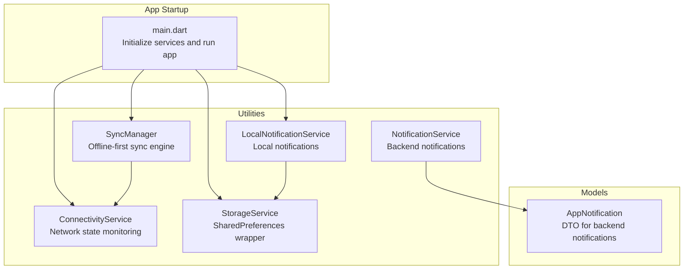
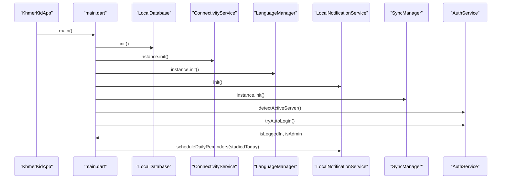
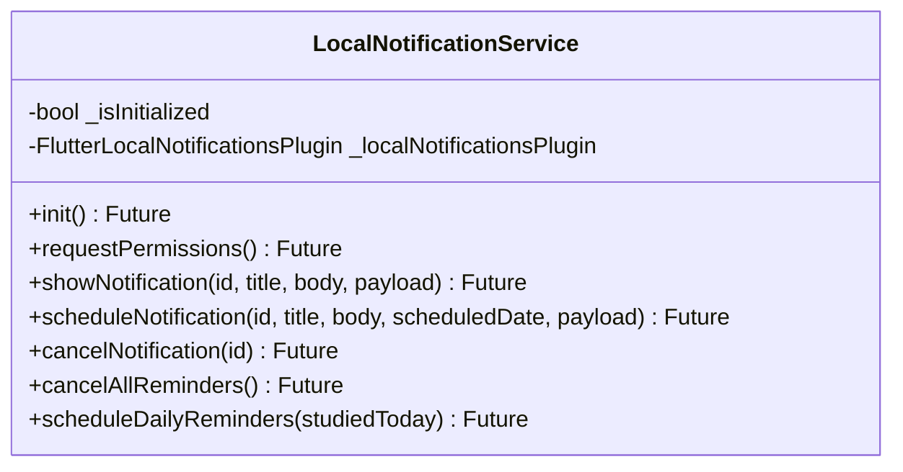
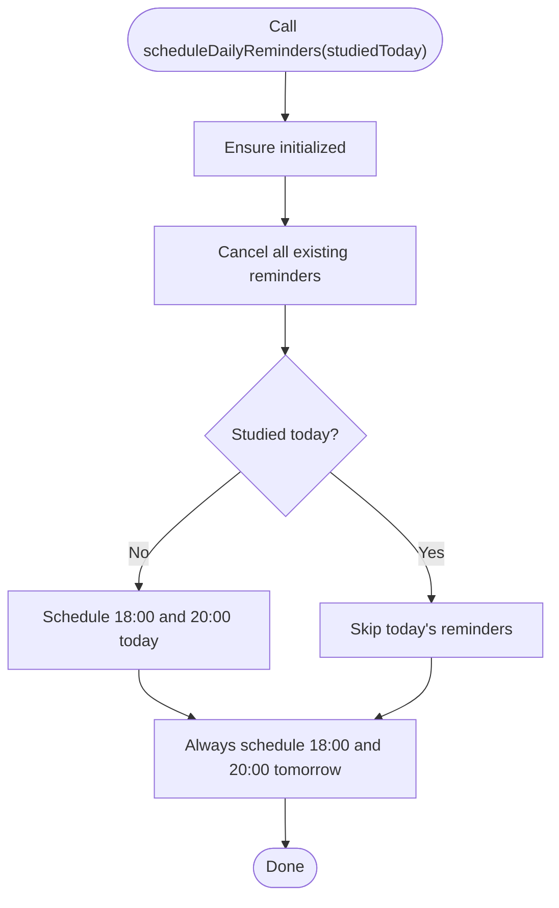
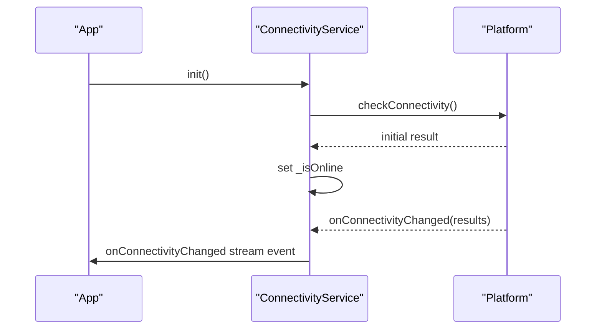
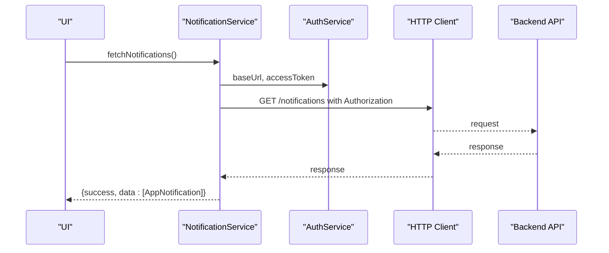
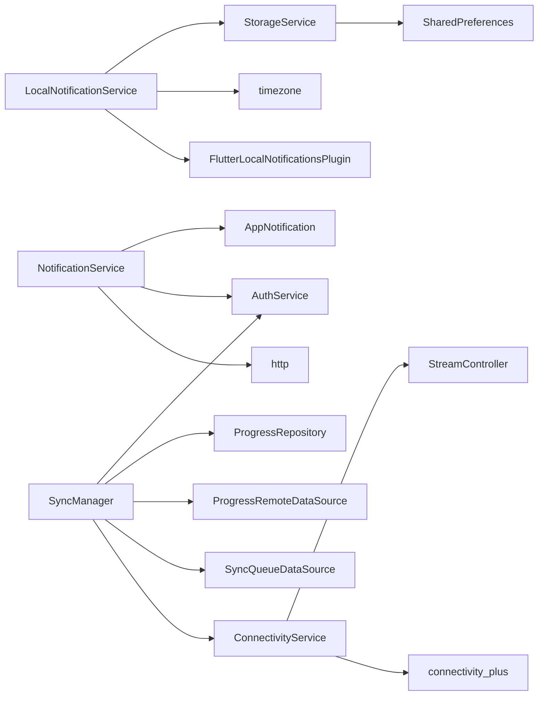

# Utility Services API

<cite>
**Referenced Files in This Document**
- [main.dart](file://lib/main.dart)
- [connectivity_service.dart](file://lib/services/connectivity_service.dart)
- [local_notification_service.dart](file://lib/services/local_notification_service.dart)
- [notification_service.dart](file://lib/services/notification_service.dart)
- [storage_service.dart](file://lib/services/storage_service.dart)
- [sync_manager.dart](file://lib/services/sync_manager.dart)
- [app_notification.dart](file://lib/models/app_notification.dart)
</cite>

## Table of Contents
1. [Introduction](#introduction)
2. [Project Structure](#project-structure)
3. [Core Components](#core-components)
4. [Architecture Overview](#architecture-overview)
5. [Detailed Component Analysis](#detailed-component-analysis)
6. [Dependency Analysis](#dependency-analysis)
7. [Performance Considerations](#performance-considerations)
8. [Troubleshooting Guide](#troubleshooting-guide)
9. [Conclusion](#conclusion)

## Introduction
This document provides detailed API documentation for three utility services used by the application:
- Local Notification Service: schedules, displays, and manages local notifications with timezone-aware scheduling and permission handling.
- Connectivity Service: monitors network connectivity state and emits online/offline transitions.
- Storage Service: persists user progress, preferences, and caches using a centralized SharedPreferences wrapper with per-user scoping.

It also covers integration patterns with the application lifecycle, synchronization manager, and backend notification service. Examples demonstrate notification setup, connectivity monitoring, and storage operations. Error handling strategies and performance optimization techniques are included for each service.

## Project Structure
The utility services live under lib/services and integrate with the app’s initialization pipeline and core repositories.

**Diagram sources**
- [main.dart:21-34](file://lib/main.dart#L21-L34)
- [connectivity_service.dart:6-20](file://lib/services/connectivity_service.dart#L6-L20)
- [local_notification_service.dart:6-13](file://lib/services/local_notification_service.dart#L6-L13)
- [notification_service.dart:7-21](file://lib/services/notification_service.dart#L7-L21)
- [storage_service.dart:6-16](file://lib/services/storage_service.dart#L6-L16)
- [sync_manager.dart:21-43](file://lib/services/sync_manager.dart#L21-L43)
- [app_notification.dart:1-11](file://lib/models/app_notification.dart#L1-L11)

**Section sources**
- [main.dart:21-34](file://lib/main.dart#L21-L34)

## Core Components
- LocalNotificationService
  - Initialization with platform-specific settings and timezone configuration.
  - Permission requests for Android and iOS.
  - Immediate notification display and zoned scheduling with exact-alarm support.
  - Batch cancellation and daily reminder scheduling logic.
- ConnectivityService
  - Singleton stream of online/offline state changes.
  - Initial connectivity check and broadcast via a StreamController.
- StorageService
  - Centralized SharedPreferences wrapper with per-user key scoping.
  - Rich APIs for progress tracking, power-ups regeneration, settings, and caches.
- NotificationService (backend)
  - Fetches, marks as read, marks all as read, and sends test reminders.
  - Uses AuthService-provided base URL and Authorization header.
- SyncManager
  - Orchestrates offline-first synchronization with retry/backoff and conflict resolution.
  - Integrates with ConnectivityService to auto-sync when online.

**Section sources**
- [local_notification_service.dart:16-61](file://lib/services/local_notification_service.dart#L16-L61)
- [connectivity_service.dart:28-53](file://lib/services/connectivity_service.dart#L28-L53)
- [storage_service.dart:12-16](file://lib/services/storage_service.dart#L12-L16)
- [notification_service.dart:22-95](file://lib/services/notification_service.dart#L22-L95)
- [sync_manager.dart:45-74](file://lib/services/sync_manager.dart#L45-L74)

## Architecture Overview
The application initializes services concurrently during startup, then delegates to SyncManager once connectivity and database are ready. LocalNotificationService integrates with the app’s auto-login flow to schedule daily reminders. StorageService provides a unified interface for persistent data across features.

**Diagram sources**
- [main.dart:21-59](file://lib/main.dart#L21-L59)
- [connectivity_service.dart:28-53](file://lib/services/connectivity_service.dart#L28-L53)
- [local_notification_service.dart:210-261](file://lib/services/local_notification_service.dart#L210-L261)
- [sync_manager.dart:45-74](file://lib/services/sync_manager.dart#L45-L74)

## Detailed Component Analysis

### Local Notification Service API
- Initialization
  - Initializes timezone database and sets local location with fallback.
  - Configures Android and iOS initialization settings.
  - Registers a notification response handler and requests permissions.
- Permissions
  - Requests notification and exact alarm permissions on Android.
  - Requests alert/badge/sound permissions on iOS.
- Immediate Notification
  - Displays a notification with Android big-text style and iOS alert/badge/sound.
- Scheduled Notification
  - Schedules a notification at a specific DateTime using timezone-aware scheduling.
  - Uses exact-alarm mode for allow-listed devices.
- Management
  - Cancels a single notification by ID.
  - Cancels all notifications.
  - Schedules daily reminders with two time slots per day and a future day slot.
- Error Handling
  - Logs initialization errors, permission errors, display errors, and scheduling errors.

Example usage
- Initialize: call init() once during startup.
- Show: call showNotification with id, title, body, optional payload.
- Schedule: call scheduleNotification with id, title, body, scheduledDate, optional payload.
- Cancel: call cancelNotification(id) or cancelAllReminders().
- Daily reminders: call scheduleDailyReminders(studiedToday: bool).

**Section sources**
- [local_notification_service.dart:16-61](file://lib/services/local_notification_service.dart#L16-L61)
- [local_notification_service.dart:64-89](file://lib/services/local_notification_service.dart#L64-L89)
- [local_notification_service.dart:92-137](file://lib/services/local_notification_service.dart#L92-L137)
- [local_notification_service.dart:139-187](file://lib/services/local_notification_service.dart#L139-L187)
- [local_notification_service.dart:189-207](file://lib/services/local_notification_service.dart#L189-L207)
- [local_notification_service.dart:210-261](file://lib/services/local_notification_service.dart#L210-L261)

#### Local Notification Service Class Diagram

**Diagram sources**
- [local_notification_service.dart:6-13](file://lib/services/local_notification_service.dart#L6-L13)

#### Daily Reminder Scheduling Flow

**Diagram sources**
- [local_notification_service.dart:210-261](file://lib/services/local_notification_service.dart#L210-L261)

### Connectivity Service API
- Singleton access via instance getter.
- Stream of connectivity changes via onConnectivityChanged.
- Current state via isOnline.
- Initialization
  - Performs initial connectivity check.
  - Subscribes to platform connectivity events.
  - Emits online/offline changes through a broadcast StreamController.
- Lifecycle
  - dispose cancels subscription and closes stream controller.

Example usage
- Initialize once: ConnectivityService.instance.init().
- Subscribe: ConnectivityService.instance.onConnectivityChanged.listen(...).
- Check state: ConnectivityService.instance.isOnline.

**Section sources**
- [connectivity_service.dart:17-27](file://lib/services/connectivity_service.dart#L17-L27)
- [connectivity_service.dart:28-53](file://lib/services/connectivity_service.dart#L28-L53)
- [connectivity_service.dart:55-58](file://lib/services/connectivity_service.dart#L55-L58)

#### Connectivity Monitoring Sequence

**Diagram sources**
- [connectivity_service.dart:28-53](file://lib/services/connectivity_service.dart#L28-L53)

### Storage Service API
- Instance creation via getInstance() ensuring SharedPreferences initialization.
- Per-user key scoping via _uKey() using stored user profile identifiers.
- Progress and stats
  - Stars/XP getters/setters/add/spend.
  - Streak tracking with last study date normalization.
  - Letter, vowel, reading, number, diacritical, spelling, writing progress maps.
  - Learned vocabulary set and test history list with capped length.
  - Game scores map keyed by game name.
  - Achievements unlocked set.
- Study time
  - Total minutes and daily minutes with date-based keys.
- Profile
  - Username, avatar index, avatar URL.
- Settings
  - Sound enabled, language, TTS speed, haptics, offline mode.
- Offline lessons cache
  - Save and retrieve cached lessons JSON by type.
- Power-ups regeneration system
  - Hints, time, lives, double-score counts with cooldowns.
  - Methods to add, use, and query cooldown remaining.
- Clear operations
  - clearAll() clears all keys.
  - clearProgress() removes only progress-related keys.
  - clearOnlyLessonProgress() removes lesson-specific progress maps.

Example usage
- Get/set stars: getStars(), setStars(val), addStars(amount), spendStars(amount).
- Update streak: updateStreak().
- Save progress: saveLetterProgress(index, stars).
- Manage power-ups: getHintsCount(), useHint(), addHints(amount), getHintsCooldownRemaining().

**Section sources**
- [storage_service.dart:12-16](file://lib/services/storage_service.dart#L12-L16)
- [storage_service.dart:18-31](file://lib/services/storage_service.dart#L18-L31)
- [storage_service.dart:37-58](file://lib/services/storage_service.dart#L37-L58)
- [storage_service.dart:67-86](file://lib/services/storage_service.dart#L67-L86)
- [storage_service.dart:92-104](file://lib/services/storage_service.dart#L92-L104)
- [storage_service.dart:109-121](file://lib/services/storage_service.dart#L109-L121)
- [storage_service.dart:133-138](file://lib/services/storage_service.dart#L133-L138)
- [storage_service.dart:150-155](file://lib/services/storage_service.dart#L150-L155)
- [storage_service.dart:167-172](file://lib/services/storage_service.dart#L167-L172)
- [storage_service.dart:184-189](file://lib/services/storage_service.dart#L184-L189)
- [storage_service.dart:201-206](file://lib/services/storage_service.dart#L201-L206)
- [storage_service.dart:215-220](file://lib/services/storage_service.dart#L215-L220)
- [storage_service.dart:231-248](file://lib/services/storage_service.dart#L231-L248)
- [storage_service.dart:260-265](file://lib/services/storage_service.dart#L260-L265)
- [storage_service.dart:274-278](file://lib/services/storage_service.dart#L274-L278)
- [storage_service.dart:287-306](file://lib/services/storage_service.dart#L287-L306)
- [storage_service.dart:313-323](file://lib/services/storage_service.dart#L313-L323)
- [storage_service.dart:331-340](file://lib/services/storage_service.dart#L331-L340)
- [storage_service.dart:342-346](file://lib/services/storage_service.dart#L342-L346)
- [storage_service.dart:355-359](file://lib/services/storage_service.dart#L355-L359)
- [storage_service.dart:368-370](file://lib/services/storage_service.dart#L368-L370)
- [storage_service.dart:377-404](file://lib/services/storage_service.dart#L377-L404)
- [storage_service.dart:426-456](file://lib/services/storage_service.dart#L426-L456)
- [storage_service.dart:458-461](file://lib/services/storage_service.dart#L458-L461)
- [storage_service.dart:463-481](file://lib/services/storage_service.dart#L463-L481)
- [storage_service.dart:483-525](file://lib/services/storage_service.dart#L483-L525)
- [storage_service.dart:527-540](file://lib/services/storage_service.dart#L527-L540)
- [storage_service.dart:543-556](file://lib/services/storage_service.dart#L543-L556)

#### Storage Service Class Diagram

```mermaid
classDiagram
class StorageService {
-SharedPreferences? _prefs
+getInstance() StorageService
-_uKey(baseKey) String
+getStars() int
+setStars(val) Future<void>
+addStars(amount) Future<void>
+spendStars(amount) Future<bool>
+getXp() int
+setXp(val) Future<void>
+addXp(amount) Future<void>
+getStreak() int
+setStreak(val) Future<void>
+updateStreak() Future<void>
+getLetterProgress() Map<int,int>
+saveLetterProgress(index, stars) Future<void>
+getVowelProgress() Map<int,int>
+saveVowelProgress(index, stars) Future<void>
+getReadingProgress() Map<int,int>
+saveReadingProgress(index, stars) Future<void>
+getNumberProgress() Map<int,int>
+saveNumberProgress(index, stars) Future<void>
+getDiacriticalProgress() Map<int,int>
+saveDiacriticalProgress(index, stars) Future<void>
+getSpellingProgress() Map<int,int>
+saveSpellingProgress(index, stars) Future<void>
+getWritingProgress() Map<int,int>
+saveWritingProgress(index, stars) Future<void>
+getLearnedVocab() Set<String>
+markVocabLearned(wordKhmer) Future<void>
+getTestHistory() List<Map<String,dynamic>>
+addTestResult(correct,total,difficulty,stars) Future<void>
+getGameScores() Map<String,int>
+saveGameScore(gameName,score) Future<void>
+getPurchasedItems() Set<String>
+addPurchasedItem(itemKey) Future<void>
+getSoundEnabled() bool
+setSoundEnabled(val) Future<void>
+getLanguage() String
+setLanguage(lang) Future<void>
+getTtsSpeed() int
+setTtsSpeed(val) Future<void>
+getHapticsEnabled() bool
+setHapticsEnabled(val) Future<void>
+getOfflineEnabled() bool
+setOfflineEnabled(val) Future<void>
+getUsername() String
+setUsername(name) Future<void>
+getAvatarIndex() int
+setAvatarIndex(idx) Future<void>
+getAvatarUrl() String
+setAvatarUrl(url) Future<void>
+getTotalStudyMinutes() int
+addStudyMinutes(minutes) Future<void>
+getDailyStudyMinutes() int
+getUnlockedAchievements() Set<String>
+unlockAchievement(id) Future<void>
+getCachedLessons(type) String?
+saveCachedLessons(type,jsonStr) Future<void>
+clearAll() Future<void>
+clearProgress() Future<void>
+clearOnlyLessonProgress() Future<void>
+getHintsCount() int
+getTimePowerupsCount() int
+getLivesPowerupsCount() int
+getDoubleScorePowerupsCount() int
+addHints(amount) Future<void>
+addTimePowerups(amount) Future<void>
+addLivesPowerups(amount) Future<void>
+addDoubleScorePowerups(amount) Future<void>
+useHint() Future<void>
+useTimePowerup() Future<void>
+useLivesPowerup() Future<void>
+useDoubleScorePowerup() Future<void>
+getHintsCooldownRemaining() int
+getTimePowerupsCooldownRemaining() int
+getLivesPowerupsCooldownRemaining() int
+getDoubleScoreCooldownRemaining() int
}
```

**Diagram sources**
- [storage_service.dart:6-16](file://lib/services/storage_service.dart#L6-L16)

### Backend Notification Service API
- Base URL and headers derived from AuthService (Authorization header when available).
- fetchNotifications(): retrieves user notifications and maps to AppNotification list.
- markAsRead(notificationId): marks a notification as read.
- markAllAsRead(): marks all notifications as read.
- sendTestReminder(): triggers a test study reminder endpoint.

Example usage
- Fetch: await NotificationService().fetchNotifications().
- Mark read: await NotificationService().markAsRead(id).
- Mark all read: await NotificationService().markAllAsRead().
- Send test: await NotificationService().sendTestReminder().

**Section sources**
- [notification_service.dart:14-21](file://lib/services/notification_service.dart#L14-L21)
- [notification_service.dart:22-41](file://lib/services/notification_service.dart#L22-L41)
- [notification_service.dart:43-59](file://lib/services/notification_service.dart#L43-L59)
- [notification_service.dart:61-77](file://lib/services/notification_service.dart#L61-L77)
- [notification_service.dart:79-95](file://lib/services/notification_service.dart#L79-L95)

#### Backend Notification Service Sequence

**Diagram sources**
- [notification_service.dart:22-41](file://lib/services/notification_service.dart#L22-L41)
- [app_notification.dart:24-52](file://lib/models/app_notification.dart#L24-L52)

### Sync Manager Integration
- Initializes connectivity listener and periodic sync timer.
- Processes pending sync queue with exponential backoff and failure marking.
- Supports manual trigger and full sync after authentication.
- Emits sync status changes via a broadcast stream.

Integration points
- ConnectivityService.onConnectivityChanged drives automatic sync.
- LocalNotificationService uses StorageService for user-scoped data.
- NotificationService depends on AuthService for base URL and tokens.

**Section sources**
- [sync_manager.dart:45-74](file://lib/services/sync_manager.dart#L45-L74)
- [sync_manager.dart:76-155](file://lib/services/sync_manager.dart#L76-L155)
- [sync_manager.dart:188-210](file://lib/services/sync_manager.dart#L188-L210)
- [sync_manager.dart:226-235](file://lib/services/sync_manager.dart#L226-L235)

## Dependency Analysis
- LocalNotificationService depends on:
  - FlutterLocalNotificationsPlugin for platform integrations.
  - timezone for TZDateTime scheduling.
  - StorageService indirectly via app initialization and user context.
- ConnectivityService depends on:
  - connectivity_plus for platform connectivity events.
  - StreamController for broadcasting state changes.
- StorageService depends on:
  - SharedPreferences for persistence.
  - AuthService-provided user profile for key scoping.
- NotificationService depends on:
  - http client.
  - AuthService for base URL and Authorization.
  - AppNotification model for DTO mapping.
- SyncManager depends on:
  - ConnectivityService for online/offline detection.
  - SyncQueueDataSource and ProgressRemoteDataSource for queue processing.
  - ProgressRepository for full sync orchestration.
  - AuthService for post-sync profile refresh.

**Diagram sources**
- [local_notification_service.dart:1-6](file://lib/services/local_notification_service.dart#L1-L6)
- [connectivity_service.dart:1-3](file://lib/services/connectivity_service.dart#L1-L3)
- [storage_service.dart:1-2](file://lib/services/storage_service.dart#L1-L2)
- [notification_service.dart:1-6](file://lib/services/notification_service.dart#L1-L6)
- [sync_manager.dart:1-10](file://lib/services/sync_manager.dart#L1-L10)

**Section sources**
- [local_notification_service.dart:1-6](file://lib/services/local_notification_service.dart#L1-L6)
- [connectivity_service.dart:1-3](file://lib/services/connectivity_service.dart#L1-L3)
- [storage_service.dart:1-2](file://lib/services/storage_service.dart#L1-L2)
- [notification_service.dart:1-6](file://lib/services/notification_service.dart#L1-L6)
- [sync_manager.dart:1-10](file://lib/services/sync_manager.dart#L1-L10)

## Performance Considerations
- LocalNotificationService
  - Use exact-alarm scheduling mode for precise timing while respecting device battery policies.
  - Avoid scheduling in the past; validate DateTime before scheduling.
  - Batch cancel old reminders before scheduling new ones to prevent duplicates.
- ConnectivityService
  - Subscribe once during initialization; avoid multiple subscriptions to reduce overhead.
  - Use broadcast streams to minimize memory pressure from multiple listeners.
- StorageService
  - Prefer integer/string primitives for counters and flags to reduce serialization cost.
  - Limit lists (e.g., test history) to bounded sizes to cap memory usage.
  - Use targeted clear operations (e.g., clearOnlyLessonProgress) to avoid unnecessary writes.
- NotificationService
  - Apply short timeouts to prevent UI stalls on network failures.
  - Cache frequently accessed data (e.g., user profile) in StorageService to reduce network calls.
- SyncManager
  - Exponential backoff reduces server load during transient failures.
  - Periodic sync timers should be tuned to balance freshness vs. battery impact.
  - Use take-max strategy for conflict resolution to minimize merge complexity.

[No sources needed since this section provides general guidance]

## Troubleshooting Guide
- LocalNotificationService
  - Initialization failures: check platform initialization settings and logs for plugin errors.
  - Permission denials: re-request permissions and handle null/unchecked grants gracefully.
  - Scheduling errors: ensure scheduled dates are in the future and timezone is configured.
- ConnectivityService
  - No connectivity events: verify subscription and platform availability.
  - Incorrect state: confirm initial check result and compare with emitted stream events.
- StorageService
  - Missing user context: ensure user profile is persisted before calling _uKey().
  - Data not persisting: confirm SharedPreferences instance is initialized and keys are written.
- NotificationService
  - Authentication failures: verify AuthService tokens and base URL.
  - Network timeouts: adjust timeout durations and surface actionable messages to users.
- SyncManager
  - Offline sync: ensure queue items are marked failed appropriately and retried later.
  - Status stuck: monitor onSyncStatusChanged and investigate queue processing exceptions.

**Section sources**
- [local_notification_service.dart:58-60](file://lib/services/local_notification_service.dart#L58-L60)
- [local_notification_service.dart:149-152](file://lib/services/local_notification_service.dart#L149-L152)
- [connectivity_service.dart:32-36](file://lib/services/connectivity_service.dart#L32-L36)
- [storage_service.dart:21-31](file://lib/services/storage_service.dart#L21-L31)
- [notification_service.dart:38-40](file://lib/services/notification_service.dart#L38-L40)
- [sync_manager.dart:118-125](file://lib/services/sync_manager.dart#L118-L125)

## Conclusion
The utility services provide a robust foundation for notifications, connectivity monitoring, and data persistence. Their integration with the app lifecycle and SyncManager enables an offline-first experience with reliable background synchronization. Following the documented APIs, error handling strategies, and performance recommendations ensures predictable behavior across platforms and network conditions.

[No sources needed since this section summarizes without analyzing specific files]