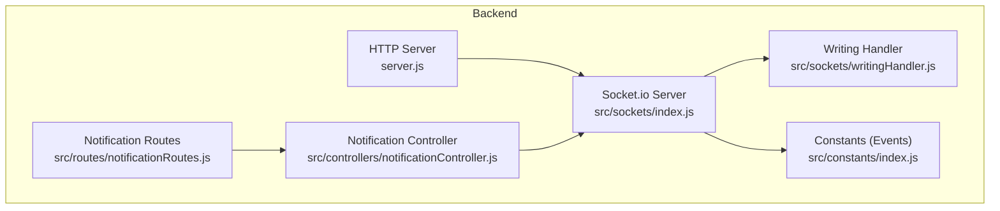
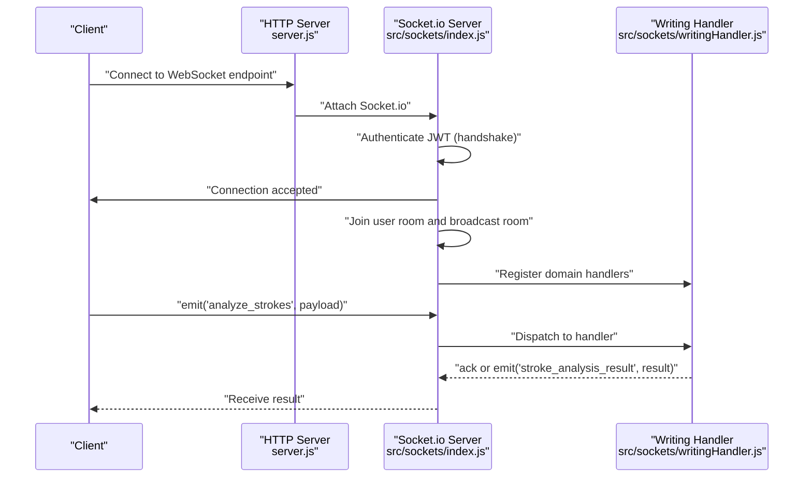
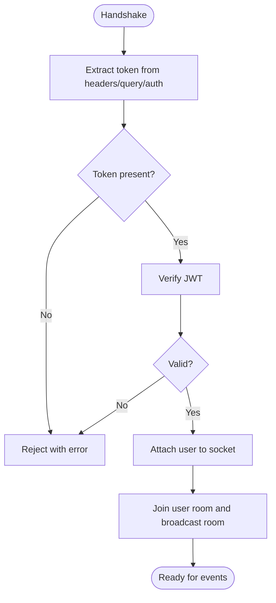
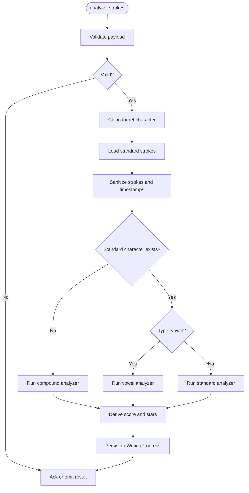
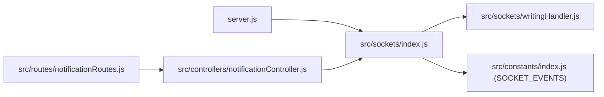

# Real-time WebSocket API

<cite>
**Referenced Files in This Document**
- [server.js](file://backend/server.js)
- [index.js](file://backend/src/sockets/index.js)
- [writingHandler.js](file://backend/src/sockets/writingHandler.js)
- [index.js](file://backend/src/constants/index.js)
- [notificationController.js](file://backend/src/controllers/notificationController.js)
- [notificationRoutes.js](file://backend/src/routes/notificationRoutes.js)
</cite>

## Table of Contents
1. [Introduction](#introduction)
2. [Project Structure](#project-structure)
3. [Core Components](#core-components)
4. [Architecture Overview](#architecture-overview)
5. [Detailed Component Analysis](#detailed-component-analysis)
6. [Dependency Analysis](#dependency-analysis)
7. [Performance Considerations](#performance-considerations)
8. [Troubleshooting Guide](#troubleshooting-guide)
9. [Conclusion](#conclusion)
10. [Appendices](#appendices)

## Introduction
This document provides comprehensive WebSocket API documentation for real-time communication in the application. It covers Socket.io server setup, client connection management, event-driven communication patterns, room-based messaging, and handshake protocols. It also documents WebSocket event types, message formats, connection lifecycle management, error recovery mechanisms, and performance optimization strategies. Integration patterns for real-time features such as live progress updates, collaborative activities, and instant notifications are included, along with practical examples for client and server implementations.

## Project Structure
The WebSocket subsystem is implemented in the backend under the sockets directory and integrates with the main HTTP server. Socket events are centrally defined in constants, while controllers and routes trigger real-time notifications.

**Diagram sources**
- [server.js:49](file://backend/server.js#L49)
- [index.js:128](file://backend/src/sockets/index.js#L128)
- [writingHandler.js:132](file://backend/src/sockets/writingHandler.js#L132)
- [index.js:212](file://backend/src/constants/index.js#L212)
- [notificationController.js:89](file://backend/src/controllers/notificationController.js#L89)
- [notificationRoutes.js:55](file://backend/src/routes/notificationRoutes.js#L55)

**Section sources**
- [server.js:49](file://backend/server.js#L49)
- [index.js:128](file://backend/src/sockets/index.js#L128)
- [index.js:212](file://backend/src/constants/index.js#L212)
- [notificationRoutes.js:55](file://backend/src/routes/notificationRoutes.js#L55)

## Core Components
- Socket.io server initialization and middleware for JWT-based authentication.
- Room-based messaging for per-user and broadcast channels.
- Domain-specific event handlers for writing stroke analysis and lightweight character info queries.
- Centralized socket event names for notifications and progress synchronization.
- Utilities to emit events to a specific user or to all connected clients.

Key responsibilities:
- Authentication: Verify JWT tokens during handshake and attach user identity to the socket.
- Room management: Automatically join user-specific and broadcast rooms upon connection.
- Event handling: Register domain handlers (writing) and respond to ping/pong for diagnostics.
- Broadcasting: Emit real-time notifications to users and to all clients.

**Section sources**
- [index.js:23](file://backend/src/sockets/index.js#L23)
- [index.js:65](file://backend/src/sockets/index.js#L65)
- [index.js:107](file://backend/src/sockets/index.js#L107)
- [index.js:120](file://backend/src/sockets/index.js#L120)

## Architecture Overview
The Socket.io server is attached to the HTTP server and configured with CORS and ping timeouts. Authentication middleware validates JWT tokens from handshake headers or query parameters. On connection, each socket joins two rooms: a user-specific room and a broadcast room. Domain-specific handlers are registered per socket. Controllers and routes can emit real-time events to users or globally.

**Diagram sources**
- [server.js:49](file://backend/server.js#L49)
- [index.js:34](file://backend/src/sockets/index.js#L34)
- [index.js:65](file://backend/src/sockets/index.js#L65)
- [writingHandler.js:142](file://backend/src/sockets/writingHandler.js#L142)

## Detailed Component Analysis

### Socket.io Server Setup and Handshake
- Initializes Socket.io with CORS allowing credentials and a ping timeout for reliability.
- Authentication middleware supports tokens from:
  - Authorization header
  - Query parameter token
  - Socket handshake auth object
- On successful authentication, attaches user identity to the socket and logs connection.
- Automatically joins the socket into:
  - User-specific room (by user ID)
  - Broadcast room ("broadcast")

**Diagram sources**
- [index.js:34](file://backend/src/sockets/index.js#L34)
- [index.js:65](file://backend/src/sockets/index.js#L65)

**Section sources**
- [index.js:23](file://backend/src/sockets/index.js#L23)
- [index.js:34](file://backend/src/sockets/index.js#L34)
- [index.js:65](file://backend/src/sockets/index.js#L65)

### Room-Based Messaging
- User-specific room: Ensures targeted delivery to a single user regardless of concurrent sessions.
- Broadcast room: Enables sending notifications to all connected clients.

Practical usage:
- Emit to a specific user: emitToUser(userId, eventName, data)
- Broadcast to all: broadcast(eventName, data)

**Section sources**
- [index.js:70](file://backend/src/sockets/index.js#L70)
- [index.js:73](file://backend/src/sockets/index.js#L73)
- [index.js:107](file://backend/src/sockets/index.js#L107)
- [index.js:120](file://backend/src/sockets/index.js#L120)

### Writing Stroke Analysis Handler
Purpose:
- Process real-time stroke data from clients to compute similarity scores and gamification rewards.
- Persist attempts to a progress collection.
- Emit results back to the client via acknowledgment or a named event.

Event types:
- Client emits: analyze_strokes
- Client emits: get_character_info
- Server emits: stroke_analysis_result (via acknowledgment or named event)

Message formats:
- analyze_strokes payload:
  - targetCharacter: string
  - userStrokeData: array of strokes, each stroke is an array of points with x, y, optional t
- get_character_info payload:
  - character: string
- stroke_analysis_result response:
  - success: boolean
  - similarityScore: number
  - shapeScore: number
  - directionScore: number
  - strokeCountScore: number
  - feedback: string
  - errorStrokeIndex: number
  - errors: string[]
  - stars: number
  - passed: boolean
  - xpEarned: number
  - details: object

Validation and sanitization:
- Validates payload structure and point coordinates.
- Filters noisy strokes with fewer than two points.
- Assigns timestamps if missing (~60fps fallback).

AI analysis pipeline:
- Resolves golden path from StandardCharacter.
- Supports three analyzers:
  - Compound strokes (for multi-character targets)
  - Vowel strokes
  - Standard strokes
- Converts similarity score to star rating and computes XP rewards.

Persistence:
- Records attempt in WritingProgress with user ID, target character, and analysis result.

**Diagram sources**
- [writingHandler.js:142](file://backend/src/sockets/writingHandler.js#L142)
- [writingHandler.js:168](file://backend/src/sockets/writingHandler.js#L168)
- [writingHandler.js:218](file://backend/src/sockets/writingHandler.js#L218)
- [writingHandler.js:225](file://backend/src/sockets/writingHandler.js#L225)

**Section sources**
- [writingHandler.js:142](file://backend/src/sockets/writingHandler.js#L142)
- [writingHandler.js:297](file://backend/src/sockets/writingHandler.js#L297)
- [writingHandler.js:353](file://backend/src/sockets/writingHandler.js#L353)

### Notification Real-time Delivery
Controllers and routes trigger real-time notifications:
- emitToUser(userId, SOCKET_EVENTS.NOTIFICATION, notification) sends to a specific user.
- broadcast(SOCKET_EVENTS.NOTIFICATION, notification) sends to all clients.

This enables live notifications such as reminders, streak updates, and badges.

**Section sources**
- [notificationController.js:133](file://backend/src/controllers/notificationController.js#L133)
- [notificationRoutes.js:55](file://backend/src/routes/notificationRoutes.js#L55)
- [index.js:212](file://backend/src/constants/index.js#L212)

### Ping/Pong and Diagnostics
- The server listens for ping events and responds with pong to keep connections healthy.

**Section sources**
- [index.js:79](file://backend/src/sockets/index.js#L79)

## Dependency Analysis
- server.js initializes the HTTP server and attaches Socket.io.
- src/sockets/index.js manages authentication, rooms, and event emission utilities.
- src/sockets/writingHandler.js registers domain-specific handlers for writing tasks.
- src/constants/index.js centralizes socket event names.
- Controllers and routes use emitToUser and broadcast to push real-time updates.

**Diagram sources**
- [server.js:49](file://backend/server.js#L49)
- [index.js:128](file://backend/src/sockets/index.js#L128)
- [writingHandler.js:132](file://backend/src/sockets/writingHandler.js#L132)
- [index.js:212](file://backend/src/constants/index.js#L212)
- [notificationController.js:89](file://backend/src/controllers/notificationController.js#L89)
- [notificationRoutes.js:55](file://backend/src/routes/notificationRoutes.js#L55)

**Section sources**
- [server.js:49](file://backend/server.js#L49)
- [index.js:128](file://backend/src/sockets/index.js#L128)
- [writingHandler.js:132](file://backend/src/sockets/writingHandler.js#L132)
- [index.js:212](file://backend/src/constants/index.js#L212)
- [notificationController.js:89](file://backend/src/controllers/notificationController.js#L89)
- [notificationRoutes.js:55](file://backend/src/routes/notificationRoutes.js#L55)

## Performance Considerations
- Keep payload sizes minimal for real-time events (e.g., avoid sending large golden paths).
- Use acknowledgments for short, immediate responses to reduce round-trips.
- Apply rate limiting at the API layer to prevent flooding WebSocket channels.
- Monitor pingTimeout and adjust for network conditions to avoid premature disconnects.
- Persist results asynchronously to avoid blocking the event loop during heavy AI computations.
- Use rooms to minimize unnecessary broadcasts and target emissions efficiently.

## Troubleshooting Guide
Common issues and resolutions:
- Authentication failures:
  - Ensure the client passes a valid JWT token in the handshake (header, query, or auth object).
  - Confirm token expiration and signature verification.
- No events received:
  - Verify the client joined the correct rooms (user room and/or broadcast).
  - Check that the server emitted to the intended event name.
- Excessive latency:
  - Reduce payload size and avoid redundant data.
  - Use acknowledgments for immediate feedback.
- Frequent disconnects:
  - Increase pingTimeout or adjust client keepalive settings.
  - Investigate network stability and CORS misconfiguration.

**Section sources**
- [index.js:34](file://backend/src/sockets/index.js#L34)
- [index.js:79](file://backend/src/sockets/index.js#L79)

## Conclusion
The WebSocket subsystem provides a robust foundation for real-time features, combining secure JWT-based authentication, efficient room-based messaging, and domain-specific event handlers. By adhering to the documented event types, message formats, and best practices, developers can implement reliable live updates, collaborative activities, and instant notifications with predictable performance and resilience.

## Appendices

### WebSocket Event Types and Message Formats
- Event: analyze_strokes
  - Client emits: { targetCharacter: string, userStrokeData: array }
  - Server emits: stroke_analysis_result (ack or named event)
- Event: get_character_info
  - Client emits: { character: string }
  - Server emits: character_info_result (ack or named event)
- Event: notification:new
  - Server emits: { title, message, type, isRead, createdAt, ... }
- Event: progress:sync
  - Server emits: { action, data, timestamp }

**Section sources**
- [writingHandler.js:142](file://backend/src/sockets/writingHandler.js#L142)
- [writingHandler.js:297](file://backend/src/sockets/writingHandler.js#L297)
- [index.js:212](file://backend/src/constants/index.js#L212)

### Client Implementation Examples
- Connection and authentication:
  - Connect to the WebSocket endpoint with credentials.
  - Include the JWT token in the handshake (headers, query, or auth object).
- Subscribing to rooms:
  - Join user-specific and broadcast rooms after connection.
- Handling events:
  - Listen for stroke_analysis_result and character_info_result.
  - Listen for notification:new to display live notifications.
- Emitting events:
  - Emit analyze_strokes with validated stroke data.
  - Emit get_character_info with the target character.

**Section sources**
- [index.js:34](file://backend/src/sockets/index.js#L34)
- [index.js:70](file://backend/src/sockets/index.js#L70)
- [index.js:73](file://backend/src/sockets/index.js#L73)
- [writingHandler.js:142](file://backend/src/sockets/writingHandler.js#L142)
- [writingHandler.js:297](file://backend/src/sockets/writingHandler.js#L297)