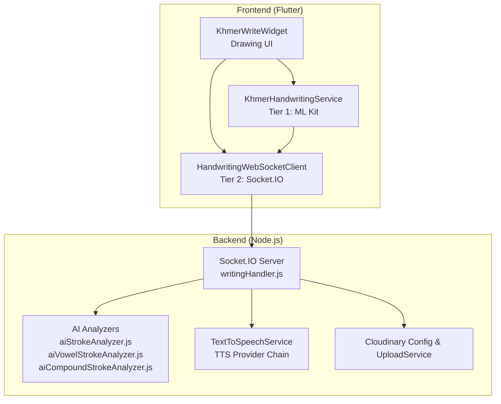
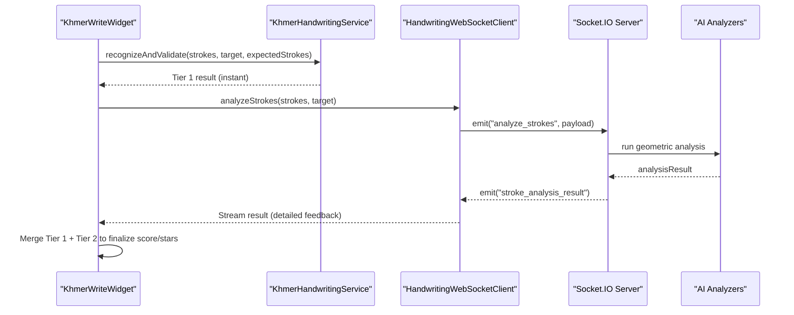
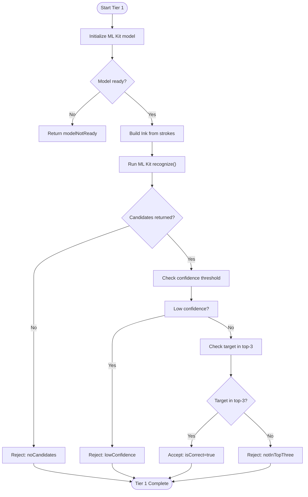
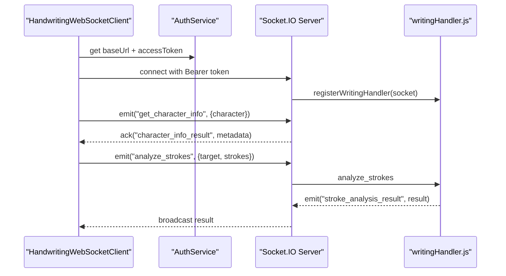
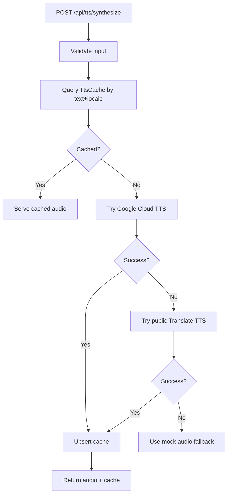
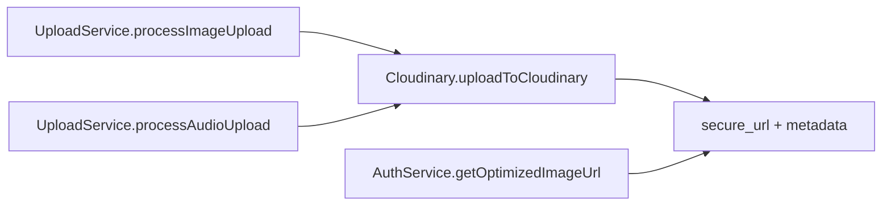
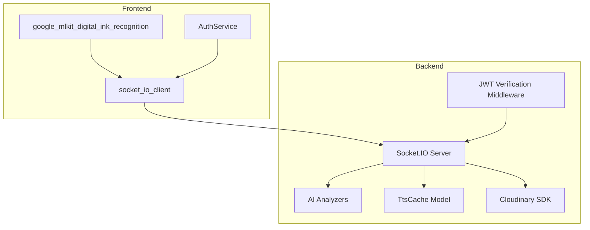

# Advanced Features

<cite>
**Referenced Files in This Document**
- [khmer_handwriting_service.dart](file://lib/services/khmer_handwriting_service.dart)
- [khmer_write_widget.dart](file://lib/widgets/khmer_write_widget.dart)
- [handwriting_websocket_client.dart](file://lib/services/handwriting_websocket_client.dart)
- [writingHandler.js](file://backend/src/sockets/writingHandler.js)
- [TextToSpeechService.js](file://backend/src/services/TextToSpeechService.js)
- [ttsController.js](file://backend/src/controllers/ttsController.js)
- [cloudinary.js](file://backend/src/config/cloudinary.js)
- [uploadService.js](file://backend/src/services/uploadService.js)
- [TtsCache.js](file://backend/src/models/TtsCache.js)
- [index.js](file://backend/src/sockets/index.js)
- [TTS_PROVIDER.md](file://backend/TTS_PROVIDER.md)
</cite>

## Table of Contents
1. [Introduction](#introduction)
2. [Project Structure](#project-structure)
3. [Core Components](#core-components)
4. [Architecture Overview](#architecture-overview)
5. [Detailed Component Analysis](#detailed-component-analysis)
6. [Dependency Analysis](#dependency-analysis)
7. [Performance Considerations](#performance-considerations)
8. [Troubleshooting Guide](#troubleshooting-guide)
9. [Conclusion](#conclusion)

## Introduction
This document details the advanced features that distinguish the KhmerKid application:
- Two-tier handwriting recognition system using Google ML Kit (Tier 1) and backend AI geometric analysis (Tier 2)
- Text-to-speech integration with multiple providers and caching
- Media processing and cloud storage integration
- Real-time communication systems for stroke analysis and notifications

It covers the machine learning pipeline, performance optimization techniques, integration patterns, configuration options, and troubleshooting guidance for these complex features.

## Project Structure
The advanced features span both the Flutter frontend and the Node.js backend:
- Frontend: handwriting recognition service, real-time WebSocket client, and UI widget orchestrating both tiers
- Backend: socket-based real-time analysis, AI analyzers, TTS synthesis with caching, and cloud storage integrations

**Diagram sources**
- [khmer_write_widget.dart:111-127](file://lib/widgets/khmer_write_widget.dart#L111-L127)
- [khmer_handwriting_service.dart:196-249](file://lib/services/khmer_handwriting_service.dart#L196-L249)
- [handwriting_websocket_client.dart:214-354](file://lib/services/handwriting_websocket_client.dart#L214-L354)
- [writingHandler.js:132-338](file://backend/src/sockets/writingHandler.js#L132-L338)
- [TextToSpeechService.js:23-107](file://backend/src/services/TextToSpeechService.js#L23-L107)
- [cloudinary.js:10-69](file://backend/src/config/cloudinary.js#L10-L69)

**Section sources**
- [khmer_write_widget.dart:111-127](file://lib/widgets/khmer_write_widget.dart#L111-L127)
- [writingHandler.js:132-338](file://backend/src/sockets/writingHandler.js#L132-L338)

## Core Components
- Tier 1: On-device handwriting recognition powered by Google ML Kit Digital Ink Recognition for Khmer script. Includes model lifecycle management, anti-false recognition filters, and kid-friendly acceptance criteria.
- Tier 2: Real-time geometric analysis via WebSocket, providing detailed feedback, scores, and star ratings.
- Text-to-Speech: Multi-provider synthesis with caching and fallbacks.
- Media and cloud: Cloudinary integration for optimized image/video delivery and controlled uploads/deletes.
- Real-time communication: Socket.IO-based messaging with authentication, reconnection, and user-scoped rooms.

**Section sources**
- [khmer_handwriting_service.dart:196-498](file://lib/services/khmer_handwriting_service.dart#L196-L498)
- [handwriting_websocket_client.dart:178-523](file://lib/services/handwriting_websocket_client.dart#L178-L523)
- [TextToSpeechService.js:23-107](file://backend/src/services/TextToSpeechService.js#L23-L107)
- [cloudinary.js:10-69](file://backend/src/config/cloudinary.js#L10-L69)
- [index.js:44-91](file://backend/src/sockets/index.js#L44-L91)

## Architecture Overview
The hybrid handwriting recognition pipeline combines immediate on-device feedback with deep backend analysis:
- On device: ML Kit recognizes strokes and applies filters to reduce false positives.
- In the cloud: WebSocket triggers AI analyzers to compute geometric similarity, directionality, and stroke counts, then persists progress and returns detailed feedback.

**Diagram sources**
- [khmer_write_widget.dart:177-309](file://lib/widgets/khmer_write_widget.dart#L177-L309)
- [khmer_handwriting_service.dart:260-490](file://lib/services/khmer_handwriting_service.dart#L260-L490)
- [handwriting_websocket_client.dart:379-436](file://lib/services/handwriting_websocket_client.dart#L379-L436)
- [writingHandler.js:142-288](file://backend/src/sockets/writingHandler.js#L142-L288)

## Detailed Component Analysis

### Two-Tier Handwriting Recognition System
- Tier 1 (on-device):
  - Initializes ML Kit model (download if needed), builds Ink from timestamped strokes, and runs recognition.
  - Applies multi-stage filters: empty input, stroke count deviation, confidence threshold, and top-3 matching with lesson-character validation.
  - Returns a structured result with acceptance flag, confidence, and rejection reason.
- Tier 2 (real-time backend):
  - Sends raw strokes to the backend via WebSocket.
  - Backend routes to appropriate analyzer (consonant, vowel, or compound) and computes composite scores and star ratings.
  - Persists progress and emits detailed feedback and scores back to the UI.

**Diagram sources**
- [khmer_handwriting_service.dart:260-490](file://lib/services/khmer_handwriting_service.dart#L260-L490)

**Section sources**
- [khmer_handwriting_service.dart:196-498](file://lib/services/khmer_handwriting_service.dart#L196-L498)
- [khmer_write_widget.dart:177-309](file://lib/widgets/khmer_write_widget.dart#L177-L309)
- [handwriting_websocket_client.dart:379-436](file://lib/services/handwriting_websocket_client.dart#L379-L436)
- [writingHandler.js:142-288](file://backend/src/sockets/writingHandler.js#L142-L288)

### Real-Time Communication System
- Socket.IO connection reuse authenticated via bearer token from the shared auth service.
- Auto-reconnection and token refresh handling for expired JWTs.
- Dedicated events:
  - Client emits "analyze_strokes" with timestamped strokes; server responds with "stroke_analysis_result".
  - Client emits "get_character_info" with acknowledgment; server responds with character metadata.
- Server registers domain-specific handlers and joins user-specific rooms for targeted notifications.

**Diagram sources**
- [handwriting_websocket_client.dart:214-354](file://lib/services/handwriting_websocket_client.dart#L214-L354)
- [writingHandler.js:132-338](file://backend/src/sockets/writingHandler.js#L132-L338)
- [index.js:44-91](file://backend/src/sockets/index.js#L44-L91)

**Section sources**
- [handwriting_websocket_client.dart:178-523](file://lib/services/handwriting_websocket_client.dart#L178-L523)
- [writingHandler.js:132-338](file://backend/src/sockets/writingHandler.js#L132-L338)
- [index.js:44-91](file://backend/src/sockets/index.js#L44-L91)

### Text-to-Speech Integration
- Provider chain:
  - Primary: Google Cloud Text-to-Speech (requires credentials).
  - Fallback: Public Translate TTS endpoint.
  - Offline fallback: mock audio buffer for tests.
- Caching: MongoDB-backed TTS cache keyed by text and locale with TTL and compound index.
- Route: POST /api/tts/synthesize returns MP3 with cache-control headers.

**Diagram sources**
- [ttsController.js:11-30](file://backend/src/controllers/ttsController.js#L11-L30)
- [TextToSpeechService.js:23-107](file://backend/src/services/TextToSpeechService.js#L23-L107)
- [TtsCache.js:9-37](file://backend/src/models/TtsCache.js#L9-L37)
- [TTS_PROVIDER.md:1-19](file://backend/TTS_PROVIDER.md#L1-L19)

**Section sources**
- [ttsController.js:11-30](file://backend/src/controllers/ttsController.js#L11-L30)
- [TextToSpeechService.js:23-107](file://backend/src/services/TextToSpeechService.js#L23-L107)
- [TtsCache.js:9-37](file://backend/src/models/TtsCache.js#L9-L37)
- [TTS_PROVIDER.md:1-19](file://backend/TTS_PROVIDER.md#L1-L19)

### Media Processing and Cloud Storage Integration
- Cloudinary configuration loaded from environment variables.
- Upload service supports image/audio processing hooks and deletion by public ID.
- Optimized image delivery via dynamic transformations (width, quality, format).

**Diagram sources**
- [uploadService.js:18-53](file://backend/src/services/uploadService.js#L18-L53)
- [cloudinary.js:26-69](file://backend/src/config/cloudinary.js#L26-L69)
- [auth_service.dart:86-91](file://lib/services/auth_service.dart#L86-L91)

**Section sources**
- [cloudinary.js:10-69](file://backend/src/config/cloudinary.js#L10-L69)
- [uploadService.js:14-53](file://backend/src/services/uploadService.js#L14-L53)
- [auth_service.dart:86-91](file://lib/services/auth_service.dart#L86-L91)

## Dependency Analysis
- Frontend dependencies:
  - ML Kit Digital Ink Recognition for on-device recognition.
  - Socket.IO client for real-time communication.
  - Shared auth service for server URL and token management.
- Backend dependencies:
  - Socket.IO server with JWT verification middleware.
  - AI analyzers for consonant, vowel, and compound strokes.
  - MongoDB models for caching and progress persistence.
  - Cloudinary SDK for media operations.

**Diagram sources**
- [khmer_handwriting_service.dart](file://lib/services/khmer_handwriting_service.dart#L50)
- [handwriting_websocket_client.dart](file://lib/services/handwriting_websocket_client.dart#L34)
- [index.js:44-91](file://backend/src/sockets/index.js#L44-L91)
- [writingHandler.js:19-23](file://backend/src/sockets/writingHandler.js#L19-L23)
- [TtsCache.js](file://backend/src/models/TtsCache.js#L7)
- [cloudinary.js](file://backend/src/config/cloudinary.js#L10)

**Section sources**
- [khmer_handwriting_service.dart](file://lib/services/khmer_handwriting_service.dart#L50)
- [handwriting_websocket_client.dart](file://lib/services/handwriting_websocket_client.dart#L34)
- [index.js:44-91](file://backend/src/sockets/index.js#L44-L91)
- [writingHandler.js:19-23](file://backend/src/sockets/writingHandler.js#L19-L23)
- [TtsCache.js](file://backend/src/models/TtsCache.js#L7)
- [cloudinary.js](file://backend/src/config/cloudinary.js#L10)

## Performance Considerations
- Tier 1 latency: On-device recognition minimizes perceived delay; ensure model is pre-warmed and cached.
- Network resilience: WebSocket auto-reconnect and token refresh prevent stale sessions; timeouts guard long-running operations.
- Caching: TTS cache reduces redundant synthesis; Cloudinary dynamic optimization lowers bandwidth.
- Data sanitization: Backend validates stroke payloads and ensures numeric types and minimal point counts to avoid heavy computations on invalid data.
- Scalability: Socket.IO rooms and targeted emits limit broadcast overhead; MongoDB TTL on TTS cache keeps storage bounded.

[No sources needed since this section provides general guidance]

## Troubleshooting Guide
- ML Kit model not ready:
  - Verify network connectivity and retry logic; ensure model download completes before recognition.
  - Check initialization guards and error messages for modelNotReady.
- Recognition consistently rejects:
  - Inspect stroke count deviation thresholds and top-3 matching logic.
  - Confirm expected stroke count is available and accurate.
- WebSocket connection failures:
  - Validate bearer token presence and expiration; confirm server URL normalization.
  - Review auto-refresh flow and error logs for authentication errors.
- TTS synthesis issues:
  - Confirm GOOGLE_APPLICATION_CREDENTIALS environment variable for primary provider.
  - Check cache queries and fallback chain; ensure public endpoint availability.
- Cloudinary upload failures:
  - Verify environment variables and resource type; handle deletion errors gracefully.

**Section sources**
- [khmer_handwriting_service.dart:201-249](file://lib/services/khmer_handwriting_service.dart#L201-L249)
- [handwriting_websocket_client.dart:263-297](file://lib/services/handwriting_websocket_client.dart#L263-L297)
- [TextToSpeechService.js:45-91](file://backend/src/services/TextToSpeechService.js#L45-L91)
- [cloudinary.js:13-18](file://backend/src/config/cloudinary.js#L13-L18)

## Conclusion
KhmerKid’s advanced features combine on-device intelligence with real-time backend analysis, robust TTS synthesis, and efficient media delivery. The hybrid recognition pipeline balances responsiveness with accuracy, while the real-time communication system enables personalized, immediate feedback. The documented configurations, patterns, and troubleshooting steps support reliable operation across environments.

[No sources needed since this section summarizes without analyzing specific files]