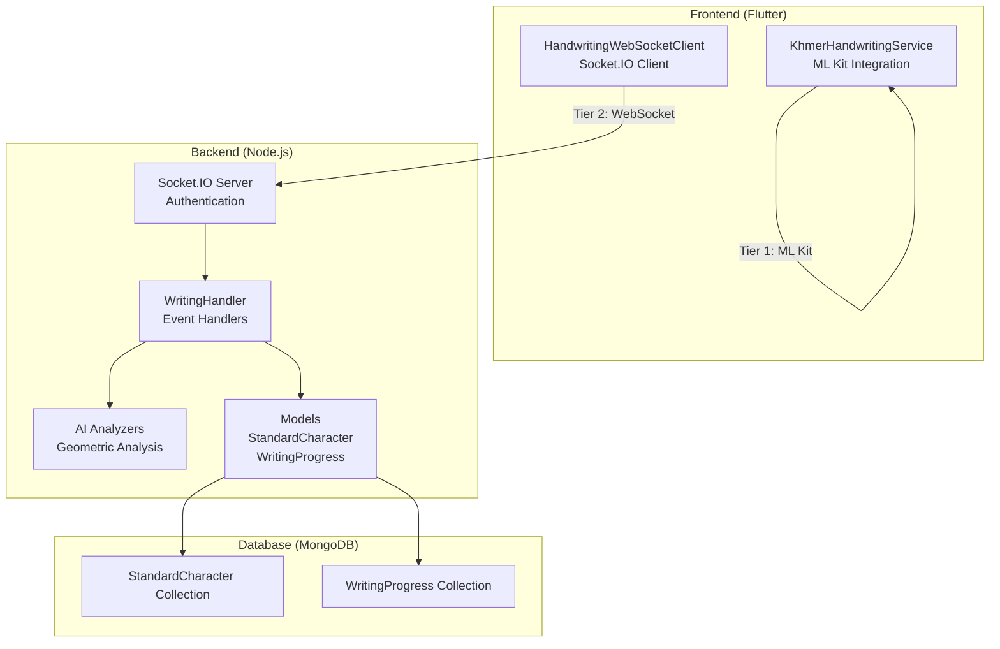
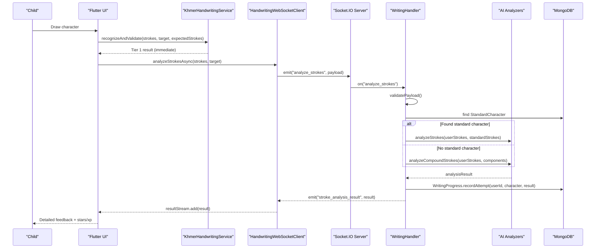
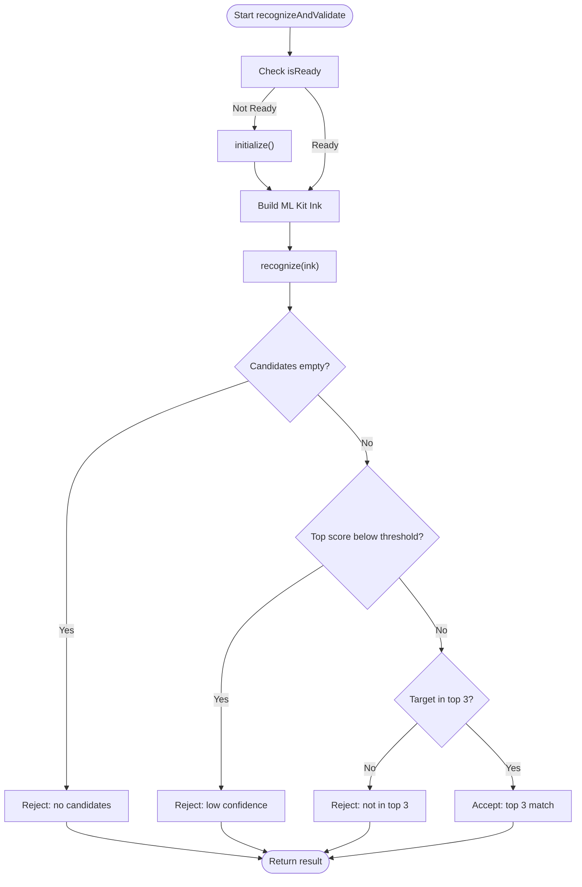
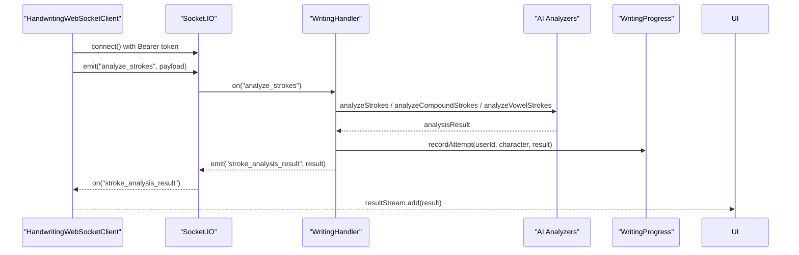
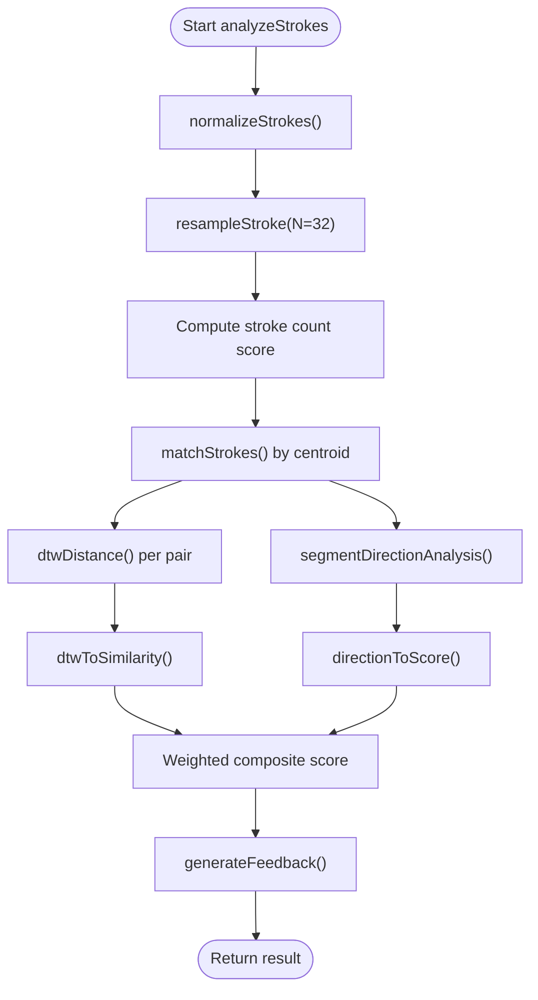
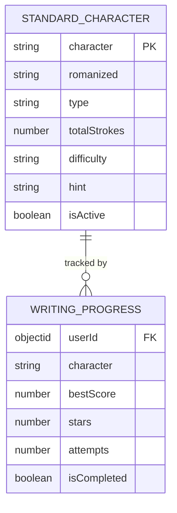
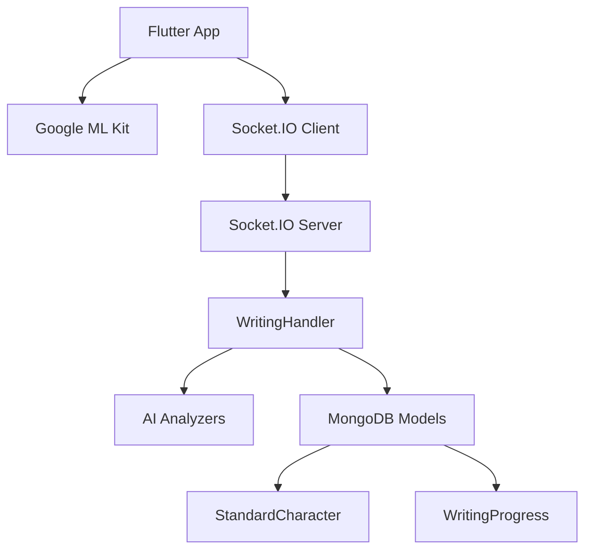

# Handwriting Recognition System

<cite>
**Referenced Files in This Document**
- [main.dart](file://lib/main.dart)
- [khmer_handwriting_service.dart](file://lib/services/khmer_handwriting_service.dart)
- [handwriting_websocket_client.dart](file://lib/services/handwriting_websocket_client.dart)
- [aiStrokeAnalyzer.js](file://backend/src/services/aiStrokeAnalyzer.js)
- [aiCompoundStrokeAnalyzer.js](file://backend/src/services/aiCompoundStrokeAnalyzer.js)
- [aiVowelStrokeAnalyzer.js](file://backend/src/services/aiVowelStrokeAnalyzer.js)
- [writingHandler.js](file://backend/src/sockets/writingHandler.js)
- [index.js](file://backend/src/sockets/index.js)
- [StandardCharacter.js](file://backend/src/models/StandardCharacter.js)
- [WritingProgress.js](file://backend/src/models/WritingProgress.js)
- [writingRoutes.js](file://backend/src/routes/writingRoutes.js)
- [aiStrokeAnalyzer.test.js](file://backend/test/aiStrokeAnalyzer.test.js)
- [aiCompoundStrokeAnalyzer.test.js](file://backend/test/aiCompoundStrokeAnalyzer.test.js)
</cite>

## Table of Contents
1. [Introduction](#introduction)
2. [Project Structure](#project-structure)
3. [Core Components](#core-components)
4. [Architecture Overview](#architecture-overview)
5. [Detailed Component Analysis](#detailed-component-analysis)
6. [Dependency Analysis](#dependency-analysis)
7. [Performance Considerations](#performance-considerations)
8. [Troubleshooting Guide](#troubleshooting-guide)
9. [Conclusion](#conclusion)

## Introduction
This document describes the two-tier handwriting recognition system used in KhmerKid, which combines Google ML Kit for initial stroke detection with AI analysis algorithms for stroke order validation. The system provides immediate feedback via on-device recognition and detailed correction via asynchronous backend analysis. It supports consonants, vowels, compound characters, and numbers with robust preprocessing, geometric normalization, and DTW-based similarity measurement.

## Project Structure
The system spans three major layers:
- Frontend (Flutter): On-device ML Kit integration, real-time WebSocket communication, and UI feedback.
- Backend (Node.js): Socket.IO server, real-time analysis, and persistent progress tracking.
- Database: MongoDB collections for standard character golden paths and user writing progress.

**Diagram sources**
- [khmer_handwriting_service.dart:161-498](file://lib/services/khmer_handwriting_service.dart#L161-L498)
- [handwriting_websocket_client.dart:178-523](file://lib/services/handwriting_websocket_client.dart#L178-L523)
- [index.js:23-84](file://backend/src/sockets/index.js#L23-L84)
- [writingHandler.js:132-365](file://backend/src/sockets/writingHandler.js#L132-L365)
- [StandardCharacter.js:62-196](file://backend/src/models/StandardCharacter.js#L62-L196)
- [WritingProgress.js:89-252](file://backend/src/models/WritingProgress.js#L89-L252)

**Section sources**
- [main.dart:21-77](file://lib/main.dart#L21-L77)
- [khmer_handwriting_service.dart:1-514](file://lib/services/khmer_handwriting_service.dart#L1-L514)
- [handwriting_websocket_client.dart:1-524](file://lib/services/handwriting_websocket_client.dart#L1-L524)
- [index.js:1-84](file://backend/src/sockets/index.js#L1-L84)
- [writingHandler.js:1-365](file://backend/src/sockets/writingHandler.js#L1-L365)
- [StandardCharacter.js:1-197](file://backend/src/models/StandardCharacter.js#L1-L197)
- [WritingProgress.js:1-253](file://backend/src/models/WritingProgress.js#L1-L253)

## Core Components
- Tier 1: On-device ML Kit recognition with anti-false filters and top-3 matching.
- Tier 2: Real-time WebSocket analysis with DTW, directional vectors, and compound/vowel-specific analyzers.
- Data models: StandardCharacter (golden path) and WritingProgress (attempt history).
- Routes: REST endpoints for character metadata and progress retrieval.

Key implementation highlights:
- ML Kit model lifecycle management and caching.
- Stroke preprocessing: normalization, resampling, and timestamp handling.
- DTW-based shape similarity with cosine-direction vector alignment.
- Compound and vowel analyzers with tailored heuristics.
- Real-time star/xp rewards and persistent progress tracking.

**Section sources**
- [khmer_handwriting_service.dart:161-498](file://lib/services/khmer_handwriting_service.dart#L161-L498)
- [aiStrokeAnalyzer.js:1-966](file://backend/src/services/aiStrokeAnalyzer.js#L1-L966)
- [aiCompoundStrokeAnalyzer.js:1-695](file://backend/src/services/aiCompoundStrokeAnalyzer.js#L1-L695)
- [aiVowelStrokeAnalyzer.js:1-584](file://backend/src/services/aiVowelStrokeAnalyzer.js#L1-L584)
- [StandardCharacter.js:62-196](file://backend/src/models/StandardCharacter.js#L62-L196)
- [WritingProgress.js:89-252](file://backend/src/models/WritingProgress.js#L89-L252)

## Architecture Overview
The system follows a hybrid two-tier design:
- Tier 1 (Frontend): Instant feedback using ML Kit; rejects ambiguous inputs early.
- Tier 2 (Backend): Asynchronous geometric analysis via WebSocket; detailed feedback and rewards.

**Diagram sources**
- [khmer_handwriting_service.dart:260-490](file://lib/services/khmer_handwriting_service.dart#L260-L490)
- [handwriting_websocket_client.dart:379-460](file://lib/services/handwriting_websocket_client.dart#L379-L460)
- [writingHandler.js:142-288](file://backend/src/sockets/writingHandler.js#L142-L288)
- [aiStrokeAnalyzer.js:593-752](file://backend/src/services/aiStrokeAnalyzer.js#L593-L752)
- [aiCompoundStrokeAnalyzer.js:375-690](file://backend/src/services/aiCompoundStrokeAnalyzer.js#L375-L690)
- [WritingProgress.js:204-245](file://backend/src/models/WritingProgress.js#L204-L245)

## Detailed Component Analysis

### Tier 1: KhmerHandwritingService (ML Kit Integration)
Responsibilities:
- Manage ML Kit Digital Ink model lifecycle (download, verify, cache).
- Anti-false recognition filters: empty strokes, stroke count deviation, confidence thresholds.
- Top-3 matching to accept near-matches for child-friendly UX.
- Build ML Kit Ink objects and run recognition.

Processing logic:
- Validates service readiness and initializes model if needed.
- Filters out invalid or insufficient input.
- Builds Ink with strokes and timestamps, runs recognition, and applies confidence and top-3 checks.
- Returns HandwritingRecognitionResult with message, confidence, and rejection reason.

**Diagram sources**
- [khmer_handwriting_service.dart:260-490](file://lib/services/khmer_handwriting_service.dart#L260-L490)

**Section sources**
- [khmer_handwriting_service.dart:161-498](file://lib/services/khmer_handwriting_service.dart#L161-L498)

### Tier 2: HandwritingWebSocketClient (Real-time Analysis)
Responsibilities:
- Manage Socket.IO connection with JWT authentication.
- Emit analyze_strokes and receive stroke_analysis_result.
- Fetch character metadata via get_character_info for Tier 1 filtering.
- Broadcast results to UI via StreamController.

Integration patterns:
- Reuses AuthService token for authentication.
- Supports fire-and-forget and awaited analysis modes.
- Handles token refresh and reconnection on authentication errors.

**Diagram sources**
- [handwriting_websocket_client.dart:214-354](file://lib/services/handwriting_websocket_client.dart#L214-L354)
- [writingHandler.js:142-288](file://backend/src/sockets/writingHandler.js#L142-L288)
- [WritingProgress.js:204-245](file://backend/src/models/WritingProgress.js#L204-L245)

**Section sources**
- [handwriting_websocket_client.dart:178-523](file://lib/services/handwriting_websocket_client.dart#L178-L523)
- [writingHandler.js:132-365](file://backend/src/sockets/writingHandler.js#L132-L365)

### AI Stroke Analyzer (Core Geometric Engine)
Responsibilities:
- Normalize strokes to a 100x100 canvas preserving aspect ratio.
- Resample to fixed N points per stroke for DTW compatibility.
- Pair user strokes to standard strokes via centroid proximity.
- Compute DTW-based shape similarity and cosine-direction alignment.
- Aggregate weighted scores and generate child-friendly feedback.

Key algorithms:
- Normalization and resampling for temporal and spatial invariance.
- DTW distance with averaged per-step cost and similarity mapping.
- Directional analysis using smoothed segment vectors and cosine similarity.
- Greedy stroke matching to tolerate stroke ordering differences.

**Diagram sources**
- [aiStrokeAnalyzer.js:593-752](file://backend/src/services/aiStrokeAnalyzer.js#L593-L752)

**Section sources**
- [aiStrokeAnalyzer.js:1-966](file://backend/src/services/aiStrokeAnalyzer.js#L1-L966)

### Compound Character Analyzer
Responsibilities:
- Handle characters composed of multiple components (e.g., "កា", "កិ").
- Estimate expected stroke counts from component counts.
- Enforce geometric constraints: size, aspect ratio, scribble detection, loop avoidance.
- Optional template-based matching against component standard strokes.

Optimization strategies:
- Reduced resampling (N=24) for speed.
- Bounded scaling to avoid magnifying tiny marks.
- Heuristic penalties for jaggedness and overlap.

**Section sources**
- [aiCompoundStrokeAnalyzer.js:1-695](file://backend/src/services/aiCompoundStrokeAnalyzer.js#L1-L695)

### Vowel Stroke Analyzer
Responsibilities:
- Specialized analysis for vowel marks with stricter stroke count penalties.
- Path length and smoothness adjustments to distinguish similar vowels (e.g., ិ vs ី).
- Length penalty and direction-based penalties to reduce false positives.

**Section sources**
- [aiVowelStrokeAnalyzer.js:1-584](file://backend/src/services/aiVowelStrokeAnalyzer.js#L1-L584)

### Data Models and Storage
- StandardCharacter: Canonical golden path strokes, metadata, and indices.
- WritingProgress: Per-character attempt history, best score, stars, and completion status.

**Diagram sources**
- [StandardCharacter.js:62-196](file://backend/src/models/StandardCharacter.js#L62-L196)
- [WritingProgress.js:89-252](file://backend/src/models/WritingProgress.js#L89-L252)

**Section sources**
- [StandardCharacter.js:1-197](file://backend/src/models/StandardCharacter.js#L1-L197)
- [WritingProgress.js:1-253](file://backend/src/models/WritingProgress.js#L1-L253)

### REST API Integration
- Public endpoints: list characters, fetch character metadata, fetch strokes (admin).
- Protected endpoints: user progress queries.

These endpoints support pre-loading character info for the Tier 1 filter and retrieving historical progress.

**Section sources**
- [writingRoutes.js:40-241](file://backend/src/routes/writingRoutes.js#L40-L241)

## Dependency Analysis
The system exhibits clear separation of concerns:
- Frontend depends on ML Kit SDK and Socket.IO client.
- Backend depends on Socket.IO server, analyzers, and Mongoose models.
- Analyzers share geometry utilities and are decoupled from platform specifics.
- Models encapsulate persistence logic and validation.

**Diagram sources**
- [khmer_handwriting_service.dart:161-498](file://lib/services/khmer_handwriting_service.dart#L161-L498)
- [handwriting_websocket_client.dart:178-523](file://lib/services/handwriting_websocket_client.dart#L178-L523)
- [index.js:23-84](file://backend/src/sockets/index.js#L23-L84)
- [writingHandler.js:132-365](file://backend/src/sockets/writingHandler.js#L132-L365)
- [StandardCharacter.js:62-196](file://backend/src/models/StandardCharacter.js#L62-L196)
- [WritingProgress.js:89-252](file://backend/src/models/WritingProgress.js#L89-L252)

**Section sources**
- [index.js:1-84](file://backend/src/sockets/index.js#L1-L84)
- [writingHandler.js:1-365](file://backend/src/sockets/writingHandler.js#L1-L365)

## Performance Considerations
- Resampling to fixed N points reduces computational load while maintaining shape fidelity.
- DTW is computed on resampled sequences (≤32 points), keeping complexity manageable.
- Greedy stroke matching avoids expensive bipartite matching for typical cases.
- Compound analyzer uses lower resampling (N=24) and bounded scaling for speed.
- WebSocket batching and acknowledgment minimize network overhead.
- Database writes use atomic upserts and capped histories to control growth.

[No sources needed since this section provides general guidance]

## Troubleshooting Guide
Common issues and resolutions:
- ML Kit model not ready: Ensure initialize() completes and model is downloaded; retry on failure.
- No candidates returned: Verify sufficient stroke quality and minimum point count.
- Low confidence: Encourage clearer strokes; top-3 matching is designed to be forgiving.
- Stroke count mismatch: Allow flexibility for children; backend does not penalize extra strokes.
- WebSocket authentication failures: Token refresh is handled automatically; check connectivity.
- Invalid payload: Ensure strokes arrays contain at least 2 points with numeric x, y, optional t.
- Missing standard character: Backend routes to compound analyzer; confirm character composition.

Validation and tests:
- Unit tests cover geometry utilities, resampling, DTW behavior, direction analysis, and integrated scenarios.
- Compound analyzer tests validate scribble detection, loop detection, aspect ratio constraints, and template matching.

**Section sources**
- [khmer_handwriting_service.dart:201-249](file://lib/services/khmer_handwriting_service.dart#L201-L249)
- [handwriting_websocket_client.dart:263-297](file://lib/services/handwriting_websocket_client.dart#L263-L297)
- [writingHandler.js:142-288](file://backend/src/sockets/writingHandler.js#L142-L288)
- [aiStrokeAnalyzer.test.js:31-362](file://backend/test/aiStrokeAnalyzer.test.js#L31-L362)
- [aiCompoundStrokeAnalyzer.test.js:5-258](file://backend/test/aiCompoundStrokeAnalyzer.test.js#L5-L258)

## Conclusion
The two-tier handwriting recognition system balances responsiveness with precision. Tier 1 provides immediate feedback using ML Kit, while Tier 2 delivers detailed geometric analysis via WebSocket. Robust preprocessing, DTW-based similarity, directional alignment, and specialized analyzers for compounds and vowels ensure accurate validation. Persistent storage enables progress tracking and adaptive learning, while Socket.IO facilitates real-time engagement and rewards.