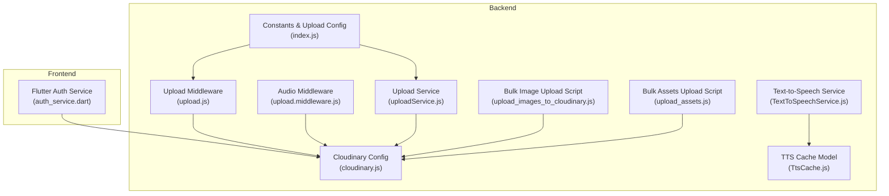
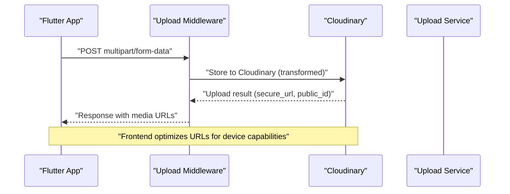
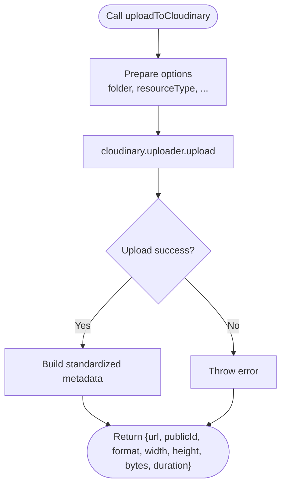
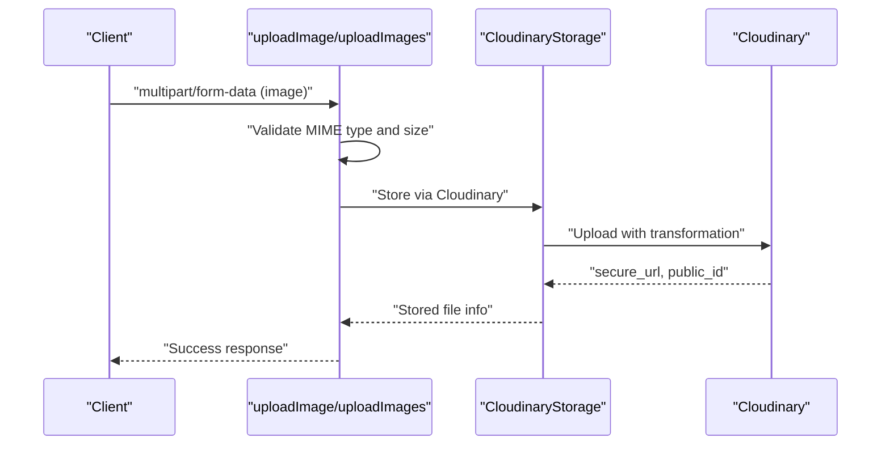
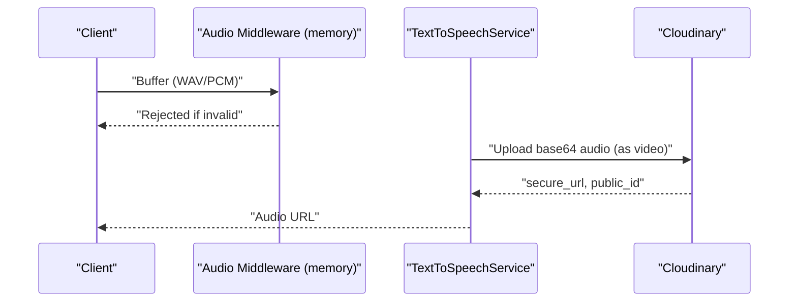
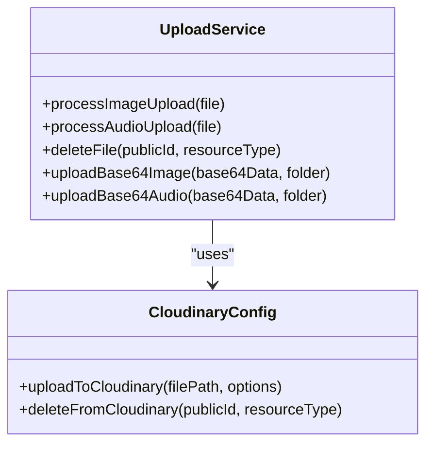
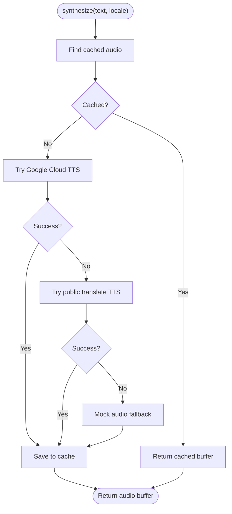
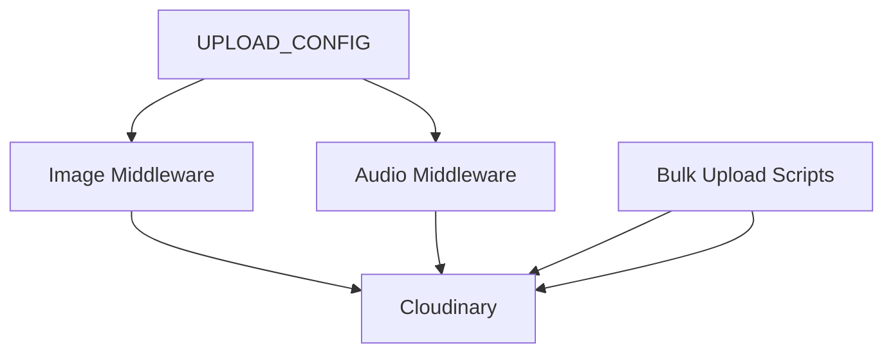
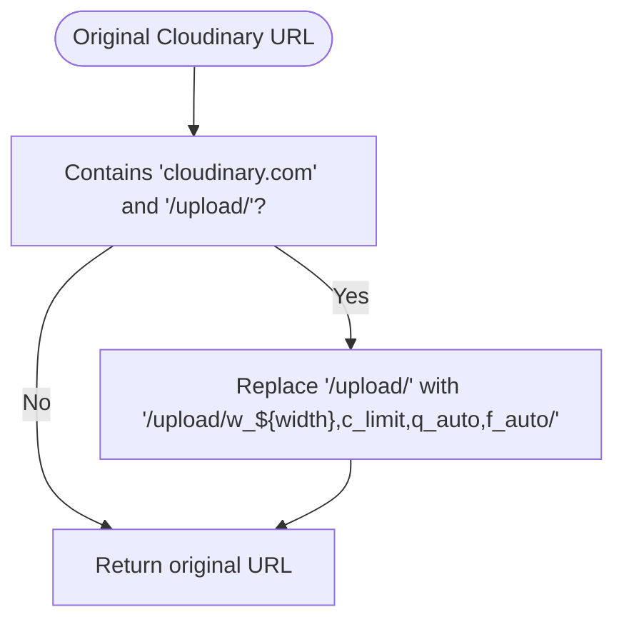
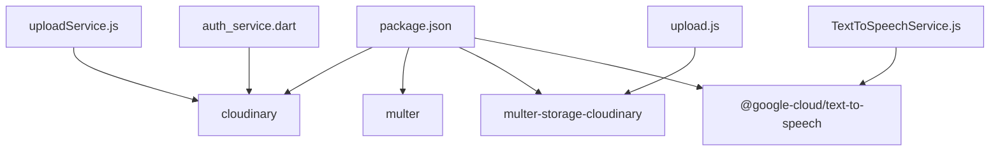

# Media Processing and Cloud Storage

<cite>
**Referenced Files in This Document**
- [cloudinary.js](file://backend/src/config/cloudinary.js)
- [upload.js](file://backend/src/middlewares/upload.js)
- [upload.middleware.js](file://backend/src/middlewares/upload.middleware.js)
- [uploadService.js](file://backend/src/services/uploadService.js)
- [index.js](file://backend/src/constants/index.js)
- [TextToSpeechService.js](file://backend/src/services/TextToSpeechService.js)
- [TtsCache.js](file://backend/src/models/TtsCache.js)
- [upload_images_to_cloudinary.js](file://backend/scratch/upload_images_to_cloudinary.js)
- [upload_assets.js](file://backend/scratch/upload_assets.js)
- [auth_service.dart](file://lib/services/auth_service.dart)
- [package.json](file://backend/package.json)
</cite>

## Table of Contents
1. [Introduction](#introduction)
2. [Project Structure](#project-structure)
3. [Core Components](#core-components)
4. [Architecture Overview](#architecture-overview)
5. [Detailed Component Analysis](#detailed-component-analysis)
6. [Dependency Analysis](#dependency-analysis)
7. [Performance Considerations](#performance-considerations)
8. [Troubleshooting Guide](#troubleshooting-guide)
9. [Conclusion](#conclusion)
10. [Appendices](#appendices)

## Introduction
This document explains how KhmerKid handles media processing and cloud storage integration. It covers Cloudinary configuration and usage, image and audio upload workflows, transformations, caching strategies, and frontend optimization for delivering multimedia content efficiently. It also documents the Text-to-Speech pipeline, storage optimization techniques, and security considerations for media access and bandwidth usage.

## Project Structure
The media stack spans backend services and frontend utilities:
- Backend configuration and services manage Cloudinary integration, file validation, and upload orchestration.
- Frontend Dart utilities optimize Cloudinary URLs for responsive delivery.
- Scripts assist with bulk uploads to Cloudinary.

**Diagram sources**
- [cloudinary.js:1-70](file://backend/src/config/cloudinary.js#L1-L70)
- [upload.js:1-119](file://backend/src/middlewares/upload.js#L1-L119)
- [upload.middleware.js:1-46](file://backend/src/middlewares/upload.middleware.js#L1-L46)
- [uploadService.js:1-83](file://backend/src/services/uploadService.js#L1-L83)
- [index.js:153-162](file://backend/src/constants/index.js#L153-L162)
- [TextToSpeechService.js:1-111](file://backend/src/services/TextToSpeechService.js#L1-L111)
- [TtsCache.js:1-38](file://backend/src/models/TtsCache.js#L1-L38)
- [upload_images_to_cloudinary.js:1-46](file://backend/scratch/upload_images_to_cloudinary.js#L1-L46)
- [upload_assets.js:1-39](file://backend/scratch/upload_assets.js#L1-L39)
- [auth_service.dart:85-91](file://lib/services/auth_service.dart#L85-L91)

**Section sources**
- [cloudinary.js:1-70](file://backend/src/config/cloudinary.js#L1-L70)
- [upload.js:1-119](file://backend/src/middlewares/upload.js#L1-L119)
- [upload.middleware.js:1-46](file://backend/src/middlewares/upload.middleware.js#L1-L46)
- [uploadService.js:1-83](file://backend/src/services/uploadService.js#L1-L83)
- [index.js:153-162](file://backend/src/constants/index.js#L153-L162)
- [TextToSpeechService.js:1-111](file://backend/src/services/TextToSpeechService.js#L1-L111)
- [TtsCache.js:1-38](file://backend/src/models/TtsCache.js#L1-L38)
- [upload_images_to_cloudinary.js:1-46](file://backend/scratch/upload_images_to_cloudinary.js#L1-L46)
- [upload_assets.js:1-39](file://backend/scratch/upload_assets.js#L1-L39)
- [auth_service.dart:85-91](file://lib/services/auth_service.dart#L85-L91)

## Core Components
- Cloudinary configuration and helpers for upload and deletion.
- Multer-based upload middlewares for images and audio.
- Upload service orchestrating Cloudinary operations and validation.
- TTS service with caching and fallbacks.
- Frontend URL optimization for Cloudinary delivery.

Key responsibilities:
- Validate file types and sizes.
- Transform images during upload.
- Store metadata (secure URL, public ID, dimensions, duration).
- Cache synthesized audio to reduce repeated synthesis.
- Optimize delivered URLs for responsiveness and bandwidth.

**Section sources**
- [cloudinary.js:10-18](file://backend/src/config/cloudinary.js#L10-L18)
- [upload.js:19-38](file://backend/src/middlewares/upload.js#L19-L38)
- [uploadService.js:14-82](file://backend/src/services/uploadService.js#L14-L82)
- [TextToSpeechService.js:9-107](file://backend/src/services/TextToSpeechService.js#L9-L107)
- [auth_service.dart:85-91](file://lib/services/auth_service.dart#L85-L91)

## Architecture Overview
The media pipeline integrates frontend and backend:
- Frontend requests optimized Cloudinary URLs.
- Backend validates and stores files via Cloudinary.
- Audio synthesis caches results for reuse.
- Bulk scripts support initial asset ingestion.

**Diagram sources**
- [upload.js:69-91](file://backend/src/middlewares/upload.js#L69-L91)
- [cloudinary.js:26-46](file://backend/src/config/cloudinary.js#L26-L46)
- [auth_service.dart:85-91](file://lib/services/auth_service.dart#L85-L91)

## Detailed Component Analysis

### Cloudinary Integration
Cloudinary is configured with environment variables and exposes upload and delete helpers. Upload returns standardized metadata including secure URL, public ID, format, dimensions, size, and duration.

**Diagram sources**
- [cloudinary.js:26-46](file://backend/src/config/cloudinary.js#L26-L46)

**Section sources**
- [cloudinary.js:10-18](file://backend/src/config/cloudinary.js#L10-L18)
- [cloudinary.js:26-46](file://backend/src/config/cloudinary.js#L26-L46)
- [cloudinary.js:54-63](file://backend/src/config/cloudinary.js#L54-L63)

### Image Upload Workflow
- Uses CloudinaryStorage with allowed formats and a transformation applied at upload time.
- Validates MIME types and enforces file size limits.
- Provides single and multiple image upload handlers.

**Diagram sources**
- [upload.js:19-38](file://backend/src/middlewares/upload.js#L19-L38)
- [upload.js:69-91](file://backend/src/middlewares/upload.js#L69-L91)

**Section sources**
- [upload.js:19-38](file://backend/src/middlewares/upload.js#L19-L38)
- [upload.js:43-60](file://backend/src/middlewares/upload.js#L43-L60)
- [upload.js:69-91](file://backend/src/middlewares/upload.js#L69-L91)

### Audio Upload Workflow
- Two pathways:
  - Multer-based CloudinaryStorage for web uploads (resource type mapped to video).
  - In-memory multer for PCM/WAV buffers (used by TTS pipeline).
- Audio middleware restricts formats and enforces size limits.

**Diagram sources**
- [upload.middleware.js:16-44](file://backend/src/middlewares/upload.middleware.js#L16-L44)
- [TextToSpeechService.js:66-85](file://backend/src/services/TextToSpeechService.js#L66-L85)
- [cloudinary.js:26-46](file://backend/src/config/cloudinary.js#L26-L46)

**Section sources**
- [upload.js:31-38](file://backend/src/middlewares/upload.js#L31-L38)
- [upload.middleware.js:16-44](file://backend/src/middlewares/upload.middleware.js#L16-L44)
- [TextToSpeechService.js:44-85](file://backend/src/services/TextToSpeechService.js#L44-L85)

### Upload Service Implementation
- Wraps Cloudinary operations with validation and error handling.
- Supports base64 uploads for images and audio.
- Exposes deletion by public ID.

**Diagram sources**
- [uploadService.js:14-82](file://backend/src/services/uploadService.js#L14-L82)
- [cloudinary.js:26-63](file://backend/src/config/cloudinary.js#L26-L63)

**Section sources**
- [uploadService.js:14-82](file://backend/src/services/uploadService.js#L14-L82)

### Text-to-Speech Pipeline
- Attempts Google Cloud TTS if credentials are present.
- Falls back to a public translate TTS endpoint.
- Stores synthesized audio in MongoDB cache keyed by text and locale.
- Expires cache after 30 days.

**Diagram sources**
- [TextToSpeechService.js:23-107](file://backend/src/services/TextToSpeechService.js#L23-L107)
- [TtsCache.js:9-30](file://backend/src/models/TtsCache.js#L9-L30)

**Section sources**
- [TextToSpeechService.js:9-107](file://backend/src/services/TextToSpeechService.js#L9-L107)
- [TtsCache.js:1-38](file://backend/src/models/TtsCache.js#L1-L38)

### Asset Management Strategies
- Centralized upload configuration (sizes, allowed types, folders).
- Bulk upload scripts for initial asset ingestion.
- Transformation pipeline embedded in Cloudinary storage configuration.

**Diagram sources**
- [index.js:155-162](file://backend/src/constants/index.js#L155-L162)
- [upload.js:19-38](file://backend/src/middlewares/upload.js#L19-L38)
- [upload_images_to_cloudinary.js:23-43](file://backend/scratch/upload_images_to_cloudinary.js#L23-L43)
- [upload_assets.js:15-36](file://backend/scratch/upload_assets.js#L15-L36)

**Section sources**
- [index.js:155-162](file://backend/src/constants/index.js#L155-L162)
- [upload_images_to_cloudinary.js:1-46](file://backend/scratch/upload_images_to_cloudinary.js#L1-L46)
- [upload_assets.js:1-39](file://backend/scratch/upload_assets.js#L1-L39)

### Frontend Cloudinary URL Optimization
- Applies automatic quality and format selection, and dimension-based scaling.
- Ensures only Cloudinary URLs are transformed.

**Diagram sources**
- [auth_service.dart:85-91](file://lib/services/auth_service.dart#L85-L91)

**Section sources**
- [auth_service.dart:85-91](file://lib/services/auth_service.dart#L85-L91)

## Dependency Analysis
External libraries and integrations:
- Cloudinary SDK for upload and delete operations.
- Multer and CloudinaryStorage for seamless uploads.
- Google Cloud Text-to-Speech for synthesis.
- MongoDB for TTS cache persistence.

**Diagram sources**
- [package.json:24-45](file://backend/package.json#L24-L45)
- [cloudinary.js](file://backend/src/config/cloudinary.js#L10)
- [upload.js:10-12](file://backend/src/middlewares/upload.js#L10-L12)
- [TextToSpeechService.js:47-48](file://backend/src/services/TextToSpeechService.js#L47-L48)
- [auth_service.dart](file://lib/services/auth_service.dart#L90)

**Section sources**
- [package.json:24-45](file://backend/package.json#L24-L45)

## Performance Considerations
- Image transformation at upload reduces downstream processing and ensures consistent sizing.
- Automatic quality and format selection minimize bandwidth while preserving perceived quality.
- TTS caching avoids repeated synthesis for identical text/locale pairs.
- Size limits prevent oversized uploads and reduce latency.

Recommendations:
- Use device-specific widths in frontend URL optimization to avoid over-delivery.
- Monitor Cloudinary transformation costs and adjust quality/auto settings based on content type.
- Consider pre-generating commonly used image sizes for high-traffic assets.

[No sources needed since this section provides general guidance]

## Troubleshooting Guide
Common issues and resolutions:
- Upload errors: Multer errors are caught and mapped to user-friendly messages; check file size and MIME type filters.
- Cloudinary failures: Inspect environment variables and network connectivity; verify upload options and resource types.
- TTS synthesis failures: Confirm Google Cloud credentials; fallback to public translate TTS if available.
- Cache misses: Ensure MongoDB is reachable and TTL settings are appropriate.

**Section sources**
- [upload.js:97-112](file://backend/src/middlewares/upload.js#L97-L112)
- [cloudinary.js:43-45](file://backend/src/config/cloudinary.js#L43-L45)
- [TextToSpeechService.js:61-84](file://backend/src/services/TextToSpeechService.js#L61-L84)
- [TtsCache.js](file://backend/src/models/TtsCache.js#L27)

## Conclusion
KhmerKid’s media stack leverages Cloudinary for robust upload, transformation, and delivery, with strict validation and sensible defaults. The TTS pipeline adds intelligent caching and fallbacks, while the frontend optimizes URLs for efficient delivery across devices. Together, these components provide a scalable and maintainable foundation for multimedia content management.

[No sources needed since this section summarizes without analyzing specific files]

## Appendices

### Configuration Options and Defaults
- Upload limits and allowed types are centralized for easy maintenance.
- Cloudinary folders separate images and audio under a consistent namespace.

**Section sources**
- [index.js:155-162](file://backend/src/constants/index.js#L155-L162)
- [upload.js:22-24](file://backend/src/middlewares/upload.js#L22-L24)
- [upload.js:34-36](file://backend/src/middlewares/upload.js#L34-L36)

### Security Considerations
- Secure Cloudinary URLs are enforced.
- File filters restrict accepted formats and sizes.
- Environment variables store Cloudinary credentials.

**Section sources**
- [cloudinary.js:13-18](file://backend/src/config/cloudinary.js#L13-L18)
- [upload.js:43-60](file://backend/src/middlewares/upload.js#L43-L60)
- [upload.middleware.js:16-36](file://backend/src/middlewares/upload.middleware.js#L16-L36)