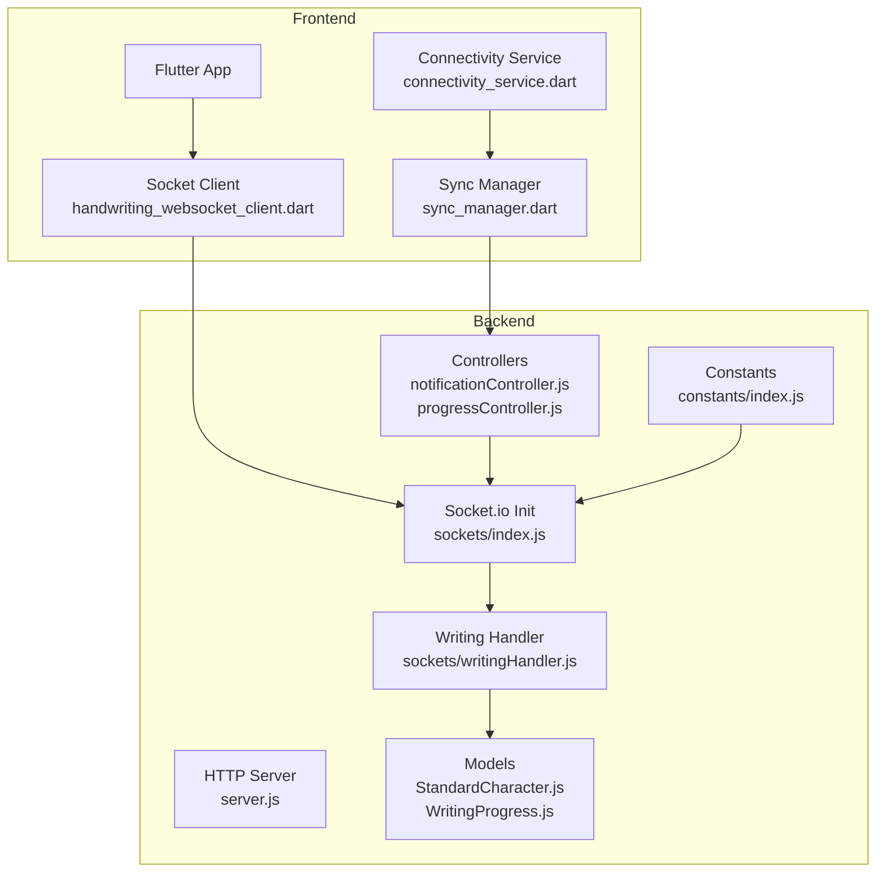
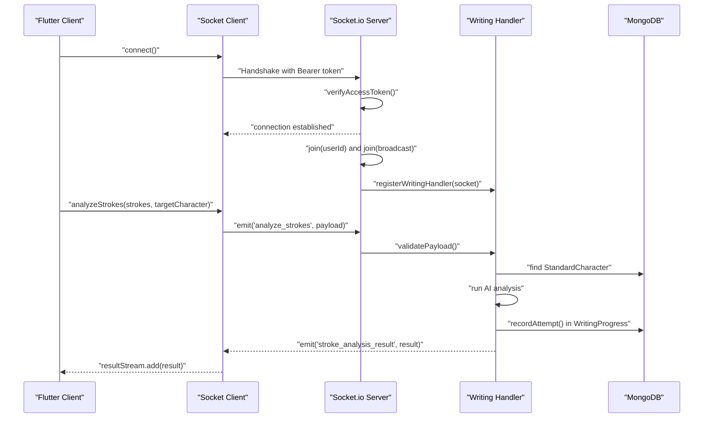
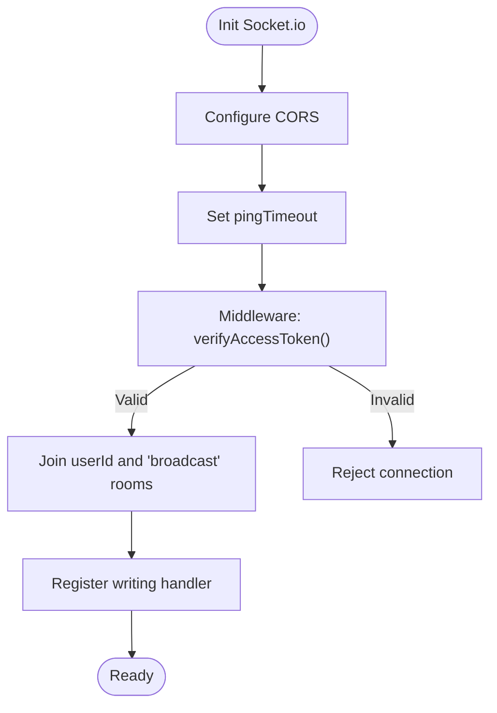
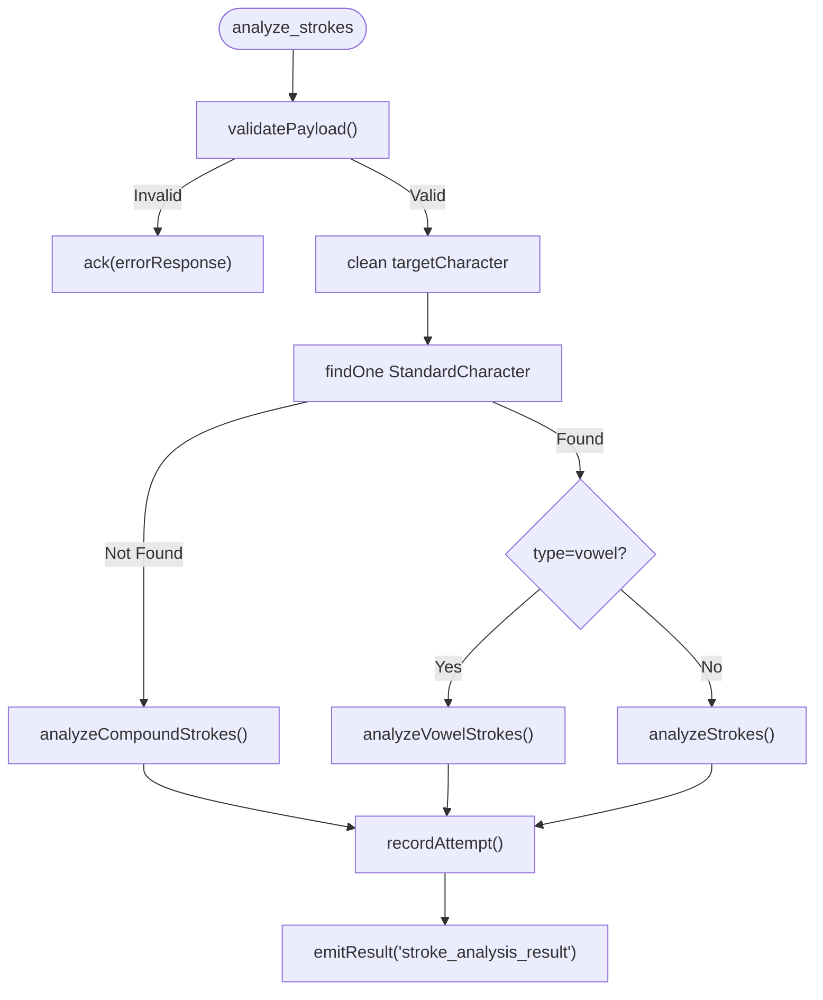
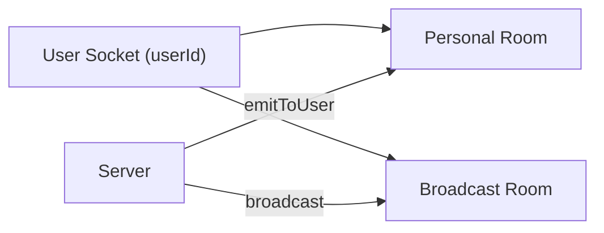
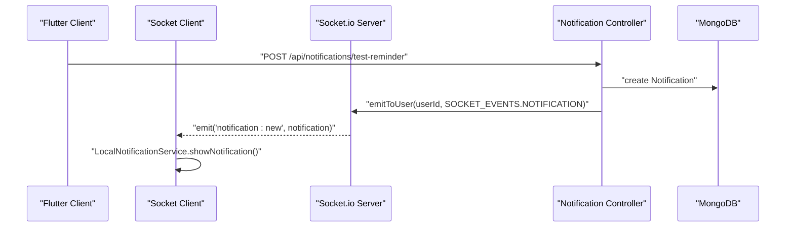
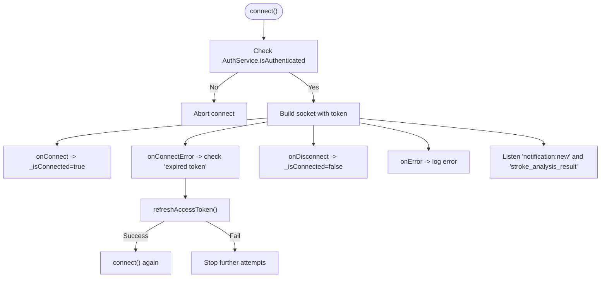
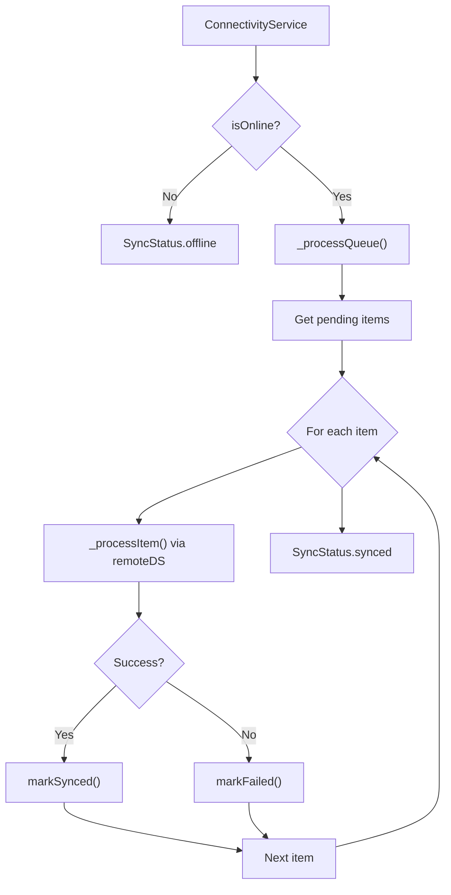
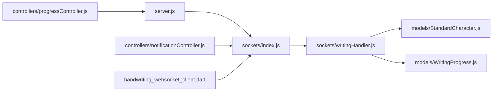

# Real-time Communication System

<cite>
**Referenced Files in This Document**
- [server.js](file://backend/server.js)
- [sockets/index.js](file://backend/src/sockets/index.js)
- [sockets/writingHandler.js](file://backend/src/sockets/writingHandler.js)
- [constants/index.js](file://backend/src/constants/index.js)
- [models/StandardCharacter.js](file://backend/src/models/StandardCharacter.js)
- [models/WritingProgress.js](file://backend/src/models/WritingProgress.js)
- [controllers/notificationController.js](file://backend/src/controllers/notificationController.js)
- [controllers/progressController.js](file://backend/src/controllers/progressController.js)
- [services/handwriting_websocket_client.dart](file://lib/services/handwriting_websocket_client.dart)
- [services/sync_manager.dart](file://lib/services/sync_manager.dart)
- [services/connectivity_service.dart](file://lib/services/connectivity_service.dart)
</cite>

## Table of Contents
1. [Introduction](#introduction)
2. [Project Structure](#project-structure)
3. [Core Components](#core-components)
4. [Architecture Overview](#architecture-overview)
5. [Detailed Component Analysis](#detailed-component-analysis)
6. [Dependency Analysis](#dependency-analysis)
7. [Performance Considerations](#performance-considerations)
8. [Troubleshooting Guide](#troubleshooting-guide)
9. [Conclusion](#conclusion)
10. [Appendices](#appendices)

## Introduction
This document explains the real-time communication system powering live updates and collaborative features in KhmerKid. It covers the Socket.io server setup, client connection lifecycle, event handling patterns, and room-based communication architecture. It documents how live progress updates, real-time notifications, and collaborative learning features are implemented, along with connection lifecycle management, error recovery mechanisms, and performance optimization strategies for concurrent connections. Examples of event-driven communication, message formatting, and state synchronization between clients and server are included, alongside scalability considerations, load balancing strategies, and monitoring approaches.

## Project Structure
The real-time system spans the backend Node.js server and the Flutter frontend:
- Backend
  - HTTP server and Socket.io initialization
  - Socket middleware for JWT authentication
  - Domain-specific handlers (writing analysis)
  - Models for StandardCharacter and WritingProgress
  - Controllers for notifications and progress
  - Constants defining socket events
- Frontend
  - Socket.IO client wrapper for real-time AI feedback
  - Connectivity and sync managers for offline-first behavior

**Diagram sources**
- [server.js:38-50](file://backend/server.js#L38-L50)
- [sockets/index.js:23-91](file://backend/src/sockets/index.js#L23-L91)
- [sockets/writingHandler.js:126-338](file://backend/src/sockets/writingHandler.js#L126-L338)
- [models/StandardCharacter.js:62-164](file://backend/src/models/StandardCharacter.js#L62-L164)
- [models/WritingProgress.js:89-250](file://backend/src/models/WritingProgress.js#L89-L250)
- [controllers/notificationController.js:11-142](file://backend/src/controllers/notificationController.js#L11-L142)
- [controllers/progressController.js:12-79](file://backend/src/controllers/progressController.js#L12-L79)
- [constants/index.js:210-222](file://backend/src/constants/index.js#L210-L222)
- [services/handwriting_websocket_client.dart:214-354](file://lib/services/handwriting_websocket_client.dart#L214-L354)
- [services/connectivity_service.dart:1-59](file://lib/services/connectivity_service.dart#L1-L59)
- [services/sync_manager.dart:1-245](file://lib/services/sync_manager.dart#L1-L245)

**Section sources**
- [server.js:38-50](file://backend/server.js#L38-L50)
- [sockets/index.js:23-91](file://backend/src/sockets/index.js#L23-L91)
- [constants/index.js:210-222](file://backend/src/constants/index.js#L210-L222)

## Core Components
- Socket.io server initialization with CORS and ping timeouts
- JWT-based authentication middleware for secure connections
- Room-based communication (user-specific and broadcast)
- Domain-specific handler for writing analysis
- Socket event constants for XP updates, level-ups, rank changes, badges, notifications, progress sync, and lesson events
- Frontend Socket client with automatic reconnection and token refresh
- Offline-first sync manager coordinating with REST APIs

Key responsibilities:
- Establish authenticated sessions and join rooms upon connection
- Validate and sanitize stroke data, run AI analysis, persist results, and emit feedback
- Emit real-time events to users and broadcast notifications
- Manage connection lifecycle, handle errors, and recover from token expiration

**Section sources**
- [sockets/index.js:23-91](file://backend/src/sockets/index.js#L23-L91)
- [sockets/index.js:107-126](file://backend/src/sockets/index.js#L107-L126)
- [constants/index.js:210-222](file://backend/src/constants/index.js#L210-L222)
- [services/handwriting_websocket_client.dart:214-354](file://lib/services/handwriting_websocket_client.dart#L214-L354)

## Architecture Overview
The system uses Socket.IO for real-time bidirectional communication. The backend authenticates clients via JWT, joins them to user-specific and broadcast rooms, registers domain handlers, and emits events. The frontend connects with automatic reconnection and token refresh, listens for notifications, and receives AI feedback results.

**Diagram sources**
- [sockets/index.js:65-87](file://backend/src/sockets/index.js#L65-L87)
- [sockets/writingHandler.js:142-288](file://backend/src/sockets/writingHandler.js#L142-L288)
- [models/StandardCharacter.js:62-164](file://backend/src/models/StandardCharacter.js#L62-L164)
- [models/WritingProgress.js:204-245](file://backend/src/models/WritingProgress.js#L204-L245)
- [services/handwriting_websocket_client.dart:379-436](file://lib/services/handwriting_websocket_client.dart#L379-L436)

## Detailed Component Analysis

### Socket.io Server Setup and Authentication
- Initializes Socket.io with CORS and ping timeout
- Authentication middleware validates JWT from handshake auth or query
- On connection:
  - Joins user-specific room and broadcast room
  - Registers domain handlers (writing)
  - Handles ping/pong and disconnect logs

**Diagram sources**
- [sockets/index.js:23-62](file://backend/src/sockets/index.js#L23-L62)
- [sockets/index.js:65-87](file://backend/src/sockets/index.js#L65-L87)

**Section sources**
- [sockets/index.js:23-91](file://backend/src/sockets/index.js#L23-L91)

### Writing Analysis Handler
- Validates incoming stroke data payload
- Resolves target character (handles dotted-circle prefix)
- Fetches golden path from StandardCharacter
- Runs AI analysis (compound/vowel/consonant)
- Persists result to WritingProgress
- Emits structured feedback to client

**Diagram sources**
- [sockets/writingHandler.js:142-288](file://backend/src/sockets/writingHandler.js#L142-L288)
- [models/StandardCharacter.js:62-164](file://backend/src/models/StandardCharacter.js#L62-L164)
- [models/WritingProgress.js:204-245](file://backend/src/models/WritingProgress.js#L204-L245)

**Section sources**
- [sockets/writingHandler.js:142-288](file://backend/src/sockets/writingHandler.js#L142-L288)
- [models/StandardCharacter.js:62-164](file://backend/src/models/StandardCharacter.js#L62-L164)
- [models/WritingProgress.js:204-245](file://backend/src/models/WritingProgress.js#L204-L245)

### Socket Events and Rooms
- Socket events defined centrally for XP updates, level-ups, rank changes, badges, notifications, progress sync, lesson completion/unlock
- Users join:
  - Personal room (userId)
  - Broadcast room ('broadcast')
- Utilities to emit to user or broadcast

**Diagram sources**
- [sockets/index.js:70-76](file://backend/src/sockets/index.js#L70-L76)
- [sockets/index.js:107-126](file://backend/src/sockets/index.js#L107-L126)
- [constants/index.js:210-222](file://backend/src/constants/index.js#L210-L222)

**Section sources**
- [sockets/index.js:70-76](file://backend/src/sockets/index.js#L70-L76)
- [sockets/index.js:107-126](file://backend/src/sockets/index.js#L107-L126)
- [constants/index.js:210-222](file://backend/src/constants/index.js#L210-L222)

### Real-time Notifications
- Backend controller supports fetching notifications, marking as read, and sending test reminders
- On test reminder, creates a notification and emits it to the user via socket event
- Frontend client listens for 'notification:new' and triggers local notifications

**Diagram sources**
- [controllers/notificationController.js:78-139](file://backend/src/controllers/notificationController.js#L78-L139)
- [sockets/index.js:107-126](file://backend/src/sockets/index.js#L107-L126)
- [services/handwriting_websocket_client.dart:304-321](file://lib/services/handwriting_websocket_client.dart#L304-L321)

**Section sources**
- [controllers/notificationController.js:78-139](file://backend/src/controllers/notificationController.js#L78-L139)
- [services/handwriting_websocket_client.dart:304-321](file://lib/services/handwriting_websocket_client.dart#L304-L321)

### Frontend Socket Client and Connection Lifecycle
- Connects to the backend using Bearer token from AuthService
- Enables websocket transport, auto-connect, reconnection, and force-new connection to ensure updated tokens
- Handles connection, disconnect, connect error, and error events
- Auto-refreshes token on authentication errors and reconnects
- Listens for 'notification:new' and 'stroke_analysis_result'
- Provides async and await-based analysis methods with timeouts

**Diagram sources**
- [services/handwriting_websocket_client.dart:214-354](file://lib/services/handwriting_websocket_client.dart#L214-L354)

**Section sources**
- [services/handwriting_websocket_client.dart:214-354](file://lib/services/handwriting_websocket_client.dart#L214-L354)

### Offline-First Sync and State Synchronization
- ConnectivityService monitors network status
- SyncManager coordinates background sync when online, retries failed items with exponential backoff, merges data, and resolves conflicts
- ProgressController exposes REST endpoints for progress retrieval, sync, lesson completion, and unlocking

**Diagram sources**
- [services/connectivity_service.dart:28-53](file://lib/services/connectivity_service.dart#L28-L53)
- [services/sync_manager.dart:76-210](file://lib/services/sync_manager.dart#L76-L210)
- [controllers/progressController.js:12-79](file://backend/src/controllers/progressController.js#L12-L79)

**Section sources**
- [services/connectivity_service.dart:28-53](file://lib/services/connectivity_service.dart#L28-L53)
- [services/sync_manager.dart:76-210](file://lib/services/sync_manager.dart#L76-L210)
- [controllers/progressController.js:12-79](file://backend/src/controllers/progressController.js#L12-L79)

## Dependency Analysis
- Backend server initializes Socket.io and makes it available to routes/controllers
- Socket handler depends on StandardCharacter and WritingProgress models
- Controllers depend on socket utilities to emit events to users
- Frontend client depends on AuthService for token and base URL

**Diagram sources**
- [server.js:49-50](file://backend/server.js#L49-L50)
- [sockets/index.js:126-133](file://backend/src/sockets/index.js#L126-L133)
- [sockets/writingHandler.js:19-23](file://backend/src/sockets/writingHandler.js#L19-L23)
- [models/StandardCharacter.js:1-20](file://backend/src/models/StandardCharacter.js#L1-L20)
- [models/WritingProgress.js:1-20](file://backend/src/models/WritingProgress.js#L1-L20)
- [controllers/notificationController.js:89-133](file://backend/src/controllers/notificationController.js#L89-L133)
- [services/handwriting_websocket_client.dart:231-249](file://lib/services/handwriting_websocket_client.dart#L231-L249)

**Section sources**
- [server.js:49-50](file://backend/server.js#L49-L50)
- [sockets/index.js:126-133](file://backend/src/sockets/index.js#L126-L133)
- [sockets/writingHandler.js:19-23](file://backend/src/sockets/writingHandler.js#L19-L23)
- [controllers/notificationController.js:89-133](file://backend/src/controllers/notificationController.js#L89-L133)
- [services/handwriting_websocket_client.dart:231-249](file://lib/services/handwriting_websocket_client.dart#L231-L249)

## Performance Considerations
- Connection scaling
  - Use sticky sessions or Redis adapter for multi-instance deployments to maintain room membership and broadcast semantics across nodes
  - Enable heartbeat and ping timeouts to detect stale connections
- Message throughput
  - Keep payloads minimal (only required stroke points and metadata)
  - Use acknowledgements for fire-and-forget events where appropriate
- Database writes
  - WritingProgress upsert is atomic; ensure indexes on userId and character combinations
  - Limit history size to reduce document growth
- Client resilience
  - Automatic reconnection with jitter and backoff
  - Token refresh on authentication errors to avoid repeated failures
- Monitoring
  - Track connection counts, event rates, and average processing latency
  - Log slow queries and frequent validation failures

[No sources needed since this section provides general guidance]

## Troubleshooting Guide
Common issues and resolutions:
- Authentication errors
  - Verify token presence and format; ensure Bearer prefix handling
  - On 'expired token' or 'Authentication error', the client refreshes the token and reconnects automatically
- Connection drops
  - Confirm CORS settings and client transport selection
  - Check ping timeout and network stability
- Slow analysis
  - Validate stroke data quality and point counts
  - Monitor AI analysis duration and database latency
- Notification delivery
  - Ensure user is in the correct rooms and emitToUser is invoked with the right userId

**Section sources**
- [sockets/index.js:34-62](file://backend/src/sockets/index.js#L34-L62)
- [services/handwriting_websocket_client.dart:263-297](file://lib/services/handwriting_websocket_client.dart#L263-L297)

## Conclusion
KhmerKid’s real-time system combines authenticated Socket.io connections, domain-specific handlers, and centralized event definitions to deliver live feedback, notifications, and progress updates. The frontend integrates robust connection lifecycle management with offline-first sync, while the backend ensures secure, scalable event distribution and efficient persistence of writing analytics. Together, these components enable responsive collaborative learning experiences with strong reliability and performance characteristics.

[No sources needed since this section summarizes without analyzing specific files]

## Appendices

### Socket Events Reference
- XP updates: 'xp:update'
- Level updates: 'level:update'
- Rank updates: 'rank:update'
- Badge unlocks: 'badge:unlock'
- New notification: 'notification:new'
- Streak updates: 'streak:update'
- Progress sync: 'progress:sync'
- Lesson completed: 'lesson:completed'
- Lesson unlocked: 'lesson:unlocked'

**Section sources**
- [constants/index.js:210-222](file://backend/src/constants/index.js#L210-L222)