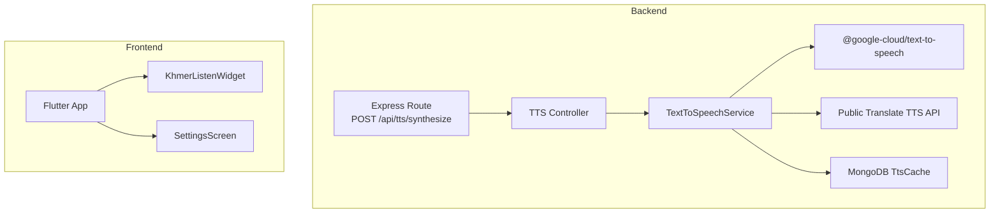
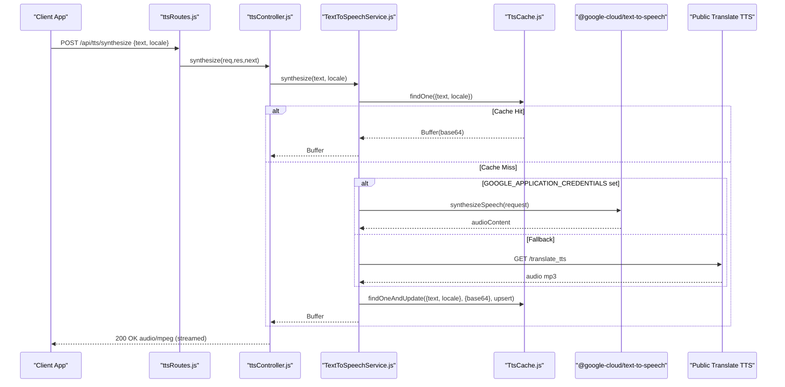
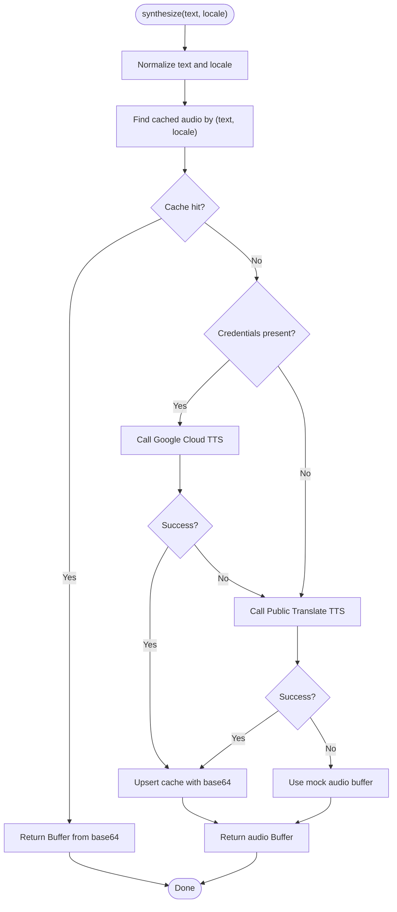
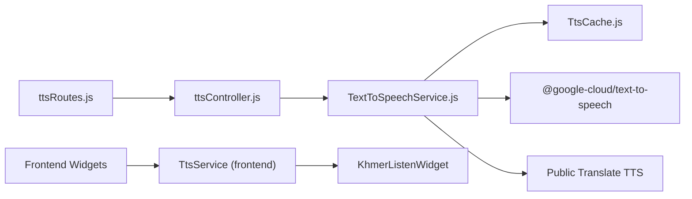

# Text-to-Speech Integration

<cite>
**Referenced Files in This Document**
- [ttsController.js](file://backend/src/controllers/ttsController.js)
- [TextToSpeechService.js](file://backend/src/services/TextToSpeechService.js)
- [TtsCache.js](file://backend/src/models/TtsCache.js)
- [ttsRoutes.js](file://backend/src/routes/ttsRoutes.js)
- [TTS_PROVIDER.md](file://backend/TTS_PROVIDER.md)
- [main.dart](file://lib/main.dart)
- [khmer_listen_widget.dart](file://lib/widgets/khmer_listen_widget.dart)
- [settings_screen.dart](file://lib/screens/settings/settings_screen.dart)
- [audio_validation_test.dart](file://test/audio_validation_test.dart)
- [README.md](file://assets/audio/khmer/README.md)
- [AUDIO_FIX_GUIDE.md](file://docs/AUDIO_FIX_GUIDE.md)
- [TextToSpeechService.test.js](file://backend/test/TextToSpeechService.test.js)
</cite>

## Table of Contents
1. [Introduction](#introduction)
2. [Project Structure](#project-structure)
3. [Core Components](#core-components)
4. [Architecture Overview](#architecture-overview)
5. [Detailed Component Analysis](#detailed-component-analysis)
6. [Dependency Analysis](#dependency-analysis)
7. [Performance Considerations](#performance-considerations)
8. [Troubleshooting Guide](#troubleshooting-guide)
9. [Conclusion](#conclusion)
10. [Appendices](#appendices)

## Introduction
This document explains the text-to-speech (TTS) integration in KhmerKid, covering backend TTS provider configuration, audio generation pipeline, voice quality management, offline support, caching strategies, and frontend integration patterns. It also documents configuration options for languages and voices, error handling, streaming capabilities, quality settings, pronunciation accuracy for Khmer script, and fallback mechanisms when TTS services are unavailable.

## Project Structure
The TTS system spans backend and frontend components:
- Backend exposes a REST endpoint to synthesize speech and integrates two TTS providers with a MongoDB cache.
- Frontend integrates TTS playback with audio asset prioritization and fallback to network TTS when assets are missing.

**Diagram sources**
- [ttsRoutes.js:11-12](file://backend/src/routes/ttsRoutes.js#L11-L12)
- [ttsController.js:11-30](file://backend/src/controllers/ttsController.js#L11-L30)
- [TextToSpeechService.js:44-85](file://backend/src/services/TextToSpeechService.js#L44-L85)
- [TtsCache.js:32-33](file://backend/src/models/TtsCache.js#L32-L33)
- [khmer_listen_widget.dart:99-109](file://lib/widgets/khmer_listen_widget.dart#L99-L109)
- [settings_screen.dart:413-450](file://lib/screens/settings/settings_screen.dart#L413-L450)

**Section sources**
- [ttsRoutes.js:11-12](file://backend/src/routes/ttsRoutes.js#L11-L12)
- [ttsController.js:11-30](file://backend/src/controllers/ttsController.js#L11-L30)
- [TextToSpeechService.js:23-107](file://backend/src/services/TextToSpeechService.js#L23-L107)
- [TtsCache.js:9-35](file://backend/src/models/TtsCache.js#L9-L35)
- [main.dart:19-77](file://lib/main.dart#L19-L77)

## Core Components
- Backend TTS controller and service:
  - Endpoint accepts text and locale, validates input, and streams audio/mp3.
  - Service implements a multi-provider synthesis pipeline with caching and fallbacks.
- MongoDB cache model:
  - Stores base64-encoded audio with a compound index and TTL expiration.
- Frontend integration:
  - Widgets initialize TTS, manage playback state, and integrate with audio assets.
  - Settings screen controls TTS speed and validates audio assets.

**Section sources**
- [ttsController.js:11-30](file://backend/src/controllers/ttsController.js#L11-L30)
- [TextToSpeechService.js:23-107](file://backend/src/services/TextToSpeechService.js#L23-L107)
- [TtsCache.js:9-35](file://backend/src/models/TtsCache.js#L9-L35)
- [khmer_listen_widget.dart:68-90](file://lib/widgets/khmer_listen_widget.dart#L68-L90)
- [settings_screen.dart:413-450](file://lib/screens/settings/settings_screen.dart#L413-L450)

## Architecture Overview
The backend synthesizes speech using Google Cloud Text-to-Speech when credentials are available, otherwise falls back to a public Translate TTS API. Results are cached in MongoDB for reuse. The frontend prefers local audio assets and falls back to TTS when assets are missing.

**Diagram sources**
- [ttsRoutes.js:11-12](file://backend/src/routes/ttsRoutes.js#L11-L12)
- [ttsController.js:11-30](file://backend/src/controllers/ttsController.js#L11-L30)
- [TextToSpeechService.js:31-104](file://backend/src/services/TextToSpeechService.js#L31-L104)
- [TtsCache.js:32-33](file://backend/src/models/TtsCache.js#L32-L33)

## Detailed Component Analysis

### Backend TTS Controller
- Validates presence of text payload.
- Delegates synthesis to the service with a default locale.
- Sets Content-Type and HTTP caching headers for mp3 responses.
- Streams audio buffer directly to clients.

**Section sources**
- [ttsController.js:11-30](file://backend/src/controllers/ttsController.js#L11-L30)

### TextToSpeechService
- Normalizes input text and locale.
- Cache-first lookup via MongoDB; logs hits and returns base64-decoded buffers.
- Provider selection:
  - Google Cloud Text-to-Speech if credentials are present; sets language code and gender.
  - Public Translate TTS API as fallback; includes a browser-like User-Agent header.
- Offline fallback produces a mock buffer for deterministic testing.
- Saves synthesized audio to cache after successful synthesis.

**Diagram sources**
- [TextToSpeechService.js:23-107](file://backend/src/services/TextToSpeechService.js#L23-L107)

**Section sources**
- [TextToSpeechService.js:23-107](file://backend/src/services/TextToSpeechService.js#L23-L107)

### MongoDB TtsCache Model
- Fields: text, locale, audioBase64, createdAt.
- Compound unique index on (text, locale) for fast lookups.
- TTL of 30 days via createdAt field to auto-expire old entries.

**Section sources**
- [TtsCache.js:9-35](file://backend/src/models/TtsCache.js#L9-L35)

### Frontend TTS Integration
- Initialization and lifecycle:
  - Widgets initialize TTS, register onStart/onComplete/onError handlers, and track playing state.
  - Disposal stops playback and releases resources.
- Playback control:
  - Speed setting applied before speaking.
  - Optional Vietnamese override for specific terms.
- Settings screen:
  - Controls TTS speed and demonstrates live preview with a test phrase.

**Section sources**
- [khmer_listen_widget.dart:68-90](file://lib/widgets/khmer_listen_widget.dart#L68-L90)
- [khmer_listen_widget.dart:99-109](file://lib/widgets/khmer_listen_widget.dart#L99-L109)
- [settings_screen.dart:413-450](file://lib/screens/settings/settings_screen.dart#L413-L450)

### Audio Asset Strategy and Fallback
- Priority: Local audio assets when available; fallback to TTS when missing.
- Critical consonants known to be mispronounced by TTS are flagged for immediate recording.
- Validation tests scan assets and produce reports; logs guide remediation.

**Section sources**
- [README.md:1-46](file://assets/audio/khmer/README.md#L1-L46)
- [AUDIO_FIX_GUIDE.md:1-316](file://docs/AUDIO_FIX_GUIDE.md#L1-L316)
- [audio_validation_test.dart:185-196](file://test/audio_validation_test.dart#L185-L196)

## Dependency Analysis
- Route depends on controller.
- Controller depends on service.
- Service depends on cache model and external providers.
- Frontend widgets depend on TTS service initialization and settings.

**Diagram sources**
- [ttsRoutes.js:11-12](file://backend/src/routes/ttsRoutes.js#L11-L12)
- [ttsController.js:11-30](file://backend/src/controllers/ttsController.js#L11-L30)
- [TextToSpeechService.js:44-85](file://backend/src/services/TextToSpeechService.js#L44-L85)
- [TtsCache.js:32-33](file://backend/src/models/TtsCache.js#L32-L33)
- [khmer_listen_widget.dart:68-90](file://lib/widgets/khmer_listen_widget.dart#L68-L90)

**Section sources**
- [ttsRoutes.js:11-12](file://backend/src/routes/ttsRoutes.js#L11-L12)
- [ttsController.js:11-30](file://backend/src/controllers/ttsController.js#L11-L30)
- [TextToSpeechService.js:44-85](file://backend/src/services/TextToSpeechService.js#L44-L85)
- [TtsCache.js:32-33](file://backend/src/models/TtsCache.js#L32-L33)
- [khmer_listen_widget.dart:68-90](file://lib/widgets/khmer_listen_widget.dart#L68-L90)

## Performance Considerations
- HTTP caching: Responses are served with a 30-day max-age header to reduce repeated requests.
- Database caching: MongoDB cache avoids redundant synthesis; TTL ensures freshness.
- Provider selection: Prefer Google Cloud TTS when available for higher fidelity; public Translate TTS reduces cost and complexity.
- Frontend optimization: Initialize TTS once, reuse players, and stop playback on dispose to prevent resource leaks.

**Section sources**
- [ttsController.js:20-24](file://backend/src/controllers/ttsController.js#L20-L24)
- [TtsCache.js:27-28](file://backend/src/models/TtsCache.js#L27-L28)
- [TextToSpeechService.js:44-85](file://backend/src/services/TextToSpeechService.js#L44-L85)
- [khmer_listen_widget.dart:93-97](file://lib/widgets/khmer_listen_widget.dart#L93-L97)

## Troubleshooting Guide
- Empty text errors: Controller returns a 400 error when text is missing.
- Cache query/save failures: Logged but do not block synthesis; fallback continues.
- Google Cloud TTS errors: Logged and skipped; public Translate TTS is attempted.
- Public Translate TTS failures: Logged and skipped; mock audio buffer is used for tests.
- Audio asset gaps: Validation tests and logs indicate missing files; prioritize critical consonants.
- Frontend playback issues: Ensure TTS is initialized, handle onError to reset UI state, and stop playback on dispose.

**Section sources**
- [ttsController.js:14-16](file://backend/src/controllers/ttsController.js#L14-L16)
- [TextToSpeechService.js:38-40](file://backend/src/services/TextToSpeechService.js#L38-L40)
- [TextToSpeechService.js:61-63](file://backend/src/services/TextToSpeechService.js#L61-L63)
- [TextToSpeechService.js:82-84](file://backend/src/services/TextToSpeechService.js#L82-L84)
- [TextToSpeechService.js:88-91](file://backend/src/services/TextToSpeechService.js#L88-L91)
- [audio_validation_test.dart:36-101](file://test/audio_validation_test.dart#L36-L101)
- [khmer_listen_widget.dart:80-86](file://lib/widgets/khmer_listen_widget.dart#L80-L86)
- [khmer_listen_widget.dart:93-97](file://lib/widgets/khmer_listen_widget.dart#L93-L97)

## Conclusion
KhmerKid’s TTS integration combines a robust backend synthesis pipeline with intelligent caching and multiple fallback providers, while the frontend prioritizes high-quality audio assets and gracefully falls back to TTS when needed. The system balances quality, reliability, and performance, with clear diagnostics and remediation pathways for pronunciation accuracy and asset completeness.

## Appendices

### API Usage Examples
- Endpoint: POST /api/tts/synthesize
  - Request body: { text: string, locale: string }
  - Response: audio/mpeg stream with 30-day caching headers
- Example usage paths:
  - [ttsRoutes.js:11-12](file://backend/src/routes/ttsRoutes.js#L11-L12)
  - [ttsController.js:11-30](file://backend/src/controllers/ttsController.js#L11-L30)

**Section sources**
- [ttsRoutes.js:11-12](file://backend/src/routes/ttsRoutes.js#L11-L12)
- [ttsController.js:11-30](file://backend/src/controllers/ttsController.js#L11-L30)

### Configuration Options
- Languages and locales:
  - Supported locales include km (Khmer) and vi (Vietnamese) with appropriate language codes.
  - Unsupported locales fall back to public Translate TTS or mock audio.
- Voice quality:
  - Google Cloud TTS provides high-fidelity neural voices when credentials are configured.
  - Public Translate TTS offers production-grade neural voice recordings without authentication.
- Streaming:
  - Responses are streamed as audio/mpeg with Content-Length and Cache-Control headers.

**Section sources**
- [TextToSpeechService.js:50-57](file://backend/src/services/TextToSpeechService.js#L50-L57)
- [TextToSpeechService.js:66-85](file://backend/src/services/TextToSpeechService.js#L66-L85)
- [ttsController.js:20-24](file://backend/src/controllers/ttsController.js#L20-L24)

### Audio File Generation and Naming
- Directory structure and naming conventions:
  - Consonants, vowels, numbers organized under assets/audio/khmer/.
  - File naming follows lowercase romanized forms with numeric suffixes for duplicates.
- Quality guidelines:
  - MP3, mono channels, 16kHz or 44.1kHz sample rate, 128kbps bitrate, 0.5–1.5s length.
- Validation:
  - Automated tests scan for missing files and produce actionable reports.

**Section sources**
- [README.md:1-46](file://assets/audio/khmer/README.md#L1-L46)
- [AUDIO_FIX_GUIDE.md:31-129](file://docs/AUDIO_FIX_GUIDE.md#L31-L129)
- [audio_validation_test.dart:162-198](file://test/audio_validation_test.dart#L162-L198)

### Offline Support Mechanisms
- Backend:
  - Mock audio buffer fallback for offline scenarios during testing.
  - Previously cached audio remains playable via MongoDB TTL-based cache.
- Frontend:
  - Audio asset strategy prioritizes local files; missing assets trigger TTS fallback.

**Section sources**
- [TextToSpeechService.js:88-91](file://backend/src/services/TextToSpeechService.js#L88-L91)
- [TtsCache.js:27-28](file://backend/src/models/TtsCache.js#L27-L28)
- [README.md:40-46](file://assets/audio/khmer/README.md#L40-L46)

### Testing and Quality Assurance
- Backend unit tests:
  - Verify cache hit behavior, synthesis returns audio buffers, and unsupported locales fallback gracefully.
- Frontend tests:
  - Validate audio asset presence, naming conventions, and TTS initialization.

**Section sources**
- [TextToSpeechService.test.js:18-51](file://backend/test/TextToSpeechService.test.js#L18-L51)
- [audio_validation_test.dart:185-196](file://test/audio_validation_test.dart#L185-L196)