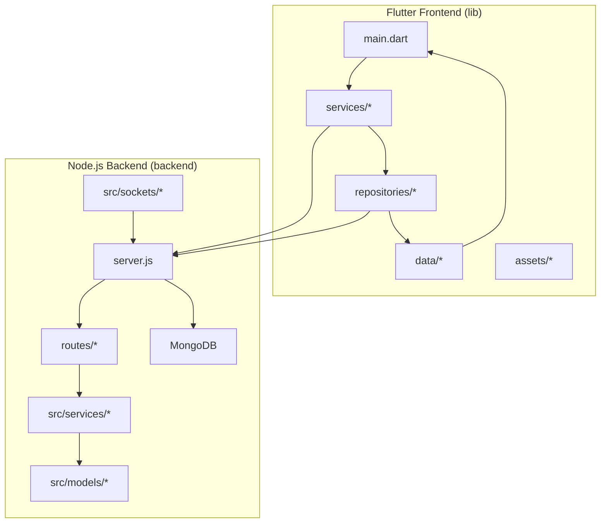
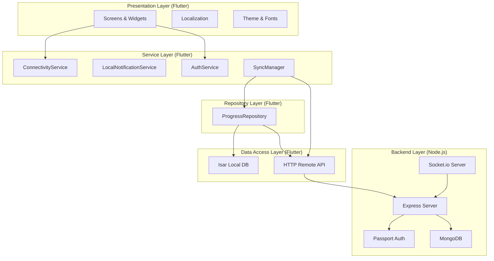
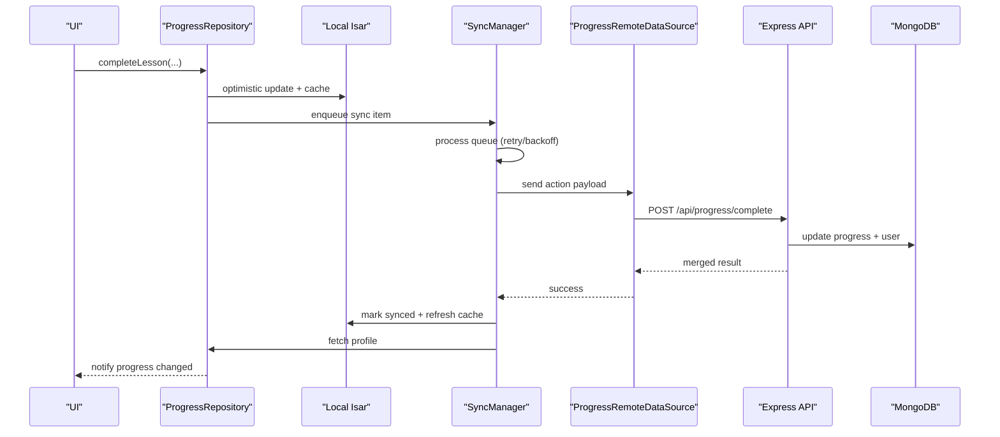
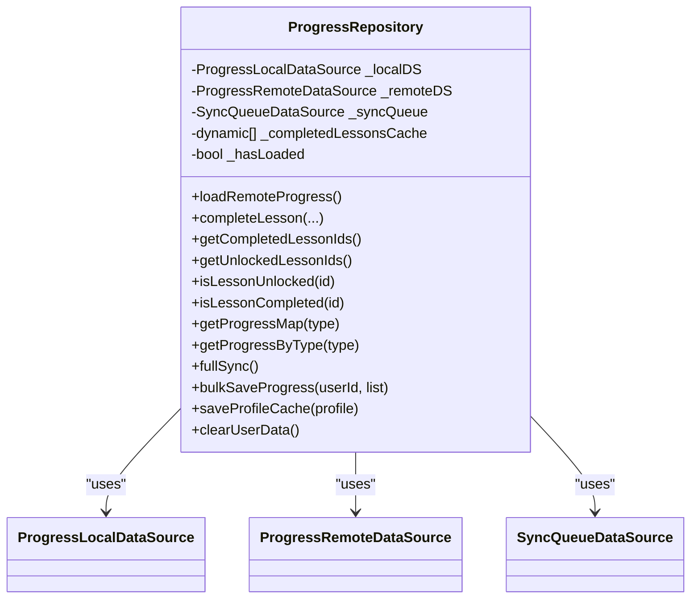
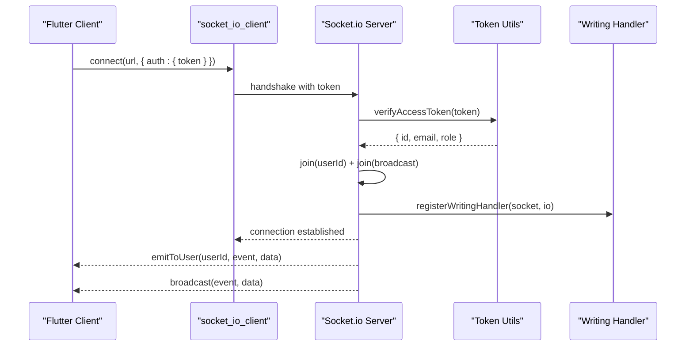
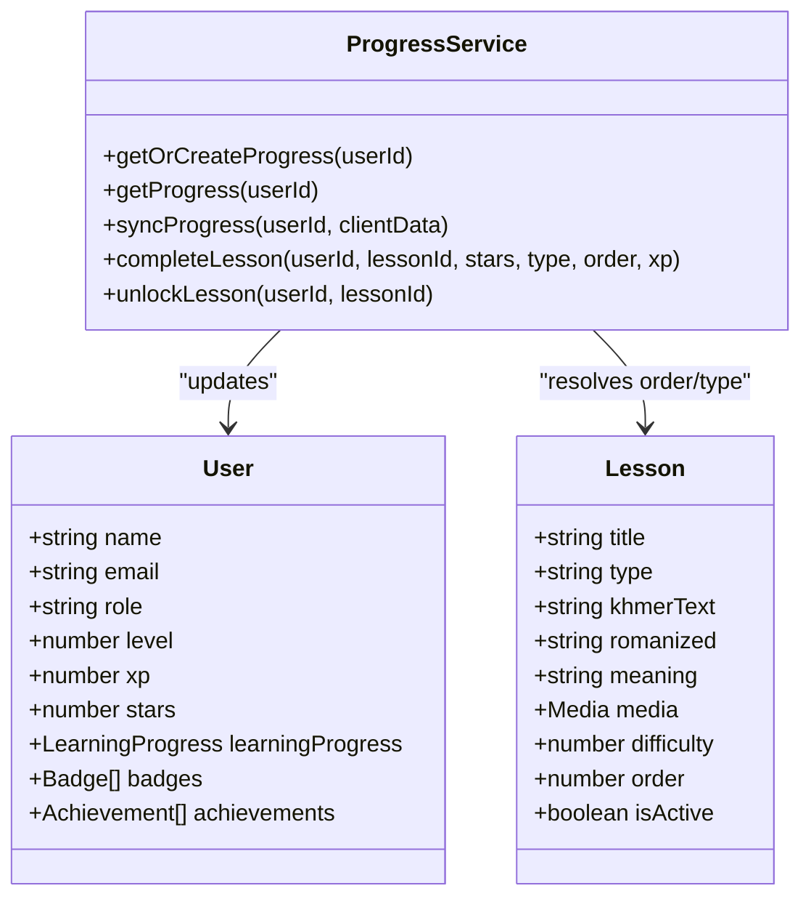
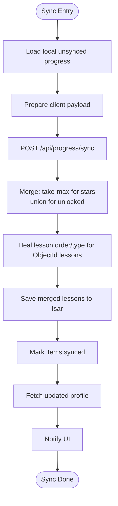
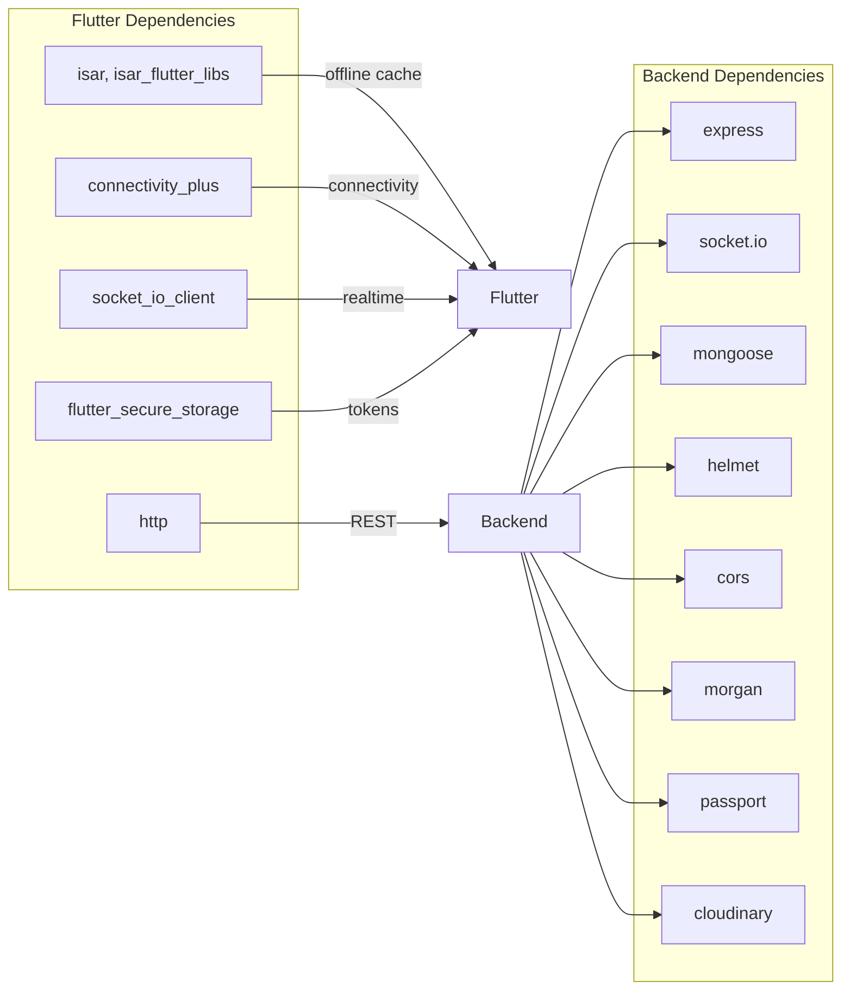

# Architecture Overview

<cite>
**Referenced Files in This Document**
- [lib/main.dart](file://lib/main.dart)
- [backend/server.js](file://backend/server.js)
- [pubspec.yaml](file://pubspec.yaml)
- [backend/package.json](file://backend/package.json)
- [lib/data/local/local_database.dart](file://lib/data/local/local_database.dart)
- [lib/services/sync_manager.dart](file://lib/services/sync_manager.dart)
- [lib/repositories/progress_repository.dart](file://lib/repositories/progress_repository.dart)
- [backend/src/sockets/index.js](file://backend/src/sockets/index.js)
- [backend/src/services/progressService.js](file://backend/src/services/progressService.js)
- [backend/src/models/User.js](file://backend/src/models/User.js)
- [backend/src/models/Lesson.js](file://backend/src/models/Lesson.js)
</cite>

## Table of Contents
1. [Introduction](#introduction)
2. [Project Structure](#project-structure)
3. [Core Components](#core-components)
4. [Architecture Overview](#architecture-overview)
5. [Detailed Component Analysis](#detailed-component-analysis)
6. [Dependency Analysis](#dependency-analysis)
7. [Performance Considerations](#performance-considerations)
8. [Troubleshooting Guide](#troubleshooting-guide)
9. [Conclusion](#conclusion)

## Introduction
This document presents the architecture of the KhmerKid application, a hybrid system that combines a Flutter frontend with a Node.js backend. The system follows an offline-first design with intelligent synchronization, ensuring learners can continue studying even without network connectivity. Real-time communication is enabled via Socket.io for immediate feedback and notifications. The backend implements a layered architecture with presentation, business logic, data access, and persistence layers, while the frontend applies the repository pattern and a service layer to orchestrate offline caching, conflict resolution, and background synchronization.

## Project Structure
The repository is organized into three primary areas:
- Flutter frontend under lib/, containing presentation, services, repositories, models, and data access layers.
- Node.js backend under backend/, implementing Express.js APIs, Socket.io real-time features, and Mongoose-based persistence.
- Shared assets and documentation under assets/ and docs/.

**Diagram sources**
- [lib/main.dart:1-129](file://lib/main.dart#L1-L129)
- [backend/server.js:1-160](file://backend/server.js#L1-L160)

**Section sources**
- [lib/main.dart:1-129](file://lib/main.dart#L1-L129)
- [backend/server.js:1-160](file://backend/server.js#L1-L160)

## Core Components
- Flutter Application Bootstrap: Initializes local database, connectivity, language, and notifications; sets up automatic server detection and auto-login; launches the app with localized themes and routing based on authentication state.
- Local Database (Isar): Provides offline-first persistence with schema migrations from SharedPreferences, supporting caches for lessons, progress, achievements, and game results.
- Sync Manager: Orchestrates offline-first synchronization with retry/backoff, conflict resolution (take-max), and periodic background sync.
- Repository Pattern (ProgressRepository): Encapsulates data access and business logic for progress, coordinating between local Isar and remote APIs, with optimistic UI updates and cache healing.
- Backend Server: Express.js with Helmet/CORS/Morgan middleware, Passport authentication, Socket.io real-time events, and route handlers for progress and other features.
- Socket.io Realtime: JWT-authenticated connections, per-user rooms, and event broadcasting for XP updates, unlocks, and writing feedback.
- Domain Services (ProgressService): Implements bidirectional sync with take-max strategy, lesson completion, unlocking, and gamification updates.

**Section sources**
- [lib/main.dart:21-77](file://lib/main.dart#L21-L77)
- [lib/data/local/local_database.dart:34-61](file://lib/data/local/local_database.dart#L34-L61)
- [lib/services/sync_manager.dart:46-74](file://lib/services/sync_manager.dart#L46-L74)
- [lib/repositories/progress_repository.dart:17-39](file://lib/repositories/progress_repository.dart#L17-L39)
- [backend/server.js:38-90](file://backend/server.js#L38-L90)
- [backend/src/sockets/index.js:23-91](file://backend/src/sockets/index.js#L23-L91)
- [backend/src/services/progressService.js:14-304](file://backend/src/services/progressService.js#L14-L304)

## Architecture Overview
The system employs a hybrid offline-first architecture:
- Presentation Layer (Flutter): Screens, widgets, localization, and theme management.
- Service Layer (Flutter): Connectivity, notifications, authentication, and sync coordination.
- Repository Layer (Flutter): Data orchestration, optimistic updates, and offline-first logic.
- Data Access Layer (Flutter): Isar local database and HTTP remote data sources.
- Backend Layer (Node.js): Express API, Socket.io, Passport auth, and Mongoose models.

**Diagram sources**
- [lib/main.dart:19-77](file://lib/main.dart#L19-L77)
- [lib/services/sync_manager.dart:21-43](file://lib/services/sync_manager.dart#L21-L43)
- [lib/repositories/progress_repository.dart:19-39](file://lib/repositories/progress_repository.dart#L19-L39)
- [backend/server.js:38-90](file://backend/server.js#L38-L90)
- [backend/src/sockets/index.js:23-91](file://backend/src/sockets/index.js#L23-L91)

## Detailed Component Analysis

### Offline-First Architecture and Intelligent Synchronization
The offline-first design ensures immediate user actions are persisted locally and synchronized later when connectivity resumes. The SyncManager coordinates:
- Connectivity monitoring and automatic background sync.
- Pending queue processing with FIFO ordering.
- Exponential backoff for retries.
- Conflict resolution using a take-max strategy for stars and union for unlocked lessons.
- Post-sync profile refresh and cleanup of processed items.

**Diagram sources**
- [lib/repositories/progress_repository.dart:109-161](file://lib/repositories/progress_repository.dart#L109-L161)
- [lib/services/sync_manager.dart:77-155](file://lib/services/sync_manager.dart#L77-L155)
- [backend/src/services/progressService.js:157-301](file://backend/src/services/progressService.js#L157-L301)

**Section sources**
- [lib/services/sync_manager.dart:46-236](file://lib/services/sync_manager.dart#L46-L236)
- [lib/repositories/progress_repository.dart:109-346](file://lib/repositories/progress_repository.dart#L109-L346)

### Repository Pattern Implementation
The ProgressRepository encapsulates:
- Remote loading with lesson order/type healing for invalid or missing metadata.
- Optimistic UI updates and RAM cache for completed lessons.
- Full bidirectional sync with conflict resolution and local Isar updates.
- Profile caching and legacy SharedPreferences synchronization.

**Diagram sources**
- [lib/repositories/progress_repository.dart:19-416](file://lib/repositories/progress_repository.dart#L19-L416)

**Section sources**
- [lib/repositories/progress_repository.dart:19-416](file://lib/repositories/progress_repository.dart#L19-L416)

### Real-Time Communication with Socket.io
The backend initializes Socket.io with JWT authentication, joins users to personal and broadcast rooms, registers domain-specific handlers, and supports ping/pong diagnostics. The frontend integrates socket clients via socket_io_client to receive real-time updates.

**Diagram sources**
- [backend/src/sockets/index.js:23-91](file://backend/src/sockets/index.js#L23-L91)
- [pubspec.yaml:43-43](file://pubspec.yaml#L43-L43)

**Section sources**
- [backend/src/sockets/index.js:1-134](file://backend/src/sockets/index.js#L1-L134)
- [pubspec.yaml:43-43](file://pubspec.yaml#L43-L43)

### Backend Layer: Models and Services
The backend defines core models and services:
- User model: gamification fields, learning progress, badges, achievements, and ranking.
- Lesson model: khmerText, romanized, meaning, examples, media, difficulty, order, categories, and skill-specific content.
- ProgressService: bidirectional sync with take-max, lesson completion, unlocking, and user XP/stars updates.

**Diagram sources**
- [backend/src/models/User.js:14-243](file://backend/src/models/User.js#L14-L243)
- [backend/src/models/Lesson.js:13-155](file://backend/src/models/Lesson.js#L13-L155)
- [backend/src/services/progressService.js:14-304](file://backend/src/services/progressService.js#L14-L304)

**Section sources**
- [backend/src/models/User.js:14-243](file://backend/src/models/User.js#L14-L243)
- [backend/src/models/Lesson.js:13-155](file://backend/src/models/Lesson.js#L13-L155)
- [backend/src/services/progressService.js:14-304](file://backend/src/services/progressService.js#L14-L304)

### Data Flow and Conflict Resolution
Bidirectional sync resolves conflicts using a take-max strategy for stars and union for unlocked lessons. Lesson order/type healing ensures consistency when metadata is missing or incorrect.

**Diagram sources**
- [lib/repositories/progress_repository.dart:261-346](file://lib/repositories/progress_repository.dart#L261-L346)
- [backend/src/services/progressService.js:62-155](file://backend/src/services/progressService.js#L62-L155)

**Section sources**
- [lib/repositories/progress_repository.dart:261-346](file://lib/repositories/progress_repository.dart#L261-L346)
- [backend/src/services/progressService.js:62-155](file://backend/src/services/progressService.js#L62-L155)

## Dependency Analysis
- Flutter dependencies include isar, connectivity_plus, socket_io_client, http, and others enabling offline-first, connectivity detection, and real-time features.
- Backend dependencies include Express, Socket.io, Mongoose, Helmet, CORS, Morgan, Passport, and Cloudinary for media.

**Diagram sources**
- [pubspec.yaml:39-48](file://pubspec.yaml#L39-L48)
- [backend/package.json:24-45](file://backend/package.json#L24-L45)

**Section sources**
- [pubspec.yaml:39-48](file://pubspec.yaml#L39-L48)
- [backend/package.json:24-45](file://backend/package.json#L24-L45)

## Performance Considerations
- Offline-first reduces latency and improves responsiveness by persisting actions locally and deferring network calls.
- Isar’s embedded database minimizes overhead compared to SQLite, with efficient indexing and schema migrations.
- Socket.io’s lightweight event model and JWT authentication reduce handshake overhead.
- Exponential backoff prevents thundering herds during network outages.
- Optimistic UI updates and RAM caches minimize perceived delays for lesson completion and unlocks.
- Periodic background sync ensures eventual consistency without blocking user workflows.

## Troubleshooting Guide
- Connectivity Issues: Verify ConnectivityService subscriptions and ensure periodic sync timers are active. Confirm network availability before attempting manual sync triggers.
- Sync Failures: Inspect SyncManager logs for failed items and retry counts. Review exponential backoff behavior and queued items.
- Authentication Errors: Validate JWT tokens passed to Socket.io and REST endpoints. Ensure token verification succeeds and user rooms are joined.
- Data Inconsistencies: Check lesson order/type healing logic and ensure ObjectId validation before applying corrections.
- Real-time Events: Confirm Socket.io initialization, authentication middleware, and room joining. Use ping/pong diagnostics to verify connections.

**Section sources**
- [lib/services/sync_manager.dart:77-155](file://lib/services/sync_manager.dart#L77-L155)
- [backend/src/sockets/index.js:34-62](file://backend/src/sockets/index.js#L34-L62)
- [backend/src/services/progressService.js:62-155](file://backend/src/services/progressService.js#L62-L155)

## Conclusion
KhmerKid’s architecture blends Flutter’s reactive UI with a robust Node.js backend to deliver an offline-first, real-time learning experience. The repository pattern and service layer in the frontend coordinate intelligent synchronization, while the backend’s layered design ensures maintainable business logic and scalable persistence. Socket.io enables immediate feedback, and careful conflict resolution guarantees data integrity across devices and networks.