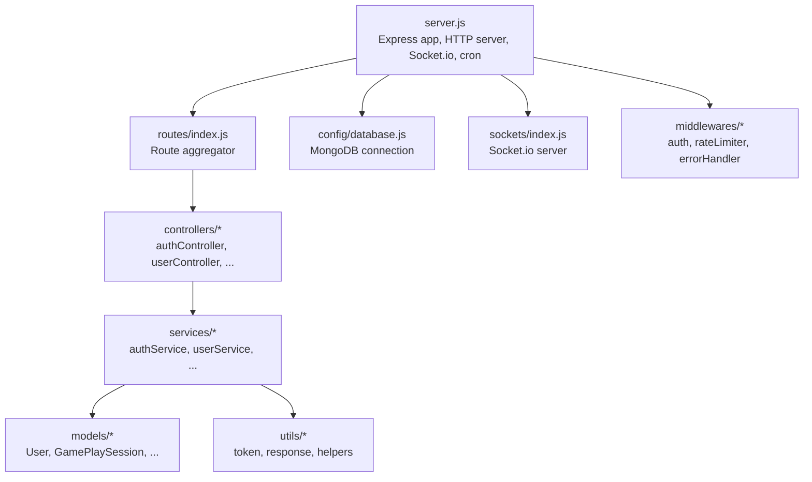
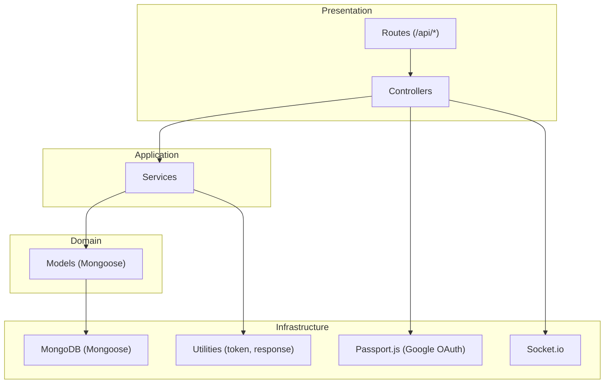
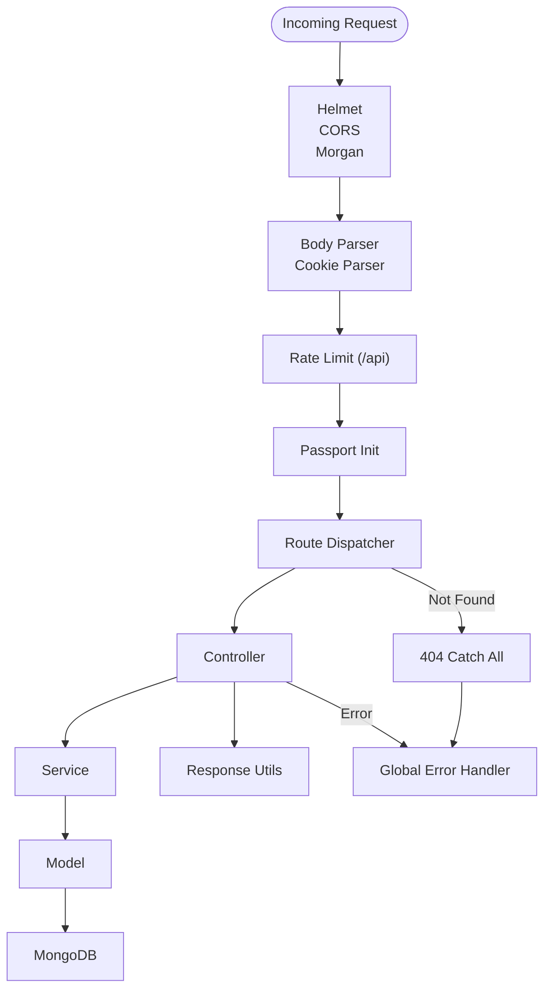
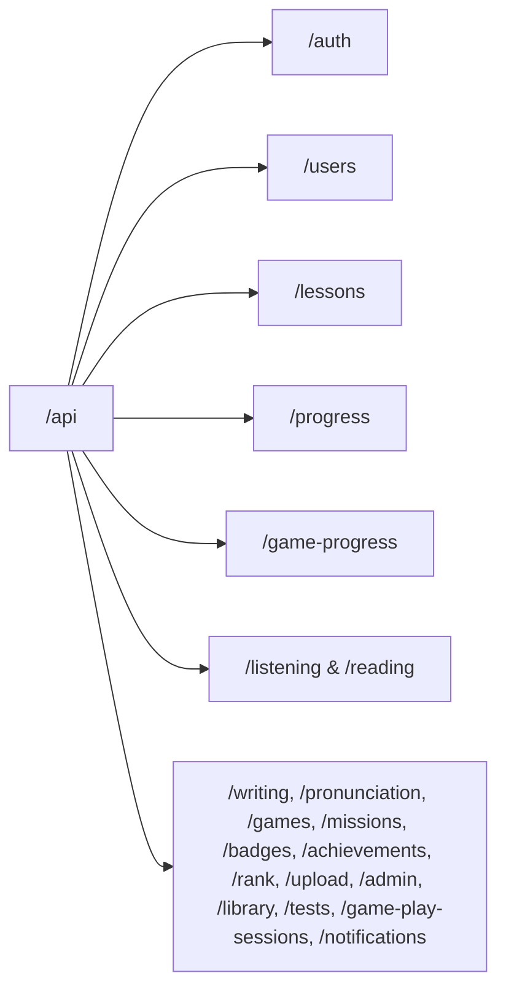
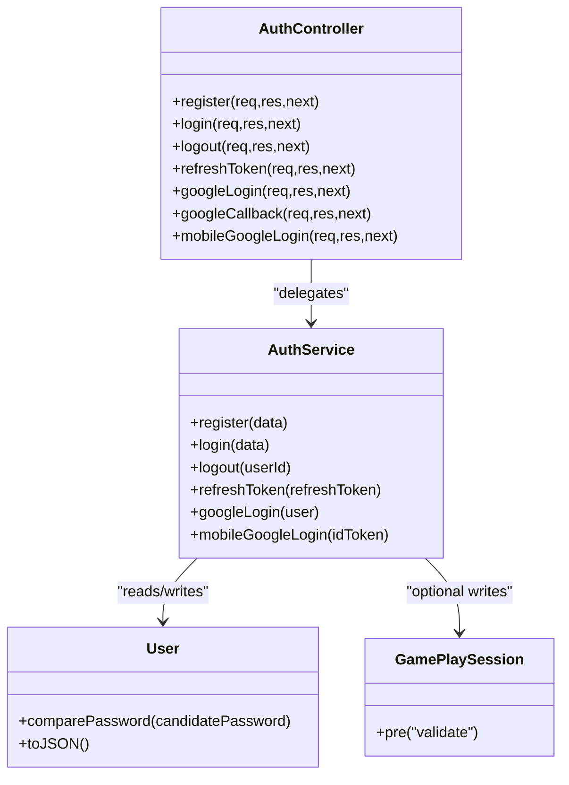
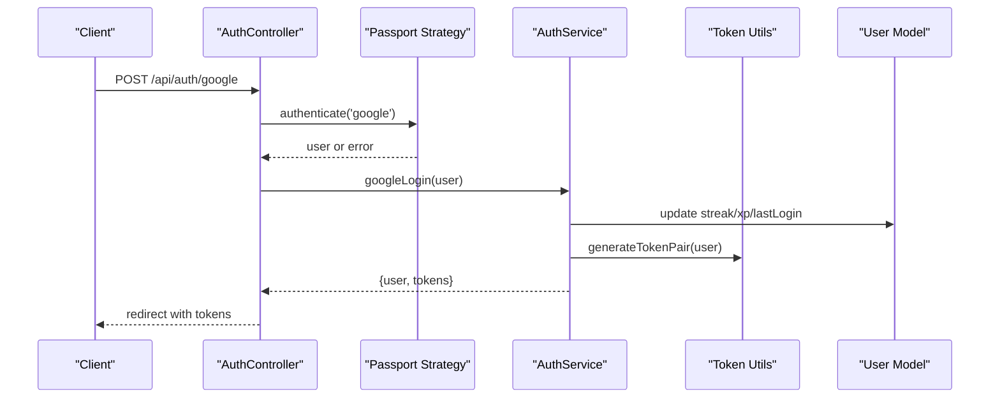
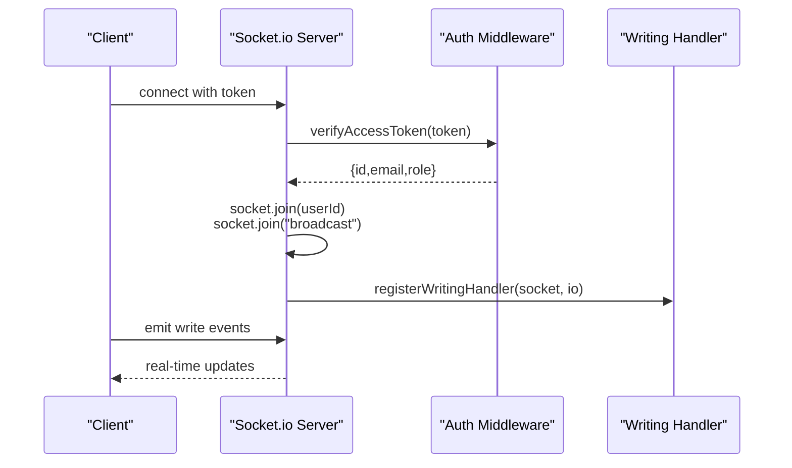
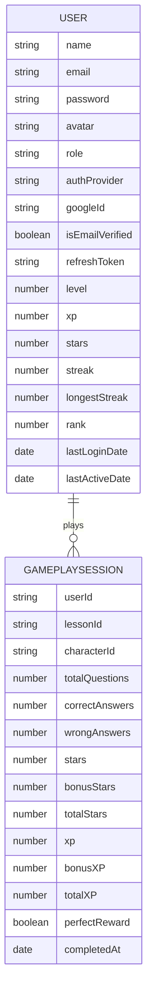
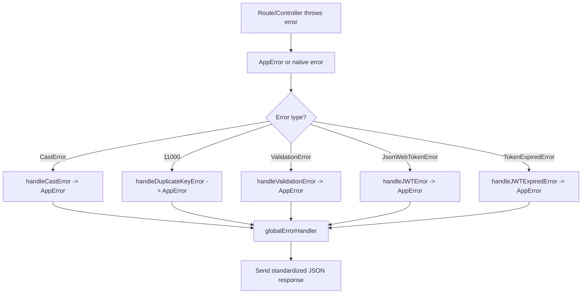
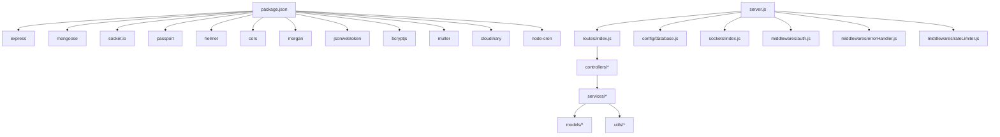

# Backend Architecture (Node.js)

<cite>
**Referenced Files in This Document**
- [server.js](file://backend/server.js)
- [package.json](file://backend/package.json)
- [database.js](file://backend/src/config/database.js)
- [passport.js](file://backend/src/config/passport.js)
- [index.js](file://backend/src/routes/index.js)
- [auth.js](file://backend/src/middlewares/auth.js)
- [errorHandler.js](file://backend/src/middlewares/errorHandler.js)
- [rateLimiter.js](file://backend/src/middlewares/rateLimiter.js)
- [authController.js](file://backend/src/controllers/authController.js)
- [authService.js](file://backend/src/services/authService.js)
- [index.js](file://backend/src/sockets/index.js)
- [User.js](file://backend/src/models/User.js)
- [GamePlaySession.js](file://backend/src/models/GamePlaySession.js)
- [token.js](file://backend/src/utils/token.js)
- [response.js](file://backend/src/utils/response.js)
</cite>

## Table of Contents
1. [Introduction](#introduction)
2. [Project Structure](#project-structure)
3. [Core Components](#core-components)
4. [Architecture Overview](#architecture-overview)
5. [Detailed Component Analysis](#detailed-component-analysis)
6. [Dependency Analysis](#dependency-analysis)
7. [Performance Considerations](#performance-considerations)
8. [Security Measures](#security-measures)
9. [Scalability and Microservices](#scalability-and-microservices)
10. [Troubleshooting Guide](#troubleshooting-guide)
11. [Conclusion](#conclusion)

## Introduction
This document describes the backend architecture for the KhmerKid Node.js server. It covers the Express.js setup, middleware stack, routing patterns, MVC implementation, authentication with Passport.js, Socket.io real-time integration, database abstraction via Mongoose, error handling, security controls, API design patterns, and considerations for scaling and microservices.

## Project Structure
The backend follows a layered, feature-based organization:
- Entry point initializes Express, connects to MongoDB, sets up Socket.io and cron jobs, mounts routes, and applies global middleware.
- Configuration files define database connection, authentication strategy, and environment settings.
- Routes aggregate feature-specific route modules under the /api prefix.
- Controllers handle HTTP requests and delegate to services.
- Services encapsulate business logic and coordinate with models.
- Models define Mongoose schemas and pre-save hooks.
- Middlewares implement cross-cutting concerns like authentication, rate limiting, and error handling.
- Utilities provide shared helpers for tokens, responses, and helpers.
- Sockets manage real-time events and user rooms.

**Diagram sources**
- [server.js:38-121](file://backend/server.js#L38-L121)
- [index.js:9-49](file://backend/src/routes/index.js#L9-L49)
- [database.js:16-40](file://backend/src/config/database.js#L16-L40)
- [index.js:23-91](file://backend/src/sockets/index.js#L23-L91)
- [auth.js:18-50](file://backend/src/middlewares/auth.js#L18-L50)
- [rateLimiter.js:19-28](file://backend/src/middlewares/rateLimiter.js#L19-L28)
- [errorHandler.js:61-92](file://backend/src/middlewares/errorHandler.js#L61-L92)
- [authController.js:13-91](file://backend/src/controllers/authController.js#L13-L91)
- [authService.js:16-249](file://backend/src/services/authService.js#L16-L249)
- [User.js:14-176](file://backend/src/models/User.js#L14-L176)
- [GamePlaySession.js:3-97](file://backend/src/models/GamePlaySession.js#L3-L97)
- [token.js:39-50](file://backend/src/utils/token.js#L39-L50)
- [response.js:17-28](file://backend/src/utils/response.js#L17-L28)

**Section sources**
- [server.js:38-121](file://backend/server.js#L38-L121)
- [index.js:9-49](file://backend/src/routes/index.js#L9-L49)

## Core Components
- Express server bootstrap with Helmet, CORS, Morgan, body parsing, cookie parsing, rate limiting, and Passport initialization.
- MongoDB connection with retry logic and graceful shutdown handling.
- Centralized Socket.io server with JWT-based authentication and user-specific rooms.
- Route aggregation mounting multiple feature routes under /api.
- Authentication middleware validating JWT and attaching user context.
- Global error handling with AppError class and type-specific handlers.
- Rate limiting configurations for general, auth, and upload endpoints.
- Standardized response utilities for consistent API responses.
- Token utilities for JWT generation, verification, and extraction.

**Section sources**
- [server.js:58-121](file://backend/server.js#L58-L121)
- [database.js:16-63](file://backend/src/config/database.js#L16-L63)
- [index.js:23-133](file://backend/src/sockets/index.js#L23-L133)
- [index.js:9-49](file://backend/src/routes/index.js#L9-L49)
- [auth.js:18-77](file://backend/src/middlewares/auth.js#L18-L77)
- [errorHandler.js:13-97](file://backend/src/middlewares/errorHandler.js#L13-L97)
- [rateLimiter.js:19-64](file://backend/src/middlewares/rateLimiter.js#L19-L64)
- [response.js:17-81](file://backend/src/utils/response.js#L17-L81)
- [token.js:39-88](file://backend/src/utils/token.js#L39-L88)

## Architecture Overview
The system uses a classic layered architecture:
- Presentation Layer: Express routes and controllers.
- Application Layer: Services implementing business logic.
- Domain Layer: Models and database operations.
- Infrastructure Layer: Database connectivity, authentication, Socket.io, and utilities.

**Diagram sources**
- [server.js:24-29](file://backend/server.js#L24-L29)
- [index.js:12-23](file://backend/src/routes/index.js#L12-L23)
- [authController.js:13-91](file://backend/src/controllers/authController.js#L13-L91)
- [authService.js:16-249](file://backend/src/services/authService.js#L16-L249)
- [User.js:14-176](file://backend/src/models/User.js#L14-L176)
- [GamePlaySession.js:3-97](file://backend/src/models/GamePlaySession.js#L3-L97)
- [passport.js:14-65](file://backend/src/config/passport.js#L14-L65)
- [index.js:23-91](file://backend/src/sockets/index.js#L23-L91)
- [token.js:39-88](file://backend/src/utils/token.js#L39-L88)
- [response.js:17-81](file://backend/src/utils/response.js#L17-L81)

## Detailed Component Analysis

### Express Setup and Middleware Stack
- Security: Helmet sets secure headers; CORS allows configured origin with credentials; rate limiting applied to /api/.
- Logging: Morgan logs requests in development or production format.
- Body parsing: JSON and URL-encoded bodies with size limits; cookie parsing enabled.
- Passport: Strategy loaded and initialized; controllers use Passport for Google OAuth.
- Health check: GET /api/health endpoint returns server status.
- Error handling: 404 catch-all and global error handler.

**Diagram sources**
- [server.js:58-121](file://backend/server.js#L58-L121)
- [auth.js:18-50](file://backend/src/middlewares/auth.js#L18-L50)
- [rateLimiter.js:19-28](file://backend/src/middlewares/rateLimiter.js#L19-L28)
- [errorHandler.js:61-92](file://backend/src/middlewares/errorHandler.js#L61-L92)
- [response.js:17-28](file://backend/src/utils/response.js#L17-L28)

**Section sources**
- [server.js:58-121](file://backend/server.js#L58-L121)

### Routing Patterns
- Route aggregator mounts feature routes under /api with logical prefixes (e.g., /users, /lessons, /progress, /games, /missions, /badges, /achievements, /rank, /upload, /admin, /library, /tests, /game-play-sessions, /notifications).
- Controllers implement CRUD-like actions per resource.

**Diagram sources**
- [index.js:28-47](file://backend/src/routes/index.js#L28-L47)

**Section sources**
- [index.js:9-49](file://backend/src/routes/index.js#L9-L49)

### MVC Pattern Implementation
- Controllers: Thin HTTP handlers delegating to services (e.g., AuthController).
- Services: Encapsulate business logic (e.g., AuthService).
- Models: Define schemas and lifecycle hooks (e.g., User, GamePlaySession).

**Diagram sources**
- [authController.js:13-91](file://backend/src/controllers/authController.js#L13-L91)
- [authService.js:16-249](file://backend/src/services/authService.js#L16-L249)
- [User.js:213-231](file://backend/src/models/User.js#L213-L231)
- [GamePlaySession.js:100-110](file://backend/src/models/GamePlaySession.js#L100-L110)

**Section sources**
- [authController.js:13-91](file://backend/src/controllers/authController.js#L13-L91)
- [authService.js:16-249](file://backend/src/services/authService.js#L16-L249)
- [User.js:14-176](file://backend/src/models/User.js#L14-L176)
- [GamePlaySession.js:3-97](file://backend/src/models/GamePlaySession.js#L3-L97)

### Authentication System (Passport.js + JWT)
- Passport Google OAuth strategy creates or links users, sets verified flag, and updates last login date.
- JWT-based sessionless authentication middleware extracts token from Authorization header or cookie, verifies it, and attaches user to request.
- Token utilities generate access/refresh pairs, verify tokens, and extract tokens.
- Auth controller exposes endpoints for registration, login, logout, token refresh, and Google OAuth flows.

**Diagram sources**
- [authController.js:55-79](file://backend/src/controllers/authController.js#L55-L79)
- [passport.js:14-65](file://backend/src/config/passport.js#L14-L65)
- [authService.js:137-162](file://backend/src/services/authService.js#L137-L162)
- [token.js:39-50](file://backend/src/utils/token.js#L39-L50)
- [User.js:185-207](file://backend/src/models/User.js#L185-L207)

**Section sources**
- [passport.js:14-82](file://backend/src/config/passport.js#L14-L82)
- [auth.js:18-50](file://backend/src/middlewares/auth.js#L18-L50)
- [token.js:39-88](file://backend/src/utils/token.js#L39-L88)
- [authController.js:13-91](file://backend/src/controllers/authController.js#L13-L91)
- [authService.js:16-249](file://backend/src/services/authService.js#L16-L249)
- [User.js:185-231](file://backend/src/models/User.js#L185-L231)

### Socket.io Integration (Real-Time Communication)
- Socket.io server initialized with CORS and ping timeout.
- Authentication middleware validates JWT from handshake (headers or query), attaches user to socket, and joins user-specific and broadcast rooms.
- Domain-specific handlers registered (e.g., writing).
- Utility functions to emit to user or broadcast.

**Diagram sources**
- [index.js:23-91](file://backend/src/sockets/index.js#L23-L91)
- [index.js:107-126](file://backend/src/sockets/index.js#L107-L126)

**Section sources**
- [index.js:23-133](file://backend/src/sockets/index.js#L23-L133)

### Database Abstraction Layer (Mongoose)
- MongoDB connection with retry logic, timeouts, and graceful shutdown.
- Models define schemas, indexes, pre-save hooks (password hashing, XP-to-level calculation), and methods (comparePassword, toJSON).
- GamePlaySession enforces data integrity via pre-validate hook.

**Diagram sources**
- [database.js:16-40](file://backend/src/config/database.js#L16-L40)
- [User.js:14-176](file://backend/src/models/User.js#L14-L176)
- [GamePlaySession.js:3-97](file://backend/src/models/GamePlaySession.js#L3-L97)

**Section sources**
- [database.js:16-63](file://backend/src/config/database.js#L16-L63)
- [User.js:14-243](file://backend/src/models/User.js#L14-L243)
- [GamePlaySession.js:3-115](file://backend/src/models/GamePlaySession.js#L3-L115)

### Error Handling Strategies
- AppError class with operational error tagging and status derivation.
- Specific handlers for CastError, duplicate key, validation errors, and JWT errors.
- Global error handler logs in development, normalizes error responses, and sends standardized JSON.

**Diagram sources**
- [errorHandler.js:13-97](file://backend/src/middlewares/errorHandler.js#L13-L97)
- [errorHandler.js:61-92](file://backend/src/middlewares/errorHandler.js#L61-L92)

**Section sources**
- [errorHandler.js:13-97](file://backend/src/middlewares/errorHandler.js#L13-L97)

### API Design Patterns
- Consistent response format: { success, message, data?, errors?, pagination? }.
- Standardized status codes and helper methods for success, created, error, and paginated responses.
- Controllers call services and use response utilities to keep endpoints thin.

**Section sources**
- [response.js:17-81](file://backend/src/utils/response.js#L17-L81)
- [authController.js:13-91](file://backend/src/controllers/authController.js#L13-L91)

## Dependency Analysis
External dependencies include Express, Mongoose, Socket.io, Passport, Helmet, CORS, Morgan, JWT, bcrypt, multer/cloudinary, and cron. Internal dependencies form a clean separation of concerns with controllers depending on services, services on models and utilities, and routes on controllers.

**Diagram sources**
- [package.json:24-45](file://backend/package.json#L24-L45)
- [server.js:24-29](file://backend/server.js#L24-L29)

**Section sources**
- [package.json:24-45](file://backend/package.json#L24-L45)
- [server.js:24-29](file://backend/server.js#L24-L29)

## Performance Considerations
- Connection pooling and timeouts are configured in the database connection for reliability.
- Rate limiting reduces load and prevents abuse; development mode increases limits for convenience.
- Body size limits prevent large payloads from overwhelming memory.
- Socket.io pingTimeout helps detect dead connections promptly.
- Consider adding caching for frequently accessed resources, database indexing for hot queries, and horizontal scaling behind a load balancer.

[No sources needed since this section provides general guidance]

## Security Measures
- Helmet secures headers; CORS restricts origins and methods; Morgan logs requests for audit trails.
- JWT-based authentication with separate access and refresh tokens; refresh tokens stored securely on the server.
- Passwords hashed with bcrypt; sensitive fields excluded from API responses.
- Passport Google OAuth handles external identity and auto-links accounts.
- Rate limiting protects against brute force and abuse.
- Input validation via express-validator is used in conjunction with Mongoose validation.

**Section sources**
- [server.js:59-89](file://backend/server.js#L59-L89)
- [token.js:39-88](file://backend/src/utils/token.js#L39-L88)
- [User.js:197-207](file://backend/src/models/User.js#L197-L207)
- [auth.js:18-50](file://backend/src/middlewares/auth.js#L18-L50)
- [rateLimiter.js:19-64](file://backend/src/middlewares/rateLimiter.js#L19-L64)

## Scalability and Microservices
- Horizontal scaling: Run multiple Node.js instances behind a reverse proxy/load balancer; persist sessions externally if needed.
- Database: Ensure replica sets and proper sharding for high write/read volumes; consider read replicas.
- Real-time: Use Redis-backed Socket.io cluster module or a managed WebSocket service for multi-instance deployments.
- Microservices: Extract domain services (e.g., user, progress, games) into separate bounded contexts; expose internal APIs or message queues for inter-service communication.
- Caching: Introduce Redis for session storage, rate limiting buckets, and cache heavy reads.
- Observability: Add metrics, structured logging, and distributed tracing.

[No sources needed since this section provides general guidance]

## Troubleshooting Guide
- MongoDB connection failures: Check MONGO_URI, network, and retry logic; confirm graceful shutdown hooks.
- Authentication errors: Verify JWT secrets, token expiration, and middleware order; ensure cookies are sent with credentials.
- Socket.io auth failures: Confirm token presence and validity in handshake; check CORS configuration.
- 404 Not Found: Review route mounts and trailing slashes; ensure catch-all is registered after route mounts.
- Rate limit exceeded: Adjust RATE_LIMIT_MAX/RATE_LIMIT_WINDOW_MS or differentiate endpoints with dedicated limiters.
- Validation errors: Inspect Mongoose ValidationError messages and custom validators.

**Section sources**
- [database.js:16-63](file://backend/src/config/database.js#L16-L63)
- [auth.js:18-50](file://backend/src/middlewares/auth.js#L18-L50)
- [index.js:34-62](file://backend/src/sockets/index.js#L34-L62)
- [errorHandler.js:61-92](file://backend/src/middlewares/errorHandler.js#L61-L92)
- [rateLimiter.js:19-64](file://backend/src/middlewares/rateLimiter.js#L19-L64)

## Conclusion
The backend employs a clean, layered architecture with Express, Passport, Socket.io, and Mongoose. It emphasizes security, consistency, and maintainability through standardized responses, robust error handling, and modular services. With appropriate scaling strategies and observability, the system can support growth while preserving a clear separation of concerns.