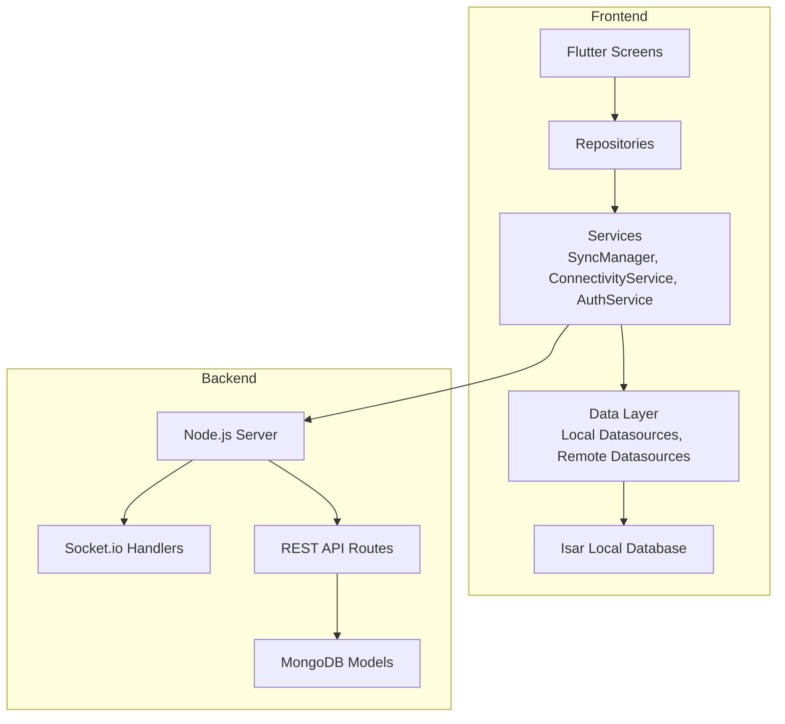
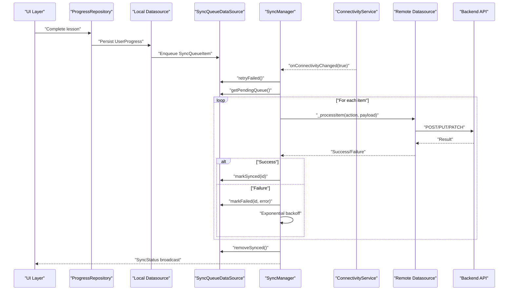
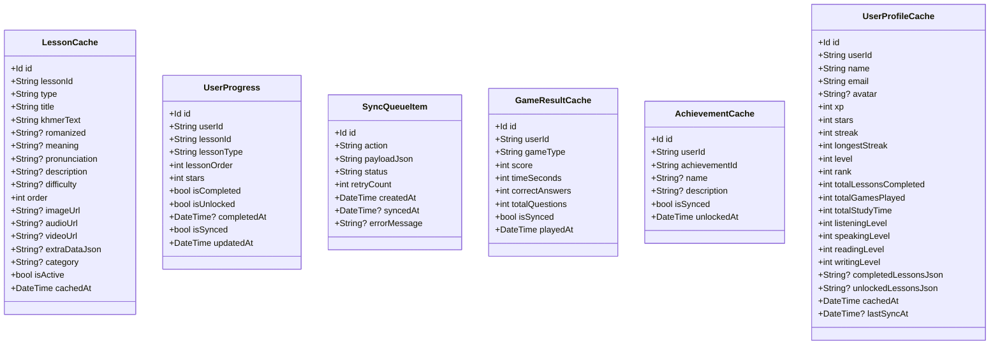
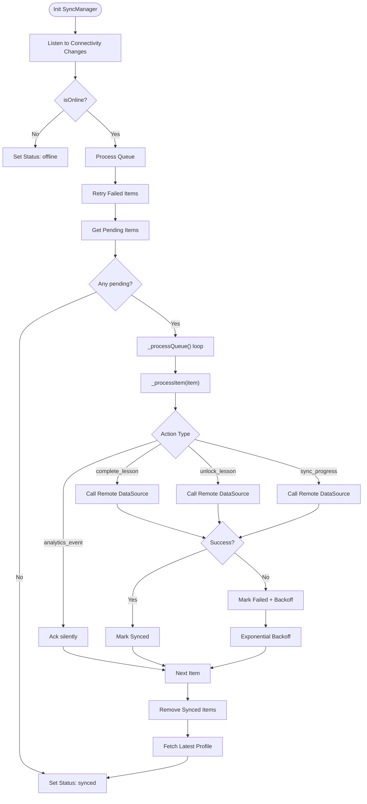
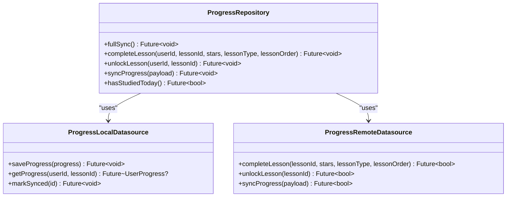
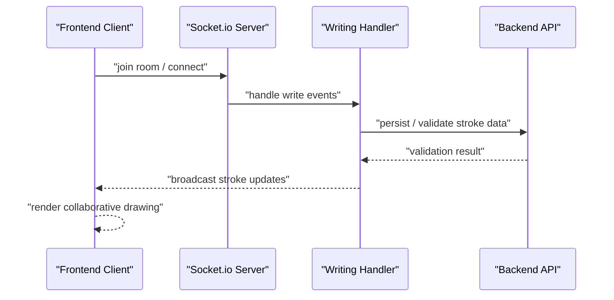
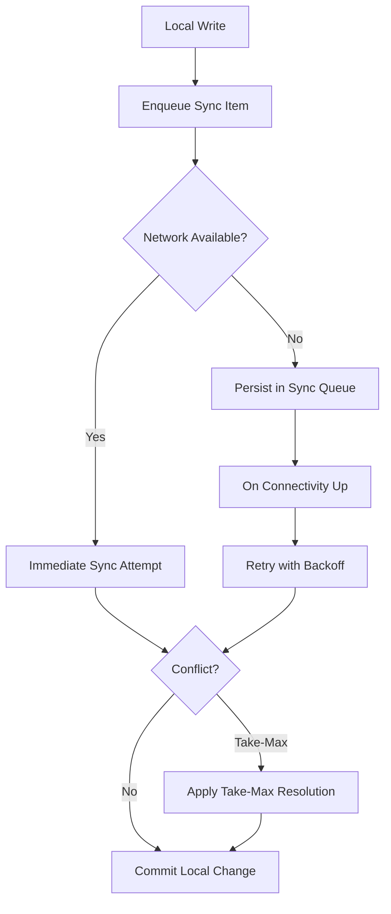
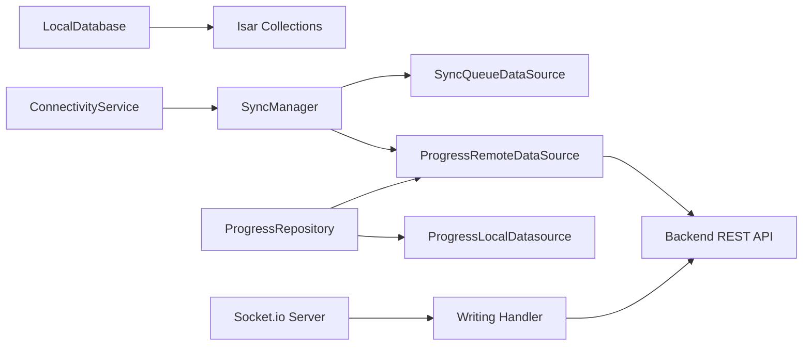

# Data Flow Patterns

<cite>
**Referenced Files in This Document**
- [main.dart](file://lib/main.dart)
- [isar_models.dart](file://lib/data/local/isar_models.dart)
- [local_database.dart](file://lib/data/local/local_database.dart)
- [sync_manager.dart](file://lib/services/sync_manager.dart)
- [connectivity_service.dart](file://lib/services/connectivity_service.dart)
- [lesson_remote_datasource.dart](file://lib/data/remote/lesson_remote_datasource.dart)
- [progress_remote_datasource.dart](file://lib/data/remote/progress_remote_datasource.dart)
- [lesson_local_datasource.dart](file://lib/data/local/lesson_local_datasource.dart)
- [progress_local_datasource.dart](file://lib/data/local/progress_local_datasource.dart)
- [sync_queue_datasource.dart](file://lib/data/local/sync_queue_datasource.dart)
- [progress_repository.dart](file://lib/repositories/progress_repository.dart)
- [auth_service.dart](file://lib/services/auth_service.dart)
- [server.js](file://backend/server.js)
- [index.js](file://backend/src/sockets/index.js)
- [writingHandler.js](file://backend/src/sockets/writingHandler.js)
</cite>

## Table of Contents
1. [Introduction](#introduction)
2. [Project Structure](#project-structure)
3. [Core Components](#core-components)
4. [Architecture Overview](#architecture-overview)
5. [Detailed Component Analysis](#detailed-component-analysis)
6. [Dependency Analysis](#dependency-analysis)
7. [Performance Considerations](#performance-considerations)
8. [Troubleshooting Guide](#troubleshooting-guide)
9. [Conclusion](#conclusion)

## Introduction
This document explains the data flow patterns in the KhmerKid application, focusing on its offline-first architecture, local caching strategies, intelligent synchronization between local and remote data sources, conflict resolution, real-time synchronization via Socket.io, queue-based sync, optimistic concurrency control, data transformation, API integration, repository pattern, error handling, retries, and performance optimizations.

## Project Structure
The application follows a layered architecture:
- UI layer built with Flutter
- Services for connectivity, sync, and authentication
- Repositories implementing the repository pattern
- Data layer with local Isar database and remote datasources
- Backend with Node.js server, Socket.io handlers, and REST APIs

**Diagram sources**
- [main.dart:1-129](file://lib/main.dart#L1-L129)
- [sync_manager.dart:1-246](file://lib/services/sync_manager.dart#L1-L246)
- [connectivity_service.dart:1-60](file://lib/services/connectivity_service.dart#L1-L60)
- [local_database.dart:1-276](file://lib/data/local/local_database.dart#L1-L276)
- [server.js](file://backend/server.js)
- [index.js](file://backend/src/sockets/index.js)
- [writingHandler.js](file://backend/src/sockets/writingHandler.js)

**Section sources**
- [main.dart:1-129](file://lib/main.dart#L1-L129)

## Core Components
- Local Isar database with typed collections for lessons, progress, sync queue, game results, achievements, and user profiles
- Connectivity monitoring service emitting online/offline state
- SyncManager orchestrating queue processing, retries, and status updates
- Repository pattern isolating domain logic and coordinating between local and remote datasources
- Remote datasources encapsulating REST API calls
- Real-time Socket.io integration for collaborative writing sessions

Key data models and their roles:
- LessonCache: cached lessons from MongoDB
- UserProgress: per-user lesson progress with sync flags
- SyncQueueItem: queued actions for offline-first sync
- GameResultCache: offline game results awaiting sync
- AchievementCache: unlocked achievements
- UserProfileCache: user profile snapshot

**Section sources**
- [isar_models.dart:1-265](file://lib/data/local/isar_models.dart#L1-L265)
- [local_database.dart:1-276](file://lib/data/local/local_database.dart#L1-L276)

## Architecture Overview
The system implements an offline-first hybrid architecture:
- Local-first writes are persisted immediately in Isar
- Pending changes are enqueued in SyncQueueItem
- On connectivity change, SyncManager processes the queue with exponential backoff
- Conflict resolution uses take-max strategy for numeric fields
- Periodic sync ensures eventual consistency
- Real-time collaboration uses Socket.io for writing exercises

**Diagram sources**
- [sync_manager.dart:76-155](file://lib/services/sync_manager.dart#L76-L155)
- [sync_queue_datasource.dart](file://lib/data/local/sync_queue_datasource.dart)
- [progress_remote_datasource.dart](file://lib/data/remote/progress_remote_datasource.dart)
- [connectivity_service.dart:22-53](file://lib/services/connectivity_service.dart#L22-L53)

## Detailed Component Analysis

### Offline-First Data Model Layer
The Isar schema defines collections optimized for offline-first workflows:
- Indexed fields enable fast queries and merges
- Flags track sync state and timestamps
- JSON blobs store complex nested data (examples, stroke orders)

**Diagram sources**
- [isar_models.dart:8-264](file://lib/data/local/isar_models.dart#L8-L264)

**Section sources**
- [isar_models.dart:1-265](file://lib/data/local/isar_models.dart#L1-L265)
- [local_database.dart:32-61](file://lib/data/local/local_database.dart#L32-L61)

### Connectivity and Sync Orchestration
ConnectivityService monitors network state and broadcasts changes. SyncManager listens for connectivity events, processes the queue, applies exponential backoff on failures, and updates status streams.

**Diagram sources**
- [sync_manager.dart:46-155](file://lib/services/sync_manager.dart#L46-L155)
- [connectivity_service.dart:28-53](file://lib/services/connectivity_service.dart#L28-L53)

**Section sources**
- [sync_manager.dart:1-246](file://lib/services/sync_manager.dart#L1-L246)
- [connectivity_service.dart:1-60](file://lib/services/connectivity_service.dart#L1-L60)

### Repository Pattern Implementation
ProgressRepository coordinates between local and remote datasources, exposing domain operations while hiding persistence details. It integrates with SyncManager for offline-first writes and full sync workflows.

**Diagram sources**
- [progress_repository.dart](file://lib/repositories/progress_repository.dart)
- [progress_local_datasource.dart](file://lib/data/local/progress_local_datasource.dart)
- [progress_remote_datasource.dart](file://lib/data/remote/progress_remote_datasource.dart)

**Section sources**
- [progress_repository.dart](file://lib/repositories/progress_repository.dart)

### Data Transformation and API Integration
Remote datasources encapsulate HTTP calls and transform payloads for queueing. Example transformations include:
- Mapping lesson completion to structured payloads
- Serializing complex lesson data into JSON blobs for caching
- Normalizing responses for optimistic updates

Integration points:
- REST endpoints for progress synchronization
- Socket.io for real-time writing sessions

**Section sources**
- [lesson_remote_datasource.dart](file://lib/data/remote/lesson_remote_datasource.dart)
- [progress_remote_datasource.dart](file://lib/data/remote/progress_remote_datasource.dart)

### Real-Time Data Synchronization with Socket.io
The backend exposes Socket.io handlers for collaborative writing experiences. The frontend connects to these handlers to synchronize strokes and real-time feedback.

**Diagram sources**
- [index.js](file://backend/src/sockets/index.js)
- [writingHandler.js](file://backend/src/sockets/writingHandler.js)
- [server.js](file://backend/server.js)

**Section sources**
- [index.js](file://backend/src/sockets/index.js)
- [writingHandler.js](file://backend/src/sockets/writingHandler.js)
- [server.js](file://backend/server.js)

### Optimistic Concurrency Control
Optimistic updates are applied locally upon user actions, with queueing ensuring eventual consistency. Conflicts are resolved using a take-max strategy for numeric fields (e.g., highest star rating wins), minimizing data loss and preventing rollback conflicts.

**Diagram sources**
- [sync_manager.dart:157-186](file://lib/services/sync_manager.dart#L157-L186)
- [isar_models.dart:69-106](file://lib/data/local/isar_models.dart#L69-L106)

**Section sources**
- [sync_manager.dart:14-21](file://lib/services/sync_manager.dart#L14-L21)
- [isar_models.dart:69-106](file://lib/data/local/isar_models.dart#L69-L106)

## Dependency Analysis
The frontend depends on:
- LocalDatabase for Isar initialization and migrations
- ConnectivityService for network state
- SyncManager for orchestration
- Repositories for domain operations
- Remote datasources for API integration

The backend depends on:
- Socket.io for real-time communication
- REST routes for CRUD operations
- MongoDB models for persistence

**Diagram sources**
- [local_database.dart:32-61](file://lib/data/local/local_database.dart#L32-L61)
- [connectivity_service.dart:22-53](file://lib/services/connectivity_service.dart#L22-L53)
- [sync_manager.dart:21-38](file://lib/services/sync_manager.dart#L21-L38)
- [progress_repository.dart](file://lib/repositories/progress_repository.dart)
- [progress_remote_datasource.dart](file://lib/data/remote/progress_remote_datasource.dart)
- [server.js](file://backend/server.js)
- [index.js](file://backend/src/sockets/index.js)
- [writingHandler.js](file://backend/src/sockets/writingHandler.js)

**Section sources**
- [main.dart:7-17](file://lib/main.dart#L7-L17)
- [local_database.dart:32-61](file://lib/data/local/local_database.dart#L32-L61)
- [sync_manager.dart:21-38](file://lib/services/sync_manager.dart#L21-L38)

## Performance Considerations
- Indexed fields in Isar reduce query times for frequent filters (e.g., lesson type, user ID)
- Batch writes and transactions minimize disk I/O during migrations and bulk inserts
- Exponential backoff reduces server load during retry storms
- Periodic sync prevents stale data accumulation
- JSON blob storage avoids deep joins for complex lesson data
- Real-time updates use efficient binary or compact JSON payloads in Socket.io

## Troubleshooting Guide
Common issues and remedies:
- Offline sync stalls: Verify ConnectivityService emits online events and SyncManager processes the queue
- Repeated sync failures: Inspect SyncQueueItem retry counts and error messages; adjust exponential backoff
- Data inconsistencies: Confirm take-max conflict resolution is applied for numeric fields
- Authentication errors post-sync: Ensure AuthService fetchProfile is called after successful sync batches
- Socket.io disconnections: Validate room join logic and reconnection strategies in the writing handler

Operational checks:
- Monitor SyncStatus stream for error transitions
- Inspect queue length via getPendingCount
- Review cached user profile timestamps for staleness

**Section sources**
- [sync_manager.dart:226-245](file://lib/services/sync_manager.dart#L226-L245)
- [connectivity_service.dart:22-53](file://lib/services/connectivity_service.dart#L22-L53)
- [auth_service.dart](file://lib/services/auth_service.dart)

## Conclusion
KhmerKid employs a robust offline-first architecture with Isar as the local store, a queue-based sync engine, and intelligent conflict resolution. Real-time collaboration leverages Socket.io for responsive writing experiences. The repository pattern cleanly separates domain logic from persistence, while connectivity-aware orchestration ensures reliability and performance across varied network conditions.