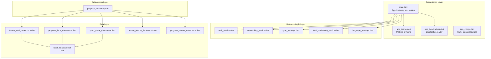
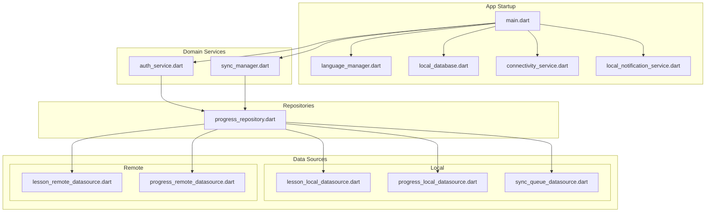
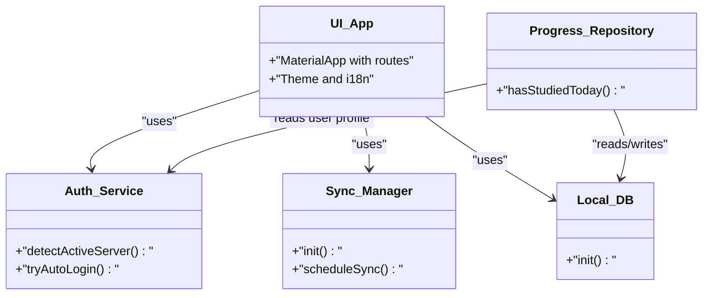
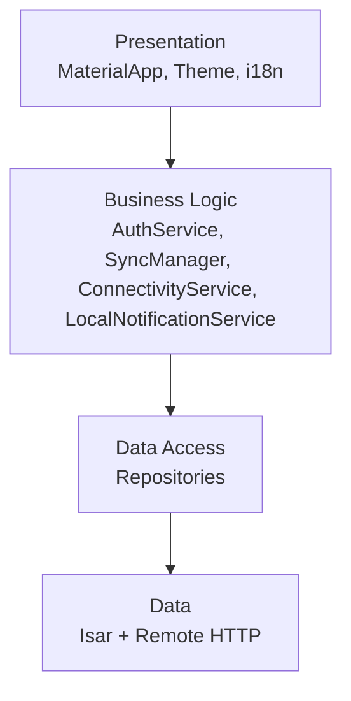
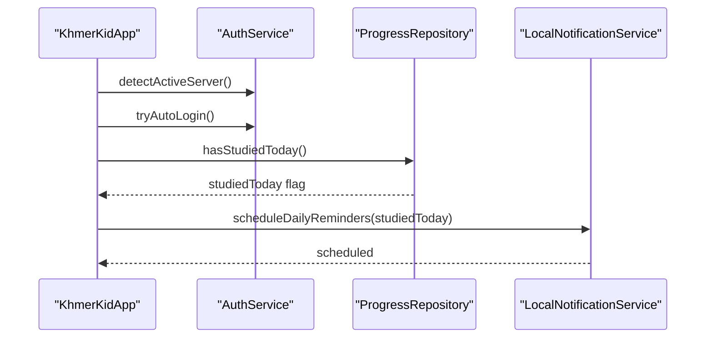
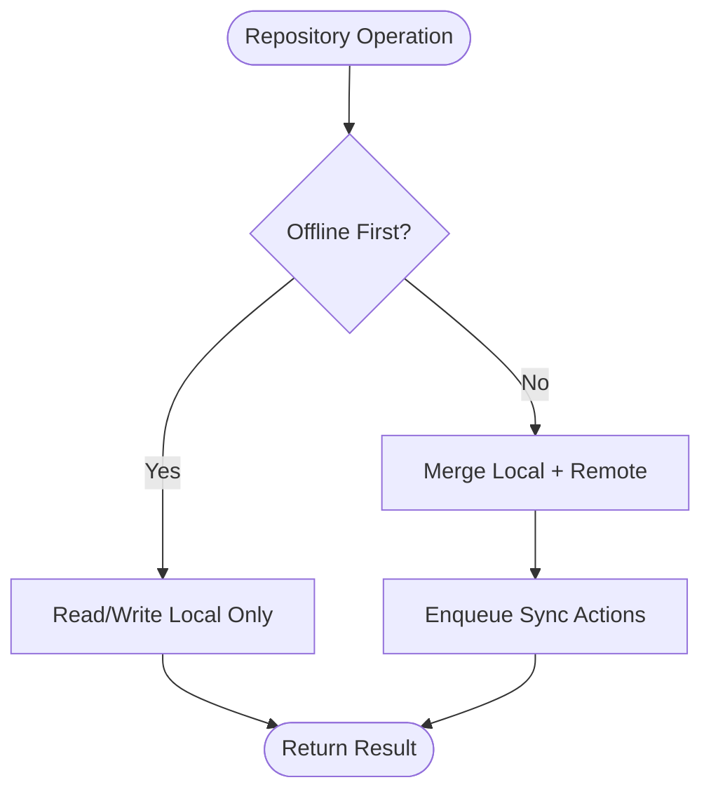
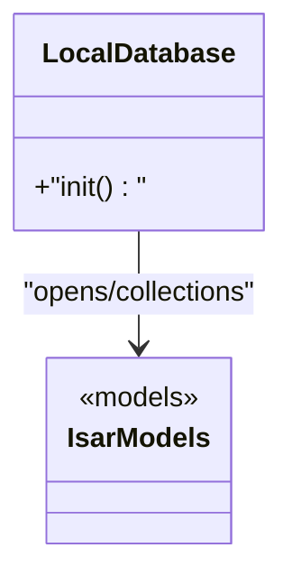
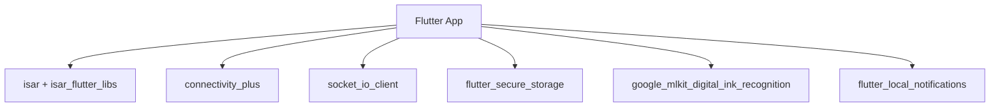

# Frontend Architecture (Flutter)

<cite>
**Referenced Files in This Document**
- [main.dart](file://lib/main.dart)
- [pubspec.yaml](file://pubspec.yaml)
- [app_strings.dart](file://lib/constants/app_strings.dart)
- [app_theme.dart](file://lib/theme/app_theme.dart)
- [app_localizations.dart](file://lib/l10n/app_localizations.dart)
- [local_database.dart](file://lib/data/local/local_database.dart)
- [lesson_local_datasource.dart](file://lib/data/local/lesson_local_datasource.dart)
- [progress_local_datasource.dart](file://lib/data/local/progress_local_datasource.dart)
- [sync_queue_datasource.dart](file://lib/data/local/sync_queue_datasource.dart)
- [lesson_remote_datasource.dart](file://lib/data/remote/lesson_remote_datasource.dart)
- [progress_remote_datasource.dart](file://lib/data/remote/progress_remote_datasource.dart)
- [connectivity_service.dart](file://lib/services/connectivity_service.dart)
- [sync_manager.dart](file://lib/services/sync_manager.dart)
- [auth_service.dart](file://lib/services/auth_service.dart)
- [local_notification_service.dart](file://lib/services/local_notification_service.dart)
- [progress_repository.dart](file://lib/repositories/progress_repository.dart)
- [language_manager.dart](file://lib/l10n/language_manager.dart)
</cite>

## Table of Contents
1. [Introduction](#introduction)
2. [Project Structure](#project-structure)
3. [Core Components](#core-components)
4. [Architecture Overview](#architecture-overview)
5. [Detailed Component Analysis](#detailed-component-analysis)
6. [Dependency Analysis](#dependency-analysis)
7. [Performance Considerations](#performance-considerations)
8. [Troubleshooting Guide](#troubleshooting-guide)
9. [Conclusion](#conclusion)

## Introduction
This document describes the frontend architecture of the Flutter application with a focus on MVVM, layered architecture, service layer design, repository pattern, Isar database integration, offline-first principles, state management, and performance/memory strategies. It synthesizes the application’s initialization flow, localization, theming, and the integration of authentication, synchronization, connectivity, and specialized services such as handwriting recognition.

## Project Structure
The Flutter application is organized into cohesive layers:
- Presentation layer: UI scaffolding, themes, and localization delegates
- Business logic layer: Services orchestrating domain workflows
- Data access layer: Repositories coordinating local and remote data sources
- Data layer: Isar-backed local data sources and HTTP-based remote data sources

**Diagram sources**
- [main.dart](file://lib/main.dart)
- [app_theme.dart](file://lib/theme/app_theme.dart)
- [app_localizations.dart](file://lib/l10n/app_localizations.dart)
- [app_strings.dart](file://lib/constants/app_strings.dart)
- [local_database.dart](file://lib/data/local/local_database.dart)
- [lesson_local_datasource.dart](file://lib/data/local/lesson_local_datasource.dart)
- [progress_local_datasource.dart](file://lib/data/local/progress_local_datasource.dart)
- [sync_queue_datasource.dart](file://lib/data/local/sync_queue_datasource.dart)
- [lesson_remote_datasource.dart](file://lib/data/remote/lesson_remote_datasource.dart)
- [progress_remote_datasource.dart](file://lib/data/remote/progress_remote_datasource.dart)
- [connectivity_service.dart](file://lib/services/connectivity_service.dart)
- [sync_manager.dart](file://lib/services/sync_manager.dart)
- [auth_service.dart](file://lib/services/auth_service.dart)
- [local_notification_service.dart](file://lib/services/local_notification_service.dart)
- [progress_repository.dart](file://lib/repositories/progress_repository.dart)
- [language_manager.dart](file://lib/l10n/language_manager.dart)

**Section sources**
- [main.dart](file://lib/main.dart)
- [pubspec.yaml](file://pubspec.yaml)

## Core Components
- Application bootstrap and initialization sequence:
  - Parallel initialization of Isar, connectivity, language manager, and local notifications
  - Conditional server detection and auto-login prior to rendering the UI
  - Orientation lock and status bar customization
  - Routing based on authentication and admin roles
- Localization and theming:
  - Dynamic locale switching via a language manager
  - Material 3 theme with Google Fonts and custom color scheme
  - Translation loader supporting nested keys, pluralization, and formatting
- MVVM alignment:
  - Stateless UI widgets driven by services and repositories
  - Clear separation between UI (MaterialApp) and business/data concerns

**Section sources**
- [main.dart](file://lib/main.dart)
- [app_theme.dart](file://lib/theme/app_theme.dart)
- [app_localizations.dart](file://lib/l10n/app_localizations.dart)
- [app_strings.dart](file://lib/constants/app_strings.dart)
- [language_manager.dart](file://lib/l10n/language_manager.dart)

## Architecture Overview
The application follows an offline-first hybrid architecture:
- Isar stores lessons, progress, and a sync queue locally
- Remote data sources handle server-backed entities
- Sync manager coordinates background synchronization based on connectivity
- Authentication service manages session lifecycle and auto-login
- Specialized services support handwriting recognition and local notifications

**Diagram sources**
- [main.dart](file://lib/main.dart)
- [language_manager.dart](file://lib/l10n/language_manager.dart)
- [local_database.dart](file://lib/data/local/local_database.dart)
- [connectivity_service.dart](file://lib/services/connectivity_service.dart)
- [local_notification_service.dart](file://lib/services/local_notification_service.dart)
- [auth_service.dart](file://lib/services/auth_service.dart)
- [sync_manager.dart](file://lib/services/sync_manager.dart)
- [progress_repository.dart](file://lib/repositories/progress_repository.dart)
- [lesson_local_datasource.dart](file://lib/data/local/lesson_local_datasource.dart)
- [progress_local_datasource.dart](file://lib/data/local/progress_local_datasource.dart)
- [sync_queue_datasource.dart](file://lib/data/local/sync_queue_datasource.dart)
- [lesson_remote_datasource.dart](file://lib/data/remote/lesson_remote_datasource.dart)
- [progress_remote_datasource.dart](file://lib/data/remote/progress_remote_datasource.dart)

## Detailed Component Analysis

### MVVM Pattern Implementation
- View: Stateless widgets configured in the MaterialApp and route selection logic
- ViewModel: Not explicitly present as separate classes; state updates are handled by services and repositories, with UI reacting to reactive changes (e.g., language manager)
- Model: Data models and typed Isar collections underpin data sources

**Diagram sources**
- [main.dart](file://lib/main.dart)
- [auth_service.dart](file://lib/services/auth_service.dart)
- [sync_manager.dart](file://lib/services/sync_manager.dart)
- [progress_repository.dart](file://lib/repositories/progress_repository.dart)
- [local_database.dart](file://lib/data/local/local_database.dart)

**Section sources**
- [main.dart](file://lib/main.dart)

### Layered Architecture
- Presentation: MaterialApp, theme, and localization
- Business logic: Authentication, connectivity, sync, and notifications
- Data access: Repositories mediating between views and data sources
- Data: Isar local storage and HTTP remote data sources

**Diagram sources**
- [main.dart](file://lib/main.dart)
- [auth_service.dart](file://lib/services/auth_service.dart)
- [sync_manager.dart](file://lib/services/sync_manager.dart)
- [connectivity_service.dart](file://lib/services/connectivity_service.dart)
- [local_notification_service.dart](file://lib/services/local_notification_service.dart)
- [progress_repository.dart](file://lib/repositories/progress_repository.dart)
- [local_database.dart](file://lib/data/local/local_database.dart)
- [lesson_remote_datasource.dart](file://lib/data/remote/lesson_remote_datasource.dart)
- [progress_remote_datasource.dart](file://lib/data/remote/progress_remote_datasource.dart)

**Section sources**
- [main.dart](file://lib/main.dart)

### Service Layer Design
- Authentication service:
  - Detects active server endpoint and performs auto-login
  - Provides user profile for role checks and downstream logic
- Connectivity service:
  - Initializes and exposes connectivity state for sync decisions
- Sync manager:
  - Initializes after database and connectivity readiness
  - Coordinates background synchronization
- Local notification service:
  - Schedules daily reminders based on progress

**Diagram sources**
- [main.dart](file://lib/main.dart)
- [auth_service.dart](file://lib/services/auth_service.dart)
- [progress_repository.dart](file://lib/repositories/progress_repository.dart)
- [local_notification_service.dart](file://lib/services/local_notification_service.dart)

**Section sources**
- [main.dart](file://lib/main.dart)
- [auth_service.dart](file://lib/services/auth_service.dart)
- [connectivity_service.dart](file://lib/services/connectivity_service.dart)
- [sync_manager.dart](file://lib/services/sync_manager.dart)
- [local_notification_service.dart](file://lib/services/local_notification_service.dart)

### Repository Pattern Implementation
- Responsibilities:
  - Coordinate reads/writes across local and remote data sources
  - Enforce offline-first behavior with a sync queue
  - Expose domain-level operations (e.g., checking if the user has studied today)
- Data sources:
  - Local: lesson, progress, and sync queue Isar collections
  - Remote: lesson and progress endpoints

**Diagram sources**
- [progress_repository.dart](file://lib/repositories/progress_repository.dart)
- [lesson_local_datasource.dart](file://lib/data/local/lesson_local_datasource.dart)
- [progress_local_datasource.dart](file://lib/data/local/progress_local_datasource.dart)
- [sync_queue_datasource.dart](file://lib/data/local/sync_queue_datasource.dart)
- [lesson_remote_datasource.dart](file://lib/data/remote/lesson_remote_datasource.dart)
- [progress_remote_datasource.dart](file://lib/data/remote/progress_remote_datasource.dart)

**Section sources**
- [progress_repository.dart](file://lib/repositories/progress_repository.dart)
- [lesson_local_datasource.dart](file://lib/data/local/lesson_local_datasource.dart)
- [progress_local_datasource.dart](file://lib/data/local/progress_local_datasource.dart)
- [sync_queue_datasource.dart](file://lib/data/local/sync_queue_datasource.dart)
- [lesson_remote_datasource.dart](file://lib/data/remote/lesson_remote_datasource.dart)
- [progress_remote_datasource.dart](file://lib/data/remote/progress_remote_datasource.dart)

### Isar Database Integration
- Initialization:
  - Database initialized during startup alongside connectivity and language manager
- Collections:
  - Lessons, progress, and a sync queue collection are defined in Isar models
- Offline-first:
  - All CRUD operations default to local storage; sync manager pushes/pulls later

**Diagram sources**
- [local_database.dart](file://lib/data/local/local_database.dart)
- [app_strings.dart](file://lib/constants/app_strings.dart)

**Section sources**
- [local_database.dart](file://lib/data/local/local_database.dart)
- [app_strings.dart](file://lib/constants/app_strings.dart)

### State Management Strategies
- Reactive UI updates:
  - Language manager triggers rebuilds via ListenableBuilder
  - Theme adapts dynamically to language-selected font families
- Minimal stateful widgets:
  - Stateless widgets render based on services and repositories
- Recommended patterns:
  - Consider Riverpod/Provider for larger-scale state needs
  - Keep services/repository methods pure and side-effect boundaries

**Section sources**
- [main.dart](file://lib/main.dart)
- [app_theme.dart](file://lib/theme/app_theme.dart)
- [language_manager.dart](file://lib/l10n/language_manager.dart)

### Offline-First Principles
- Preconditioned initialization:
  - Database and connectivity ready before sync manager starts
- Auto-login with timeout:
  - Attempts server detection and auto-login before UI renders
- Daily reminders scheduling:
  - Conditional scheduling based on progress to reduce network usage

**Section sources**
- [main.dart](file://lib/main.dart)

### Specialized Services
- Handwriting recognition:
  - On-device ML Kit integration for digital ink recognition
- Local notifications:
  - Daily reminder scheduling based on learning streaks

**Section sources**
- [pubspec.yaml](file://pubspec.yaml)
- [local_notification_service.dart](file://lib/services/local_notification_service.dart)

## Dependency Analysis
External dependencies relevant to architecture:
- Isar and Isar Flutter Libs for embedded database
- Connectivity Plus for network state
- Socket IO client for real-time features
- Flutter Secure Storage for secure credentials
- Google MLKit Digital Ink Recognition for handwriting
- Flutter Local Notifications for reminders

**Diagram sources**
- [pubspec.yaml](file://pubspec.yaml)

**Section sources**
- [pubspec.yaml](file://pubspec.yaml)

## Performance Considerations
- Startup optimization:
  - Parallel initialization reduces cold start latency
- Memory management:
  - Prefer lightweight Isar queries and batch writes
  - Avoid holding large lists in memory; stream or paginate
- UI responsiveness:
  - Keep build methods small; offload heavy work to services
- Network efficiency:
  - Use connectivity-aware sync scheduling
  - Minimize redundant fetches with caching strategies

## Troubleshooting Guide
- Localization errors:
  - Translation loader falls back to Vietnamese if a locale file is missing
  - Nested key lookup and pluralization are supported with graceful fallbacks
- Auto-login failures:
  - Startup auto-login is wrapped in a timeout; failures are logged and UI proceeds
- Sync issues:
  - Ensure connectivity service is initialized before sync manager
  - Verify Isar initialization precedes repository usage

**Section sources**
- [app_localizations.dart](file://lib/l10n/app_localizations.dart)
- [main.dart](file://lib/main.dart)
- [connectivity_service.dart](file://lib/services/connectivity_service.dart)
- [sync_manager.dart](file://lib/services/sync_manager.dart)
- [local_database.dart](file://lib/data/local/local_database.dart)

## Conclusion
The application employs a clean, layered architecture with MVVM-aligned separation of concerns. The offline-first design leverages Isar for local persistence, complemented by a robust service layer for authentication, connectivity, synchronization, and notifications. The repository pattern abstracts data access, while localization and theming enable a responsive, adaptive UI. Adopting structured state management and adhering to performance best practices will further strengthen the architecture for scalability and maintainability.