# Integration Patterns

<cite>
**Referenced Files in This Document**
- [server.js](file://backend/server.js)
- [index.js](file://backend/src/sockets/index.js)
- [writingHandler.js](file://backend/src/sockets/writingHandler.js)
- [cloudinary.js](file://backend/src/config/cloudinary.js)
- [passport.js](file://backend/src/config/passport.js)
- [index.js](file://backend/src/constants/index.js)
- [auth.js](file://backend/src/middlewares/auth.js)
- [uploadService.js](file://backend/src/services/uploadService.js)
- [token.js](file://backend/src/utils/token.js)
- [errorHandler.js](file://backend/src/middlewares/errorHandler.js)
- [rateLimiter.js](file://backend/src/middlewares/rateLimiter.js)
- [aiStrokeAnalyzer.js](file://backend/src/services/aiStrokeAnalyzer.js)
- [WritingProgress.js](file://backend/src/models/WritingProgress.js)
- [package.json](file://backend/package.json)
- [main.dart](file://lib/main.dart)
</cite>

## Table of Contents
1. [Introduction](#introduction)
2. [Project Structure](#project-structure)
3. [Core Components](#core-components)
4. [Architecture Overview](#architecture-overview)
5. [Detailed Component Analysis](#detailed-component-analysis)
6. [Dependency Analysis](#dependency-analysis)
7. [Performance Considerations](#performance-considerations)
8. [Troubleshooting Guide](#troubleshooting-guide)
9. [Conclusion](#conclusion)
10. [Appendices](#appendices)

## Introduction
This document explains the integration patterns used across the KhmerKid application. It covers:
- Real-time communication via Socket.io between Flutter frontend and Node.js backend
- A WebSocket-based handwriting recognition pipeline
- Cloud service integrations (Cloudinary) and Google OAuth for authentication
- Plugin-style service architecture and middleware-driven request processing
- Event-driven architecture for real-time updates
- Authentication integration patterns, third-party API consumption strategies, and cross-platform compatibility considerations
- Distributed-system error handling and monitoring integration patterns

## Project Structure
The backend is a Node.js/Express application with modular components:
- Server bootstrap initializes Express, Socket.io, Passport, and routes
- Socket.io handles real-time events and user rooms
- Services encapsulate AI analysis, uploads, and auth
- Middlewares enforce rate limits, authentication, and error handling
- Models persist structured learning data
- Frontend is a Flutter app that connects to the backend and consumes real-time updates

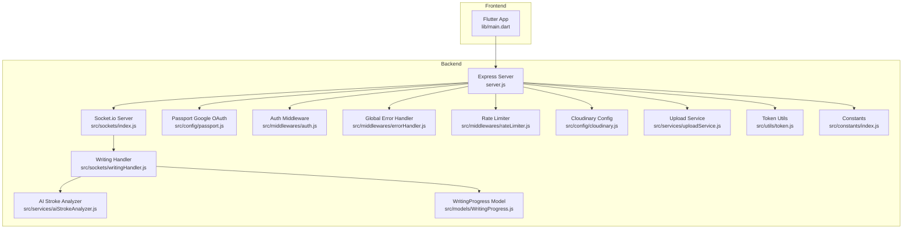

**Diagram sources**
- [server.js:1-160](file://backend/server.js#L1-L160)
- [index.js:1-134](file://backend/src/sockets/index.js#L1-L134)
- [writingHandler.js:1-366](file://backend/src/sockets/writingHandler.js#L1-L366)
- [cloudinary.js:1-70](file://backend/src/config/cloudinary.js#L1-L70)
- [passport.js:1-83](file://backend/src/config/passport.js#L1-L83)
- [auth.js:1-78](file://backend/src/middlewares/auth.js#L1-L78)
- [uploadService.js:1-83](file://backend/src/services/uploadService.js#L1-L83)
- [token.js:1-98](file://backend/src/utils/token.js#L1-L98)
- [index.js:1-242](file://backend/src/constants/index.js#L1-L242)
- [aiStrokeAnalyzer.js:1-800](file://backend/src/services/aiStrokeAnalyzer.js#L1-L800)
- [WritingProgress.js:1-253](file://backend/src/models/WritingProgress.js#L1-L253)
- [main.dart:1-129](file://lib/main.dart#L1-L129)

**Section sources**
- [server.js:1-160](file://backend/server.js#L1-L160)
- [package.json:1-54](file://backend/package.json#L1-L54)

## Core Components
- Socket.io real-time engine with JWT authentication and user-specific rooms
- Writing recognition pipeline: validation → golden path lookup → AI analysis → persistence → real-time feedback
- Cloudinary integration for media storage and deletion
- Google OAuth 2.0 via Passport for external authentication
- Middleware stack: rate limiting, auth, error handling
- Token utilities for access/refresh tokens and extraction
- Constants and event registry for consistent messaging and gamification

**Section sources**
- [index.js:1-134](file://backend/src/sockets/index.js#L1-L134)
- [writingHandler.js:1-366](file://backend/src/sockets/writingHandler.js#L1-L366)
- [cloudinary.js:1-70](file://backend/src/config/cloudinary.js#L1-L70)
- [passport.js:1-83](file://backend/src/config/passport.js#L1-L83)
- [auth.js:1-78](file://backend/src/middlewares/auth.js#L1-L78)
- [rateLimiter.js:1-65](file://backend/src/middlewares/rateLimiter.js#L1-L65)
- [token.js:1-98](file://backend/src/utils/token.js#L1-L98)
- [index.js:210-242](file://backend/src/constants/index.js#L210-L242)

## Architecture Overview
The backend follows a layered architecture:
- Entry point initializes HTTP server, Socket.io, Passport, and routes
- Middleware layer enforces security, rate limits, and authentication
- Controllers orchestrate business logic and delegate to services
- Services encapsulate domain logic (AI analysis, uploads, auth)
- Models persist data and maintain indexes
- Frontend connects via REST and Socket.io for real-time updates

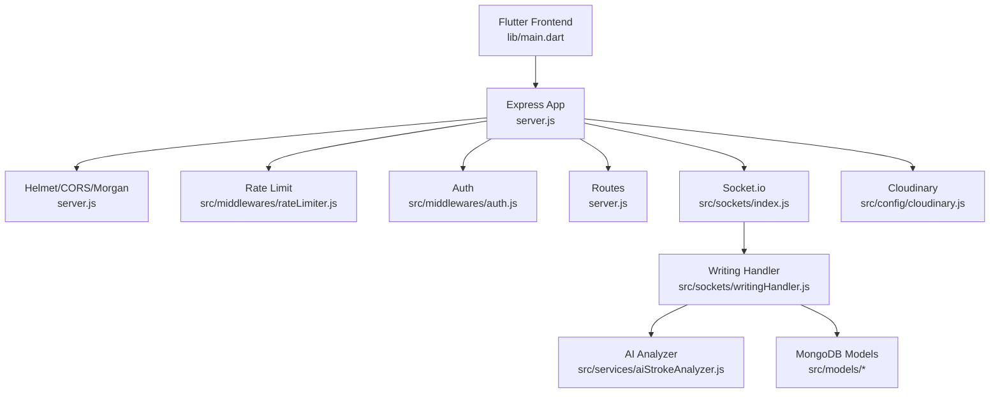

**Diagram sources**
- [server.js:1-160](file://backend/server.js#L1-L160)
- [rateLimiter.js:1-65](file://backend/src/middlewares/rateLimiter.js#L1-L65)
- [auth.js:1-78](file://backend/src/middlewares/auth.js#L1-L78)
- [index.js:1-134](file://backend/src/sockets/index.js#L1-L134)
- [writingHandler.js:1-366](file://backend/src/sockets/writingHandler.js#L1-L366)
- [aiStrokeAnalyzer.js:1-800](file://backend/src/services/aiStrokeAnalyzer.js#L1-L800)
- [cloudinary.js:1-70](file://backend/src/config/cloudinary.js#L1-L70)

## Detailed Component Analysis

### Socket.io Real-Time Communication
Socket.io is initialized with CORS and ping timeouts, and authenticates clients using JWT. On connection, clients join user-specific and broadcast rooms. The writing handler registers event listeners for stroke analysis and lightweight character info queries.

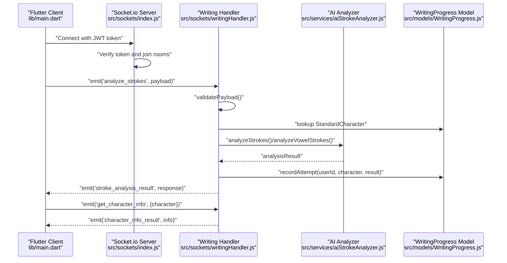

**Diagram sources**
- [index.js:1-134](file://backend/src/sockets/index.js#L1-L134)
- [writingHandler.js:1-366](file://backend/src/sockets/writingHandler.js#L1-L366)
- [aiStrokeAnalyzer.js:1-800](file://backend/src/services/aiStrokeAnalyzer.js#L1-L800)
- [WritingProgress.js:1-253](file://backend/src/models/WritingProgress.js#L1-L253)
- [main.dart:1-129](file://lib/main.dart#L1-L129)

**Section sources**
- [index.js:18-91](file://backend/src/sockets/index.js#L18-L91)
- [writingHandler.js:126-338](file://backend/src/sockets/writingHandler.js#L126-L338)

### WebSocket Client Implementation for Handwriting Recognition
The writing handler validates incoming stroke data, normalizes and resamples points, selects the appropriate analyzer (standard, vowel, or compound), persists results, and emits feedback. It supports both acknowledgment-based and named-event responses.

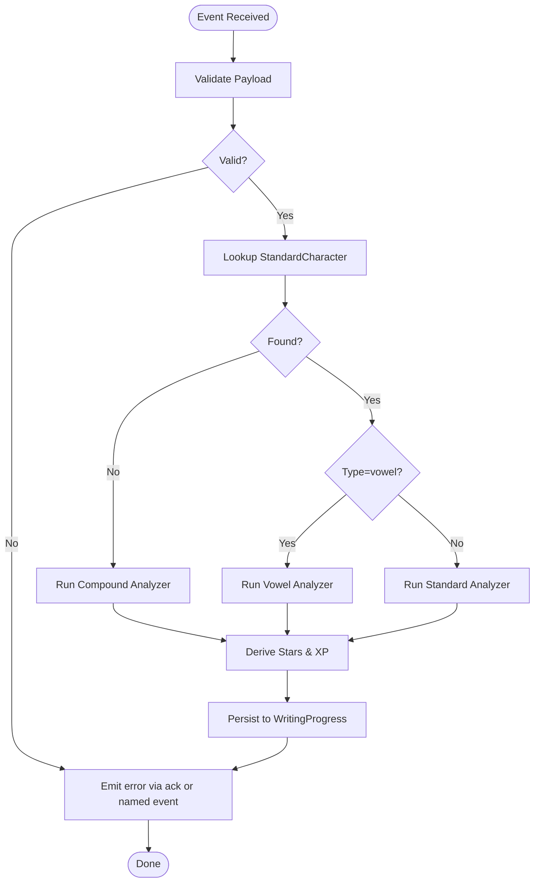

**Diagram sources**
- [writingHandler.js:142-288](file://backend/src/sockets/writingHandler.js#L142-L288)
- [aiStrokeAnalyzer.js:627-752](file://backend/src/services/aiStrokeAnalyzer.js#L627-L752)
- [WritingProgress.js:204-245](file://backend/src/models/WritingProgress.js#L204-L245)

**Section sources**
- [writingHandler.js:29-104](file://backend/src/sockets/writingHandler.js#L29-L104)
- [writingHandler.js:115-120](file://backend/src/sockets/writingHandler.js#L115-L120)
- [writingHandler.js:353-359](file://backend/src/sockets/writingHandler.js#L353-L359)

### Cloudinary Media Storage Integration
Cloudinary is configured with environment variables and exposes upload and delete operations. The upload service wraps Cloudinary calls and returns standardized metadata.

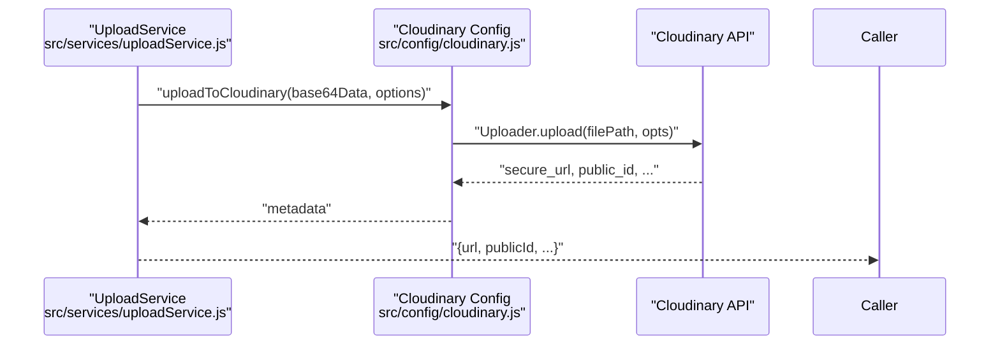

**Diagram sources**
- [uploadService.js:64-79](file://backend/src/services/uploadService.js#L64-L79)
- [cloudinary.js:26-46](file://backend/src/config/cloudinary.js#L26-L46)

**Section sources**
- [cloudinary.js:13-18](file://backend/src/config/cloudinary.js#L13-L18)
- [cloudinary.js:26-63](file://backend/src/config/cloudinary.js#L26-L63)
- [uploadService.js:14-83](file://backend/src/services/uploadService.js#L14-L83)

### Google OAuth Authentication Integration
Google OAuth 2.0 is configured via Passport. The strategy auto-links existing accounts by Google ID or email and creates new users on first login. Sessions serialize/deserialize user IDs.

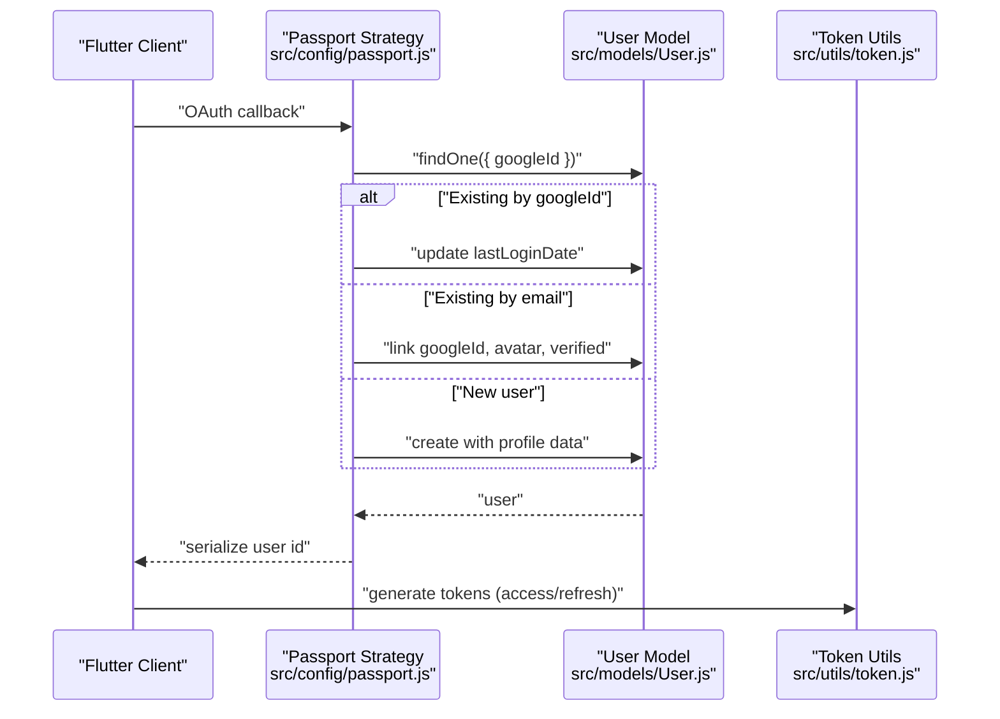

**Diagram sources**
- [passport.js:14-65](file://backend/src/config/passport.js#L14-L65)
- [token.js:17-50](file://backend/src/utils/token.js#L17-L50)

**Section sources**
- [passport.js:14-83](file://backend/src/config/passport.js#L14-L83)
- [token.js:17-50](file://backend/src/utils/token.js#L17-L50)

### Plugin Architecture for Extensible Services
Services are organized by domain (auth, upload, AI analysis, progress, etc.). They are imported and used by controllers or handlers without tight coupling to framework internals. This enables easy swapping or extension of analyzers or storage providers.

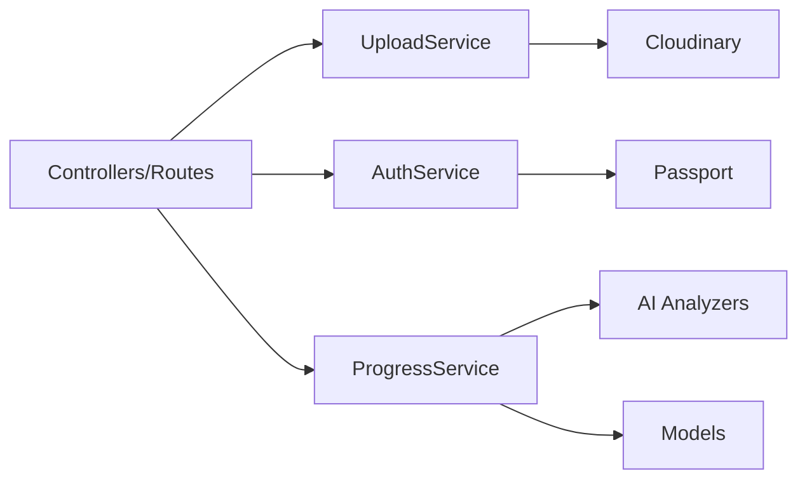

**Diagram sources**
- [uploadService.js:14-83](file://backend/src/services/uploadService.js#L14-L83)
- [passport.js:14-65](file://backend/src/config/passport.js#L14-L65)
- [aiStrokeAnalyzer.js:627-752](file://backend/src/services/aiStrokeAnalyzer.js#L627-L752)
- [WritingProgress.js:204-245](file://backend/src/models/WritingProgress.js#L204-L245)

**Section sources**
- [uploadService.js:14-83](file://backend/src/services/uploadService.js#L14-L83)
- [aiStrokeAnalyzer.js:1-800](file://backend/src/services/aiStrokeAnalyzer.js#L1-L800)

### Middleware Pattern for Request Processing
The Express app mounts global middlewares: Helmet, CORS, Morgan, body parsing, cookie parsing, rate limiting, and Passport initialization. Route-level middleware enforces authentication and optional auth.

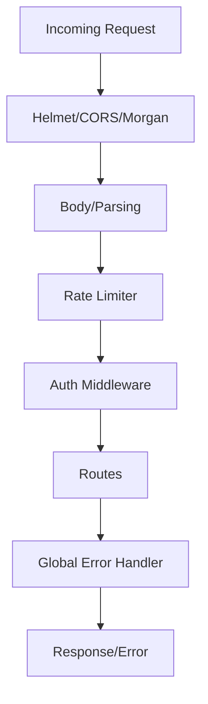

**Diagram sources**
- [server.js:59-89](file://backend/server.js#L59-L89)
- [auth.js:18-50](file://backend/src/middlewares/auth.js#L18-L50)
- [rateLimiter.js:19-28](file://backend/src/middlewares/rateLimiter.js#L19-L28)
- [errorHandler.js:61-92](file://backend/src/middlewares/errorHandler.js#L61-L92)

**Section sources**
- [server.js:59-122](file://backend/server.js#L59-L122)
- [auth.js:18-78](file://backend/src/middlewares/auth.js#L18-L78)
- [rateLimiter.js:19-64](file://backend/src/middlewares/rateLimiter.js#L19-L64)
- [errorHandler.js:13-92](file://backend/src/middlewares/errorHandler.js#L13-L92)

### Event-Driven Architecture for Real-Time Updates
Socket events are centrally defined and emitted for XP updates, level-ups, badges, notifications, streaks, progress sync, and lesson events. Handlers join user rooms and broadcast to users or general channels.

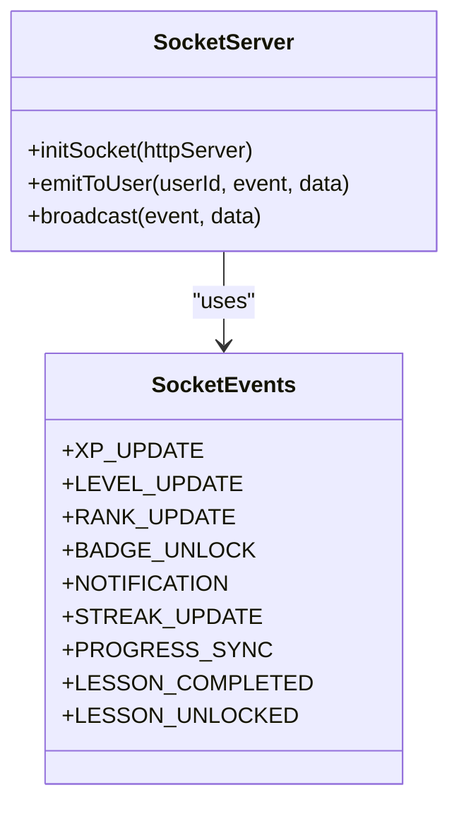

**Diagram sources**
- [index.js:212-222](file://backend/src/constants/index.js#L212-L222)
- [index.js:97-133](file://backend/src/sockets/index.js#L97-L133)

**Section sources**
- [index.js:212-222](file://backend/src/constants/index.js#L212-L222)
- [index.js:107-126](file://backend/src/sockets/index.js#L107-L126)

### Authentication Integration Patterns
- JWT-based access/refresh tokens generated and verified by utilities
- Token extraction from Authorization header or cookies
- Passport Google OAuth strategy with account linking and creation
- Auth middleware attaches user to request and enforces protection

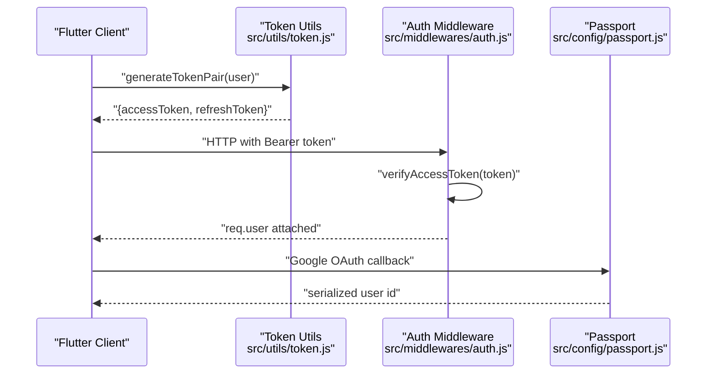

**Diagram sources**
- [token.js:17-88](file://backend/src/utils/token.js#L17-L88)
- [auth.js:18-50](file://backend/src/middlewares/auth.js#L18-L50)
- [passport.js:14-65](file://backend/src/config/passport.js#L14-L65)

**Section sources**
- [token.js:17-88](file://backend/src/utils/token.js#L17-L88)
- [auth.js:18-78](file://backend/src/middlewares/auth.js#L18-L78)
- [passport.js:14-83](file://backend/src/config/passport.js#L14-L83)

### Third-Party API Consumption Strategies
- Cloudinary: upload/delete via uploader API with environment-configured credentials
- Google OAuth: Passport strategy with profile provisioning and account linking
- Open-source libraries: @google-cloud/speech is declared in dependencies

**Section sources**
- [cloudinary.js:13-18](file://backend/src/config/cloudinary.js#L13-L18)
- [cloudinary.js:26-63](file://backend/src/config/cloudinary.js#L26-L63)
- [passport.js:14-65](file://backend/src/config/passport.js#L14-L65)
- [package.json:24-46](file://backend/package.json#L24-L46)

### Cross-Platform Compatibility Considerations
- Flutter app initializes concurrently: local database, connectivity, language, notifications
- Frontend detects server availability and performs quick auto-login before rendering
- Socket.io supports bi-directional real-time updates across platforms

**Section sources**
- [main.dart:24-77](file://lib/main.dart#L24-L77)
- [index.js:24-31](file://backend/src/sockets/index.js#L24-L31)

## Dependency Analysis
The backend declares explicit dependencies for Express, Socket.io, Passport, Cloudinary, JWT, rate limiting, and logging. These form the foundation for the integration patterns described.

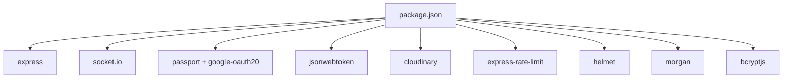

**Diagram sources**
- [package.json:24-46](file://backend/package.json#L24-L46)

**Section sources**
- [package.json:24-46](file://backend/package.json#L24-L46)

## Performance Considerations
- Socket.io ping timeout and room-based targeting minimize unnecessary broadcasts
- AI analysis uses resampling and DTW with bounded complexity; flattening mode increases points for complex characters
- Rate limiting reduces load on endpoints; development mode relaxes thresholds
- JWT token verification is lightweight; ensure secret rotation and secure cookie policies

[No sources needed since this section provides general guidance]

## Troubleshooting Guide
- Global error handler centralizes error responses and logs in development
- Socket authentication failures log warnings and errors; ensure token presence and validity
- Upload service throws descriptive errors for missing files or deletion failures
- Rate limiter messages guide users to retry later; adjust thresholds as needed

**Section sources**
- [errorHandler.js:61-92](file://backend/src/middlewares/errorHandler.js#L61-L92)
- [index.js:42-62](file://backend/src/sockets/index.js#L42-L62)
- [uploadService.js:47-59](file://backend/src/services/uploadService.js#L47-L59)
- [rateLimiter.js:19-58](file://backend/src/middlewares/rateLimiter.js#L19-L58)

## Conclusion
KhmerKid integrates real-time communication, AI-powered handwriting analysis, and cloud/media services through a clean, modular backend. Socket.io and JWT enable secure, responsive interactions; Passport and Cloudinary provide robust authentication and storage; middleware and error handling ensure reliability. The architecture supports extensibility and cross-platform compatibility for the Flutter frontend.

[No sources needed since this section summarizes without analyzing specific files]

## Appendices
- Constants and events define a shared vocabulary for real-time and gamification features
- Token utilities support both access and refresh token lifecycles
- Models and services encapsulate persistence and domain logic

**Section sources**
- [index.js:212-242](file://backend/src/constants/index.js#L212-L242)
- [token.js:17-88](file://backend/src/utils/token.js#L17-L88)
- [WritingProgress.js:204-245](file://backend/src/models/WritingProgress.js#L204-L245)