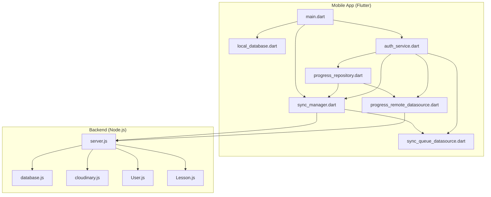
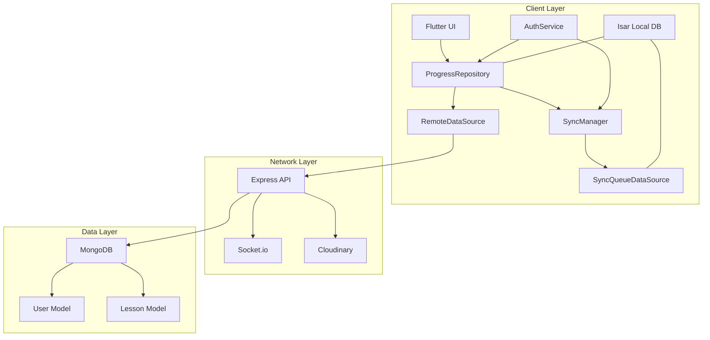
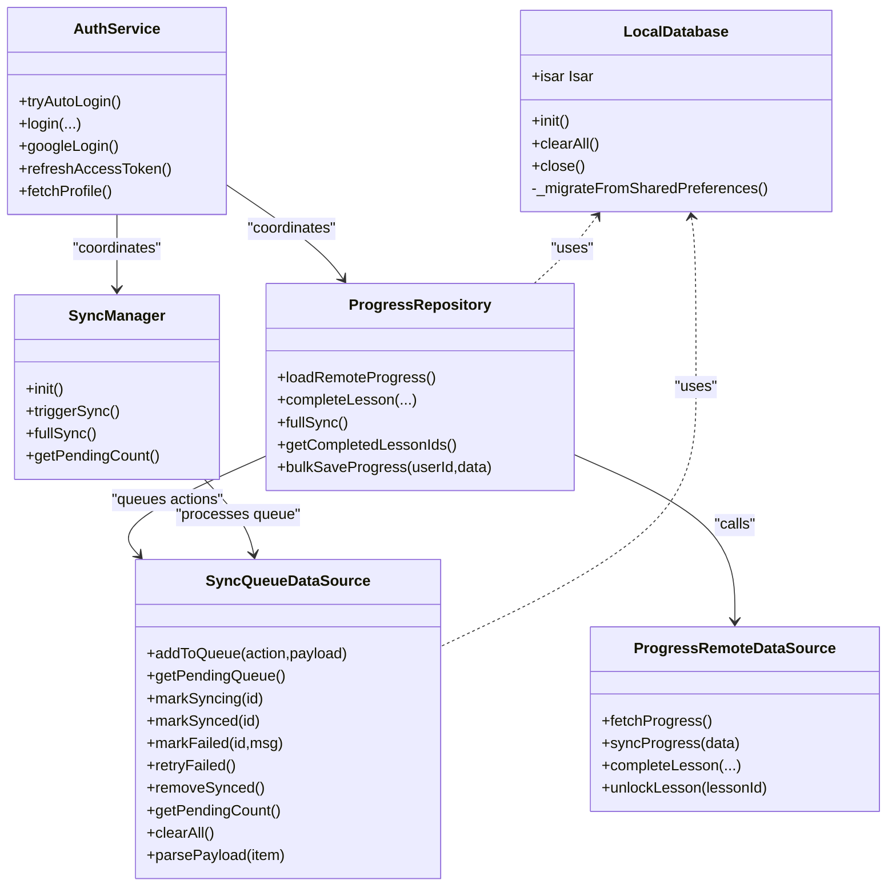
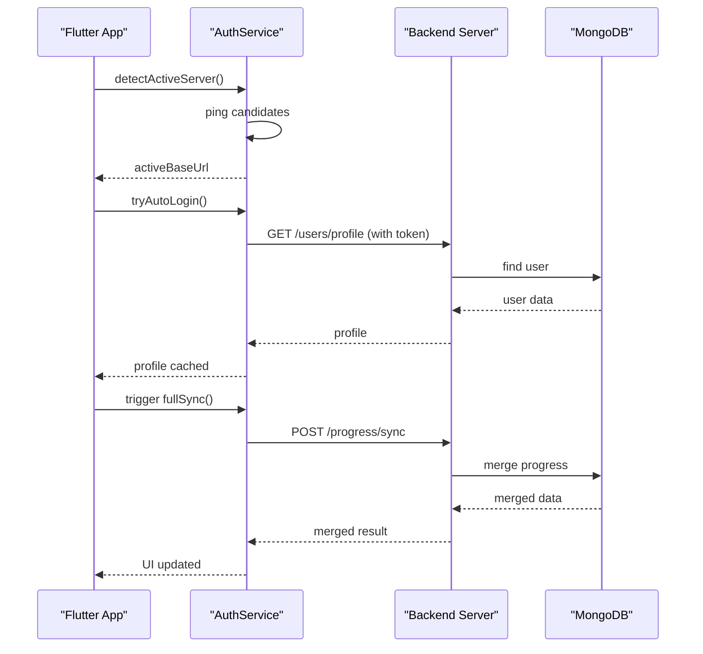
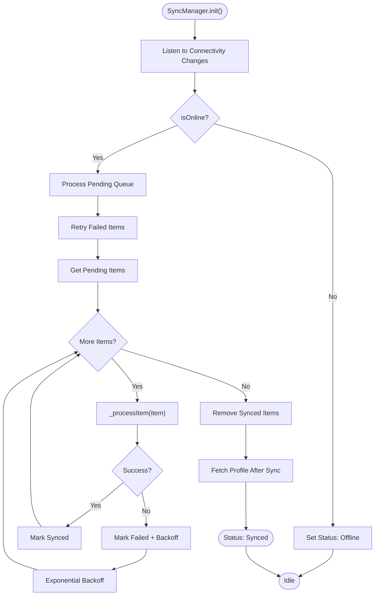
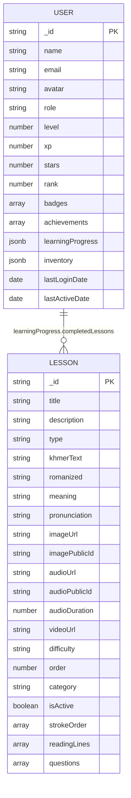
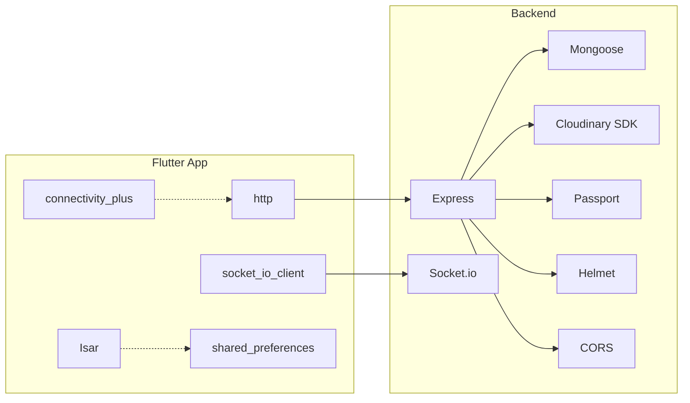

# System Design

<cite>
**Referenced Files in This Document**
- [README.md](file://README.md)
- [pubspec.yaml](file://pubspec.yaml)
- [main.dart](file://lib/main.dart)
- [local_database.dart](file://lib/data/local/local_database.dart)
- [sync_manager.dart](file://lib/services/sync_manager.dart)
- [auth_service.dart](file://lib/services/auth_service.dart)
- [progress_repository.dart](file://lib/repositories/progress_repository.dart)
- [progress_remote_datasource.dart](file://lib/data/remote/progress_remote_datasource.dart)
- [sync_queue_datasource.dart](file://lib/data/local/sync_queue_datasource.dart)
- [server.js](file://backend/server.js)
- [database.js](file://backend/src/config/database.js)
- [cloudinary.js](file://backend/src/config/cloudinary.js)
- [User.js](file://backend/src/models/User.js)
- [Lesson.js](file://backend/src/models/Lesson.js)
- [package.json](file://backend/package.json)
</cite>

## Table of Contents
1. [Introduction](#introduction)
2. [Project Structure](#project-structure)
3. [Core Components](#core-components)
4. [Architecture Overview](#architecture-overview)
5. [Detailed Component Analysis](#detailed-component-analysis)
6. [Dependency Analysis](#dependency-analysis)
7. [Performance Considerations](#performance-considerations)
8. [Troubleshooting Guide](#troubleshooting-guide)
9. [Conclusion](#conclusion)

## Introduction
This document presents the system design for the KhmerKid application, a Flutter-based educational app for teaching Khmer script to primary school children. The system follows a hybrid offline-first architecture: the Flutter mobile app stores most data locally using an embedded database and queues changes for later synchronization, while the Node.js backend provides centralized services, user management, media hosting via Cloudinary, and real-time capabilities through WebSocket connections. The backend persists data in MongoDB and exposes RESTful APIs consumed by the mobile app. The system integrates with Google APIs for authentication and supports two-tier handwriting recognition leveraging on-device machine learning and cloud-based services.

## Project Structure
The repository is organized into three major parts:
- Flutter mobile application under lib/ and assets/
- Node.js backend server under backend/
- Supporting documentation and assets

Key characteristics:
- Flutter app initializes local database, connectivity, language, and notifications concurrently; sets up a synchronization manager; and performs automatic server detection and login.
- Backend initializes Express server, connects to MongoDB, configures CORS, Helmet, rate limiting, Passport, Socket.io, and mounts routes.
- Dependencies and assets are declared in pubspec.yaml and backend package.json respectively.

**Diagram sources**
- [main.dart:1-129](file://lib/main.dart#L1-L129)
- [local_database.dart:1-276](file://lib/data/local/local_database.dart#L1-L276)
- [sync_manager.dart:1-246](file://lib/services/sync_manager.dart#L1-L246)
- [auth_service.dart:1-910](file://lib/services/auth_service.dart#L1-L910)
- [progress_repository.dart:1-416](file://lib/repositories/progress_repository.dart#L1-L416)
- [progress_remote_datasource.dart:1-144](file://lib/data/remote/progress_remote_datasource.dart#L1-L144)
- [sync_queue_datasource.dart:1-126](file://lib/data/local/sync_queue_datasource.dart#L1-L126)
- [server.js:1-160](file://backend/server.js#L1-L160)
- [database.js:1-66](file://backend/src/config/database.js#L1-L66)
- [cloudinary.js:1-70](file://backend/src/config/cloudinary.js#L1-L70)
- [User.js:1-243](file://backend/src/models/User.js#L1-L243)
- [Lesson.js:1-155](file://backend/src/models/Lesson.js#L1-L155)

**Section sources**
- [README.md:1-18](file://README.md#L1-L18)
- [pubspec.yaml:1-115](file://pubspec.yaml#L1-L115)
- [package.json:1-54](file://backend/package.json#L1-L54)

## Core Components
- Flutter Application
  - Local database: Isar embedded database with schema for lessons, progress, sync queue, game results, achievements, and user profiles.
  - Sync Manager: Orchestrates offline-first synchronization with exponential backoff, conflict resolution, and periodic sync.
  - Authentication Service: Manages server discovery, login flows (email/password, Google), token refresh, and profile caching.
  - Repositories and Data Sources: Progress repository coordinates local and remote operations; remote data source handles HTTP calls to backend.
  - Connectivity and Notifications: Connectivity monitoring and daily reminders for learning.
- Backend Server
  - Express server with Helmet, CORS, rate limiting, Passport, and Socket.io.
  - MongoDB connection with retry logic and graceful shutdown handling.
  - Cloudinary integration for media uploads and transformations.
  - Models for User and Lesson with indexes and virtuals.

**Section sources**
- [local_database.dart:1-276](file://lib/data/local/local_database.dart#L1-L276)
- [sync_manager.dart:1-246](file://lib/services/sync_manager.dart#L1-L246)
- [auth_service.dart:1-910](file://lib/services/auth_service.dart#L1-L910)
- [progress_repository.dart:1-416](file://lib/repositories/progress_repository.dart#L1-L416)
- [progress_remote_datasource.dart:1-144](file://lib/data/remote/progress_remote_datasource.dart#L1-L144)
- [server.js:1-160](file://backend/server.js#L1-L160)
- [database.js:1-66](file://backend/src/config/database.js#L1-L66)
- [cloudinary.js:1-70](file://backend/src/config/cloudinary.js#L1-L70)
- [User.js:1-243](file://backend/src/models/User.js#L1-L243)
- [Lesson.js:1-155](file://backend/src/models/Lesson.js#L1-L155)

## Architecture Overview
KhmerKid employs a hybrid offline-first architecture:
- Offline-first mobile app with an embedded database (Isar) and a sync queue for pending changes.
- Cloud-based backend with REST APIs, real-time features via Socket.io, and media management via Cloudinary.
- MongoDB as the authoritative data store for user profiles, lessons, progress, and gamification metrics.
- Real-world integration points include Google OAuth for authentication and Cloudinary for optimized media delivery.

**Diagram sources**
- [main.dart:1-129](file://lib/main.dart#L1-L129)
- [progress_repository.dart:1-416](file://lib/repositories/progress_repository.dart#L1-L416)
- [progress_remote_datasource.dart:1-144](file://lib/data/remote/progress_remote_datasource.dart#L1-L144)
- [auth_service.dart:1-910](file://lib/services/auth_service.dart#L1-L910)
- [sync_manager.dart:1-246](file://lib/services/sync_manager.dart#L1-L246)
- [sync_queue_datasource.dart:1-126](file://lib/data/local/sync_queue_datasource.dart#L1-L126)
- [server.js:1-160](file://backend/server.js#L1-L160)
- [database.js:1-66](file://backend/src/config/database.js#L1-L66)
- [cloudinary.js:1-70](file://backend/src/config/cloudinary.js#L1-L70)
- [User.js:1-243](file://backend/src/models/User.js#L1-L243)
- [Lesson.js:1-155](file://backend/src/models/Lesson.js#L1-L155)

## Detailed Component Analysis

### Offline-First Data Layer (Isar)
- Purpose: Persist user progress, cached lessons, sync queue, game results, achievements, and user profiles locally.
- Initialization: Single-instance Isar open with multiple schemas registered; migration from SharedPreferences during first run.
- Operations: Transactions for writes, structured migrations for legacy data, and selective clearing on logout.

**Diagram sources**
- [local_database.dart:1-276](file://lib/data/local/local_database.dart#L1-L276)
- [sync_queue_datasource.dart:1-126](file://lib/data/local/sync_queue_datasource.dart#L1-L126)
- [progress_repository.dart:1-416](file://lib/repositories/progress_repository.dart#L1-L416)
- [progress_remote_datasource.dart:1-144](file://lib/data/remote/progress_remote_datasource.dart#L1-L144)
- [auth_service.dart:1-910](file://lib/services/auth_service.dart#L1-L910)
- [sync_manager.dart:1-246](file://lib/services/sync_manager.dart#L1-L246)

**Section sources**
- [local_database.dart:1-276](file://lib/data/local/local_database.dart#L1-L276)
- [sync_queue_datasource.dart:1-126](file://lib/data/local/sync_queue_datasource.dart#L1-L126)
- [progress_repository.dart:1-416](file://lib/repositories/progress_repository.dart#L1-L416)
- [progress_remote_datasource.dart:1-144](file://lib/data/remote/progress_remote_datasource.dart#L1-L144)
- [sync_manager.dart:1-246](file://lib/services/sync_manager.dart#L1-L246)
- [auth_service.dart:1-910](file://lib/services/auth_service.dart#L1-L910)

### Authentication and Server Discovery
- Server discovery: Attempts manual override, saved URL, candidate IPs, and background subnet scanning; caches active URL.
- Authentication: Email/password, Google OAuth, refresh token flow; profile caching and optimistic updates.
- Cloudinary optimization: Utility to optimize Cloudinary image URLs.

**Diagram sources**
- [auth_service.dart:1-910](file://lib/services/auth_service.dart#L1-L910)
- [progress_remote_datasource.dart:1-144](file://lib/data/remote/progress_remote_datasource.dart#L1-L144)
- [server.js:1-160](file://backend/server.js#L1-L160)
- [database.js:1-66](file://backend/src/config/database.js#L1-L66)

**Section sources**
- [auth_service.dart:1-910](file://lib/services/auth_service.dart#L1-L910)
- [server.js:1-160](file://backend/server.js#L1-L160)
- [database.js:1-66](file://backend/src/config/database.js#L1-L66)

### Synchronization Engine
- Background sync: Monitors connectivity, retries failed items with exponential backoff, processes queue FIFO, and cleans synced items.
- Conflict resolution: Take-max strategy for stars and lesson orders; healing of lesson indices using lesson metadata.
- Full sync: Merges local and remote progress, heals lesson orders, updates local cache, and refreshes profile.

**Diagram sources**
- [sync_manager.dart:1-246](file://lib/services/sync_manager.dart#L1-L246)
- [sync_queue_datasource.dart:1-126](file://lib/data/local/sync_queue_datasource.dart#L1-L126)

**Section sources**
- [sync_manager.dart:1-246](file://lib/services/sync_manager.dart#L1-L246)
- [sync_queue_datasource.dart:1-126](file://lib/data/local/sync_queue_datasource.dart#L1-L126)

### Backend Services and Data Models
- Express server: Initializes security middleware, CORS, logging, body parsing, rate limiting, Passport, Socket.io, and routes.
- MongoDB: Connection with retry logic and graceful shutdown; indexes on User and Lesson for performance.
- Cloudinary: Upload and deletion utilities configured via environment variables.
- Models: User with gamification fields and learning progress; Lesson with content, media, and skill-specific fields.

**Diagram sources**
- [User.js:1-243](file://backend/src/models/User.js#L1-L243)
- [Lesson.js:1-155](file://backend/src/models/Lesson.js#L1-L155)

**Section sources**
- [server.js:1-160](file://backend/server.js#L1-L160)
- [database.js:1-66](file://backend/src/config/database.js#L1-L66)
- [cloudinary.js:1-70](file://backend/src/config/cloudinary.js#L1-L70)
- [User.js:1-243](file://backend/src/models/User.js#L1-L243)
- [Lesson.js:1-155](file://backend/src/models/Lesson.js#L1-L155)

## Dependency Analysis
- Flutter app depends on Isar for local persistence, Socket.io client for real-time, connectivity_plus for network awareness, and shared preferences for lightweight caching.
- Backend depends on Express, Mongoose for MongoDB, Socket.io for real-time, Cloudinary SDK, Passport for auth, and Helmet/CORS for security.
- Cross-cutting integrations: Google OAuth for authentication, Cloudinary for media optimization and delivery.

**Diagram sources**
- [pubspec.yaml:1-115](file://pubspec.yaml#L1-L115)
- [package.json:1-54](file://backend/package.json#L1-L54)

**Section sources**
- [pubspec.yaml:1-115](file://pubspec.yaml#L1-L115)
- [package.json:1-54](file://backend/package.json#L1-L54)

## Performance Considerations
- Offline-first reduces latency and improves resilience; ensure minimal payload sizes for sync operations.
- Isar transactions and bulk operations minimize disk contention; avoid large in-memory caches for progress.
- MongoDB indexes on frequently queried fields (rank, xp, level, lesson type/order) improve query performance.
- Cloudinary transformations reduce bandwidth and improve load times; use optimized URLs for images.
- Socket.io enables efficient real-time updates; throttle event frequency to prevent overload.
- Rate limiting and timeouts protect backend stability; enforce client-side retry caps to avoid thundering herds.

[No sources needed since this section provides general guidance]

## Troubleshooting Guide
Common issues and resolutions:
- Server discovery failures: Verify manual server URL, candidate IPs, and network connectivity; ensure backend health endpoint responds.
- Authentication errors: Confirm token validity, refresh flow, and network reachability; handle developer errors from Google Sign-In.
- Sync queue stuck: Inspect failed items, retry counts, and connectivity; apply exponential backoff and periodic retries.
- Database migration errors: Review SharedPreferences migration logic and Isar schema registration; ensure transaction safety.
- Media upload failures: Validate Cloudinary credentials and resource types; handle partial uploads and cleanup.

**Section sources**
- [auth_service.dart:1-910](file://lib/services/auth_service.dart#L1-L910)
- [sync_manager.dart:1-246](file://lib/services/sync_manager.dart#L1-L246)
- [local_database.dart:1-276](file://lib/data/local/local_database.dart#L1-L276)
- [cloudinary.js:1-70](file://backend/src/config/cloudinary.js#L1-L70)

## Conclusion
KhmerKid’s hybrid architecture balances offline usability with cloud-backed synchronization, delivering a robust and scalable solution for Khmer language education. The Flutter app’s offline-first design, combined with a secure and performant Node.js backend, ensures reliable user experiences across varied network conditions. Integrations with Google APIs and Cloudinary enhance authentication and media delivery, while MongoDB provides a flexible and indexed data foundation. The system’s modular components, clear separation of concerns, and resilient sync mechanisms position it well for future growth and feature expansion.