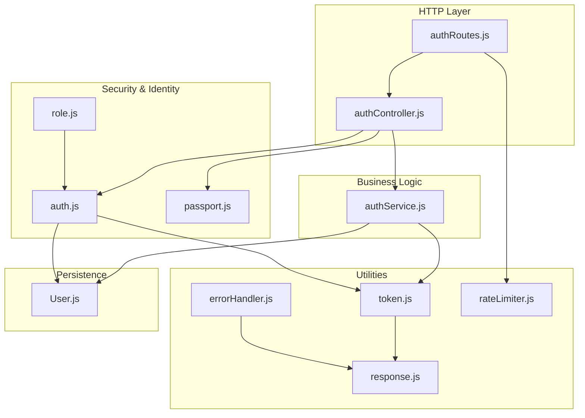
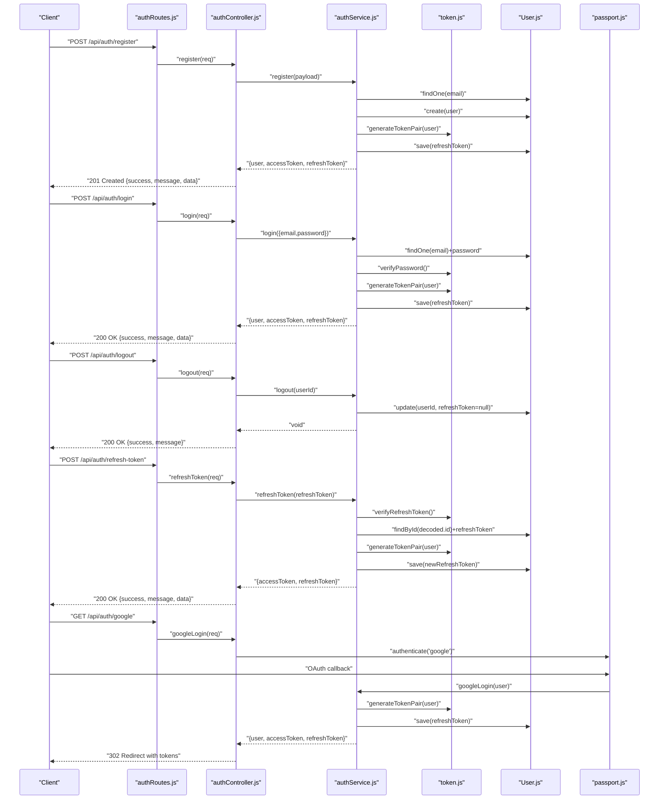
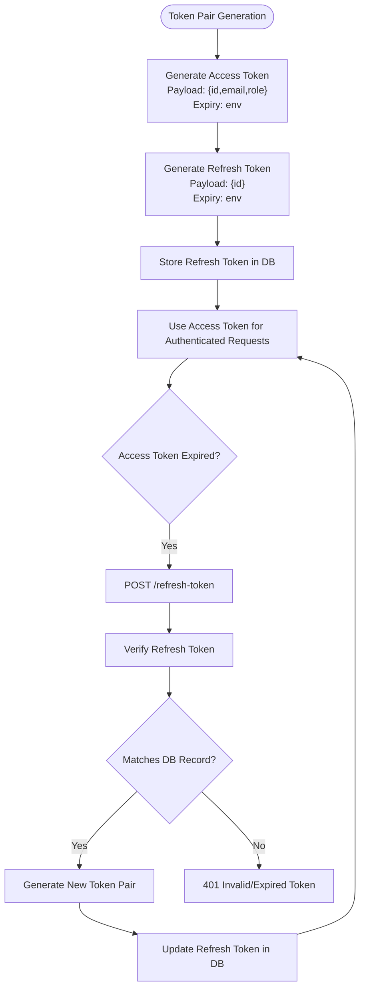
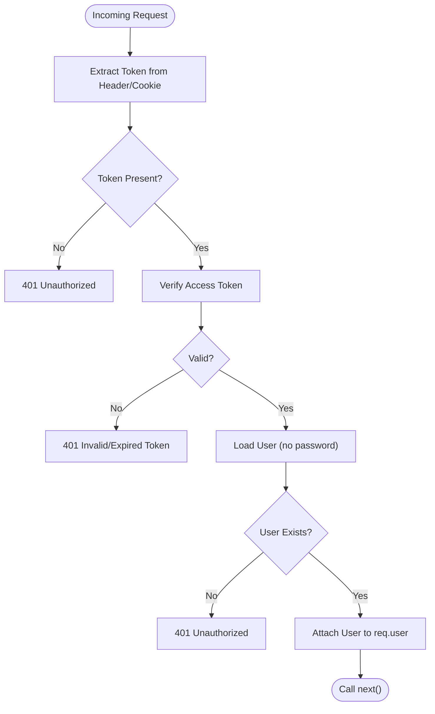
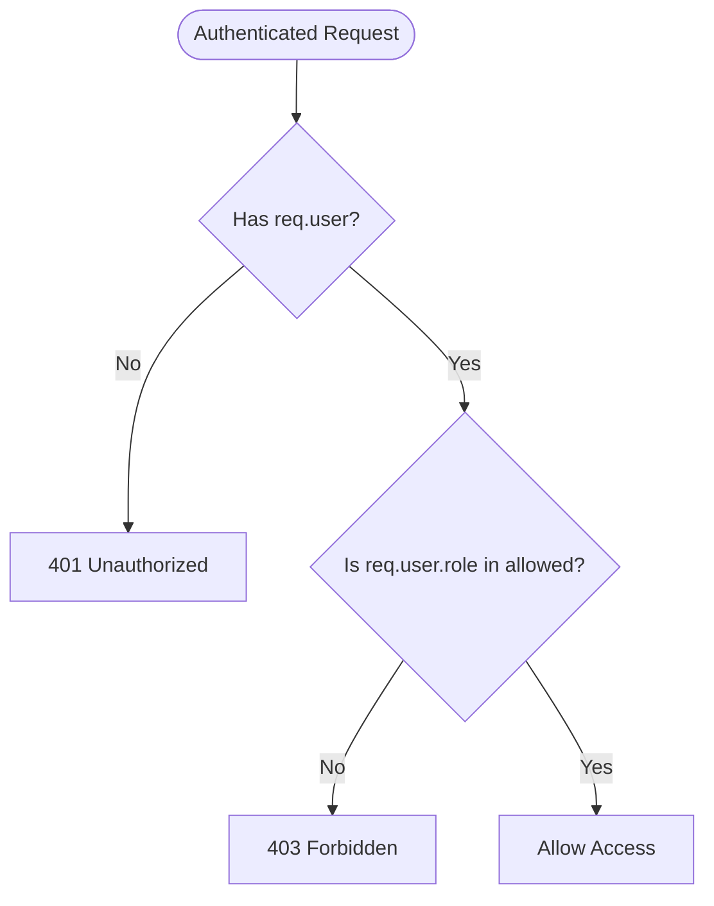
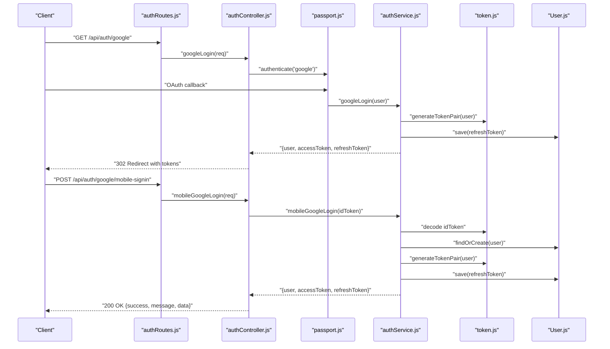
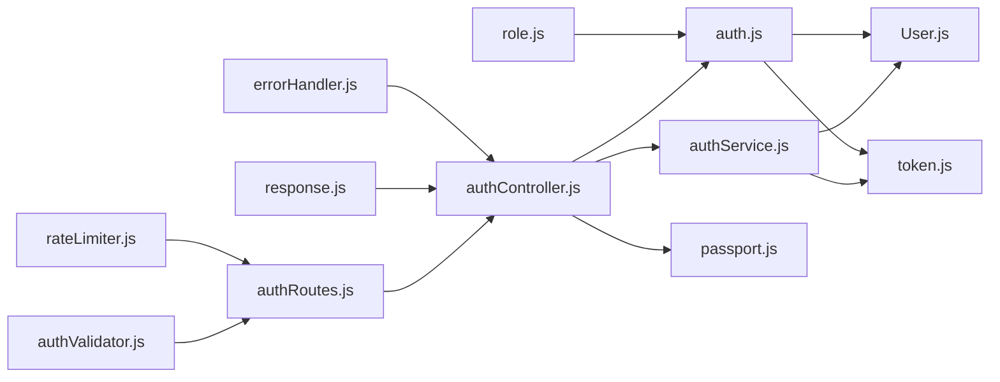
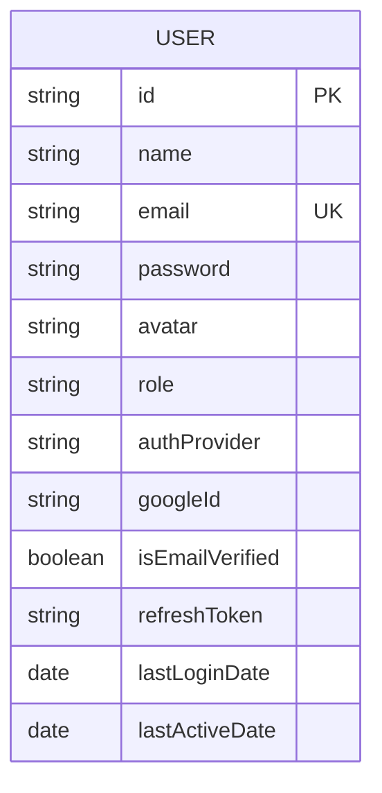

# Authentication APIs

<cite>
**Referenced Files in This Document**
- [authController.js](file://backend/src/controllers/authController.js)
- [authRoutes.js](file://backend/src/routes/authRoutes.js)
- [authService.js](file://backend/src/services/authService.js)
- [authValidator.js](file://backend/src/validators/authValidator.js)
- [auth.js](file://backend/src/middlewares/auth.js)
- [role.js](file://backend/src/middlewares/role.js)
- [token.js](file://backend/src/utils/token.js)
- [User.js](file://backend/src/models/User.js)
- [passport.js](file://backend/src/config/passport.js)
- [response.js](file://backend/src/utils/response.js)
- [errorHandler.js](file://backend/src/middlewares/errorHandler.js)
- [rateLimiter.js](file://backend/src/middlewares/rateLimiter.js)
- [index.js](file://backend/src/constants/index.js)
</cite>

## Table of Contents
1. [Introduction](#introduction)
2. [Project Structure](#project-structure)
3. [Core Components](#core-components)
4. [Architecture Overview](#architecture-overview)
5. [Detailed Component Analysis](#detailed-component-analysis)
6. [Dependency Analysis](#dependency-analysis)
7. [Performance Considerations](#performance-considerations)
8. [Troubleshooting Guide](#troubleshooting-guide)
9. [Conclusion](#conclusion)
10. [Appendices](#appendices)

## Introduction
This document provides comprehensive API documentation for the authentication system. It covers all authentication endpoints (registration, login, logout, token refresh), Google OAuth integration (web and mobile), JWT token management, refresh token handling, session security, authentication middleware, role-based access control, and authorization patterns. It also includes request/response schemas, error codes, security considerations, and integration examples for client applications.

## Project Structure
The authentication system is organized around controllers, routes, services, validators, middleware, utilities, and models. Controllers expose HTTP endpoints, services encapsulate business logic, validators enforce input constraints, middleware handles authentication and authorization, and utilities manage tokens and standardized responses.

**Diagram sources**
- [authRoutes.js:1-38](file://backend/src/routes/authRoutes.js#L1-L38)
- [authController.js:1-94](file://backend/src/controllers/authController.js#L1-L94)
- [authService.js:1-250](file://backend/src/services/authService.js#L1-L250)
- [auth.js:1-78](file://backend/src/middlewares/auth.js#L1-L78)
- [role.js:1-40](file://backend/src/middlewares/role.js#L1-L40)
- [passport.js:1-83](file://backend/src/config/passport.js#L1-L83)
- [token.js:1-98](file://backend/src/utils/token.js#L1-L98)
- [User.js:1-243](file://backend/src/models/User.js#L1-L243)
- [response.js:1-82](file://backend/src/utils/response.js#L1-L82)
- [errorHandler.js:1-98](file://backend/src/middlewares/errorHandler.js#L1-L98)
- [rateLimiter.js:1-65](file://backend/src/middlewares/rateLimiter.js#L1-L65)

**Section sources**
- [authRoutes.js:1-38](file://backend/src/routes/authRoutes.js#L1-L38)
- [authController.js:1-94](file://backend/src/controllers/authController.js#L1-L94)
- [authService.js:1-250](file://backend/src/services/authService.js#L1-L250)
- [auth.js:1-78](file://backend/src/middlewares/auth.js#L1-L78)
- [role.js:1-40](file://backend/src/middlewares/role.js#L1-L40)
- [passport.js:1-83](file://backend/src/config/passport.js#L1-L83)
- [token.js:1-98](file://backend/src/utils/token.js#L1-L98)
- [User.js:1-243](file://backend/src/models/User.js#L1-L243)
- [response.js:1-82](file://backend/src/utils/response.js#L1-L82)
- [errorHandler.js:1-98](file://backend/src/middlewares/errorHandler.js#L1-L98)
- [rateLimiter.js:1-65](file://backend/src/middlewares/rateLimiter.js#L1-L65)

## Core Components
- Authentication controller: Exposes endpoints for registration, login, logout, token refresh, and Google OAuth.
- Authentication service: Implements business logic for user registration, login, logout, token refresh, Google login, and mobile Google sign-in.
- Authentication middleware: Validates JWT access tokens and attaches the user to the request.
- Role-based access control middleware: Enforces authorization by user role.
- Token utilities: Generate and verify JWT access and refresh tokens, extract tokens from headers or cookies.
- Passport configuration: Google OAuth 2.0 strategy for web and callback handling.
- Validators: Input validation for registration, login, and refresh token requests.
- Response utilities: Standardized JSON response format.
- Error handling: Centralized error handling with custom AppError class.
- Rate limiting: Separate limits for general and authentication endpoints.

**Section sources**
- [authController.js:13-94](file://backend/src/controllers/authController.js#L13-L94)
- [authService.js:16-247](file://backend/src/services/authService.js#L16-L247)
- [auth.js:18-50](file://backend/src/middlewares/auth.js#L18-L50)
- [role.js:17-29](file://backend/src/middlewares/role.js#L17-L29)
- [token.js:39-88](file://backend/src/utils/token.js#L39-L88)
- [passport.js:14-65](file://backend/src/config/passport.js#L14-L65)
- [authValidator.js:9-37](file://backend/src/validators/authValidator.js#L9-L37)
- [response.js:17-58](file://backend/src/utils/response.js#L17-L58)
- [errorHandler.js:13-92](file://backend/src/middlewares/errorHandler.js#L13-L92)
- [rateLimiter.js:34-43](file://backend/src/middlewares/rateLimiter.js#L34-L43)

## Architecture Overview
The authentication flow integrates HTTP routing, validation, middleware, service logic, and persistence. Tokens are generated upon successful registration and login, stored securely in the database, and refreshed using a dedicated refresh token. Google OAuth enables seamless social login with automatic user creation or linking.

**Diagram sources**
- [authRoutes.js:24-35](file://backend/src/routes/authRoutes.js#L24-L35)
- [authController.js:14-90](file://backend/src/controllers/authController.js#L14-L90)
- [authService.js:20-132](file://backend/src/services/authService.js#L20-L132)
- [token.js:39-68](file://backend/src/utils/token.js#L39-L68)
- [User.js:216-231](file://backend/src/models/User.js#L216-L231)
- [passport.js:22-65](file://backend/src/config/passport.js#L22-L65)

## Detailed Component Analysis

### Authentication Endpoints
- POST /api/auth/register
  - Purpose: Register a new user with name, email, and password.
  - Request body:
    - name: string (required, length 2–50)
    - email: string (required, valid email)
    - password: string (required, min length 6)
  - Response: 201 Created with user profile and token pair.
  - Security: Input validated, password hashed, email uniqueness enforced, refresh token saved.
  - Errors: 400 (validation or email exists), 500 (server error).

- POST /api/auth/login
  - Purpose: Authenticate with email/password and return tokens.
  - Request body:
    - email: string (required, valid email)
    - password: string (required)
  - Response: 200 OK with user profile and token pair.
  - Security: Password comparison, Google provider check, streak and XP updates, refresh token rotation.
  - Errors: 401 (invalid credentials), 400 (Google-only account), 500 (server error).

- POST /api/auth/logout
  - Purpose: Invalidate refresh token for the current user.
  - Authentication: Required (Bearer token or cookie).
  - Response: 200 OK.
  - Security: Clears refresh token from DB; logout is effective immediately.
  - Errors: 401 (unauthorized), 500 (server error).

- POST /api/auth/refresh-token
  - Purpose: Issue a new access token using a valid refresh token.
  - Request body:
    - refreshToken: string (required)
  - Response: 200 OK with new token pair.
  - Security: Refresh token verification, DB match check, refresh token rotation.
  - Errors: 400 (missing token), 401 (invalid/expired token), 500 (server error).

- GET /api/auth/google
  - Purpose: Initiate Google OAuth login.
  - Response: 302 Redirect to Google OAuth consent page.
  - Security: Uses Passport Google strategy with profile/email scopes.

- GET /api/auth/google/callback
  - Purpose: Handle Google OAuth callback and issue tokens.
  - Response: 302 Redirect to client with accessToken and refreshToken query params.
  - Security: Passport verifies OAuth, service updates streak and XP, generates tokens.

- POST /api/auth/google/mobile-signin
  - Purpose: Authenticate using Google native idToken (mobile).
  - Request body:
    - idToken: string (required)
  - Response: 200 OK with user profile and token pair.
  - Security: Decodes idToken (supports mock format for testing), links or creates user, updates streak and XP, rotates refresh token.

**Section sources**
- [authRoutes.js:24-35](file://backend/src/routes/authRoutes.js#L24-L35)
- [authController.js:14-90](file://backend/src/controllers/authController.js#L14-L90)
- [authValidator.js:9-37](file://backend/src/validators/authValidator.js#L9-L37)
- [authService.js:20-246](file://backend/src/services/authService.js#L20-L246)
- [passport.js:14-65](file://backend/src/config/passport.js#L14-L65)

### JWT Token Management
- Access token:
  - Payload includes user id, email, and role.
  - Expires in configured duration (default ~15 minutes).
  - Extracted from Authorization header (Bearer) or accessToken cookie.
- Refresh token:
  - Payload includes user id.
  - Expires in configured duration (default ~7 days).
  - Stored in DB on registration and login; rotated on refresh.
- Token lifecycle:
  - Registration and login: generate token pair and persist refresh token.
  - Logout: clear refresh token.
  - Refresh: verify refresh token, regenerate tokens, rotate refresh token.

**Diagram sources**
- [token.js:39-68](file://backend/src/utils/token.js#L39-L68)
- [authService.js:36-45](file://backend/src/services/authService.js#L36-L45)
- [authService.js:86-94](file://backend/src/services/authService.js#L86-L94)
- [authService.js:124-131](file://backend/src/services/authService.js#L124-L131)

**Section sources**
- [token.js:17-88](file://backend/src/utils/token.js#L17-L88)
- [authService.js:36-45](file://backend/src/services/authService.js#L36-L45)
- [authService.js:86-94](file://backend/src/services/authService.js#L86-L94)
- [authService.js:124-131](file://backend/src/services/authService.js#L124-L131)

### Authentication Middleware
- authenticate(req, res, next):
  - Extracts token from Authorization header or accessToken cookie.
  - Verifies access token and loads user without password fields.
  - Attaches user to req.user and continues; otherwise returns 401.
- optionalAuth(req, res, next):
  - Attempts to authenticate if present; continues regardless of validity.

**Diagram sources**
- [auth.js:18-50](file://backend/src/middlewares/auth.js#L18-L50)
- [token.js:75-88](file://backend/src/utils/token.js#L75-L88)

**Section sources**
- [auth.js:18-50](file://backend/src/middlewares/auth.js#L18-L50)
- [token.js:75-88](file://backend/src/utils/token.js#L75-L88)

### Role-Based Access Control
- authorize(...roles):
  - Ensures the authenticated user has one of the allowed roles.
  - Returns 403 Forbidden if unauthorized.
- adminOnly:
  - Shorthand for authorize('admin').

**Diagram sources**
- [role.js:17-29](file://backend/src/middlewares/role.js#L17-L29)

**Section sources**
- [role.js:17-29](file://backend/src/middlewares/role.js#L17-L29)
- [index.js:13-24](file://backend/src/constants/index.js#L13-L24)

### Google OAuth Integration
- Web OAuth:
  - GET /api/auth/google initiates Google OAuth with profile/email scopes.
  - GET /api/auth/google/callback handles the OAuth callback, validates user, and issues tokens.
  - Redirects client with accessToken and refreshToken query parameters.
- Mobile OAuth:
  - POST /api/auth/google/mobile-signin accepts a Google idToken.
  - Decodes idToken (supports mock format for testing), links or creates user, updates streak and XP, and issues tokens.

**Diagram sources**
- [authRoutes.js:29-32](file://backend/src/routes/authRoutes.js#L29-L32)
- [authController.js:55-90](file://backend/src/controllers/authController.js#L55-L90)
- [passport.js:14-65](file://backend/src/config/passport.js#L14-L65)
- [authService.js:137-246](file://backend/src/services/authService.js#L137-L246)
- [token.js:39-68](file://backend/src/utils/token.js#L39-L68)
- [User.js:216-231](file://backend/src/models/User.js#L216-L231)

**Section sources**
- [authRoutes.js:29-32](file://backend/src/routes/authRoutes.js#L29-L32)
- [authController.js:55-90](file://backend/src/controllers/authController.js#L55-L90)
- [passport.js:14-65](file://backend/src/config/passport.js#L14-L65)
- [authService.js:137-246](file://backend/src/services/authService.js#L137-L246)

### Request/Response Schemas
- Common response envelope:
  - success: boolean
  - message: string
  - data: any (optional)
  - errors: any (optional, in error responses)

- Registration (POST /api/auth/register)
  - Request body: { name, email, password }
  - Response data: { user, accessToken, refreshToken }

- Login (POST /api/auth/login)
  - Request body: { email, password }
  - Response data: { user, accessToken, refreshToken }

- Logout (POST /api/auth/logout)
  - No request body.
  - Response: { success, message }

- Refresh Token (POST /api/auth/refresh-token)
  - Request body: { refreshToken }
  - Response data: { accessToken, refreshToken }

- Google OAuth (web)
  - GET /api/auth/google: Initiates OAuth.
  - GET /api/auth/google/callback: Redirects with tokens.

- Google OAuth (mobile)
  - POST /api/auth/google/mobile-signin
  - Request body: { idToken }
  - Response data: { user, accessToken, refreshToken }

**Section sources**
- [response.js:17-58](file://backend/src/utils/response.js#L17-L58)
- [authController.js:14-90](file://backend/src/controllers/authController.js#L14-L90)
- [authService.js:20-246](file://backend/src/services/authService.js#L20-L246)

### Error Codes and Handling
- Standardized error response envelope:
  - success: false
  - message: string
  - errors: any (optional)
- Common HTTP statuses:
  - 200 OK: Successful operations (login, refresh, logout)
  - 201 Created: Registration
  - 302 Found: OAuth redirects
  - 400 Bad Request: Validation errors, missing tokens, invalid credentials
  - 401 Unauthorized: Missing/invalid/expired tokens, unauthenticated access
  - 403 Forbidden: Insufficient permissions
  - 429 Too Many Requests: Rate limit exceeded
  - 500 Internal Server Error: Unexpected server errors
- Centralized error handling:
  - Custom AppError class with operational status and capture stack trace.
  - Handles JWT errors, validation errors, cast errors, and duplicate keys.
  - Logs error details in development mode.

**Section sources**
- [response.js:47-58](file://backend/src/utils/response.js#L47-L58)
- [errorHandler.js:13-92](file://backend/src/middlewares/errorHandler.js#L13-L92)
- [auth.js:42-49](file://backend/src/middlewares/auth.js#L42-L49)
- [rateLimiter.js:34-43](file://backend/src/middlewares/rateLimiter.js#L34-L43)

### Security Considerations
- Token storage:
  - Refresh tokens are stored in the database and rotated on each refresh.
  - Access tokens are short-lived; rely on refresh tokens for long sessions.
- Token extraction:
  - Supports Authorization header (Bearer) and accessToken cookie.
- Password security:
  - Passwords are hashed using bcrypt with a high salt factor.
  - Password field is excluded from API responses.
- OAuth safety:
  - Google OAuth uses verified profile data; mobile idToken decoding supports mock format for testing.
  - Users linked by email or Google ID to prevent duplication.
- Rate limiting:
  - Stricter auth rate limiter to mitigate brute force attacks.
- CORS and transport:
  - Use HTTPS in production; store refresh tokens in secure, httpOnly cookies if desired.

**Section sources**
- [token.js:75-88](file://backend/src/utils/token.js#L75-L88)
- [User.js:197-207](file://backend/src/models/User.js#L197-L207)
- [User.js:223-231](file://backend/src/models/User.js#L223-L231)
- [rateLimiter.js:34-43](file://backend/src/middlewares/rateLimiter.js#L34-L43)
- [authService.js:173-193](file://backend/src/services/authService.js#L173-L193)

### Integration Examples
- Web browser:
  - Registration: POST /api/auth/register with { name, email, password }.
  - Login: POST /api/auth/login with { email, password }; store accessToken in localStorage or cookie.
  - Protected route: Include Authorization: Bearer <accessToken> header.
  - Refresh token: POST /api/auth/refresh-token with { refreshToken }.
  - Logout: POST /api/auth/logout; clear stored tokens.
  - Google OAuth: Navigate to /api/auth/google; handle redirect with tokens.
- Mobile app:
  - Google mobile sign-in: POST /api/auth/google/mobile-signin with { idToken }.
  - Store accessToken and refreshToken securely; refresh when access token expires.

**Section sources**
- [authRoutes.js:24-35](file://backend/src/routes/authRoutes.js#L24-L35)
- [authController.js:55-90](file://backend/src/controllers/authController.js#L55-L90)
- [token.js:75-88](file://backend/src/utils/token.js#L75-L88)

## Dependency Analysis
The authentication system exhibits clear separation of concerns with low coupling between layers. Controllers depend on services and middleware; services depend on models and token utilities; middleware depends on models and token utilities; validators depend on express-validator; error handling is centralized.

**Diagram sources**
- [authRoutes.js:14-37](file://backend/src/routes/authRoutes.js#L14-L37)
- [authController.js:7-11](file://backend/src/controllers/authController.js#L7-L11)
- [authService.js:10-14](file://backend/src/services/authService.js#L10-L14)
- [auth.js:10-13](file://backend/src/middlewares/auth.js#L10-L13)
- [role.js:9-10](file://backend/src/middlewares/role.js#L9-L10)
- [authValidator.js:7](file://backend/src/validators/authValidator.js#L7)
- [response.js:8](file://backend/src/utils/response.js#L8)
- [errorHandler.js:13](file://backend/src/middlewares/errorHandler.js#L13)
- [rateLimiter.js:10](file://backend/src/middlewares/rateLimiter.js#L10)

**Section sources**
- [authRoutes.js:14-37](file://backend/src/routes/authRoutes.js#L14-L37)
- [authController.js:7-11](file://backend/src/controllers/authController.js#L7-L11)
- [authService.js:10-14](file://backend/src/services/authService.js#L10-L14)
- [auth.js:10-13](file://backend/src/middlewares/auth.js#L10-L13)
- [role.js:9-10](file://backend/src/middlewares/role.js#L9-L10)
- [authValidator.js:7](file://backend/src/validators/authValidator.js#L7)
- [response.js:8](file://backend/src/utils/response.js#L8)
- [errorHandler.js:13](file://backend/src/middlewares/errorHandler.js#L13)
- [rateLimiter.js:10](file://backend/src/middlewares/rateLimiter.js#L10)

## Performance Considerations
- Token lifetime:
  - Short-lived access tokens reduce exposure windows; refresh tokens enable long sessions.
- Database indexing:
  - User model includes indexes on ranking and XP for performance-sensitive queries.
- Rate limiting:
  - Separate auth limiter reduces risk of brute force while maintaining developer-friendly limits locally.
- Validation overhead:
  - Express-validator middleware ensures early exit on invalid input, reducing downstream processing.

[No sources needed since this section provides general guidance]

## Troubleshooting Guide
- 401 Unauthorized:
  - Missing Authorization header or invalid/expired access token.
  - Check token extraction from header or cookie.
- 401 Invalid/Expired Token:
  - Use refresh token endpoint to obtain a new access token.
- 403 Forbidden:
  - Insufficient role for protected route; ensure user has required role.
- 400 Validation Errors:
  - Review request body against validator rules (name length, email format, password length).
- 429 Too Many Requests:
  - Exceeded auth rate limit; wait before retrying.
- Google OAuth Issues:
  - Verify Google client credentials and callback URL.
  - For mobile, ensure idToken is valid and contains email.

**Section sources**
- [auth.js:42-49](file://backend/src/middlewares/auth.js#L42-L49)
- [role.js:19-25](file://backend/src/middlewares/role.js#L19-L25)
- [authValidator.js:9-37](file://backend/src/validators/authValidator.js#L9-L37)
- [rateLimiter.js:34-43](file://backend/src/middlewares/rateLimiter.js#L34-L43)
- [passport.js:14-65](file://backend/src/config/passport.js#L14-L65)
- [authService.js:173-193](file://backend/src/services/authService.js#L173-L193)

## Conclusion
The authentication system provides robust, standards-compliant endpoints for user registration, login, logout, and token refresh, alongside secure Google OAuth integration for both web and mobile clients. JWT access and refresh tokens are managed with strong security practices, including token rotation, strict validation, and rate limiting. The modular design with clear middleware and service boundaries simplifies maintenance and extension.

[No sources needed since this section summarizes without analyzing specific files]

## Appendices

### Data Models

**Diagram sources**
- [User.js:14-176](file://backend/src/models/User.js#L14-L176)

### Environment Variables
- JWT_SECRET: Secret for signing access tokens.
- JWT_REFRESH_SECRET: Secret for signing refresh tokens.
- JWT_EXPIRES_IN: Access token expiry (default ~15 minutes).
- JWT_REFRESH_EXPIRES_IN: Refresh token expiry (default ~7 days).
- GOOGLE_CLIENT_ID: Google OAuth client ID.
- GOOGLE_CLIENT_SECRET: Google OAuth client secret.
- GOOGLE_CALLBACK_URL: Google OAuth callback URL.
- CLIENT_URL: Frontend base URL for OAuth redirects.

**Section sources**
- [token.js:18-31](file://backend/src/utils/token.js#L18-L31)
- [passport.js:17-19](file://backend/src/config/passport.js#L17-L19)