# Backend Server (Node.js)

<cite>
**Referenced Files in This Document**
- [server.js](file://backend/server.js)
- [package.json](file://backend/package.json)
- [routes/index.js](file://backend/src/routes/index.js)
- [config/database.js](file://backend/src/config/database.js)
- [config/passport.js](file://backend/src/config/passport.js)
- [middlewares/auth.js](file://backend/src/middlewares/auth.js)
- [middlewares/errorHandler.js](file://backend/src/middlewares/errorHandler.js)
- [middlewares/rateLimiter.js](file://backend/src/middlewares/rateLimiter.js)
- [models/User.js](file://backend/src/models/User.js)
- [services/userService.js](file://backend/src/services/userService.js)
- [controllers/authController.js](file://backend/src/controllers/authController.js)
- [routes/authRoutes.js](file://backend/src/routes/authRoutes.js)
- [controllers/userController.js](file://backend/src/controllers/userController.js)
- [routes/userRoutes.js](file://backend/src/routes/userRoutes.js)
- [sockets/index.js](file://backend/src/sockets/index.js)
</cite>

## Table of Contents
1. [Introduction](#introduction)
2. [Project Structure](#project-structure)
3. [Core Components](#core-components)
4. [Architecture Overview](#architecture-overview)
5. [Detailed Component Analysis](#detailed-component-analysis)
6. [Dependency Analysis](#dependency-analysis)
7. [Performance Considerations](#performance-considerations)
8. [Security Measures](#security-measures)
9. [API Reference](#api-reference)
10. [Database Schema Design](#database-schema-design)
11. [Real-Time Communication](#real-time-communication)
12. [Troubleshooting Guide](#troubleshooting-guide)
13. [Conclusion](#conclusion)

## Introduction
This document provides comprehensive documentation for the Node.js backend server of the KhmerKid application. It covers the Express.js server architecture, middleware configuration, routing system, API endpoints, database schema using Mongoose models, service-layer business logic, real-time communication via Socket.io, security measures, error handling patterns, and performance optimization strategies. The backend integrates MongoDB for persistence, Passport.js for Google OAuth, Helmet and CORS for security, and Socket.io for real-time updates.

## Project Structure
The backend follows a modular structure organized by concerns:
- Entry point initializes Express, connects to MongoDB, sets up Socket.io, mounts routes, and applies global middleware.
- Routes aggregate sub-routes grouped by feature areas (authentication, user management, lessons, progress, games, missions, etc.).
- Controllers handle HTTP request-response logic and delegate to services.
- Services encapsulate business logic and coordinate with models and external integrations.
- Models define Mongoose schemas and pre-save hooks.
- Middlewares provide authentication, rate limiting, validation, and error handling.
- Sockets manage real-time events and user rooms.

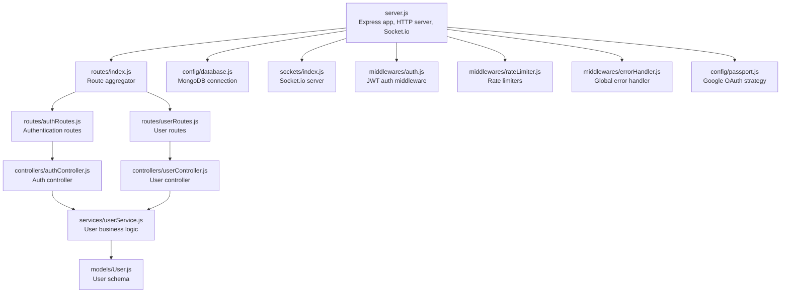

**Diagram sources**
- [server.js:1-160](file://backend/server.js#L1-L160)
- [routes/index.js:1-50](file://backend/src/routes/index.js#L1-L50)
- [config/database.js:1-66](file://backend/src/config/database.js#L1-L66)
- [sockets/index.js:1-134](file://backend/src/sockets/index.js#L1-L134)
- [routes/authRoutes.js:1-38](file://backend/src/routes/authRoutes.js#L1-L38)
- [routes/userRoutes.js:1-31](file://backend/src/routes/userRoutes.js#L1-L31)
- [controllers/authController.js:1-94](file://backend/src/controllers/authController.js#L1-L94)
- [controllers/userController.js:1-54](file://backend/src/controllers/userController.js#L1-L54)
- [services/userService.js:1-221](file://backend/src/services/userService.js#L1-L221)
- [models/User.js:1-243](file://backend/src/models/User.js#L1-L243)
- [middlewares/auth.js:1-78](file://backend/src/middlewares/auth.js#L1-L78)
- [middlewares/rateLimiter.js:1-65](file://backend/src/middlewares/rateLimiter.js#L1-L65)
- [middlewares/errorHandler.js:1-98](file://backend/src/middlewares/errorHandler.js#L1-L98)
- [config/passport.js:1-83](file://backend/src/config/passport.js#L1-L83)

**Section sources**
- [server.js:1-160](file://backend/server.js#L1-L160)
- [package.json:1-54](file://backend/package.json#L1-L54)
- [routes/index.js:1-50](file://backend/src/routes/index.js#L1-L50)

## Core Components
- Express server bootstrap and HTTP server creation.
- MongoDB connection with retry logic and graceful shutdown handling.
- Socket.io initialization and authentication middleware for real-time connections.
- Global middleware stack: Helmet, CORS, Morgan, body parsing, cookie parsing, rate limiting, Passport initialization.
- Centralized route aggregation under /api prefix.
- Global error handling with custom AppError class.
- Authentication middleware verifying JWT and attaching user to request.
- Rate limiters tailored for general API, authentication, and uploads.
- Passport Google OAuth strategy with auto-account creation and linking.

**Section sources**
- [server.js:38-139](file://backend/server.js#L38-L139)
- [config/database.js:16-63](file://backend/src/config/database.js#L16-L63)
- [sockets/index.js:23-91](file://backend/src/sockets/index.js#L23-L91)
- [middlewares/errorHandler.js:13-92](file://backend/src/middlewares/errorHandler.js#L13-L92)
- [middlewares/auth.js:18-72](file://backend/src/middlewares/auth.js#L18-L72)
- [middlewares/rateLimiter.js:19-58](file://backend/src/middlewares/rateLimiter.js#L19-L58)
- [config/passport.js:14-82](file://backend/src/config/passport.js#L14-L82)

## Architecture Overview
The backend employs a layered architecture:
- Presentation Layer: Express routes and controllers.
- Application Layer: Services implementing business logic.
- Domain Layer: Mongoose models with validation and lifecycle hooks.
- Infrastructure Layer: Database connectivity, Socket.io, Passport, and external integrations.

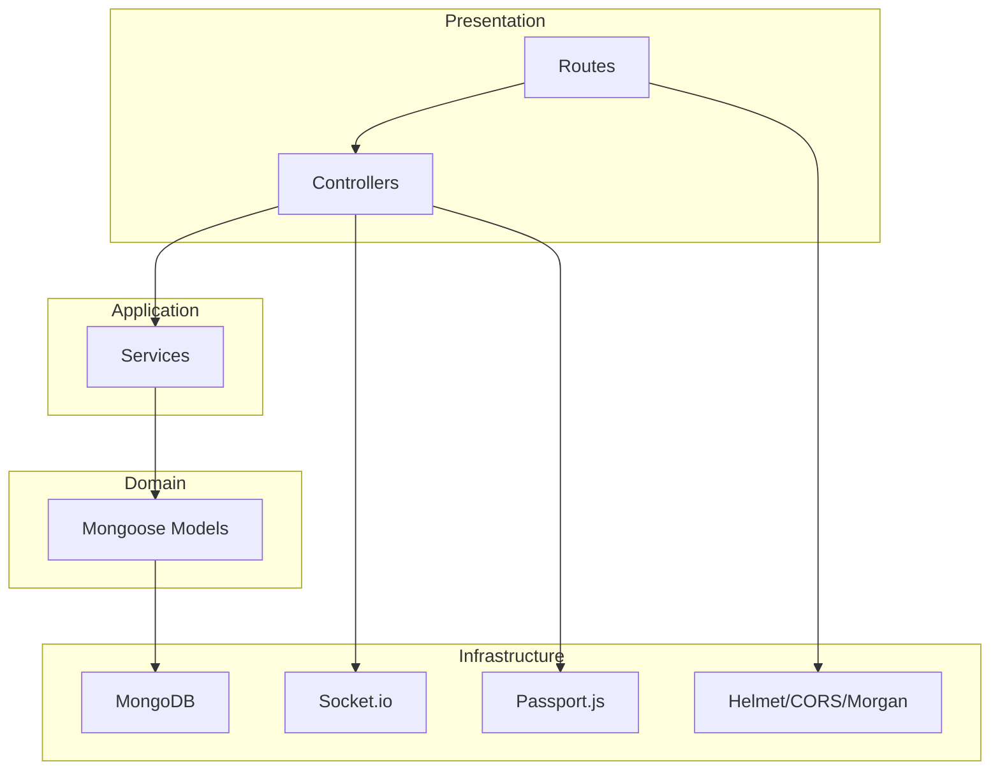

**Diagram sources**
- [server.js:59-121](file://backend/server.js#L59-L121)
- [routes/index.js:28-47](file://backend/src/routes/index.js#L28-L47)
- [services/userService.js:15-218](file://backend/src/services/userService.js#L15-L218)
- [models/User.js:14-240](file://backend/src/models/User.js#L14-L240)
- [sockets/index.js:23-91](file://backend/src/sockets/index.js#L23-L91)
- [config/passport.js:14-82](file://backend/src/config/passport.js#L14-L82)

## Detailed Component Analysis

### Express Server Initialization
- Initializes Express app and HTTP server.
- Establishes MongoDB connection with retry logic.
- Sets up Socket.io and exposes io instance to controllers.
- Registers health check endpoint and mounts aggregated routes.
- Applies global middlewares: Helmet, CORS, Morgan, body parsers, cookie parser, rate limiter, Passport.
- Defines 404 handler and global error handler.
- Starts server with graceful shutdown signals.

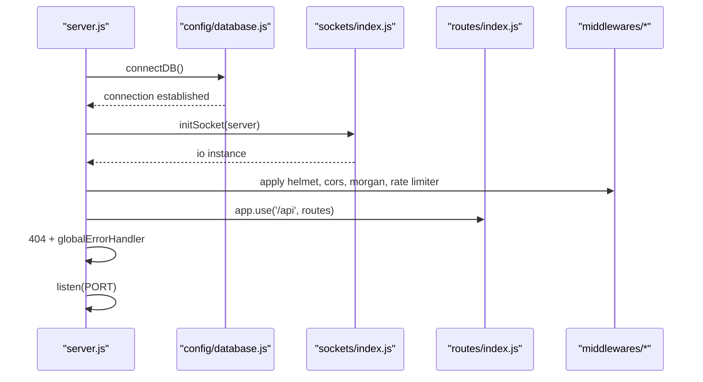

**Diagram sources**
- [server.js:24-121](file://backend/server.js#L24-L121)
- [config/database.js:16-40](file://backend/src/config/database.js#L16-L40)
- [sockets/index.js:23-91](file://backend/src/sockets/index.js#L23-L91)
- [routes/index.js:28-47](file://backend/src/routes/index.js#L28-L47)

**Section sources**
- [server.js:38-139](file://backend/server.js#L38-L139)
- [config/database.js:16-40](file://backend/src/config/database.js#L16-L40)

### Authentication Middleware
- Validates JWT from Authorization header or cookies.
- Attaches user object to request after successful verification.
- Supports optional authentication that does not block if no token.
- Integrates with token utilities and response helpers.

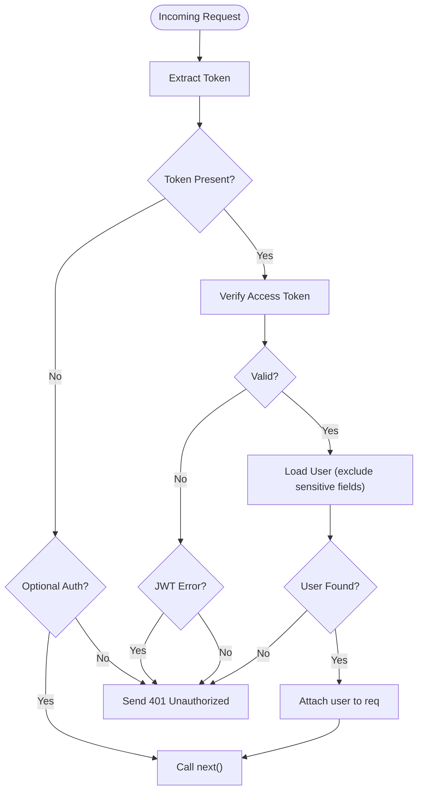

**Diagram sources**
- [middlewares/auth.js:18-50](file://backend/src/middlewares/auth.js#L18-L50)

**Section sources**
- [middlewares/auth.js:18-72](file://backend/src/middlewares/auth.js#L18-L72)

### Global Error Handling
- Custom AppError class with operational error classification.
- Centralized handler for CastError, duplicate key errors, validation errors, and JWT errors.
- Environment-aware logging and response payload.

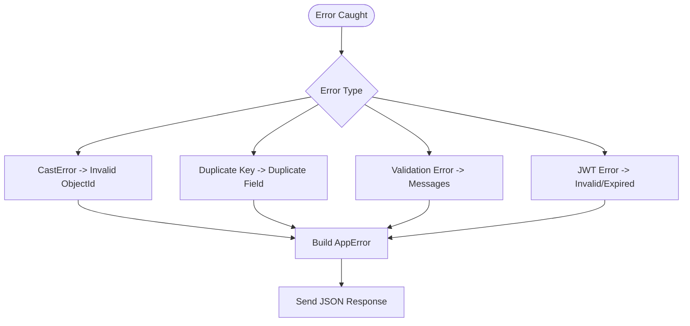

**Diagram sources**
- [middlewares/errorHandler.js:61-92](file://backend/src/middlewares/errorHandler.js#L61-L92)

**Section sources**
- [middlewares/errorHandler.js:13-92](file://backend/src/middlewares/errorHandler.js#L13-L92)

### Rate Limiting Strategy
- General API limiter with configurable window and max requests.
- Stricter auth limiter for login/register endpoints.
- Upload limiter for media-related endpoints.
- Development mode relaxes limits for local testing.

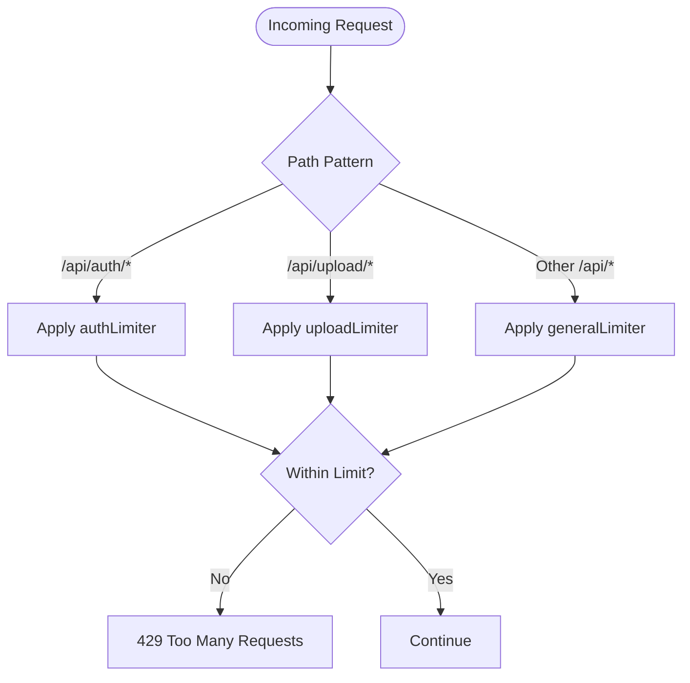

**Diagram sources**
- [middlewares/rateLimiter.js:19-58](file://backend/src/middlewares/rateLimiter.js#L19-L58)

**Section sources**
- [middlewares/rateLimiter.js:19-58](file://backend/src/middlewares/rateLimiter.js#L19-L58)

### Passport.js Google OAuth
- Configures Google OAuth strategy with client credentials and callback URL.
- On successful authentication, finds or creates user, links accounts if email matches, and updates last login date.
- Serializes/deserializes user for sessions.

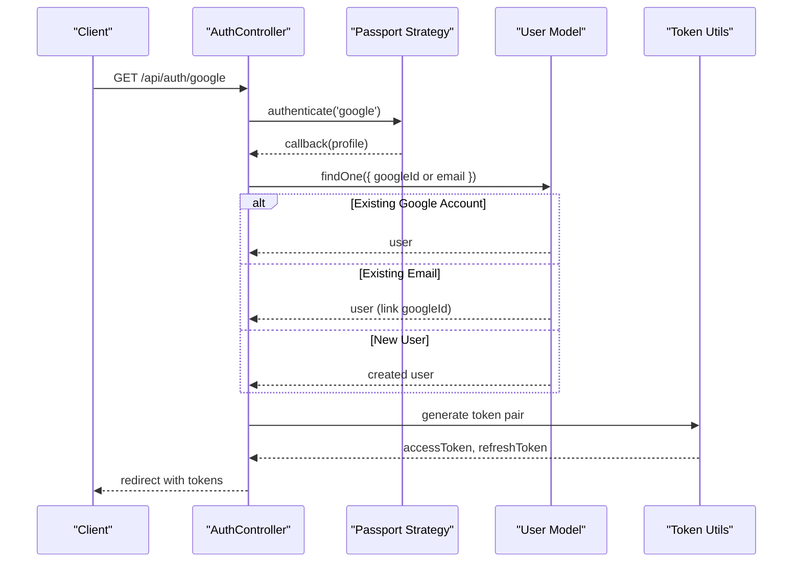

**Diagram sources**
- [config/passport.js:14-82](file://backend/src/config/passport.js#L14-L82)
- [controllers/authController.js:55-79](file://backend/src/controllers/authController.js#L55-L79)

**Section sources**
- [config/passport.js:14-82](file://backend/src/config/passport.js#L14-L82)
- [controllers/authController.js:55-90](file://backend/src/controllers/authController.js#L55-L90)

### User Management Service
- Retrieves and syncs progress from Progress model to User learningProgress.
- Updates profile fields with validation.
- Manages inventory updates.
- Adds XP and emits real-time events (XP_UPDATE, LEVEL_UPDATE) via Socket.io.
- Calculates user rank based on XP comparison.

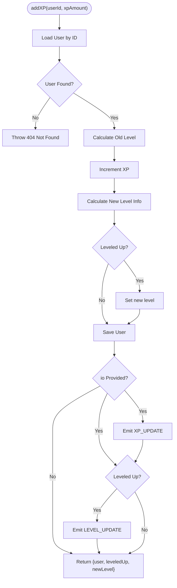

**Diagram sources**
- [services/userService.js:106-138](file://backend/src/services/userService.js#L106-L138)

**Section sources**
- [services/userService.js:15-218](file://backend/src/services/userService.js#L15-L218)

### Route Aggregation and Controllers
- Route aggregator mounts feature-specific routers under /api.
- Auth routes include registration, login, logout, refresh token, and Google OAuth endpoints.
- User routes include profile retrieval/update, rank, and gamified accumulation endpoints.

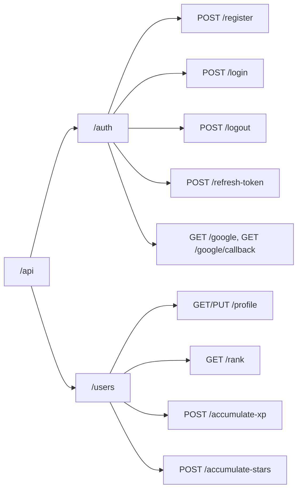

**Diagram sources**
- [routes/index.js:28-47](file://backend/src/routes/index.js#L28-L47)
- [routes/authRoutes.js:24-35](file://backend/src/routes/authRoutes.js#L24-L35)
- [routes/userRoutes.js:18-29](file://backend/src/routes/userRoutes.js#L18-L29)

**Section sources**
- [routes/index.js:28-47](file://backend/src/routes/index.js#L28-L47)
- [routes/authRoutes.js:24-35](file://backend/src/routes/authRoutes.js#L24-L35)
- [routes/userRoutes.js:18-29](file://backend/src/routes/userRoutes.js#L18-L29)

## Dependency Analysis
- Express depends on Helmet, CORS, Morgan, cookie-parser, rate-limiter, and Passport.
- Routes depend on controllers and validators.
- Controllers depend on services.
- Services depend on models and utilities.
- Socket.io depends on token verification and constants.
- Passport depends on Google OAuth strategy and User model.

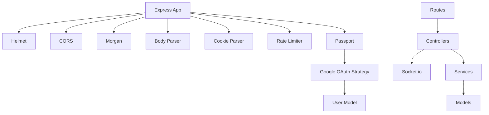

**Diagram sources**
- [server.js:59-89](file://backend/server.js#L59-L89)
- [routes/index.js:28-47](file://backend/src/routes/index.js#L28-L47)
- [controllers/authController.js:14-90](file://backend/src/controllers/authController.js#L14-L90)
- [controllers/userController.js:11-50](file://backend/src/controllers/userController.js#L11-L50)
- [services/userService.js:15-218](file://backend/src/services/userService.js#L15-L218)
- [models/User.js:14-240](file://backend/src/models/User.js#L14-L240)
- [sockets/index.js:23-91](file://backend/src/sockets/index.js#L23-L91)
- [config/passport.js:14-82](file://backend/src/config/passport.js#L14-L82)

**Section sources**
- [package.json:24-46](file://backend/package.json#L24-L46)

## Performance Considerations
- MongoDB connection pooling and timeouts configured for reliability.
- Body parsers with increased limits to accommodate media uploads.
- Rate limiting prevents abuse while allowing development flexibility.
- Socket.io ping timeout and room-based event delivery optimize real-time performance.
- Pre-save hooks and indexes on frequently queried fields reduce query overhead.

[No sources needed since this section provides general guidance]

## Security Measures
- Helmet secures HTTP headers.
- CORS restricts origins and methods, enabling credentials.
- Passport.js handles secure authentication with JWT.
- Google OAuth strategy with profile/email scopes and account linking.
- Authentication middleware validates tokens and attaches user context.
- Global error handler sanitizes error responses and avoids leaking internal details.

**Section sources**
- [server.js:59-89](file://backend/server.js#L59-L89)
- [config/passport.js:14-82](file://backend/src/config/passport.js#L14-L82)
- [middlewares/auth.js:18-50](file://backend/src/middlewares/auth.js#L18-L50)

## API Reference

### Authentication
- POST /api/auth/register
  - Description: Register a new user.
  - Validation: Uses register validator.
  - Response: Created token pair and user data.
- POST /api/auth/login
  - Description: Login with email/password or OAuth.
  - Validation: Uses login validator.
  - Response: Token pair and user data.
- POST /api/auth/logout
  - Description: Logout and invalidate session.
  - Auth: Required.
  - Response: Success message.
- POST /api/auth/refresh-token
  - Description: Refresh access token.
  - Validation: Uses refresh token validator.
  - Response: New token pair.
- GET /api/auth/google
  - Description: Initiate Google OAuth.
  - Response: Redirects to Google consent page.
- GET /api/auth/google/callback
  - Description: Handle Google OAuth callback.
  - Response: Redirects to client with tokens.
- POST /api/auth/google/mobile-signin
  - Description: Authenticate via Google ID token (mobile).
  - Response: Token pair and user data.

**Section sources**
- [routes/authRoutes.js:24-35](file://backend/src/routes/authRoutes.js#L24-L35)
- [controllers/authController.js:14-90](file://backend/src/controllers/authController.js#L14-L90)

### User Management
- GET /api/users/profile
  - Description: Retrieve authenticated user profile.
  - Auth: Required.
  - Response: User profile with level info.
- PUT /api/users/profile
  - Description: Update profile (name, avatar).
  - Auth: Required.
  - Validation: Uses update profile validator.
  - Response: Updated user profile.
- PUT /api/users/inventory
  - Description: Update user inventory items.
  - Auth: Required.
  - Response: Updated user profile.
- GET /api/users/rank
  - Description: Get user rank based on XP.
  - Auth: Required.
  - Response: Rank, XP, level, name, avatar.
- POST /api/users/accumulate-xp
  - Description: Add XP and trigger real-time updates.
  - Auth: Required.
  - Response: Updated XP/level info.
- POST /api/users/accumulate-stars
  - Description: Add stars to user.
  - Auth: Required.
  - Response: Updated star count.

**Section sources**
- [routes/userRoutes.js:18-29](file://backend/src/routes/userRoutes.js#L18-L29)
- [controllers/userController.js:11-50](file://backend/src/controllers/userController.js#L11-L50)
- [services/userService.js:106-152](file://backend/src/services/userService.js#L106-L152)

## Database Schema Design
The User model defines comprehensive fields for identity, authentication, gamification, learning progress, inventory, and activity tracking. It includes:
- Basic info: name, email, avatar.
- Auth: role, auth provider, Google ID, email verification, refresh token, password reset fields.
- Gamification: level, XP, stars, streaks.
- Badges and achievements: arrays of referenced documents.
- Ranking: numeric rank.
- Learning progress: totals and skill levels, completed lessons, weak skills.
- Inventory: power-ups counters and timestamps.
- Activity tracking: last login and last active dates.
- Indexes on rank, XP, and level for efficient ranking queries.
- Pre-save hooks for password hashing and level calculation.

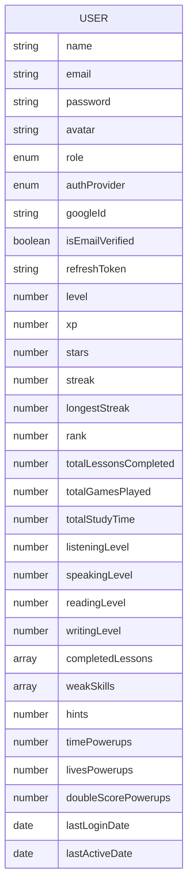

**Diagram sources**
- [models/User.js:14-176](file://backend/src/models/User.js#L14-L176)

**Section sources**
- [models/User.js:14-240](file://backend/src/models/User.js#L14-L240)

## Real-Time Communication
Socket.io enables real-time updates:
- Authentication: Validates JWT from handshake headers or query parameters.
- Rooms: Users join personal room and a broadcast room.
- Events: Emits XP updates and level-up notifications to users.
- Handlers: Registers domain-specific handlers (e.g., writing).
- Utilities: Provides emitToUser and broadcast helpers.

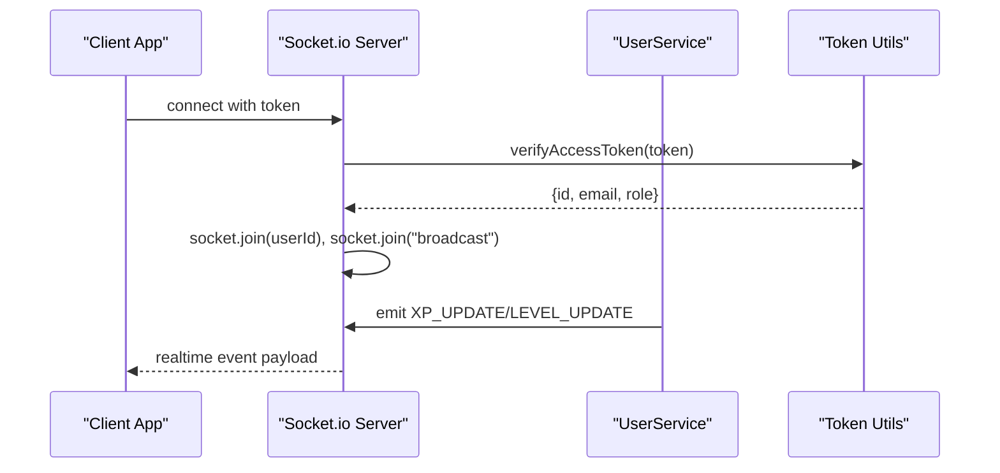

**Diagram sources**
- [sockets/index.js:34-87](file://backend/src/sockets/index.js#L34-L87)
- [services/userService.js:122-135](file://backend/src/services/userService.js#L122-L135)

**Section sources**
- [sockets/index.js:23-133](file://backend/src/sockets/index.js#L23-L133)
- [services/userService.js:106-138](file://backend/src/services/userService.js#L106-L138)

## Troubleshooting Guide
- MongoDB connection failures: Review connection logs and retry attempts; ensure MONGO_URI is set.
- Socket authentication errors: Confirm token presence and validity; verify token format (Bearer or query).
- Rate limit exceeded: Adjust RATE_LIMIT_MAX/RATE_LIMIT_WINDOW_MS or wait for window to reset.
- JWT errors: Validate token generation and expiration; ensure consistent token handling across auth flows.
- 404 not found: Verify route mounting and endpoint paths under /api.

**Section sources**
- [config/database.js:28-40](file://backend/src/config/database.js#L28-L40)
- [sockets/index.js:34-62](file://backend/src/sockets/index.js#L34-L62)
- [middlewares/rateLimiter.js:19-28](file://backend/src/middlewares/rateLimiter.js#L19-L28)
- [middlewares/errorHandler.js:77-81](file://backend/src/middlewares/errorHandler.js#L77-L81)

## Conclusion
The backend provides a robust, scalable foundation for the KhmerKid application with clear separation of concerns, comprehensive authentication and authorization, rich gamification features, and real-time capabilities. Its modular design facilitates maintainability and extensibility, while built-in security and performance measures ensure reliable operation across environments.