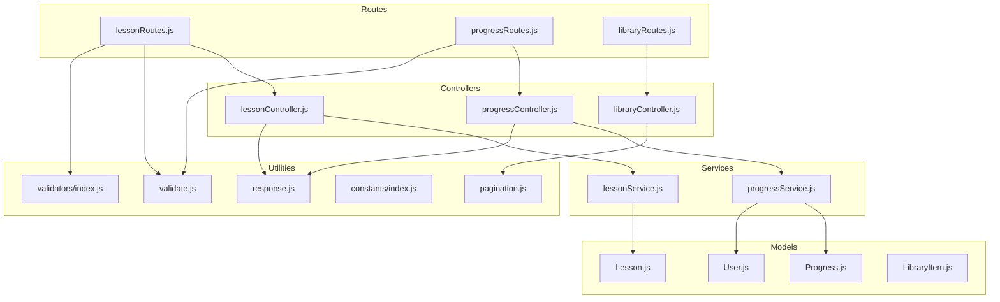
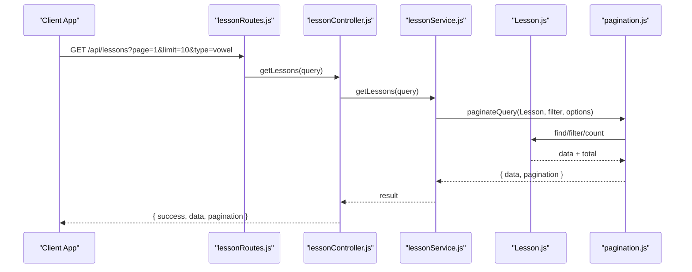
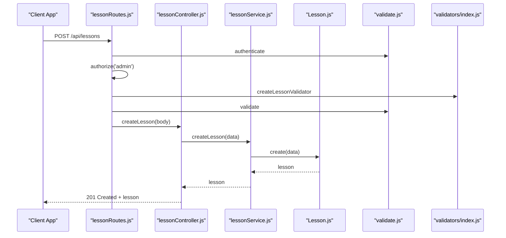
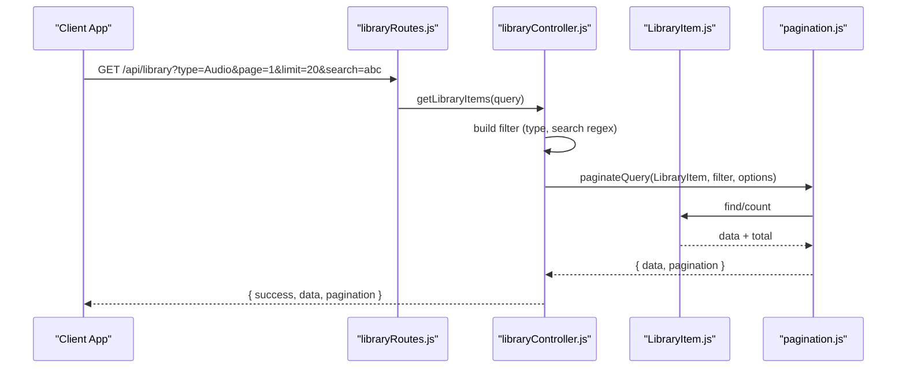
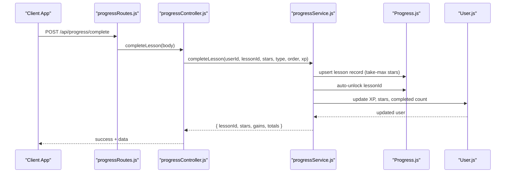
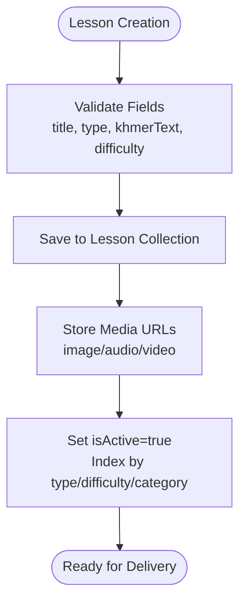
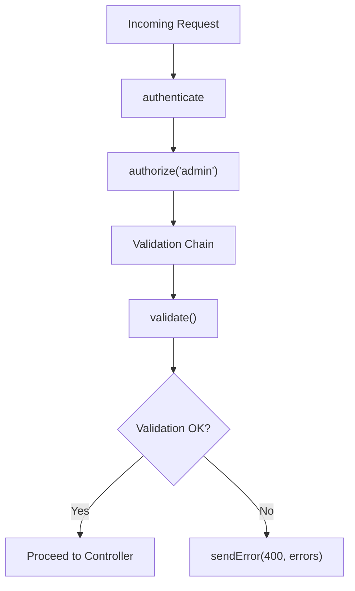
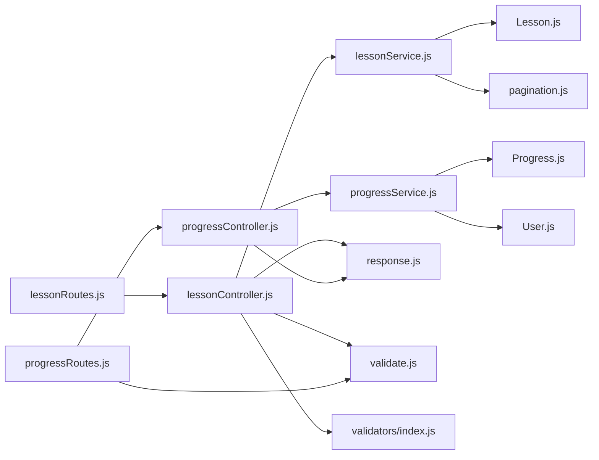
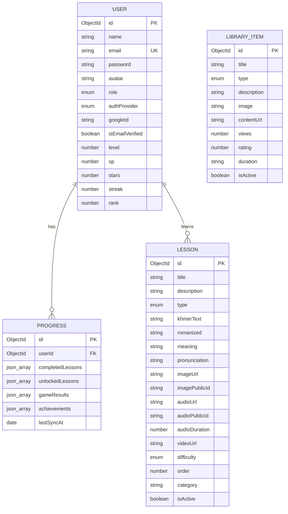

# Content Management APIs

<cite>
**Referenced Files in This Document**
- [Lesson.js](file://backend/src/models/Lesson.js)
- [LibraryItem.js](file://backend/src/models/LibraryItem.js)
- [Progress.js](file://backend/src/models/Progress.js)
- [User.js](file://backend/src/models/User.js)
- [lessonController.js](file://backend/src/controllers/lessonController.js)
- [libraryController.js](file://backend/src/controllers/libraryController.js)
- [progressController.js](file://backend/src/controllers/progressController.js)
- [lessonService.js](file://backend/src/services/lessonService.js)
- [progressService.js](file://backend/src/services/progressService.js)
- [lessonRoutes.js](file://backend/src/routes/lessonRoutes.js)
- [progressRoutes.js](file://backend/src/routes/progressRoutes.js)
- [index.js](file://backend/src/constants/index.js)
- [response.js](file://backend/src/utils/response.js)
- [pagination.js](file://backend/src/utils/pagination.js)
- [validate.js](file://backend/src/middlewares/validate.js)
- [index.js](file://backend/src/validators/index.js)
</cite>

## Table of Contents
1. [Introduction](#introduction)
2. [Project Structure](#project-structure)
3. [Core Components](#core-components)
4. [Architecture Overview](#architecture-overview)
5. [Detailed Component Analysis](#detailed-component-analysis)
6. [Dependency Analysis](#dependency-analysis)
7. [Performance Considerations](#performance-considerations)
8. [Troubleshooting Guide](#troubleshooting-guide)
9. [Conclusion](#conclusion)
10. [Appendices](#appendices)

## Introduction
This document provides comprehensive API documentation for the content management system focused on educational Khmer language lessons and library resources. It covers:
- Lesson management endpoints (CRUD, filtering, categorization, and statistics)
- Library item browsing and discovery
- Content delivery via media URLs
- Progress tracking and gamification integration
- Content validation and multimedia asset handling
- Examples of content creation workflows, bulk operations, and frontend integration patterns

## Project Structure
The backend follows a layered architecture:
- Routes define endpoint contracts and apply middleware
- Controllers orchestrate requests and delegate to services
- Services encapsulate business logic and data operations
- Models define schemas and indexes
- Utilities and middlewares provide shared functionality (validation, pagination, standardized responses)

**Diagram sources**
- [lessonRoutes.js:1-34](file://backend/src/routes/lessonRoutes.js#L1-L34)
- [progressRoutes.js:1-25](file://backend/src/routes/progressRoutes.js#L1-L25)
- [lessonController.js:1-87](file://backend/src/controllers/lessonController.js#L1-L87)
- [progressController.js:1-80](file://backend/src/controllers/progressController.js#L1-L80)
- [lessonService.js:1-130](file://backend/src/services/lessonService.js#L1-L130)
- [progressService.js:1-304](file://backend/src/services/progressService.js#L1-L304)
- [Lesson.js:1-155](file://backend/src/models/Lesson.js#L1-L155)
- [Progress.js:1-112](file://backend/src/models/Progress.js#L1-L112)
- [User.js:1-243](file://backend/src/models/User.js#L1-L243)
- [LibraryItem.js:1-63](file://backend/src/models/LibraryItem.js#L1-L63)
- [response.js:1-82](file://backend/src/utils/response.js#L1-L82)
- [pagination.js:1-74](file://backend/src/utils/pagination.js#L1-L74)
- [validate.js:1-34](file://backend/src/middlewares/validate.js#L1-L34)
- [index.js:1-109](file://backend/src/validators/index.js#L1-L109)

**Section sources**
- [lessonRoutes.js:1-34](file://backend/src/routes/lessonRoutes.js#L1-L34)
- [progressRoutes.js:1-25](file://backend/src/routes/progressRoutes.js#L1-L25)
- [lessonController.js:1-87](file://backend/src/controllers/lessonController.js#L1-L87)
- [progressController.js:1-80](file://backend/src/controllers/progressController.js#L1-L80)
- [lessonService.js:1-130](file://backend/src/services/lessonService.js#L1-L130)
- [progressService.js:1-304](file://backend/src/services/progressService.js#L1-L304)
- [Lesson.js:1-155](file://backend/src/models/Lesson.js#L1-L155)
- [Progress.js:1-112](file://backend/src/models/Progress.js#L1-L112)
- [User.js:1-243](file://backend/src/models/User.js#L1-L243)
- [LibraryItem.js:1-63](file://backend/src/models/LibraryItem.js#L1-L63)
- [response.js:1-82](file://backend/src/utils/response.js#L1-L82)
- [pagination.js:1-74](file://backend/src/utils/pagination.js#L1-L74)
- [validate.js:1-34](file://backend/src/middlewares/validate.js#L1-L34)
- [index.js:1-109](file://backend/src/validators/index.js#L1-L109)

## Core Components
- Lesson model: Defines lesson attributes, media fields, categorization, and indexes for efficient querying.
- LibraryItem model: Provides library resource metadata and discoverability filters.
- Progress model: Stores user’s completed lessons, unlocks, game results, and sync metadata.
- User model: Integrates gamification fields and learning progress tracking.
- Controllers: Expose REST endpoints for lessons, library items, and progress.
- Services: Implement business logic for lesson CRUD, filtering, pagination, and progress synchronization.
- Utilities: Standardized responses, pagination helpers, and validation middleware.

**Section sources**
- [Lesson.js:1-155](file://backend/src/models/Lesson.js#L1-L155)
- [LibraryItem.js:1-63](file://backend/src/models/LibraryItem.js#L1-L63)
- [Progress.js:1-112](file://backend/src/models/Progress.js#L1-L112)
- [User.js:1-243](file://backend/src/models/User.js#L1-L243)
- [lessonController.js:1-87](file://backend/src/controllers/lessonController.js#L1-L87)
- [libraryController.js:1-34](file://backend/src/controllers/libraryController.js#L1-L34)
- [progressController.js:1-80](file://backend/src/controllers/progressController.js#L1-L80)
- [lessonService.js:1-130](file://backend/src/services/lessonService.js#L1-L130)
- [progressService.js:1-304](file://backend/src/services/progressService.js#L1-L304)
- [response.js:1-82](file://backend/src/utils/response.js#L1-L82)
- [pagination.js:1-74](file://backend/src/utils/pagination.js#L1-L74)
- [validate.js:1-34](file://backend/src/middlewares/validate.js#L1-L34)

## Architecture Overview
The system separates concerns across routes, controllers, services, and models. Validation runs before service calls, and standardized responses unify API output. Progress synchronization supports offline-first scenarios with a take-max merge strategy.

**Diagram sources**
- [lessonRoutes.js:23-26](file://backend/src/routes/lessonRoutes.js#L23-L26)
- [lessonController.js:12-25](file://backend/src/controllers/lessonController.js#L12-L25)
- [lessonService.js:18-33](file://backend/src/services/lessonService.js#L18-L33)
- [pagination.js:49-67](file://backend/src/utils/pagination.js#L49-L67)
- [Lesson.js:1-155](file://backend/src/models/Lesson.js#L1-L155)

## Detailed Component Analysis

### Lesson Management API
Endpoints:
- GET /api/lessons (filters: type, difficulty, category, pagination)
- GET /api/lessons/type/:type (paginated by type)
- GET /api/lessons/:id (validation: MongoDB ObjectId)
- POST /api/lessons (admin-only, with validation)
- PUT /api/lessons/:id (admin-only, with validation)
- DELETE /api/lessons/:id (admin-only, soft delete)

Key behaviors:
- Filtering and sorting by order and createdAt
- Soft deletion sets isActive to false
- Validation ensures required fields and enums
- Pagination limits up to 50 per page

**Diagram sources**
- [lessonRoutes.js:29](file://backend/src/routes/lessonRoutes.js#L29)
- [lessonController.js:55-63](file://backend/src/controllers/lessonController.js#L55-L63)
- [lessonService.js:73-76](file://backend/src/services/lessonService.js#L73-L76)
- [Lesson.js:1-155](file://backend/src/models/Lesson.js#L1-L155)
- [validate.js:17-31](file://backend/src/middlewares/validate.js#L17-L31)
- [index.js:26-35](file://backend/src/validators/index.js#L26-L35)

**Section sources**
- [lessonRoutes.js:1-34](file://backend/src/routes/lessonRoutes.js#L1-L34)
- [lessonController.js:11-87](file://backend/src/controllers/lessonController.js#L11-L87)
- [lessonService.js:14-127](file://backend/src/services/lessonService.js#L14-L127)
- [Lesson.js:13-155](file://backend/src/models/Lesson.js#L13-L155)
- [index.js:27-38](file://backend/src/constants/index.js#L27-L38)
- [validate.js:17-31](file://backend/src/middlewares/validate.js#L17-L31)
- [index.js:26-45](file://backend/src/validators/index.js#L26-L45)

### Library Item Management API
Endpoints:
- GET /api/library (filters: type, search, pagination)

Key behaviors:
- Filters only active items
- Supports case-insensitive title search
- Sorts by newest first

**Diagram sources**
- [libraryRoutes.js:12-31](file://backend/src/routes/libraryRoutes.js#L12-L31)
- [libraryController.js:12-31](file://backend/src/controllers/libraryController.js#L12-L31)
- [pagination.js:49-67](file://backend/src/utils/pagination.js#L49-L67)
- [LibraryItem.js:9-63](file://backend/src/models/LibraryItem.js#L9-L63)

**Section sources**
- [libraryController.js:11-34](file://backend/src/controllers/libraryController.js#L11-L34)
- [LibraryItem.js:1-63](file://backend/src/models/LibraryItem.js#L1-L63)
- [pagination.js:14-74](file://backend/src/utils/pagination.js#L14-L74)

### Progress Tracking API
Endpoints:
- GET /api/progress/get
- POST /api/progress/sync
- POST /api/progress/complete
- POST /api/progress/unlock

Key behaviors:
- Offline-first sync with take-max strategy for stars and union for unlocks
- Auto-unlock on completion
- XP/stars awarded based on lesson type or explicit values
- Bidirectional merge updates user learning progress

**Diagram sources**
- [progressRoutes.js:19-57](file://backend/src/routes/progressRoutes.js#L19-L57)
- [progressController.js:33-57](file://backend/src/controllers/progressController.js#L33-L57)
- [progressService.js:160-285](file://backend/src/services/progressService.js#L160-L285)
- [Progress.js:12-112](file://backend/src/models/Progress.js#L12-L112)
- [User.js:14-243](file://backend/src/models/User.js#L14-L243)

**Section sources**
- [progressController.js:12-80](file://backend/src/controllers/progressController.js#L12-L80)
- [progressService.js:14-304](file://backend/src/services/progressService.js#L14-L304)
- [Progress.js:1-112](file://backend/src/models/Progress.js#L1-L112)
- [User.js:1-243](file://backend/src/models/User.js#L1-L243)

### Content Delivery and Multimedia Handling
- Lessons support media fields: image URL/publicId, audio URL/publicId, audio duration, video URL
- Library items support image and content URL fields
- Upload constraints and allowed types are centralized in constants

**Diagram sources**
- [Lesson.js:18-84](file://backend/src/models/Lesson.js#L18-L84)
- [index.js:155-162](file://backend/src/constants/index.js#L155-L162)
- [lessonService.js:73-76](file://backend/src/services/lessonService.js#L73-L76)

**Section sources**
- [Lesson.js:18-84](file://backend/src/models/Lesson.js#L18-L84)
- [LibraryItem.js:25-32](file://backend/src/models/LibraryItem.js#L25-L32)
- [index.js:155-162](file://backend/src/constants/index.js#L155-L162)

### Content Validation and Filtering
- Validation middleware checks express-validator chains and returns structured errors
- Validators enforce enums for lesson types and difficulty
- Pagination utilities normalize page/limit and compute metadata

**Diagram sources**
- [lessonRoutes.js:21-31](file://backend/src/routes/lessonRoutes.js#L21-L31)
- [validate.js:17-31](file://backend/src/middlewares/validate.js#L17-L31)
- [index.js:26-45](file://backend/src/validators/index.js#L26-L45)

**Section sources**
- [validate.js:10-34](file://backend/src/middlewares/validate.js#L10-L34)
- [index.js:26-45](file://backend/src/validators/index.js#L26-L45)
- [pagination.js:14-40](file://backend/src/utils/pagination.js#L14-L40)

## Dependency Analysis
- Controllers depend on services and response utilities
- Services depend on models and shared utilities
- Routes depend on controllers and middleware
- Models define indexes and relationships used by services
- Validators and constants are shared across routes and services

**Diagram sources**
- [lessonRoutes.js:14-31](file://backend/src/routes/lessonRoutes.js#L14-L31)
- [progressRoutes.js:12-22](file://backend/src/routes/progressRoutes.js#L12-L22)
- [lessonController.js:7-8](file://backend/src/controllers/lessonController.js#L7-L8)
- [progressController.js:9](file://backend/src/controllers/progressController.js#L9)
- [lessonService.js:9](file://backend/src/services/lessonService.js#L9)
- [progressService.js:10](file://backend/src/services/progressService.js#L10)
- [Lesson.js:10](file://backend/src/models/Lesson.js#L10)
- [Progress.js:10](file://backend/src/models/Progress.js#L10)
- [User.js:10](file://backend/src/models/User.js#L10)
- [response.js:17-28](file://backend/src/utils/response.js#L17-L28)
- [pagination.js:49-67](file://backend/src/utils/pagination.js#L49-L67)
- [validate.js:17-31](file://backend/src/middlewares/validate.js#L17-L31)
- [index.js:98-109](file://backend/src/validators/index.js#L98-L109)

**Section sources**
- [lessonRoutes.js:14-31](file://backend/src/routes/lessonRoutes.js#L14-L31)
- [progressRoutes.js:12-22](file://backend/src/routes/progressRoutes.js#L12-L22)
- [lessonController.js:7-8](file://backend/src/controllers/lessonController.js#L7-L8)
- [progressController.js:9](file://backend/src/controllers/progressController.js#L9)
- [lessonService.js:9](file://backend/src/services/lessonService.js#L9)
- [progressService.js:10](file://backend/src/services/progressService.js#L10)
- [Lesson.js:10](file://backend/src/models/Lesson.js#L10)
- [Progress.js:10](file://backend/src/models/Progress.js#L10)
- [User.js:10](file://backend/src/models/User.js#L10)
- [response.js:17-28](file://backend/src/utils/response.js#L17-L28)
- [pagination.js:49-67](file://backend/src/utils/pagination.js#L49-L67)
- [validate.js:17-31](file://backend/src/middlewares/validate.js#L17-L31)
- [index.js:98-109](file://backend/src/validators/index.js#L98-L109)

## Performance Considerations
- Indexes on Lesson: type, difficulty, isActive, category, order
- Indexes on Progress: userId (unique), completedLessons.lessonId
- Pagination caps limit at 50 per page to control load
- Aggregation for lesson statistics avoids loading full collections
- Bidirectional sync merges efficiently using maps and sets

[No sources needed since this section provides general guidance]

## Troubleshooting Guide
Common issues and resolutions:
- Validation errors: Ensure required fields and enums match constants; check validator chains
- Not found errors: Verify ObjectId format and existence; soft-deleted lessons have isActive=false
- Pagination anomalies: Confirm page>=1 and 1<=limit<=50
- Sync conflicts: Understand take-max strategy for stars and union for unlocks

**Section sources**
- [lessonService.js:38-50](file://backend/src/services/lessonService.js#L38-L50)
- [lessonService.js:97-109](file://backend/src/services/lessonService.js#L97-L109)
- [validate.js:17-31](file://backend/src/middlewares/validate.js#L17-L31)
- [pagination.js:14-20](file://backend/src/utils/pagination.js#L14-L20)
- [progressService.js:68-100](file://backend/src/services/progressService.js#L68-L100)

## Conclusion
The content management APIs provide robust lesson and library item management, strong validation, and comprehensive progress tracking. The architecture cleanly separates routing, controllers, services, and models, enabling maintainability and scalability. Integration with frontend learning modules is facilitated by standardized responses, pagination, and offline-first progress synchronization.

[No sources needed since this section summarizes without analyzing specific files]

## Appendices

### API Definitions

- GET /api/lessons
  - Query params: page, limit, type, difficulty, category
  - Response: { success, data: Lesson[], pagination }

- GET /api/lessons/type/:type
  - Path params: type (enum)
  - Query params: page, limit, difficulty
  - Response: { success, data: Lesson[], pagination }

- GET /api/lessons/:id
  - Path params: id (ObjectId)
  - Response: { success, data: Lesson }

- POST /api/lessons (admin)
  - Body: Lesson fields (validated)
  - Response: { success, data: Lesson, message }

- PUT /api/lessons/:id (admin)
  - Path params: id (ObjectId)
  - Body: Lesson fields (validated)
  - Response: { success, data: Lesson, message }

- DELETE /api/lessons/:id (admin)
  - Path params: id (ObjectId)
  - Response: { success, message }

- GET /api/library
  - Query params: type, search, page, limit
  - Response: { success, data: LibraryItem[], pagination }

- GET /api/progress/get
  - Response: { success, data: ProgressView }

- POST /api/progress/sync
  - Body: ClientProgress
  - Response: { success, data: MergedProgress }

- POST /api/progress/complete
  - Body: { lessonId, stars?, lessonType?, lessonOrder?, xp? }
  - Response: { success, data: CompletionResult }

- POST /api/progress/unlock
  - Body: { lessonId }
  - Response: { success, data: { lessonId, unlocked: true } }

**Section sources**
- [lessonRoutes.js:6-11](file://backend/src/routes/lessonRoutes.js#L6-L11)
- [lessonRoutes.js:23-31](file://backend/src/routes/lessonRoutes.js#L23-L31)
- [libraryRoutes.js:12-31](file://backend/src/routes/libraryRoutes.js#L12-L31)
- [progressRoutes.js:6-9](file://backend/src/routes/progressRoutes.js#L6-L9)
- [progressRoutes.js:19-22](file://backend/src/routes/progressRoutes.js#L19-L22)

### Data Models Overview

**Diagram sources**
- [User.js:14-243](file://backend/src/models/User.js#L14-L243)
- [Lesson.js:13-155](file://backend/src/models/Lesson.js#L13-L155)
- [Progress.js:12-112](file://backend/src/models/Progress.js#L12-L112)
- [LibraryItem.js:9-63](file://backend/src/models/LibraryItem.js#L9-L63)

### Content Creation Workflow Example
- Define lesson payload with title, type, khmerText, difficulty
- POST to /api/lessons (admin)
- On success, lesson becomes available via /api/lessons with filters and pagination

**Section sources**
- [lessonRoutes.js:29](file://backend/src/routes/lessonRoutes.js#L29)
- [lessonController.js:55-63](file://backend/src/controllers/lessonController.js#L55-L63)
- [lessonService.js:73-76](file://backend/src/services/lessonService.js#L73-L76)

### Bulk Operations and Filtering
- Use GET /api/lessons with type, difficulty, category, and pagination to fetch batches
- Use GET /api/lessons/type/:type for skill-specific lists
- Use GET /api/library with search and type to discover library items

**Section sources**
- [lessonService.js:18-33](file://backend/src/services/lessonService.js#L18-L33)
- [lessonService.js:56-68](file://backend/src/services/lessonService.js#L56-L68)
- [libraryController.js:12-31](file://backend/src/controllers/libraryController.js#L12-L31)

### Frontend Integration Notes
- Use GET /api/lessons for lesson lists and GET /api/lessons/:id for details
- Use GET /api/library for resource discovery
- Use POST /api/progress/complete to report completion and receive XP/stars updates
- Use POST /api/progress/sync for offline-first progress reconciliation

**Section sources**
- [lessonRoutes.js:23-26](file://backend/src/routes/lessonRoutes.js#L23-L26)
- [libraryRoutes.js:12-31](file://backend/src/routes/libraryRoutes.js#L12-L31)
- [progressRoutes.js:19-57](file://backend/src/routes/progressRoutes.js#L19-L57)