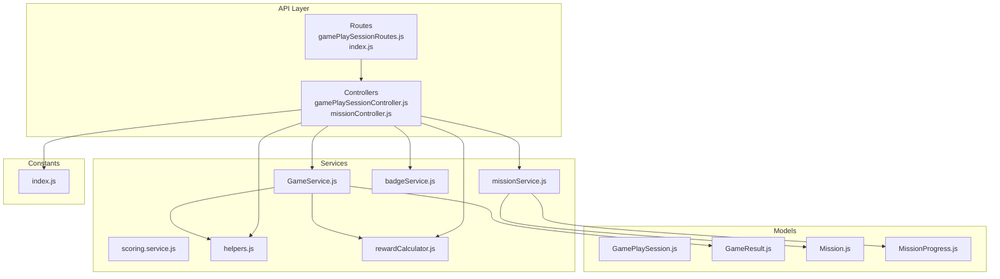
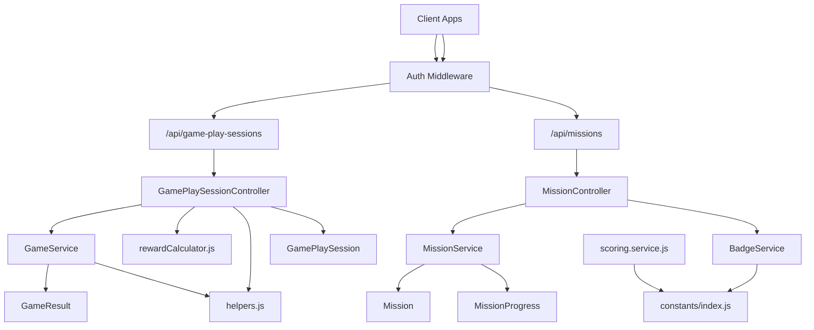
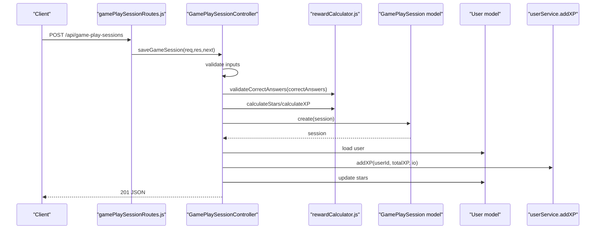
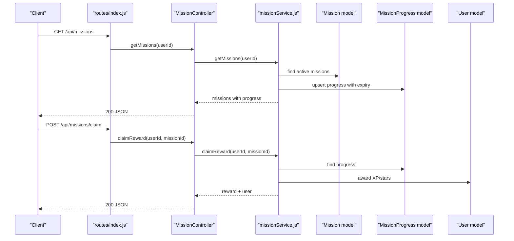
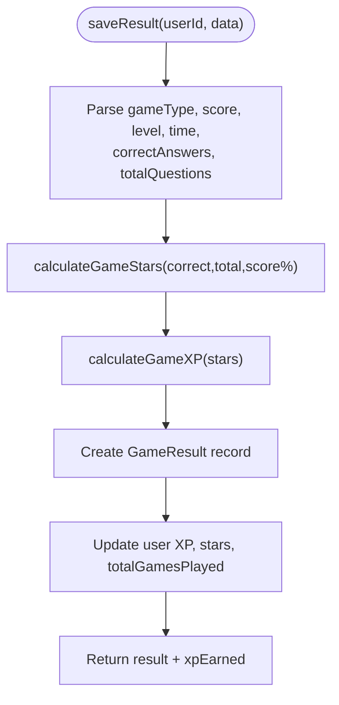
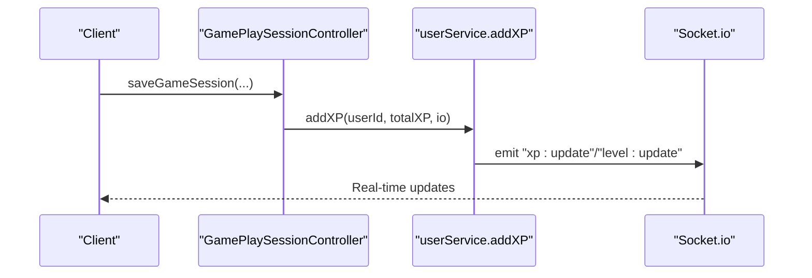
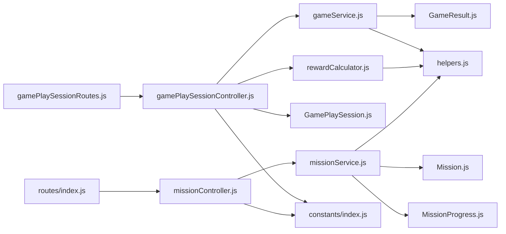

# Gaming & Activity APIs

<cite>
**Referenced Files in This Document**
- [GamePlaySession.js](file://backend/src/models/GamePlaySession.js)
- [Mission.js](file://backend/src/models/Mission.js)
- [MissionProgress.js](file://backend/src/models/MissionProgress.js)
- [GameResult.js](file://backend/src/models/GameResult.js)
- [gamePlaySessionController.js](file://backend/src/controllers/gamePlaySessionController.js)
- [missionController.js](file://backend/src/controllers/missionController.js)
- [gameService.js](file://backend/src/services/gameService.js)
- [missionService.js](file://backend/src/services/missionService.js)
- [scoring.service.js](file://backend/src/services/scoring.service.js)
- [rewardCalculator.js](file://backend/src/utils/rewardCalculator.js)
- [helpers.js](file://backend/src/utils/helpers.js)
- [index.js](file://backend/src/constants/index.js)
- [gamePlaySessionRoutes.js](file://backend/src/routes/gamePlaySessionRoutes.js)
- [index.js](file://backend/src/routes/index.js)
</cite>

## Table of Contents
1. [Introduction](#introduction)
2. [Project Structure](#project-structure)
3. [Core Components](#core-components)
4. [Architecture Overview](#architecture-overview)
5. [Detailed Component Analysis](#detailed-component-analysis)
6. [Dependency Analysis](#dependency-analysis)
7. [Performance Considerations](#performance-considerations)
8. [Troubleshooting Guide](#troubleshooting-guide)
9. [Conclusion](#conclusion)
10. [Appendices](#appendices)

## Introduction
This document provides comprehensive API documentation for the gaming and activity systems, focusing on game session management, mission tracking, and interactive activity APIs. It covers the lifecycle of game play sessions, scoring algorithms, challenge completion handling, and real-time coordination via socket events. It also explains the GamePlaySession and Mission models, real-time game state management, and multiplayer coordination. Examples demonstrate how to integrate games, persist sessions, and implement scoring systems used in educational gaming features.

## Project Structure
The gaming and activity APIs are implemented in the backend Node.js application using Express and Mongoose. Key areas:
- Models define data schemas for GamePlaySession, Mission, MissionProgress, and GameResult.
- Controllers expose REST endpoints for saving game sessions, claiming mission rewards, and managing badges and rankings.
- Services encapsulate business logic for scoring, mission progress, and game result persistence.
- Utilities provide scoring algorithms and helper functions for XP calculations and streak management.
- Routes mount the API endpoints under the /api prefix.

**Diagram sources**
- [gamePlaySessionRoutes.js:1-12](file://backend/src/routes/gamePlaySessionRoutes.js#L1-L12)
- [index.js:1-50](file://backend/src/routes/index.js#L1-L50)
- [gamePlaySessionController.js:1-219](file://backend/src/controllers/gamePlaySessionController.js#L1-L219)
- [missionController.js:1-135](file://backend/src/controllers/missionController.js#L1-L135)
- [gameService.js:1-89](file://backend/src/services/gameService.js#L1-L89)
- [missionService.js:1-138](file://backend/src/services/missionService.js#L1-L138)
- [scoring.service.js:1-279](file://backend/src/services/scoring.service.js#L1-L279)
- [helpers.js:1-247](file://backend/src/utils/helpers.js#L1-L247)
- [rewardCalculator.js:1-114](file://backend/src/utils/rewardCalculator.js#L1-L114)
- [GamePlaySession.js:1-115](file://backend/src/models/GamePlaySession.js#L1-L115)
- [GameResult.js:1-64](file://backend/src/models/GameResult.js#L1-L64)
- [Mission.js:1-69](file://backend/src/models/Mission.js#L1-L69)
- [MissionProgress.js:1-56](file://backend/src/models/MissionProgress.js#L1-L56)
- [index.js:1-242](file://backend/src/constants/index.js#L1-L242)

**Section sources**
- [gamePlaySessionRoutes.js:1-12](file://backend/src/routes/gamePlaySessionRoutes.js#L1-L12)
- [index.js:1-50](file://backend/src/routes/index.js#L1-L50)

## Core Components
This section documents the primary models and services involved in gaming and activity systems.

- GamePlaySession model
  - Stores per-session metrics for a single lesson and character, including counts of correct and wrong answers, star and XP totals, and timestamps.
  - Enforces constraints ensuring totalQuestions equals correctAnswers plus wrongAnswers and validates integer bounds.
  - Provides pre-save validation to maintain data integrity.

- Mission model
  - Defines daily or weekly missions with action types, numeric requirements, and rewards (XP, stars, or badge).
  - Includes metadata such as title, description, icon, ordering, and activation flag.

- MissionProgress model
  - Tracks individual user progress toward mission completion, expiration, and claim status.
  - Uses compound indexing and TTL for automatic cleanup of expired entries.

- GameResult model
  - Captures results for various game types with score, stars, level, time, and correctness metrics.
  - Supports aggregation queries for statistics and history.

- GameService
  - Persists game results, computes stars and XP, updates user learning progress, and increments total games played.
  - Returns computed XP alongside persisted records.

- missionService
  - Retrieves active missions with user-specific progress, creates progress entries with appropriate expiry, updates progress for matching actions, and handles reward claims.

- scoring.service
  - Implements pronunciation scoring using Jaro-Winkler similarity and digit normalization, returning a final weighted score with pass/fail thresholds.

- rewardCalculator
  - Computes star allocation, XP, and perfect rewards for fixed-question sessions (20 questions), with strict validation.

- helpers
  - Provides XP-to-level calculations, star scaling from percentages, streak computation, and date range utilities.

- constants
  - Centralizes enums for game types, mission types/actions, XP configuration, and socket events.

**Section sources**
- [GamePlaySession.js:1-115](file://backend/src/models/GamePlaySession.js#L1-L115)
- [Mission.js:1-69](file://backend/src/models/Mission.js#L1-L69)
- [MissionProgress.js:1-56](file://backend/src/models/MissionProgress.js#L1-L56)
- [GameResult.js:1-64](file://backend/src/models/GameResult.js#L1-L64)
- [gameService.js:1-89](file://backend/src/services/gameService.js#L1-L89)
- [missionService.js:1-138](file://backend/src/services/missionService.js#L1-L138)
- [scoring.service.js:1-279](file://backend/src/services/scoring.service.js#L1-L279)
- [rewardCalculator.js:1-114](file://backend/src/utils/rewardCalculator.js#L1-L114)
- [helpers.js:1-247](file://backend/src/utils/helpers.js#L1-L247)
- [index.js:1-242](file://backend/src/constants/index.js#L1-L242)

## Architecture Overview
The gaming and activity subsystem follows a layered architecture:
- Routes define endpoint contracts and enforce authentication.
- Controllers orchestrate request handling, validation, and service invocation.
- Services encapsulate domain logic for scoring, progress tracking, and persistence.
- Models define schemas and indexes for efficient querying and TTL-based cleanup.
- Utilities provide reusable algorithms and helpers.
- Real-time updates propagate via socket events for XP, level, rank, badges, and notifications.

**Diagram sources**
- [gamePlaySessionRoutes.js:1-12](file://backend/src/routes/gamePlaySessionRoutes.js#L1-L12)
- [index.js:1-50](file://backend/src/routes/index.js#L1-L50)
- [gamePlaySessionController.js:1-219](file://backend/src/controllers/gamePlaySessionController.js#L1-L219)
- [missionController.js:1-135](file://backend/src/controllers/missionController.js#L1-L135)
- [gameService.js:1-89](file://backend/src/services/gameService.js#L1-L89)
- [missionService.js:1-138](file://backend/src/services/missionService.js#L1-L138)
- [scoring.service.js:1-279](file://backend/src/services/scoring.service.js#L1-L279)
- [rewardCalculator.js:1-114](file://backend/src/utils/rewardCalculator.js#L1-L114)
- [helpers.js:1-247](file://backend/src/utils/helpers.js#L1-L247)
- [index.js:1-242](file://backend/src/constants/index.js#L1-L242)

## Detailed Component Analysis

### Game Play Session Management
The GamePlaySession API manages the lifecycle of a single lesson-based game session, including validation, reward calculation, persistence, and user stat updates.

- Endpoint
  - POST /api/game-play-sessions
  - Requires authentication middleware.

- Request payload
  - lessonId: string identifier of the lesson.
  - characterId: string identifier of the character being practiced.
  - correctAnswers: integer number of correct answers (0–20).
  - wrongAnswers: integer number of wrong answers (0–20).

- Processing steps
  1. Validate presence and types of lessonId and characterId.
  2. Validate correctAnswers using rewardCalculator validation.
  3. Ensure wrongAnswers is non-negative.
  4. Enforce that correctAnswers + wrongAnswers equals 20.
  5. Compute stars, bonus stars, XP, and perfect reward using rewardCalculator.
  6. Persist GamePlaySession with totals and timestamps.
  7. Update user stars and XP via userService.addXP; emit socket events if available.
  8. If perfect reward is achieved, ensure the “Perfect” badge exists and attach it if missing.

- Response
  - 201 Created with session data and success message.
  - On errors: 400 Bad Request for invalid inputs, 404 Not Found for missing user.

**Diagram sources**
- [gamePlaySessionRoutes.js:1-12](file://backend/src/routes/gamePlaySessionRoutes.js#L1-L12)
- [gamePlaySessionController.js:1-219](file://backend/src/controllers/gamePlaySessionController.js#L1-L219)
- [rewardCalculator.js:1-114](file://backend/src/utils/rewardCalculator.js#L1-L114)
- [GamePlaySession.js:1-115](file://backend/src/models/GamePlaySession.js#L1-L115)

**Section sources**
- [gamePlaySessionController.js:1-219](file://backend/src/controllers/gamePlaySessionController.js#L1-L219)
- [rewardCalculator.js:1-114](file://backend/src/utils/rewardCalculator.js#L1-L114)
- [GamePlaySession.js:1-115](file://backend/src/models/GamePlaySession.js#L1-L115)

### Mission Tracking and Completion
The mission system supports daily and weekly missions with progress tracking and reward claiming.

- Retrieving missions
  - GET /api/missions
  - Returns active missions with user progress, completion, and claim status.
  - Creates or reuses progress entries with appropriate expiry (daily or end-of-week).

- Claiming rewards
  - POST /api/missions/claim
  - Validates mission existence, progress completion, and unclaimed status.
  - Marks progress as claimed and awards XP/stars to the user.

**Diagram sources**
- [index.js:1-50](file://backend/src/routes/index.js#L1-L50)
- [missionController.js:1-135](file://backend/src/controllers/missionController.js#L1-L135)
- [missionService.js:1-138](file://backend/src/services/missionService.js#L1-L138)
- [Mission.js:1-69](file://backend/src/models/Mission.js#L1-L69)
- [MissionProgress.js:1-56](file://backend/src/models/MissionProgress.js#L1-L56)

**Section sources**
- [missionController.js:1-135](file://backend/src/controllers/missionController.js#L1-L135)
- [missionService.js:1-138](file://backend/src/services/missionService.js#L1-L138)
- [Mission.js:1-69](file://backend/src/models/Mission.js#L1-L69)
- [MissionProgress.js:1-56](file://backend/src/models/MissionProgress.js#L1-L56)

### Interactive Activity APIs
Interactive activities include game result persistence, history retrieval, statistics, and pronunciation scoring.

- Game result persistence
  - Service method saveResult persists GameResult and updates user XP, stars, and total games played.
  - Returns the persisted result with computed XP.

- History and statistics
  - getHistory filters by userId and optional gameType, sorts by recency, and limits results.
  - getStats aggregates total games, average/max scores, total stars, and total time by gameType.

- Pronunciation scoring engine
  - calculatePronunciationScore implements Jaro-Winkler similarity with digit normalization and length penalty.
  - Returns similarity percentage, final score, pass/fail status, and scoring method.

**Diagram sources**
- [gameService.js:1-89](file://backend/src/services/gameService.js#L1-L89)
- [helpers.js:1-247](file://backend/src/utils/helpers.js#L1-L247)

**Section sources**
- [gameService.js:1-89](file://backend/src/services/gameService.js#L1-L89)
- [scoring.service.js:1-279](file://backend/src/services/scoring.service.js#L1-L279)
- [GameResult.js:1-64](file://backend/src/models/GameResult.js#L1-L64)

### Real-Time Game State Management and Multiplayer Coordination
Real-time updates are propagated via socket events for XP/level/rank updates, badge unlocks, and notifications. These events enable synchronized client-side state updates and social features.

- Socket events (selected)
  - XP_UPDATE, LEVEL_UPDATE, RANK_UPDATE
  - BADGE_UNLOCK
  - NOTIFICATION:new
  - PROGRESS_SYNC, LESSON_COMPLETED, LESSON_UNLOCKED

- Emission points
  - XP/level updates during user stat accumulation.
  - Badge unlocking triggers badge unlock notifications and emits BADGE_UNLOCK to the user’s room.

**Diagram sources**
- [gamePlaySessionController.js:1-219](file://backend/src/controllers/gamePlaySessionController.js#L1-L219)
- [index.js:212-222](file://backend/src/constants/index.js#L212-L222)

**Section sources**
- [gamePlaySessionController.js:1-219](file://backend/src/controllers/gamePlaySessionController.js#L1-L219)
- [index.js:212-222](file://backend/src/constants/index.js#L212-L222)

## Dependency Analysis
Key dependencies and relationships:
- Controllers depend on services and models for persistence and business logic.
- Services rely on models, constants, and utilities for scoring and calculations.
- Routes depend on controllers and authentication middleware.
- Socket events tie controllers/services to real-time clients.

**Diagram sources**
- [gamePlaySessionRoutes.js:1-12](file://backend/src/routes/gamePlaySessionRoutes.js#L1-L12)
- [index.js:1-50](file://backend/src/routes/index.js#L1-L50)
- [gamePlaySessionController.js:1-219](file://backend/src/controllers/gamePlaySessionController.js#L1-L219)
- [missionController.js:1-135](file://backend/src/controllers/missionController.js#L1-L135)
- [gameService.js:1-89](file://backend/src/services/gameService.js#L1-L89)
- [missionService.js:1-138](file://backend/src/services/missionService.js#L1-L138)
- [rewardCalculator.js:1-114](file://backend/src/utils/rewardCalculator.js#L1-L114)
- [helpers.js:1-247](file://backend/src/utils/helpers.js#L1-L247)
- [GamePlaySession.js:1-115](file://backend/src/models/GamePlaySession.js#L1-L115)
- [GameResult.js:1-64](file://backend/src/models/GameResult.js#L1-L64)
- [Mission.js:1-69](file://backend/src/models/Mission.js#L1-L69)
- [MissionProgress.js:1-56](file://backend/src/models/MissionProgress.js#L1-L56)
- [index.js:1-242](file://backend/src/constants/index.js#L1-L242)

**Section sources**
- [index.js:1-50](file://backend/src/routes/index.js#L1-L50)
- [gamePlaySessionController.js:1-219](file://backend/src/controllers/gamePlaySessionController.js#L1-L219)
- [missionController.js:1-135](file://backend/src/controllers/missionController.js#L1-L135)
- [gameService.js:1-89](file://backend/src/services/gameService.js#L1-L89)
- [missionService.js:1-138](file://backend/src/services/missionService.js#L1-L138)
- [rewardCalculator.js:1-114](file://backend/src/utils/rewardCalculator.js#L1-L114)
- [helpers.js:1-247](file://backend/src/utils/helpers.js#L1-L247)
- [GamePlaySession.js:1-115](file://backend/src/models/GamePlaySession.js#L1-L115)
- [GameResult.js:1-64](file://backend/src/models/GameResult.js#L1-L64)
- [Mission.js:1-69](file://backend/src/models/Mission.js#L1-L69)
- [MissionProgress.js:1-56](file://backend/src/models/MissionProgress.js#L1-L56)
- [index.js:1-242](file://backend/src/constants/index.js#L1-L242)

## Performance Considerations
- Indexes
  - MissionProgress uses compound index (userId, missionId, expiresAt) and TTL index on expiresAt for automatic cleanup.
  - GameResult uses composite index (userId, gameType, createdAt) to optimize history and stats queries.
- Aggregation
  - Stats queries leverage MongoDB aggregation for grouped analytics, minimizing client-side computation.
- Validation
  - Pre-save validation in GamePlaySession ensures data integrity and reduces downstream errors.
- Real-time
  - Socket events are scoped to user rooms to minimize unnecessary broadcasts.

[No sources needed since this section provides general guidance]

## Troubleshooting Guide
Common issues and resolutions:
- Incorrect answer counts
  - Ensure correctAnswers and wrongAnswers sum to 20; validation enforces this.
  - Verify correctAnswers is a non-negative integer ≤ 20.

- Mission claim failures
  - Confirm mission exists and is completed but not yet claimed.
  - Check progress entry is within expiry period.

- XP/level inconsistencies
  - Validate XP accumulation via userService.addXP and ensure socket emissions occur when io is provided.

- Pronunciation scoring anomalies
  - Confirm digit normalization and Jaro-Winkler parameters; review scoring method returned by calculatePronunciationScore.

**Section sources**
- [gamePlaySessionController.js:1-219](file://backend/src/controllers/gamePlaySessionController.js#L1-L219)
- [missionService.js:1-138](file://backend/src/services/missionService.js#L1-L138)
- [scoring.service.js:1-279](file://backend/src/services/scoring.service.js#L1-L279)

## Conclusion
The gaming and activity APIs provide a robust foundation for educational game sessions, mission tracking, and interactive scoring. They emphasize data integrity, scalable persistence, and real-time engagement through socket events. Integrators can rely on clear endpoints, validated workflows, and well-defined models to implement engaging and rewarding learning experiences.

[No sources needed since this section summarizes without analyzing specific files]

## Appendices

### API Reference Summary

- Game Play Sessions
  - POST /api/game-play-sessions
    - Body: lessonId, characterId, correctAnswers, wrongAnswers
    - Response: 201 with session data

- Missions
  - GET /api/missions
    - Response: Active missions with progress and claim status
  - POST /api/missions/claim
    - Body: missionId
    - Response: Awarded rewards and updated user

- Game Results
  - Service methods: saveResult, getHistory, getStats
  - Models: GameResult

- Pronunciation Scoring
  - Service method: calculatePronunciationScore
  - Algorithms: Jaro-Winkler, digit normalization

**Section sources**
- [gamePlaySessionController.js:1-219](file://backend/src/controllers/gamePlaySessionController.js#L1-L219)
- [missionController.js:1-135](file://backend/src/controllers/missionController.js#L1-L135)
- [gameService.js:1-89](file://backend/src/services/gameService.js#L1-L89)
- [scoring.service.js:1-279](file://backend/src/services/scoring.service.js#L1-L279)