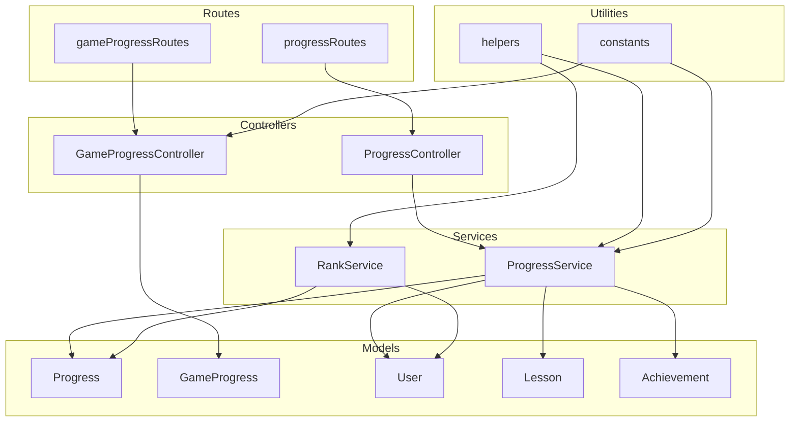
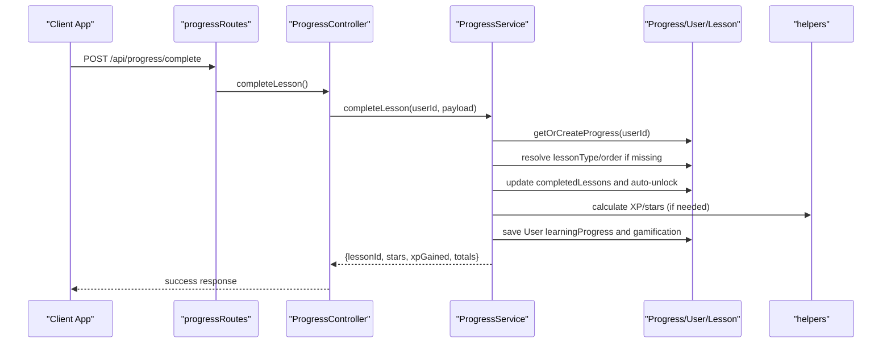
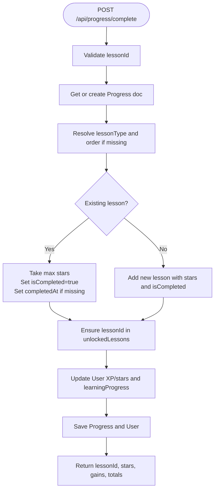
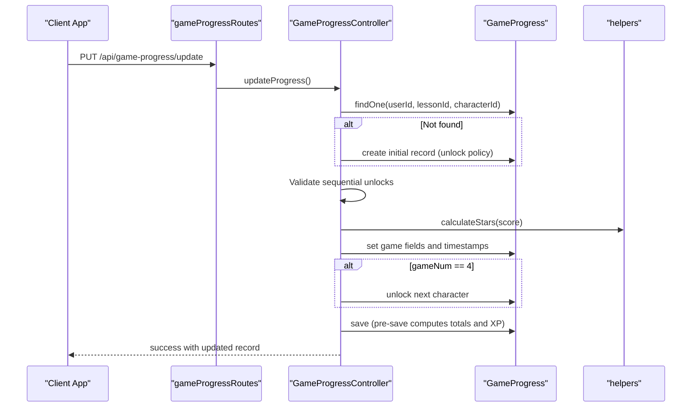
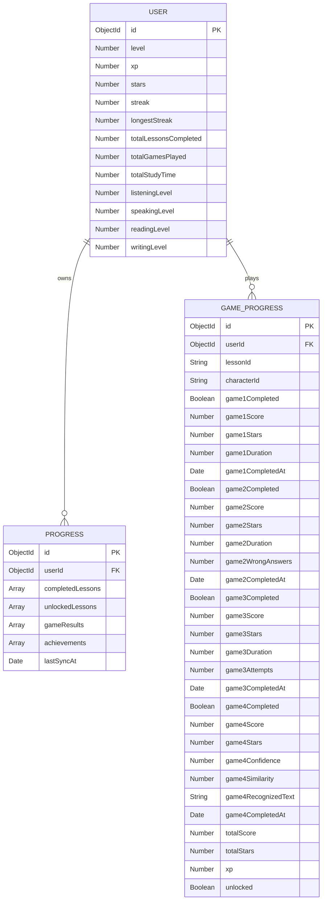
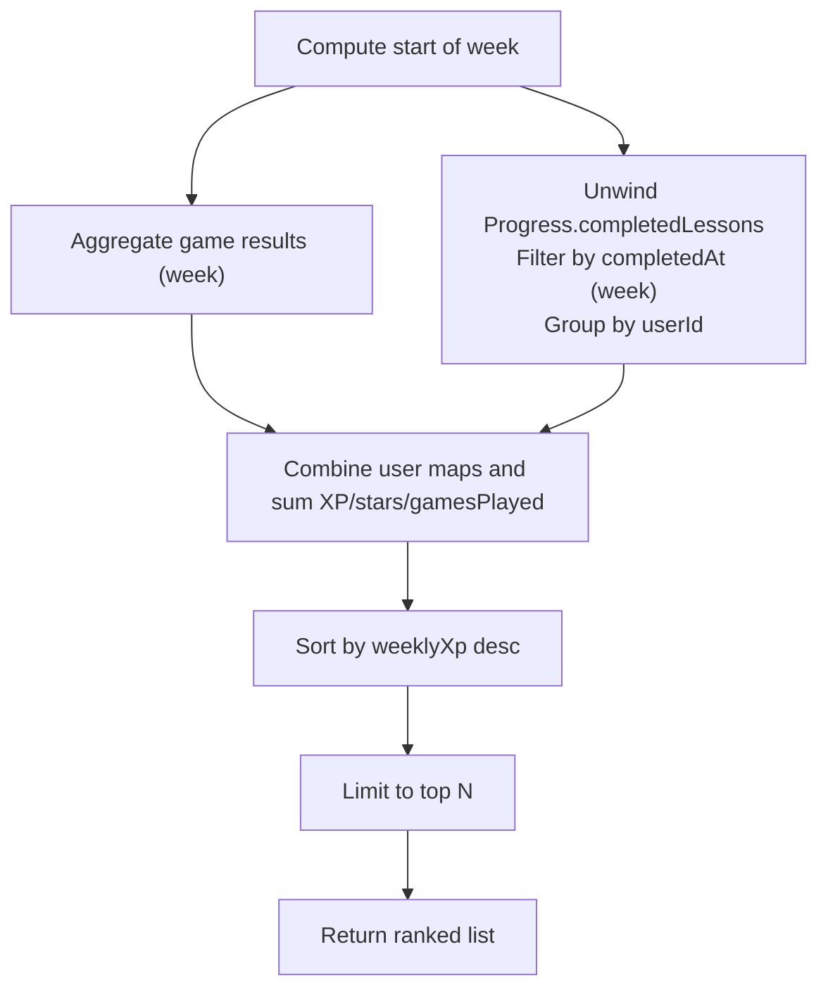
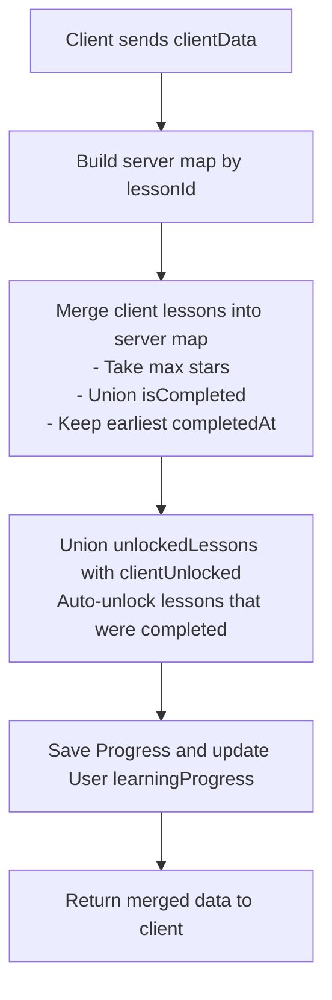
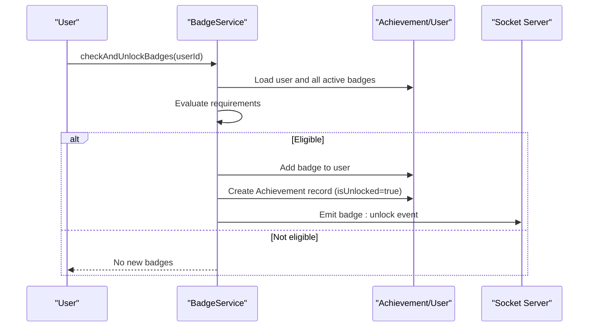
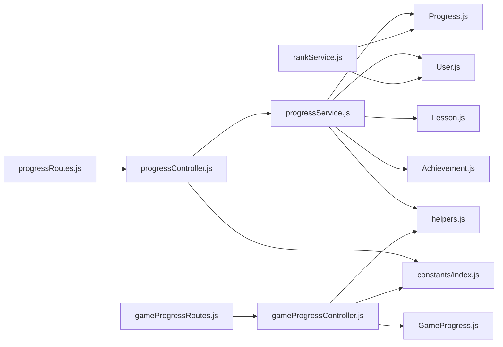

# Progress Tracking APIs

<cite>
**Referenced Files in This Document**
- [Progress.js](file://backend/src/models/Progress.js)
- [GameProgress.js](file://backend/src/models/GameProgress.js)
- [User.js](file://backend/src/models/User.js)
- [Lesson.js](file://backend/src/models/Lesson.js)
- [Achievement.js](file://backend/src/models/Achievement.js)
- [progressController.js](file://backend/src/controllers/progressController.js)
- [gameProgressController.js](file://backend/src/controllers/gameProgressController.js)
- [progressService.js](file://backend/src/services/progressService.js)
- [rankService.js](file://backend/src/services/rankService.js)
- [helpers.js](file://backend/src/utils/helpers.js)
- [progressRoutes.js](file://backend/src/routes/progressRoutes.js)
- [gameProgressRoutes.js](file://backend/src/routes/gameProgressRoutes.js)
- [index.js](file://backend/src/constants/index.js)
</cite>

## Table of Contents
1. [Introduction](#introduction)
2. [Project Structure](#project-structure)
3. [Core Components](#core-components)
4. [Architecture Overview](#architecture-overview)
5. [Detailed Component Analysis](#detailed-component-analysis)
6. [Dependency Analysis](#dependency-analysis)
7. [Performance Considerations](#performance-considerations)
8. [Troubleshooting Guide](#troubleshooting-guide)
9. [Conclusion](#conclusion)
10. [Appendices](#appendices)

## Introduction
This document provides comprehensive API documentation for progress tracking and analytics. It covers:
- User progress endpoints for lesson completion tracking, score calculation, and achievement systems
- Game progress management with real-time progress updates and performance analytics
- The Progress and GameProgress models, data aggregation functions, and reporting capabilities
- Examples of progress synchronization, leaderboard integration, and offline progress handling

## Project Structure
The progress tracking system spans models, controllers, services, routes, and utilities:
- Models define data structures and indexes for Progress, GameProgress, User, Lesson, Achievement
- Controllers expose REST endpoints for progress and game progress
- Services encapsulate business logic for offline-first sync, lesson completion, and XP/stars calculations
- Routes bind endpoints to controllers with authentication middleware
- Utilities provide helper functions for XP/level calculations, star thresholds, and date range helpers

**Diagram sources**
- [progressRoutes.js:1-25](file://backend/src/routes/progressRoutes.js#L1-L25)
- [gameProgressRoutes.js:1-13](file://backend/src/routes/gameProgressRoutes.js#L1-L13)
- [progressController.js:1-80](file://backend/src/controllers/progressController.js#L1-L80)
- [gameProgressController.js:1-290](file://backend/src/controllers/gameProgressController.js#L1-L290)
- [progressService.js:1-304](file://backend/src/services/progressService.js#L1-L304)
- [rankService.js:1-213](file://backend/src/services/rankService.js#L1-L213)
- [Progress.js:1-112](file://backend/src/models/Progress.js#L1-L112)
- [GameProgress.js:1-83](file://backend/src/models/GameProgress.js#L1-L83)
- [User.js:1-243](file://backend/src/models/User.js#L1-L243)
- [Lesson.js:1-155](file://backend/src/models/Lesson.js#L1-L155)
- [Achievement.js:1-48](file://backend/src/models/Achievement.js#L1-L48)
- [helpers.js:1-247](file://backend/src/utils/helpers.js#L1-L247)
- [index.js:1-242](file://backend/src/constants/index.js#L1-L242)

**Section sources**
- [progressRoutes.js:1-25](file://backend/src/routes/progressRoutes.js#L1-L25)
- [gameProgressRoutes.js:1-13](file://backend/src/routes/gameProgressRoutes.js#L1-L13)
- [progressController.js:1-80](file://backend/src/controllers/progressController.js#L1-L80)
- [gameProgressController.js:1-290](file://backend/src/controllers/gameProgressController.js#L1-L290)
- [progressService.js:1-304](file://backend/src/services/progressService.js#L1-L304)
- [rankService.js:1-213](file://backend/src/services/rankService.js#L1-L213)
- [Progress.js:1-112](file://backend/src/models/Progress.js#L1-L112)
- [GameProgress.js:1-83](file://backend/src/models/GameProgress.js#L1-L83)
- [User.js:1-243](file://backend/src/models/User.js#L1-L243)
- [Lesson.js:1-155](file://backend/src/models/Lesson.js#L1-L155)
- [Achievement.js:1-48](file://backend/src/models/Achievement.js#L1-L48)
- [helpers.js:1-247](file://backend/src/utils/helpers.js#L1-L247)
- [index.js:1-242](file://backend/src/constants/index.js#L1-L242)

## Core Components
- Progress model: Stores per-user lesson completions, unlocked lessons, game results, achievements, and sync metadata
- GameProgress model: Tracks per-character, per-lesson game play with scores, stars, XP, and unlock state
- User model: Contains gamification fields (level, XP, stars, streak), learning progress metrics, and badges
- Achievement model: Tracks user badge unlocks and progress
- Progress controller/service: Handles fetching, syncing, completing lessons, and unlocking lessons with offline-first merge
- Game progress controller/service: Manages game status, sequential unlocks, star calculation, and totals aggregation
- Ranking service: Provides global, weekly, and monthly leaderboards combining game results and lesson completions

**Section sources**
- [Progress.js:1-112](file://backend/src/models/Progress.js#L1-L112)
- [GameProgress.js:1-83](file://backend/src/models/GameProgress.js#L1-L83)
- [User.js:1-243](file://backend/src/models/User.js#L1-L243)
- [Achievement.js:1-48](file://backend/src/models/Achievement.js#L1-L48)
- [progressController.js:1-80](file://backend/src/controllers/progressController.js#L1-L80)
- [progressService.js:1-304](file://backend/src/services/progressService.js#L1-L304)
- [gameProgressController.js:1-290](file://backend/src/controllers/gameProgressController.js#L1-L290)
- [rankService.js:1-213](file://backend/src/services/rankService.js#L1-L213)

## Architecture Overview
The system follows a layered architecture:
- Routes receive requests and enforce authentication
- Controllers delegate to services for business logic
- Services operate on models and utilities
- Aggregation pipelines compute analytics and leaderboards

**Diagram sources**
- [progressRoutes.js:19-22](file://backend/src/routes/progressRoutes.js#L19-L22)
- [progressController.js:33-57](file://backend/src/controllers/progressController.js#L33-L57)
- [progressService.js:157-285](file://backend/src/services/progressService.js#L157-L285)
- [helpers.js:42-60](file://backend/src/utils/helpers.js#L42-L60)

## Detailed Component Analysis

### Progress Endpoints
- GET /api/progress/get
  - Returns user’s progress, including completed lessons, unlocked lessons, game results, achievements, and profile metrics
  - Populates user badges and achievements
- POST /api/progress/sync
  - Performs bidirectional sync using a take-max strategy for lesson stars and union for unlocked lessons
  - Auto-unlocks lessons that were completed locally
  - Updates user learningProgress counters
- POST /api/progress/complete
  - Marks a lesson as completed, resolves lesson type/order if missing, merges stars via max, and auto-unlocks
  - Awards XP/stars based on lesson type or explicit values
- POST /api/progress/unlock
  - Adds a lesson to unlocked list if not present

**Diagram sources**
- [progressController.js:33-57](file://backend/src/controllers/progressController.js#L33-L57)
- [progressService.js:157-285](file://backend/src/services/progressService.js#L157-L285)

**Section sources**
- [progressRoutes.js:6-9](file://backend/src/routes/progressRoutes.js#L6-L9)
- [progressController.js:13-76](file://backend/src/controllers/progressController.js#L13-L76)
- [progressService.js:32-155](file://backend/src/services/progressService.js#L32-L155)

### Game Progress Endpoints
- GET /api/game-progress/status
  - Retrieves unlock/completion status for all four games for a given character
  - Initializes record if missing and sets initial unlock based on character ID
- PUT /api/game-progress/update
  - Saves game results, validates sequential unlocks, calculates stars, and computes similarity for pronunciation
  - On completing game 4, automatically unlocks the next character
- GET /api/game-progress/totals
  - Aggregates total XP, stars, and score across all game records for a user

**Diagram sources**
- [gameProgressRoutes.js:8-10](file://backend/src/routes/gameProgressRoutes.js#L8-L10)
- [gameProgressController.js:134-250](file://backend/src/controllers/gameProgressController.js#L134-L250)
- [GameProgress.js:66-78](file://backend/src/models/GameProgress.js#L66-L78)
- [helpers.js:67-72](file://backend/src/utils/helpers.js#L67-L72)

**Section sources**
- [gameProgressRoutes.js:8-10](file://backend/src/routes/gameProgressRoutes.js#L8-L10)
- [gameProgressController.js:68-287](file://backend/src/controllers/gameProgressController.js#L68-L287)
- [GameProgress.js:1-83](file://backend/src/models/GameProgress.js#L1-L83)

### Models and Data Aggregation
- Progress model
  - Fields: userId, completedLessons (with lessonId, lessonType, lessonOrder, stars, isCompleted, completedAt), unlockedLessons, gameResults, achievements, lastSyncAt
  - Indexes: unique on userId, compound on completed lesson IDs
  - Virtual: totalCompleted computed from isCompleted
- GameProgress model
  - Per-character, per-lesson game tracking with game1–game4 fields
  - Pre-save hook computes totalScore, totalStars, and XP
  - Index: unique composite on userId, lessonId, characterId
- User model
  - Gamification: level, xp, stars, streak, longestStreak
  - Learning progress: totalLessonsCompleted, totalGamesPlayed, totalStudyTime, skill levels, completedLessons, weakSkills
  - Badges and achievements arrays
- Achievement model
  - Tracks user badge progress and unlock timestamps
- Aggregation examples
  - Weekly/Monthly leaderboard combines game results and lesson completions using aggregation pipelines
  - Game totals endpoint sums XP, stars, and score per user

**Diagram sources**
- [User.js:74-176](file://backend/src/models/User.js#L74-L176)
- [Progress.js:12-94](file://backend/src/models/Progress.js#L12-L94)
- [GameProgress.js:3-62](file://backend/src/models/GameProgress.js#L3-L62)

**Section sources**
- [Progress.js:1-112](file://backend/src/models/Progress.js#L1-L112)
- [GameProgress.js:1-83](file://backend/src/models/GameProgress.js#L1-L83)
- [User.js:1-243](file://backend/src/models/User.js#L1-L243)
- [Achievement.js:1-48](file://backend/src/models/Achievement.js#L1-L48)
- [rankService.js:29-118](file://backend/src/services/rankService.js#L29-L118)

### Reporting and Leaderboards
- Global leaderboard: Top users sorted by XP
- Weekly leaderboard: Sum of XP and stars from game results and lesson completions within the week
- Monthly leaderboard: Similar aggregation over the month
- Star thresholds and XP calculations are centralized in helpers and constants

**Diagram sources**
- [rankService.js:29-118](file://backend/src/services/rankService.js#L29-L118)
- [helpers.js:189-205](file://backend/src/utils/helpers.js#L189-L205)

**Section sources**
- [rankService.js:1-213](file://backend/src/services/rankService.js#L1-L213)
- [helpers.js:189-205](file://backend/src/utils/helpers.js#L189-L205)
- [index.js:129-150](file://backend/src/constants/index.js#L129-L150)

### Offline Progress Handling and Synchronization
- Offline-first sync strategy:
  - Take-max for lesson stars
  - Union for unlocked lessons
  - Earliest completedAt retained
  - Auto-unlock lessons that were completed locally
- Sync metadata:
  - lastSyncAt updated on both client and server
- Client responsibilities:
  - Send completedLessons, unlockedLessons, and gameResults
  - Receive merged data to reconcile local state

**Diagram sources**
- [progressService.js:62-155](file://backend/src/services/progressService.js#L62-L155)

**Section sources**
- [progressService.js:62-155](file://backend/src/services/progressService.js#L62-L155)

### Achievement Systems and Real-time Updates
- Achievement tracking:
  - Achievement model stores progress and unlock timestamps
  - BadgeService evaluates badge requirements and unlocks badges upon meeting criteria
- Real-time events:
  - Socket events include progress sync, lesson completion/unlock, XP/level/rank updates, and badge unlocks
- Leaderboard notifications:
  - Rank updates can trigger notifications and real-time events

**Diagram sources**
- [badgeService.js:33-148](file://backend/src/services/badgeService.js#L33-L148)
- [Achievement.js:1-48](file://backend/src/models/Achievement.js#L1-L48)
- [index.js:212-222](file://backend/src/constants/index.js#L212-L222)

**Section sources**
- [Achievement.js:1-48](file://backend/src/models/Achievement.js#L1-L48)
- [badgeService.js:1-152](file://backend/src/services/badgeService.js#L1-L152)
- [index.js:212-222](file://backend/src/constants/index.js#L212-L222)

## Dependency Analysis
- Controllers depend on services for business logic
- Services depend on models for persistence and utilities for calculations
- Routes depend on controllers and authentication middleware
- Ranking service depends on User, Progress, and GameResult models
- Game progress controller depends on GameProgress model and helpers for star calculation

**Diagram sources**
- [progressRoutes.js:1-25](file://backend/src/routes/progressRoutes.js#L1-L25)
- [gameProgressRoutes.js:1-13](file://backend/src/routes/gameProgressRoutes.js#L1-L13)
- [progressController.js:1-80](file://backend/src/controllers/progressController.js#L1-L80)
- [gameProgressController.js:1-290](file://backend/src/controllers/gameProgressController.js#L1-L290)
- [progressService.js:1-304](file://backend/src/services/progressService.js#L1-L304)
- [rankService.js:1-213](file://backend/src/services/rankService.js#L1-L213)
- [Progress.js:1-112](file://backend/src/models/Progress.js#L1-L112)
- [GameProgress.js:1-83](file://backend/src/models/GameProgress.js#L1-L83)
- [User.js:1-243](file://backend/src/models/User.js#L1-L243)
- [Lesson.js:1-155](file://backend/src/models/Lesson.js#L1-L155)
- [Achievement.js:1-48](file://backend/src/models/Achievement.js#L1-L48)
- [helpers.js:1-247](file://backend/src/utils/helpers.js#L1-L247)
- [index.js:1-242](file://backend/src/constants/index.js#L1-L242)

**Section sources**
- [progressRoutes.js:1-25](file://backend/src/routes/progressRoutes.js#L1-L25)
- [gameProgressRoutes.js:1-13](file://backend/src/routes/gameProgressRoutes.js#L1-L13)
- [progressController.js:1-80](file://backend/src/controllers/progressController.js#L1-L80)
- [gameProgressController.js:1-290](file://backend/src/controllers/gameProgressController.js#L1-L290)
- [progressService.js:1-304](file://backend/src/services/progressService.js#L1-L304)
- [rankService.js:1-213](file://backend/src/services/rankService.js#L1-L213)
- [helpers.js:1-247](file://backend/src/utils/helpers.js#L1-L247)
- [index.js:1-242](file://backend/src/constants/index.js#L1-L242)

## Performance Considerations
- Indexes:
  - Unique indexes on userId for Progress and GameProgress
  - Compound indexes on lesson IDs and timestamps to optimize lookups
- Aggregation:
  - Use pipeline stages to filter early and minimize data transfer
  - Group by userId to compute totals efficiently
- Pre-save hooks:
  - Computed fields (totalScore, totalStars, xp) reduce client-side computation
- Pagination:
  - Leaderboard endpoints accept a limit parameter to cap results

[No sources needed since this section provides general guidance]

## Troubleshooting Guide
- Missing required fields:
  - Ensure lessonId is provided for completion and unlock endpoints
  - Ensure userId, lessonId, characterId, and gameNum are provided for game progress update
- Locked game progression:
  - Game 2 requires game 1 completion; game 3 requires game 2; game 4 requires game 3
- Star calculation:
  - Stars are derived from score percentage; verify score inputs align with expected thresholds
- Sync conflicts:
  - Take-max ensures highest stars are preserved; if discrepancies persist, verify completedAt ordering and lesson IDs
- Leaderboard anomalies:
  - Confirm date range boundaries for weekly/monthly computations and that lesson types map to expected XP values

**Section sources**
- [progressController.js:36-69](file://backend/src/controllers/progressController.js#L36-L69)
- [gameProgressController.js:138-250](file://backend/src/controllers/gameProgressController.js#L138-L250)
- [helpers.js:67-72](file://backend/src/utils/helpers.js#L67-L72)
- [rankService.js:29-118](file://backend/src/services/rankService.js#L29-L118)

## Conclusion
The progress tracking system provides robust offline-first synchronization, granular game progress management, and comprehensive analytics through aggregation and leaderboards. The layered design separates concerns effectively, enabling maintainability and scalability.

[No sources needed since this section summarizes without analyzing specific files]

## Appendices

### API Definitions

- Progress Endpoints
  - GET /api/progress/get
    - Description: Fetch user progress and profile metrics
    - Authentication: Required
    - Response: completedLessons, unlockedLessons, gameResults, achievements, lastSyncAt, profile
  - POST /api/progress/sync
    - Description: Bidirectional sync with take-max merge
    - Authentication: Required
    - Request body: clientData (completedLessons, unlockedLessons, gameResults, achievements)
    - Response: merged progress and profile
  - POST /api/progress/complete
    - Description: Mark lesson as completed and award XP/stars
    - Authentication: Required
    - Request body: lessonId, stars, lessonType, lessonOrder, xp
    - Response: lessonId, stars, xpGained, starsGained, totals
  - POST /api/progress/unlock
    - Description: Unlock a lesson
    - Authentication: Required
    - Request body: lessonId
    - Response: lessonId, unlocked

- Game Progress Endpoints
  - GET /api/game-progress/status
    - Description: Retrieve unlock/completion status for all four games for a character
    - Authentication: Required
    - Query params: userId (optional), lessonId, characterId
    - Response: lessonId, characterId, unlocked, games[]
  - PUT /api/game-progress/update
    - Description: Save game results and update progress
    - Authentication: Required
    - Request body: userId (optional), lessonId, characterId, gameNum, score, duration, extraData
    - Response: updated GameProgress record
  - GET /api/game-progress/totals
    - Description: Summarize XP, stars, and score across all game records
    - Authentication: Required
    - Query params: userId (optional)
    - Response: { totalXP, totalStars, totalScore }

**Section sources**
- [progressRoutes.js:6-9](file://backend/src/routes/progressRoutes.js#L6-L9)
- [gameProgressRoutes.js:8-10](file://backend/src/routes/gameProgressRoutes.js#L8-L10)
- [progressController.js:13-76](file://backend/src/controllers/progressController.js#L13-L76)
- [gameProgressController.js:68-287](file://backend/src/controllers/gameProgressController.js#L68-L287)