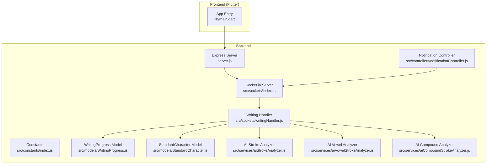
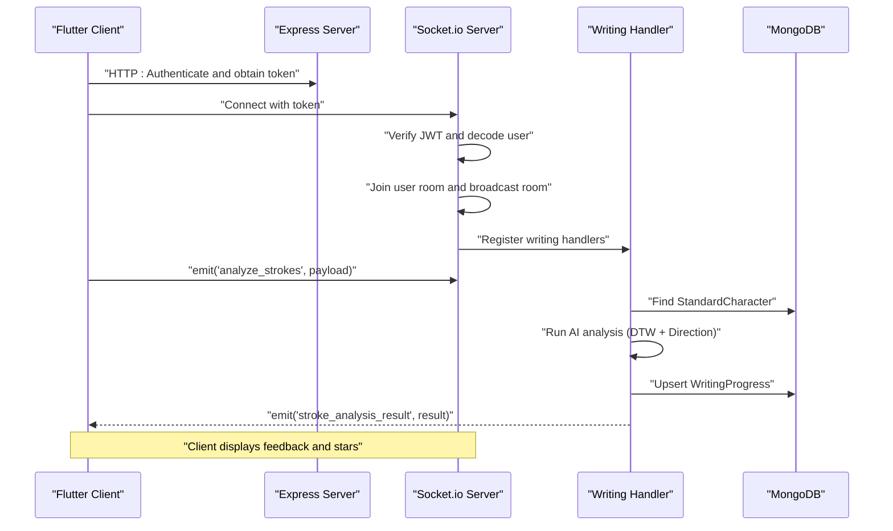
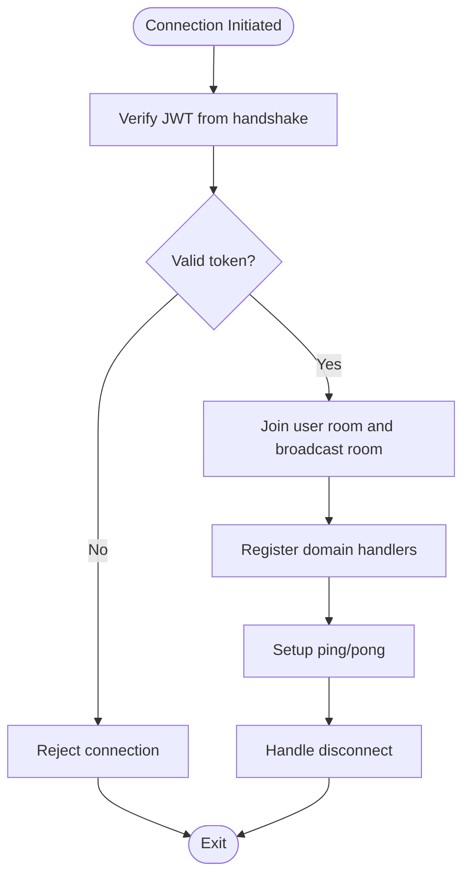
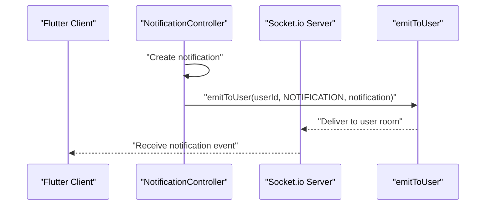
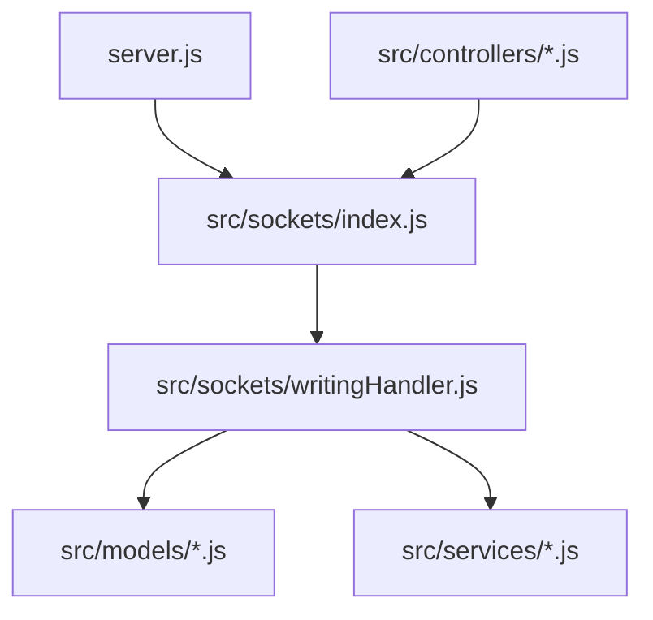

# Real-time Communication

<cite>
**Referenced Files in This Document**
- [server.js](file://backend/server.js)
- [index.js](file://backend/src/sockets/index.js)
- [writingHandler.js](file://backend/src/sockets/writingHandler.js)
- [index.js](file://backend/src/constants/index.js)
- [WritingProgress.js](file://backend/src/models/WritingProgress.js)
- [StandardCharacter.js](file://backend/src/models/StandardCharacter.js)
- [aiStrokeAnalyzer.js](file://backend/src/services/aiStrokeAnalyzer.js)
- [aiVowelStrokeAnalyzer.js](file://backend/src/services/aiVowelStrokeAnalyzer.js)
- [aiCompoundStrokeAnalyzer.js](file://backend/src/services/aiCompoundStrokeAnalyzer.js)
- [notificationController.js](file://backend/src/controllers/notificationController.js)
- [main.dart](file://lib/main.dart)
</cite>

## Table of Contents
1. [Introduction](#introduction)
2. [Project Structure](#project-structure)
3. [Core Components](#core-components)
4. [Architecture Overview](#architecture-overview)
5. [Detailed Component Analysis](#detailed-component-analysis)
6. [Dependency Analysis](#dependency-analysis)
7. [Performance Considerations](#performance-considerations)
8. [Troubleshooting Guide](#troubleshooting-guide)
9. [Conclusion](#conclusion)
10. [Appendices](#appendices)

## Introduction
This document explains the real-time communication system powering interactive writing recognition and live progress updates in the application. It covers the Socket.io server implementation, connection management, event-driven architecture, room management, message broadcasting, and client-server communication patterns. It also documents the real-time writing recognition pipeline, notification delivery, and practical guidance for performance optimization and debugging.

## Project Structure
The real-time stack spans the backend server, Socket.io integration, and AI-driven writing analysis services. The frontend (Flutter) integrates with the backend via HTTP APIs and Socket.io for live updates.



**Diagram sources**
- [server.js:38-51](file://backend/server.js#L38-L51)
- [index.js:23-91](file://backend/src/sockets/index.js#L23-L91)
- [writingHandler.js:132-338](file://backend/src/sockets/writingHandler.js#L132-L338)
- [index.js:212-222](file://backend/src/constants/index.js#L212-L222)
- [WritingProgress.js:204-245](file://backend/src/models/WritingProgress.js#L204-L245)
- [StandardCharacter.js:62-164](file://backend/src/models/StandardCharacter.js#L62-L164)
- [aiStrokeAnalyzer.js:627-752](file://backend/src/services/aiStrokeAnalyzer.js#L627-L752)
- [aiVowelStrokeAnalyzer.js:394-568](file://backend/src/services/aiVowelStrokeAnalyzer.js#L394-L568)
- [aiCompoundStrokeAnalyzer.js:375-690](file://backend/src/services/aiCompoundStrokeAnalyzer.js#L375-L690)
- [notificationController.js:11-143](file://backend/src/controllers/notificationController.js#L11-L143)
- [main.dart:21-77](file://lib/main.dart#L21-L77)

**Section sources**
- [server.js:38-51](file://backend/server.js#L38-L51)
- [index.js:23-91](file://backend/src/sockets/index.js#L23-L91)

## Core Components
- Socket.io server initialization with JWT authentication middleware and room management.
- Domain-specific event handlers registered per connection (writing recognition).
- Real-time event definitions centralized in constants.
- Writing progress persistence and retrieval for analytics and UI updates.
- AI analyzers for standard, vowel, and compound characters.
- Notification controller that emits real-time notifications to users.

Key responsibilities:
- Connection lifecycle: authenticate, join rooms, register handlers, handle ping/pong, and cleanup on disconnect.
- Event orchestration: validate payloads, query golden paths, run AI analysis, persist results, and emit outcomes.
- Broadcasting: targeted per-user and global broadcasts for progress and notifications.

**Section sources**
- [index.js:23-91](file://backend/src/sockets/index.js#L23-L91)
- [writingHandler.js:132-338](file://backend/src/sockets/writingHandler.js#L132-L338)
- [index.js:212-222](file://backend/src/constants/index.js#L212-L222)
- [WritingProgress.js:204-245](file://backend/src/models/WritingProgress.js#L204-L245)
- [StandardCharacter.js:62-164](file://backend/src/models/StandardCharacter.js#L62-L164)
- [aiStrokeAnalyzer.js:627-752](file://backend/src/services/aiStrokeAnalyzer.js#L627-L752)
- [aiVowelStrokeAnalyzer.js:394-568](file://backend/src/services/aiVowelStrokeAnalyzer.js#L394-L568)
- [aiCompoundStrokeAnalyzer.js:375-690](file://backend/src/services/aiCompoundStrokeAnalyzer.js#L375-L690)
- [notificationController.js:11-143](file://backend/src/controllers/notificationController.js#L11-L143)

## Architecture Overview
The real-time architecture centers on Socket.io for bidirectional communication. The server authenticates clients via JWT, joins them into user-specific and broadcast rooms, registers domain handlers (writing), and emits real-time events. Clients receive live feedback and notifications.



**Diagram sources**
- [server.js:38-51](file://backend/server.js#L38-L51)
- [index.js:34-87](file://backend/src/sockets/index.js#L34-L87)
- [writingHandler.js:142-288](file://backend/src/sockets/writingHandler.js#L142-L288)
- [StandardCharacter.js:62-164](file://backend/src/models/StandardCharacter.js#L62-L164)
- [WritingProgress.js:204-245](file://backend/src/models/WritingProgress.js#L204-L245)

## Detailed Component Analysis

### Socket.io Server and Connection Management
- Initializes Socket.io with CORS and ping timeout settings.
- Authentication middleware validates JWT from handshake headers/query/token and attaches user info to the socket.
- On connection:
  - Joins the user into a private room (by user ID).
  - Joins a broadcast room for system-wide notifications.
  - Registers domain handlers (e.g., writing).
  - Supports ping/pong for diagnostics.
  - Logs disconnects.



**Diagram sources**
- [index.js:34-87](file://backend/src/sockets/index.js#L34-L87)

**Section sources**
- [index.js:23-91](file://backend/src/sockets/index.js#L23-L91)

### Writing Recognition Real-time Pipeline
- Event: analyze_strokes
  - Validates payload (stroke arrays, points, timestamps).
  - Cleans target character (removes dotted-circle prefix for vowels).
  - Queries StandardCharacter for golden path; falls back to component analyzers for compounds.
  - Runs AI analysis:
    - Standard: DTW + Directional analysis.
    - Vowel: Optimized for small strokes and smoother curves.
    - Compound: Heuristic checks for loops, scribbles, size, aspect ratio, centroid distribution.
  - Derives gamification rewards (stars, XP) and persists WritingProgress.
  - Emits result to client via acknowledgment or named event.

```mermaid
flowchart TD
Entry(["Event: analyze_strokes"]) --> Validate["Validate payload"]
Validate --> Valid{"Valid?"}
Valid --> |No| EmitError["Emit validation error"]
Valid --> |Yes| CleanChar["Clean target character"]
CleanChar --> LoadStd["Load StandardCharacter"]
LoadStd --> HasStd{"Standard exists?"}
HasStd --> |Yes| Type{"Type=vowel?"}
Type --> |Yes| AnalyzeVowel["Run vowel analyzer"]
Type --> |No| AnalyzeStd["Run standard analyzer"]
HasStd --> |No| AnalyzeCompound["Run compound analyzer"]
AnalyzeVowel --> Persist["Persist WritingProgress"]
AnalyzeStd --> Persist
AnalyzeCompound --> Persist
Persist --> Emit["Emit result to client"]
EmitError --> End(["Exit"])
Emit --> End
```



**Diagram sources**
- [writingHandler.js:142-288](file://backend/src/sockets/writingHandler.js#L142-L288)
- [aiStrokeAnalyzer.js:627-752](file://backend/src/services/aiStrokeAnalyzer.js#L627-L752)
- [aiVowelStrokeAnalyzer.js:394-568](file://backend/src/services/aiVowelStrokeAnalyzer.js#L394-L568)
- [aiCompoundStrokeAnalyzer.js:375-690](file://backend/src/services/aiCompoundStrokeAnalyzer.js#L375-L690)
- [WritingProgress.js:204-245](file://backend/src/models/WritingProgress.js#L204-L245)

**Section sources**
- [writingHandler.js:132-338](file://backend/src/sockets/writingHandler.js#L132-L338)
- [aiStrokeAnalyzer.js:627-752](file://backend/src/services/aiStrokeAnalyzer.js#L627-L752)
- [aiVowelStrokeAnalyzer.js:394-568](file://backend/src/services/aiVowelStrokeAnalyzer.js#L394-L568)
- [aiCompoundStrokeAnalyzer.js:375-690](file://backend/src/services/aiCompoundStrokeAnalyzer.js#L375-L690)
- [WritingProgress.js:204-245](file://backend/src/models/WritingProgress.js#L204-L245)

### Room Management and Broadcasting
- Rooms:
  - User-specific room: socket.join(userId) for targeted updates.
  - Broadcast room: socket.join('broadcast') for system notifications.
- Broadcasting utilities:
  - emitToUser(userId, eventName, data) for per-user updates.
  - broadcast(eventName, data) for global announcements.

```mermaid
graph LR
U["User Room<br/>userId"] <- --> S["Socket"]
B["Broadcast Room<br/>broadcast"] <- --> S
S --> E1["emitToUser(...)"]
S --> E2["broadcast(...)"]
```

**Diagram sources**
- [index.js:69-76](file://backend/src/sockets/index.js#L69-L76)
- [index.js:107-126](file://backend/src/sockets/index.js#L107-L126)

**Section sources**
- [index.js:69-76](file://backend/src/sockets/index.js#L69-L76)
- [index.js:107-126](file://backend/src/sockets/index.js#L107-L126)

### Notification Systems
- NotificationController exposes endpoints to manage notifications and emits real-time notifications to users via emitToUser.
- Real-time event emitted: SOCKET_EVENTS.NOTIFICATION.
- Frontend receives notifications and renders them immediately.



**Diagram sources**
- [notificationController.js:78-139](file://backend/src/controllers/notificationController.js#L78-L139)
- [index.js:107-113](file://backend/src/sockets/index.js#L107-L113)
- [index.js:212-222](file://backend/src/constants/index.js#L212-L222)

**Section sources**
- [notificationController.js:11-143](file://backend/src/controllers/notificationController.js#L11-L143)
- [index.js:107-113](file://backend/src/sockets/index.js#L107-L113)
- [index.js:212-222](file://backend/src/constants/index.js#L212-L222)

### Client-Side Integration (Flutter)
- The Flutter app initializes services and navigates to appropriate screens after startup. While the main entry does not directly instantiate Socket.io, the app integrates with backend APIs and can consume real-time updates delivered via Socket.io in feature screens.

**Section sources**
- [main.dart:21-77](file://lib/main.dart#L21-L77)

## Dependency Analysis
The real-time system exhibits clear separation of concerns:
- server.js composes Express, Socket.io, and routes.
- src/sockets/index.js manages authentication, rooms, and handler registration.
- src/sockets/writingHandler.js orchestrates the writing recognition pipeline and interacts with models and services.
- src/models/* define persistence for writing progress and golden paths.
- src/services/* implement the AI analyzers.
- src/controllers/* emit real-time notifications.



**Diagram sources**
- [server.js:24-51](file://backend/server.js#L24-L51)
- [index.js:14-14](file://backend/src/sockets/index.js#L14-L14)
- [writingHandler.js:19-23](file://backend/src/sockets/writingHandler.js#L19-L23)
- [WritingProgress.js:17-25](file://backend/src/models/WritingProgress.js#L17-L25)
- [StandardCharacter.js:22-28](file://backend/src/models/StandardCharacter.js#L22-L28)
- [aiStrokeAnalyzer.js:60-61](file://backend/src/services/aiStrokeAnalyzer.js#L60-L61)
- [aiVowelStrokeAnalyzer.js:17-18](file://backend/src/services/aiVowelStrokeAnalyzer.js#L17-L18)
- [aiCompoundStrokeAnalyzer.js:21-22](file://backend/src/services/aiCompoundStrokeAnalyzer.js#L21-L22)
- [notificationController.js:7-8](file://backend/src/controllers/notificationController.js#L7-L8)

**Section sources**
- [server.js:24-51](file://backend/server.js#L24-L51)
- [index.js:14-14](file://backend/src/sockets/index.js#L14-L14)
- [writingHandler.js:19-23](file://backend/src/sockets/writingHandler.js#L19-L23)
- [WritingProgress.js:17-25](file://backend/src/models/WritingProgress.js#L17-L25)
- [StandardCharacter.js:22-28](file://backend/src/models/StandardCharacter.js#L22-L28)
- [aiStrokeAnalyzer.js:60-61](file://backend/src/services/aiStrokeAnalyzer.js#L60-L61)
- [aiVowelStrokeAnalyzer.js:17-18](file://backend/src/services/aiVowelStrokeAnalyzer.js#L17-L18)
- [aiCompoundStrokeAnalyzer.js:21-22](file://backend/src/services/aiCompoundStrokeAnalyzer.js#L21-L22)
- [notificationController.js:7-8](file://backend/src/controllers/notificationController.js#L7-L8)

## Performance Considerations
- Socket.io tuning:
  - pingTimeout controls idle detection; adjust based on expected network latency.
  - Keep-alive ping/pong reduces stale connections.
- Payload validation:
  - Early rejection of malformed stroke data prevents unnecessary computation.
- AI analysis:
  - Resampling to fixed point counts balances accuracy and speed.
  - DTW distance thresholds cap worst-case complexity.
- Persistence:
  - Atomic upsert with capped history prevents document bloat.
- Broadcasting:
  - Use targeted emitToUser for scalability; reserve broadcast for urgent system alerts.

## Troubleshooting Guide
Common issues and remedies:
- Authentication failures:
  - Ensure the client sends a valid JWT via handshake headers or query parameter.
  - Confirm token verification logic and expiration handling.
- No real-time updates:
  - Verify the client joined the correct rooms (user and broadcast).
  - Check that the writing handler is registered for the socket.
- Slow analysis:
  - Validate stroke data quality and resampling parameters.
  - Monitor DTW computations and consider reducing resample count for testing.
- Database errors:
  - Confirm WritingProgress upsert succeeds and indexes are present.
- Notifications not received:
  - Confirm emitToUser is invoked with the correct user ID and event name.

**Section sources**
- [index.js:34-62](file://backend/src/sockets/index.js#L34-L62)
- [index.js:69-87](file://backend/src/sockets/index.js#L69-L87)
- [writingHandler.js:142-288](file://backend/src/sockets/writingHandler.js#L142-L288)
- [WritingProgress.js:204-245](file://backend/src/models/WritingProgress.js#L204-L245)
- [notificationController.js:132-133](file://backend/src/controllers/notificationController.js#L132-L133)

## Conclusion
The real-time communication system combines secure Socket.io connections, robust event-driven architecture, and AI-powered writing recognition to deliver immediate feedback and live notifications. Room-based broadcasting and targeted emits ensure scalable, low-latency updates. The modular design of analyzers and persistence models supports maintainability and future enhancements.

## Appendices

### Real-time Event Definitions
- Event names are centralized for consistency across the backend.

**Section sources**
- [index.js:212-222](file://backend/src/constants/index.js#L212-L222)