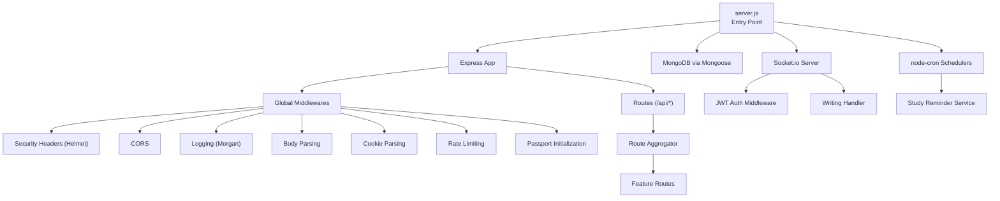
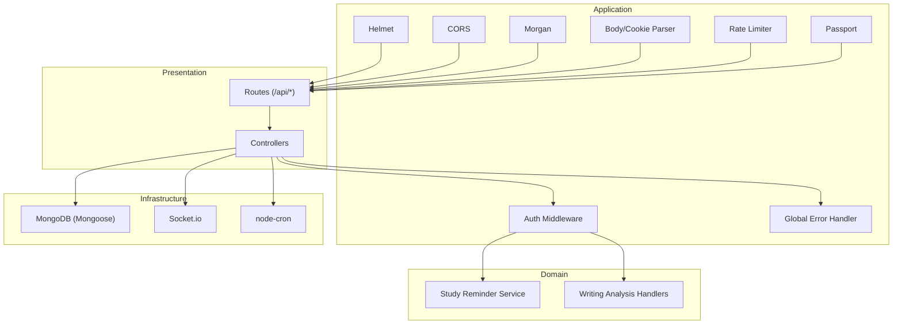
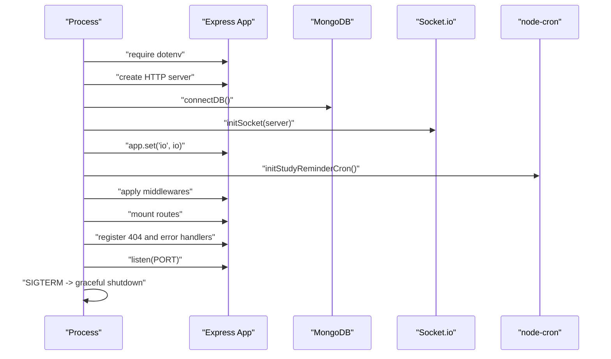
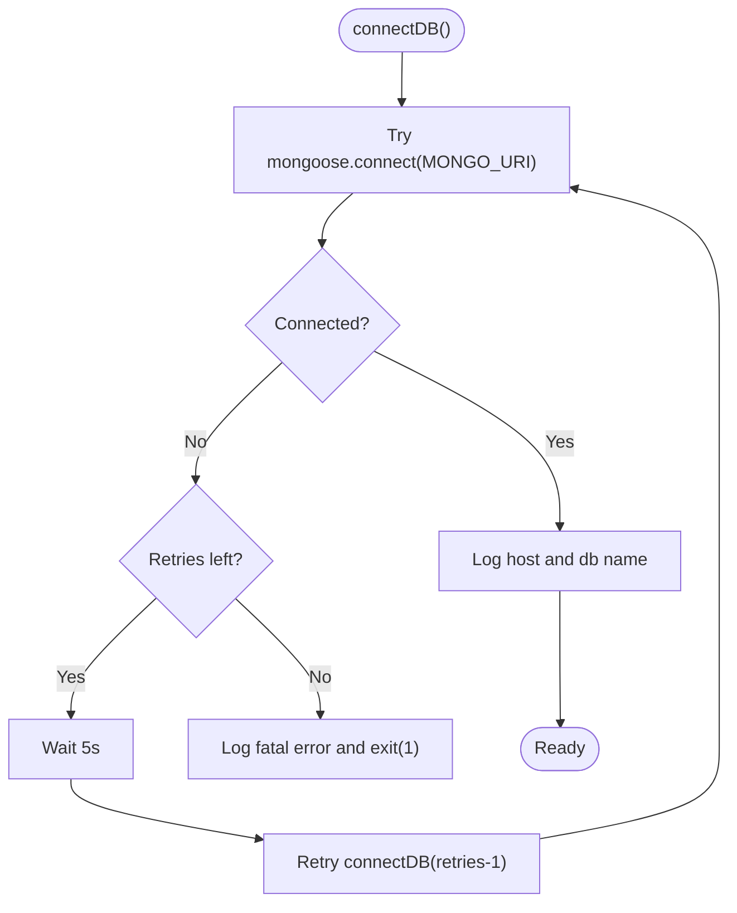
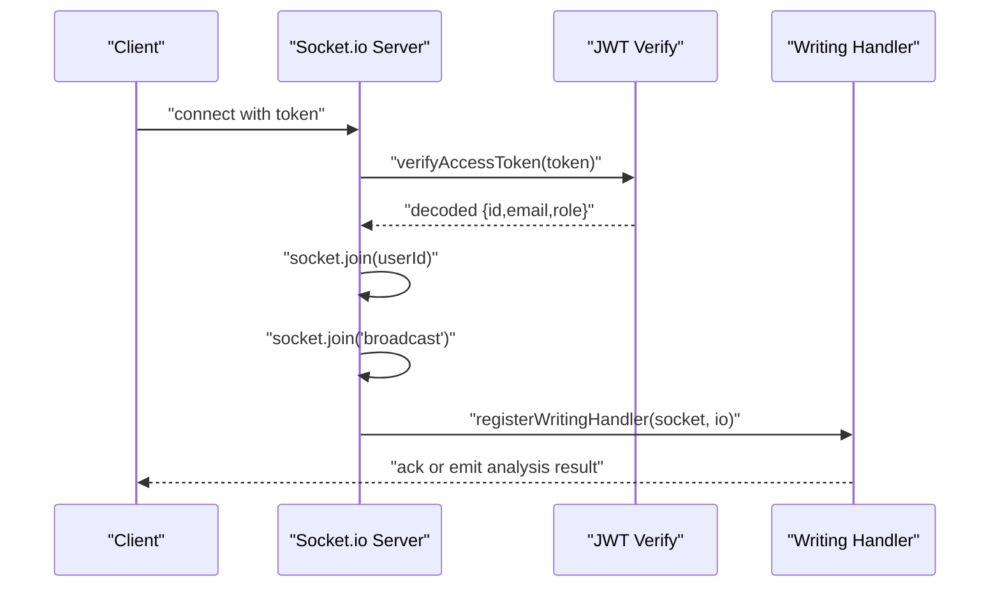
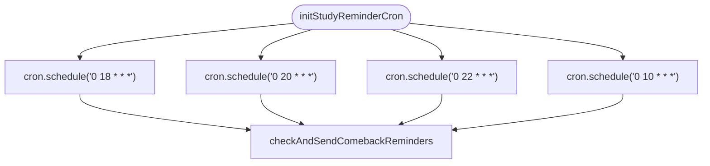
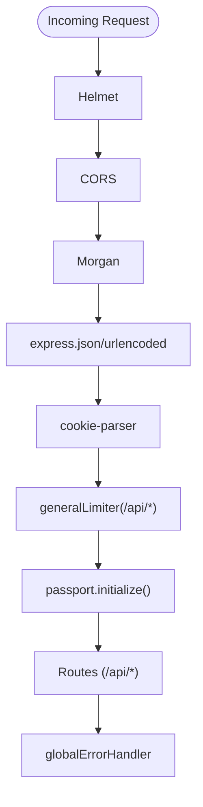
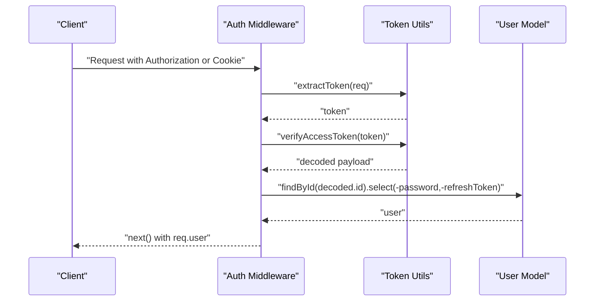
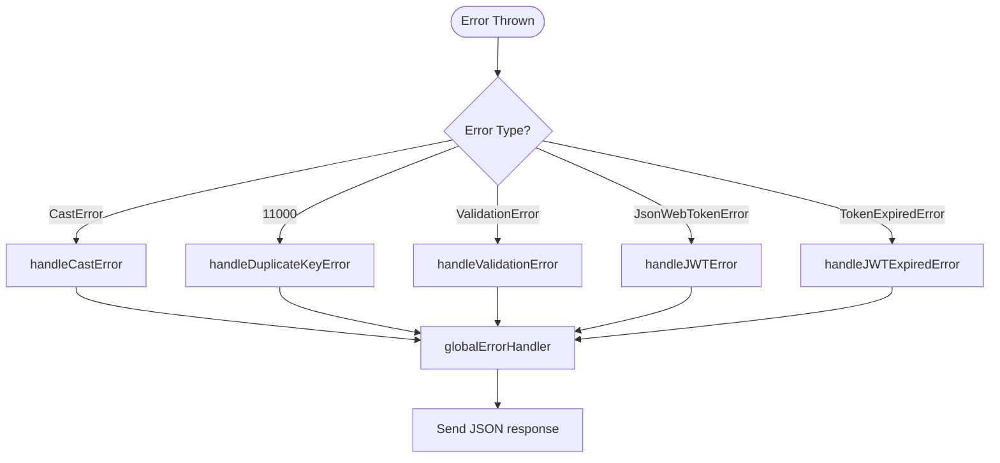
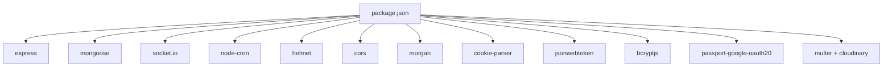

# Server Architecture

<cite>
**Referenced Files in This Document**
- [server.js](file://backend/server.js)
- [database.js](file://backend/src/config/database.js)
- [passport.js](file://backend/src/config/passport.js)
- [package.json](file://backend/package.json)
- [errorHandler.js](file://backend/src/middlewares/errorHandler.js)
- [rateLimiter.js](file://backend/src/middlewares/rateLimiter.js)
- [index.js](file://backend/src/middlewares/auth.js)
- [index.js](file://backend/src/constants/index.js)
- [token.js](file://backend/src/utils/token.js)
- [index.js](file://backend/src/sockets/index.js)
- [writingHandler.js](file://backend/src/sockets/writingHandler.js)
- [studyReminderCron.js](file://backend/src/cron/studyReminderCron.js)
- [studyReminderService.js](file://backend/src/services/studyReminderService.js)
- [index.js](file://backend/src/routes/index.js)
</cite>

## Table of Contents
1. [Introduction](#introduction)
2. [Project Structure](#project-structure)
3. [Core Components](#core-components)
4. [Architecture Overview](#architecture-overview)
5. [Detailed Component Analysis](#detailed-component-analysis)
6. [Dependency Analysis](#dependency-analysis)
7. [Performance Considerations](#performance-considerations)
8. [Troubleshooting Guide](#troubleshooting-guide)
9. [Conclusion](#conclusion)
10. [Appendices](#appendices)

## Introduction
This document describes the Node.js server architecture for the KhmerKid backend. It covers Express.js initialization, middleware configuration (security headers, CORS, rate limiting, authentication), database connectivity with MongoDB/Mongoose, Socket.io integration for real-time communication, cron job scheduling, server startup and graceful shutdown, error handling patterns, configuration management, environment variables, and deployment considerations.

## Project Structure
The backend is organized around a modular Express application with clear separation of concerns:
- Entry point initializes Express, connects to MongoDB, sets up Socket.io and cron, mounts routes, applies middleware, and starts the HTTP server.
- Configuration modules manage database connections, authentication strategies, and environment variables.
- Middleware handles security, rate limiting, authentication, and error handling.
- Routes aggregate feature-specific routers under the /api prefix.
- Services encapsulate business logic (e.g., study reminders).
- Sockets provide real-time features with JWT-based authentication.
- Cron schedules recurring tasks for user engagement.

**Diagram sources**
- [server.js:38-139](file://backend/server.js#L38-L139)
- [database.js:16-40](file://backend/src/config/database.js#L16-L40)
- [index.js:23-47](file://backend/src/routes/index.js#L23-L47)
- [index.js:23-91](file://backend/src/sockets/index.js#L23-L91)
- [studyReminderCron.js:13-61](file://backend/src/cron/studyReminderCron.js#L13-L61)

**Section sources**
- [server.js:13-139](file://backend/server.js#L13-L139)
- [package.json:1-54](file://backend/package.json#L1-L54)

## Core Components
- Express initialization and HTTP server creation.
- MongoDB/Mongoose connection with retry logic and graceful shutdown hooks.
- Socket.io setup with JWT-based authentication and user rooms.
- Cron scheduler for study reminders with timezone-aware scheduling.
- Global middleware stack: Helmet, CORS, Morgan, body parsing, cookie parsing, rate limiting, Passport.
- Centralized error handling with typed AppError and response shaping.
- Authentication middleware using JWT extraction from headers or cookies.
- Token utilities for generation, verification, and extraction.
- Constants for roles, messages, socket events, and configuration values.

**Section sources**
- [server.js:38-139](file://backend/server.js#L38-L139)
- [database.js:16-63](file://backend/src/config/database.js#L16-L63)
- [index.js:23-91](file://backend/src/sockets/index.js#L23-L91)
- [studyReminderCron.js:13-61](file://backend/src/cron/studyReminderCron.js#L13-L61)
- [errorHandler.js:13-92](file://backend/src/middlewares/errorHandler.js#L13-L92)
- [index.js:18-72](file://backend/src/middlewares/auth.js#L18-L72)
- [token.js:17-88](file://backend/src/utils/token.js#L17-L88)
- [index.js:167-241](file://backend/src/constants/index.js#L167-L241)

## Architecture Overview
The server follows a layered architecture:
- Presentation Layer: Express routes and controllers.
- Application Layer: Authentication middleware, rate limiting, and error handling.
- Domain Layer: Services implementing business logic (e.g., study reminders).
- Infrastructure Layer: Database connectivity, Socket.io, cron, and utilities.

**Diagram sources**
- [server.js:59-121](file://backend/server.js#L59-L121)
- [index.js:23-47](file://backend/src/routes/index.js#L23-L47)
- [studyReminderService.js:105-223](file://backend/src/services/studyReminderService.js#L105-L223)
- [writingHandler.js:132-338](file://backend/src/sockets/writingHandler.js#L132-L338)
- [database.js:16-40](file://backend/src/config/database.js#L16-L40)
- [studyReminderCron.js:13-61](file://backend/src/cron/studyReminderCron.js#L13-L61)

## Detailed Component Analysis

### Express Initialization and Startup
- Loads environment variables, initializes Express, and creates an HTTP server.
- Establishes database connection, Socket.io server, and cron schedulers.
- Applies global middleware for security, CORS, logging, body parsing, cookies, rate limiting, and Passport.
- Mounts health check and aggregated routes under /api.
- Registers global 404 and error handlers.
- Starts server on configured port and logs environment details.
- Implements graceful shutdown for SIGTERM and unhandled rejection.

**Diagram sources**
- [server.js:13-139](file://backend/server.js#L13-L139)
- [database.js:16-40](file://backend/src/config/database.js#L16-L40)
- [index.js:23-91](file://backend/src/sockets/index.js#L23-L91)
- [studyReminderCron.js:13-61](file://backend/src/cron/studyReminderCron.js#L13-L61)

**Section sources**
- [server.js:13-139](file://backend/server.js#L13-L139)

### Database Connection with MongoDB/Mongoose
- Connects to MongoDB with explicit pool and timeout settings.
- Implements retry logic with exponential backoff-like delay.
- Logs connection events and registers graceful shutdown for SIGINT to close Mongoose connection.

**Diagram sources**
- [database.js:16-40](file://backend/src/config/database.js#L16-L40)

**Section sources**
- [database.js:16-63](file://backend/src/config/database.js#L16-L63)

### Socket.io Integration for Real-Time Communication
- Initializes Socket.io with CORS and ping timeout settings.
- Authenticates connections using JWT extracted from handshake (headers, auth object, or query).
- On connection, joins user-specific and broadcast rooms and registers writing analysis handlers.
- Provides utility functions to emit to a user or broadcast events.

**Diagram sources**
- [index.js:23-91](file://backend/src/sockets/index.js#L23-L91)
- [writingHandler.js:132-338](file://backend/src/sockets/writingHandler.js#L132-L338)
- [token.js:57-58](file://backend/src/utils/token.js#L57-L58)

**Section sources**
- [index.js:23-133](file://backend/src/sockets/index.js#L23-L133)
- [writingHandler.js:132-338](file://backend/src/sockets/writingHandler.js#L132-L338)

### Cron Job Scheduling
- Initializes multiple cron jobs for study reminders:
  - Daily reminders at 18:00 and 20:00.
  - Streak maintenance reminder at 22:00.
  - Comeback reminder for inactive users at 10:00.
- Uses timezone Asia/Ho_Chi_Minh for scheduling.
- Delegates logic to StudyReminderService.

**Diagram sources**
- [studyReminderCron.js:13-61](file://backend/src/cron/studyReminderCron.js#L13-L61)
- [studyReminderService.js:105-223](file://backend/src/services/studyReminderService.js#L105-L223)

**Section sources**
- [studyReminderCron.js:13-61](file://backend/src/cron/studyReminderCron.js#L13-L61)
- [studyReminderService.js:105-223](file://backend/src/services/studyReminderService.js#L105-L223)

### Middleware Configuration
- Security headers: Helmet applied globally.
- CORS: Origin from environment variable, credentials enabled, allowed methods and headers configured.
- Logging: Morgan with environment-specific format.
- Body parsing: JSON and URL-encoded with size limits.
- Cookies: Cookie parser enabled.
- Rate limiting: General limiter applied to /api/, plus specialized limiters for auth and uploads.
- Passport: Strategy initialization and middleware registration.

**Diagram sources**
- [server.js:59-89](file://backend/server.js#L59-L89)
- [rateLimiter.js:19-28](file://backend/src/middlewares/rateLimiter.js#L19-L28)

**Section sources**
- [server.js:59-89](file://backend/server.js#L59-L89)
- [rateLimiter.js:19-64](file://backend/src/middlewares/rateLimiter.js#L19-L64)

### Authentication and Authorization
- JWT-based authentication middleware extracts token from Authorization header or cookie, verifies it, attaches user to request, and enforces protection or optional auth.
- Passport Google OAuth strategy auto-creates or links user accounts on first login.
- Token utilities provide generation, verification, and extraction helpers.

**Diagram sources**
- [index.js:18-50](file://backend/src/middlewares/auth.js#L18-L50)
- [token.js:75-88](file://backend/src/utils/token.js#L75-L88)
- [passport.js:14-80](file://backend/src/config/passport.js#L14-L80)

**Section sources**
- [index.js:18-72](file://backend/src/middlewares/auth.js#L18-L72)
- [passport.js:14-80](file://backend/src/config/passport.js#L14-L80)
- [token.js:17-88](file://backend/src/utils/token.js#L17-L88)

### Error Handling Patterns
- Centralized AppError class with operational error tagging and status derivation.
- Specific handlers for cast errors, duplicate keys, validation errors, and JWT errors.
- Global error handler logs in development, normalizes error responses, and includes stack traces conditionally.

**Diagram sources**
- [errorHandler.js:13-92](file://backend/src/middlewares/errorHandler.js#L13-L92)

**Section sources**
- [errorHandler.js:13-92](file://backend/src/middlewares/errorHandler.js#L13-L92)

### Route Organization
- Route aggregator mounts feature-specific routers under /api/*, including auth, users, lessons, progress, games, missions, badges, achievements, ranks, uploads, admin, library, tests, game play sessions, and notifications.

**Section sources**
- [index.js:28-47](file://backend/src/routes/index.js#L28-L47)

### Configuration Management and Environment Variables
- Environment variables loaded via dotenv at startup.
- Key variables used across the system:
  - Database: MONGO_URI
  - Server: PORT, NODE_ENV
  - Security: JWT_SECRET, JWT_REFRESH_SECRET, JWT_EXPIRES_IN, JWT_REFRESH_EXPIRES_IN
  - Client: CLIENT_URL
  - OAuth: GOOGLE_CLIENT_ID, GOOGLE_CLIENT_SECRET, GOOGLE_CALLBACK_URL
  - Rate limiting: RATE_LIMIT_WINDOW_MS, RATE_LIMIT_MAX
- Package scripts define dev/start commands and seeding/testing tasks.

**Section sources**
- [server.js:13](file://backend/server.js#L13)
- [database.js:18](file://backend/src/config/database.js#L18)
- [token.js:18-29](file://backend/src/utils/token.js#L18-L29)
- [passport.js:17-19](file://backend/src/config/passport.js#L17-L19)
- [rateLimiter.js:20-21](file://backend/src/middlewares/rateLimiter.js#L20-L21)
- [package.json:6-13](file://backend/package.json#L6-L13)

## Dependency Analysis
External dependencies include Express, Mongoose, Socket.io, node-cron, Helmet, CORS, Morgan, cookie-parser, bcryptjs, jsonwebtoken, multer/cloudinary integrations, and Passport Google OAuth. Internal dependencies are organized by feature modules (routes, services, sockets, middlewares, utils, models).

**Diagram sources**
- [package.json:24-45](file://backend/package.json#L24-L45)

**Section sources**
- [package.json:1-54](file://backend/package.json#L1-L54)

## Performance Considerations
- Body size limits are configured to support media uploads.
- Mongoose connection options tuned for reliability and responsiveness.
- Socket.io ping timeout and room-based event distribution reduce unnecessary broadcasts.
- Rate limiting prevents abuse while allowing development flexibility.
- Consider enabling compression, connection pooling tuning, and caching for static assets if scaling.

## Troubleshooting Guide
Common issues and remedies:
- MongoDB connection failures: Review MONGO_URI, network, and retry logs; ensure environment variables are set.
- Socket authentication errors: Verify JWT presence and validity in handshake; confirm CLIENT_URL matches frontend origin.
- Rate limiting blocks legitimate traffic: Adjust RATE_LIMIT_WINDOW_MS and RATE_LIMIT_MAX; note development overrides.
- Passport OAuth errors: Confirm GOOGLE_CLIENT_ID, GOOGLE_CLIENT_SECRET, GOOGLE_CALLBACK_URL, and callback URL registered with Google.
- Unhandled rejections: Inspect error logs during SIGTERM; ensure cleanup routines run.

**Section sources**
- [database.js:28-38](file://backend/src/config/database.js#L28-L38)
- [index.js:34-62](file://backend/src/sockets/index.js#L34-L62)
- [rateLimiter.js:13](file://backend/src/middlewares/rateLimiter.js#L13)
- [passport.js:17-19](file://backend/src/config/passport.js#L17-L19)
- [server.js:144-157](file://backend/server.js#L144-L157)

## Conclusion
The server architecture integrates Express, MongoDB, Socket.io, and cron in a cohesive, modular design. Security and reliability are prioritized through Helmet, CORS, rate limiting, JWT-based authentication, and robust error handling. The modular structure supports maintainability and scalability, with clear boundaries between presentation, application, domain, and infrastructure layers.

## Appendices
- Deployment checklist:
  - Set production environment variables (NODE_ENV=production).
  - Configure reverse proxy (e.g., Nginx) for HTTPS and load balancing.
  - Scale Socket.io behind sticky sessions or Redis adapter if needed.
  - Monitor logs and metrics; configure health checks at /api/health.
  - Back up MongoDB regularly and test restore procedures.