# Service Layer

<cite>
**Referenced Files in This Document**
- [authService.js](file://backend/src/services/authService.js)
- [userService.js](file://backend/src/services/userService.js)
- [lessonService.js](file://backend/src/services/lessonService.js)
- [gameService.js](file://backend/src/services/gameService.js)
- [progressService.js](file://backend/src/services/progressService.js)
- [rankService.js](file://backend/src/services/rankService.js)
- [badgeService.js](file://backend/src/services/badgeService.js)
- [readingService.js](file://backend/src/services/readingService.js)
- [listeningService.js](file://backend/src/services/listeningService.js)
- [scoring.service.js](file://backend/src/services/scoring.service.js)
- [errorHandler.js](file://backend/src/middlewares/errorHandler.js)
- [helpers.js](file://backend/src/utils/helpers.js)
- [response.js](file://backend/src/utils/response.js)
- [authValidator.js](file://backend/src/validators/authValidator.js)
- [authController.js](file://backend/src/controllers/authController.js)
- [authRoutes.js](file://backend/src/routes/authRoutes.js)
- [index.js](file://backend/src/constants/index.js)
</cite>

## Table of Contents
1. [Introduction](#introduction)
2. [Project Structure](#project-structure)
3. [Core Components](#core-components)
4. [Architecture Overview](#architecture-overview)
5. [Detailed Component Analysis](#detailed-component-analysis)
6. [Dependency Analysis](#dependency-analysis)
7. [Performance Considerations](#performance-considerations)
8. [Troubleshooting Guide](#troubleshooting-guide)
9. [Conclusion](#conclusion)

## Introduction
This document describes the backend service layer architecture, focusing on the service pattern implementation, business logic encapsulation, and utility functions. It explains how validation services, error handling middleware, and helper utilities are integrated across the application. The separation of concerns, dependency injection patterns, and service composition are covered, along with examples of service usage, custom middleware creation, and integration patterns with controllers and models.

## Project Structure
The service layer resides under backend/src/services and is organized by domain capabilities:
- Authentication and user lifecycle
- Learning content and progress
- Gamification and ranking
- Speech scoring engine
- Cross-cutting utilities and error handling

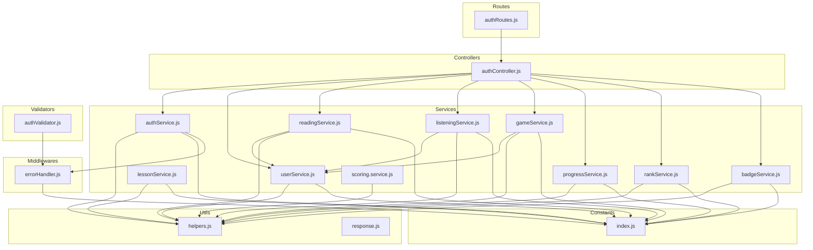

**Diagram sources**
- [authController.js:1-94](file://backend/src/controllers/authController.js#L1-L94)
- [authRoutes.js:1-38](file://backend/src/routes/authRoutes.js#L1-L38)
- [authService.js:1-250](file://backend/src/services/authService.js#L1-L250)
- [userService.js:1-221](file://backend/src/services/userService.js#L1-L221)
- [lessonService.js:1-130](file://backend/src/services/lessonService.js#L1-L130)
- [gameService.js:1-89](file://backend/src/services/gameService.js#L1-L89)
- [progressService.js:1-304](file://backend/src/services/progressService.js#L1-L304)
- [rankService.js:1-213](file://backend/src/services/rankService.js#L1-L213)
- [badgeService.js:1-152](file://backend/src/services/badgeService.js#L1-L152)
- [readingService.js:1-76](file://backend/src/services/readingService.js#L1-L76)
- [listeningService.js:1-88](file://backend/src/services/listeningService.js#L1-L88)
- [scoring.service.js:1-279](file://backend/src/services/scoring.service.js#L1-L279)
- [errorHandler.js:1-98](file://backend/src/middlewares/errorHandler.js#L1-L98)
- [helpers.js:1-247](file://backend/src/utils/helpers.js#L1-L247)
- [response.js:1-82](file://backend/src/utils/response.js#L1-L82)
- [authValidator.js:1-44](file://backend/src/validators/authValidator.js#L1-L44)
- [index.js:1-242](file://backend/src/constants/index.js#L1-L242)

**Section sources**
- [authController.js:1-94](file://backend/src/controllers/authController.js#L1-L94)
- [authRoutes.js:1-38](file://backend/src/routes/authRoutes.js#L1-L38)
- [authService.js:1-250](file://backend/src/services/authService.js#L1-L250)
- [index.js:1-242](file://backend/src/constants/index.js#L1-L242)

## Core Components
- Service classes encapsulate domain logic and coordinate with models and utilities.
- Controllers depend on services and delegate cross-cutting concerns to middlewares and validators.
- Services rely on shared utilities (helpers, constants) and raise AppError for business failures.
- Error handling middleware centralizes error translation and response formatting.

Key responsibilities:
- Authentication service: registration, login, logout, token refresh, OAuth flows.
- User service: profile retrieval, XP/stars management, skill progress, ranks.
- Lesson service: CRUD and filtering for lessons.
- Game service: result persistence, XP/stars computation, history and stats.
- Progress service: offline-first bidirectional sync with take-max strategy.
- Rank service: global, weekly, and monthly leaderboards.
- Badge service: badge eligibility checks and unlocking with notifications.
- Reading and listening services: result saving, XP/stars, skill progress, completion marking.
- Scoring service: Jaro-Winkler similarity and pronunciation scoring engine.
- Utilities: standardized responses, helper functions, constants, validators, and error handling.

**Section sources**
- [authService.js:1-250](file://backend/src/services/authService.js#L1-L250)
- [userService.js:1-221](file://backend/src/services/userService.js#L1-L221)
- [lessonService.js:1-130](file://backend/src/services/lessonService.js#L1-L130)
- [gameService.js:1-89](file://backend/src/services/gameService.js#L1-L89)
- [progressService.js:1-304](file://backend/src/services/progressService.js#L1-L304)
- [rankService.js:1-213](file://backend/src/services/rankService.js#L1-L213)
- [badgeService.js:1-152](file://backend/src/services/badgeService.js#L1-L152)
- [readingService.js:1-76](file://backend/src/services/readingService.js#L1-L76)
- [listeningService.js:1-88](file://backend/src/services/listeningService.js#L1-L88)
- [scoring.service.js:1-279](file://backend/src/services/scoring.service.js#L1-L279)
- [response.js:1-82](file://backend/src/utils/response.js#L1-L82)
- [helpers.js:1-247](file://backend/src/utils/helpers.js#L1-L247)
- [errorHandler.js:1-98](file://backend/src/middlewares/errorHandler.js#L1-L98)
- [authValidator.js:1-44](file://backend/src/validators/authValidator.js#L1-L44)

## Architecture Overview
The service layer follows a layered architecture:
- Controllers orchestrate requests and responses.
- Services encapsulate business logic and coordinate with models and utilities.
- Middlewares handle cross-cutting concerns (validation, authentication, error handling).
- Utilities provide shared helpers and constants.

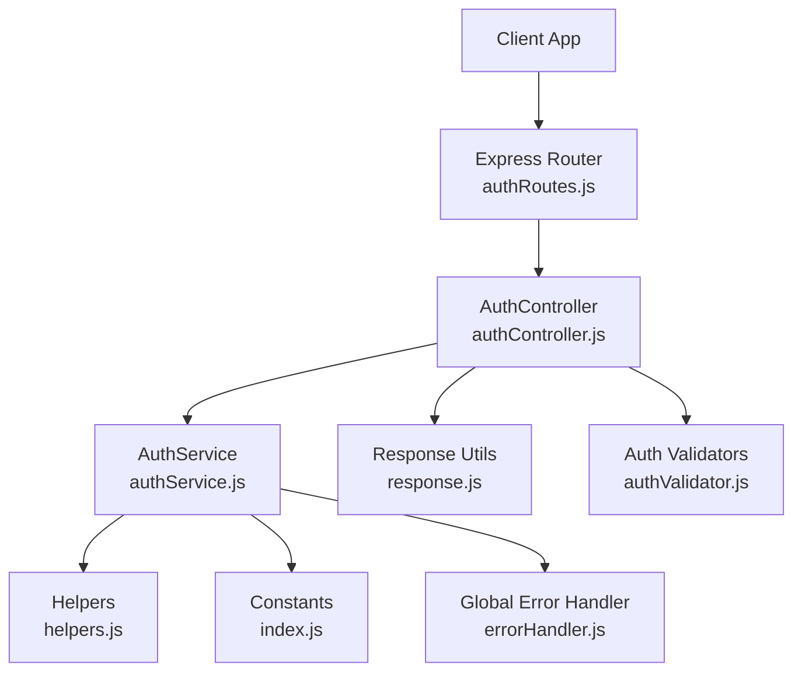

**Diagram sources**
- [authRoutes.js:1-38](file://backend/src/routes/authRoutes.js#L1-L38)
- [authController.js:1-94](file://backend/src/controllers/authController.js#L1-L94)
- [authService.js:1-250](file://backend/src/services/authService.js#L1-L250)
- [helpers.js:1-247](file://backend/src/utils/helpers.js#L1-L247)
- [index.js:1-242](file://backend/src/constants/index.js#L1-L242)
- [errorHandler.js:1-98](file://backend/src/middlewares/errorHandler.js#L1-L98)
- [response.js:1-82](file://backend/src/utils/response.js#L1-L82)
- [authValidator.js:1-44](file://backend/src/validators/authValidator.js#L1-L44)

## Detailed Component Analysis

### Authentication Service
Responsibilities:
- Registration with duplicate email prevention and token generation.
- Login with credential verification, streak and XP updates, and token issuance.
- Logout by clearing refresh tokens.
- Token refresh with JWT verification.
- Google OAuth callbacks and native mobile sign-in with token decoding and user creation/updating.

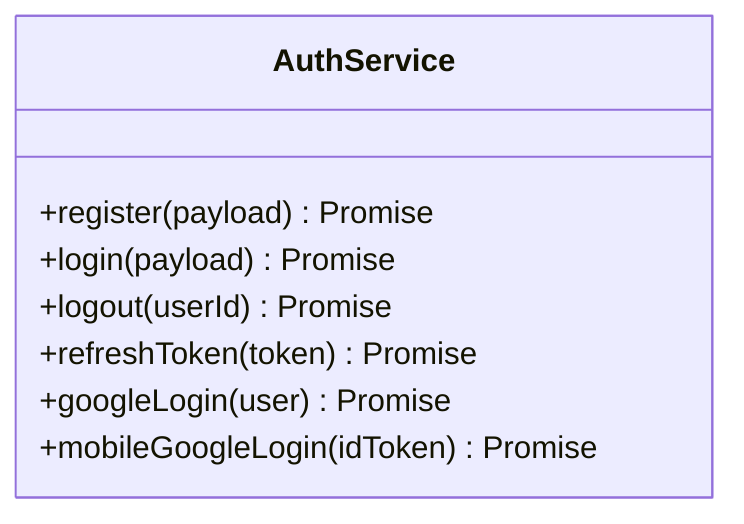

**Diagram sources**
- [authService.js:16-249](file://backend/src/services/authService.js#L16-L249)

**Section sources**
- [authService.js:1-250](file://backend/src/services/authService.js#L1-L250)

### User Service
Responsibilities:
- Profile retrieval with progress synchronization and population of related entities.
- Profile updates with allowed-field enforcement.
- Inventory updates.
- XP addition with level calculation and socket notifications.
- Star addition and skill progress updates via weighted averages.
- Lesson completion marking and user rank computation.

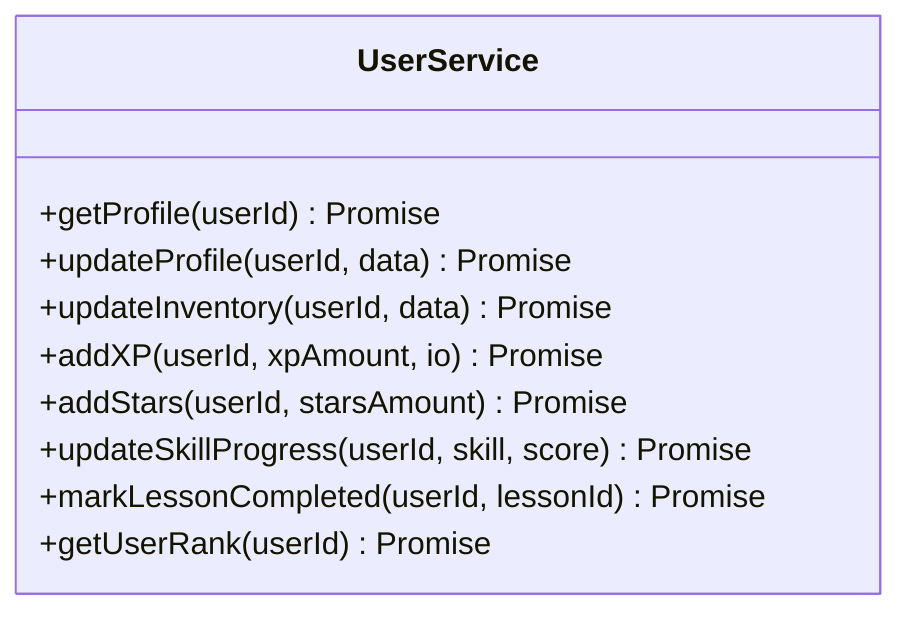

**Diagram sources**
- [userService.js:15-220](file://backend/src/services/userService.js#L15-L220)

**Section sources**
- [userService.js:1-221](file://backend/src/services/userService.js#L1-L221)

### Lesson Service
Responsibilities:
- Filtered and paginated lesson retrieval by type/difficulty/category.
- Single lesson lookup with ObjectId validation.
- Admin CRUD operations with soft deletion.
- Lesson statistics aggregation by type.

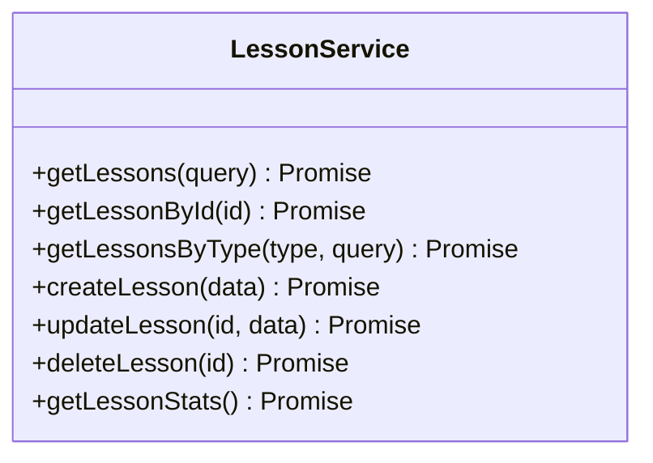

**Diagram sources**
- [lessonService.js:14-129](file://backend/src/services/lessonService.js#L14-L129)

**Section sources**
- [lessonService.js:1-130](file://backend/src/services/lessonService.js#L1-L130)

### Game Service
Responsibilities:
- Persist game results with star and XP computations.
- Update user XP and stars via user service.
- Track total games played.
- Retrieve history and aggregate statistics by game type.

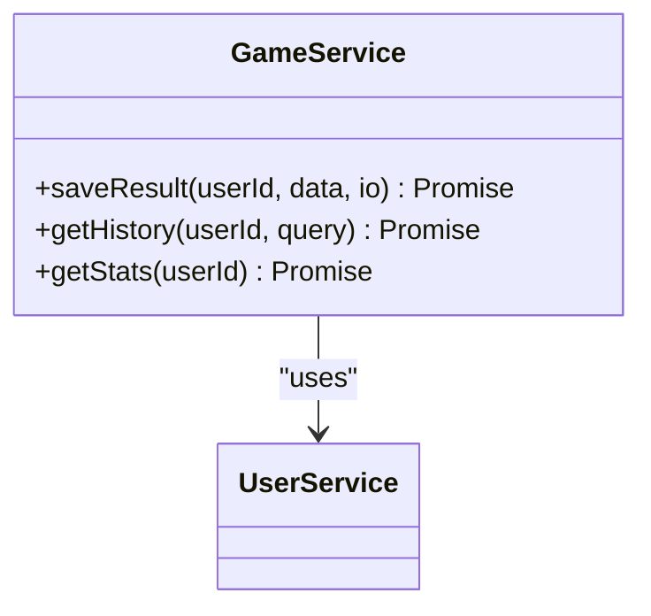

**Diagram sources**
- [gameService.js:12-88](file://backend/src/services/gameService.js#L12-L88)
- [userService.js:1-221](file://backend/src/services/userService.js#L1-L221)

**Section sources**
- [gameService.js:1-89](file://backend/src/services/gameService.js#L1-L89)

### Progress Service
Responsibilities:
- Offline-first progress storage with get-or-create pattern.
- Bidirectional sync using a take-max strategy for lesson stars and union for unlocks.
- Auto-unlock mechanics and completion counting.
- Completion tracking with lesson metadata resolution and XP/star attribution.

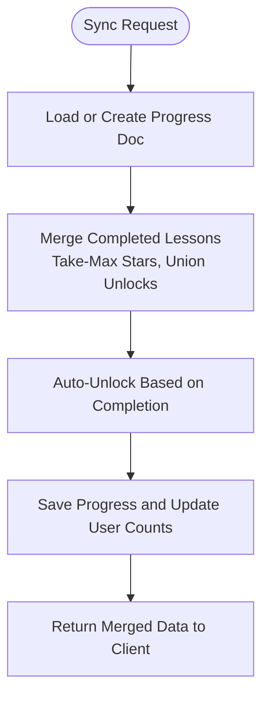

**Diagram sources**
- [progressService.js:62-154](file://backend/src/services/progressService.js#L62-L154)

**Section sources**
- [progressService.js:1-304](file://backend/src/services/progressService.js#L1-L304)

### Rank Service
Responsibilities:
- Top global leaderboard by XP.
- Weekly and monthly leaderboards combining game XP/stars and lesson XP/stars.
- Aggregation across game results and progress collections.

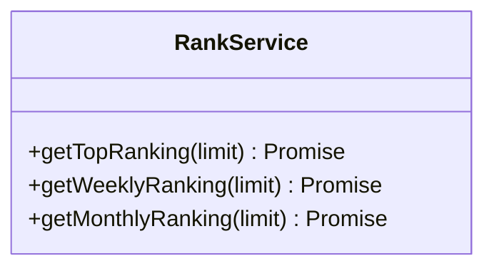

**Diagram sources**
- [rankService.js:12-212](file://backend/src/services/rankService.js#L12-L212)

**Section sources**
- [rankService.js:1-213](file://backend/src/services/rankService.js#L1-L213)

### Badge Service
Responsibilities:
- Badge listing and user achievement retrieval.
- Eligibility checks against user attributes (level, streak, XP, stars, skill levels).
- Unlocking badges, awarding XP/stars, creating achievement records, and emitting notifications.

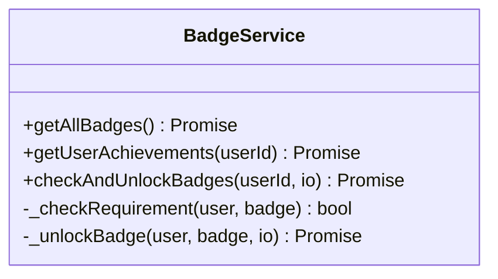

**Diagram sources**
- [badgeService.js:13-149](file://backend/src/services/badgeService.js#L13-L149)

**Section sources**
- [badgeService.js:1-152](file://backend/src/services/badgeService.js#L1-L152)

### Reading and Listening Services
Responsibilities:
- Fetch lessons with selection of relevant fields.
- Save results with computed scores, stars, and pass/fail status.
- Update user XP, stars, and skill progress.
- Mark lesson completion upon passing.
- Reading-specific XP per attempt; listening history retrieval.

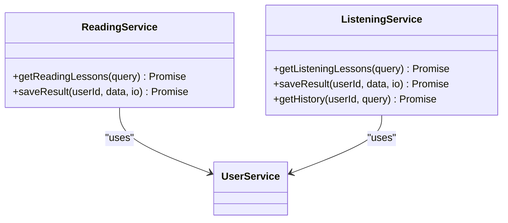

**Diagram sources**
- [readingService.js:13-75](file://backend/src/services/readingService.js#L13-L75)
- [listeningService.js:14-87](file://backend/src/services/listeningService.js#L14-L87)
- [userService.js:1-221](file://backend/src/services/userService.js#L1-L221)

**Section sources**
- [readingService.js:1-76](file://backend/src/services/readingService.js#L1-L76)
- [listeningService.js:1-88](file://backend/src/services/listeningService.js#L1-L88)

### Pronunciation Scoring Engine
Responsibilities:
- Implement Jaro-Winkler similarity and Jaro-Winkler with prefix scaling.
- Normalize digits to Khmer words for scoring consistency.
- Compute final weighted score combining similarity and STT confidence.
- Special-case handling for empty STT and exact matches.

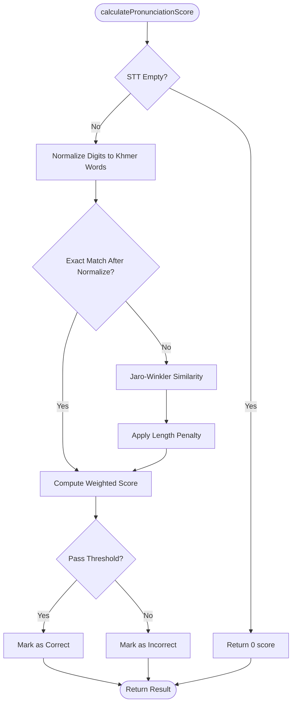

**Diagram sources**
- [scoring.service.js:179-272](file://backend/src/services/scoring.service.js#L179-L272)

**Section sources**
- [scoring.service.js:1-279](file://backend/src/services/scoring.service.js#L1-L279)

### Validation Services
Responsibilities:
- Express-validator chains for registration, login, and refresh token endpoints.
- Input sanitization and normalization (email).

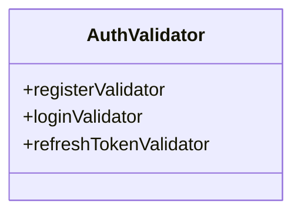

**Diagram sources**
- [authValidator.js:9-43](file://backend/src/validators/authValidator.js#L9-L43)

**Section sources**
- [authValidator.js:1-44](file://backend/src/validators/authValidator.js#L1-L44)

### Error Handling Middleware
Responsibilities:
- Custom AppError class with operational error semantics.
- Centralized handlers for cast errors, duplicate keys, validation errors, and JWT errors.
- Consistent JSON response format with optional stack traces in development.

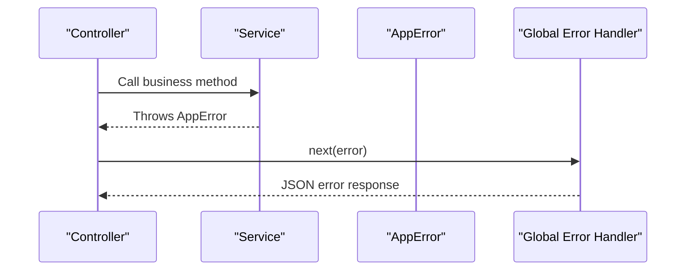

**Diagram sources**
- [errorHandler.js:13-97](file://backend/src/middlewares/errorHandler.js#L13-L97)

**Section sources**
- [errorHandler.js:1-98](file://backend/src/middlewares/errorHandler.js#L1-L98)

### Utility Functions and Helpers
Responsibilities:
- XP calculations, level computation, star allocation, streak computation.
- Date range helpers (today, week, month).
- Input sanitization and random string generation.
- Standardized API response helpers (success, created, error, paginated).

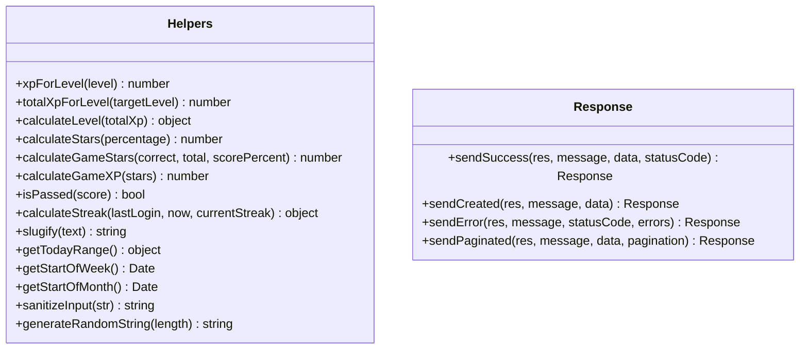

**Diagram sources**
- [helpers.js:18-246](file://backend/src/utils/helpers.js#L18-L246)
- [response.js:17-81](file://backend/src/utils/response.js#L17-L81)

**Section sources**
- [helpers.js:1-247](file://backend/src/utils/helpers.js#L1-L247)
- [response.js:1-82](file://backend/src/utils/response.js#L1-L82)

### Integration Patterns
- Controllers depend on services and use response utilities for consistent outputs.
- Routes apply validation and rate limiting middlewares before invoking controllers.
- Services depend on constants and helpers for configuration and computations.
- Error handling middleware is mounted globally to standardize error responses.

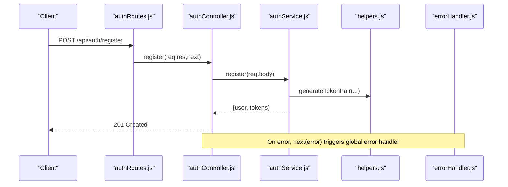

**Diagram sources**
- [authRoutes.js:24-26](file://backend/src/routes/authRoutes.js#L24-L26)
- [authController.js:14-22](file://backend/src/controllers/authController.js#L14-L22)
- [authService.js:20-46](file://backend/src/services/authService.js#L20-L46)
- [helpers.js:1-247](file://backend/src/utils/helpers.js#L1-L247)
- [errorHandler.js:61-92](file://backend/src/middlewares/errorHandler.js#L61-L92)

**Section sources**
- [authRoutes.js:1-38](file://backend/src/routes/authRoutes.js#L1-L38)
- [authController.js:1-94](file://backend/src/controllers/authController.js#L1-L94)
- [authService.js:1-250](file://backend/src/services/authService.js#L1-L250)
- [errorHandler.js:1-98](file://backend/src/middlewares/errorHandler.js#L1-L98)

## Dependency Analysis
- Controllers depend on services and response utilities.
- Services depend on models (referenced by name), helpers, constants, and error handling.
- Validators integrate with routes to enforce input constraints.
- Error handling middleware depends on constants for localized messages.

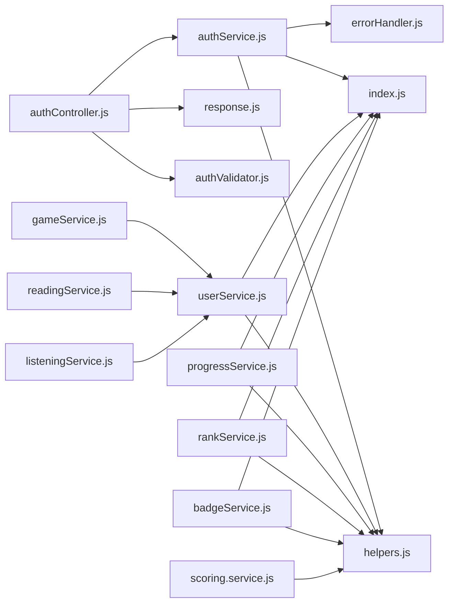

**Diagram sources**
- [authController.js:1-94](file://backend/src/controllers/authController.js#L1-L94)
- [authService.js:1-250](file://backend/src/services/authService.js#L1-L250)
- [userService.js:1-221](file://backend/src/services/userService.js#L1-L221)
- [gameService.js:1-89](file://backend/src/services/gameService.js#L1-L89)
- [progressService.js:1-304](file://backend/src/services/progressService.js#L1-L304)
- [rankService.js:1-213](file://backend/src/services/rankService.js#L1-L213)
- [badgeService.js:1-152](file://backend/src/services/badgeService.js#L1-L152)
- [readingService.js:1-76](file://backend/src/services/readingService.js#L1-L76)
- [listeningService.js:1-88](file://backend/src/services/listeningService.js#L1-L88)
- [scoring.service.js:1-279](file://backend/src/services/scoring.service.js#L1-L279)
- [errorHandler.js:1-98](file://backend/src/middlewares/errorHandler.js#L1-L98)
- [helpers.js:1-247](file://backend/src/utils/helpers.js#L1-L247)
- [response.js:1-82](file://backend/src/utils/response.js#L1-L82)
- [authValidator.js:1-44](file://backend/src/validators/authValidator.js#L1-L44)
- [index.js:1-242](file://backend/src/constants/index.js#L1-L242)

**Section sources**
- [index.js:1-242](file://backend/src/constants/index.js#L1-L242)

## Performance Considerations
- Prefer lean queries for read-heavy endpoints to reduce payload size.
- Use aggregation pipelines for leaderboard computations to minimize round trips.
- Apply pagination and sorting consistently to avoid large result sets.
- Cache token generation and normalization where appropriate.
- Minimize nested loops in sync logic; leverage Map-based lookups for merges.

## Troubleshooting Guide
Common issues and resolutions:
- Validation errors: Ensure validators are attached to routes and express-validator middleware is configured.
- AppError propagation: Controllers should forward thrown errors to next() to trigger global error handler.
- JWT-related errors: Verify token presence and expiration; ensure proper middleware ordering.
- ObjectId errors: Validate incoming IDs and handle cast errors centrally.
- Duplicate key errors: Normalize inputs and handle duplicate key errors gracefully.

**Section sources**
- [errorHandler.js:27-56](file://backend/src/middlewares/errorHandler.js#L27-L56)
- [authRoutes.js:1-38](file://backend/src/routes/authRoutes.js#L1-L38)
- [authController.js:1-94](file://backend/src/controllers/authController.js#L1-L94)

## Conclusion
The service layer cleanly separates business logic from transport and presentation concerns. Services compose utilities and constants, controllers orchestrate flows, and middlewares standardize validation and error handling. This architecture supports maintainability, testability, and scalability across authentication, learning, gamification, and scoring domains.