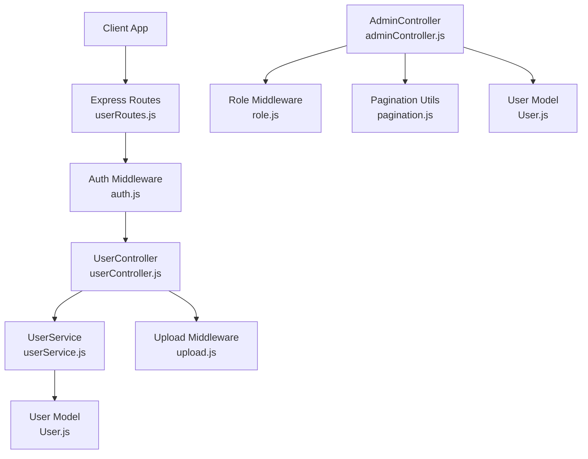
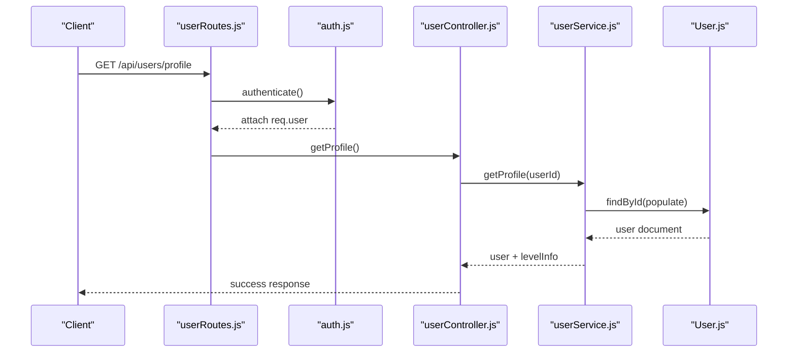
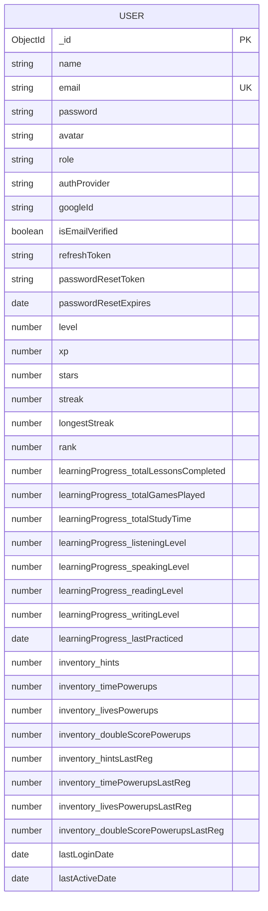
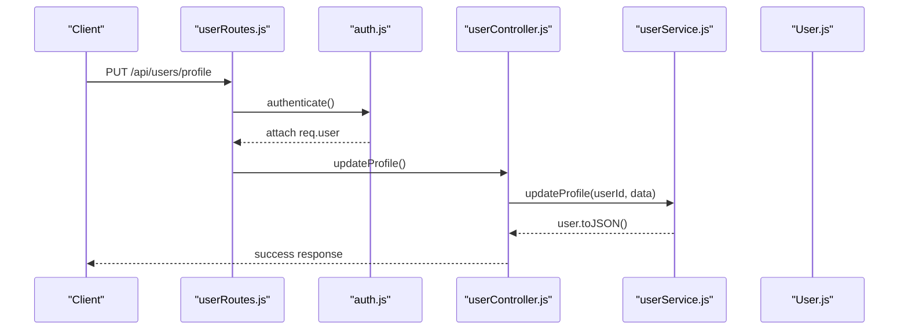
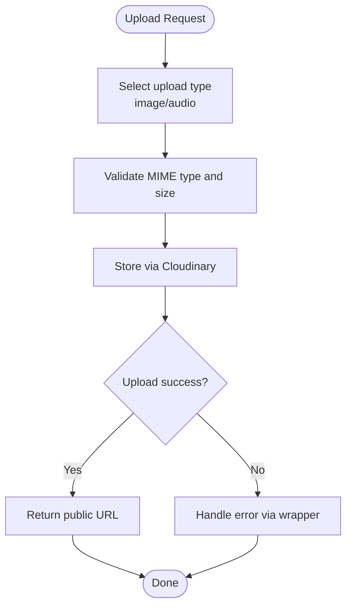
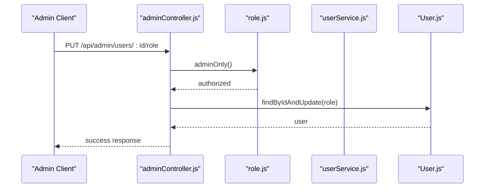
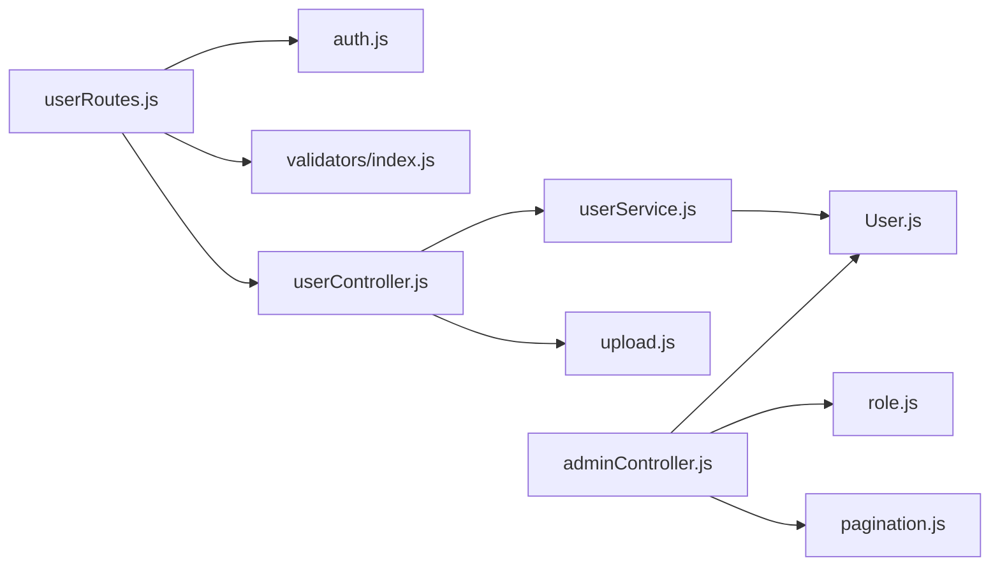

# User Management APIs

<cite>
**Referenced Files in This Document**
- [User.js](file://backend/src/models/User.js)
- [userController.js](file://backend/src/controllers/userController.js)
- [userRoutes.js](file://backend/src/routes/userRoutes.js)
- [userService.js](file://backend/src/services/userService.js)
- [index.js](file://backend/src/constants/index.js)
- [index.js](file://backend/src/validators/index.js)
- [upload.js](file://backend/src/middlewares/upload.js)
- [auth.js](file://backend/src/middlewares/auth.js)
- [role.js](file://backend/src/middlewares/role.js)
- [helpers.js](file://backend/src/utils/helpers.js)
- [pagination.js](file://backend/src/utils/pagination.js)
- [adminController.js](file://backend/src/controllers/adminController.js)
- [API.md](file://backend/src/docs/API.md)
- [server.js](file://backend/server.js)
</cite>

## Table of Contents
1. [Introduction](#introduction)
2. [Project Structure](#project-structure)
3. [Core Components](#core-components)
4. [Architecture Overview](#architecture-overview)
5. [Detailed Component Analysis](#detailed-component-analysis)
6. [Dependency Analysis](#dependency-analysis)
7. [Performance Considerations](#performance-considerations)
8. [Troubleshooting Guide](#troubleshooting-guide)
9. [Conclusion](#conclusion)
10. [Appendices](#appendices)

## Introduction
This document provides comprehensive API documentation for user management operations in the backend. It covers user profile management endpoints (profile updates, avatar uploads, and account settings), user data retrieval, ranking, and administrative user management features. It also explains the User model schema, validation rules, and data protection measures. Examples of user CRUD operations, permission handling, and integration patterns with other system components are included.

## Project Structure
The user management APIs are implemented using an MVC architecture layered under Express routes, controllers, services, and models. Supporting middleware handles authentication, authorization, validation, and file uploads. Administrative features are implemented via an admin controller with search and pagination capabilities.

**Diagram sources**
- [userRoutes.js:1-31](file://backend/src/routes/userRoutes.js#L1-L31)
- [auth.js:1-78](file://backend/src/middlewares/auth.js#L1-L78)
- [userController.js:1-54](file://backend/src/controllers/userController.js#L1-L54)
- [userService.js:1-221](file://backend/src/services/userService.js#L1-L221)
- [User.js:1-243](file://backend/src/models/User.js#L1-L243)
- [upload.js:1-119](file://backend/src/middlewares/upload.js#L1-L119)
- [adminController.js:1-703](file://backend/src/controllers/adminController.js#L1-L703)
- [role.js:1-40](file://backend/src/middlewares/role.js#L1-L40)
- [pagination.js:1-74](file://backend/src/utils/pagination.js#L1-L74)

**Section sources**
- [userRoutes.js:1-31](file://backend/src/routes/userRoutes.js#L1-L31)
- [userController.js:1-54](file://backend/src/controllers/userController.js#L1-L54)
- [userService.js:1-221](file://backend/src/services/userService.js#L1-L221)
- [User.js:1-243](file://backend/src/models/User.js#L1-L243)
- [upload.js:1-119](file://backend/src/middlewares/upload.js#L1-L119)
- [adminController.js:1-703](file://backend/src/controllers/adminController.js#L1-L703)
- [role.js:1-40](file://backend/src/middlewares/role.js#L1-L40)
- [pagination.js:1-74](file://backend/src/utils/pagination.js#L1-L74)

## Core Components
- User Model: Defines schema, indexes, pre-save hooks (password hashing, level calculation), and safe serialization.
- User Controller: Exposes endpoints for profile retrieval, profile updates, inventory updates, and rank retrieval.
- User Service: Implements business logic for profile sync, updates, XP/stars accumulation, skill progress, and rank computation.
- Validation: Express-validator rules for profile updates.
- Upload Middleware: Multer-based Cloudinary integration for images and audio.
- Admin Controller: Provides admin-only user listing, role updates, and deletions with search and pagination.
- Auth and Role Middleware: JWT-based authentication and role-based authorization.

**Section sources**
- [User.js:14-243](file://backend/src/models/User.js#L14-L243)
- [userController.js:11-54](file://backend/src/controllers/userController.js#L11-L54)
- [userService.js:15-221](file://backend/src/services/userService.js#L15-L221)
- [index.js:13-24](file://backend/src/validators/index.js#L13-L21)
- [upload.js:19-119](file://backend/src/middlewares/upload.js#L19-L119)
- [adminController.js:107-180](file://backend/src/controllers/adminController.js#L107-L180)
- [auth.js:18-50](file://backend/src/middlewares/auth.js#L18-L50)
- [role.js:17-34](file://backend/src/middlewares/role.js#L17-L34)

## Architecture Overview
The user management flow integrates routing, middleware, controller, service, and model layers. Authentication is mandatory for user endpoints; admin endpoints additionally enforce role checks. Validation ensures safe and consistent updates. Uploads leverage Cloudinary for media assets.

**Diagram sources**
- [userRoutes.js:21-21](file://backend/src/routes/userRoutes.js#L21-L21)
- [auth.js:18-50](file://backend/src/middlewares/auth.js#L18-L50)
- [userController.js:13-20](file://backend/src/controllers/userController.js#L13-L20)
- [userService.js:19-56](file://backend/src/services/userService.js#L19-L56)
- [User.js:40-43](file://backend/src/models/User.js#L40-L43)

**Section sources**
- [userRoutes.js:18-24](file://backend/src/routes/userRoutes.js#L18-L24)
- [auth.js:18-50](file://backend/src/middlewares/auth.js#L18-L50)
- [userController.js:11-54](file://backend/src/controllers/userController.js#L11-L54)
- [userService.js:15-56](file://backend/src/services/userService.js#L15-L56)
- [User.js:14-176](file://backend/src/models/User.js#L14-L176)

## Detailed Component Analysis

### User Model Schema
The User model defines comprehensive fields for personal info, authentication, gamification, badges/achievements, learning progress, inventory, and activity tracking. It includes:
- Basic Info: name, email, password, avatar
- Auth: role, authProvider, googleId, email verification, refresh tokens, password reset fields
- Gamification: level, xp, stars, streak, longestStreak
- Badges & Achievements: arrays of ObjectIds referencing related collections
- Ranking: rank
- Learning Progress: totals, skill levels, completed lessons, weak skills
- Inventory: power-ups and last registration timestamps
- Activity Tracking: last login and last active dates
- Indexes: rank, xp descending, level descending
- Pre-save hooks: password hashing and level recalculation
- Safe serialization: sensitive fields excluded from JSON

**Diagram sources**
- [User.js:14-170](file://backend/src/models/User.js#L14-L170)

**Section sources**
- [User.js:14-243](file://backend/src/models/User.js#L14-L243)

### User Profile Endpoints
- GET /api/users/profile
  - Purpose: Retrieve authenticated user’s profile, including computed level info and populated references.
  - Authentication: Required.
  - Response: Includes user data with level metadata.
  - Implementation: Controller delegates to service; service syncs progress and computes level.

- PUT /api/users/profile
  - Purpose: Update allowed profile fields (name, avatar).
  - Authentication: Required.
  - Validation: Enforced via validator chain.
  - Response: Updated user profile.

- PUT /api/users/inventory
  - Purpose: Set inventory fields for power-ups.
  - Authentication: Required.
  - Response: Updated user with inventory snapshot.

- GET /api/users/rank
  - Purpose: Compute and return user’s rank based on XP.
  - Authentication: Required.
  - Response: Rank, XP, level, name, avatar.

**Diagram sources**
- [userRoutes.js:22-22](file://backend/src/routes/userRoutes.js#L22-L22)
- [auth.js:18-50](file://backend/src/middlewares/auth.js#L18-L50)
- [userController.js:23-30](file://backend/src/controllers/userController.js#L23-L30)
- [userService.js:61-82](file://backend/src/services/userService.js#L61-L82)

**Section sources**
- [userRoutes.js:18-28](file://backend/src/routes/userRoutes.js#L18-L28)
- [userController.js:11-54](file://backend/src/controllers/userController.js#L11-L54)
- [userService.js:15-82](file://backend/src/services/userService.js#L15-L82)
- [index.js:13-21](file://backend/src/validators/index.js#L13-L21)

### Avatar Uploads and Media Handling
- Upload Middleware: Configured for Cloudinary with image and audio resources, file filters, sizes, and error handling wrappers.
- Integration Pattern: Use appropriate upload middleware in routes or controllers prior to processing media URLs returned by Cloudinary.

**Diagram sources**
- [upload.js:69-119](file://backend/src/middlewares/upload.js#L69-L119)

**Section sources**
- [upload.js:19-119](file://backend/src/middlewares/upload.js#L19-L119)

### Administrative User Management
- GET /api/admin/users
  - Purpose: List users with search by name/email and filtering by role; paginated with selected fields and population.
  - Authentication: Required.
  - Authorization: Admin only.
  - Response: Paginated list with metadata.

- PUT /api/admin/users/:id/role
  - Purpose: Change user role; prevents self-modification.
  - Authentication: Required.
  - Authorization: Admin only.
  - Response: Updated user role.

- DELETE /api/admin/users/:id
  - Purpose: Delete a user; prevents self-deletion.
  - Authentication: Required.
  - Authorization: Admin only.
  - Response: Deletion confirmation.

**Diagram sources**
- [adminController.js:140-164](file://backend/src/controllers/adminController.js#L140-L164)
- [role.js:34-34](file://backend/src/middlewares/role.js#L34-L34)
- [User.js:14-170](file://backend/src/models/User.js#L14-L170)

**Section sources**
- [adminController.js:107-180](file://backend/src/controllers/adminController.js#L107-L180)
- [role.js:34-34](file://backend/src/middlewares/role.js#L34-L34)
- [pagination.js:49-67](file://backend/src/utils/pagination.js#L49-L67)

### Validation Rules
- Profile Update Validator:
  - name: optional, trimmed, length 2–50
  - avatar: optional, must be a string

These rules are applied in the user routes before invoking the controller.

**Section sources**
- [index.js:13-21](file://backend/src/validators/index.js#L13-L21)
- [userRoutes.js:16-16](file://backend/src/routes/userRoutes.js#L16-L16)

### Permission Handling
- Authentication: JWT verification attaches user to request; missing or invalid tokens are rejected.
- Authorization: Admin-only endpoints use role middleware to restrict access to administrators.

**Section sources**
- [auth.js:18-50](file://backend/src/middlewares/auth.js#L18-L50)
- [role.js:17-34](file://backend/src/middlewares/role.js#L17-L34)
- [adminController.js:140-164](file://backend/src/controllers/adminController.js#L140-L164)

### Integration Patterns
- Real-time Updates: XP and level changes emit socket events to the user’s room.
- Search and Pagination: Admin user listing supports search and pagination utilities.
- Constants and Messages: Centralized constants define roles, providers, upload limits, and response messages.

**Section sources**
- [userService.js:122-135](file://backend/src/services/userService.js#L122-L135)
- [pagination.js:14-40](file://backend/src/utils/pagination.js#L14-L40)
- [index.js:13-242](file://backend/src/constants/index.js#L13-L242)

## Dependency Analysis
The user management stack exhibits clear separation of concerns:
- Routes depend on authentication middleware and validators.
- Controllers depend on services.
- Services depend on models and utilities.
- Admin features depend on role middleware and pagination utilities.

**Diagram sources**
- [userRoutes.js:14-16](file://backend/src/routes/userRoutes.js#L14-L16)
- [auth.js:18-50](file://backend/src/middlewares/auth.js#L18-L50)
- [index.js:13-21](file://backend/src/validators/index.js#L13-L21)
- [userController.js:7-9](file://backend/src/controllers/userController.js#L7-L9)
- [userService.js:10-13](file://backend/src/services/userService.js#L10-L13)
- [User.js:10-12](file://backend/src/models/User.js#L10-L12)
- [upload.js:10-14](file://backend/src/middlewares/upload.js#L10-L14)
- [adminController.js:10-22](file://backend/src/controllers/adminController.js#L10-L22)
- [role.js:34-34](file://backend/src/middlewares/role.js#L34-L34)
- [pagination.js:49-67](file://backend/src/utils/pagination.js#L49-L67)

**Section sources**
- [userRoutes.js:14-16](file://backend/src/routes/userRoutes.js#L14-L16)
- [auth.js:18-50](file://backend/src/middlewares/auth.js#L18-L50)
- [index.js:13-21](file://backend/src/validators/index.js#L13-L21)
- [userController.js:7-9](file://backend/src/controllers/userController.js#L7-L9)
- [userService.js:10-13](file://backend/src/services/userService.js#L10-L13)
- [User.js:10-12](file://backend/src/models/User.js#L10-L12)
- [upload.js:10-14](file://backend/src/middlewares/upload.js#L10-L14)
- [adminController.js:10-22](file://backend/src/controllers/adminController.js#L10-L22)
- [role.js:34-34](file://backend/src/middlewares/role.js#L34-L34)
- [pagination.js:49-67](file://backend/src/utils/pagination.js#L49-L67)

## Performance Considerations
- Indexes: User schema includes indexes on rank, XP descending, and level descending to optimize ranking and sorting queries.
- Population: Profile retrieval populates badges, achievements, and completed lessons; consider limiting projections for high-traffic endpoints.
- Pagination: Admin user listing uses pagination utilities to cap result sets and improve responsiveness.
- Validation: Applying validation early reduces downstream processing overhead.

**Section sources**
- [User.js:181-183](file://backend/src/models/User.js#L181-L183)
- [pagination.js:49-67](file://backend/src/utils/pagination.js#L49-L67)
- [adminController.js:123-134](file://backend/src/controllers/adminController.js#L123-L134)

## Troubleshooting Guide
- Authentication Failures:
  - Missing or invalid token leads to unauthorized responses.
  - Token expiration triggers expired token messages.
- Authorization Failures:
  - Non-admin attempts to access admin endpoints receive forbidden responses.
- Validation Errors:
  - Profile update failures return validation messages; ensure payload adheres to allowed fields and constraints.
- Upload Errors:
  - Unsupported file types or oversized files trigger specific error messages handled by the upload wrapper.
- User Not Found:
  - Operations targeting non-existent users return not found errors.

**Section sources**
- [auth.js:23-49](file://backend/src/middlewares/auth.js#L23-L49)
- [role.js:19-25](file://backend/src/middlewares/role.js#L19-L25)
- [index.js:13-21](file://backend/src/validators/index.js#L13-L21)
- [upload.js:97-112](file://backend/src/middlewares/upload.js#L97-L112)
- [adminController.js:149-151](file://backend/src/controllers/adminController.js#L149-L151)

## Conclusion
The user management APIs provide a secure, validated, and scalable foundation for profile operations, gamification features, and administrative controls. The modular design enables clear separation of concerns, robust data protection, and extensibility for future enhancements.

## Appendices

### API Endpoints Summary
- GET /api/users/profile: Retrieve authenticated user profile.
- PUT /api/users/profile: Update allowed profile fields.
- PUT /api/users/inventory: Set inventory fields.
- GET /api/users/rank: Get user rank based on XP.
- GET /api/admin/users: List users with search and pagination (admin).
- PUT /api/admin/users/:id/role: Update user role (admin).
- DELETE /api/admin/users/:id: Delete a user (admin).

**Section sources**
- [userRoutes.js:21-28](file://backend/src/routes/userRoutes.js#L21-L28)
- [adminController.js:107-180](file://backend/src/controllers/adminController.js#L107-L180)
- [API.md:93-132](file://backend/src/docs/API.md#L93-L132)