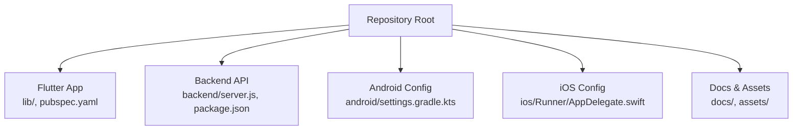
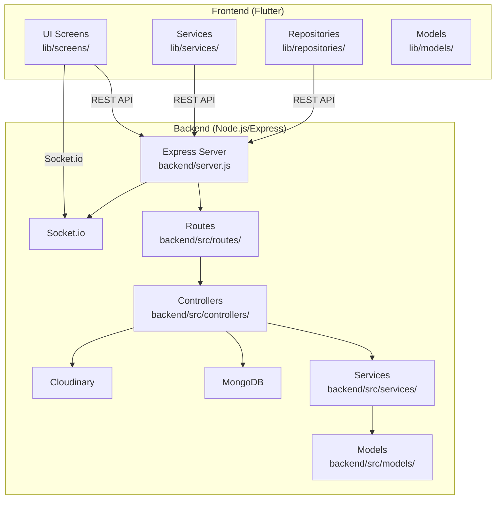
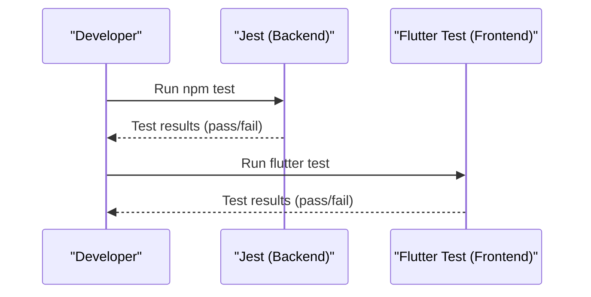
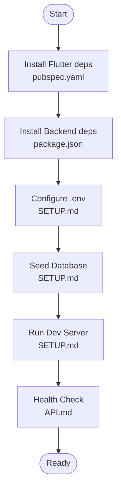
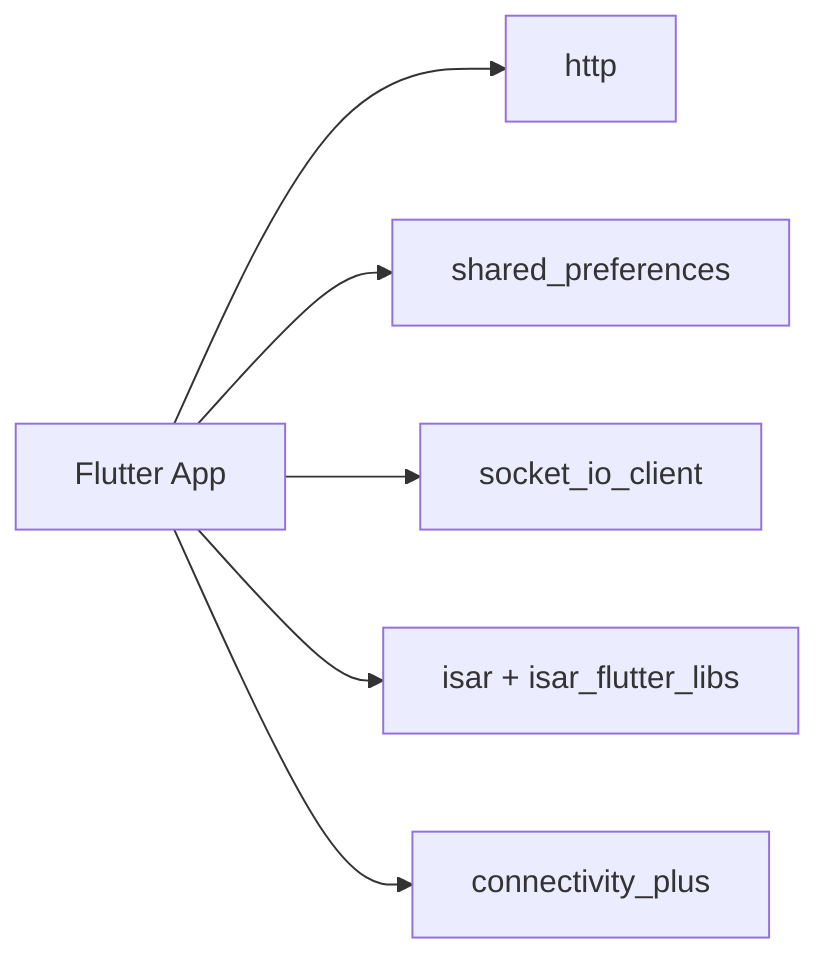

# Contributing and Development Guidelines

<cite>
**Referenced Files in This Document**
- [README.md](file://README.md)
- [pubspec.yaml](file://pubspec.yaml)
- [analysis_options.yaml](file://analysis_options.yaml)
- [android/settings.gradle.kts](file://android/settings.gradle.kts)
- [ios/Runner/AppDelegate.swift](file://ios/Runner/AppDelegate.swift)
- [backend/package.json](file://backend/package.json)
- [backend/server.js](file://backend/server.js)
- [backend/src/docs/API.md](file://backend/src/docs/API.md)
- [backend/src/docs/SETUP.md](file://backend/src/docs/SETUP.md)
- [backend/TTS_PROVIDER.md](file://backend/TTS_PROVIDER.md)
- [assets/audio/khmer/README.md](file://assets/audio/khmer/README.md)
- [docs/AUDIO_FIX_GUIDE.md](file://docs/AUDIO_FIX_GUIDE.md)
- [lib/main.dart](file://lib/main.dart)
- [backend/test/scoring.service.test.js](file://backend/test/scoring.service.test.js)
</cite>

## Table of Contents
1. [Introduction](#introduction)
2. [Project Structure](#project-structure)
3. [Core Components](#core-components)
4. [Architecture Overview](#architecture-overview)
5. [Development Workflow](#development-workflow)
6. [Code Standards and Conventions](#code-standards-and-conventions)
7. [Testing Requirements](#testing-requirements)
8. [Documentation Standards](#documentation-standards)
9. [Community Guidelines and Contribution Process](#community-guidelines-and-contribution-process)
10. [Setup and Environment Configuration](#setup-and-environment-configuration)
11. [Debugging Techniques](#debugging-techniques)
12. [Extending the Application](#extending-the-application)
13. [Issue Reporting and Feature Requests](#issue-reporting-and-feature-requests)
14. [Release Procedure](#release-procedure)
15. [Dependency Analysis](#dependency-analysis)
16. [Performance Considerations](#performance-considerations)
17. [Troubleshooting Guide](#troubleshooting-guide)
18. [Conclusion](#conclusion)

## Introduction
This document provides comprehensive contributing and development guidelines for the KhmerKid project. It covers development workflow, code standards, community guidelines, Git branching strategy, code review process, testing requirements, release procedure, coding conventions, documentation standards, and contribution guidelines for both frontend and backend development. It also includes setup for the development environment, debugging techniques, best practices for extending the application, issue reporting procedures, feature request processes, and community interaction guidelines.

## Project Structure
The project is a Flutter mobile application with a Node.js/Express backend. The frontend (Flutter) resides under the root directory, while the backend is located under the backend directory. Platform-specific configurations are provided for Android and iOS.

**Diagram sources**
- [lib/main.dart:1-129](file://lib/main.dart#L1-L129)
- [backend/server.js:1-160](file://backend/server.js#L1-L160)
- [android/settings.gradle.kts:1-27](file://android/settings.gradle.kts#L1-L27)
- [ios/Runner/AppDelegate.swift:1-17](file://ios/Runner/AppDelegate.swift#L1-L17)

**Section sources**
- [lib/main.dart:1-129](file://lib/main.dart#L1-L129)
- [backend/server.js:1-160](file://backend/server.js#L1-L160)
- [android/settings.gradle.kts:1-27](file://android/settings.gradle.kts#L1-L27)
- [ios/Runner/AppDelegate.swift:1-17](file://ios/Runner/AppDelegate.swift#L1-L17)

## Core Components
- Frontend (Flutter):
  - Entry point initializes local database, connectivity, language, notifications, and auto-login detection before rendering the app.
  - Uses internationalization, responsive layout, and integrates with backend APIs.
- Backend (Node.js/Express):
  - Initializes database, Socket.io, cron jobs, security middleware, routes, and error handling.
  - Provides health checks, authentication, user profiles, lessons, skills (listening, reading, writing), gamification, and real-time events.

**Section sources**
- [lib/main.dart:21-77](file://lib/main.dart#L21-L77)
- [backend/server.js:38-122](file://backend/server.js#L38-L122)

## Architecture Overview
The application follows a hybrid offline-first architecture with a Flutter frontend and a Node.js/Express backend. The frontend communicates with the backend via REST APIs and Socket.io for real-time updates. Authentication uses JWT tokens, and the backend integrates with MongoDB for persistence and Cloudinary for media storage.

**Diagram sources**
- [lib/main.dart:1-129](file://lib/main.dart#L1-L129)
- [backend/server.js:24-50](file://backend/server.js#L24-L50)
- [backend/src/docs/API.md:1-268](file://backend/src/docs/API.md#L1-L268)

**Section sources**
- [backend/src/docs/API.md:1-268](file://backend/src/docs/API.md#L1-L268)
- [backend/server.js:38-122](file://backend/server.js#L38-L122)

## Development Workflow
- Branching Strategy:
  - Use feature branches prefixed with feature/, bugfix/, or hotfix/.
  - Merge to develop for integration, then to main for releases.
- Commit Messages:
  - Use imperative mood; keep subject under 50 characters; reference issue numbers when applicable.
- Pull Requests:
  - Open PRs from feature branches targeting develop; ensure CI passes and at least one reviewer approves.
- Continuous Integration:
  - Automated linting and tests are enforced via project configuration.

**Section sources**
- [analysis_options.yaml:10-29](file://analysis_options.yaml#L10-L29)
- [backend/package.json:6-14](file://backend/package.json#L6-L14)

## Code Standards and Conventions
- Flutter/Dart:
  - Enforced via flutter_lints; customize rules in analysis_options.yaml.
  - Prefer single quotes; avoid print statements in production.
- Backend/Node.js:
  - Consistent error handling with global error middleware.
  - Use helmet, cors, and rate limiting for security and stability.
  - Standardized API response structure and JWT-based authentication.

**Section sources**
- [analysis_options.yaml:10-29](file://analysis_options.yaml#L10-L29)
- [backend/server.js:59-89](file://backend/server.js#L59-L89)
- [backend/src/docs/API.md:19-37](file://backend/src/docs/API.md#L19-L37)

## Testing Requirements
- Backend:
  - Unit tests with Jest; example tests for scoring service validate pronunciation scoring logic.
  - Run tests via npm test.
- Frontend:
  - Widget and audio validation tests exist; run with flutter test.
- Coverage:
  - Aim to maintain and improve coverage for critical services and controllers.

**Diagram sources**
- [backend/package.json:13-13](file://backend/package.json#L13-L13)
- [backend/test/scoring.service.test.js:1-117](file://backend/test/scoring.service.test.js#L1-L117)

**Section sources**
- [backend/test/scoring.service.test.js:1-117](file://backend/test/scoring.service.test.js#L1-L117)
- [backend/package.json:13-13](file://backend/package.json#L13-L13)

## Documentation Standards
- API Reference:
  - Maintain API.md with base URLs, headers, standard response/error structures, and endpoint tables.
- Setup Guides:
  - Keep SETUP.md updated with prerequisites, environment variables, seeding, and running instructions.
- Audio Assets:
  - Follow AUDIO_FIX_GUIDE.md for prioritizing and validating audio assets; ensure completeness before production.

**Section sources**
- [backend/src/docs/API.md:1-268](file://backend/src/docs/API.md#L1-L268)
- [backend/src/docs/SETUP.md:1-114](file://backend/src/docs/SETUP.md#L1-L114)
- [docs/AUDIO_FIX_GUIDE.md:1-316](file://docs/AUDIO_FIX_GUIDE.md#L1-L316)

## Community Guidelines and Contribution Process
- Code Review:
  - All contributions must be submitted via pull requests; at least one maintainer approval required.
- Issue Reporting:
  - Use GitHub Issues; include environment details, steps to reproduce, and expected vs. actual behavior.
- Feature Requests:
  - Open a GitHub Issue with “Feature Request” label; include rationale, scope, and potential impact.
- Communication:
  - Be respectful, inclusive, and constructive; follow the project’s code of conduct (see README for initial guidance).

**Section sources**
- [README.md:1-18](file://README.md#L1-L18)

## Setup and Environment Configuration
- Flutter:
  - Install dependencies via pubspec.yaml; assets include translations, images, and audio.
- Backend:
  - Install dependencies via package.json; configure environment variables (.env) with server, database, JWT, Google OAuth, and Cloudinary settings.
  - Seed database using npm run seed or individual seed scripts.
  - Start development server with nodemon and production server with node.

**Diagram sources**
- [pubspec.yaml:1-115](file://pubspec.yaml#L1-L115)
- [backend/package.json:1-54](file://backend/package.json#L1-L54)
- [backend/src/docs/SETUP.md:26-114](file://backend/src/docs/SETUP.md#L26-L114)
- [backend/src/docs/API.md:95-113](file://backend/src/docs/API.md#L95-L113)

**Section sources**
- [pubspec.yaml:15-115](file://pubspec.yaml#L15-L115)
- [backend/package.json:6-54](file://backend/package.json#L6-L54)
- [backend/src/docs/SETUP.md:18-114](file://backend/src/docs/SETUP.md#L18-L114)

## Debugging Techniques
- Backend:
  - Use Morgan for request logging; leverage global error handler for structured error responses.
  - Verify health endpoint for quick diagnostics.
- Frontend:
  - Use Flutter DevTools; enable debug logs and inspect widget tree and performance.
- Audio Validation:
  - Follow AUDIO_FIX_GUIDE.md to validate audio assets and monitor logs for fallbacks.

**Section sources**
- [backend/server.js:70-121](file://backend/server.js#L70-L121)
- [backend/src/docs/API.md:95-113](file://backend/src/docs/API.md#L95-L113)
- [docs/AUDIO_FIX_GUIDE.md:246-268](file://docs/AUDIO_FIX_GUIDE.md#L246-L268)

## Extending the Application
- Adding New Features:
  - Frontend: Add screens, services, repositories, and models; integrate with existing navigation and localization.
  - Backend: Add routes, controllers, services, and models; ensure standardized responses and error handling.
- Integrations:
  - Follow TTS_PROVIDER.md for text-to-speech providers and caching; ensure fallbacks for offline scenarios.
- Assets:
  - Add new audio assets following AUDIO_FIX_GUIDE.md structure and update pubspec.yaml accordingly.

**Section sources**
- [backend/TTS_PROVIDER.md:1-42](file://backend/TTS_PROVIDER.md#L1-L42)
- [assets/audio/khmer/README.md:1-46](file://assets/audio/khmer/README.md#L1-L46)
- [docs/AUDIO_FIX_GUIDE.md:132-243](file://docs/AUDIO_FIX_GUIDE.md#L132-L243)

## Issue Reporting and Feature Requests
- Issue Reporting:
  - Provide environment info, Flutter/Node versions, steps to reproduce, and screenshots/logs when applicable.
- Feature Requests:
  - Clearly describe the problem being solved, proposed solution, alternatives considered, and acceptance criteria.

**Section sources**
- [README.md:1-18](file://README.md#L1-L18)

## Release Procedure
- Backend:
  - Build production bundle, run seeders if needed, and start server with node.
- Frontend:
  - Build platform-specific artifacts using Flutter build commands; ensure assets are bundled per pubspec.yaml.
- Versioning:
  - Update version fields in pubspec.yaml and package.json as appropriate; tag releases in Git.

**Section sources**
- [backend/package.json:7-9](file://backend/package.json#L7-L9)
- [pubspec.yaml:4-4](file://pubspec.yaml#L4-L4)

## Dependency Analysis
- Flutter:
  - Core dependencies include http, shared_preferences, socket_io_client, isar, connectivity_plus, and others for offline-first architecture.
- Backend:
  - Core dependencies include express, mongoose, socket.io, helmet, cors, bcryptjs, jsonwebtoken, and cloudinary.

**Diagram sources**
- [pubspec.yaml:15-44](file://pubspec.yaml#L15-L44)

**Section sources**
- [pubspec.yaml:15-44](file://pubspec.yaml#L15-L44)
- [backend/package.json:24-46](file://backend/package.json#L24-L46)

## Performance Considerations
- Frontend:
  - Use offline-first caching with Isar; minimize network calls; lazy-load assets.
- Backend:
  - Apply rate limiting, secure headers, and efficient database queries; cache TTS outputs to reduce latency and cost.
- Audio:
  - Prioritize high-quality audio assets to avoid runtime fallbacks and improve UX.

**Section sources**
- [backend/TTS_PROVIDER.md:20-36](file://backend/TTS_PROVIDER.md#L20-L36)
- [assets/audio/khmer/README.md:31-46](file://assets/audio/khmer/README.md#L31-L46)

## Troubleshooting Guide
- Backend Health:
  - Use curl to hit /api/health and confirm success response structure.
- Authentication:
  - Ensure JWT secrets and client URL are correctly configured in .env.
- Audio Playback:
  - Validate audio assets using AUDIO_FIX_GUIDE.md; monitor logs for fallback warnings.

**Section sources**
- [backend/src/docs/API.md:95-113](file://backend/src/docs/API.md#L95-L113)
- [backend/src/docs/SETUP.md:34-58](file://backend/src/docs/SETUP.md#L34-L58)
- [docs/AUDIO_FIX_GUIDE.md:246-268](file://docs/AUDIO_FIX_GUIDE.md#L246-L268)

## Conclusion
This guide consolidates the development workflow, standards, testing, documentation, and contribution practices for the KhmerKid project. By following these guidelines—branching, code review, testing, documentation, and community interaction—you can contribute effectively to both the Flutter frontend and Node.js backend while maintaining quality and consistency.