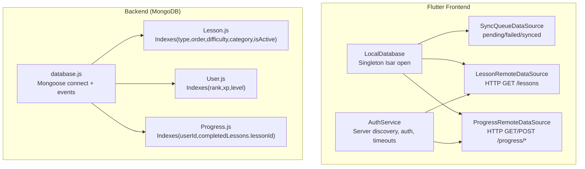
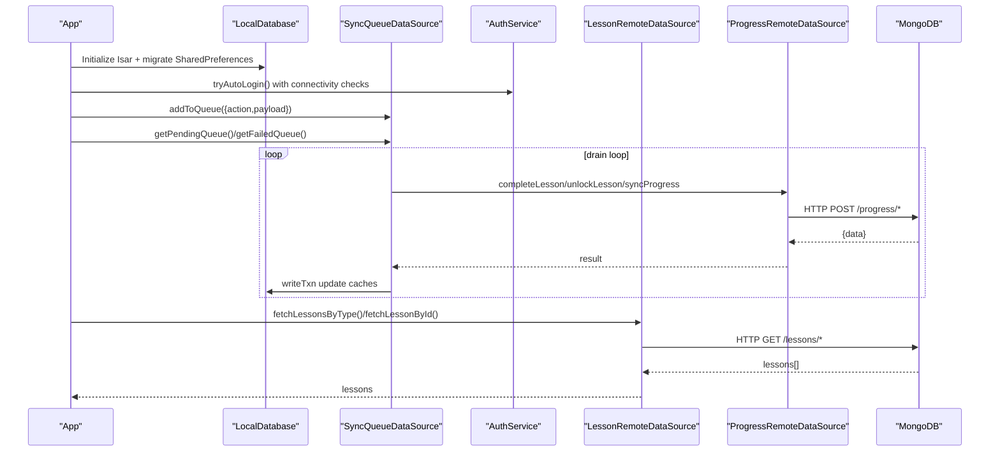
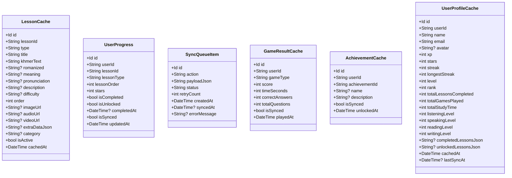
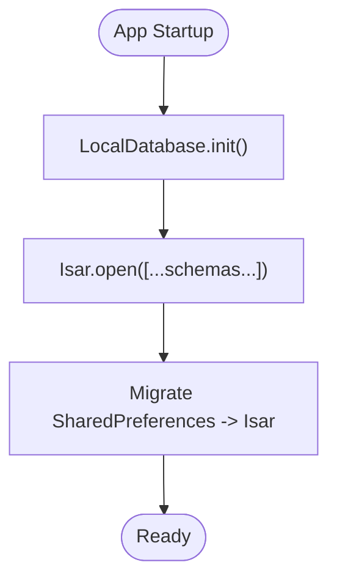
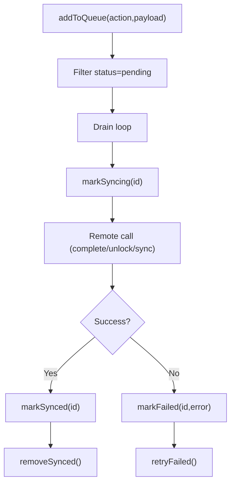
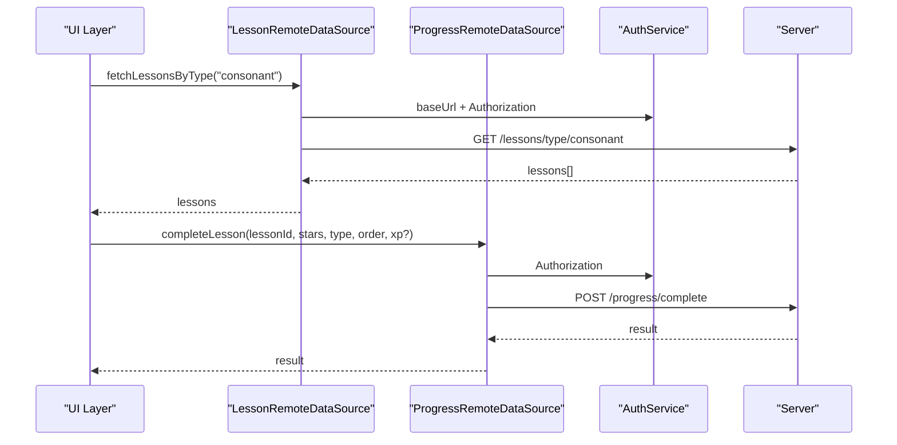
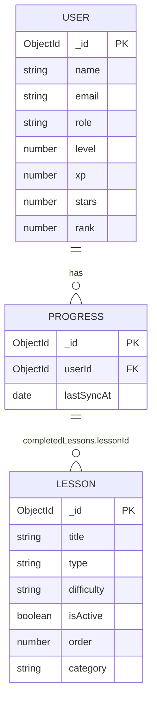
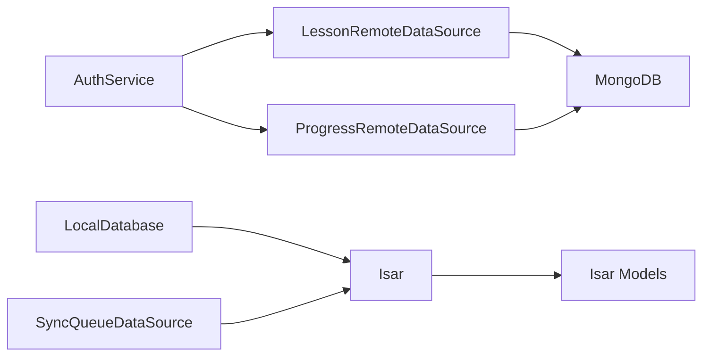

# Data Management

<cite>
**Referenced Files in This Document**
- [isar_models.dart](file://lib/data/local/isar_models.dart)
- [local_database.dart](file://lib/data/local/local_database.dart)
- [sync_queue_datasource.dart](file://lib/data/local/sync_queue_datasource.dart)
- [lesson_remote_datasource.dart](file://lib/data/remote/lesson_remote_datasource.dart)
- [progress_remote_datasource.dart](file://lib/data/remote/progress_remote_datasource.dart)
- [database.js](file://backend/src/config/database.js)
- [Lesson.js](file://backend/src/models/Lesson.js)
- [User.js](file://backend/src/models/User.js)
- [Progress.js](file://backend/src/models/Progress.js)
- [auth_service.dart](file://lib/services/auth_service.dart)
</cite>

## Table of Contents
1. [Introduction](#introduction)
2. [Project Structure](#project-structure)
3. [Core Components](#core-components)
4. [Architecture Overview](#architecture-overview)
5. [Detailed Component Analysis](#detailed-component-analysis)
6. [Dependency Analysis](#dependency-analysis)
7. [Performance Considerations](#performance-considerations)
8. [Troubleshooting Guide](#troubleshooting-guide)
9. [Conclusion](#conclusion)

## Introduction
This document explains the offline-first data management architecture for the application, covering:
- Local storage using Isar (Flutter) for caching lessons, user progress, achievements, game results, and a sync queue
- Backend MongoDB schema design for lessons, users, and progress
- Intelligent synchronization via a sync queue and remote datasources
- Indexing strategies, migrations, validation rules, conflict resolution, and performance optimizations
- Practical data access patterns and integration with the synchronization system

## Project Structure
The data management system spans two primary layers:
- Flutter frontend with Isar collections and remote datasources
- Node.js backend with Mongoose models and REST endpoints

**Diagram sources**
- [local_database.dart:34-61](file://lib/data/local/local_database.dart#L34-L61)
- [sync_queue_datasource.dart:9-27](file://lib/data/local/sync_queue_datasource.dart#L9-L27)
- [lesson_remote_datasource.dart:7-47](file://lib/data/remote/lesson_remote_datasource.dart#L7-L47)
- [progress_remote_datasource.dart:6-69](file://lib/data/remote/progress_remote_datasource.dart#L6-L69)
- [auth_service.dart:16:233](file://lib/services/auth_service.dart#L16-L233)
- [database.js:16-40](file://backend/src/config/database.js#L16-L40)
- [Lesson.js:147-151](file://backend/src/models/Lesson.js#L147-L151)
- [User.js:181-183](file://backend/src/models/User.js#L181-L183)
- [Progress.js:99-101](file://backend/src/models/Progress.js#L99-L101)

**Section sources**
- [local_database.dart:34-61](file://lib/data/local/local_database.dart#L34-L61)
- [auth_service.dart:16:233](file://lib/services/auth_service.dart#L16-L233)
- [database.js:16-40](file://backend/src/config/database.js#L16-L40)

## Core Components
- Isar Collections (offline-first caches):
  - LessonCache: cached lessons with indexes on lessonId and type
  - UserProgress: per-user lesson progress with indexes on userId, lessonId, lessonType, isCompleted
  - SyncQueueItem: queued actions with status and retry tracking
  - GameResultCache: offline game results
  - AchievementCache: unlocked achievements per user
  - UserProfileCache: cached user profile snapshot
- Remote Datasources:
  - LessonRemoteDataSource: fetch lessons by type or single lesson by ID
  - ProgressRemoteDataSource: fetch and bidirectional sync progress, complete/unlock lessons
- Backend Models:
  - Lesson: typed, categorized, media-backed lessons with indexes
  - User: gamification fields, rankings, and learning progress
  - Progress: per-user progress, completed/unlocked lessons, game results, achievements, and sync metadata

**Section sources**
- [isar_models.dart:8-265](file://lib/data/local/isar_models.dart#L8-L265)
- [lesson_remote_datasource.dart:10-78](file://lib/data/remote/lesson_remote_datasource.dart#L10-L78)
- [progress_remote_datasource.dart:10-143](file://lib/data/remote/progress_remote_datasource.dart#L10-L143)
- [Lesson.js:13-155](file://backend/src/models/Lesson.js#L13-L155)
- [User.js:14-243](file://backend/src/models/User.js#L14-L243)
- [Progress.js:12-112](file://backend/src/models/Progress.js#L12-L112)

## Architecture Overview
Offline-first flow:
- On startup, the app initializes Isar, migrates legacy SharedPreferences, and optionally logs in automatically
- While offline, the app reads/writes locally and queues actions in SyncQueueItem
- When online, SyncManager drains the queue by calling remote datasources and updates local caches accordingly
- Remote datasources rely on AuthService for base URL discovery, authentication headers, and timeouts

**Diagram sources**
- [local_database.dart:34-61](file://lib/data/local/local_database.dart#L34-L61)
- [auth_service.dart:241-317](file://lib/services/auth_service.dart#L241-L317)
- [sync_queue_datasource.dart:12-108](file://lib/data/local/sync_queue_datasource.dart#L12-L108)
- [progress_remote_datasource.dart:40-112](file://lib/data/remote/progress_remote_datasource.dart#L40-L112)
- [lesson_remote_datasource.dart:10-78](file://lib/data/remote/lesson_remote_datasource.dart#L10-L78)

## Detailed Component Analysis

### Isar Collections and Indexing
- LessonCache
  - Indexed fields: lessonId (unique), type
  - Purpose: fast lookup by MongoDB _id and lesson type
- UserProgress
  - Indexed fields: userId, lessonId, lessonType, isCompleted
  - Purpose: efficient progress queries per user and lesson type
- SyncQueueItem
  - Indexed fields: action, status
  - Purpose: queue management and retry scheduling
- GameResultCache
  - Indexed fields: userId
  - Purpose: per-user game history
- AchievementCache
  - Indexed fields: userId, achievementId (unique, composite with userId)
  - Purpose: per-user unlocked achievements
- UserProfileCache
  - Indexed fields: userId (unique)
  - Purpose: cached user profile snapshot

**Diagram sources**
- [isar_models.dart:8-265](file://lib/data/local/isar_models.dart#L8-L265)

**Section sources**
- [isar_models.dart:8-265](file://lib/data/local/isar_models.dart#L8-L265)

### Local Database Initialization and Migration
- Opens Isar with all collection schemas
- One-time migration from SharedPreferences to Isar collections
- Provides clearAll() and close() lifecycle hooks

**Diagram sources**
- [local_database.dart:34-61](file://lib/data/local/local_database.dart#L34-L61)
- [local_database.dart:110-253](file://lib/data/local/local_database.dart#L110-L253)

**Section sources**
- [local_database.dart:34-61](file://lib/data/local/local_database.dart#L34-L61)
- [local_database.dart:110-253](file://lib/data/local/local_database.dart#L110-L253)

### Sync Queue Management
- Add pending actions with JSON payloads
- Filter pending vs failed items with retry limits
- Mark syncing/synced/failed with timestamps and error messages
- Retry failed items and clean synced items

**Diagram sources**
- [sync_queue_datasource.dart:12-108](file://lib/data/local/sync_queue_datasource.dart#L12-L108)

**Section sources**
- [sync_queue_datasource.dart:9-125](file://lib/data/local/sync_queue_datasource.dart#L9-L125)

### Remote Datasources: Lessons and Progress
- LessonRemoteDataSource
  - fetchLessonsByType: GET /lessons/type/:type
  - fetchLessonById: GET /lessons/:id (validates ObjectId)
- ProgressRemoteDataSource
  - fetchProgress: GET /progress/get
  - syncProgress: POST /progress/sync
  - completeLesson: POST /progress/complete
  - unlockLesson: POST /progress/unlock

**Diagram sources**
- [lesson_remote_datasource.dart:10-78](file://lib/data/remote/lesson_remote_datasource.dart#L10-L78)
- [progress_remote_datasource.dart:71-112](file://lib/data/remote/progress_remote_datasource.dart#L71-L112)
- [auth_service.dart:232-238](file://lib/services/auth_service.dart#L232-L238)

**Section sources**
- [lesson_remote_datasource.dart:10-78](file://lib/data/remote/lesson_remote_datasource.dart#L10-L78)
- [progress_remote_datasource.dart:10-143](file://lib/data/remote/progress_remote_datasource.dart#L10-L143)
- [auth_service.dart:232-238](file://lib/services/auth_service.dart#L232-L238)

### Backend MongoDB Schema Design
- Lesson
  - Fields: title, description, type, khmerText, romanized, meaning, pronunciation, examples, media URLs, difficulty, order, category, isActive, strokeOrder, readingLines, questions
  - Indexes: type, difficulty, isActive, category, and compound type+order
- User
  - Fields: personal info, auth provider, roles, gamification (xp, level, stars, streaks), badges, achievements, rank, learningProgress, inventory, timestamps
  - Indexes: rank, xp (descending), level
- Progress
  - Fields: userId (ref), completedLessons[], unlockedLessons[], gameResults[], achievements[], lastSyncAt
  - Indexes: unique userId, completedLessons.lessonId

**Diagram sources**
- [User.js:14-243](file://backend/src/models/User.js#L14-L243)
- [Lesson.js:13-155](file://backend/src/models/Lesson.js#L13-L155)
- [Progress.js:12-112](file://backend/src/models/Progress.js#L12-L112)

**Section sources**
- [Lesson.js:13-155](file://backend/src/models/Lesson.js#L13-L155)
- [User.js:14-243](file://backend/src/models/User.js#L14-L243)
- [Progress.js:12-112](file://backend/src/models/Progress.js#L12-L112)

## Dependency Analysis
- Frontend depends on:
  - Isar for local persistence and indexes
  - Remote datasources for server interactions
  - AuthService for base URL discovery and auth headers
- Backend depends on:
  - Mongoose for schema definitions and indexes
  - Environment variables for connection configuration

**Diagram sources**
- [auth_service.dart:232-238](file://lib/services/auth_service.dart#L232-L238)
- [lesson_remote_datasource.dart:7-47](file://lib/data/remote/lesson_remote_datasource.dart#L7-L47)
- [progress_remote_datasource.dart:6-69](file://lib/data/remote/progress_remote_datasource.dart#L6-L69)
- [local_database.dart:44-55](file://lib/data/local/local_database.dart#L44-L55)
- [sync_queue_datasource.dart:9-27](file://lib/data/local/sync_queue_datasource.dart#L9-L27)

**Section sources**
- [auth_service.dart:232-238](file://lib/services/auth_service.dart#L232-L238)
- [local_database.dart:44-55](file://lib/data/local/local_database.dart#L44-L55)
- [sync_queue_datasource.dart:9-27](file://lib/data/local/sync_queue_datasource.dart#L9-L27)

## Performance Considerations
- Isar
  - Use indexed fields for frequent filters (userId, lessonId, type, status)
  - Batch writes via writeTxn for migrations and bulk inserts
  - Keep extraDataJson compact; avoid oversized payloads
- Backend
  - Leverage indexes on Lesson.type+order, Lesson.difficulty, Lesson.isActive, Lesson.category, User.rank/xp/level, Progress.userId and completedLessons.lessonId
  - Limit returned fields in projections where possible
- Networking
  - Apply short timeouts to avoid UI blocking during auto-login and health checks
  - Prefer incremental sync endpoints (e.g., progress sync) to minimize payload sizes

[No sources needed since this section provides general guidance]

## Troubleshooting Guide
- Connection failures
  - Isar initialization errors: ensure init() is called once before use
  - Server detection: AuthService tries manual URL, saved URL, candidates, and subnet scan; verify connectivity and timeouts
- Authentication issues
  - Missing tokens: re-authenticate; refresh token flow is supported
  - Profile fetch fallback: offline mode loads cached profile when server unreachable
- Sync queue problems
  - Pending count: monitor via getPendingCount()
  - Retry policy: failed items retry up to configured limit; reset via retryFailed()
  - Clean synced items periodically to prevent queue bloat

**Section sources**
- [local_database.dart:17-30](file://lib/data/local/local_database.dart#L17-L30)
- [auth_service.dart:120-175](file://lib/services/auth_service.dart#L120-L175)
- [auth_service.dart:241-317](file://lib/services/auth_service.dart#L241-L317)
- [sync_queue_datasource.dart:104-108](file://lib/data/local/sync_queue_datasource.dart#L104-L108)
- [sync_queue_datasource.dart:84-94](file://lib/data/local/sync_queue_datasource.dart#L84-L94)

## Conclusion
The system combines Isar’s fast local storage with MongoDB’s authoritative backend to deliver a robust offline-first experience. Indexed Isar collections enable efficient queries, while the sync queue ensures eventual consistency. Backend indexes optimize server-side lookups, and the remote datasources encapsulate network concerns behind typed APIs. Together, these components provide scalable, resilient data management suitable for offline environments and evolving user needs.