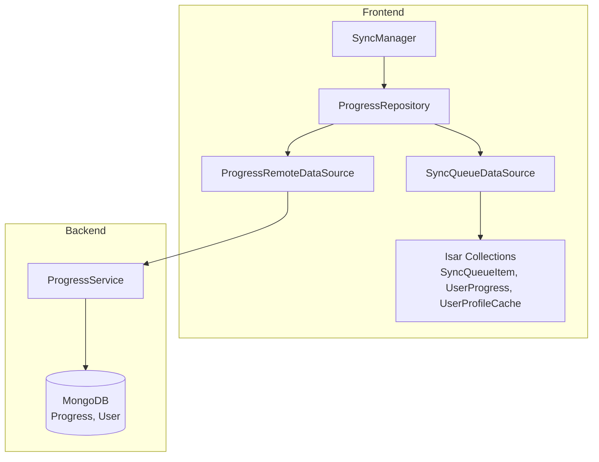
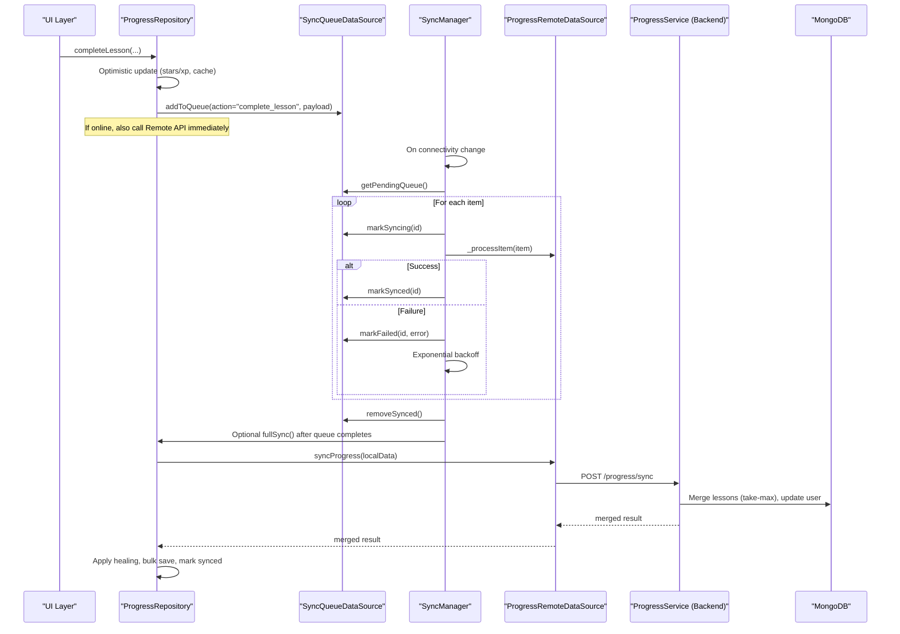
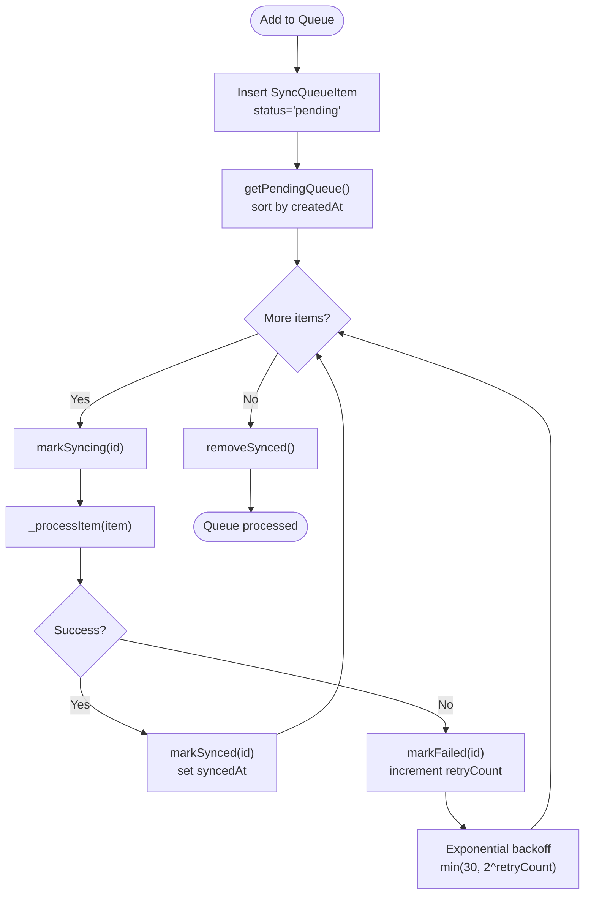
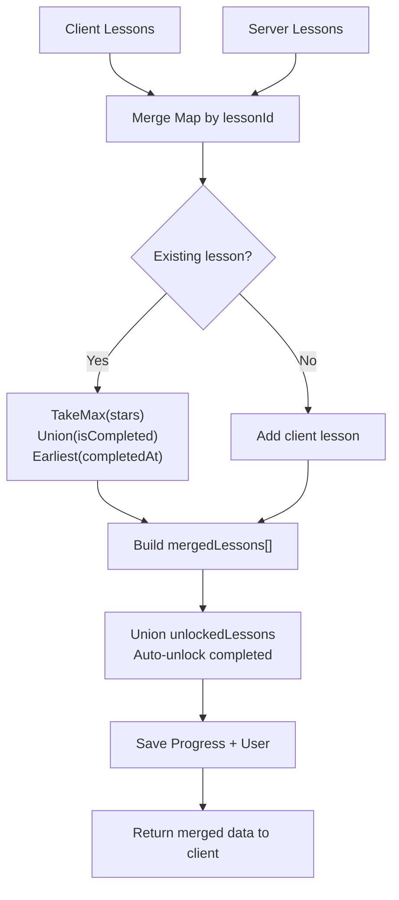
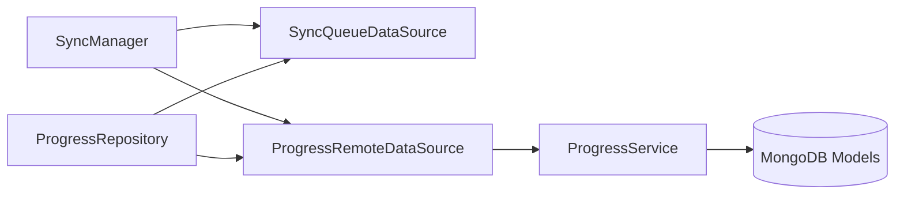

# Data Synchronization

<cite>
**Referenced Files in This Document**
- [isar_models.g.dart](file://lib/data/local/isar_models.g.dart)
- [isar_models.dart](file://lib/data/local/isar_models.dart)
- [sync_queue_datasource.dart](file://lib/data/local/sync_queue_datasource.dart)
- [progress_remote_datasource.dart](file://lib/data/remote/progress_remote_datasource.dart)
- [progress_repository.dart](file://lib/repositories/progress_repository.dart)
- [sync_manager.dart](file://lib/services/sync_manager.dart)
- [progressService.js](file://backend/src/services/progressService.js)
</cite>

## Table of Contents
1. [Introduction](#introduction)
2. [Project Structure](#project-structure)
3. [Core Components](#core-components)
4. [Architecture Overview](#architecture-overview)
5. [Detailed Component Analysis](#detailed-component-analysis)
6. [Dependency Analysis](#dependency-analysis)
7. [Performance Considerations](#performance-considerations)
8. [Troubleshooting Guide](#troubleshooting-guide)
9. [Conclusion](#conclusion)
10. [Appendices](#appendices)

## Introduction
This document explains the data synchronization system between the local device (Flutter app using Isar) and the remote MongoDB backend. It covers sync triggers, conflict resolution via a take-max strategy, data consistency mechanisms, the sync queue implementation, batch processing, error recovery, optimistic locking, and manual workflows. It also documents the integration between the frontend Sync Manager and backend APIs.

## Project Structure
The synchronization system spans three layers:
- Frontend (Flutter): Models, local persistence, sync queue, remote datasources, repository, and sync manager.
- Backend (Node.js/MongoDB): Progress service implementing bidirectional merge and gamification updates.
- Integration: HTTP endpoints for progress retrieval, merging, completion, and unlocking.

**Diagram sources**
- [sync_manager.dart:1-245](file://lib/services/sync_manager.dart#L1-L245)
- [progress_repository.dart:1-416](file://lib/repositories/progress_repository.dart#L1-L416)
- [sync_queue_datasource.dart:1-126](file://lib/data/local/sync_queue_datasource.dart#L1-L126)
- [progress_remote_datasource.dart:1-144](file://lib/data/remote/progress_remote_datasource.dart#L1-L144)
- [isar_models.dart:111-137](file://lib/data/local/isar_models.dart#L111-L137)
- [progressService.js:14-304](file://backend/src/services/progressService.js#L14-L304)

**Section sources**
- [sync_manager.dart:1-245](file://lib/services/sync_manager.dart#L1-L245)
- [progress_repository.dart:1-416](file://lib/repositories/progress_repository.dart#L1-L416)
- [sync_queue_datasource.dart:1-126](file://lib/data/local/sync_queue_datasource.dart#L1-L126)
- [progress_remote_datasource.dart:1-144](file://lib/data/remote/progress_remote_datasource.dart#L1-L144)
- [isar_models.dart:111-137](file://lib/data/local/isar_models.dart#L111-L137)
- [progressService.js:14-304](file://backend/src/services/progressService.js#L14-L304)

## Core Components
- SyncQueueItem: Local queue item persisted in Isar with fields for action, payload, status, retry count, timestamps, and optional error messages.
- SyncQueueDataSource: Manages queue CRUD, status transitions, retries, counts, and cleanup.
- ProgressRemoteDataSource: Calls backend endpoints for progress retrieval, bidirectional sync, lesson completion, and unlocking.
- ProgressRepository: Orchestrates offline-first flows, optimistic updates, lesson order healing, and full sync with the backend.
- SyncManager: Central engine that auto-triggers background sync on connectivity changes, processes the queue with exponential backoff, and exposes status streams.

Key implementation references:
- [SyncQueueItem schema and indexes:111-137](file://lib/data/local/isar_models.dart#L111-L137)
- [SyncQueueDataSource methods:12-125](file://lib/data/local/sync_queue_datasource.dart#L12-L125)
- [ProgressRemoteDataSource methods:11-143](file://lib/data/remote/progress_remote_datasource.dart#L11-L143)
- [ProgressRepository full sync and healing:261-346](file://lib/repositories/progress_repository.dart#L261-L346)
- [SyncManager queue processing and backoff:76-155](file://lib/services/sync_manager.dart#L76-L155)

**Section sources**
- [isar_models.dart:111-137](file://lib/data/local/isar_models.dart#L111-L137)
- [sync_queue_datasource.dart:12-125](file://lib/data/local/sync_queue_datasource.dart#L12-L125)
- [progress_remote_datasource.dart:11-143](file://lib/data/remote/progress_remote_datasource.dart#L11-L143)
- [progress_repository.dart:261-346](file://lib/repositories/progress_repository.dart#L261-L346)
- [sync_manager.dart:76-155](file://lib/services/sync_manager.dart#L76-L155)

## Architecture Overview
The system follows an offline-first, hybrid architecture:
- Local Isar stores SyncQueueItem entries and user progress caches.
- SyncManager monitors connectivity and processes the queue in FIFO order.
- ProgressRepository handles optimistic UI updates and merges server results into local state.
- Backend ProgressService performs bidirectional merge using a take-max strategy and updates user gamification metrics.

**Diagram sources**
- [sync_manager.dart:76-155](file://lib/services/sync_manager.dart#L76-L155)
- [sync_queue_datasource.dart:12-125](file://lib/data/local/sync_queue_datasource.dart#L12-L125)
- [progress_remote_datasource.dart:41-112](file://lib/data/remote/progress_remote_datasource.dart#L41-L112)
- [progress_repository.dart:261-346](file://lib/repositories/progress_repository.dart#L261-L346)
- [progressService.js:62-155](file://backend/src/services/progressService.js#L62-L155)

## Detailed Component Analysis

### Sync Queue Implementation
- Data model: SyncQueueItem persists actions, payloads, statuses, retry counts, timestamps, and errors.
- Indexes: Hash indexes on action and status enable efficient filtering and sorting.
- Operations:
  - Enqueue: addToQueue inserts pending items with JSON payload.
  - Dequeue: getPendingQueue retrieves pending items ordered by creation time.
  - Status transitions: markSyncing, markSynced, markFailed update state and metadata.
  - Retries: retryFailed resets failed items under retry limits; exponential backoff applied per item.
  - Cleanup: removeSynced deletes synced items; clearAll clears the entire queue.
  - Counting: getPendingCount sums pending and retryable failed items.

**Diagram sources**
- [sync_queue_datasource.dart:12-125](file://lib/data/local/sync_queue_datasource.dart#L12-L125)
- [sync_manager.dart:76-155](file://lib/services/sync_manager.dart#L76-L155)

**Section sources**
- [isar_models.g.dart:5108-5187](file://lib/data/local/isar_models.g.dart#L5108-L5187)
- [isar_models.g.dart:5222-5264](file://lib/data/local/isar_models.g.dart#L5222-L5264)
- [sync_queue_datasource.dart:12-125](file://lib/data/local/sync_queue_datasource.dart#L12-L125)
- [sync_manager.dart:76-155](file://lib/services/sync_manager.dart#L76-L155)

### Conflict Resolution and Data Consistency
- Take-max strategy: On lesson star counts, the maximum value is retained during merge.
- CompletedAt tie-breaker: Earliest completion timestamp is preserved.
- Unlocked lessons union: Union of server and client unlocked sets; auto-unlock on completion.
- Lesson order healing: Resolves missing or zero lessonOrder and lessonType using lesson metadata.
- Profile cache updates: After successful sync, profile fields are refreshed locally.

**Diagram sources**
- [progressService.js:62-155](file://backend/src/services/progressService.js#L62-L155)
- [progress_repository.dart:292-325](file://lib/repositories/progress_repository.dart#L292-L325)

**Section sources**
- [progressService.js:62-155](file://backend/src/services/progressService.js#L62-L155)
- [progress_repository.dart:292-325](file://lib/repositories/progress_repository.dart#L292-L325)

### Batch Processing Strategies
- FIFO queue processing: Items are processed in insertion order.
- Batch removal: removeSynced cleans up successfully synced items after each run.
- Full sync batching: ProgressRepository collects unsynced local progress and sends a single batch to the backend.

**Section sources**
- [sync_manager.dart:76-155](file://lib/services/sync_manager.dart#L76-L155)
- [progress_repository.dart:268-346](file://lib/repositories/progress_repository.dart#L268-L346)

### Error Recovery Procedures
- Exponential backoff: Retry delay capped at 30 seconds, computed as min(30, 2^retryCount).
- Retry window: retryFailed resets failed items with retryCount < 5.
- Cleanup: removeSynced prunes synced items; clearAll removes all queue items.
- Status reporting: SyncManager emits status changes (idle, syncing, synced, error, offline).

**Section sources**
- [sync_manager.dart:122-125](file://lib/services/sync_manager.dart#L122-L125)
- [sync_queue_datasource.dart:85-101](file://lib/data/local/sync_queue_datasource.dart#L85-L101)
- [sync_manager.dart:239-245](file://lib/services/sync_manager.dart#L239-L245)

### Optimistic Locking and Last-Win Policies
- Optimistic UI updates: Stars and XP are incremented immediately upon lesson completion; cache reflects completion instantly.
- Last-win on server: The backend’s take-max policy ensures the highest star count wins; earlier completion times are preserved.
- Auto-unlock: Completing a lesson automatically unlocks it on the server.

**Section sources**
- [progress_repository.dart:118-154](file://lib/repositories/progress_repository.dart#L118-L154)
- [progressService.js:196-220](file://backend/src/services/progressService.js#L196-L220)

### Manual Conflict Resolution Workflows
- Trigger manual sync: SyncManager.triggerSync or ProgressRepository.fullSync.
- Review queue: Inspect pending/failed items via SyncQueueDataSource and adjust retry counts or clear problematic items.
- Re-run sync: After corrections, call fullSync to reconcile with server.

**Section sources**
- [sync_manager.dart:212-219](file://lib/services/sync_manager.dart#L212-L219)
- [progress_repository.dart:261-346](file://lib/repositories/progress_repository.dart#L261-L346)

### Examples of Sync Operations
- Complete lesson:
  - Frontend: addToQueue with action "complete_lesson" and payload containing lessonId, stars, lessonType, lessonOrder.
  - Backend: ProgressService.completeLesson resolves missing metadata, applies take-max on stars, auto-unlocks, and updates user gamification.
- Full bidirectional sync:
  - Frontend: Collect unsynced local progress and send to ProgressRepository.syncProgress.
  - Backend: Merge lessons (take-max), union unlocked, update user totals, return merged result.

**Section sources**
- [sync_queue_datasource.dart:12-27](file://lib/data/local/sync_queue_datasource.dart#L12-L27)
- [progress_remote_datasource.dart:72-112](file://lib/data/remote/progress_remote_datasource.dart#L72-L112)
- [progressService.js:160-285](file://backend/src/services/progressService.js#L160-L285)
- [progress_repository.dart:282-346](file://lib/repositories/progress_repository.dart#L282-L346)

## Dependency Analysis
- SyncManager depends on SyncQueueDataSource and ProgressRemoteDataSource.
- ProgressRepository depends on ProgressLocalDataSource, ProgressRemoteDataSource, SyncQueueDataSource, and SyncManager.
- Backend ProgressService depends on Progress and User models and updates user gamification fields.

**Diagram sources**
- [sync_manager.dart:24-25](file://lib/services/sync_manager.dart#L24-L25)
- [progress_repository.dart:22-24](file://lib/repositories/progress_repository.dart#L22-L24)
- [progress_remote_datasource.dart:8](file://lib/data/remote/progress_remote_datasource.dart#L8)
- [progressService.js:10-12](file://backend/src/services/progressService.js#L10-L12)

**Section sources**
- [sync_manager.dart:24-25](file://lib/services/sync_manager.dart#L24-L25)
- [progress_repository.dart:22-24](file://lib/repositories/progress_repository.dart#L22-L24)
- [progress_remote_datasource.dart:8](file://lib/data/remote/progress_remote_datasource.dart#L8)
- [progressService.js:10-12](file://backend/src/services/progressService.js#L10-L12)

## Performance Considerations
- Queue indexing: Hash indexes on action and status improve filtering and sorting performance.
- Batch operations: Bulk saves and single batch sync reduce network overhead.
- Exponential backoff: Limits retry frequency and prevents thundering herd on transient failures.
- Healing pass: Lesson order healing avoids costly re-fetches by resolving missing metadata once per sync cycle.
- Optimistic updates: Reduce perceived latency by updating UI immediately while background sync reconciles.

[No sources needed since this section provides general guidance]

## Troubleshooting Guide
Common issues and remedies:
- Offline sync attempts: SyncManager checks connectivity and sets status to offline; ensure connectivity is restored to process queue.
- Persistent failures: Verify retryCount thresholds and use retryFailed to reset failed items; inspect errorMessage stored in SyncQueueItem.
- Stalled queue: Confirm removeSynced runs after processing; check for exceptions in _processItem and ensure proper status transitions.
- Mismatched lesson orders: Rely on lesson order healing during full sync; ensure lesson metadata is available.
- Profile not updating: After successful sync, SyncManager refreshes profile; confirm fetchProfile is called post-sync.

**Section sources**
- [sync_manager.dart:101-105](file://lib/services/sync_manager.dart#L101-L105)
- [sync_queue_datasource.dart:85-101](file://lib/data/local/sync_queue_datasource.dart#L85-L101)
- [progress_repository.dart:332-339](file://lib/repositories/progress_repository.dart#L332-L339)

## Conclusion
The system implements a robust offline-first synchronization strategy with a FIFO sync queue, exponential backoff, and a clear take-max conflict resolution policy. Frontend optimistic updates enhance responsiveness, while backend reconciliation ensures data consistency. The architecture supports manual triggers, healing passes, and resilient error recovery.

[No sources needed since this section summarizes without analyzing specific files]

## Appendices

### API Definitions
- GET /api/progress/get
  - Purpose: Retrieve user progress and profile snapshot.
  - Headers: Authorization: Bearer <token>.
  - Response: data object containing completedLessons, unlockedLessons, gameResults, achievements, lastSyncAt, and profile.
- POST /api/progress/sync
  - Purpose: Bidirectional sync with take-max merge.
  - Body: clientData with completedLessons, lastSyncAt.
  - Response: merged data including completedLessons, unlockedLessons, and profile.
- POST /api/progress/complete
  - Purpose: Record lesson completion and auto-unlock.
  - Body: lessonId, stars, lessonType, lessonOrder, optional xp.
  - Response: updated stars/xp gains and totals.
- POST /api/progress/unlock
  - Purpose: Unlock a lesson.
  - Body: lessonId.
  - Response: unlock confirmation.

**Section sources**
- [progress_remote_datasource.dart:11-143](file://lib/data/remote/progress_remote_datasource.dart#L11-L143)
- [progressService.js:35-57](file://backend/src/services/progressService.js#L35-L57)
- [progressService.js:62-155](file://backend/src/services/progressService.js#L62-L155)
- [progressService.js:160-285](file://backend/src/services/progressService.js#L160-L285)
- [progressService.js:290-300](file://backend/src/services/progressService.js#L290-L300)