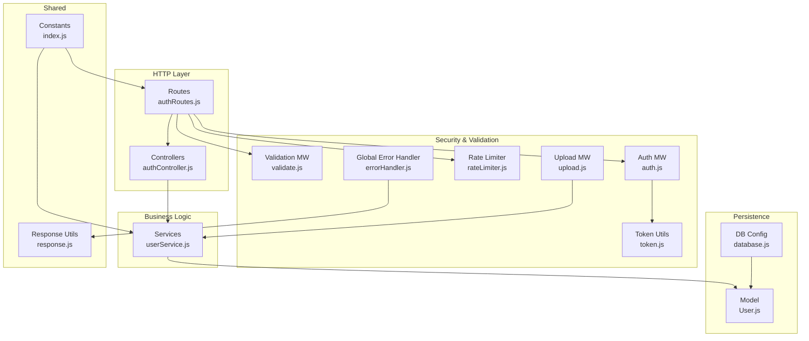
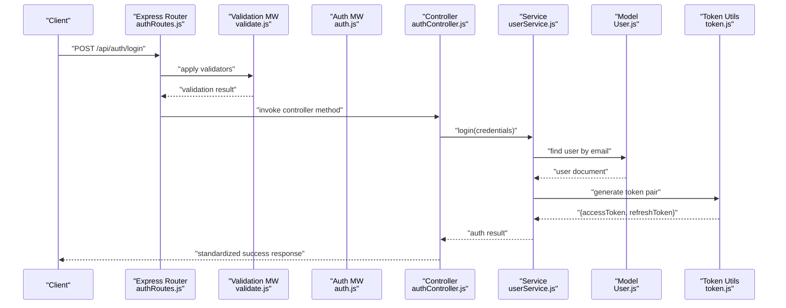
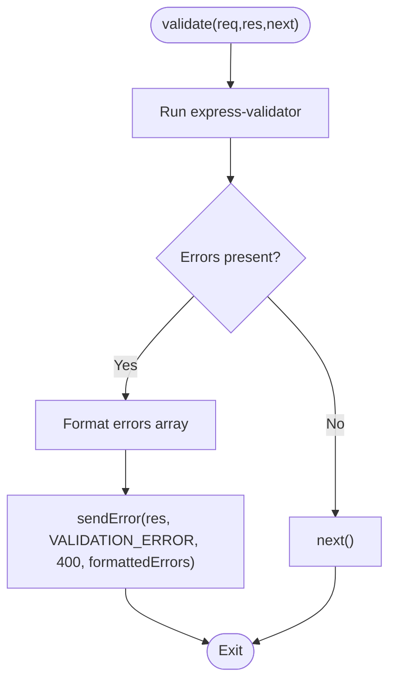
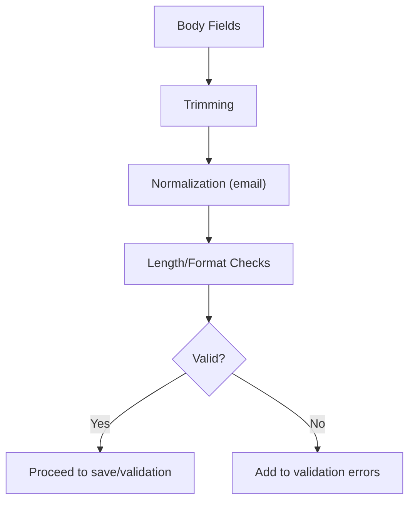
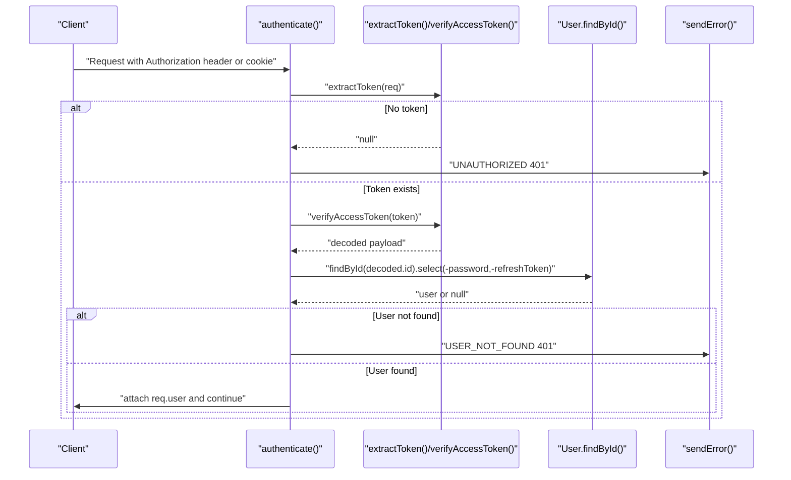
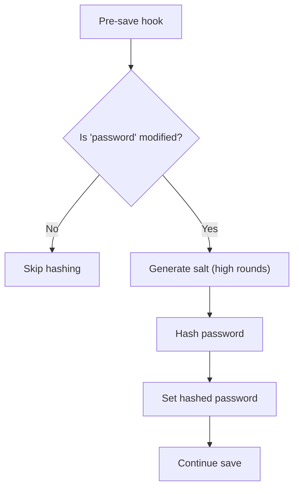
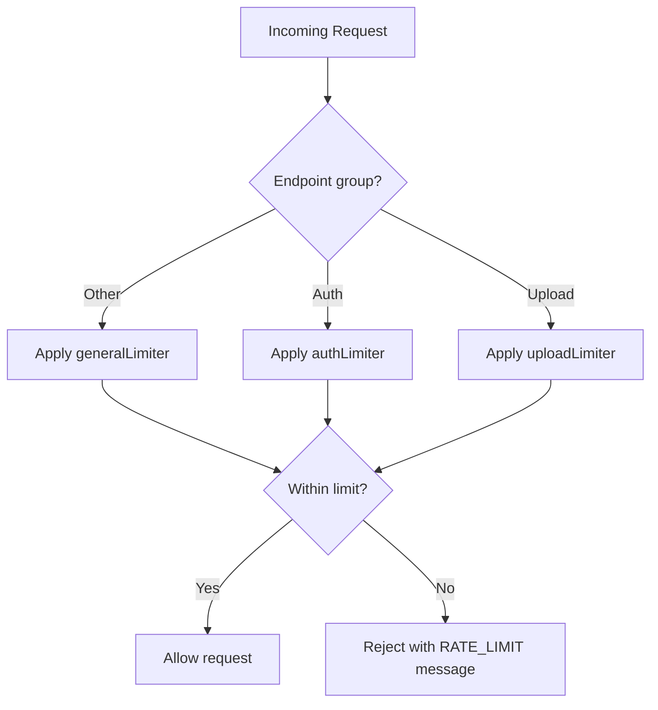
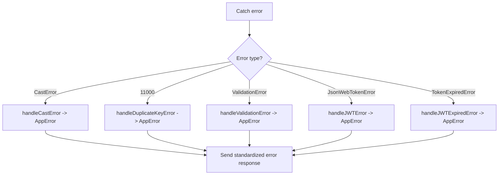
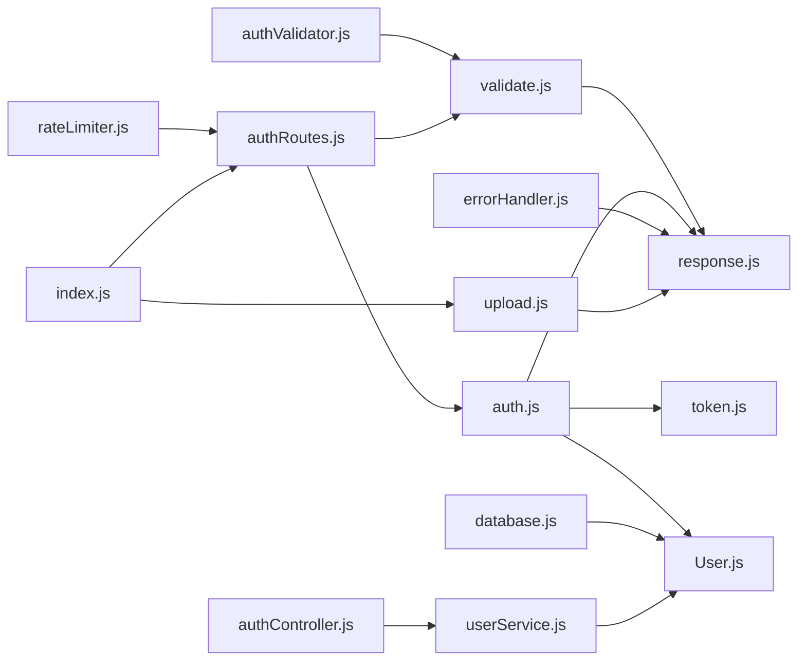

# Data Validation and Security

<cite>
**Referenced Files in This Document**
- [validate.js](file://backend/src/middlewares/validate.js)
- [authValidator.js](file://backend/src/validators/authValidator.js)
- [errorHandler.js](file://backend/src/middlewares/errorHandler.js)
- [auth.js](file://backend/src/middlewares/auth.js)
- [rateLimiter.js](file://backend/src/middlewares/rateLimiter.js)
- [token.js](file://backend/src/utils/token.js)
- [response.js](file://backend/src/utils/response.js)
- [database.js](file://backend/src/config/database.js)
- [upload.js](file://backend/src/middlewares/upload.js)
- [index.js](file://backend/src/constants/index.js)
- [User.js](file://backend/src/models/User.js)
- [authController.js](file://backend/src/controllers/authController.js)
- [authRoutes.js](file://backend/src/routes/authRoutes.js)
- [userService.js](file://backend/src/services/userService.js)
</cite>

## Table of Contents
1. [Introduction](#introduction)
2. [Project Structure](#project-structure)
3. [Core Components](#core-components)
4. [Architecture Overview](#architecture-overview)
5. [Detailed Component Analysis](#detailed-component-analysis)
6. [Dependency Analysis](#dependency-analysis)
7. [Performance Considerations](#performance-considerations)
8. [Troubleshooting Guide](#troubleshooting-guide)
9. [Conclusion](#conclusion)
10. [Appendices](#appendices)

## Introduction
This document provides comprehensive coverage of data validation and security measures implemented in the backend data management system. It explains input validation rules, sanitization processes, and security best practices. It also documents encryption strategies, access control mechanisms, audit logging, validation middleware, error handling patterns, and data integrity checks. Practical examples illustrate secure data access patterns, SQL injection prevention, and cross-site scripting (XSS) protection. Finally, it outlines compliance considerations and data privacy measures tailored for educational content.

## Project Structure
The backend follows a layered architecture:
- Routes define endpoints and apply middleware.
- Controllers orchestrate request handling and delegate to services.
- Services encapsulate business logic and coordinate with models.
- Models define schemas and enforce data integrity.
- Middlewares implement validation, authentication, rate limiting, and error handling.
- Utilities provide shared helpers for tokens, responses, and uploads.
- Constants centralize configuration and messages.

**Diagram sources**
- [authRoutes.js:1-38](file://backend/src/routes/authRoutes.js#L1-L38)
- [authController.js:1-94](file://backend/src/controllers/authController.js#L1-L94)
- [validate.js:1-34](file://backend/src/middlewares/validate.js#L1-L34)
- [auth.js:1-78](file://backend/src/middlewares/auth.js#L1-L78)
- [rateLimiter.js:1-65](file://backend/src/middlewares/rateLimiter.js#L1-L65)
- [errorHandler.js:1-98](file://backend/src/middlewares/errorHandler.js#L1-L98)
- [token.js:1-98](file://backend/src/utils/token.js#L1-L98)
- [upload.js:1-119](file://backend/src/middlewares/upload.js#L1-L119)
- [User.js:1-243](file://backend/src/models/User.js#L1-L243)
- [database.js:1-66](file://backend/src/config/database.js#L1-L66)
- [response.js:1-82](file://backend/src/utils/response.js#L1-L82)
- [index.js:1-242](file://backend/src/constants/index.js#L1-L242)

**Section sources**
- [authRoutes.js:1-38](file://backend/src/routes/authRoutes.js#L1-L38)
- [authController.js:1-94](file://backend/src/controllers/authController.js#L1-L94)
- [validate.js:1-34](file://backend/src/middlewares/validate.js#L1-L34)
- [auth.js:1-78](file://backend/src/middlewares/auth.js#L1-L78)
- [rateLimiter.js:1-65](file://backend/src/middlewares/rateLimiter.js#L1-L65)
- [errorHandler.js:1-98](file://backend/src/middlewares/errorHandler.js#L1-L98)
- [token.js:1-98](file://backend/src/utils/token.js#L1-L98)
- [upload.js:1-119](file://backend/src/middlewares/upload.js#L1-L119)
- [User.js:1-243](file://backend/src/models/User.js#L1-L243)
- [database.js:1-66](file://backend/src/config/database.js#L1-L66)
- [response.js:1-82](file://backend/src/utils/response.js#L1-L82)
- [index.js:1-242](file://backend/src/constants/index.js#L1-L242)

## Core Components
- Validation middleware: Centralized express-validator integration that formats validation errors and short-circuits requests on failure.
- Input validators: Route-specific validation chains for registration, login, and refresh token requests.
- Authentication middleware: JWT extraction, verification, and user attachment to requests.
- Token utilities: Access and refresh token generation, verification, and extraction from headers or cookies.
- Rate limiter: Endpoint-grouped rate limiting with configurable windows and caps.
- Error handling: Centralized error classification and standardized response formatting.
- Upload middleware: Multer-backed Cloudinary integration with strict file filters and size limits.
- Database configuration: Robust connection with retry logic and graceful shutdown hooks.
- User model: Schema-level validation, password hashing, and safe serialization.
- Response utilities: Standardized success, error, created, and paginated responses.

**Section sources**
- [validate.js:17-31](file://backend/src/middlewares/validate.js#L17-L31)
- [authValidator.js:9-37](file://backend/src/validators/authValidator.js#L9-L37)
- [auth.js:18-50](file://backend/src/middlewares/auth.js#L18-L50)
- [token.js:17-88](file://backend/src/utils/token.js#L17-L88)
- [rateLimiter.js:19-58](file://backend/src/middlewares/rateLimiter.js#L19-L58)
- [errorHandler.js:61-92](file://backend/src/middlewares/errorHandler.js#L61-L92)
- [upload.js:69-112](file://backend/src/middlewares/upload.js#L69-L112)
- [database.js:16-40](file://backend/src/config/database.js#L16-L40)
- [User.js:14-207](file://backend/src/models/User.js#L14-L207)
- [response.js:17-74](file://backend/src/utils/response.js#L17-L74)

## Architecture Overview
The system enforces validation and security at the HTTP boundary and within the service layer. Requests flow through route handlers that apply validation, authentication, and rate limiting before invoking controllers and services. Persistence relies on Mongoose with schema-level constraints and pre-save hooks for encryption and normalization. Responses are standardized, and errors are handled centrally.

**Diagram sources**
- [authRoutes.js:24-35](file://backend/src/routes/authRoutes.js#L24-L35)
- [validate.js:17-31](file://backend/src/middlewares/validate.js#L17-L31)
- [auth.js:18-50](file://backend/src/middlewares/auth.js#L18-L50)
- [authController.js:24-32](file://backend/src/controllers/authController.js#L24-L32)
- [userService.js:15-221](file://backend/src/services/userService.js#L15-L221)
- [User.js:14-207](file://backend/src/models/User.js#L14-L207)
- [token.js:39-50](file://backend/src/utils/token.js#L39-L50)

## Detailed Component Analysis

### Validation Middleware
- Purpose: Aggregate express-validator results and return a unified error response.
- Behavior: On validation failure, constructs an array of { field, message, value } and responds with a 400 status.
- Integration: Applied to routes via a reusable middleware function.

**Diagram sources**
- [validate.js:17-31](file://backend/src/middlewares/validate.js#L17-L31)
- [response.js:47-58](file://backend/src/utils/response.js#L47-L58)

**Section sources**
- [validate.js:17-31](file://backend/src/middlewares/validate.js#L17-L31)
- [response.js:47-58](file://backend/src/utils/response.js#L47-L58)

### Input Validation Rules and Sanitization
- Registration: Name trimming and length bounds, email trimming, normalization, and password minimum length.
- Login: Email trimming, normalization, and password presence.
- Refresh token: Presence requirement for refresh token.
- Sanitization: Trimming, normalization, and enforced lowercasing at schema level.

**Diagram sources**
- [authValidator.js:9-37](file://backend/src/validators/authValidator.js#L9-L37)
- [User.js:19-36](file://backend/src/models/User.js#L19-L36)

**Section sources**
- [authValidator.js:9-37](file://backend/src/validators/authValidator.js#L9-L37)
- [User.js:19-36](file://backend/src/models/User.js#L19-L36)

### Authentication and Access Control
- JWT extraction: Supports Authorization header ("Bearer") and cookies.
- Verification: Uses configured secrets and validates expiry.
- User attachment: Populates req.user with selected fields excluding sensitive ones.
- Optional authentication: Allows anonymous access while still attaching user if token is valid.

**Diagram sources**
- [auth.js:18-50](file://backend/src/middlewares/auth.js#L18-L50)
- [token.js:75-88](file://backend/src/utils/token.js#L75-L88)
- [User.js:31-36](file://backend/src/models/User.js#L31-L36)
- [response.js:47-58](file://backend/src/utils/response.js#L47-L58)

**Section sources**
- [auth.js:18-50](file://backend/src/middlewares/auth.js#L18-L50)
- [token.js:75-88](file://backend/src/utils/token.js#L75-L88)
- [User.js:31-36](file://backend/src/models/User.js#L31-L36)
- [response.js:47-58](file://backend/src/utils/response.js#L47-L58)

### Encryption Strategies
- Password hashing: Pre-save hook hashes passwords using bcrypt with a high salt round count.
- Token secrets: Separate secrets for access and refresh tokens with expirations configured via environment variables.
- Safe serialization: toJSON excludes sensitive fields from API responses.

**Diagram sources**
- [User.js:197-207](file://backend/src/models/User.js#L197-L207)
- [token.js:17-32](file://backend/src/utils/token.js#L17-L32)
- [User.js:223-231](file://backend/src/models/User.js#L223-L231)

**Section sources**
- [User.js:197-207](file://backend/src/models/User.js#L197-L207)
- [token.js:17-32](file://backend/src/utils/token.js#L17-L32)
- [User.js:223-231](file://backend/src/models/User.js#L223-L231)

### Rate Limiting
- General API limiter: Configurable window and max requests with relaxed dev limits.
- Auth limiter: Stricter limits for authentication endpoints.
- Upload limiter: Dedicated limits for media uploads.
- Headers: Standard headers enabled for client awareness.

**Diagram sources**
- [rateLimiter.js:19-58](file://backend/src/middlewares/rateLimiter.js#L19-L58)
- [index.js:167-207](file://backend/src/constants/index.js#L167-L207)

**Section sources**
- [rateLimiter.js:19-58](file://backend/src/middlewares/rateLimiter.js#L19-L58)
- [index.js:167-207](file://backend/src/constants/index.js#L167-L207)

### Error Handling Patterns
- Centralized handler: Classifies CastError, duplicate key, Mongoose validation, JWT errors, and others.
- Standardized response: Includes success flag, message, and optionally stack/developer details in non-production environments.
- Operational errors: AppError instances carry status codes and operational flags.

**Diagram sources**
- [errorHandler.js:61-92](file://backend/src/middlewares/errorHandler.js#L61-L92)
- [response.js:47-58](file://backend/src/utils/response.js#L47-L58)

**Section sources**
- [errorHandler.js:61-92](file://backend/src/middlewares/errorHandler.js#L61-L92)
- [response.js:47-58](file://backend/src/utils/response.js#L47-L58)

### Secure Data Access Patterns
- Enforce authentication on protected endpoints.
- Use whitelisted fields for updates to prevent unauthorized mutations.
- Apply rate limiting to high-risk endpoints (auth, uploads).
- Normalize and sanitize inputs at the validator and schema levels.
- Avoid exposing sensitive fields in API responses via model serialization.

**Section sources**
- [authRoutes.js:34-35](file://backend/src/routes/authRoutes.js#L34-L35)
- [userService.js:62-82](file://backend/src/services/userService.js#L62-L82)
- [rateLimiter.js:19-58](file://backend/src/middlewares/rateLimiter.js#L19-L58)
- [authValidator.js:9-37](file://backend/src/validators/authValidator.js#L9-L37)
- [User.js:223-231](file://backend/src/models/User.js#L223-L231)

### SQL Injection Prevention
- The system uses MongoDB/Mongoose, which does not employ SQL. Data access is performed via ODM methods and aggregation pipelines, eliminating SQL injection risks.
- Schema-level validation and controlled field updates further mitigate injection vectors.

**Section sources**
- [User.js:14-207](file://backend/src/models/User.js#L14-L207)
- [userService.js:62-82](file://backend/src/services/userService.js#L62-L82)

### XSS Protection
- Frontend rendering is outside the scope of this backend codebase. Backend responses exclude executable content and rely on standard JSON payloads. Client-side sanitization and CSP policies should be implemented in the frontend to prevent XSS.

[No sources needed since this section provides general guidance]

### Audit Logging
- The codebase does not implement explicit audit logs. To meet compliance needs, consider adding structured logging for authentication events, sensitive operations, and administrative actions with correlation IDs and timestamps.

[No sources needed since this section provides general guidance]

### Compliance and Data Privacy Measures for Educational Content
- Data minimization: Only collect necessary fields (name, email, password for local auth).
- Consent and transparency: Provide clear privacy notices and terms for educational contexts.
- Data subject rights: Implement mechanisms for data access, rectification, and erasure aligned with applicable regulations.
- Secure defaults: Enforce HTTPS, strong secrets, and least privilege access.
- Child safety: Implement age-appropriate safeguards, parental consent flows, and content filtering where applicable.

[No sources needed since this section provides general guidance]

## Dependency Analysis
The following diagram highlights key dependencies among validation, security, and persistence components.

**Diagram sources**
- [validate.js:10-12](file://backend/src/middlewares/validate.js#L10-L12)
- [authValidator.js:7](file://backend/src/validators/authValidator.js#L7)
- [authRoutes.js:16-19](file://backend/src/routes/authRoutes.js#L16-L19)
- [auth.js:10-13](file://backend/src/middlewares/auth.js#L10-L13)
- [token.js:10](file://backend/src/utils/token.js#L10)
- [rateLimiter.js:10](file://backend/src/middlewares/rateLimiter.js#L10)
- [errorHandler.js:10-22](file://backend/src/middlewares/errorHandler.js#L10-L22)
- [upload.js:10-14](file://backend/src/middlewares/upload.js#L10-L14)
- [database.js:10](file://backend/src/config/database.js#L10)
- [index.js:155-162](file://backend/src/constants/index.js#L155-L162)
- [authController.js:7-11](file://backend/src/controllers/authController.js#L7-L11)
- [userService.js:10-13](file://backend/src/services/userService.js#L10-L13)

**Section sources**
- [validate.js:10-12](file://backend/src/middlewares/validate.js#L10-L12)
- [authValidator.js:7](file://backend/src/validators/authValidator.js#L7)
- [authRoutes.js:16-19](file://backend/src/routes/authRoutes.js#L16-L19)
- [auth.js:10-13](file://backend/src/middlewares/auth.js#L10-L13)
- [token.js:10](file://backend/src/utils/token.js#L10)
- [rateLimiter.js:10](file://backend/src/middlewares/rateLimiter.js#L10)
- [errorHandler.js:10-22](file://backend/src/middlewares/errorHandler.js#L10-L22)
- [upload.js:10-14](file://backend/src/middlewares/upload.js#L10-L14)
- [database.js:10](file://backend/src/config/database.js#L10)
- [index.js:155-162](file://backend/src/constants/index.js#L155-L162)
- [authController.js:7-11](file://backend/src/controllers/authController.js#L7-L11)
- [userService.js:10-13](file://backend/src/services/userService.js#L10-L13)

## Performance Considerations
- Validation overhead: Keep validation chains minimal and reuse common validators.
- Authentication caching: Consider token caching for frequent reads if latency becomes a concern.
- Rate limiter tuning: Adjust window and max values based on traffic patterns and abuse signals.
- Upload throughput: Monitor Cloudinary performance and adjust allowed formats/sizes accordingly.
- Database indexing: Ensure appropriate indexes for frequently queried fields (e.g., email, XP, rank).

[No sources needed since this section provides general guidance]

## Troubleshooting Guide
- Validation failures: Inspect formatted error arrays returned by the validation middleware for field-level diagnostics.
- Authentication errors: Verify token presence, format, and expiration; confirm user existence and correct secret configuration.
- Duplicate key errors: Review unique constraints and normalize inputs to avoid collisions.
- JWT errors: Confirm secret rotation procedures and client token refresh flows.
- Upload issues: Validate file types, sizes, and Cloudinary credentials; check error codes from Multer.

**Section sources**
- [validate.js:17-31](file://backend/src/middlewares/validate.js#L17-L31)
- [auth.js:41-50](file://backend/src/middlewares/auth.js#L41-L50)
- [errorHandler.js:27-56](file://backend/src/middlewares/errorHandler.js#L27-L56)
- [upload.js:97-112](file://backend/src/middlewares/upload.js#L97-L112)

## Conclusion
The backend implements robust validation and security controls through dedicated middleware, schema-level constraints, and standardized error handling. Authentication leverages JWT with secure extraction and verification, while rate limiting protects high-risk endpoints. Uploads are constrained by strict filters and size limits. The system’s modular design facilitates maintainability and extensibility. For production deployments, complement these controls with comprehensive audit logging, privacy-focused data handling, and continuous security monitoring.

## Appendices
- Example secure patterns:
  - Always apply validation middleware before controllers.
  - Enforce authentication on protected routes and use optionalAuth where appropriate.
  - Limit upload file types and sizes; handle Multer errors gracefully.
  - Use schema-level validation and pre-save hooks for encryption and normalization.
  - Standardize responses and errors for predictable client handling.

[No sources needed since this section provides general guidance]