# Local Database Design (Isar)

<cite>
**Referenced Files in This Document**
- [local_database.dart](file://lib/data/local/local_database.dart)
- [isar_models.dart](file://lib/data/local/isar_models.dart)
- [isar_models.g.dart](file://lib/data/local/isar_models.g.dart)
- [lesson_local_datasource.dart](file://lib/data/local/lesson_local_datasource.dart)
- [progress_local_datasource.dart](file://lib/data/local/progress_local_datasource.dart)
- [sync_queue_datasource.dart](file://lib/data/local/sync_queue_datasource.dart)
- [main.dart](file://lib/main.dart)
- [GamePlaySession.js](file://backend/src/models/GamePlaySession.js)
</cite>

## Table of Contents
1. [Introduction](#introduction)
2. [Project Structure](#project-structure)
3. [Core Components](#core-components)
4. [Architecture Overview](#architecture-overview)
5. [Detailed Component Analysis](#detailed-component-analysis)
6. [Dependency Analysis](#dependency-analysis)
7. [Performance Considerations](#performance-considerations)
8. [Troubleshooting Guide](#troubleshooting-guide)
9. [Conclusion](#conclusion)

## Introduction
This document describes the Isar database implementation used for local data storage in the application. It covers database configuration, collection schemas, data models, indexing strategies, query optimization, migration procedures, data access patterns, transaction handling, and performance considerations. It also explains how local models relate to their remote counterparts.

## Project Structure
The local database layer is organized around a singleton database manager, typed Isar collections, and specialized data sources for each domain. Initialization occurs during app startup, and migrations handle legacy SharedPreferences data.

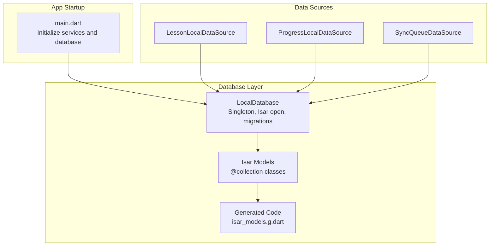

**Diagram sources**
- [main.dart:21-34](file://lib/main.dart#L21-L34)
- [local_database.dart:34-61](file://lib/data/local/local_database.dart#L34-L61)
- [isar_models.dart:8-265](file://lib/data/local/isar_models.dart#L8-L265)
- [isar_models.g.dart:16-145](file://lib/data/local/isar_models.g.dart#L16-L145)

**Section sources**
- [main.dart:21-34](file://lib/main.dart#L21-L34)
- [local_database.dart:34-61](file://lib/data/local/local_database.dart#L34-L61)

## Core Components
- LocalDatabase: Singleton managing Isar initialization, schema registration, and one-time migration from SharedPreferences.
- Isar Models: Typed Dart classes annotated with @collection and @Index, representing local collections.
- Generated Code: Build-time generated extensions and indexes enabling efficient queries.
- Data Sources: Specialized repositories for lessons, progress, and sync queue operations.

Key responsibilities:
- Database lifecycle management and migration
- Strongly-typed local caching and offline-first operations
- Efficient querying via generated indexes
- Transaction-safe writes and bulk operations

**Section sources**
- [local_database.dart:10-61](file://lib/data/local/local_database.dart#L10-L61)
- [isar_models.dart:8-265](file://lib/data/local/isar_models.dart#L8-L265)
- [isar_models.g.dart:16-145](file://lib/data/local/isar_models.g.dart#L16-L145)

## Architecture Overview
The local database architecture follows an offline-first design:
- App startup initializes LocalDatabase and registers all Isar schemas.
- Data sources encapsulate CRUD and query logic per domain.
- Transactions wrap write operations to maintain consistency.
- Generated indexes accelerate lookups by frequently queried fields.

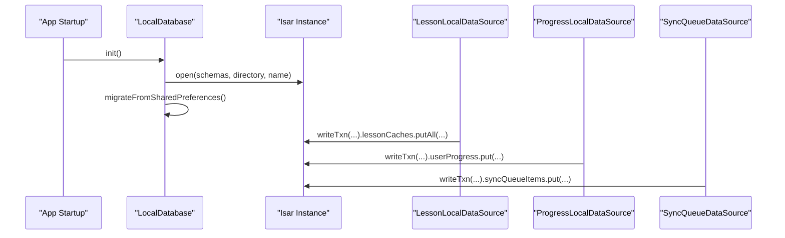

**Diagram sources**
- [main.dart:21-34](file://lib/main.dart#L21-L34)
- [local_database.dart:34-61](file://lib/data/local/local_database.dart#L34-L61)
- [lesson_local_datasource.dart:48-56](file://lib/data/local/lesson_local_datasource.dart#L48-L56)
- [progress_local_datasource.dart:23-60](file://lib/data/local/progress_local_datasource.dart#L23-L60)
- [sync_queue_datasource.dart:17-27](file://lib/data/local/sync_queue_datasource.dart#L17-L27)

## Detailed Component Analysis

### Database Configuration and Lifecycle
- Singleton pattern ensures a single Isar instance is used across the app.
- Isar.open registers six schemas: LessonCache, UserProgress, SyncQueueItem, GameResultCache, AchievementCache, UserProfileCache.
- Database name and directory are set at initialization.
- One-time migration reads legacy SharedPreferences keys and writes to Isar collections.

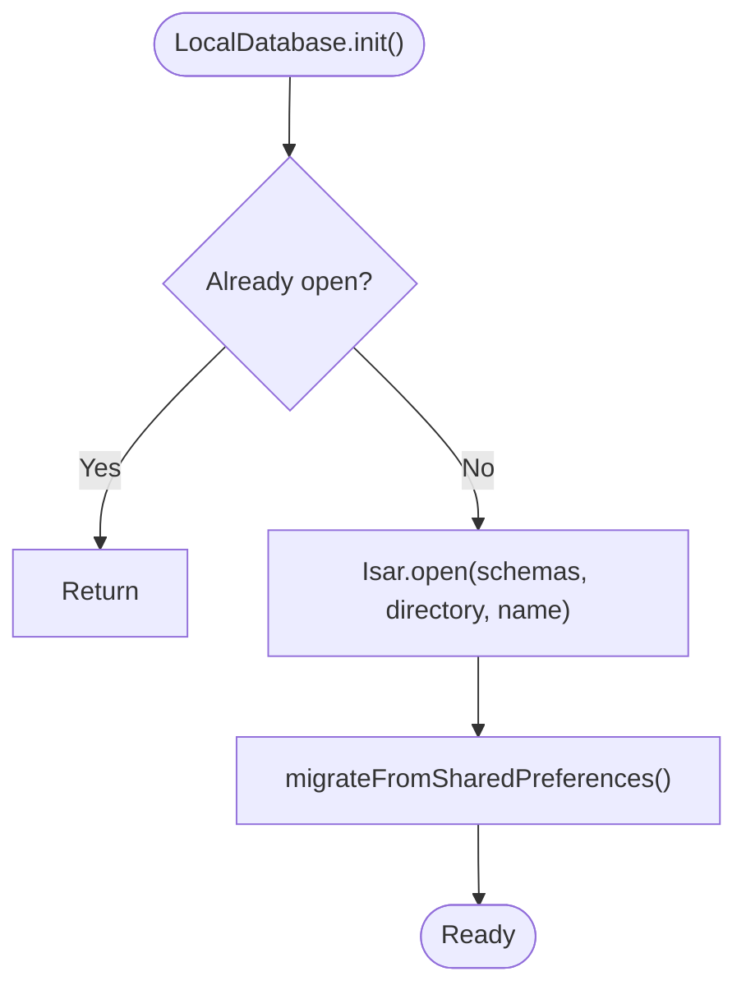

**Diagram sources**
- [local_database.dart:34-61](file://lib/data/local/local_database.dart#L34-L61)
- [local_database.dart:64-108](file://lib/data/local/local_database.dart#L64-L108)

**Section sources**
- [local_database.dart:34-61](file://lib/data/local/local_database.dart#L34-L61)
- [local_database.dart:64-108](file://lib/data/local/local_database.dart#L64-L108)

### Data Models and Indexing Strategies

#### LessonCache
Purpose: Cache lessons fetched from the server for offline access.
Key fields: lessonId (unique index), type (index), title, khmerText, metadata, media URLs, extraDataJson, category, isActive, cachedAt.
Indexes: lessonId (unique), type.

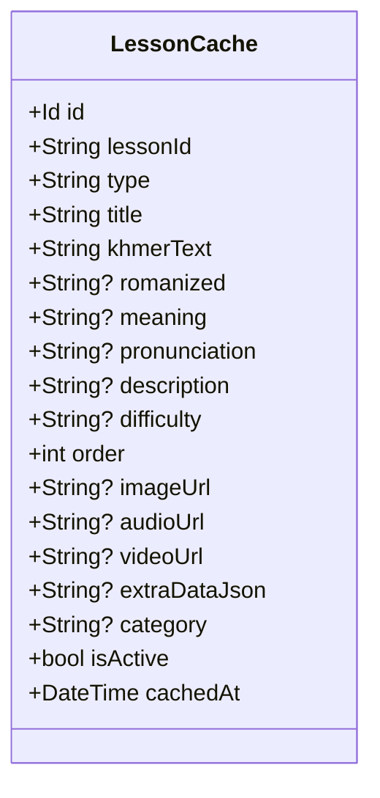

**Diagram sources**
- [isar_models.dart:8-64](file://lib/data/local/isar_models.dart#L8-L64)
- [isar_models.g.dart:16-145](file://lib/data/local/isar_models.g.dart#L16-L145)

**Section sources**
- [isar_models.dart:8-64](file://lib/data/local/isar_models.dart#L8-L64)
- [isar_models.g.dart:16-145](file://lib/data/local/isar_models.g.dart#L16-L145)

#### UserProgress
Purpose: Track user’s progress per lesson, including stars, completion, unlocking, and sync status.
Key fields: userId (index), lessonId (index), lessonType (index), lessonOrder, stars, isCompleted (index), isUnlocked, completedAt, isSynced, updatedAt.
Indexes: userId, lessonId, lessonType, isCompleted.

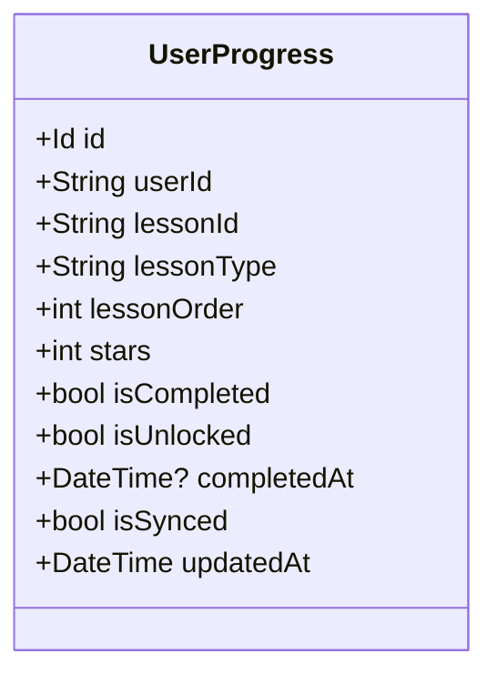

**Diagram sources**
- [isar_models.dart:69-106](file://lib/data/local/isar_models.dart#L69-L106)
- [isar_models.g.dart:3528-3572](file://lib/data/local/isar_models.g.dart#L3528-L3572)

**Section sources**
- [isar_models.dart:69-106](file://lib/data/local/isar_models.dart#L69-L106)
- [isar_models.g.dart:3528-3572](file://lib/data/local/isar_models.g.dart#L3528-L3572)

#### SyncQueueItem
Purpose: Queue offline actions to sync later when connectivity is restored.
Key fields: action (index), payloadJson, status (index), retryCount, createdAt, syncedAt, errorMessage.
Indexes: action, status.

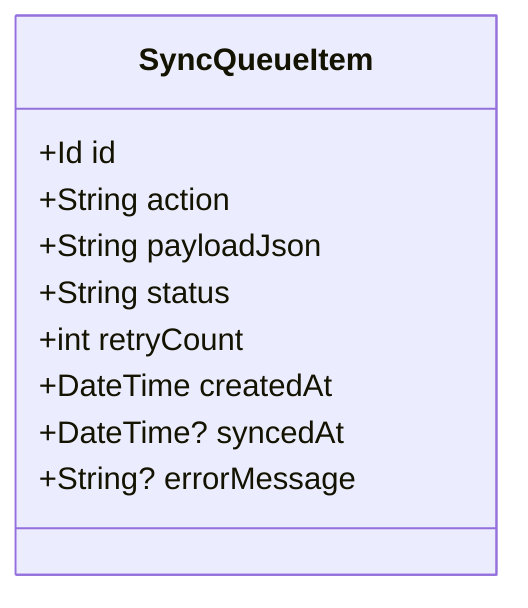

**Diagram sources**
- [isar_models.dart:111-137](file://lib/data/local/isar_models.dart#L111-L137)
- [isar_models.g.dart:5108-5187](file://lib/data/local/isar_models.g.dart#L5108-L5187)

**Section sources**
- [isar_models.dart:111-137](file://lib/data/local/isar_models.dart#L111-L137)
- [isar_models.g.dart:5108-5187](file://lib/data/local/isar_models.g.dart#L5108-L5187)

#### GameResultCache
Purpose: Persist game results for offline scenarios.
Key fields: userId (index), gameType, score, timeSeconds, correctAnswers, totalQuestions, isSynced, playedAt.

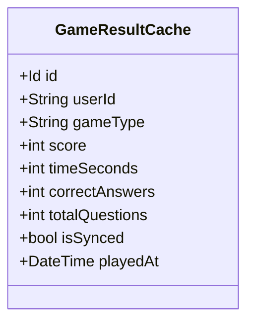

**Diagram sources**
- [isar_models.dart:142-170](file://lib/data/local/isar_models.dart#L142-L170)
- [isar_models.g.dart:6780-6851](file://lib/data/local/isar_models.g.dart#L6780-L6851)

**Section sources**
- [isar_models.dart:142-170](file://lib/data/local/isar_models.dart#L142-L170)
- [isar_models.g.dart:6780-6851](file://lib/data/local/isar_models.g.dart#L6780-L6851)

#### AchievementCache
Purpose: Cache unlocked achievements per user.
Key fields: userId (index), achievementId (unique composite with userId), name, description, isSynced, unlockedAt.
Indexes: userId, (achievementId, userId) composite.

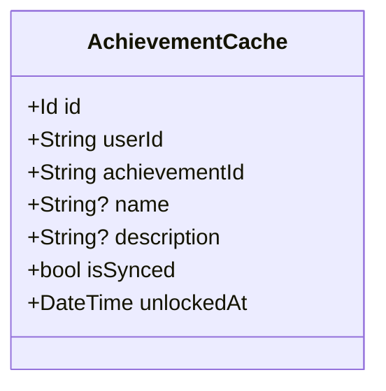

**Diagram sources**
- [isar_models.dart:175-198](file://lib/data/local/isar_models.dart#L175-L198)
- [isar_models.g.dart:8013-8104](file://lib/data/local/isar_models.g.dart#L8013-L8104)

**Section sources**
- [isar_models.dart:175-198](file://lib/data/local/isar_models.dart#L175-L198)
- [isar_models.g.dart:8013-8104](file://lib/data/local/isar_models.g.dart#L8013-L8104)

#### UserProfileCache
Purpose: Cache user profile data for offline use.
Key fields: userId (unique), name, email, avatar, XP/stars/streak/levels, timestamps, JSON lists for completed/unlocked lessons.

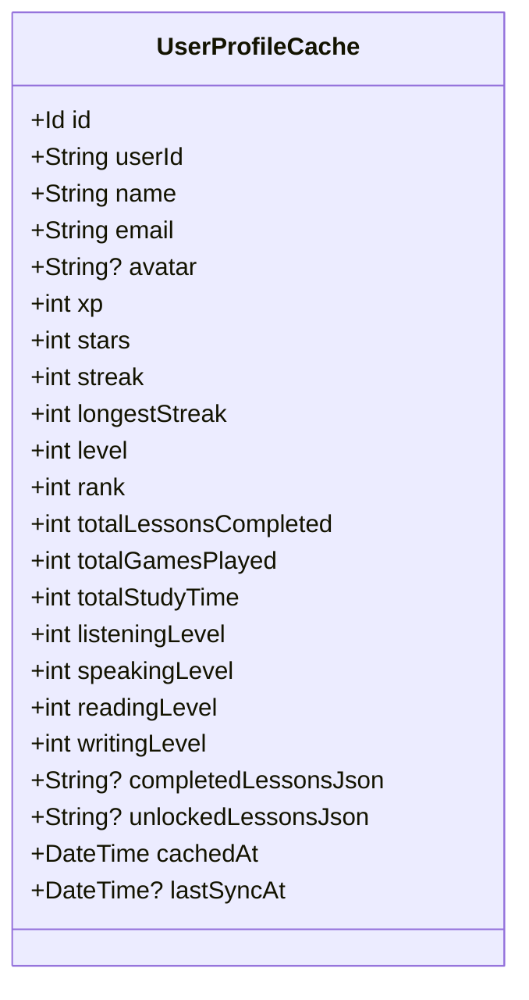

**Diagram sources**
- [isar_models.dart:203-264](file://lib/data/local/isar_models.dart#L203-L264)
- [isar_models.g.dart:8271-8799](file://lib/data/local/isar_models.g.dart#L8271-L8799)

**Section sources**
- [isar_models.dart:203-264](file://lib/data/local/isar_models.dart#L203-L264)
- [isar_models.g.dart:8271-8799](file://lib/data/local/isar_models.g.dart#L8271-L8799)

### Data Access Patterns and Queries

#### LessonLocalDataSource
- Cache lessons: deletes previous cache for the type, inserts new batch.
- Retrieve lessons: filter by type, sort by order, reconstruct extra data from JSON.
- Single lookup by lessonId with index.
- Clear cache by type or entirely.

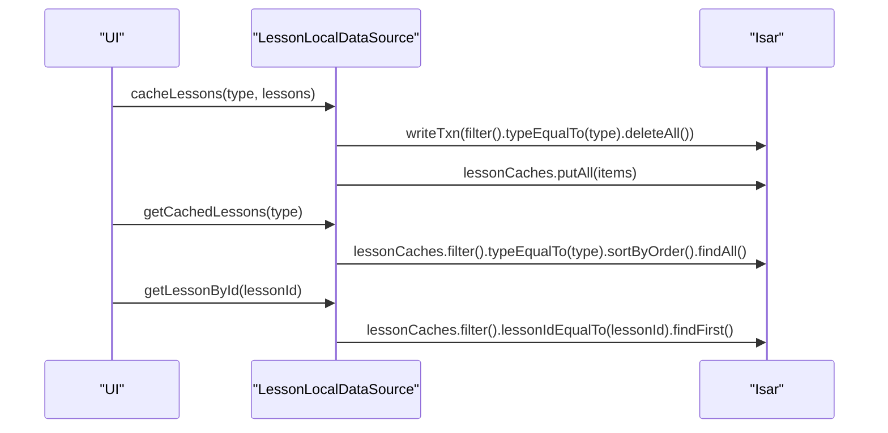

**Diagram sources**
- [lesson_local_datasource.dart:12-96](file://lib/data/local/lesson_local_datasource.dart#L12-L96)
- [lesson_local_datasource.dart:98-134](file://lib/data/local/lesson_local_datasource.dart#L98-L134)

**Section sources**
- [lesson_local_datasource.dart:12-96](file://lib/data/local/lesson_local_datasource.dart#L12-L96)
- [lesson_local_datasource.dart:98-134](file://lib/data/local/lesson_local_datasource.dart#L98-L134)

#### ProgressLocalDataSource
- Save progress: upsert with take-max strategy for stars, merge flags, and timestamps.
- Bulk save: reconcile legacy vs server IDs, delete stale synced records, merge updates.
- Reads: by user, by lesson, by type, counts, maps, and completion/unlock checks.
- Sync helpers: fetch unsynced, mark synced.
- Profile cache: save and load user profile snapshots.

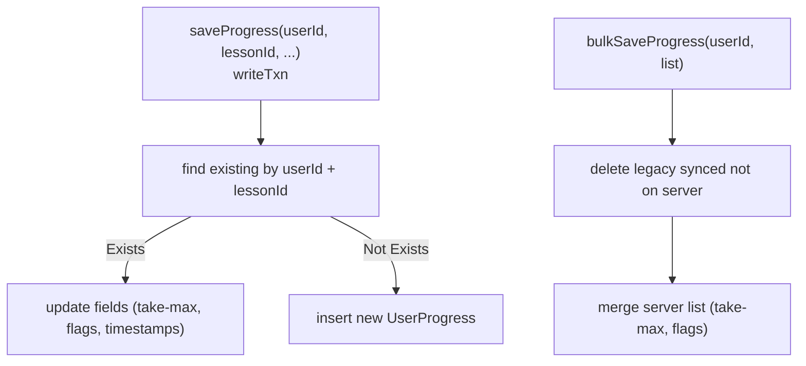

**Diagram sources**
- [progress_local_datasource.dart:14-60](file://lib/data/local/progress_local_datasource.dart#L14-L60)
- [progress_local_datasource.dart:63-138](file://lib/data/local/progress_local_datasource.dart#L63-L138)

**Section sources**
- [progress_local_datasource.dart:14-60](file://lib/data/local/progress_local_datasource.dart#L14-L60)
- [progress_local_datasource.dart:63-138](file://lib/data/local/progress_local_datasource.dart#L63-L138)

#### SyncQueueDataSource
- Add to queue: persist action with payload and initial status.
- Pending/failed retrieval: filtered by status, sorted by creation time.
- Status transitions: mark syncing, synced, failed with retry count and error messages.
- Retry and cleanup: reset failed items, remove synced, count pending/failed, clear all.

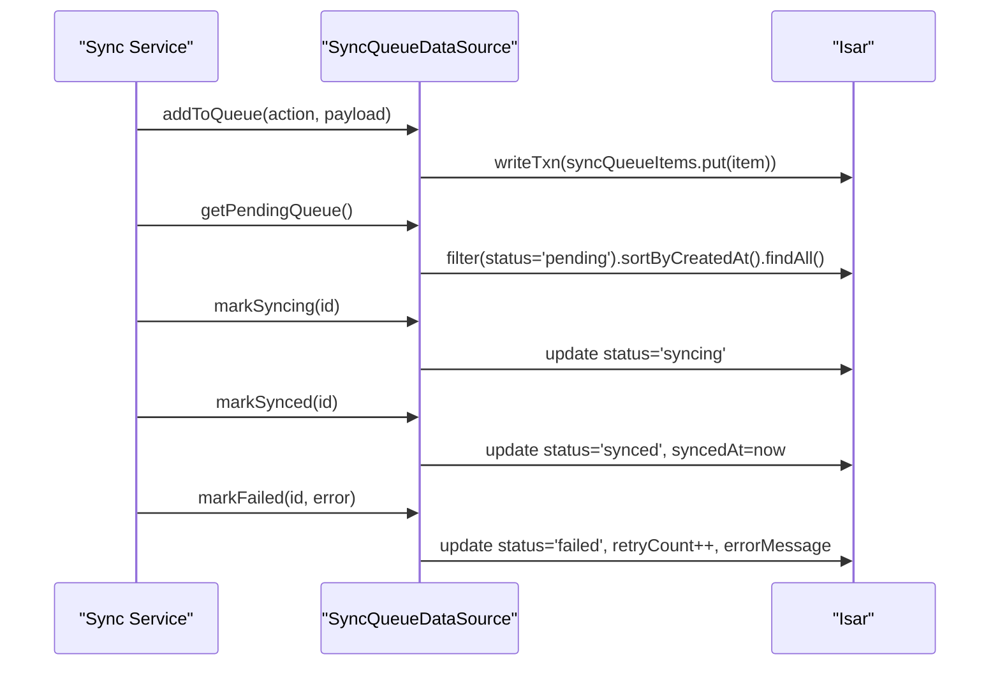

**Diagram sources**
- [sync_queue_datasource.dart:13-82](file://lib/data/local/sync_queue_datasource.dart#L13-L82)
- [sync_queue_datasource.dart:85-115](file://lib/data/local/sync_queue_datasource.dart#L85-L115)

**Section sources**
- [sync_queue_datasource.dart:13-82](file://lib/data/local/sync_queue_datasource.dart#L13-L82)
- [sync_queue_datasource.dart:85-115](file://lib/data/local/sync_queue_datasource.dart#L85-L115)

### Migration Procedures
One-time migration from SharedPreferences:
- Progress maps (by lesson type) converted to UserProgress entries.
- Cached lessons JSON arrays converted to LessonCache entries.
- Unlocked achievements list converted to AchievementCache entries.
- Game scores map converted to GameResultCache entries.
- Migration guarded by a SharedPreferences flag to prevent re-running.

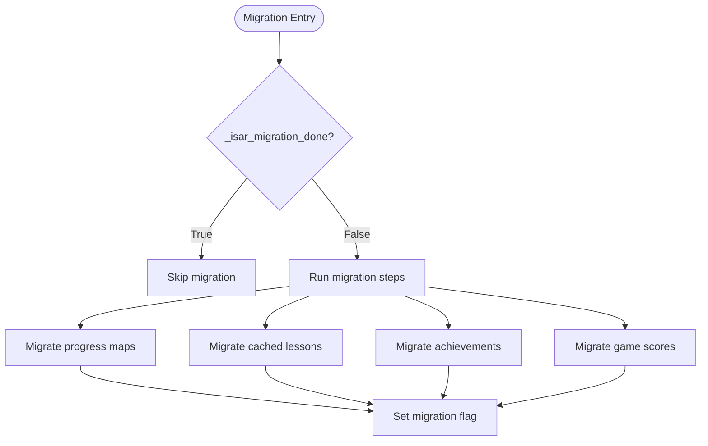

**Diagram sources**
- [local_database.dart:64-108](file://lib/data/local/local_database.dart#L64-L108)
- [local_database.dart:111-253](file://lib/data/local/local_database.dart#L111-L253)

**Section sources**
- [local_database.dart:64-108](file://lib/data/local/local_database.dart#L64-L108)
- [local_database.dart:111-253](file://lib/data/local/local_database.dart#L111-L253)

### Relationship Between Local and Remote Models
- Local models mirror remote entities conceptually:
  - LessonCache corresponds to remote lesson resources.
  - UserProgress mirrors remote progress records.
  - AchievementCache aligns with remote achievements.
  - GameResultCache reflects remote game results.
  - UserProfileCache caches remote profile data.
- Remote counterpart for game play sessions is represented by a Mongoose model with strict validations (totalQuestions fixed, correctness checks, etc.). While not directly mirrored in Isar, GameResultCache serves as the local equivalent for offline game result storage.

```mermaid
graph LR
subgraph "Remote (Backend)"
RLP["Lesson (MongoDB)"]
RPR["Progress (MongoDB)"]
RAC["Achievement (MongoDB)"]
RGPS["GamePlaySession (Mongoose)"]
RUP["User (MongoDB)"]
end
subgraph "Local (Isar)"
LLP["LessonCache"]
LPR["UserProgress"]
LAC["AchievementCache"]
LGPS["GameResultCache"]
LUP["UserProfileCache"]
end
RLP <- --> LLP
RPR <- --> LPR
RAC <- --> LAC
RGPS <- --> LGPS
RUP <- --> LUP
```

**Diagram sources**
- [isar_models.dart:8-265](file://lib/data/local/isar_models.dart#L8-L265)
- [GamePlaySession.js:1-50](file://backend/src/models/GamePlaySession.js#L1-L50)

**Section sources**
- [isar_models.dart:8-265](file://lib/data/local/isar_models.dart#L8-L265)
- [GamePlaySession.js:1-50](file://backend/src/models/GamePlaySession.js#L1-L50)

## Dependency Analysis
- LocalDatabase depends on Isar and path_provider for storage location.
- Data sources depend on LocalDatabase for Isar access.
- Generated code provides typed collections and indexes for each model.
- App startup orchestrates initialization order to ensure database readiness before dependent services.

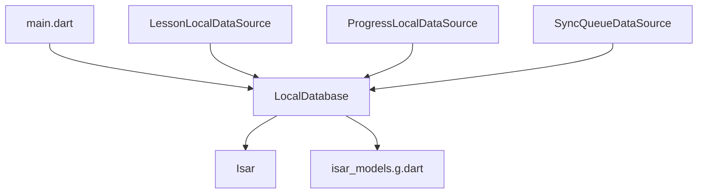

**Diagram sources**
- [main.dart:21-34](file://lib/main.dart#L21-L34)
- [local_database.dart:34-61](file://lib/data/local/local_database.dart#L34-L61)
- [isar_models.g.dart:16-145](file://lib/data/local/isar_models.g.dart#L16-L145)

**Section sources**
- [main.dart:21-34](file://lib/main.dart#L21-L34)
- [local_database.dart:34-61](file://lib/data/local/local_database.dart#L34-L61)

## Performance Considerations
- Indexes: Unique and hash indexes on frequently filtered fields (lessonId, userId, lessonType, status) enable fast lookups and equality filters.
- Transactions: writeTxn batches writes to reduce overhead and ensure atomicity.
- Sorting: Queries leverage sortBy* methods to maintain ordered results efficiently.
- JSON fields: extraDataJson and JSON lists minimize schema proliferation while preserving flexibility.
- Cleanup: targeted deletion by type and clearing of stale records prevents index bloat.

[No sources needed since this section provides general guidance]

## Troubleshooting Guide
Common issues and resolutions:
- Database not initialized: Ensure LocalDatabase.init() is called during startup and awaited before use.
- Migration errors: Verify SharedPreferences keys and JSON structures; migration runs once and guards against re-execution.
- Query failures: Confirm index usage (e.g., lessonIdEqualTo, userIdEqualTo) and correct field types.
- Transaction conflicts: Wrap write operations in writeTxn blocks; avoid long-running transactions.
- Sync queue stuck: Inspect status filtering and retry limits; use retryFailed() to reset failed items.

**Section sources**
- [local_database.dart:17-30](file://lib/data/local/local_database.dart#L17-L30)
- [local_database.dart:64-108](file://lib/data/local/local_database.dart#L64-L108)
- [sync_queue_datasource.dart:39-46](file://lib/data/local/sync_queue_datasource.dart#L39-L46)

## Conclusion
The Isar-based local database provides a robust, indexed, and transactional foundation for offline-first functionality. With carefully designed models, generated indexes, and structured data sources, the system supports efficient caching, progress tracking, offline sync, and seamless migration from legacy storage. Aligning local models with remote entities ensures coherent data synchronization and a consistent user experience.