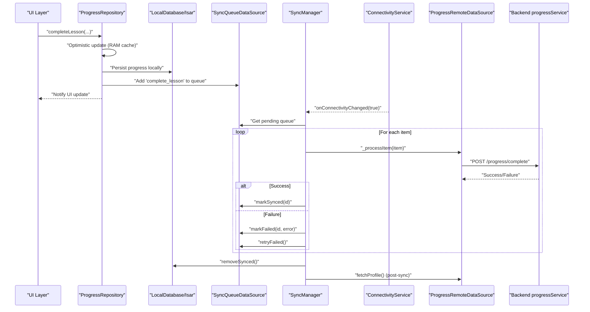
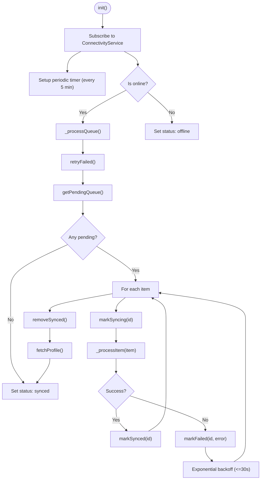
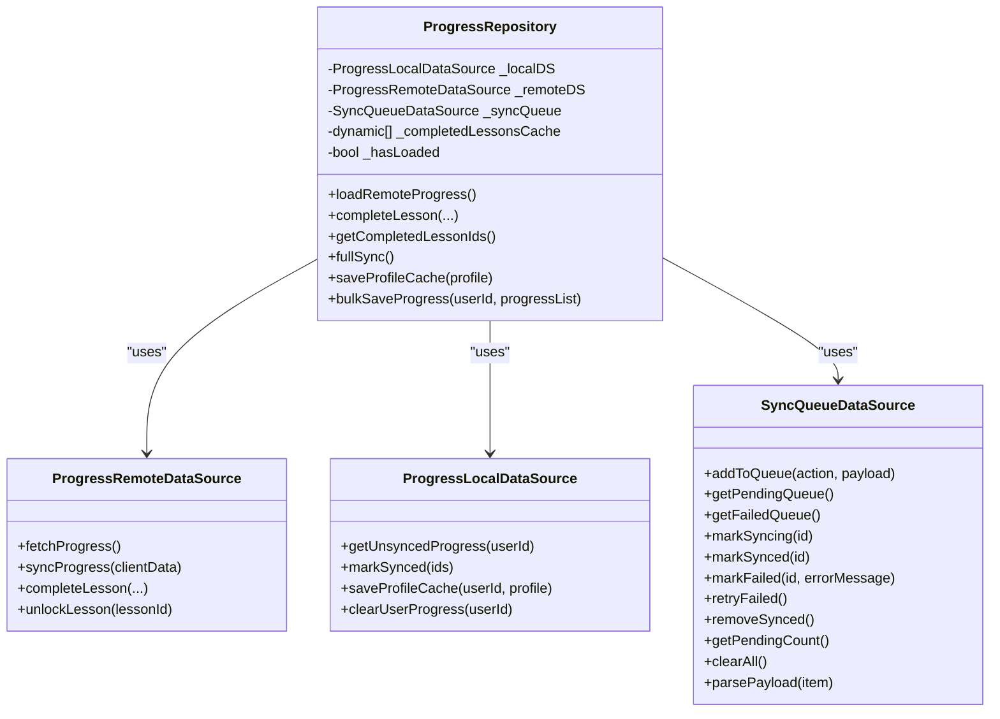
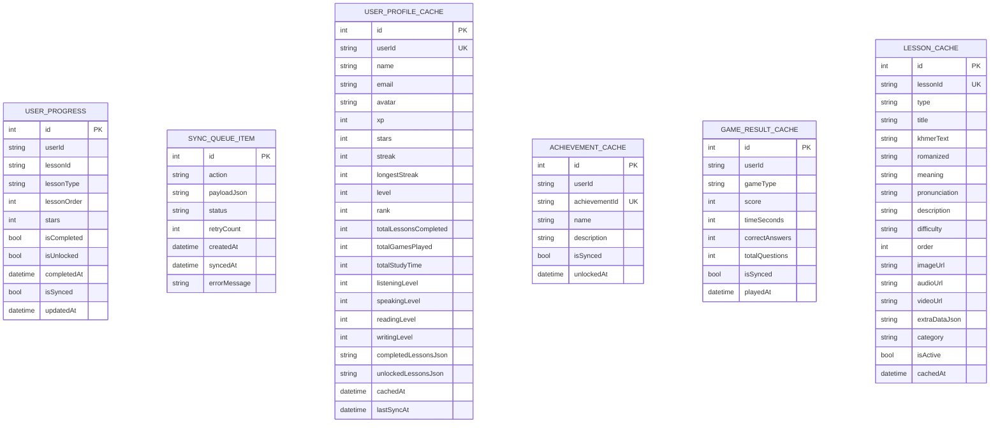
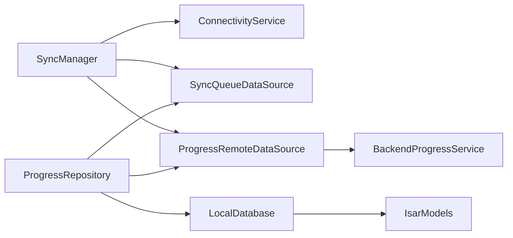

# Offline-First Architecture

<cite>
**Referenced Files in This Document**
- [main.dart](file://lib/main.dart)
- [sync_manager.dart](file://lib/services/sync_manager.dart)
- [connectivity_service.dart](file://lib/services/connectivity_service.dart)
- [progress_repository.dart](file://lib/repositories/progress_repository.dart)
- [progress_remote_datasource.dart](file://lib/data/remote/progress_remote_datasource.dart)
- [local_database.dart](file://lib/data/local/local_database.dart)
- [sync_queue_datasource.dart](file://lib/data/local/sync_queue_datasource.dart)
- [isar_models.dart](file://lib/data/local/isar_models.dart)
- [progressService.js](file://backend/src/services/progressService.js)
- [local_notification_service.dart](file://lib/services/local_notification_service.dart)
</cite>

## Table of Contents
1. [Introduction](#introduction)
2. [Project Structure](#project-structure)
3. [Core Components](#core-components)
4. [Architecture Overview](#architecture-overview)
5. [Detailed Component Analysis](#detailed-component-analysis)
6. [Dependency Analysis](#dependency-analysis)
7. [Performance Considerations](#performance-considerations)
8. [Troubleshooting Guide](#troubleshooting-guide)
9. [Conclusion](#conclusion)

## Introduction
This document explains the offline-first architecture implemented in the application. It covers how the system ensures availability during network interruptions, persists data locally, queues operations for later synchronization, resolves conflicts consistently, and maintains a responsive user experience through optimistic updates and periodic synchronization.

Key goals:
- Maintain a seamless user experience whether online or offline
- Persist local changes immediately and queue them for background sync
- Resolve conflicts deterministically using a take-max strategy
- Provide robust retry logic with exponential backoff
- Offer connectivity detection and automatic sync triggers

## Project Structure
The offline-first implementation spans several layers:
- Application bootstrap initializes local database, connectivity monitoring, and sync engine
- Repositories orchestrate data operations and maintain a memory cache for immediate UI updates
- Remote data sources handle server communication with timeouts and error handling
- Local persistence uses Isar collections for lessons, progress, caches, and a sync queue
- Backend services implement bidirectional sync with deterministic conflict resolution

```mermaid
graph TB
subgraph "App Layer"
Main["main.dart"]
Repo["ProgressRepository"]
SyncMgr["SyncManager"]
ConnSvc["ConnectivityService"]
Notif["LocalNotificationService"]
end
subgraph "Data Layer"
LocalDB["LocalDatabase (Isar)"]
SyncQ["SyncQueueDataSource"]
RemoteDS["ProgressRemoteDataSource"]
end
subgraph "Models"
Models["Isar Models<br/>LessonCache, UserProgress, SyncQueueItem,<br/>UserProfileCache, AchievementCache, GameResultCache"]
end
subgraph "Backend"
Backend["progressService.js<br/>Bidirectional Sync (Take-Max)"]
end
Main --> LocalDB
Main --> ConnSvc
Main --> SyncMgr
Repo --> RemoteDS
Repo --> SyncQ
Repo --> LocalDB
SyncMgr --> ConnSvc
SyncMgr --> SyncQ
SyncMgr --> RemoteDS
LocalDB --> Models
RemoteDS --> Backend
```

**Diagram sources**
- [main.dart:21-77](file://lib/main.dart#L21-L77)
- [sync_manager.dart:46-74](file://lib/services/sync_manager.dart#L46-L74)
- [connectivity_service.dart:28-53](file://lib/services/connectivity_service.dart#L28-L53)
- [progress_repository.dart:19-39](file://lib/repositories/progress_repository.dart#L19-L39)
- [progress_remote_datasource.dart:10-69](file://lib/data/remote/progress_remote_datasource.dart#L10-L69)
- [local_database.dart:32-61](file://lib/data/local/local_database.dart#L32-L61)
- [sync_queue_datasource.dart:9-27](file://lib/data/local/sync_queue_datasource.dart#L9-L27)
- [isar_models.dart:8-137](file://lib/data/local/isar_models.dart#L8-L137)
- [progressService.js:60-155](file://backend/src/services/progressService.js#L60-L155)

**Section sources**
- [main.dart:21-77](file://lib/main.dart#L21-L77)
- [local_database.dart:32-61](file://lib/data/local/local_database.dart#L32-L61)

## Core Components
- SyncManager: Central orchestrator for connectivity-aware synchronization, queue processing, retries, and status reporting
- ConnectivityService: Wraps platform connectivity checks and broadcasts online/offline state
- ProgressRepository: Coordinates optimistic UI updates, local caching, and full bidirectional sync with conflict resolution
- ProgressRemoteDataSource: Encapsulates HTTP calls to backend progress endpoints with timeouts
- LocalDatabase: Initializes Isar, manages migrations from legacy SharedPreferences, and exposes typed collections
- SyncQueueDataSource: Manages a persistent queue of pending actions with status tracking and retry logic
- Isar Models: Typed schemas for local persistence including lesson cache, user progress, sync queue, profiles, achievements, and game results
- Backend progressService: Implements bidirectional sync with a deterministic take-max merge strategy

**Section sources**
- [sync_manager.dart:21-43](file://lib/services/sync_manager.dart#L21-L43)
- [connectivity_service.dart:6-20](file://lib/services/connectivity_service.dart#L6-L20)
- [progress_repository.dart:19-39](file://lib/repositories/progress_repository.dart#L19-L39)
- [progress_remote_datasource.dart:7-143](file://lib/data/remote/progress_remote_datasource.dart#L7-L143)
- [local_database.dart:10-31](file://lib/data/local/local_database.dart#L10-L31)
- [sync_queue_datasource.dart:9-27](file://lib/data/local/sync_queue_datasource.dart#L9-L27)
- [isar_models.dart:8-137](file://lib/data/local/isar_models.dart#L8-L137)
- [progressService.js:60-155](file://backend/src/services/progressService.js#L60-L155)

## Architecture Overview
The offline-first architecture follows a hybrid model:
- Local-first writes: UI updates immediately using in-memory caches and Isar collections
- Queue-based sync: Operations are queued locally and executed when connectivity is restored
- Deterministic merges: Conflicts are resolved using a take-max strategy on the backend
- Periodic and trigger-based sync: Automatic periodic sync plus manual triggers for immediate synchronization



**Diagram sources**
- [progress_repository.dart:105-161](file://lib/repositories/progress_repository.dart#L105-L161)
- [sync_manager.dart:77-155](file://lib/services/sync_manager.dart#L77-L155)
- [sync_queue_datasource.dart:29-108](file://lib/data/local/sync_queue_datasource.dart#L29-L108)
- [progress_remote_datasource.dart:71-112](file://lib/data/remote/progress_remote_datasource.dart#L71-L112)
- [progressService.js:158-259](file://backend/src/services/progressService.js#L158-L259)

## Detailed Component Analysis

### SyncManager
Responsibilities:
- Detect online/offline via ConnectivityService
- Auto-trigger sync when connectivity becomes available
- Process the sync queue in FIFO order with status tracking
- Implement exponential backoff for transient failures
- Perform post-sync profile refresh
- Expose a stream of sync statuses

Key behaviors:
- Subscribes to connectivity changes and starts queue processing upon becoming online
- Runs periodic background sync every five minutes while online
- Processes items sequentially, marking status transitions and cleaning up synced items
- Applies exponential backoff capped at 30 seconds per retry attempt



**Diagram sources**
- [sync_manager.dart:46-155](file://lib/services/sync_manager.dart#L46-L155)
- [sync_queue_datasource.dart:84-101](file://lib/data/local/sync_queue_datasource.dart#L84-L101)

**Section sources**
- [sync_manager.dart:46-236](file://lib/services/sync_manager.dart#L46-L236)

### ConnectivityService
- Wraps platform connectivity checks using a connectivity plugin
- Provides a broadcast stream of online/offline events
- Maintains current online state and logs transitions
- Disposes subscriptions and streams on shutdown

**Section sources**
- [connectivity_service.dart:28-59](file://lib/services/connectivity_service.dart#L28-L59)

### ProgressRepository
- Optimistic UI updates: Immediately adds completed lessons to a RAM cache and notifies listeners
- Local persistence: Saves progress to Isar and marks items as unsynced
- Full sync: Collects unsynced local progress, sends to backend, applies merge rules, updates local state, and refreshes profile cache
- Conflict resolution: Relies on backend take-max strategy for stars and union for unlocked lessons
- Memory cache: Keeps a lightweight in-memory list of completed lessons for fast UI rendering



**Diagram sources**
- [progress_repository.dart:19-416](file://lib/repositories/progress_repository.dart#L19-L416)
- [progress_remote_datasource.dart:7-143](file://lib/data/remote/progress_remote_datasource.dart#L7-L143)

**Section sources**
- [progress_repository.dart:105-161](file://lib/repositories/progress_repository.dart#L105-L161)
- [progress_repository.dart:260-346](file://lib/repositories/progress_repository.dart#L260-L346)

### Local Persistence and Data Models
- Isar initialization and migrations from SharedPreferences to Isar collections
- Typed models for:
  - LessonCache: cached lessons with metadata and optional extra data
  - UserProgress: per-user lesson progress with sync flags and timestamps
  - SyncQueueItem: queued operations with status, retry count, and error messages
  - UserProfileCache: user profile snapshot for offline use
  - AchievementCache: unlocked achievements
  - GameResultCache: offline game results



**Diagram sources**
- [isar_models.dart:8-265](file://lib/data/local/isar_models.dart#L8-L265)

**Section sources**
- [local_database.dart:32-108](file://lib/data/local/local_database.dart#L32-L108)
- [isar_models.dart:8-265](file://lib/data/local/isar_models.dart#L8-L265)

### Sync Queue Management
- Adds actions with JSON payloads and initial status
- Retrieves pending and failed items with retry limits
- Marks items as syncing, synced, or failed with error messages
- Retries failed items and cleans up synced items
- Parses payloads safely and counts pending items

**Section sources**
- [sync_queue_datasource.dart:12-125](file://lib/data/local/sync_queue_datasource.dart#L12-L125)

### Conflict Resolution and Merge Strategy
- Backend implements a deterministic take-max merge:
  - For each lesson, keep the maximum star rating from client and server
  - Union of unlocked lessons from both sides
  - Earliest completion timestamp retained
  - Auto-unlock behavior ensures completed lessons are unlocked
- Frontend relies on backend merge to avoid race conditions and inconsistent states

**Section sources**
- [progressService.js:60-155](file://backend/src/services/progressService.js#L60-L155)
- [progress_repository.dart:292-325](file://lib/repositories/progress_repository.dart#L292-L325)

### Network Connectivity Detection
- Uses a connectivity plugin to monitor connectivity changes
- Broadcasts online/offline events to subscribers
- Initializes once and disposes resources on shutdown

**Section sources**
- [connectivity_service.dart:28-59](file://lib/services/connectivity_service.dart#L28-L59)

### Sync Triggers and Retry Logic
- Automatic triggers:
  - On connectivity change to online
  - Periodic sync every five minutes while online
  - Immediate startup sync after initialization
- Manual triggers:
  - Public method to force sync when desired
- Retry logic:
  - Exponential backoff with a cap of 30 seconds per retry
  - Up to a fixed number of retries before marking failed
  - Failed items are retried automatically on subsequent runs

**Section sources**
- [sync_manager.dart:46-74](file://lib/services/sync_manager.dart#L46-L74)
- [sync_manager.dart:122-125](file://lib/services/sync_manager.dart#L122-L125)
- [sync_queue_datasource.dart:38-94](file://lib/data/local/sync_queue_datasource.dart#L38-L94)

### Error Handling for Offline Scenarios
- Graceful degradation: UI remains responsive even when offline
- Queueing: All operations are persisted locally and retried later
- Status reporting: Sync status stream informs UI of current state
- Robust remote calls: HTTP requests include timeouts and error logging

**Section sources**
- [progress_repository.dart:116-154](file://lib/repositories/progress_repository.dart#L116-L154)
- [progress_remote_datasource.dart:14-38](file://lib/data/remote/progress_remote_datasource.dart#L14-L38)

### Practical Examples
- Offline data operations:
  - Complete a lesson: immediately updates UI, persists locally, and queues sync
  - Unlock a lesson: queues unlock operation for later sync
- Sync scheduling:
  - Automatic sync on connectivity changes and periodic intervals
  - Manual trigger for immediate synchronization
- Performance optimization:
  - Optimistic UI updates reduce perceived latency
  - In-memory cache avoids frequent database reads
  - Batched removal of synced items reduces I/O overhead

**Section sources**
- [progress_repository.dart:105-161](file://lib/repositories/progress_repository.dart#L105-L161)
- [sync_manager.dart:60-71](file://lib/services/sync_manager.dart#L60-L71)
- [progress_repository.dart:260-346](file://lib/repositories/progress_repository.dart#L260-L346)

## Dependency Analysis
The offline-first architecture exhibits low coupling and high cohesion among components:
- SyncManager depends on ConnectivityService, SyncQueueDataSource, and ProgressRemoteDataSource
- ProgressRepository orchestrates local and remote operations and depends on Isar models and data sources
- LocalDatabase encapsulates Isar initialization and migrations
- Backend services enforce deterministic merge semantics



**Diagram sources**
- [sync_manager.dart:24-25](file://lib/services/sync_manager.dart#L24-L25)
- [progress_repository.dart:22-24](file://lib/repositories/progress_repository.dart#L22-L24)
- [local_database.dart:44-55](file://lib/data/local/local_database.dart#L44-L55)
- [progressService.js:60-155](file://backend/src/services/progressService.js#L60-L155)

**Section sources**
- [sync_manager.dart:24-25](file://lib/services/sync_manager.dart#L24-L25)
- [progress_repository.dart:22-24](file://lib/repositories/progress_repository.dart#L22-L24)
- [local_database.dart:44-55](file://lib/data/local/local_database.dart#L44-L55)

## Performance Considerations
- Use optimistic UI updates to minimize perceived latency
- Persist frequently accessed data in Isar for fast reads
- Batch operations where possible to reduce transaction overhead
- Limit retry attempts and apply exponential backoff to avoid network contention
- Clean up synced items promptly to prevent queue growth
- Cache small datasets in memory for rapid UI updates

## Troubleshooting Guide
Common issues and resolutions:
- Connectivity flapping:
  - Verify ConnectivityService subscription and ensure only one listener is active
  - Confirm periodic timer does not overlap with manual triggers unnecessarily
- Sync queue not progressing:
  - Check for persistent failures and review error messages stored in queue items
  - Ensure backend is reachable and responding within timeouts
- Conflicts or unexpected merges:
  - Confirm backend merge strategy is applied consistently
  - Validate lesson IDs and types to ensure deterministic ordering
- Offline operations failing:
  - Ensure LocalDatabase is initialized before attempting writes
  - Verify Isar schemas are registered and migrations completed

**Section sources**
- [connectivity_service.dart:28-59](file://lib/services/connectivity_service.dart#L28-L59)
- [sync_queue_datasource.dart:71-82](file://lib/data/local/sync_queue_datasource.dart#L71-L82)
- [progressService.js:60-155](file://backend/src/services/progressService.js#L60-L155)
- [local_database.dart:32-61](file://lib/data/local/local_database.dart#L32-L61)

## Conclusion
The offline-first architecture delivers a resilient, responsive learning experience by combining immediate local persistence, queue-based synchronization, and deterministic conflict resolution. The design leverages Isar for efficient local storage, a centralized sync manager for coordination, and backend services that enforce predictable merges. Together, these components ensure data integrity and user satisfaction across varying network conditions.