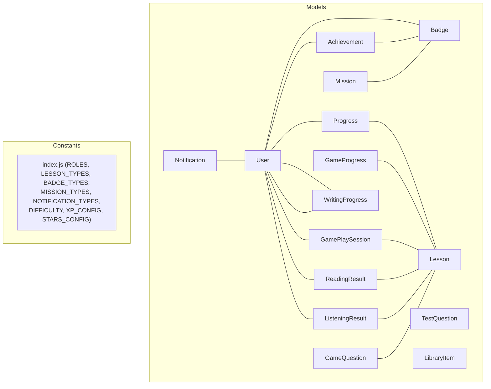
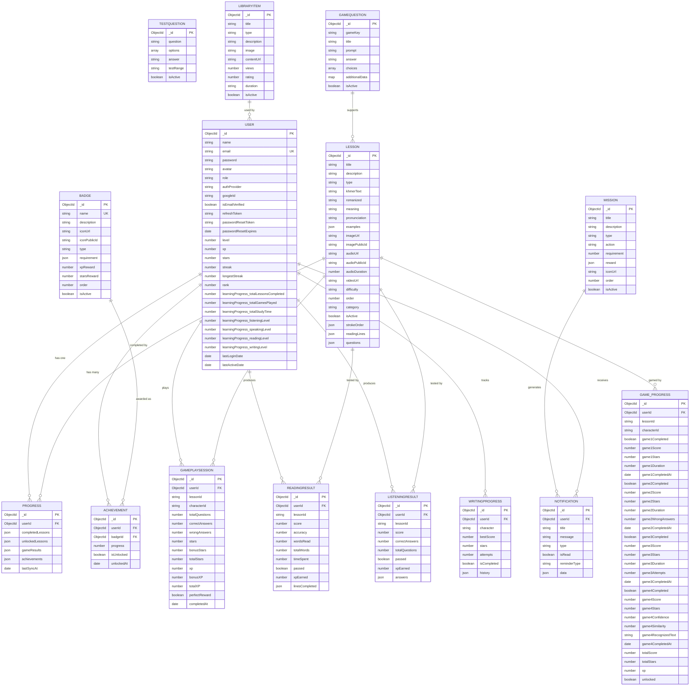
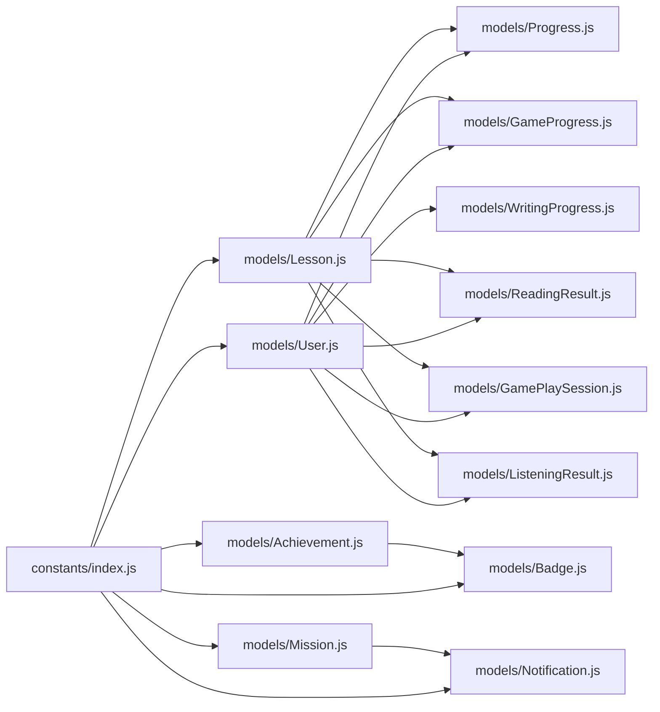

# Remote Database Schema (MongoDB)

<cite>
**Referenced Files in This Document**
- [User.js](file://backend/src/models/User.js)
- [Lesson.js](file://backend/src/models/Lesson.js)
- [Progress.js](file://backend/src/models/Progress.js)
- [GameProgress.js](file://backend/src/models/GameProgress.js)
- [Achievement.js](file://backend/src/models/Achievement.js)
- [Badge.js](file://backend/src/models/Badge.js)
- [GamePlaySession.js](file://backend/src/models/GamePlaySession.js)
- [Mission.js](file://backend/src/models/Mission.js)
- [Notification.js](file://backend/src/models/Notification.js)
- [ReadingResult.js](file://backend/src/models/ReadingResult.js)
- [ListeningResult.js](file://backend/src/models/ListeningResult.js)
- [TestQuestion.js](file://backend/src/models/TestQuestion.js)
- [WritingProgress.js](file://backend/src/models/WritingProgress.js)
- [LibraryItem.js](file://backend/src/models/LibraryItem.js)
- [GameQuestion.js](file://backend/src/models/GameQuestion.js)
- [index.js](file://backend/src/constants/index.js)
</cite>

## Table of Contents
1. [Introduction](#introduction)
2. [Project Structure](#project-structure)
3. [Core Components](#core-components)
4. [Architecture Overview](#architecture-overview)
5. [Detailed Component Analysis](#detailed-component-analysis)
6. [Dependency Analysis](#dependency-analysis)
7. [Performance Considerations](#performance-considerations)
8. [Troubleshooting Guide](#troubleshooting-guide)
9. [Conclusion](#conclusion)
10. [Appendices](#appendices)

## Introduction
This document describes the MongoDB database schema for the educational application. It focuses on the core models used to represent users, lessons, progress tracking, gaming mechanics, achievements, missions, notifications, and related learning artifacts. For each model, we explain field definitions, data types, validation rules, indexes, and relationships. We also cover Mongoose schema options, virtual properties, population strategies, and practical query patterns. Finally, we provide guidance on aggregation pipelines, indexing strategies, and performance optimization tailored to this application’s needs.

## Project Structure
The database models are implemented as Mongoose schemas under the backend models directory. Each model file defines a single schema with indexes, middleware hooks, and optional virtuals. Shared enumerations and configuration values are centralized in the constants module.

**Diagram sources**
- [User.js:14-176](file://backend/src/models/User.js#L14-L176)
- [Lesson.js:13-142](file://backend/src/models/Lesson.js#L13-L142)
- [Progress.js:12-94](file://backend/src/models/Progress.js#L12-L94)
- [GameProgress.js:3-62](file://backend/src/models/GameProgress.js#L3-L62)
- [Achievement.js:11-40](file://backend/src/models/Achievement.js#L11-L40)
- [Badge.js:10-62](file://backend/src/models/Badge.js#L10-L62)
- [GamePlaySession.js:3-97](file://backend/src/models/GamePlaySession.js#L3-L97)
- [Mission.js:12-62](file://backend/src/models/Mission.js#L12-L62)
- [Notification.js:10-47](file://backend/src/models/Notification.js#L10-L47)
- [ReadingResult.js:9-60](file://backend/src/models/ReadingResult.js#L9-L60)
- [ListeningResult.js:9-52](file://backend/src/models/ListeningResult.js#L9-L52)
- [TestQuestion.js:9-46](file://backend/src/models/TestQuestion.js#L9-L46)
- [WritingProgress.js:89-160](file://backend/src/models/WritingProgress.js#L89-L160)
- [LibraryItem.js:9-55](file://backend/src/models/LibraryItem.js#L9-L55)
- [GameQuestion.js:9-47](file://backend/src/models/GameQuestion.js#L9-L47)
- [index.js:13-241](file://backend/src/constants/index.js#L13-L241)

**Section sources**
- [User.js:10-243](file://backend/src/models/User.js#L10-L243)
- [Lesson.js:10-155](file://backend/src/models/Lesson.js#L10-L155)
- [Progress.js:10-112](file://backend/src/models/Progress.js#L10-L112)
- [GameProgress.js:1-83](file://backend/src/models/GameProgress.js#L1-L83)
- [Achievement.js:1-48](file://backend/src/models/Achievement.js#L1-L48)
- [Badge.js:1-70](file://backend/src/models/Badge.js#L1-L70)
- [GamePlaySession.js:1-115](file://backend/src/models/GamePlaySession.js#L1-L115)
- [Mission.js:1-69](file://backend/src/models/Mission.js#L1-L69)
- [Notification.js:1-54](file://backend/src/models/Notification.js#L1-L54)
- [ReadingResult.js:1-67](file://backend/src/models/ReadingResult.js#L1-L67)
- [ListeningResult.js:1-59](file://backend/src/models/ListeningResult.js#L1-L59)
- [TestQuestion.js:1-51](file://backend/src/models/TestQuestion.js#L1-L51)
- [WritingProgress.js:1-253](file://backend/src/models/WritingProgress.js#L1-L253)
- [LibraryItem.js:1-63](file://backend/src/models/LibraryItem.js#L1-L63)
- [GameQuestion.js:1-52](file://backend/src/models/GameQuestion.js#L1-L52)
- [index.js:1-242](file://backend/src/constants/index.js#L1-L242)

## Core Components
This section summarizes the core models and their primary responsibilities.

- User: Stores user identity, authentication, gamification stats, badges, achievements, ranking, learning progress, inventory, and activity timestamps.
- Lesson: Represents structured lessons for Khmer language learning with content, media, difficulty, order, category, and skill-specific fields.
- Progress: Centralized progress store for a user, including completed/unlocked lessons, game results, achievements, and sync metadata.
- GameProgress: Per-character, per-lesson gaming state and scores across multiple mini-games.
- Achievement: Tracks user-badge progress and unlock state.
- Badge: Defines badge metadata, requirements, rewards, and ordering.
- GamePlaySession: Captures a single gameplay session with validated metrics and computed totals.
- Mission: Daily/weekly missions with actions, requirements, and rewards.
- Notification: User-centric notifications with types and reminders.
- ReadingResult: Records reading exercise outcomes and per-line correctness.
- ListeningResult: Records listening exercise outcomes and per-question correctness.
- TestQuestion: Question bank for assessments with ranges and activity flags.
- WritingProgress: Per-character writing mastery tracking with AI analysis snapshots and capped history.
- LibraryItem: Curated learning resources (books, audio, video) with metadata and ratings.
- GameQuestion: Generic question template for various games with dynamic additional data.

**Section sources**
- [User.js:14-176](file://backend/src/models/User.js#L14-L176)
- [Lesson.js:13-142](file://backend/src/models/Lesson.js#L13-L142)
- [Progress.js:12-94](file://backend/src/models/Progress.js#L12-L94)
- [GameProgress.js:3-62](file://backend/src/models/GameProgress.js#L3-L62)
- [Achievement.js:11-40](file://backend/src/models/Achievement.js#L11-L40)
- [Badge.js:10-62](file://backend/src/models/Badge.js#L10-L62)
- [GamePlaySession.js:3-97](file://backend/src/models/GamePlaySession.js#L3-L97)
- [Mission.js:12-62](file://backend/src/models/Mission.js#L12-L62)
- [Notification.js:10-47](file://backend/src/models/Notification.js#L10-L47)
- [ReadingResult.js:9-60](file://backend/src/models/ReadingResult.js#L9-L60)
- [ListeningResult.js:9-52](file://backend/src/models/ListeningResult.js#L9-L52)
- [TestQuestion.js:9-46](file://backend/src/models/TestQuestion.js#L9-L46)
- [WritingProgress.js:89-160](file://backend/src/models/WritingProgress.js#L89-L160)
- [LibraryItem.js:9-55](file://backend/src/models/LibraryItem.js#L9-L55)
- [GameQuestion.js:9-47](file://backend/src/models/GameQuestion.js#L9-L47)

## Architecture Overview
The schema supports a modular educational platform with:
- User-centric gamification and progress tracking
- Skill-specific lesson content and assessment results
- Mini-game progress and session analytics
- Achievement and badge systems
- Missions and notifications
- Writing mastery with AI-driven analysis
- Resource library and generic game questions

**Diagram sources**
- [User.js:14-176](file://backend/src/models/User.js#L14-L176)
- [Lesson.js:13-142](file://backend/src/models/Lesson.js#L13-L142)
- [Progress.js:12-94](file://backend/src/models/Progress.js#L12-L94)
- [GameProgress.js:3-62](file://backend/src/models/GameProgress.js#L3-L62)
- [Achievement.js:11-40](file://backend/src/models/Achievement.js#L11-L40)
- [Badge.js:10-62](file://backend/src/models/Badge.js#L10-L62)
- [GamePlaySession.js:3-97](file://backend/src/models/GamePlaySession.js#L3-L97)
- [Mission.js:12-62](file://backend/src/models/Mission.js#L12-L62)
- [Notification.js:10-47](file://backend/src/models/Notification.js#L10-L47)
- [ReadingResult.js:9-60](file://backend/src/models/ReadingResult.js#L9-L60)
- [ListeningResult.js:9-52](file://backend/src/models/ListeningResult.js#L9-L52)
- [TestQuestion.js:9-46](file://backend/src/models/TestQuestion.js#L9-L46)
- [WritingProgress.js:89-160](file://backend/src/models/WritingProgress.js#L89-L160)
- [LibraryItem.js:9-55](file://backend/src/models/LibraryItem.js#L9-L55)
- [GameQuestion.js:9-47](file://backend/src/models/GameQuestion.js#L9-L47)

## Detailed Component Analysis

### User Schema
- Purpose: Core user entity with authentication, gamification, badges, achievements, ranking, learning progress, inventory, and activity logs.
- Key fields:
  - Identity: name, email, avatar
  - Authentication: role, authProvider, googleId, isEmailVerified, refreshToken, passwordResetToken, password
  - Gamification: level, xp, stars, streak, longestStreak, rank
  - Badges and achievements: arrays of ObjectIds referencing Badge and Achievement
  - Learning progress: nested object with totals, skill levels, completed lessons, and weak skills
  - Inventory: power-ups counters and last registration timestamps
  - Activity: lastLoginDate, lastActiveDate
- Validation:
  - String constraints (required, maxlength, trim)
  - Email regex pattern
  - Password minimum length
  - Role and authProvider enums from constants
- Indexes:
  - rank: 1
  - xp: -1
  - level: -1
- Hooks:
  - Pre-save hashing for password when modified
  - Pre-save recalculating level from XP
- Virtuals:
  - totalBadges computed from badges array length
- Population strategies:
  - Populate badges and achievements arrays when returning user data
  - Use lean queries for read-heavy endpoints to reduce overhead

**Section sources**
- [User.js:14-176](file://backend/src/models/User.js#L14-L176)
- [User.js:185-207](file://backend/src/models/User.js#L185-L207)
- [User.js:236-238](file://backend/src/models/User.js#L236-L238)
- [index.js:13-24](file://backend/src/constants/index.js#L13-L24)

### Lesson Schema
- Purpose: Structured lessons for consonants, vowels, spelling, closed syllables, vocabulary, sentences, numbers, and coeng with media and skill-specific content.
- Key fields:
  - Basic info: title, description, type (enum from constants)
  - Content: khmerText, romanized, meaning, pronunciation, examples
  - Media: imageUrl, imagePublicId, audioUrl, audioPublicId, audioDuration, videoUrl
  - Settings: difficulty (enum), order, category, isActive
  - Type-specific: strokeOrder (writing), readingLines (reading), questions (listening)
- Validation:
  - Required fields enforced via schema-level validators
  - Enums from constants
- Indexes:
  - compound: type + order
  - difficulty
  - isActive
  - category
- Population strategies:
  - Populate questions, readingLines, and strokeOrder for lesson detail views

**Section sources**
- [Lesson.js:13-142](file://backend/src/models/Lesson.js#L13-L142)
- [index.js:29-38](file://backend/src/constants/index.js#L29-L38)
- [index.js:111-115](file://backend/src/constants/index.js#L111-L115)

### Progress Schema
- Purpose: Single-source-of-truth for user progress, enabling offline-first synchronization.
- Key fields:
  - userId (ref: User)
  - completedLessons: array of lesson completion records with lessonId, lessonType, lessonOrder, stars, isCompleted, completedAt
  - unlockedLessons: array of lesson identifiers
  - gameResults: array of game play summaries
  - achievements: array of achievement identifiers
  - lastSyncAt: timestamp
- Indexes:
  - unique: userId
  - completedLessons.lessonId
- Virtuals:
  - totalCompleted computed from isCompleted flag
- Population strategies:
  - Populate completedLessons.lessonId to Lesson for UI rendering
  - Use lean projections for summary endpoints

**Section sources**
- [Progress.js:12-94](file://backend/src/models/Progress.js#L12-L94)
- [Progress.js:105-107](file://backend/src/models/Progress.js#L105-L107)

### GameProgress Schema
- Purpose: Per-character, per-lesson gaming state and aggregated scores across four mini-games.
- Key fields:
  - userId (ref: User), lessonId, characterId
  - Game 1–4: completion flags, scores, stars, durations/attempts/times, plus recognition data for pronunciation
  - Totals: totalScore, totalStars, xp
  - unlocked state
- Indexes:
  - unique: userId + lessonId + characterId
- Hooks:
  - Pre-save computes totalScore, totalStars, and xp based on completion flags and scores
- Population strategies:
  - Populate lessonId to Lesson for contextual UI
  - Use selective projections for leaderboards and progress dashboards

**Section sources**
- [GameProgress.js:3-62](file://backend/src/models/GameProgress.js#L3-L62)
- [GameProgress.js:66-78](file://backend/src/models/GameProgress.js#L66-L78)

### Achievement and Badge Schemas
- Achievement:
  - userId (ref: User), badgeId (ref: Badge), progress, isUnlocked, unlockedAt
  - unique index: userId + badgeId
- Badge:
  - name (unique), description, iconUrl, iconPublicId, type (enum), requirement (type/value/description), xpReward, starsReward, order, isActive
  - indexes: type, order
- Population strategies:
  - Populate badgeId to Badge for unlock notifications and profile displays

**Section sources**
- [Achievement.js:11-40](file://backend/src/models/Achievement.js#L11-L40)
- [Badge.js:10-62](file://backend/src/models/Badge.js#L10-L62)

### GamePlaySession Schema
- Purpose: Captures a single gameplay session with strict validations and computed totals.
- Key fields:
  - userId (ref: User), lessonId, characterId
  - totalQuestions (fixed at 20), correctAnswers, wrongAnswers (validated to sum to totalQuestions)
  - Stars and XP (base, bonus, total) with bounded ranges
  - perfectReward flag, completedAt
- Validation:
  - Pre-validate hook ensures correctAnswers + wrongAnswers == totalQuestions
  - Integer and range validators for counts and scores
- Population strategies:
  - Populate lessonId to Lesson for session review UI

**Section sources**
- [GamePlaySession.js:3-97](file://backend/src/models/GamePlaySession.js#L3-L97)
- [GamePlaySession.js:100-110](file://backend/src/models/GamePlaySession.js#L100-L110)

### Mission and Notification Schemas
- Mission:
  - title, description, type (enum), action (enum), requirement, reward (xp/stars/badgeId), iconUrl, order, isActive
  - indexes: type + isActive
- Notification:
  - userId (ref: User), title, message, type (enum), isRead, reminderType, data
  - indexes: userId + isRead + createdAt desc
- Population strategies:
  - Populate reward.badgeId to Badge for reward previews
  - Paginate notifications by createdAt desc for inbox views

**Section sources**
- [Mission.js:12-62](file://backend/src/models/Mission.js#L12-L62)
- [Notification.js:10-47](file://backend/src/models/Notification.js#L10-L47)
- [index.js:75-91](file://backend/src/constants/index.js#L75-L91)
- [index.js:96-106](file://backend/src/constants/index.js#L96-L106)

### ReadingResult and ListeningResult Schemas
- ReadingResult:
  - userId (ref: User), lessonId (ref: Lesson), score, accuracy, wordsRead, totalWords, timeSpent, passed, xpEarned, linesCompleted
  - indexes: userId + lessonId + createdAt desc
- ListeningResult:
  - userId (ref: User), lessonId (ref: Lesson), score, correctAnswers, totalQuestions, passed, xpEarned, answers
  - indexes: userId + lessonId + createdAt desc
- Population strategies:
  - Populate lessonId to Lesson for result review and analytics

**Section sources**
- [ReadingResult.js:9-60](file://backend/src/models/ReadingResult.js#L9-L60)
- [ListeningResult.js:9-52](file://backend/src/models/ListeningResult.js#L9-L52)

### TestQuestion Schema
- Purpose: Question bank for assessments with dynamic ranges and activity flags.
- Key fields:
  - question, options (min 2), answer, testRange, isActive
  - indexes: testRange, isActive
- Population strategies:
  - Filter by testRange for targeted assessments

**Section sources**
- [TestQuestion.js:9-46](file://backend/src/models/TestQuestion.js#L9-L46)

### WritingProgress Schema
- Purpose: Per-character writing mastery tracking with AI analysis snapshots and capped history.
- Key fields:
  - userId (ref: User), character, bestScore, stars, attempts, isCompleted, history (array of analysis snapshots)
- Sub-schema (analysisSnapshot):
  - score, shapeScore, directionScore, strokeCountScore, errors, errorStrokeIndex, feedback, analyzedAt
- Indexes:
  - unique: userId + character
  - userId + isCompleted
- Hooks:
  - Pre-save derives stars from bestScore, marks completion, caps history to 50 entries
- Statics:
  - recordAttempt: atomic upsert pushing new snapshot, incrementing attempts, updating bestScore
- Population strategies:
  - Aggregate per-user writing stats for dashboards

**Section sources**
- [WritingProgress.js:89-160](file://backend/src/models/WritingProgress.js#L89-L160)
- [WritingProgress.js:172-188](file://backend/src/models/WritingProgress.js#L172-L188)
- [WritingProgress.js:204-245](file://backend/src/models/WritingProgress.js#L204-L245)

### LibraryItem Schema
- Purpose: Curated learning resources with metadata and ratings.
- Key fields:
  - title, type (enum), description, image, contentUrl, views, rating, duration, isActive
  - indexes: type, isActive
- Population strategies:
  - Filter by type and isActive for resource browsing

**Section sources**
- [LibraryItem.js:9-55](file://backend/src/models/LibraryItem.js#L9-L55)

### GameQuestion Schema
- Purpose: Generic question template for various games with dynamic additional data.
- Key fields:
  - gameKey (indexed), title, prompt, answer, choices, additionalData (Map), isActive (indexed)
- Population strategies:
  - Use gameKey to filter questions for specific mini-games

**Section sources**
- [GameQuestion.js:9-47](file://backend/src/models/GameQuestion.js#L9-L47)

## Dependency Analysis
- Enumerations and configuration:
  - ROLES, AUTH_PROVIDERS, LESSON_TYPES, SKILL_TYPES, BADGE_TYPES, GAME_TYPES, MISSION_TYPES, MISSION_ACTIONS, NOTIFICATION_TYPES, DIFFICULTY, RANKING_PERIODS, XP_CONFIG, STARS_CONFIG are imported by models to enforce schema-level enums and validation rules.
- Cross-model references:
  - User → Badge, Achievement, Progress, GamePlaySession, ReadingResult, ListeningResult, WritingProgress
  - Lesson → Progress, GameProgress, ReadingResult, ListeningResult, GamePlaySession
  - Achievement → Badge
  - Mission → Notification
- Coupling and cohesion:
  - Models are cohesive around domain concepts; cross-references are explicit via ObjectId refs and populate strategies.
  - No circular dependencies observed among models.

**Diagram sources**
- [index.js:13-241](file://backend/src/constants/index.js#L13-L241)
- [User.js:12](file://backend/src/models/User.js#L12)
- [Lesson.js:11](file://backend/src/models/Lesson.js#L11)
- [Achievement.js:11](file://backend/src/models/Achievement.js#L11)
- [Badge.js:8](file://backend/src/models/Badge.js#L8)
- [Mission.js:10](file://backend/src/models/Mission.js#L10)
- [Notification.js:8](file://backend/src/models/Notification.js#L8)
- [Progress.js:10](file://backend/src/models/Progress.js#L10)
- [GameProgress.js:1](file://backend/src/models/GameProgress.js#L1)
- [GamePlaySession.js:1](file://backend/src/models/GamePlaySession.js#L1)
- [ReadingResult.js:7](file://backend/src/models/ReadingResult.js#L7)
- [ListeningResult.js:7](file://backend/src/models/ListeningResult.js#L7)
- [WritingProgress.js:17](file://backend/src/models/WritingProgress.js#L17)

**Section sources**
- [index.js:13-241](file://backend/src/constants/index.js#L13-L241)
- [User.js:12](file://backend/src/models/User.js#L12)
- [Lesson.js:11](file://backend/src/models/Lesson.js#L11)
- [Achievement.js:11](file://backend/src/models/Achievement.js#L11)
- [Badge.js:8](file://backend/src/models/Badge.js#L8)
- [Mission.js:10](file://backend/src/models/Mission.js#L10)
- [Notification.js:8](file://backend/src/models/Notification.js#L8)
- [Progress.js:10](file://backend/src/models/Progress.js#L10)
- [GameProgress.js:1](file://backend/src/models/GameProgress.js#L1)
- [GamePlaySession.js:1](file://backend/src/models/GamePlaySession.js#L1)
- [ReadingResult.js:7](file://backend/src/models/ReadingResult.js#L7)
- [ListeningResult.js:7](file://backend/src/models/ListeningResult.js#L7)
- [WritingProgress.js:17](file://backend/src/models/WritingProgress.js#L17)

## Performance Considerations
- Indexing strategies:
  - Single-field: User.rank, User.xp, User.level; Lesson.type+order, Lesson.difficulty, Lesson.isActive, Lesson.category; Achievement.userId+badgeId; GameProgress.userId+lessonId+characterId; WritingProgress.userId+character; ReadingResult.userId+lessonId+createdAt desc; ListeningResult.userId+lessonId+createdAt desc; Notification.userId+isRead+createdAt desc; TestQuestion.testRange, TestQuestion.isActive; LibraryItem.type, LibraryItem.isActive; GameQuestion.gameKey, GameQuestion.isActive.
  - Unique indexes: Progress.userId, Achievement.userId+badgeId, GameProgress.userId+lessonId+characterId, WritingProgress.userId+character.
- Query patterns:
  - Projection: Use lean queries and projection to limit fields for lists and summaries.
  - Pagination: Apply skip/take or cursor-based pagination for large result sets (e.g., notifications).
  - Aggregation: Prefer aggregation for computing derived metrics (e.g., user ranks, lesson completion rates).
- Denormalization trade-offs:
  - User.learningProgress stores skill levels and totals; consider keeping it normalized if frequent updates occur.
  - WritingProgress separates history to avoid bloating the main document; maintain capped history to control growth.
- Population costs:
  - Limit population depth and use selective populate for performance-sensitive endpoints.
- Validation at write-time:
  - Use pre-validate hooks (e.g., GamePlaySession) to catch invalid states early.

[No sources needed since this section provides general guidance]

## Troubleshooting Guide
- Common validation errors:
  - Email format, password length, required fields, enum mismatches, integer and range violations.
  - Use schema-level validators and pre-validate hooks to surface meaningful messages.
- Duplicate key errors:
  - Unique indexes on userId in Progress, Achievement, GameProgress, WritingProgress; ensure upsert logic or pre-checks.
- Stale or inconsistent data:
  - Use pre-save hooks to compute derived fields (e.g., User.level, GameProgress totals, WritingProgress stars/isCompleted).
- Population pitfalls:
  - Verify ref fields exist; use lean queries for read-heavy lists; avoid deep population chains.
- Monitoring:
  - Track slow queries using indexes; monitor capped arrays (WritingProgress history) to prevent oversized documents.

**Section sources**
- [GamePlaySession.js:100-110](file://backend/src/models/GamePlaySession.js#L100-L110)
- [User.js:185-207](file://backend/src/models/User.js#L185-L207)
- [GameProgress.js:66-78](file://backend/src/models/GameProgress.js#L66-L78)
- [WritingProgress.js:172-188](file://backend/src/models/WritingProgress.js#L172-L188)

## Conclusion
The schema is designed around a user-centric, skill-modular learning platform with robust gamification and progress tracking. It leverages Mongoose enums, indexes, hooks, and virtuals to ensure data integrity, performance, and maintainability. By following the recommended population strategies, aggregation patterns, and indexing approaches, the system can scale effectively while delivering responsive experiences for learners and administrators.

[No sources needed since this section summarizes without analyzing specific files]

## Appendices

### Field Definitions and Validation Rules
- User
  - name: String, required, maxlength 50
  - email: String, required, unique, lowercase, trim, regex pattern
  - password: String, minlength 6, select false
  - role: Enum from ROLES
  - authProvider: Enum from AUTH_PROVIDERS
  - googleId: String, sparse
  - isEmailVerified: Boolean
  - refreshToken: String, select false
  - passwordResetToken: String
  - passwordResetExpires: Date
  - level/xp/stars/streak/longestStreak/rank: Numbers with defaults/min constraints
  - learningProgress.*: Nested numbers and arrays with defaults and min/max
  - inventory.*: Power-ups with defaults and lastReg timestamps
  - lastLoginDate/lastActiveDate: Dates with defaults
- Lesson
  - title/description/type/khmerText: Required strings
  - type: Enum from LESSON_TYPES
  - difficulty: Enum from DIFFICULTY
  - order/category/isActive: Numbers and booleans
  - media fields: Strings with defaults
  - type-specific arrays: strokeOrder, readingLines, questions
- Progress
  - userId: ObjectId ref User, required
  - completedLessons: Array of lesson records with lessonId, stars, isCompleted, completedAt
  - unlockedLessons: Array of strings
  - gameResults: Array of game summaries
  - achievements: Array of strings
  - lastSyncAt: Date
- GameProgress
  - userId/ref Lesson/characterId: Required
  - game1–4 fields: Booleans, numbers with defaults
  - totals: totalScore, totalStars, xp
  - unlocked: Boolean
- Achievement
  - userId/ref Badge: Required
  - progress: Number with min/max
  - isUnlocked/unlockedAt: Booleans and dates
- Badge
  - name: Unique, required
  - type: Enum from BADGE_TYPES
  - requirement: Embedded object {type, value, description}
  - xpReward/starsReward/order/isActive: Numbers and booleans
- GamePlaySession
  - userId/ref Lesson/characterId: Required
  - totalQuestions: Fixed at 20
  - correctAnswers/wrongAnswers: Integers, validated to sum to totalQuestions
  - stars/xp/bonuses: Numbers with min/max
  - perfectReward: Boolean
  - completedAt: Date
- Mission
  - title/description: Strings
  - type/action: Enums from MISSION_TYPES and MISSION_ACTIONS
  - requirement: Number with min 1
  - reward: Nested {xp, stars, badgeId}
  - iconUrl/order/isActive: Strings, numbers, booleans
- Notification
  - userId: Ref User
  - title/message: Required strings
  - type: Enum from NOTIFICATION_TYPES
  - isRead: Boolean
  - reminderType: Enum with nullable default
  - data: Mixed
- ReadingResult
  - userId/ref Lesson: Required
  - score/accuracy/wordsRead/totalWords/timeSpent: Numbers with min/max
  - passed: Boolean
  - xpEarned: Number
  - linesCompleted: Array of {lineIndex, isCorrect}
- ListeningResult
  - userId/ref Lesson: Required
  - score/correctAnswers/totalQuestions: Numbers with min/max
  - passed: Boolean
  - xpEarned: Number
  - answers: Array of {questionIndex, selectedAnswer, correctAnswer, isCorrect}
- TestQuestion
  - question/options/answer/testRange: Required strings
  - options: Array with min length 2
  - isActive: Boolean
- WritingProgress
  - userId: Ref User
  - character: String with trim
  - bestScore/stars/attempts: Numbers with min/max
  - isCompleted: Boolean
  - history: Array of analysis snapshots with capped length 50
- LibraryItem
  - title/type/description/image/contentUrl: Strings
  - views/rating/duration: Numbers with min/max
  - isActive: Boolean
- GameQuestion
  - gameKey/title/prompt/answer: Required strings
  - choices: Array of strings
  - additionalData: Map
  - isActive: Boolean

**Section sources**
- [User.js:19-170](file://backend/src/models/User.js#L19-L170)
- [Lesson.js:18-136](file://backend/src/models/Lesson.js#L18-L136)
- [Progress.js:17-88](file://backend/src/models/Progress.js#L17-L88)
- [GameProgress.js:5-58](file://backend/src/models/GameProgress.js#L5-L58)
- [Achievement.js:13-36](file://backend/src/models/Achievement.js#L13-L36)
- [Badge.js:12-58](file://backend/src/models/Badge.js#L12-L58)
- [GamePlaySession.js:5-93](file://backend/src/models/GamePlaySession.js#L5-L93)
- [Mission.js:14-58](file://backend/src/models/Mission.js#L14-L58)
- [Notification.js:12-43](file://backend/src/models/Notification.js#L12-L43)
- [ReadingResult.js:11-56](file://backend/src/models/ReadingResult.js#L11-L56)
- [ListeningResult.js:11-48](file://backend/src/models/ListeningResult.js#L11-L48)
- [TestQuestion.js:11-42](file://backend/src/models/TestQuestion.js#L11-L42)
- [WritingProgress.js:94-154](file://backend/src/models/WritingProgress.js#L94-L154)
- [LibraryItem.js:11-51](file://backend/src/models/LibraryItem.js#L11-L51)
- [GameQuestion.js:11-43](file://backend/src/models/GameQuestion.js#L11-L43)

### Example Queries and Aggregation Pipelines
- Retrieve user profile with populated badges and achievements:
  - Find User by ID, populate badges and achievements arrays, exclude sensitive fields via toJSON override.
- Compute global leaderboard:
  - Aggregate Users by rank or xp descending; project name, level, stars, rank; paginate with skip/take.
- Get user’s lesson progress:
  - Lookup Progress by userId; optionally populate completedLessons.lessonId to Lesson; filter by lesson type or category.
- Count user’s completed lessons by type:
  - Use aggregation pipeline to unwind completedLessons, group by lessonType, sum counts.
- Session analytics:
  - Filter GamePlaySessions by userId and date range; project averages for correctAnswers, totalStars, totalXP.
- Writing mastery report:
  - Lookup WritingProgress by userId; filter by isCompleted; project bestScore and stars distribution.
- Notification inbox:
  - Find Notifications by userId with isRead=false, sort by createdAt desc; paginate.

[No sources needed since this section provides general guidance]

### Best Practices for Data Modeling
- Keep derived fields consistent using pre-save hooks (e.g., User.level, GameProgress totals, WritingProgress stars/isCompleted).
- Use unique compound indexes for referential integrity (Progress.userId, Achievement.userId+badgeId, GameProgress.userId+lessonId+characterId, WritingProgress.userId+character).
- Separate large histories (WritingProgress.history) to prevent document bloat; cap arrays and recompute derived fields.
- Use enums from constants to enforce schema validity and simplify maintenance.
- Prefer lean queries for read-heavy lists; selectively populate only required fields.
- Validate at write-time using pre-validate hooks to prevent inconsistent states.

[No sources needed since this section provides general guidance]