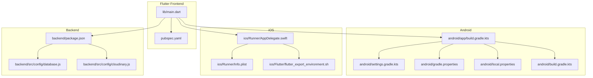
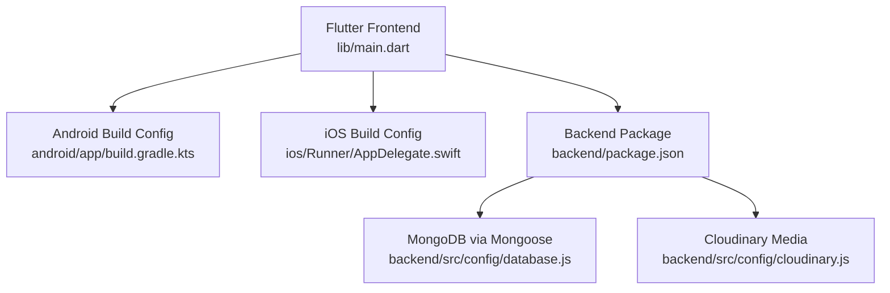
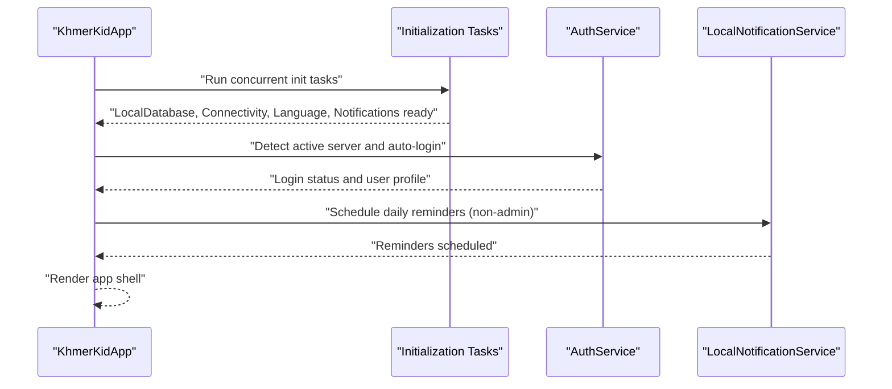
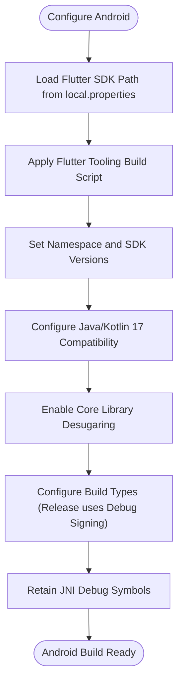
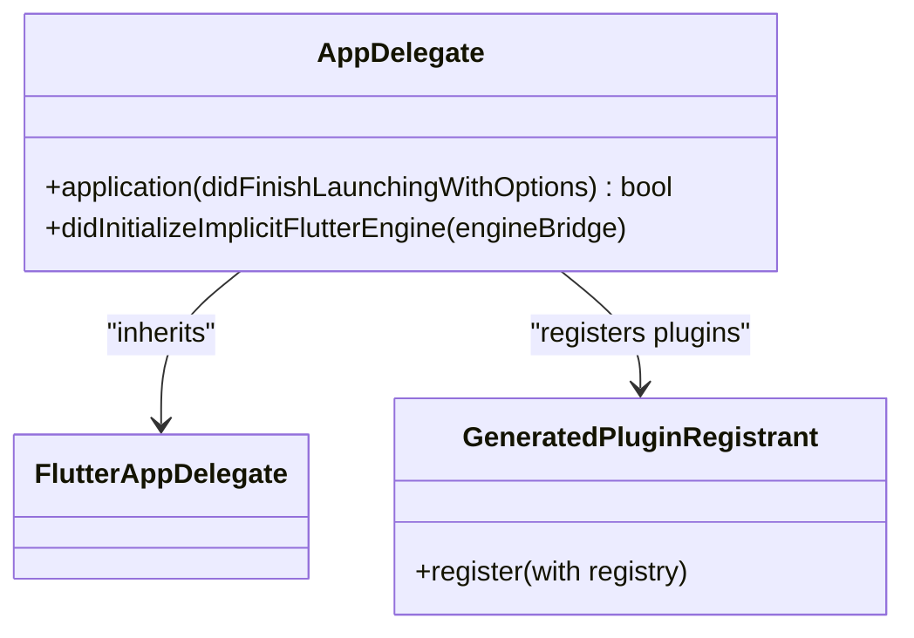
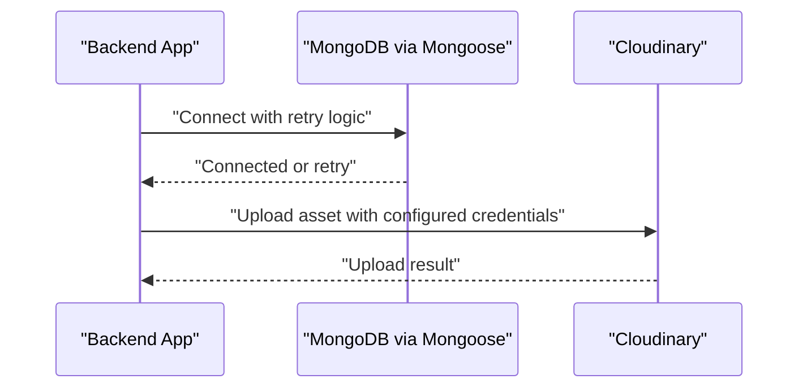
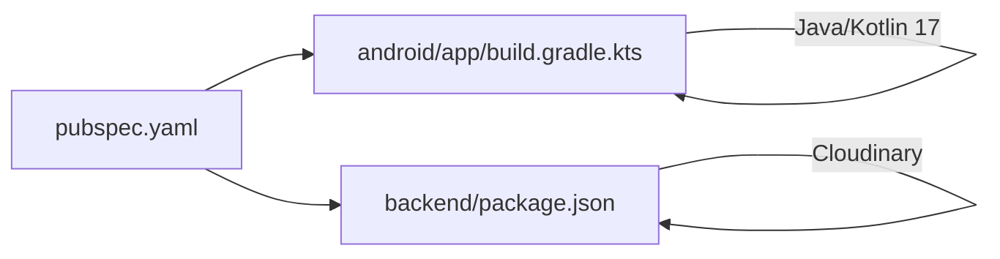

# Deployment and DevOps

<cite>
**Referenced Files in This Document**
- [pubspec.yaml](file://pubspec.yaml)
- [lib/main.dart](file://lib/main.dart)
- [android/app/build.gradle.kts](file://android/app/build.gradle.kts)
- [android/settings.gradle.kts](file://android/settings.gradle.kts)
- [android/gradle.properties](file://android/gradle.properties)
- [android/local.properties](file://android/local.properties)
- [android/build.gradle.kts](file://android/build.gradle.kts)
- [ios/Runner/AppDelegate.swift](file://ios/Runner/AppDelegate.swift)
- [ios/Runner/Info.plist](file://ios/Runner/Info.plist)
- [ios/Flutter/flutter_export_environment.sh](file://ios/Flutter/flutter_export_environment.sh)
- [backend/package.json](file://backend/package.json)
- [backend/src/config/database.js](file://backend/src/config/database.js)
- [backend/src/config/cloudinary.js](file://backend/src/config/cloudinary.js)
</cite>

## Table of Contents
1. [Introduction](#introduction)
2. [Project Structure](#project-structure)
3. [Core Components](#core-components)
4. [Architecture Overview](#architecture-overview)
5. [Detailed Component Analysis](#detailed-component-analysis)
6. [Dependency Analysis](#dependency-analysis)
7. [Performance Considerations](#performance-considerations)
8. [Troubleshooting Guide](#troubleshooting-guide)
9. [Conclusion](#conclusion)
10. [Appendices](#appendices)

## Introduction
This document provides comprehensive deployment and DevOps guidance for the KhmerKid Flutter application, covering build configuration for Android and iOS, environment setup, production deployment strategies, Flutter build process, Android APK generation, iOS app bundle creation, asset optimization, environment variable configuration, database setup, cloud service integration, and CI/CD pipeline setup. It also includes troubleshooting guides for common deployment issues, performance optimization tips for production, and monitoring strategies.

## Project Structure
The project follows a standard Flutter monorepo layout with platform-specific native configurations under android and ios, a Flutter frontend under lib, and a Node.js backend under backend. Key build and configuration files are organized per platform and technology stack.

**Diagram sources**
- [lib/main.dart:1-129](file://lib/main.dart#L1-L129)
- [pubspec.yaml:1-115](file://pubspec.yaml#L1-L115)
- [android/app/build.gradle.kts:1-56](file://android/app/build.gradle.kts#L1-L56)
- [android/settings.gradle.kts:1-27](file://android/settings.gradle.kts#L1-L27)
- [android/gradle.properties:1-3](file://android/gradle.properties#L1-L3)
- [android/local.properties:1-5](file://android/local.properties#L1-L5)
- [android/build.gradle.kts:1-56](file://android/build.gradle.kts#L1-L56)
- [ios/Runner/AppDelegate.swift:1-17](file://ios/Runner/AppDelegate.swift#L1-L17)
- [ios/Runner/Info.plist:1-71](file://ios/Runner/Info.plist#L1-L71)
- [ios/Flutter/flutter_export_environment.sh:1-14](file://ios/Flutter/flutter_export_environment.sh#L1-L14)
- [backend/package.json:1-54](file://backend/package.json#L1-L54)
- [backend/src/config/database.js:1-66](file://backend/src/config/database.js#L1-L66)
- [backend/src/config/cloudinary.js:1-70](file://backend/src/config/cloudinary.js#L1-L70)

**Section sources**
- [lib/main.dart:1-129](file://lib/main.dart#L1-L129)
- [pubspec.yaml:1-115](file://pubspec.yaml#L1-L115)
- [android/app/build.gradle.kts:1-56](file://android/app/build.gradle.kts#L1-L56)
- [android/settings.gradle.kts:1-27](file://android/settings.gradle.kts#L1-L27)
- [android/gradle.properties:1-3](file://android/gradle.properties#L1-L3)
- [android/local.properties:1-5](file://android/local.properties#L1-L5)
- [android/build.gradle.kts:1-56](file://android/build.gradle.kts#L1-L56)
- [ios/Runner/AppDelegate.swift:1-17](file://ios/Runner/AppDelegate.swift#L1-L17)
- [ios/Runner/Info.plist:1-71](file://ios/Runner/Info.plist#L1-L71)
- [ios/Flutter/flutter_export_environment.sh:1-14](file://ios/Flutter/flutter_export_environment.sh#L1-L14)
- [backend/package.json:1-54](file://backend/package.json#L1-L54)
- [backend/src/config/database.js:1-66](file://backend/src/config/database.js#L1-L66)
- [backend/src/config/cloudinary.js:1-70](file://backend/src/config/cloudinary.js#L1-L70)

## Core Components
- Flutter application entrypoint initializes local database, connectivity, localization, notifications, and auto-login detection before rendering the app shell.
- Android Gradle configuration defines namespace, SDK versions, Java/Kotlin compatibility, Flutter integration, signing defaults, and packaging options.
- iOS configuration sets up the AppDelegate lifecycle and Info.plist metadata for app identity, supported orientations, and scene configuration.
- Backend package configuration lists Node.js dependencies including Express, Mongoose, Socket.IO, Cloudinary, and others, with scripts for development, seeding, and testing.
- Environment-driven backend services include MongoDB connection with retry logic and Cloudinary integration for media uploads.

**Section sources**
- [lib/main.dart:21-77](file://lib/main.dart#L21-L77)
- [android/app/build.gradle.kts:8-56](file://android/app/build.gradle.kts#L8-L56)
- [ios/Runner/AppDelegate.swift:4-16](file://ios/Runner/AppDelegate.swift#L4-L16)
- [ios/Runner/Info.plist:4-68](file://ios/Runner/Info.plist#L4-L68)
- [backend/package.json:6-13](file://backend/package.json#L6-L13)
- [backend/src/config/database.js:16-40](file://backend/src/config/database.js#L16-L40)
- [backend/src/config/cloudinary.js:13-18](file://backend/src/config/cloudinary.js#L13-L18)

## Architecture Overview
The deployment architecture spans three layers:
- Flutter frontend orchestrates initialization tasks and renders platform-specific UI.
- Native Android/iOS build systems produce APK/IPA artifacts with integrated Flutter runtime.
- Backend services expose REST APIs, manage MongoDB, and integrate Cloudinary for media.

**Diagram sources**
- [lib/main.dart:21-77](file://lib/main.dart#L21-L77)
- [android/app/build.gradle.kts:49-51](file://android/app/build.gradle.kts#L49-L51)
- [ios/Runner/AppDelegate.swift:5-15](file://ios/Runner/AppDelegate.swift#L5-L15)
- [backend/package.json:24-45](file://backend/package.json#L24-L45)
- [backend/src/config/database.js:16-40](file://backend/src/config/database.js#L16-L40)
- [backend/src/config/cloudinary.js:13-18](file://backend/src/config/cloudinary.js#L13-L18)

## Detailed Component Analysis

### Flutter Build Process
- The Flutter application initializes local resources, connectivity, language, and notifications concurrently, then proceeds to auto-login detection and daily reminder scheduling if applicable.
- Asset declarations in pubspec.yaml define translation files, images, and audio assets for pronunciation learning.

**Diagram sources**
- [lib/main.dart:24-59](file://lib/main.dart#L24-L59)

**Section sources**
- [lib/main.dart:21-77](file://lib/main.dart#L21-L77)
- [pubspec.yaml:78-88](file://pubspec.yaml#L78-L88)

### Android Build Configuration
- The Android Gradle plugin integrates with Flutter, sets namespace and SDK versions, configures Java/Kotlin 17 compatibility, and applies desugaring for core libraries.
- Default build type uses debug signing configuration; packaging retains native debug symbols for diagnostics.
- Centralized Gradle settings load Flutter SDK path from local.properties and include the Flutter tooling build script.

**Diagram sources**
- [android/settings.gradle.kts:1-27](file://android/settings.gradle.kts#L1-L27)
- [android/app/build.gradle.kts:8-56](file://android/app/build.gradle.kts#L8-L56)
- [android/gradle.properties:1-3](file://android/gradle.properties#L1-L3)
- [android/local.properties:1-5](file://android/local.properties#L1-L5)

**Section sources**
- [android/app/build.gradle.kts:1-56](file://android/app/build.gradle.kts#L1-L56)
- [android/settings.gradle.kts:1-27](file://android/settings.gradle.kts#L1-L27)
- [android/gradle.properties:1-3](file://android/gradle.properties#L1-L3)
- [android/local.properties:1-5](file://android/local.properties#L1-L5)
- [android/build.gradle.kts:8-24](file://android/build.gradle.kts#L8-L24)

### iOS Build Configuration
- AppDelegate manages the Flutter engine lifecycle and registers plugins after engine initialization.
- Info.plist defines app metadata, supported orientations, and scene configuration for single-window sessions.

**Diagram sources**
- [ios/Runner/AppDelegate.swift:4-16](file://ios/Runner/AppDelegate.swift#L4-L16)
- [ios/Runner/Info.plist:29-48](file://ios/Runner/Info.plist#L29-L48)

**Section sources**
- [ios/Runner/AppDelegate.swift:1-17](file://ios/Runner/AppDelegate.swift#L1-L17)
- [ios/Runner/Info.plist:1-71](file://ios/Runner/Info.plist#L1-L71)
- [ios/Flutter/flutter_export_environment.sh:1-14](file://ios/Flutter/flutter_export_environment.sh#L1-L14)

### Backend Services and Environment Variables
- MongoDB connection uses Mongoose with retry logic, connection event logging, and graceful shutdown handling.
- Cloudinary integration reads credentials from environment variables and exposes upload/delete utilities.

**Diagram sources**
- [backend/src/config/database.js:16-40](file://backend/src/config/database.js#L16-L40)
- [backend/src/config/cloudinary.js:13-18](file://backend/src/config/cloudinary.js#L13-L18)

**Section sources**
- [backend/src/config/database.js:16-66](file://backend/src/config/database.js#L16-L66)
- [backend/src/config/cloudinary.js:26-69](file://backend/src/config/cloudinary.js#L26-L69)
- [backend/package.json:24-45](file://backend/package.json#L24-L45)

## Dependency Analysis
- Flutter dependencies declared in pubspec.yaml include UI, internationalization, networking, offline-first storage, handwriting recognition, and media playback.
- Android dependencies include desugaring for broader API compatibility.
- Backend dependencies include Express, Mongoose, Socket.IO, Cloudinary, Passport, and related middleware.

**Diagram sources**
- [pubspec.yaml:15-64](file://pubspec.yaml#L15-L64)
- [android/app/build.gradle.kts:54-55](file://android/app/build.gradle.kts#L54-L55)
- [backend/package.json:24-45](file://backend/package.json#L24-L45)

**Section sources**
- [pubspec.yaml:15-64](file://pubspec.yaml#L15-L64)
- [android/app/build.gradle.kts:54-55](file://android/app/build.gradle.kts#L54-L55)
- [backend/package.json:24-45](file://backend/package.json#L24-L45)

## Performance Considerations
- Optimize Flutter startup by minimizing synchronous work in main and leveraging concurrent initialization tasks.
- Enable tree shaking and avoid unused assets to reduce app size; review asset declarations in pubspec.yaml.
- On Android, ensure desugaring is enabled for broader API support while monitoring dex size growth.
- For iOS, validate Info.plist orientation and scene configurations to prevent unnecessary layout passes.
- Backend performance improvements include connection pooling, retry logic, and efficient Cloudinary upload options.

[No sources needed since this section provides general guidance]

## Troubleshooting Guide
Common deployment issues and resolutions:
- Android release signing: The release build currently uses debug signing; configure proper keystore and signingConfig for production builds.
- iOS provisioning: Verify bundle identifiers and provisioning profiles in Xcode; ensure AppDelegate registration completes successfully.
- Backend connectivity: Confirm MONGO_URI availability and network reachability; leverage retry logic during startup.
- Cloudinary uploads: Ensure CLOUDINARY_CLOUD_NAME, CLOUDINARY_API_KEY, and CLOUDINARY_API_SECRET are set; validate resource types and folders.

**Section sources**
- [android/app/build.gradle.kts:34-40](file://android/app/build.gradle.kts#L34-L40)
- [ios/Runner/AppDelegate.swift:13-15](file://ios/Runner/AppDelegate.swift#L13-L15)
- [backend/src/config/database.js:16-40](file://backend/src/config/database.js#L16-L40)
- [backend/src/config/cloudinary.js:13-18](file://backend/src/config/cloudinary.js#L13-L18)

## Conclusion
This guide outlined the deployment and DevOps practices for the KhmerKid application across Flutter, Android, iOS, and backend services. By aligning build configurations, environment variables, and backend integrations with production-grade practices—such as proper signing, robust database connectivity, and optimized asset delivery—you can achieve reliable deployments and maintainable operations.

[No sources needed since this section summarizes without analyzing specific files]

## Appendices

### Environment Variable Reference
- Backend database
  - MONGO_URI: MongoDB connection string
- Cloudinary
  - CLOUDINARY_CLOUD_NAME: Cloud name
  - CLOUDINARY_API_KEY: API key
  - CLOUDINARY_API_SECRET: API secret

**Section sources**
- [backend/src/config/database.js:18-23](file://backend/src/config/database.js#L18-L23)
- [backend/src/config/cloudinary.js:14-16](file://backend/src/config/cloudinary.js#L14-L16)

### Production Checklist
- Android
  - Configure release signing
  - Optimize proguard/r8 rules
  - Validate minification and resource shrinking
- iOS
  - Set correct bundle identifier and team
  - Archive and validate IPA
- Backend
  - Set environment variables on hosting platform
  - Configure firewall and network policies
  - Monitor logs and metrics

[No sources needed since this section provides general guidance]