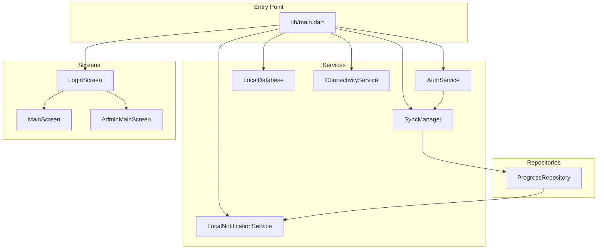
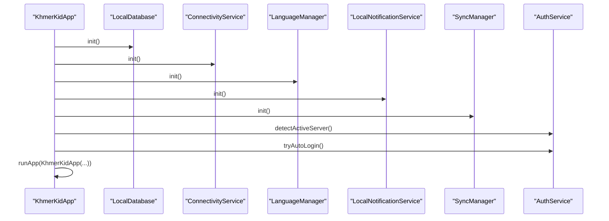
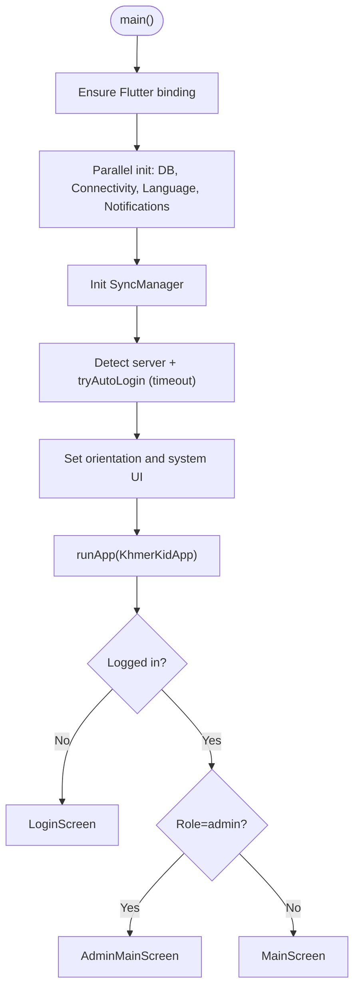
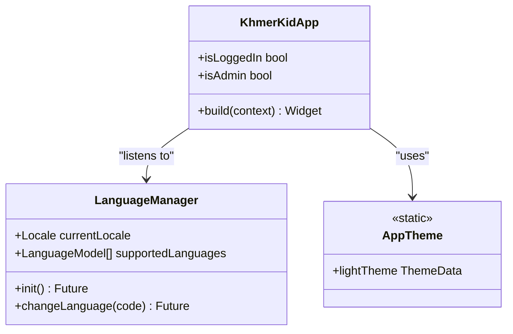
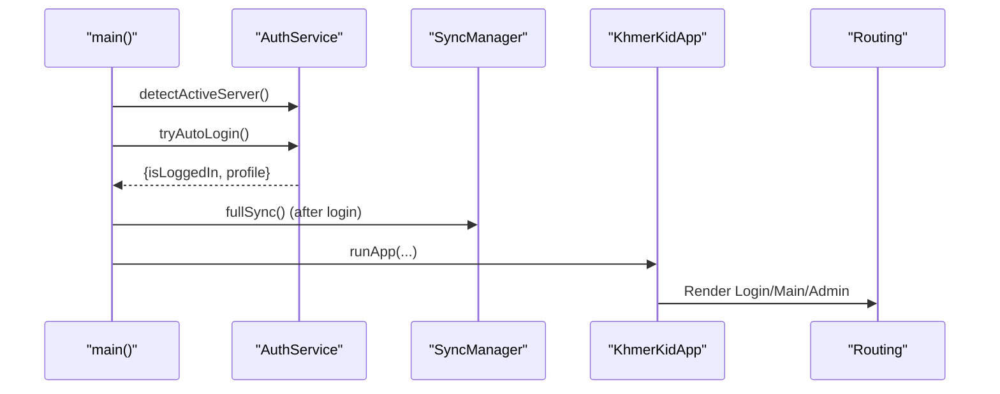
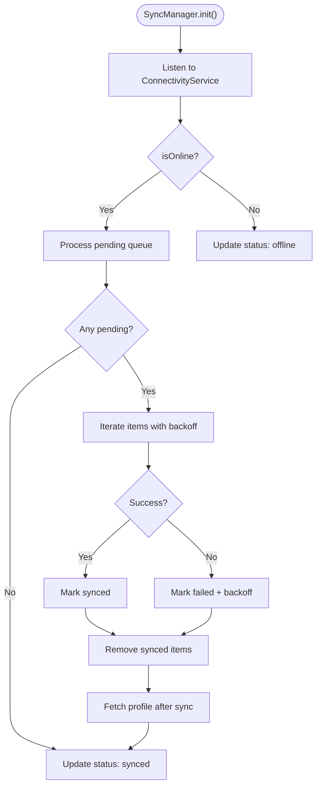
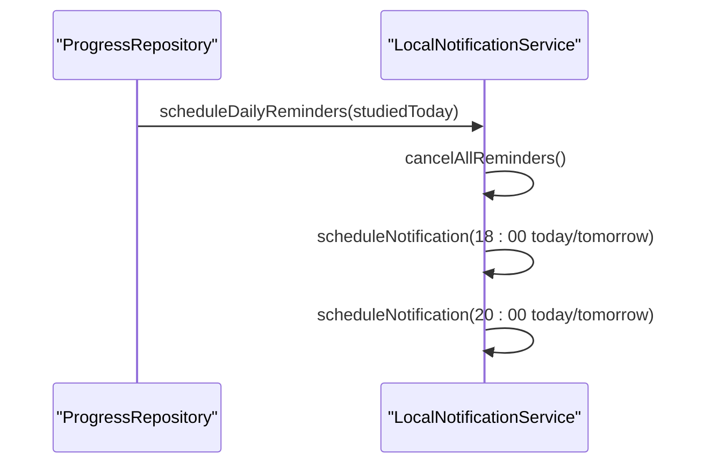
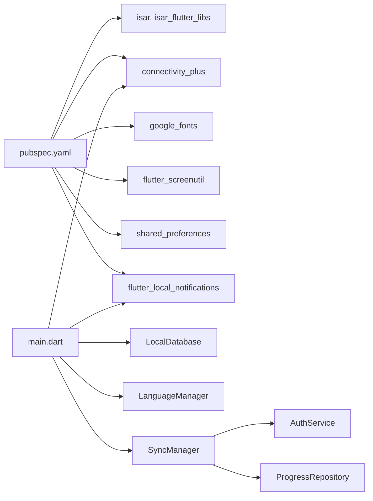

# Application Structure

<cite>
**Referenced Files in This Document**
- [main.dart](file://lib/main.dart)
- [pubspec.yaml](file://pubspec.yaml)
- [app_theme.dart](file://lib/theme/app_theme.dart)
- [language_manager.dart](file://lib/l10n/language_manager.dart)
- [local_database.dart](file://lib/data/local/local_database.dart)
- [connectivity_service.dart](file://lib/services/connectivity_service.dart)
- [sync_manager.dart](file://lib/services/sync_manager.dart)
- [auth_service.dart](file://lib/services/auth_service.dart)
- [local_notification_service.dart](file://lib/services/local_notification_service.dart)
- [progress_repository.dart](file://lib/repositories/progress_repository.dart)
- [login_screen.dart](file://lib/screens/auth/login_screen.dart)
- [main_screen.dart](file://lib/screens/main_screen.dart)
- [admin_main_screen.dart](file://lib/screens/admin/admin_main_screen.dart)
</cite>

## Table of Contents
1. [Introduction](#introduction)
2. [Project Structure](#project-structure)
3. [Core Components](#core-components)
4. [Architecture Overview](#architecture-overview)
5. [Detailed Component Analysis](#detailed-component-analysis)
6. [Dependency Analysis](#dependency-analysis)
7. [Performance Considerations](#performance-considerations)
8. [Troubleshooting Guide](#troubleshooting-guide)
9. [Conclusion](#conclusion)

## Introduction
This document explains the Flutter application’s structure and initialization process. It covers the main entry point, parallel initialization of core services, application bootstrapping, routing and conditional rendering based on authentication and roles, localization and theming, and startup optimization techniques. It also documents how components are wired together during startup and how the app supports admin and user experiences.

## Project Structure
The application follows a layered structure:
- Entry point initializes services and runs the app.
- Services encapsulate cross-cutting concerns (database, connectivity, sync, auth, notifications).
- Repositories orchestrate data flows between local and remote sources.
- Screens implement UI and navigation for user and admin experiences.
- Theme and localization are configured at the app level.

**Diagram sources**
- [main.dart:21-77](file://lib/main.dart#L21-L77)
- [local_database.dart:34-61](file://lib/data/local/local_database.dart#L34-L61)
- [connectivity_service.dart:29-53](file://lib/services/connectivity_service.dart#L29-L53)
- [sync_manager.dart:46-74](file://lib/services/sync_manager.dart#L46-L74)
- [auth_service.dart:241-317](file://lib/services/auth_service.dart#L241-L317)
- [local_notification_service.dart:16-61](file://lib/services/local_notification_service.dart#L16-L61)
- [progress_repository.dart:19-40](file://lib/repositories/progress_repository.dart#L19-L40)
- [login_screen.dart:618-636](file://lib/screens/auth/login_screen.dart#L618-L636)
- [main_screen.dart:14-88](file://lib/screens/main_screen.dart#L14-L88)
- [admin_main_screen.dart:17-80](file://lib/screens/admin/admin_main_screen.dart#L17-L80)

**Section sources**
- [main.dart:1-129](file://lib/main.dart#L1-L129)
- [pubspec.yaml:15-48](file://pubspec.yaml#L15-L48)

## Core Components
- Entry point and bootstrapping:
  - Ensures Flutter binding is initialized.
  - Runs parallel initialization for database, connectivity, language, and notifications.
  - Initializes SyncManager after prerequisites are ready.
  - Attempts server detection and auto-login with a short timeout.
  - Configures system UI and runs the app with conditional routing based on authentication and role.
- Localization and theming:
  - LanguageManager loads supported languages from assets and persists selection.
  - AppTheme defines Material 3-based design tokens and typography.
  - ScreenUtilInit enables responsive layout.
- Authentication and routing:
  - AuthService handles server discovery, token management, and profile retrieval.
  - Conditional routing renders LoginScreen, MainScreen (user), or AdminMainScreen (admin).
- Data synchronization:
  - SyncManager orchestrates online/offline detection, background sync, retries, and conflict resolution.
  - ProgressRepository manages optimistic updates, caching, and full sync.
- Notifications:
  - LocalNotificationService initializes platform channels, requests permissions, and schedules reminders.

**Section sources**
- [main.dart:21-77](file://lib/main.dart#L21-L77)
- [language_manager.dart:47-87](file://lib/l10n/language_manager.dart#L47-L87)
- [app_theme.dart:10-93](file://lib/theme/app_theme.dart#L10-L93)
- [auth_service.dart:120-175](file://lib/services/auth_service.dart#L120-L175)
- [sync_manager.dart:46-74](file://lib/services/sync_manager.dart#L46-L74)
- [progress_repository.dart:109-161](file://lib/repositories/progress_repository.dart#L109-L161)
- [local_notification_service.dart:16-61](file://lib/services/local_notification_service.dart#L16-L61)

## Architecture Overview
The app uses a hybrid offline-first architecture:
- Local Isar database stores user progress, caches lessons, and sync queue.
- ConnectivityService monitors network state.
- SyncManager coordinates background sync with exponential backoff and conflict resolution.
- AuthService manages server discovery, tokens, and profile caching.
- ProgressRepository provides optimistic UI updates and merges remote/local data.
- Screens render user or admin experiences based on authentication and role.

**Diagram sources**
- [main.dart:25-33](file://lib/main.dart#L25-L33)
- [local_database.dart:34-61](file://lib/data/local/local_database.dart#L34-L61)
- [connectivity_service.dart:29-53](file://lib/services/connectivity_service.dart#L29-L53)
- [language_manager.dart:47-87](file://lib/l10n/language_manager.dart#L47-L87)
- [local_notification_service.dart:16-61](file://lib/services/local_notification_service.dart#L16-L61)
- [sync_manager.dart:46-74](file://lib/services/sync_manager.dart#L46-L74)
- [auth_service.dart:120-175](file://lib/services/auth_service.dart#L120-L175)

## Detailed Component Analysis

### Entry Point and Bootstrapping
- Parallel initialization:
  - LocalDatabase.init(), ConnectivityService.instance.init(), LanguageManager.instance.init(), LocalNotificationService().init().
  - Ensures startup speed by avoiding sequential waits.
- Post-initialization:
  - SyncManager.instance.init() after database and connectivity are ready.
  - AuthService detects server and attempts auto-login with a bounded timeout.
  - Sets orientation and system UI style.
  - Renders either LoginScreen, MainScreen, or AdminMainScreen based on authentication and role.
- Startup optimization:
  - Uses Future.wait for concurrency.
  - Applies timeouts to avoid blocking startup.
  - Defers non-critical tasks until after UI is shown.

**Diagram sources**
- [main.dart:21-77](file://lib/main.dart#L21-L77)

**Section sources**
- [main.dart:21-77](file://lib/main.dart#L21-L77)

### Localization and Theming
- LanguageManager:
  - Loads supported languages from assets.
  - Persists and restores language preference.
  - Provides runtime switching via ChangeNotifier.
- AppTheme:
  - Defines Material 3 theme with brand colors and typography.
  - Supplies text themes and component themes.
- Responsive design:
  - ScreenUtilInit configured with design size and split-screen mode.

**Diagram sources**
- [language_manager.dart:10-110](file://lib/l10n/language_manager.dart#L10-L110)
- [app_theme.dart:7-93](file://lib/theme/app_theme.dart#L7-L93)
- [main.dart:79-128](file://lib/main.dart#L79-L128)

**Section sources**
- [language_manager.dart:47-110](file://lib/l10n/language_manager.dart#L47-L110)
- [app_theme.dart:10-93](file://lib/theme/app_theme.dart#L10-L93)
- [main.dart:91-127](file://lib/main.dart#L91-L127)

### Authentication and Routing
- AuthService:
  - Detects active server via manual override, saved URL, candidate URLs, and background subnet scan.
  - Implements auto-login with token persistence and profile caching.
  - Supports email/password and Google sign-in flows.
  - Triggers full sync and WebSocket connection upon successful login.
- Routing:
  - Conditional rendering in KhmerKidApp based on isLoggedIn and isAdmin.
  - LoginScreen navigates to MainScreen or AdminMainScreen depending on role.

**Diagram sources**
- [main.dart:35-59](file://lib/main.dart#L35-L59)
- [auth_service.dart:241-317](file://lib/services/auth_service.dart#L241-L317)
- [sync_manager.dart:189-210](file://lib/services/sync_manager.dart#L189-L210)
- [login_screen.dart:618-636](file://lib/screens/auth/login_screen.dart#L618-L636)
- [main_screen.dart:14-88](file://lib/screens/main_screen.dart#L14-L88)
- [admin_main_screen.dart:17-80](file://lib/screens/admin/admin_main_screen.dart#L17-L80)

**Section sources**
- [auth_service.dart:120-175](file://lib/services/auth_service.dart#L120-L175)
- [auth_service.dart:241-317](file://lib/services/auth_service.dart#L241-L317)
- [login_screen.dart:618-636](file://lib/screens/auth/login_screen.dart#L618-L636)
- [main.dart:119-121](file://lib/main.dart#L119-L121)

### Data Synchronization and Offline-First
- SyncManager:
  - Subscribes to connectivity changes and triggers background sync.
  - Processes pending queue with retry and exponential backoff.
  - Updates status stream and refreshes profile after successful sync.
- ProgressRepository:
  - Optimistic UI updates for lesson completion.
  - Maintains a RAM cache for completed lessons.
  - Performs full bidirectional sync with conflict resolution and order healing.

**Diagram sources**
- [sync_manager.dart:46-155](file://lib/services/sync_manager.dart#L46-L155)
- [progress_repository.dart:109-161](file://lib/repositories/progress_repository.dart#L109-L161)

**Section sources**
- [sync_manager.dart:46-236](file://lib/services/sync_manager.dart#L46-L236)
- [progress_repository.dart:19-93](file://lib/repositories/progress_repository.dart#L19-L93)

### Notifications and Reminders
- LocalNotificationService:
  - Initializes platform-specific settings and requests permissions.
  - Schedules daily reminders with timezone awareness.
  - Cancels existing reminders before scheduling new ones.

**Diagram sources**
- [progress_repository.dart:159-161](file://lib/repositories/progress_repository.dart#L159-L161)
- [local_notification_service.dart:210-261](file://lib/services/local_notification_service.dart#L210-L261)

**Section sources**
- [local_notification_service.dart:16-61](file://lib/services/local_notification_service.dart#L16-L61)
- [local_notification_service.dart:210-261](file://lib/services/local_notification_service.dart#L210-L261)

## Dependency Analysis
- External dependencies (selected):
  - Isar for local database.
  - ConnectivityPlus for network monitoring.
  - Google Fonts and ScreenUtil for typography and responsive layout.
  - Shared preferences for persistence.
  - Flutter Local Notifications for reminders.
- Internal dependencies:
  - AuthService depends on SharedPreferences and HTTP client.
  - SyncManager depends on ConnectivityService and ProgressRemoteDataSource.
  - ProgressRepository depends on Local and Remote DataSources and SyncQueue.
  - Screens depend on services and repositories for state and navigation.

**Diagram sources**
- [pubspec.yaml:15-48](file://pubspec.yaml#L15-L48)
- [main.dart:1-18](file://lib/main.dart#L1-L18)
- [sync_manager.dart:1-11](file://lib/services/sync_manager.dart#L1-L11)
- [auth_service.dart:1-13](file://lib/services/auth_service.dart#L1-L13)
- [progress_repository.dart:1-16](file://lib/repositories/progress_repository.dart#L1-L16)

**Section sources**
- [pubspec.yaml:15-48](file://pubspec.yaml#L15-L48)
- [main.dart:1-18](file://lib/main.dart#L1-L18)

## Performance Considerations
- Concurrency:
  - Use Future.wait for parallel initialization to reduce startup time.
- Network resilience:
  - Apply timeouts for server detection and auto-login to prevent UI stalls.
- Background sync:
  - Use periodic timers and connectivity-triggered sync to keep data fresh without blocking UI.
- Optimistic UI:
  - Update UI immediately on user actions while queuing remote sync.
- Memory management:
  - Dispose streams and subscriptions in services and repositories to avoid leaks.

## Troubleshooting Guide
- Auto-login failures:
  - Verify server reachability and token validity; fallback to cached profile when offline.
- Sync errors:
  - Inspect SyncManager status stream and retry logic; ensure connectivity is restored.
- Notification scheduling:
  - Confirm permissions are granted and timezone is initialized; cancel stale notifications before scheduling.
- Language switching:
  - Ensure supported languages list is loaded and persisted correctly.

**Section sources**
- [auth_service.dart:241-317](file://lib/services/auth_service.dart#L241-L317)
- [sync_manager.dart:226-235](file://lib/services/sync_manager.dart#L226-L235)
- [local_notification_service.dart:16-61](file://lib/services/local_notification_service.dart#L16-L61)
- [language_manager.dart:47-87](file://lib/l10n/language_manager.dart#L47-L87)

## Conclusion
The application employs a robust, layered architecture with parallel initialization, offline-first data sync, and role-based routing. By centralizing services and repositories, it achieves fast startup, resilient networking, and a consistent user experience across user and admin roles. The design emphasizes responsiveness, maintainability, and scalability for future enhancements.