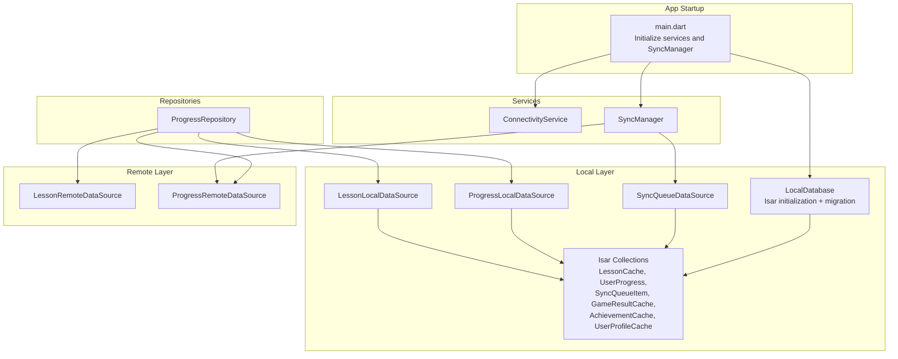
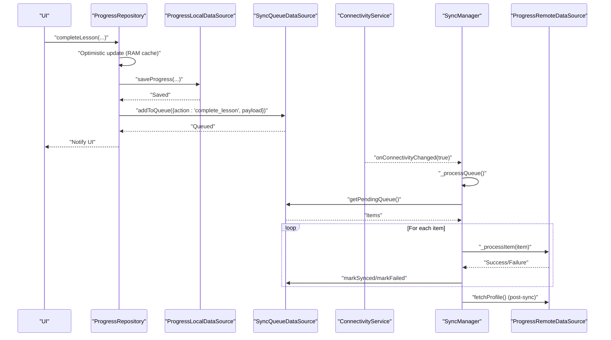
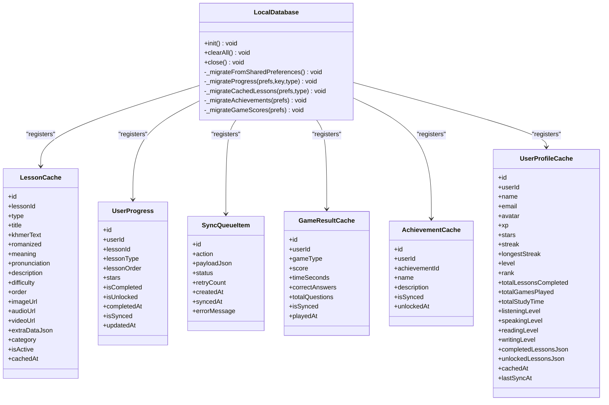
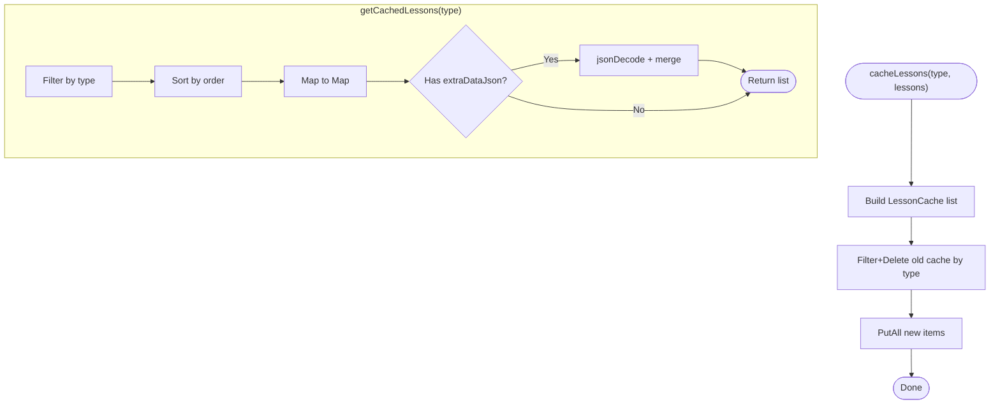
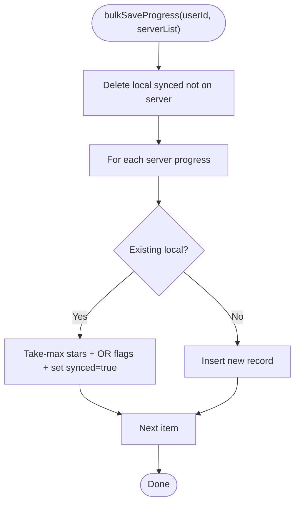
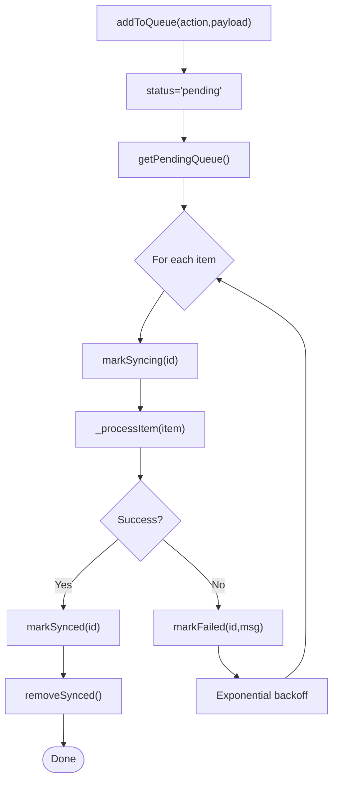
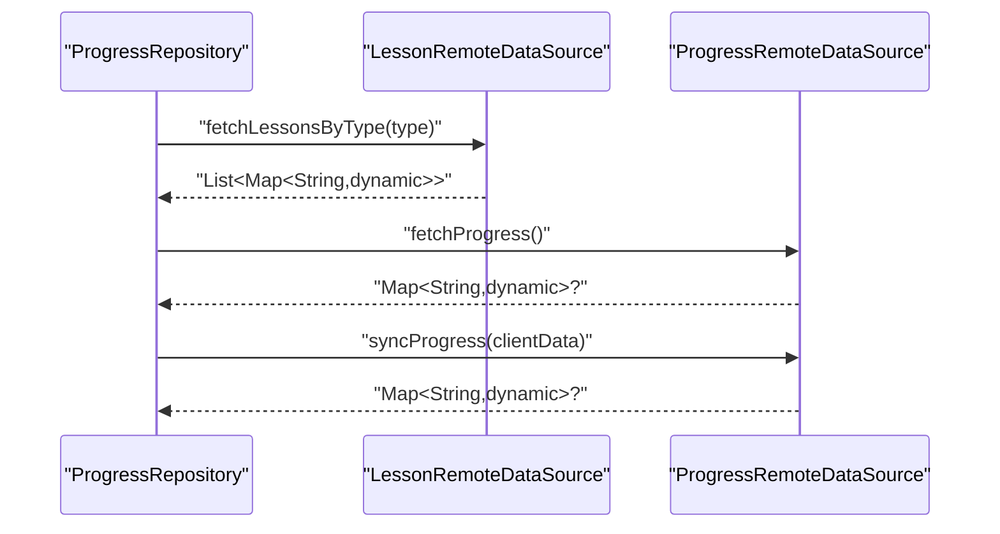
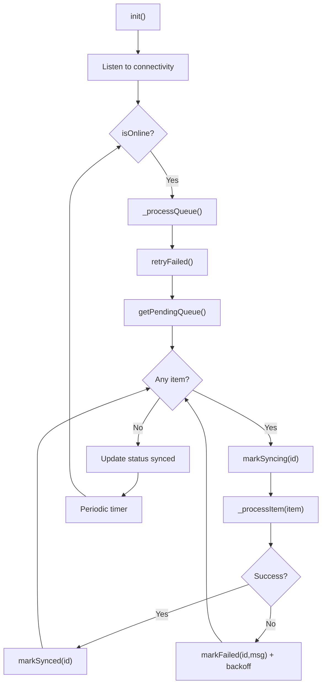
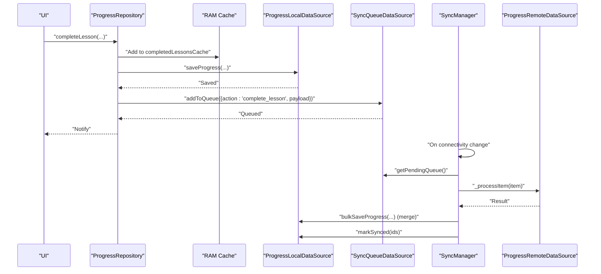
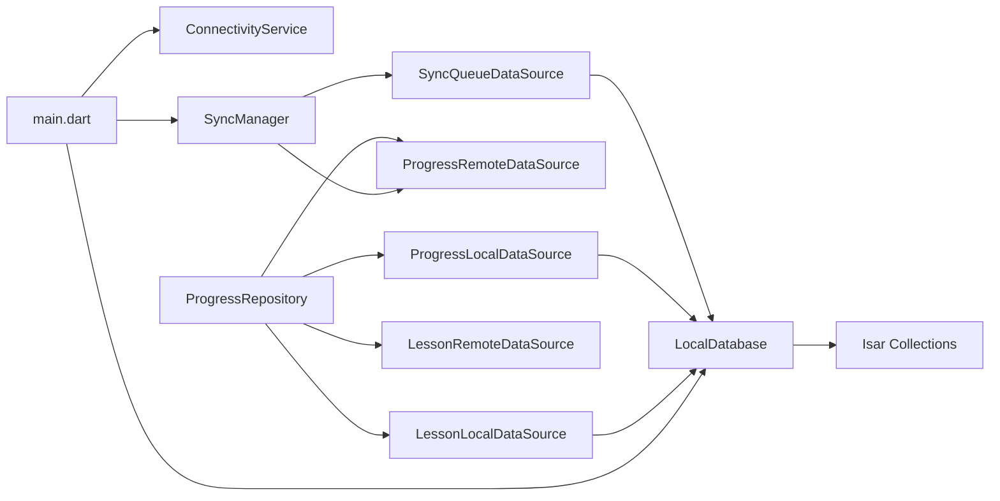

# Data Management

<cite>
**Referenced Files in This Document**
- [main.dart](file://lib/main.dart)
- [local_database.dart](file://lib/data/local/local_database.dart)
- [isar_models.dart](file://lib/data/local/isar_models.dart)
- [lesson_local_datasource.dart](file://lib/data/local/lesson_local_datasource.dart)
- [progress_local_datasource.dart](file://lib/data/local/progress_local_datasource.dart)
- [sync_queue_datasource.dart](file://lib/data/local/sync_queue_datasource.dart)
- [lesson_remote_datasource.dart](file://lib/data/remote/lesson_remote_datasource.dart)
- [progress_remote_datasource.dart](file://lib/data/remote/progress_remote_datasource.dart)
- [sync_manager.dart](file://lib/services/sync_manager.dart)
- [connectivity_service.dart](file://lib/services/connectivity_service.dart)
- [progress_repository.dart](file://lib/repositories/progress_repository.dart)
</cite>

## Table of Contents
1. [Introduction](#introduction)
2. [Project Structure](#project-structure)
3. [Core Components](#core-components)
4. [Architecture Overview](#architecture-overview)
5. [Detailed Component Analysis](#detailed-component-analysis)
6. [Dependency Analysis](#dependency-analysis)
7. [Performance Considerations](#performance-considerations)
8. [Troubleshooting Guide](#troubleshooting-guide)
9. [Conclusion](#conclusion)

## Introduction
This document describes the data management architecture of the application with a focus on Isar database integration, local caching strategies, and remote data synchronization. It explains the data layer pattern, datasource abstractions, and offline-first principles. It also documents the local database schema, query operations, data migration strategies, sync queue management, conflict resolution mechanisms, data consistency patterns, model definitions, validation rules, serialization/deserialization processes, and practical examples of data access patterns and performance optimizations.

## Project Structure
The data layer is organized around:
- Local persistence: Isar collections for lessons, progress, sync queue, game results, achievements, and user profiles.
- Remote APIs: HTTP clients for lessons and progress endpoints.
- Services: Connectivity monitoring and centralized sync orchestration.
- Repositories: Business logic orchestrating offline-first flows and merging local with remote data.

**Diagram sources**
- [main.dart:21-34](file://lib/main.dart#L21-L34)
- [local_database.dart:34-61](file://lib/data/local/local_database.dart#L34-L61)
- [isar_models.dart:8-265](file://lib/data/local/isar_models.dart#L8-L265)
- [lesson_local_datasource.dart:8-161](file://lib/data/local/lesson_local_datasource.dart#L8-L161)
- [progress_local_datasource.dart:8-323](file://lib/data/local/progress_local_datasource.dart#L8-L323)
- [sync_queue_datasource.dart:9-126](file://lib/data/local/sync_queue_datasource.dart#L9-L126)
- [lesson_remote_datasource.dart:7-80](file://lib/data/remote/lesson_remote_datasource.dart#L7-L80)
- [progress_remote_datasource.dart:7-144](file://lib/data/remote/progress_remote_datasource.dart#L7-L144)
- [sync_manager.dart:21-74](file://lib/services/sync_manager.dart#L21-L74)
- [connectivity_service.dart:6-53](file://lib/services/connectivity_service.dart#L6-L53)
- [progress_repository.dart:19-40](file://lib/repositories/progress_repository.dart#L19-L40)

**Section sources**
- [main.dart:21-34](file://lib/main.dart#L21-L34)
- [local_database.dart:34-61](file://lib/data/local/local_database.dart#L34-L61)
- [isar_models.dart:8-265](file://lib/data/local/isar_models.dart#L8-L265)

## Core Components
- LocalDatabase: Singleton Isar initializer, schema registration, migration from SharedPreferences, and lifecycle controls.
- Isar Models: Typed collection schemas for lessons, progress, sync queue, game results, achievements, and user profiles.
- Local DataSources: Encapsulate CRUD and queries for each collection.
- Remote DataSources: HTTP clients for lessons and progress endpoints.
- SyncManager: Orchestrates connectivity-aware sync, queue processing, retries, and post-sync refresh.
- ConnectivityService: Broadcasts online/offline state.
- ProgressRepository: Implements offline-first logic, optimistic updates, RAM cache for completed lessons, and bidirectional sync.

**Section sources**
- [local_database.dart:10-61](file://lib/data/local/local_database.dart#L10-L61)
- [isar_models.dart:8-265](file://lib/data/local/isar_models.dart#L8-L265)
- [lesson_local_datasource.dart:8-161](file://lib/data/local/lesson_local_datasource.dart#L8-L161)
- [progress_local_datasource.dart:8-323](file://lib/data/local/progress_local_datasource.dart#L8-L323)
- [sync_queue_datasource.dart:9-126](file://lib/data/local/sync_queue_datasource.dart#L9-L126)
- [lesson_remote_datasource.dart:7-80](file://lib/data/remote/lesson_remote_datasource.dart#L7-L80)
- [progress_remote_datasource.dart:7-144](file://lib/data/remote/progress_remote_datasource.dart#L7-L144)
- [sync_manager.dart:21-74](file://lib/services/sync_manager.dart#L21-L74)
- [connectivity_service.dart:6-53](file://lib/services/connectivity_service.dart#L6-L53)
- [progress_repository.dart:19-40](file://lib/repositories/progress_repository.dart#L19-L40)

## Architecture Overview
The system follows an offline-first pattern:
- Local Isar stores lessons, progress, sync queue, and caches.
- Remote APIs serve as the source of truth.
- SyncManager coordinates background sync when online, with retry and backoff.
- ProgressRepository optimistically updates UI and maintains a RAM cache of completed lessons.

**Diagram sources**
- [progress_repository.dart:109-161](file://lib/repositories/progress_repository.dart#L109-L161)
- [progress_local_datasource.dart:13-60](file://lib/data/local/progress_local_datasource.dart#L13-L60)
- [sync_queue_datasource.dart:12-27](file://lib/data/local/sync_queue_datasource.dart#L12-L27)
- [connectivity_service.dart:22-50](file://lib/services/connectivity_service.dart#L22-L50)
- [sync_manager.dart:76-155](file://lib/services/sync_manager.dart#L76-L155)
- [progress_remote_datasource.dart:71-112](file://lib/data/remote/progress_remote_datasource.dart#L71-L112)

## Detailed Component Analysis

### Local Database and Schema
- Initialization registers collections and opens the database in the app’s documents directory.
- One-time migration reads SharedPreferences keys and writes Isar records for progress, cached lessons, achievements, and game scores.
- Clear and close routines manage lifecycle and cleanup.

**Diagram sources**
- [local_database.dart:34-61](file://lib/data/local/local_database.dart#L34-L61)
- [isar_models.dart:8-265](file://lib/data/local/isar_models.dart#L8-L265)

**Section sources**
- [local_database.dart:34-61](file://lib/data/local/local_database.dart#L34-L61)
- [isar_models.dart:8-265](file://lib/data/local/isar_models.dart#L8-L265)

### Lesson Cache Data Access
- Caching: Converts incoming lesson lists to LessonCache entities and replaces prior cache for the given type.
- Retrieval: Returns typed lesson lists with optional extra data parsed from JSON.
- Utility: Clear cache by type or globally, existence checks.

**Diagram sources**
- [lesson_local_datasource.dart:11-96](file://lib/data/local/lesson_local_datasource.dart#L11-L96)

**Section sources**
- [lesson_local_datasource.dart:11-161](file://lib/data/local/lesson_local_datasource.dart#L11-L161)

### Progress Data Access and Offline-First Logic
- Save/merge: Upserts progress with take-max strategy for stars and OR semantics for completion/unlock flags.
- Bulk sync: Deletes legacy synced records not present on server, merges server data with take-max, marks synced, and updates timestamps.
- Queries: Get completed/unlocked IDs, per-type progress, counts, and maps.
- Profile cache: Stores user profile snapshot with JSON arrays for completed/unlocked lesson IDs.
- Cleanup: Clear user data across progress, profile, achievements, and game results.

**Diagram sources**
- [progress_local_datasource.dart:62-138](file://lib/data/local/progress_local_datasource.dart#L62-L138)

**Section sources**
- [progress_local_datasource.dart:13-323](file://lib/data/local/progress_local_datasource.dart#L13-L323)

### Sync Queue Management
- Enqueue: Adds actions with JSON payloads and pending status.
- Dequeue: Retrieves pending and failed items with retry limits.
- Status transitions: Mark syncing, synced, failed with retry count and error messages.
- Maintenance: Retry failed items, remove synced items, count pending+failed, clear queue, parse payloads.

**Diagram sources**
- [sync_queue_datasource.dart:12-101](file://lib/data/local/sync_queue_datasource.dart#L12-L101)
- [sync_manager.dart:76-155](file://lib/services/sync_manager.dart#L76-L155)

**Section sources**
- [sync_queue_datasource.dart:12-126](file://lib/data/local/sync_queue_datasource.dart#L12-L126)
- [sync_manager.dart:76-155](file://lib/services/sync_manager.dart#L76-L155)

### Remote Data Sources
- Lessons: Fetch by type and single lesson by ID with ObjectId validation; supports optional auth header.
- Progress: Fetch all progress and bidirectional sync; complete/unlock endpoints.

**Diagram sources**
- [lesson_remote_datasource.dart:10-47](file://lib/data/remote/lesson_remote_datasource.dart#L10-L47)
- [progress_remote_datasource.dart:10-69](file://lib/data/remote/progress_remote_datasource.dart#L10-L69)
- [progress_repository.dart:41-93](file://lib/repositories/progress_repository.dart#L41-L93)

**Section sources**
- [lesson_remote_datasource.dart:10-80](file://lib/data/remote/lesson_remote_datasource.dart#L10-L80)
- [progress_remote_datasource.dart:10-144](file://lib/data/remote/progress_remote_datasource.dart#L10-L144)
- [progress_repository.dart:41-93](file://lib/repositories/progress_repository.dart#L41-L93)

### Sync Orchestration and Conflict Resolution
- Connectivity-driven: On online events, process queue; periodic sync every 5 minutes while online.
- Item processing: Dispatch by action type; analytics events are treated as best-effort.
- Retry/backoff: Exponential backoff capped at 30 seconds; failed items retried up to a limit.
- Post-sync refresh: Fetch latest profile after successful sync.
- Conflict resolution: Take-max for stars; OR for completion/unlock flags; lesson order healing via lesson metadata.

**Diagram sources**
- [sync_manager.dart:46-74](file://lib/services/sync_manager.dart#L46-L74)
- [sync_manager.dart:76-155](file://lib/services/sync_manager.dart#L76-L155)

**Section sources**
- [sync_manager.dart:21-246](file://lib/services/sync_manager.dart#L21-L246)

### Repository Pattern and Offline-First Implementation
- Optimistic UI: Immediately updates stars/xp and marks lessons completed in RAM cache.
- Local persistence: Saves progress immediately to Isar; queues remote sync.
- Memory cache: Maintains a RAM list of completed lessons for fast UI updates and queries.
- Bidirectional sync: Sends local unsynced progress to server and merges server result back to Isar; heals lesson orders when missing.
- Profile cache: Persists server-provided profile snapshots for offline access.

**Diagram sources**
- [progress_repository.dart:109-161](file://lib/repositories/progress_repository.dart#L109-L161)
- [progress_repository.dart:260-346](file://lib/repositories/progress_repository.dart#L260-L346)
- [progress_local_datasource.dart:62-138](file://lib/data/local/progress_local_datasource.dart#L62-L138)
- [sync_manager.dart:157-186](file://lib/services/sync_manager.dart#L157-L186)

**Section sources**
- [progress_repository.dart:19-416](file://lib/repositories/progress_repository.dart#L19-L416)

## Dependency Analysis
- main.dart initializes LocalDatabase, ConnectivityService, LanguageManager, LocalNotificationService, and SyncManager.
- SyncManager depends on SyncQueueDataSource and ProgressRemoteDataSource; listens to ConnectivityService.
- ProgressRepository composes ProgressLocalDataSource, LessonRemoteDataSource, ProgressRemoteDataSource, and SyncQueueDataSource.
- Local data sources depend on LocalDatabase and Isar collections.

**Diagram sources**
- [main.dart:21-34](file://lib/main.dart#L21-L34)
- [sync_manager.dart:24-25](file://lib/services/sync_manager.dart#L24-L25)
- [progress_repository.dart:22-24](file://lib/repositories/progress_repository.dart#L22-L24)

**Section sources**
- [main.dart:21-34](file://lib/main.dart#L21-L34)
- [sync_manager.dart:24-25](file://lib/services/sync_manager.dart#L24-L25)
- [progress_repository.dart:22-24](file://lib/repositories/progress_repository.dart#L22-L24)

## Performance Considerations
- Use Isar indexes on frequently filtered fields (e.g., userId, lessonId, lessonType, status) to speed up queries.
- Batch writes: Prefer write transactions and putAll for bulk inserts/updates.
- Minimize JSON parsing overhead: Keep extra data compact and parse lazily when needed.
- Optimize sync frequency: Leverage periodic sync and connectivity-triggered sync to avoid redundant network calls.
- RAM cache: Use in-memory cache for completed lessons to reduce local DB reads during UI updates.
- Backoff strategy: Exponential backoff prevents thundering herds and reduces server load.

## Troubleshooting Guide
- Connectivity flapping: Verify ConnectivityService broadcasts correct state and SyncManager handles transitions gracefully.
- Sync failures: Inspect SyncQueueItem status and error messages; review exponential backoff behavior and retry limits.
- Data inconsistencies: Confirm take-max and OR merge strategies; ensure lesson order healing runs for ObjectId-backed lessons.
- Migration errors: Check SharedPreferences migration logs and ensure keys exist before migration.
- Queue backlog: Use getPendingCount and periodic sync to recover from prolonged offline periods.

**Section sources**
- [connectivity_service.dart:22-50](file://lib/services/connectivity_service.dart#L22-L50)
- [sync_manager.dart:118-125](file://lib/services/sync_manager.dart#L118-L125)
- [sync_queue_datasource.dart:38-46](file://lib/data/local/sync_queue_datasource.dart#L38-L46)
- [local_database.dart:104-108](file://lib/data/local/local_database.dart#L104-L108)
- [progress_local_datasource.dart:110-115](file://lib/data/local/progress_local_datasource.dart#L110-L115)

## Conclusion
The data management architecture combines Isar for robust local persistence, a well-defined datasource abstraction, and a centralized sync manager to deliver an offline-first experience. The design emphasizes resilience through queue-based sync, conflict-free merge strategies, and optimistic UI updates. Together with structured migrations and connectivity-aware orchestration, the system ensures consistent, performant data handling across online and offline scenarios.