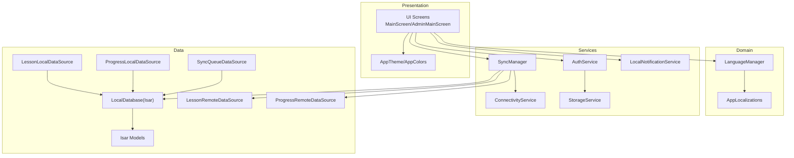
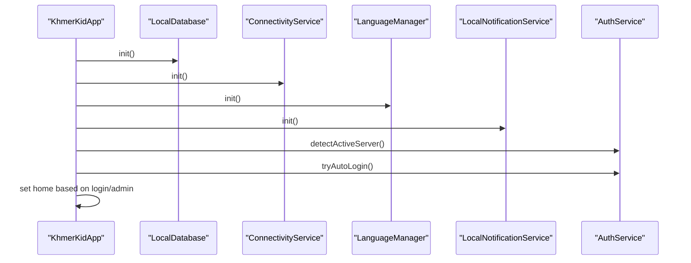
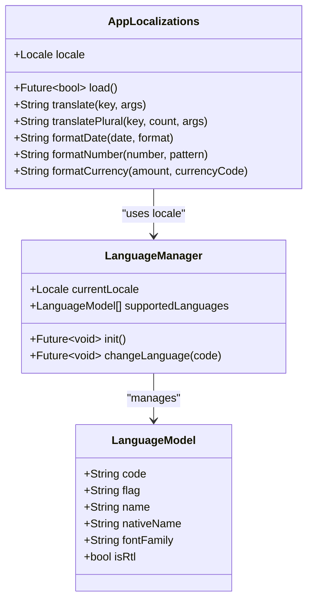
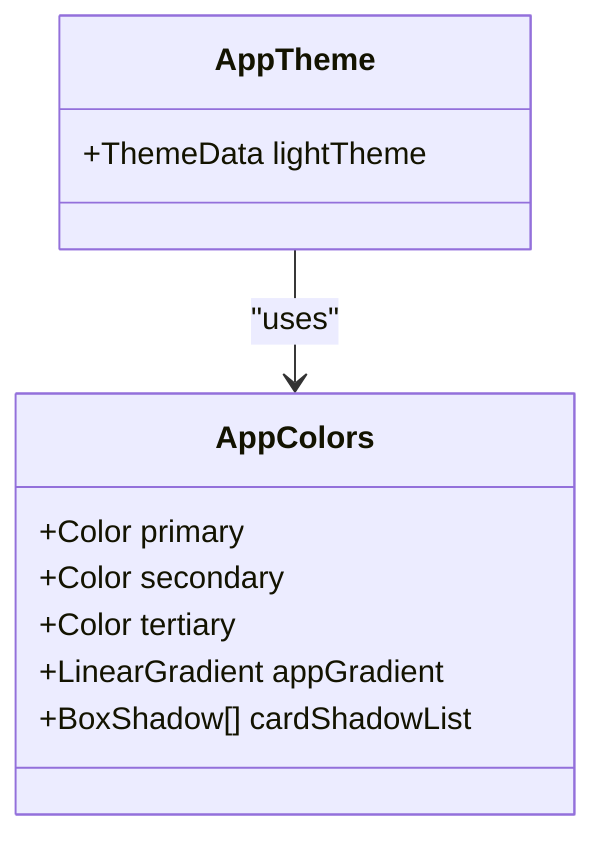
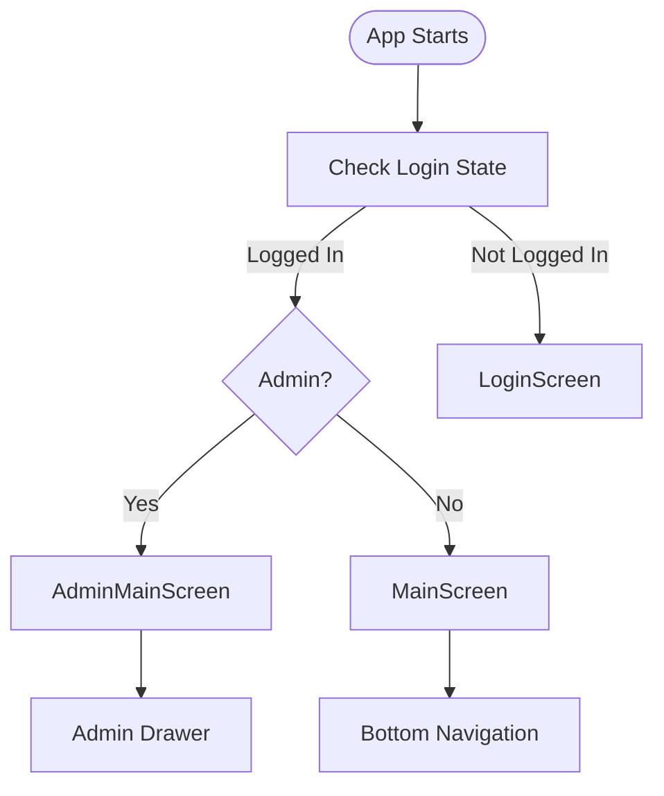
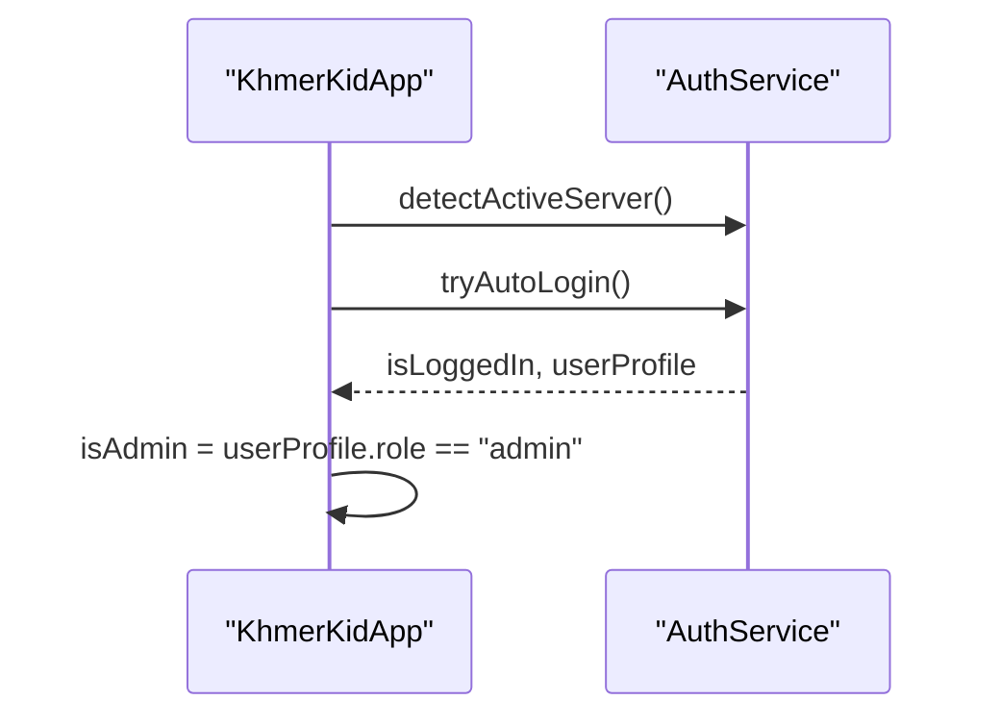
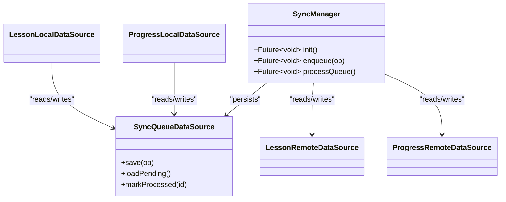
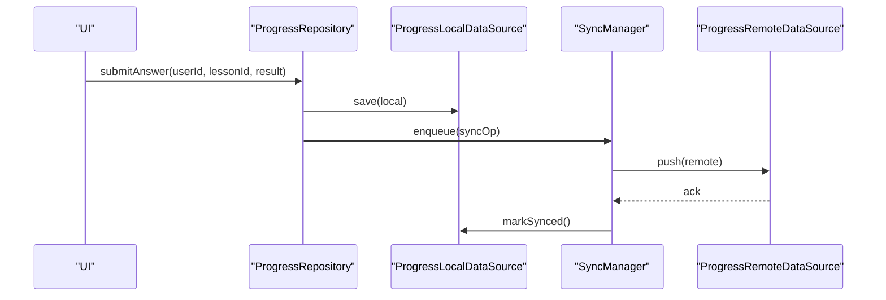

# Frontend Application (Flutter)

<cite>
**Referenced Files in This Document**
- [main.dart](file://lib/main.dart)
- [pubspec.yaml](file://pubspec.yaml)
- [app_colors.dart](file://lib/constants/app_colors.dart)
- [app_theme.dart](file://lib/theme/app_theme.dart)
- [app_localizations.dart](file://lib/l10n/app_localizations.dart)
- [language_manager.dart](file://lib/l10n/language_manager.dart)
- [language_model.dart](file://lib/l10n/models/language_model.dart)
- [local_database.dart](file://lib/data/local/local_database.dart)
- [isar_models.dart](file://lib/data/local/isar_models.dart)
- [lesson_local_datasource.dart](file://lib/data/local/lesson_local_datasource.dart)
- [progress_local_datasource.dart](file://lib/data/local/progress_local_datasource.dart)
- [sync_queue_datasource.dart](file://lib/data/local/sync_queue_datasource.dart)
- [lesson_remote_datasource.dart](file://lib/data/remote/lesson_remote_datasource.dart)
- [progress_remote_datasource.dart](file://lib/data/remote/progress_remote_datasource.dart)
- [connectivity_service.dart](file://lib/services/connectivity_service.dart)
- [sync_manager.dart](file://lib/services/sync_manager.dart)
- [auth_service.dart](file://lib/services/auth_service.dart)
- [local_notification_service.dart](file://lib/services/local_notification_service.dart)
- [storage_service.dart](file://lib/services/storage_service.dart)
- [main_screen.dart](file://lib/screens/main_screen.dart)
- [admin_main_screen.dart](file://lib/screens/admin/admin_main_screen.dart)
- [progress_repository.dart](file://lib/repositories/progress_repository.dart)
</cite>

## Table of Contents
1. [Introduction](#introduction)
2. [Project Structure](#project-structure)
3. [Core Components](#core-components)
4. [Architecture Overview](#architecture-overview)
5. [Detailed Component Analysis](#detailed-component-analysis)
6. [Dependency Analysis](#dependency-analysis)
7. [Performance Considerations](#performance-considerations)
8. [Troubleshooting Guide](#troubleshooting-guide)
9. [Conclusion](#conclusion)

## Introduction
This document describes the Flutter frontend application for the KhmerKid educational platform. It covers application structure, screen architecture, state management patterns, widget organization, service layer (authentication, synchronization, connectivity, notifications), data layer (Isar database, local caching, remote synchronization), internationalization system, UI component library, and integration with backend services. The goal is to provide a comprehensive understanding suitable for both technical and non-technical stakeholders.

## Project Structure
The Flutter application follows a layered architecture with clear separation of concerns:
- Entry point initializes services, database, connectivity, language, and notifications, then launches the app.
- UI is organized around a main screen with bottom navigation and an admin variant.
- Internationalization is handled via JSON-backed localization delegates and a language manager.
- Data layer uses Isar for offline-first persistence with a sync manager coordinating remote synchronization.
- Services encapsulate authentication, connectivity detection, local notifications, and storage.

```mermaid
graph TB
subgraph "Entry Point"
MAIN["lib/main.dart"]
end
subgraph "UI Layer"
MS["lib/screens/main_screen.dart"]
AMS["lib/screens/admin/admin_main_screen.dart"]
THEME["lib/theme/app_theme.dart"]
COLORS["lib/constants/app_colors.dart"]
end
subgraph "Internationalization"
LM["lib/l10n/language_manager.dart"]
AL["lib/l10n/app_localizations.dart"]
LMODEL["lib/l10n/models/language_model.dart"]
end
subgraph "Services"
AUTH["lib/services/auth_service.dart"]
CONN["lib/services/connectivity_service.dart"]
SYNC["lib/services/sync_manager.dart"]
NOTIF["lib/services/local_notification_service.dart"]
STORE["lib/services/storage_service.dart"]
end
subgraph "Data Layer"
DB["lib/data/local/local_database.dart"]
ISAR["lib/data/local/isar_models.dart"]
LLESS["lib/data/local/lesson_local_datasource.dart"]
LPROG["lib/data/local/progress_local_datasource.dart"]
SQ["lib/data/local/sync_queue_datasource.dart"]
RLESS["lib/data/remote/lesson_remote_datasource.dart"]
RPROG["lib/data/remote/progress_remote_datasource.dart"]
REPO["lib/repositories/progress_repository.dart"]
end
MAIN --> MS
MAIN --> AMS
MAIN --> THEME
MAIN --> COLORS
MAIN --> LM
MAIN --> AUTH
MAIN --> CONN
MAIN --> SYNC
MAIN --> NOTIF
MAIN --> DB
MS --> THEME
AMS --> THEME
LM --> AL
LM --> LMODEL
AUTH --> STORE
SYNC --> DB
SYNC --> CONN
SYNC --> RLESS
SYNC --> RPROG
DB --> ISAR
LLESS --> DB
LPROG --> DB
SQ --> DB
RLESS --> AUTH
RPROG --> AUTH
REPO --> LPROG
```



**Diagram sources**
- [main.dart:1-129](file://lib/main.dart#L1-L129)
- [main_screen.dart:1-47](file://lib/screens/main_screen.dart#L1-L47)
- [admin_main_screen.dart:17-122](file://lib/screens/admin/admin_main_screen.dart#L17-L122)
- [app_theme.dart:1-95](file://lib/theme/app_theme.dart#L1-L95)
- [app_colors.dart:1-218](file://lib/constants/app_colors.dart#L1-L218)
- [language_manager.dart:1-111](file://lib/l10n/language_manager.dart#L1-L111)
- [app_localizations.dart:1-314](file://lib/l10n/app_localizations.dart#L1-L314)
- [language_model.dart:1-200](file://lib/l10n/models/language_model.dart#L1-L200)
- [auth_service.dart](file://lib/services/auth_service.dart)
- [connectivity_service.dart](file://lib/services/connectivity_service.dart)
- [sync_manager.dart](file://lib/services/sync_manager.dart)
- [local_notification_service.dart](file://lib/services/local_notification_service.dart)
- [storage_service.dart](file://lib/services/storage_service.dart)
- [local_database.dart](file://lib/data/local/local_database.dart)
- [isar_models.dart](file://lib/data/local/isar_models.dart)
- [lesson_local_datasource.dart](file://lib/data/local/lesson_local_datasource.dart)
- [progress_local_datasource.dart](file://lib/data/local/progress_local_datasource.dart)
- [sync_queue_datasource.dart](file://lib/data/local/sync_queue_datasource.dart)
- [lesson_remote_datasource.dart](file://lib/data/remote/lesson_remote_datasource.dart)
- [progress_remote_datasource.dart](file://lib/data/remote/progress_remote_datasource.dart)
- [progress_repository.dart](file://lib/repositories/progress_repository.dart)

**Section sources**
- [main.dart:1-129](file://lib/main.dart#L1-L129)
- [pubspec.yaml:1-115](file://pubspec.yaml#L1-L115)

## Core Components
- Entry point and initialization:
  - Initializes Isar database, connectivity, language manager, and local notifications concurrently.
  - Detects active server, attempts auto-login, determines admin role, schedules daily reminders for non-admin users, fixes orientation and status bar, and runs the app.
- UI shell:
  - MaterialApp configured with ScreenUtil for responsive design, localized delegates, and dynamic theme based on language.
  - Home screen selection depends on login state and role.
- Internationalization:
  - AppLocalizations loads JSON translations per locale with nested key support and pluralization.
  - LanguageManager manages supported languages, persists user choice, and notifies UI for real-time updates.
- Theming and design system:
  - AppTheme defines Material 3 light theme with custom color scheme, typography, and component styles.
  - AppColors centralizes semantic colors, gradients, and shadows.

**Section sources**
- [main.dart:21-77](file://lib/main.dart#L21-L77)
- [main.dart:90-127](file://lib/main.dart#L90-L127)
- [app_localizations.dart:8-167](file://lib/l10n/app_localizations.dart#L8-L167)
- [language_manager.dart:10-110](file://lib/l10n/language_manager.dart#L10-L110)
- [app_theme.dart:10-93](file://lib/theme/app_theme.dart#L10-L93)
- [app_colors.dart:10-218](file://lib/constants/app_colors.dart#L10-L218)

## Architecture Overview
The application adopts a hybrid offline-first architecture:
- Offline-first with Isar for local persistence.
- Sync manager coordinates queue-based synchronization with remote APIs.
- Connectivity service monitors network availability.
- Authentication service handles server detection, auto-login, and user profile retrieval.
- Notifications service schedules reminders and manages local alerts.
- UI built with responsive design and Material 3 theming.



**Diagram sources**
- [main.dart:1-129](file://lib/main.dart#L1-L129)
- [language_manager.dart:1-111](file://lib/l10n/language_manager.dart#L1-L111)
- [app_localizations.dart:1-314](file://lib/l10n/app_localizations.dart#L1-L314)
- [app_theme.dart:1-95](file://lib/theme/app_theme.dart#L1-L95)
- [app_colors.dart:1-218](file://lib/constants/app_colors.dart#L1-L218)
- [auth_service.dart](file://lib/services/auth_service.dart)
- [connectivity_service.dart](file://lib/services/connectivity_service.dart)
- [sync_manager.dart](file://lib/services/sync_manager.dart)
- [local_notification_service.dart](file://lib/services/local_notification_service.dart)
- [storage_service.dart](file://lib/services/storage_service.dart)
- [local_database.dart](file://lib/data/local/local_database.dart)
- [isar_models.dart](file://lib/data/local/isar_models.dart)
- [lesson_local_datasource.dart](file://lib/data/local/lesson_local_datasource.dart)
- [progress_local_datasource.dart](file://lib/data/local/progress_local_datasource.dart)
- [sync_queue_datasource.dart](file://lib/data/local/sync_queue_datasource.dart)
- [lesson_remote_datasource.dart](file://lib/data/remote/lesson_remote_datasource.dart)
- [progress_remote_datasource.dart](file://lib/data/remote/progress_remote_datasource.dart)

## Detailed Component Analysis

### Entry Point and App Shell
- Concurrent initialization of database, connectivity, language, and notifications.
- Auto-login flow with server detection and admin role determination.
- Orientation and status bar configuration.
- Dynamic theme and font family selection based on current language.



**Diagram sources**
- [main.dart:24-77](file://lib/main.dart#L24-L77)

**Section sources**
- [main.dart:21-77](file://lib/main.dart#L21-L77)

### Internationalization System
- AppLocalizations:
  - Loads locale-specific JSON files from assets.
  - Supports nested keys and parameterized placeholders.
  - Provides pluralization and formatting for dates, numbers, and currencies using the intl package.
- LanguageManager:
  - Reads supported languages from a JSON configuration.
  - Persists user language preference via StorageService.
  - Notifies listeners to rebuild UI with new locale and font family.



**Diagram sources**
- [language_manager.dart:10-110](file://lib/l10n/language_manager.dart#L10-L110)
- [app_localizations.dart:8-167](file://lib/l10n/app_localizations.dart#L8-L167)
- [language_model.dart:1-200](file://lib/l10n/models/language_model.dart#L1-L200)

**Section sources**
- [app_localizations.dart:20-167](file://lib/l10n/app_localizations.dart#L20-L167)
- [language_manager.dart:46-110](file://lib/l10n/language_manager.dart#L46-L110)

### Theming and Design System
- AppTheme defines Material 3 light theme with:
  - Primary, secondary, tertiary color roles.
  - Typography derived from Google Fonts Plus Jakarta Sans.
  - AppBar, Card, Button, and BottomNavigationBar configurations.
- AppColors centralizes semantic colors, gradients, and shadows for consistent UI.



**Diagram sources**
- [app_theme.dart:10-93](file://lib/theme/app_theme.dart#L10-L93)
- [app_colors.dart:10-218](file://lib/constants/app_colors.dart#L10-L218)

**Section sources**
- [app_theme.dart:10-93](file://lib/theme/app_theme.dart#L10-L93)
- [app_colors.dart:10-218](file://lib/constants/app_colors.dart#L10-L218)

### Screen Architecture
- MainScreen:
  - Bottom navigation with animated transitions.
  - Tab switching capability for cross-screen navigation.
- AdminMainScreen:
  - Admin-focused navigation with drawer and action badges.



**Diagram sources**
- [main.dart:119-121](file://lib/main.dart#L119-L121)
- [main_screen.dart:14-47](file://lib/screens/main_screen.dart#L14-L47)
- [admin_main_screen.dart:17-122](file://lib/screens/admin/admin_main_screen.dart#L17-L122)

**Section sources**
- [main_screen.dart:14-47](file://lib/screens/main_screen.dart#L14-L47)
- [admin_main_screen.dart:17-122](file://lib/screens/admin/admin_main_screen.dart#L17-L122)

### Service Layer

#### Authentication Service
- Detects active server endpoint.
- Attempts auto-login using stored credentials.
- Retrieves user profile and role for UI routing decisions.



**Diagram sources**
- [main.dart:35-59](file://lib/main.dart#L35-L59)
- [auth_service.dart](file://lib/services/auth_service.dart)

**Section sources**
- [main.dart:35-59](file://lib/main.dart#L35-L59)

#### Connectivity Service
- Monitors network connectivity for enabling/disabling features and sync scheduling.

**Section sources**
- [connectivity_service.dart](file://lib/services/connectivity_service.dart)

#### Sync Manager
- Coordinates offline-first synchronization:
  - Uses Isar for local storage.
  - Maintains a sync queue for pending operations.
  - Integrates with remote datasources for lessons and progress.



**Diagram sources**
- [sync_manager.dart](file://lib/services/sync_manager.dart)
- [sync_queue_datasource.dart](file://lib/data/local/sync_queue_datasource.dart)
- [lesson_remote_datasource.dart](file://lib/data/remote/lesson_remote_datasource.dart)
- [progress_remote_datasource.dart](file://lib/data/remote/progress_remote_datasource.dart)
- [lesson_local_datasource.dart](file://lib/data/local/lesson_local_datasource.dart)
- [progress_local_datasource.dart](file://lib/data/local/progress_local_datasource.dart)

**Section sources**
- [sync_manager.dart](file://lib/services/sync_manager.dart)
- [sync_queue_datasource.dart](file://lib/data/local/sync_queue_datasource.dart)
- [lesson_remote_datasource.dart](file://lib/data/remote/lesson_remote_datasource.dart)
- [progress_remote_datasource.dart](file://lib/data/remote/progress_remote_datasource.dart)
- [lesson_local_datasource.dart](file://lib/data/local/lesson_local_datasource.dart)
- [progress_local_datasource.dart](file://lib/data/local/progress_local_datasource.dart)

#### Local Notification Service
- Schedules daily reminders for non-admin users after successful auto-login.

**Section sources**
- [main.dart:48-55](file://lib/main.dart#L48-L55)
- [local_notification_service.dart](file://lib/services/local_notification_service.dart)

#### Storage Service
- Persists language preference and other user preferences using SharedPreferences.

**Section sources**
- [storage_service.dart](file://lib/services/storage_service.dart)
- [language_manager.dart:103-104](file://lib/l10n/language_manager.dart#L103-L104)

### Data Layer Architecture

#### Isar Database Integration
- LocalDatabase initializes Isar and registers generated models.
- Isar models define entity schemas for offline storage.
- Local datasources encapsulate CRUD operations against Isar collections.

```mermaid
erDiagram
ISAR_MODELS {
uuid id PK
string type
json data
datetime created_at
datetime updated_at
}
LESSON_LOCAL_DATASOURCE {
+insert(lesson)
+findById(id)
+findAll()
+delete(id)
}
PROGRESS_LOCAL_DATASOURCE {
+save(progress)
+fetch(userId)
+markComplete(lessonId)
}
SYNC_QUEUE_DATASOURCE {
+enqueue(op)
+dequeue()
+markDone(id)
}
ISAR_MODELS ||--o{ LESSON_LOCAL_DATASOURCE : "persisted by"
ISAR_MODELS ||--o{ PROGRESS_LOCAL_DATASOURCE : "persisted by"
ISAR_MODELS ||--o{ SYNC_QUEUE_DATASOURCE : "queued by"
```

**Diagram sources**
- [local_database.dart](file://lib/data/local/local_database.dart)
- [isar_models.dart](file://lib/data/local/isar_models.dart)
- [lesson_local_datasource.dart](file://lib/data/local/lesson_local_datasource.dart)
- [progress_local_datasource.dart](file://lib/data/local/progress_local_datasource.dart)
- [sync_queue_datasource.dart](file://lib/data/local/sync_queue_datasource.dart)

**Section sources**
- [local_database.dart](file://lib/data/local/local_database.dart)
- [isar_models.dart](file://lib/data/local/isar_models.dart)
- [lesson_local_datasource.dart](file://lib/data/local/lesson_local_datasource.dart)
- [progress_local_datasource.dart](file://lib/data/local/progress_local_datasource.dart)
- [sync_queue_datasource.dart](file://lib/data/local/sync_queue_datasource.dart)

#### Remote Data Synchronization
- Remote datasources handle HTTP requests to backend endpoints for lessons and progress.
- Sync manager orchestrates queuing and processing of operations to keep local and remote data consistent.



**Diagram sources**
- [progress_repository.dart](file://lib/repositories/progress_repository.dart)
- [progress_local_datasource.dart](file://lib/data/local/progress_local_datasource.dart)
- [sync_manager.dart](file://lib/services/sync_manager.dart)
- [progress_remote_datasource.dart](file://lib/data/remote/progress_remote_datasource.dart)

**Section sources**
- [progress_repository.dart](file://lib/repositories/progress_repository.dart)
- [progress_local_datasource.dart](file://lib/data/local/progress_local_datasource.dart)
- [sync_manager.dart](file://lib/services/sync_manager.dart)
- [progress_remote_datasource.dart](file://lib/data/remote/progress_remote_datasource.dart)

### Specialized Services
- Handwriting recognition:
  - Integrated MLKit Digital Ink Recognition for on-device stroke analysis.
  - Supports tiered recognition pipeline leveraging device capabilities.
- Speech-to-text and text-to-speech:
  - Uses audio players and TTS providers for pronunciation and reading practice.
- Permissions and media:
  - Uses permission handler and image picker for recording and media access.

**Section sources**
- [pubspec.yaml:46-48](file://pubspec.yaml#L46-L48)
- [pubspec.yaml:27-37](file://pubspec.yaml#L27-L37)

## Dependency Analysis
External dependencies include:
- UI and theming: flutter, material, google_fonts, flutter_screenutil.
- Localization: flutter_localizations, intl.
- Persistence and sync: isar, isar_flutter_libs, isar_generator, connectivity_plus.
- Networking and auth: http, google_sign_in.
- Media and speech: flutter_tts, audioplayers, record.
- Notifications: flutter_local_notifications.
- Storage: flutter_secure_storage, shared_preferences.

```mermaid
graph TB
APP["KhmerKid App"]
FLUTTER["flutter"]
MATERIAL["material"]
GOOGLEFONTS["google_fonts"]
SCREENUTIL["flutter_screenutil"]
LOCALIZATIONS["flutter_localizations,intl"]
ISAR["isar,isar_flutter_libs,isar_generator"]
CONNECTIVITY["connectivity_plus"]
HTTP["http"]
GOOGLESIGNIN["google_sign_in"]
TTSMOBILE["flutter_tts,audioplayers,record"]
NOTIFS["flutter_local_notifications"]
STORAGE["flutter_secure_storage,shared_preferences"]
APP --> FLUTTER
APP --> MATERIAL
APP --> GOOGLEFONTS
APP --> SCREENUTIL
APP --> LOCALIZATIONS
APP --> ISAR
APP --> CONNECTIVITY
APP --> HTTP
APP --> GOOGLESIGNIN
APP --> TTSMOBILE
APP --> NOTIFS
APP --> STORAGE
```



**Diagram sources**
- [pubspec.yaml:15-48](file://pubspec.yaml#L15-L48)

**Section sources**
- [pubspec.yaml:15-48](file://pubspec.yaml#L15-L48)

## Performance Considerations
- Concurrent initialization reduces startup latency by initializing independent subsystems in parallel.
- Isar’s efficient embedded storage minimizes disk I/O overhead for frequent reads/writes.
- Sync manager batches and queues operations to avoid redundant network calls and improve resilience.
- Responsive design with ScreenUtil ensures consistent UX across devices without excessive recomposition.
- Pluralization and formatting utilities defer heavy computations to background threads indirectly by avoiding repeated parsing.

## Troubleshooting Guide
- Auto-login failures during startup:
  - The app attempts server detection with a timeout and logs errors; ensure backend endpoints are reachable and credentials are valid.
- Translation loading issues:
  - AppLocalizations falls back to Vietnamese if the requested locale file is missing; verify assets/translations entries and JSON structure.
- Language switching not applied:
  - LanguageManager persists language via StorageService; confirm preferences are saved and listeners are notified.
- Sync queue stuck:
  - Verify SyncManager’s queue processing and remote datasource connectivity; check for malformed operations or network errors.
- Orientation and status bar:
  - SystemChrome settings are applied at startup; ensure device orientation lock is not conflicting with app settings.

**Section sources**
- [main.dart:35-59](file://lib/main.dart#L35-L59)
- [app_localizations.dart:20-41](file://lib/l10n/app_localizations.dart#L20-L41)
- [language_manager.dart:63-86](file://lib/l10n/language_manager.dart#L63-L86)
- [sync_manager.dart](file://lib/services/sync_manager.dart)
- [progress_remote_datasource.dart](file://lib/data/remote/progress_remote_datasource.dart)

## Conclusion
The Flutter frontend implements a robust, offline-first learning application with strong internationalization, responsive theming, and a modular service/data architecture. The hybrid design leverages Isar for persistence, a sync manager for coordination, and a clean separation of concerns across layers. The documented components and flows provide a foundation for extending functionality, integrating new features, and maintaining code quality.