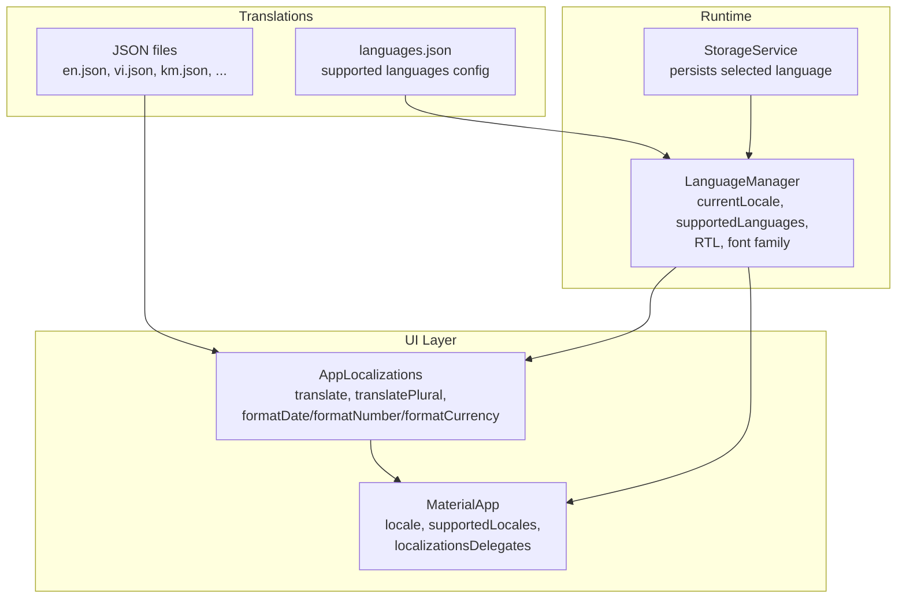
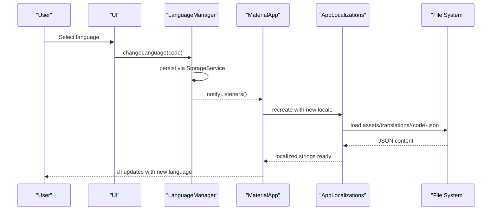
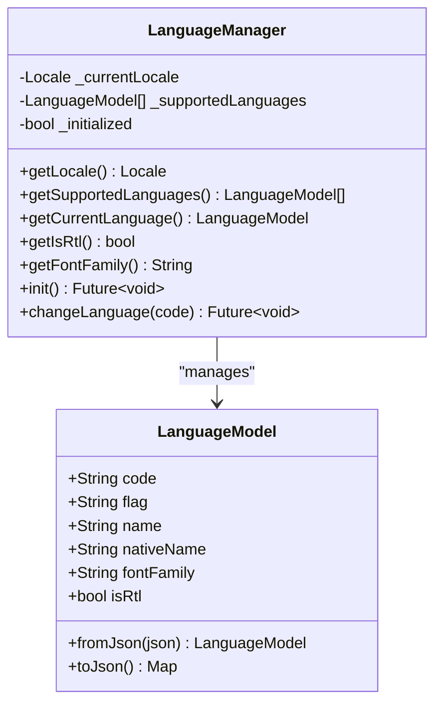
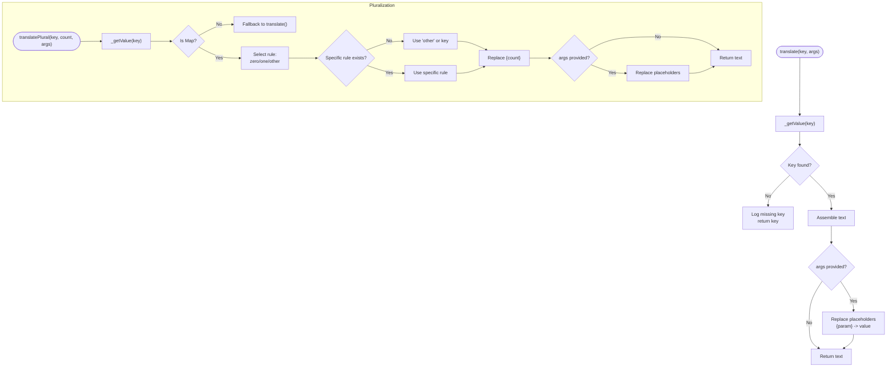
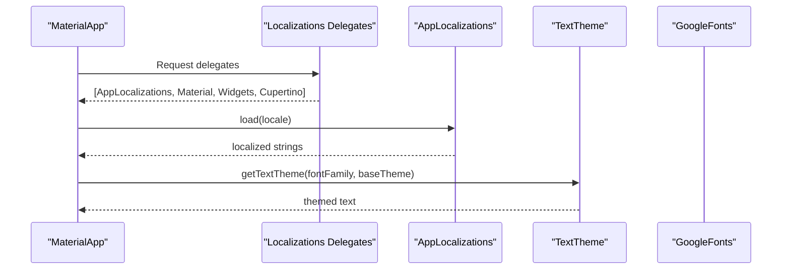
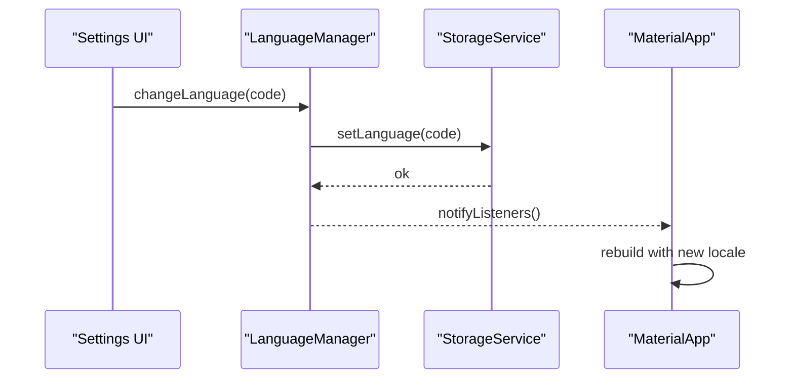
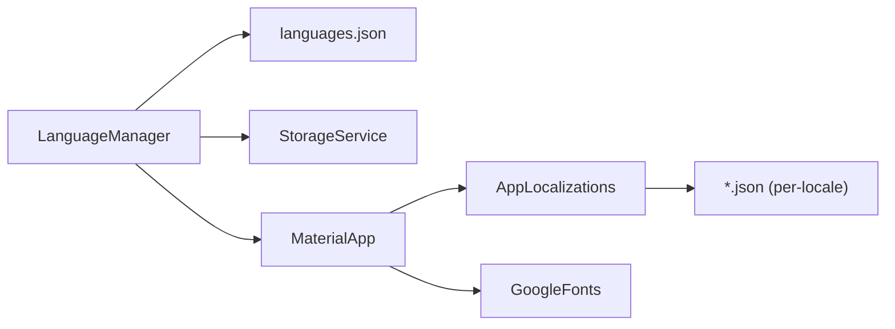

# Internationalization and Localization

<cite>
**Referenced Files in This Document**
- [main.dart](file://lib/main.dart)
- [app_localizations.dart](file://lib/l10n/app_localizations.dart)
- [language_manager.dart](file://lib/l10n/language_manager.dart)
- [language_model.dart](file://lib/l10n/models/language_model.dart)
- [storage_service.dart](file://lib/services/storage_service.dart)
- [languages.json](file://assets/translations/languages.json)
- [en.json](file://assets/translations/en.json)
- [vi.json](file://assets/translations/vi.json)
- [km.json](file://assets/translations/km.json)
</cite>

## Table of Contents
1. [Introduction](#introduction)
2. [Project Structure](#project-structure)
3. [Core Components](#core-components)
4. [Architecture Overview](#architecture-overview)
5. [Detailed Component Analysis](#detailed-component-analysis)
6. [Dependency Analysis](#dependency-analysis)
7. [Performance Considerations](#performance-considerations)
8. [Troubleshooting Guide](#troubleshooting-guide)
9. [Conclusion](#conclusion)
10. [Appendices](#appendices)

## Introduction
This document explains the internationalization (i18n) and localization (l10n) system used by the application. It covers dynamic language switching, locale detection, font family management, translation loading via JSON, string interpolation, pluralization rules, AppLocalizations integration, supported language configuration, right-to-left (RTL) language support, translation key organization, fallback mechanisms, missing translation handling, and integration with the UI theming system and responsive design considerations.

## Project Structure
The i18n system is organized around three main layers:
- Language management: runtime selection, persistence, and RTL/font family handling
- Translation loader: JSON-based translation files and formatting utilities
- UI integration: Material/Widgets/Cupertino localizations delegates and theme integration

**Diagram sources**
- [main.dart:90-127](file://lib/main.dart#L90-L127)
- [language_manager.dart:10-111](file://lib/l10n/language_manager.dart#L10-L111)
- [app_localizations.dart:8-167](file://lib/l10n/app_localizations.dart#L8-L167)
- [storage_service.dart:291-293](file://lib/services/storage_service.dart#L291-L293)
- [languages.json:1-67](file://assets/translations/languages.json#L1-L67)

**Section sources**
- [main.dart:90-127](file://lib/main.dart#L90-L127)
- [language_manager.dart:10-111](file://lib/l10n/language_manager.dart#L10-L111)
- [app_localizations.dart:8-167](file://lib/l10n/app_localizations.dart#L8-L167)
- [storage_service.dart:291-293](file://lib/services/storage_service.dart#L291-L293)
- [languages.json:1-67](file://assets/translations/languages.json#L1-L67)

## Core Components
- LanguageManager: central controller for language state, RTL detection, font family selection, and persistence
- AppLocalizations: loads JSON translations, supports nested keys, interpolation, pluralization, and locale-aware formatting
- StorageService: persists the selected language code
- languages.json: declares supported languages, flags, names, font families, and RTL flags
- Translation JSON files: per-language content keyed by dot notation

Key capabilities:
- Dynamic language switching with real-time rebuild
- Nested translation keys (e.g., "common.app_name")
- Parameter interpolation (e.g., "{count}", "{name}")
- Pluralization with zero/one/other rules
- Locale-aware date/number/currency formatting via intl
- Fallback to Vietnamese when a language file is missing
- RTL language support with direction-aware UI integration

**Section sources**
- [language_manager.dart:10-111](file://lib/l10n/language_manager.dart#L10-L111)
- [app_localizations.dart:8-167](file://lib/l10n/app_localizations.dart#L8-L167)
- [storage_service.dart:291-293](file://lib/services/storage_service.dart#L291-L293)
- [languages.json:1-67](file://assets/translations/languages.json#L1-L67)

## Architecture Overview
The system integrates at the MaterialApp level and reacts to LanguageManager changes. The theme adapts to the selected font family, and translations are resolved through AppLocalizations.

**Diagram sources**
- [main.dart:90-127](file://lib/main.dart#L90-L127)
- [language_manager.dart:89-110](file://lib/l10n/language_manager.dart#L89-L110)
- [app_localizations.dart:21-41](file://lib/l10n/app_localizations.dart#L21-L41)
- [storage_service.dart:291-293](file://lib/services/storage_service.dart#L291-L293)

## Detailed Component Analysis

### LanguageManager
Responsibilities:
- Load supported languages from languages.json
- Initialize locale from persisted storage or default to Vietnamese
- Provide current language metadata (font family, RTL flag)
- Change language dynamically and persist the selection
- Notify listeners for UI rebuild

Implementation highlights:
- Uses ChangeNotifier for reactive UI updates
- Validates language code against supported list
- Falls back to predefined list if config parsing fails
- Exposes isRtl and fontFamily for UI/theme adaptation

**Diagram sources**
- [language_manager.dart:10-111](file://lib/l10n/language_manager.dart#L10-L111)
- [language_model.dart:2-44](file://lib/l10n/models/language_model.dart#L2-L44)

**Section sources**
- [language_manager.dart:10-111](file://lib/l10n/language_manager.dart#L10-L111)
- [language_model.dart:2-44](file://lib/l10n/models/language_model.dart#L2-L44)

### AppLocalizations
Responsibilities:
- Load translation JSON for the current locale
- Resolve nested keys via dot notation
- Interpolate parameters into strings
- Support pluralization with zero/one/other rules
- Provide locale-aware formatting for dates, numbers, and currencies
- Fallback to Vietnamese when a translation file is missing

Key behaviors:
- load(): attempts to load {locale.languageCode}.json; falls back to vi.json; logs errors
- translate(): resolves nested keys and replaces placeholders
- translatePlural(): selects rule based on count and applies fallback to "other"
- formatDate/formatNumber/formatCurrency(): use locale string with fallback to "vi"

**Diagram sources**
- [app_localizations.dart:46-118](file://lib/l10n/app_localizations.dart#L46-L118)
- [app_localizations.dart:63-74](file://lib/l10n/app_localizations.dart#L63-L74)

**Section sources**
- [app_localizations.dart:8-167](file://lib/l10n/app_localizations.dart#L8-L167)

### UI Integration and Theming
Integration points:
- MaterialApp.locale and supportedLocales are driven by LanguageManager
- localizationsDelegates include AppLocalizations and Flutter’s Material/Widgets/Cupertino delegates
- AppTheme is adapted to the selected font family via Google Fonts integration
- ListenableBuilder ensures the app rebuilds when the language changes

**Diagram sources**
- [main.dart:90-127](file://lib/main.dart#L90-L127)
- [app_localizations.dart:169-189](file://lib/l10n/app_localizations.dart#L169-L189)

**Section sources**
- [main.dart:90-127](file://lib/main.dart#L90-L127)
- [app_localizations.dart:169-189](file://lib/l10n/app_localizations.dart#L169-L189)

### Supported Languages and Configuration
Supported languages are declared in languages.json with:
- code: BCP 47 language code
- flag: emoji flag
- name: English name
- nativeName: native name
- fontFamily: font family name
- isRtl: boolean indicating right-to-left layout

The system validates the stored language code against this list and falls back to Vietnamese if invalid.

**Section sources**
- [languages.json:1-67](file://assets/translations/languages.json#L1-L67)
- [language_manager.dart:67-75](file://lib/l10n/language_manager.dart#L67-L75)

### Translation Files and Keys
Translation files are structured as JSON objects with dot-notation keys:
- Example keys: "common.app_name", "nav.home", "settings.section_lang"
- Pluralization keys are objects with "zero", "one", "other" sub-keys
- Interpolation placeholders use braces: "{count}", "{name}"

Examples of keys present in the repository:
- Common UI strings: "common.search", "common.cancel", "common.confirm", "common.save", "common.loading", "common.error", "common.retry", "common.success", "common.back", "common.next", "common.done"
- Pluralization examples: "common.stars_count", "common.remaining_days", "common.days_count"
- Navigation: "nav.home", "nav.learn", "nav.games", "nav.library", "nav.profile"
- Settings: "settings.title", "settings.select_lang", "settings.search_lang"

**Section sources**
- [en.json:1-704](file://assets/translations/en.json#L1-L704)
- [vi.json:1-704](file://assets/translations/vi.json#L1-L704)
- [km.json:1-704](file://assets/translations/km.json#L1-L704)

### Dynamic Language Switching Workflow

**Diagram sources**
- [language_manager.dart:89-110](file://lib/l10n/language_manager.dart#L89-L110)
- [storage_service.dart:291-293](file://lib/services/storage_service.dart#L291-L293)
- [main.dart:96-127](file://lib/main.dart#L96-L127)

**Section sources**
- [language_manager.dart:89-110](file://lib/l10n/language_manager.dart#L89-L110)
- [storage_service.dart:291-293](file://lib/services/storage_service.dart#L291-L293)
- [main.dart:96-127](file://lib/main.dart#L96-L127)

### Right-to-Left (RTL) Language Support
- languages.json includes isRtl for each language
- LanguageManager exposes isRtl for consumers
- While the repository does not show explicit RTL layout toggles, the isRtl flag enables downstream UI decisions (e.g., text direction, padding adjustments) in widgets that consume this property

**Section sources**
- [languages.json:59-65](file://assets/translations/languages.json#L59-L65)
- [language_manager.dart:40-41](file://lib/l10n/language_manager.dart#L40-L41)

### Font Family Management
- languages.json defines fontFamily per language
- LanguageManager exposes fontFamily
- AppLocalizations.getTextTheme integrates with Google Fonts to apply the selected font family to the app’s text theme

**Section sources**
- [languages.json:7-8](file://assets/translations/languages.json#L7-L8)
- [languages.json:15](file://assets/translations/languages.json#L15)
- [languages.json:31](file://assets/translations/languages.json#L31)
- [language_manager.dart:43-44](file://lib/l10n/language_manager.dart#L43-L44)
- [main.dart:113-118](file://lib/main.dart#L113-L118)

### Translation Key Organization and Fallback Mechanisms
- Keys are grouped by functional areas (e.g., "common", "nav", "settings", "learn", "games", "library", "profile", "achievements", "tasks", "leaderboard", "shop", "game_catch_letter")
- Nested keys enable hierarchical organization
- Fallback behavior:
  - On load failure, attempts to load vi.json
  - On critical failure, logs error and returns empty map
- Missing translation handling:
  - translate() returns the key itself when a translation is missing
  - translatePlural() logs missing keys and returns the key or falls back to "other"

**Section sources**
- [app_localizations.dart:21-41](file://lib/l10n/app_localizations.dart#L21-L41)
- [app_localizations.dart:46-60](file://lib/l10n/app_localizations.dart#L46-L60)
- [app_localizations.dart:83-118](file://lib/l10n/app_localizations.dart#L83-L118)

### Pluralization Rules
- Pluralization keys are objects with "zero", "one", "other" sub-keys
- Selection logic:
  - count == 0 → "zero"
  - count == 1 → "one"
  - otherwise → "other"
- Fallback: if the specific rule is missing, falls back to "other"; if "other" is missing, returns the key

**Section sources**
- [app_localizations.dart:83-118](file://lib/l10n/app_localizations.dart#L83-L118)

### String Interpolation Patterns
- Placeholders in translation strings use braces: {param}
- translate() replaces placeholders with provided args
- translatePlural() additionally replaces {count} automatically and then applies args

**Section sources**
- [app_localizations.dart:54-59](file://lib/l10n/app_localizations.dart#L54-L59)
- [app_localizations.dart:108-117](file://lib/l10n/app_localizations.dart#L108-L117)

### Locale-Aware Formatting
- formatDate(), formatNumber(), formatCurrency() use the current locale
- Fallback to "vi" if locale string initialization fails

**Section sources**
- [app_localizations.dart:126-166](file://lib/l10n/app_localizations.dart#L126-L166)

## Dependency Analysis

**Diagram sources**
- [language_manager.dart:50-75](file://lib/l10n/language_manager.dart#L50-L75)
- [main.dart:90-127](file://lib/main.dart#L90-L127)
- [app_localizations.dart:21-41](file://lib/l10n/app_localizations.dart#L21-L41)

**Section sources**
- [language_manager.dart:50-75](file://lib/l10n/language_manager.dart#L50-L75)
- [main.dart:90-127](file://lib/main.dart#L90-L127)
- [app_localizations.dart:21-41](file://lib/l10n/app_localizations.dart#L21-L41)

## Performance Considerations
- Translation files are loaded synchronously on demand; consider caching loaded maps if frequent switching occurs
- Using Google Fonts per locale may incur network overhead; ensure appropriate caching and preloading strategies
- Keep translation keys concise and avoid deeply nested structures to reduce traversal cost
- Limit the number of pluralization variants to essential ones to minimize branching

## Troubleshooting Guide
Common issues and resolutions:
- Missing translation key:
  - Behavior: translate() returns the key; translatePlural() logs and returns key or "other"
  - Resolution: Add the key to the appropriate JSON file or ensure the key path is correct
- Language file not found:
  - Behavior: load() attempts vi.json fallback; logs errors if both fail
  - Resolution: Verify asset inclusion and file naming; ensure languages.json lists the language
- Invalid language code:
  - Behavior: changeLanguage() ignores unsupported codes and logs a warning
  - Resolution: Confirm the code exists in languages.json and is correctly persisted
- RTL layout not applied:
  - Behavior: isRtl is exposed; actual UI direction depends on consuming widgets
  - Resolution: Ensure widgets respect the isRtl flag for text direction and layout mirroring

**Section sources**
- [app_localizations.dart:21-41](file://lib/l10n/app_localizations.dart#L21-L41)
- [app_localizations.dart:46-60](file://lib/l10n/app_localizations.dart#L46-L60)
- [language_manager.dart:93-98](file://lib/l10n/language_manager.dart#L93-L98)

## Conclusion
The application’s i18n system provides a robust foundation for multilingual support:
- Dynamic language switching with persistence and real-time UI updates
- Flexible translation loading via JSON with nested keys and interpolation
- Pluralization and locale-aware formatting
- Configurable font families and RTL support
- Clear fallback and error-handling strategies

## Appendices

### How to Add a New Language
Steps:
1. Add a new JSON file in assets/translations with the language code (e.g., fr.json)
2. Populate translation keys aligned with existing structure
3. Update languages.json with the new language entry (code, flag, name, nativeName, fontFamily, isRtl)
4. Restart the app; the new language should appear in the language selector

**Section sources**
- [languages.json:1-67](file://assets/translations/languages.json#L1-L67)

### How to Add Translated Strings
- Edit the appropriate language JSON file (e.g., en.json, vi.json, km.json)
- Use dot notation for keys (e.g., "common.app_name")
- For pluralization, define "zero", "one", "other" sub-keys
- For interpolation, use placeholders like {count}, {name}

**Section sources**
- [en.json:1-704](file://assets/translations/en.json#L1-L704)
- [vi.json:1-704](file://assets/translations/vi.json#L1-L704)
- [km.json:1-704](file://assets/translations/km.json#L1-L704)

### Handling Dynamic Content Localization
- Use AppLocalizations.translate() or the context extension helpers
- For pluralized counts, use translatePlural() with count and optional args
- For locale-aware formatting, use formatDate(), formatNumber(), formatCurrency()

**Section sources**
- [app_localizations.dart:46-118](file://lib/l10n/app_localizations.dart#L46-L118)
- [app_localizations.dart:126-166](file://lib/l10n/app_localizations.dart#L126-L166)

### Responsive Design and Typography
- The theme adapts to the selected font family via Google Fonts
- Consider adjusting spacing and typography scales per language for readability
- For RTL languages, mirror paddings and alignments in custom widgets

**Section sources**
- [main.dart:113-118](file://lib/main.dart#L113-L118)
- [languages.json:7-8](file://assets/translations/languages.json#L7-L8)
- [languages.json:15](file://assets/translations/languages.json#L15)
- [languages.json:31](file://assets/translations/languages.json#L31)
- [languages.json:47](file://assets/translations/languages.json#L47)
- [languages.json:55](file://assets/translations/languages.json#L55)
- [languages.json:63](file://assets/translations/languages.json#L63)